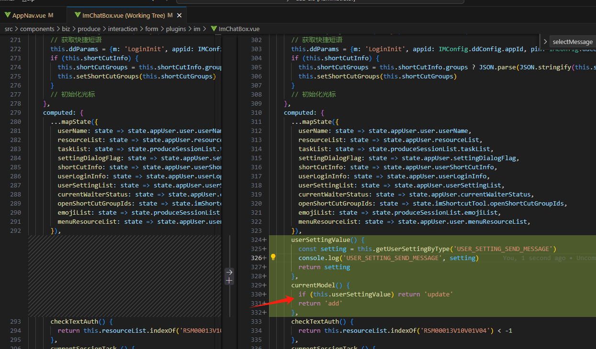
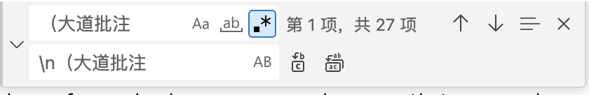
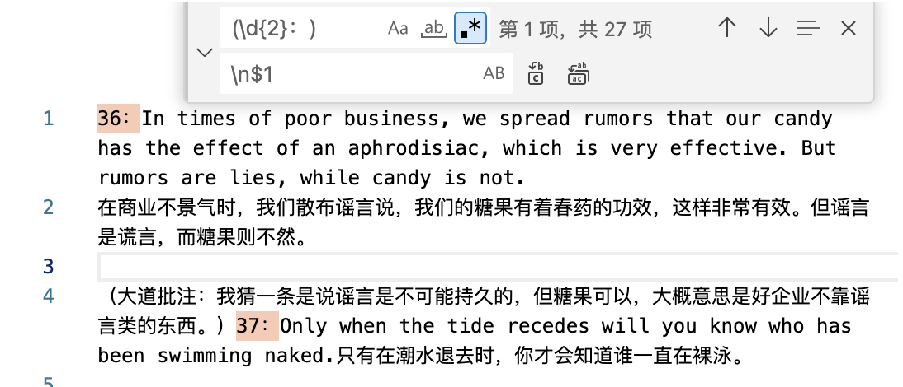

### 空格复制
　　我是空格

### 图片导入写法

### 怎么生成目录解构
1. 需要先安装插件Markdown All in one，已安装
2. 在想要插入目录的地方 快捷键Ctrl+Shift+P
3. 然后在弹出的框里面输入TOC，选择命令create table of contents就完成了目录生成
4. 如果想要导出为Html页面的话，在弹出的框里面输入html，选择print current document to HTML

### 文件名不能加？等特殊字符，否则在win上下载会出错

### 文字样式
粗体：**粗体** 或 __粗体__ → 粗体

斜体：*斜体* 或 _斜体_ → 斜体

粗斜体：***粗斜体*** → 粗斜体

~~删除线~~：~~删除线~~ → ~~删除线~~
没有下划线，若仅强调，建议用粗体或斜体

行内代码：`代码` → 代码

### 引用块，用 > 表示引用
> 这是引用内容

### markdown增加表格

| 表头1 | 表头2 | 表头3 |
|-------|-------|-------|
| 单元格1 | 单元格2 | 单元格3 |
| 单元格4 | 单元格5 | 单元格6 |

### 任务列表
用 - [ ] 或 - [x] 表示未完成/已完成：
- [x] 完成任务
- [ ] 待办事项

替换全部空行
查找: ^\s*\r?\n 或 ^\s*$\r?\n?（第二个表达式考虑到了文件可能以一个空白行结尾的情况，不过VSCode的行为可能会有所不同，需要实验确定）

替换全部折行
\s*(?=\r?$)\n  

### 诉求如下，想在（大道批注前换行
数专业投资大师的业绩！（大道批注：老巴说的是美国的指数基金。）

### 匹配动态数字并添加前缀 动态匹配替换，
效果：123abc45 → e123abce45
查找：(\d+)
替换：e$1

- 保留原内容并插入字符
查找：(name): (.*)  
替换：$1: "value_$2"  
效果：age: 25 → age: "value_25"

> 常用场景在所有序号前换行，序号是动态的

