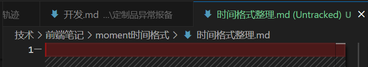

眼镜值得我做一个专题总结下，
宝宝的眼镜要注意哪个方面，
每个参数代表什么，比如折射率真的有必要越高越好吗
搜知乎，和二小姐，看有没有坑要预防。
镜架要注意什么。

### 重要不紧急
如何在debugger中搜索一个文件

整理用户轨迹的聊天记录，看先后都遇到哪些问题，如何规避这些问题

1.列好下周任务，这个事下午项目经理都会看，上午必须创建完成，否则会被拉到C2那边晒，避免麻烦这个事还是要上点心。如果可以周五可以自己创建完成，没有卡片可以建在别的需求上

话务条需求的教训：
不要着急将融合版的代码迁过去，一定要确认了没问题了才行，否则会来回动，测试说大概好了迁移了一次，评审代码要再相互迁移一次，修改测试说的一点结尾又迁移了一次，三次就能搞一天，所以不是一句代码的事情，一句代码也能搞好久

代码评审要在测试之前

### 怎么算一个好的产品文档，
比如涉及到列表查询，哪个必传，要写上，涉及到时间查询，是按天查询还是按照秒查询？
详情页面涉及到哪个接口，接口是否好了，什么时候好，

松哥说了，你开发代码没问题，但协调不行，你得拉下服务端，看服务端有没有排期，有几个接口，都对齐了才行动，
统筹的能力，别说这是产品要考虑的，不要把想的那么牛逼，都很菜的。
你的弱点是拿到需求，上来就做，都不和后端沟通的，这样不行

比如用户轨迹的需求，一开始以为一个列表，一个详情，以为直接返回就行了，做着做着详情返回不了了，要接口查，又做着
你还评估2天，应该4天的，ui4和ui5同步不要时间吗，配合测试也要时间的。

tab size 是什么意思

