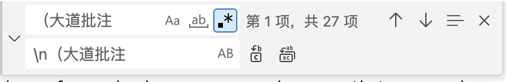

### 空格复制
　　我是空格

### 图片导入写法

### 怎么生成目录解构
1. 需要先安装插件Markdown All in one，已安装
2. 在想要插入目录的地方 快捷键Ctrl+Shift+P
3. 然后在弹出的框里面输入TOC，选择命令create table of contents就完成了目录生成
4. 如果想要导出为Html页面的话，在弹出的框里面输入html，选择print current document to HTML

### 文件名不能加？等特殊字符，否则在win上下载会出错

### markdown增加表格

| 表头1 | 表头2 | 表头3 |
|-------|-------|-------|
| 单元格1 | 单元格2 | 单元格3 |
| 单元格4 | 单元格5 | 单元格6 |