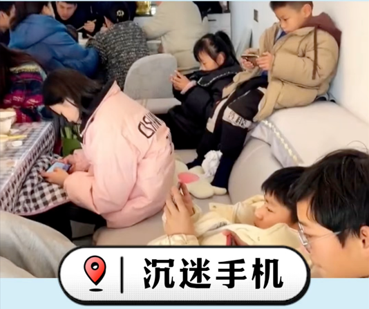

<video src="assets/2877_1722860741.mp4" autoplay controls></video>

其实玩手机是最耗费精力的，低个头得耗费体力吧，然后他像一个魔鬼一样将你的精力吸走

### i have a dream
我想要像陈启宗一样，年纪大了不是被送去养老院，毫无用处，而是还能发挥余热，在讲台上谈笑风生
我想要像段永平一样，终身学习，老了还能发挥余热
彬彬说多聚，我多希望自己确实有本事
现英叔叔说，帅超卖过糖葫芦，你们谁能卖糖葫芦，心中自豪感陡升，告诉自己一定要混出个人样来，不论多大的困难
李景芳在纸上写下一行字，你不一样。然后抬头看了看我，那种感觉怎么形容，有初恋的感觉。为什么我和别人不一样，我想是我懂得反思吧

现在是最好的状态，一个月见一次面，千万不要低估邪恶，还曾记否因为你说了句“彬彬和我有啥关系，我又不认识他”。她立马翻脸了，怎么都哄不好，最后和我家人吵了一架。所以要耐得住寂寞。修炼自己，这是你最好的状态。
腾飞请吃饭，我都没说几句话。反倒是彬彬主动和你说话，以为你很靠谱，实际上烂透了，我要私底下努力才行。

今天坐地铁时看到一个全神贯注闭目养神的姑娘，地铁全程都没睁开眼，那是怎样一种高贵的精神，一看就不一样，我也要达到那种精神，傲然独立于世间，没有人能影响我的心境。如果能练至大成，结果肯定不一样。

