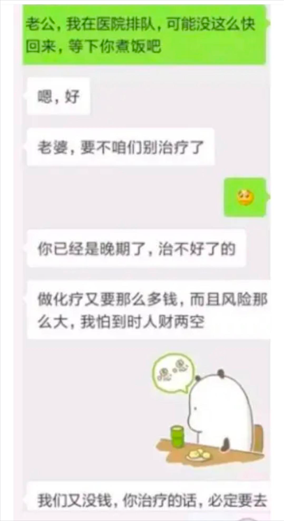
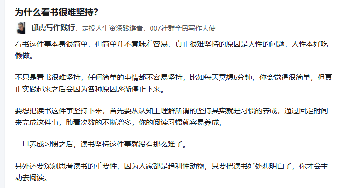

### 等级1
1.段永平反复唠叨：要做对的事情，要把事情做对，不对的事情不做，做对的事情慢就是快。欲速则不达

在做与不做之间，是一条深渊，是不可跨越的，没有模糊的余地

2.手机和知乎没什么好看的，手机都是写老生常谈，知乎也都是些意淫，举例：1.大S去世了，汪小菲蹭流量，2.deepseek  3.美国特朗普和马斯克。都看过了，没必要每次都看

3.芒格说，当我遇到问题是，我选择迎上去，而不是逃避他，这是我获取快乐的根源。
4.芒格说：如果知道我将死在哪里，我永远不去那里，同样，你可以先预猜下这样做会有什么后果，那就提前杜绝了，

5.你不是说我是个完美主义者，有一点的瑕疵就会破罐子破摔，那好现在证明你是完美主义者的时候到了。

我认为投资应该少看新闻，股票低了买就对了，比如疫情前本来有机会抄底的，看了新闻说还没到底，又赎回了，再比如a股在2800点徘徊的时候，媒体一篇唱衰的声音，什么股民人数创新低，什么割韭菜等等，导致人都不敢进场，只有段永平在加仓，现在又是股市重估，一片唱好的声音，所以呢，低了买就对了，不要相信媒体

现英叔叔说，帅超卖过糖葫芦，你们谁能卖糖葫芦，心中自豪感陡升，告诉自己一定要混出个人样来，不论多大的困难

终于更深刻的明白了复利的含义，复利就是每天留时间给自己，进步一点点，类似于滚雪球(刚开始滚起来很容易，最后会大到你滚不动)，最后产生的能量是很大的

发现这个太重要了，每天多学习2个小时就是我的秘密武器，是我充满自信的来源

1.你不是喜欢赚钱吗，当你控制住自己一天没看手机，并且只做对的事情，把事情做对，默默告诉自己你今天又多赚了100块钱，那是多么充实

3.每天上班前两个小时要看下面试题，很多题不看就忘了，现在还得从头记起，只有每天看才能产生复利，理解越来越深，就不怕找工作了，随便怎么问

4.最近任务不太忙，就一边看手机一边做功能，吊儿郎当的，不要这样啊，薛帅超，真实的生活充满了血与泪，我要一刻都不能放松，每一刻都要问自己该不该做，任何时候都不能懈怠啊[流泪][流泪]

克里斯在献血后对儿子克里斯托弗说：别人自己办不到的事情，他们会说你也不行，任何时候都不要对自己说不行，句号

有人问，不去玩手机的动力是什么，我总得有个拿的出的理由

1.韧，看向窗外，想象那里有一座高塔，上边写着一个“忍”字，塔上还有一个漂亮的房子，那时我的目标

2.每当我骑车去图书馆时，看到进京的一个个好房子，我好想买好房子给我的家人

5.为什么你看别人能那么轻易找到好工作。还时常笑口常开，举重若轻。为什么雷军那么大老板还笑口常开，因为对人家来说真的压力没那么大，人家就是让自己保持无聊。不看手机，每天正常工作，复利，仅此而已。想想，如果我每天把看手机时间都用来学习，每天进步一点点，长久看已经站上很高的台阶了。找工作自然很容易。你时常焦虑，就是因为平时没努力，所以觉得面试好难

### 原则
雷军，俞敏洪都是6点就起床了，你怎么能睡到8点呢，要早些起床。长久看就会产生复利，增加自信，从现在就开始改变
对啊，只周末多学一点，太慢了，每天都要多学一点

发现这个太重要了，每天多学习2个小时就是我的秘密武器，是我充满自信的来源

### 人最大的风险是什么都不做，当你老了，你后悔的是没做过什么

想获得终极的快乐吗，那就去工作把，不要沉迷于工作间隙看知乎的快乐，那只是短暂的快乐，不如你忙碌一天后，按时下班时的充实感更爽，到这时候，我没有别的，只有一条烂命和一个时刻忙碌的背影

间歇性的满足，才会导致成瘾，所以对于玩手机，我干脆就不看了，什么时候都不看，这样效果最好

做一个终身学习的人，先将自己变成一个优秀的人，让自己配得上，钱才会来，很多老板想重金求人才，巴菲特的第一个好习惯就是每天阅读4个小时。如果你不知道该做什么，那就看巴菲特和段永平的书和视频好了

我总是害怕暴漏问题，比如reopen的需求，做的时候总是不敢点，生怕发现问题，结果到了提测时，发现提交的数据不对，耽误提测进度。如果在开发中发现这个问题早就解决了。所以不要试图掩盖问题，要蹂躏你的项目，点过来点过去保证不出错，慢就是快
到了测试完要上灰度时，召松发现我将initialvalue给重新赋值了，说不能这样写，又改了一顿，这意味着又要测试一遍，其实这个点我知道，想着功能没问题，review代码时就没说，结果要上灰度时召松发现了这块。所以说慢就是快

所以要坦诚，将自己的想法暴露给别人，接收别人的检验。提前发现所有的错误。不要试图去掩盖问题，到了最后再回来改，那样代价更大。
如何避免这个问题，严格按照测试用例，做好自测。可能会出问题的地方，一定会出问题。

生活中我自从买房后，就不想去看贝壳了，不想去看拙勇堂群里的消息，听到真正二小姐发的关于股市和房产赚钱的文章。会不想了解，想逃避痛苦，不想知道世界的真相。这是弱者的行为。

问题是客观存在的，你看或不看，问题就在那里，不能将头埋在沙子里，假装问题看不见。先将问题暴漏出来，能不能解决再说，并且多行动，才有可能减少内耗。这是逃避痛苦的唯一方法。

今天是周一，六点钟从燕郊出发，走通燕高速，7点多到了公司，这是第一次早上走高速，地图上显示要收费，我也吃不准，因为说是7-9点收费，正当我不知道该如何时，想着干就完了，到那儿一看果然不收费。所以说当你迷茫时，去行动就对了。

### 行动是减少内耗的唯一方法
欧神说，提高执行力，最最关键的是迈出第一步，是第一次冒风险，很多人什么都懂，就是迟迟迈不出第一步，所以这是人性，不是学问

我发现自己韭性太大，老是心甘情愿的被收割，这就是取悦别人的心态，买房时这样，爸盖房时是这样，在好未来拿工资时又是这样，而腾达则正好相反。是分毫必争，以后再遇到韭性的事，找腾达确认下

要始终充满正念，建立正向思维，永远想到的是方案，解决办法，不要反向思考。多说要去做什么，少说不要去做什么
突然整理文章开窍了，表达完意思即可，不要废话，不要重复陈述

### 工作时的态度
你得有进取心，有个问题想问浩宇，看他要出门，就想着等回来问也行，于是就这么耽搁了，等他回来了，又有个线上问题需要处理，然后我还得等着，严重影响了我的进度。我不管你去干嘛，只要目标坚定，一切都会为我让路

当你觉得一件事情可问可不问时，大胆去问，否则你会一直想着。比如召松告诉我要注意抽屉的问题，我当时不知道为啥，等发现后想着要不要和他确认下，想着肯定是不用确认了，但时候一直想这件事，要不要确认下。

===================可看可不看===================================

复利体现最充分的还是思想的复利，每天养成好的习惯，10点睡觉，6点起床，认真工作学习，不玩手机，所产生的高贵是无以复加的
在学校学习，日复一日重复着枯燥的工作，就是在不断复利。每天不断听英语，持之以恒，也会产生复利
姐夫在一个公司干很久，也是在不断的复利，
中国的和平发展也是在不断产生复利
每天磨砺精神，看些很好的书，也是在复利
我要把复利告诉宝宝，练习书法要每天练习，要慢，持之以恒，练篮球也是，要慢，每天练习，
学习也是，每天坚持学习，产生复利。
工作也是，每天认真工作，对业务了解越来越熟悉
