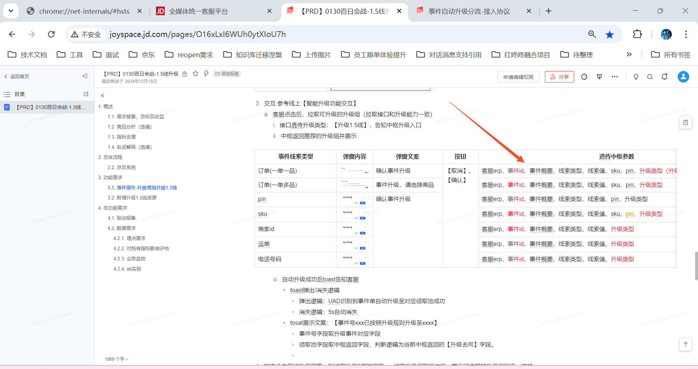
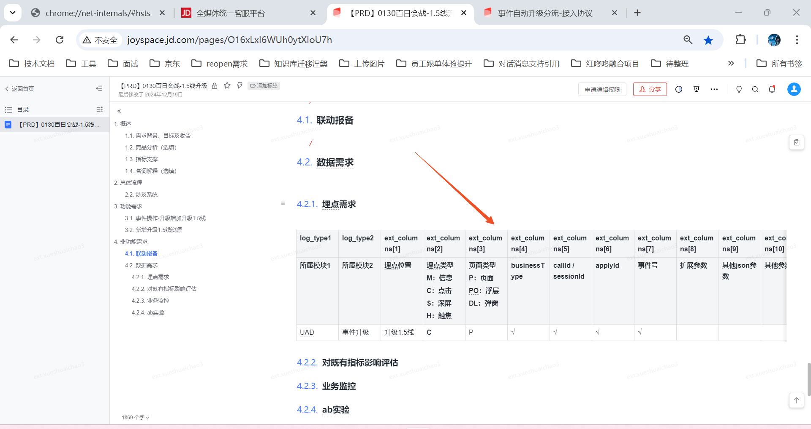

reopen需求到测试时才发现两个遗漏点，1.enableExtendCheck是什么用，2.诉求的回显之前重构了一版但没测，因为不太好复现，想着让测试测吧，等出了问题自己再改
针对1.
其实我之前意识到了，但想着不耽误现在的流程，就没管，到测试后期其他都做完了，就顺便问了测试一嘴，发现还是有用的，就是扩展概要的功能，这块要不要做，姚宇又不在，等他来了才能和他商量，所以任何一个小点都要考虑到。
针对2.
自己不好复现，就留给别人复现，于是又多了一个bug，而且黄霞测试也不知道怎么复现，还得找姚宇，第二天我也得等姚宇来了才能复现，
2.1所以遇到困难不要绕过去，一次不行就两次，
2.2要知道哪些测过哪些没测过，已测过的东西，改了个小东西，自己还要反复测下，这么大的东西，改了流程，怎么就敢不测直接上呢，孰轻孰重要掂量清楚
2.3不要怕麻烦别人，我也要吃饭啊

### 测试复现的场景必须要在我这儿能复现，reopen的某个场景只在姚宇的电脑上能复现，这是不行的，他上午不来，一上午时间就浪费了，所以他不告诉你，你也要弄清楚怎么回事，要有自驱力，不要让别人推着你。

### 一定要多问别人，比如k-chat-record项目找不到，问了别人也不知道，最后打听到伟涛做过英文翻译项目，他说是通过一个插件安装的

### 我是怎么将自己逼到这步田地的，
我是怎么将自己逼到这步田地的，之前短链需求又加排了3天，但是和涅槃系统迁移联调的三天重复了，当时我就应该提出来，但我当时想着迁移那点事不难，不能要求太多，加加班就解决了。但现在涅槃联调将短链需求都占了。而且还不一定能弄完。那就得加班了。

排工期一定要认真，这是天大的事情，,不要想着靠加班来弥补工期，说自己忍一下得了。不对的

排工期时不要将加班考虑在内，因为总有别的事情让你加班，公司也没底线，工作做得完吗，多排几天怎么了，你未来是忙还是闲，排工期时就决定了。每天看下排期，如果不对及时调整。

养成提前将工期放到excel中的习惯，1是以后可能忘了，2是防止别人占用，就像我涅槃系统3天联调，如果我提前放里边，召松排的时候一看这儿已经有了，就会往后排，不要到时再说，一定要落实到行动上。
### 需求一定要具体到细节

比如1.5线的需求，服务的只给我说加个字段区分就行，但产品不这么认为啊，测试也不这么认为啊，所以不要想当然

埋点也是，我以为只在原来2线的基础上，加上1.5线的区分就行，但人家测试认为要有这些所有字段，所以做的时候，要从测试的角度来做

松哥说的很好啊，要拒绝产品，prd上没有的，就不做，不能后来再加，虽然加班可以解决，实际上是让我们为产品的失误买单，

评需求时要把所有问题提出来，摆到桌面上，不要藏着掖着，最后发现不是那么回事，
腾达让我拿被子，说拿一米五的，我想着盖被子，肯定越大越好。就没商量拿了个两米的，结果拿到燕郊，人家说不是用来盖的，是用来铺的，所以前期一定要沟通好，不要匆忙私自做决定
这和你骑摩托一样，转弯或变道前一定鸣笛，提前通知别人，让别人注意到你，不要突然变向，让别人措手不及，那肯定和你起冲突。虽然这样会打扰到别人，但没办法，这都是必要的沟通，总比产生误解要强。
所以这也是为什么会有下属多向上级汇报的说法，对于有疑问的不要自己拿注意，要事先通知别人。会来事

### 要主动推动任务
最近用户行为轨迹的需求说好本周一提测的，现在都周三了还没有，一是因为产品没有用心推动，二也是因为我也没有用心推动。因为还有一点结尾没弄，想着或许没那么重要，就这么一直搁着，昨晚召松突然问我用户轨迹需求怎么样了，我说可以提测，但还要产品建任务，我再催下，他说赶紧催啊，留着干啥呢
说明每一个任务你都要把自己当成是负责人的态度，抓紧推动。即便别人或许不用心，但你不能。1是因为还有上边，上边怪罪下来你也跑不了。2是一种工作态度，为自己以后的发展，要发挥主动性，不能一直被动去执行，要了解需求的具体进度，细节，不要说都是别人的事。
你可能会问有产品在，交给他就行了，我就不用关注了吧

就像什么时候上全量，还要我去问才行，为什么不是业务主动发起呢，那没办法，每一个人都是该需求的负责人

再比如上灰度和分支，代码有没有合并，该推动姚宇就抓紧推动，不要寄希望别人帮你推动，每个人都是负责人。

说明有时候不能当个甩手掌柜，把任务推动寄托到别人身上，那样自己会很被动。永远让别人推着你，

需求提测时整理几点：
产品：
业务：
测试：
后端：
是否涉及服务端：