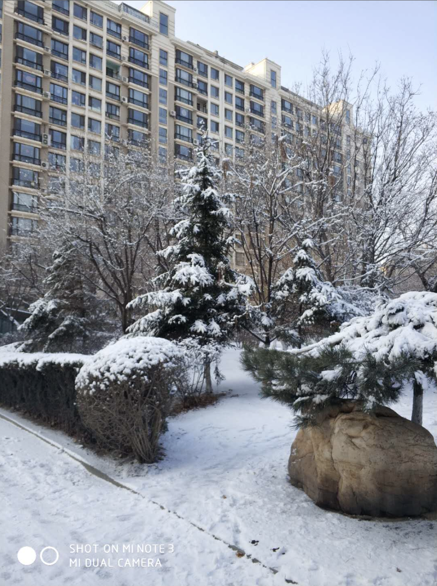
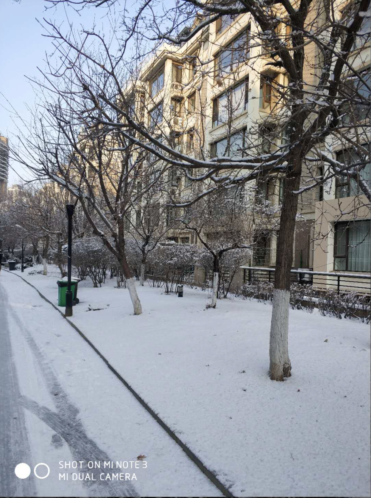
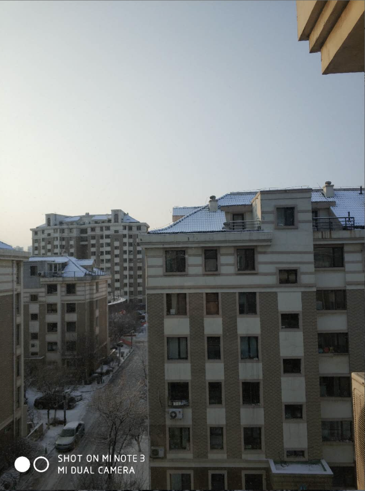

2.1
今天是月初，昨天晚上，吴增其来到沈阳，一起吃了顿饭，说是昨天晚上有150年来最大的血月，并有月食，所以晚上看了看，感觉也没啥值得看的，或者只有在天文望远镜看才能有所感受，
昨天喝了2两二锅头，甚是难喝，以后决定尽量少喝酒了，能少喝尽量少喝。昨天其实不想把那二两白酒喝完的，但觉得不太好，就一下子干了，其实你完全可以不喝完，没有那么多的规矩，想不喝就不喝了，也没有人强迫你喝。
还有，昨晚也告诉我要做的事情就赶紧做，我们要的是解决问题，而不是逃避问题。
昨晚本来睡觉前想上个厕所的，但因为自己懒不想起床，想着睡着就不用上了，于是就一直没有上，逼迫自己先睡觉，但奈何就是睡不着，到头来还是要上个厕所，所以以后不要逃避问题，而是要去解决问题。

2.2
快要放假了，想想这一年来自己经历了很多事情，有自己上半年年的颓废，有世超进入传销去解救，有好的，有坏的，我希望的下一年能够不负自己的内心。

我慢慢开始体会到生命是短暂的，每天都会有人死去，这时我不会再考虑什么事情该做，什么是不该做的，只要能想到的事情就去做吧，毕竟以后也不知道有没有机会了。就像以前还想着要不要去同学聚会，现在想来，不去就永远没有机会了。还是去吧。想着这个问题要不要问，在生命面前这点又算得了什么，如果觉得必须要问，尽管去问就是了，别犹豫。

2.3
今天 周六，按照规定又过来加班，但你是知道我的，即使说今天不用加班，我也是不会休息的。这很好，每当我早晨起来，因为自己起的晚而闷闷不乐，因为昨天没有学习好而闷闷不乐时，我都告诉自己，只有两件事会让自己不开心，一是没有工作，二是没有锻炼，这也告诉我不能懒床，立马起来工作。
今天吃早餐时，而然听到一股很尖刻的声音，一如赵敏响亮而剑客的声音，听到他好像是在下指示。最后要走时听到他说我们又一亿五千万的资产。我当时都震惊了，这么一个穿着不起眼的夫人，这么有钱。再联想到赵哥那无敌的技术，我知道了，有资本的人说话就是有底气。
赵哥的技术之好的令人畏惧，但因为这我就畏惧了吗，我要比的不是高度，而是前进的速度，无耐赵哥比我还用功。我可以忍受自己现在没有钱，但我不能忍受自己死去时，还是一无所有。我现在唯一的资本就是时间。我要将时间转化成金钱，转化成自己的能力。
时间就像流逝的江水，不论你在干什么，他都会毫不间断的流逝。不会因为说我现在在玩手机让时间过的慢点吧。所以假如说时间就像没有尽头的流水线，你可以随时往上放东西，也可以什么都不放。但当你人到暮年时，回头看看这一条流水线，看到中间又一大半都是空的，你会有什么感想。会埋怨自己当初的愚蠢吗。既然时间怎么都是过。你玩手机也是过，工作也是过，学习也是过，睡觉也是过。那么我为什么不选择有意义的事情过呢，这样还能让自己开心。

我房间的灯坏了，好久都没修。我想不能再这样拖着了，是自己的责任就要勇于承担，该花的钱没办法。于是我今天出了大门，想找一个灯具店，结果没有。只有门口的一个小超市。我在想这里边能修灯吗，还纠结了好一会，最后打定主意去问问吧。一问果然不修灯，但给了我物业的电话，让我打电话，这就很好啊。这就告诉我做什么事不要畏惧不前，要敢于尝试，即使又1%的可能想，我也要去试一试。只有试过才不会让自己后悔。不然你事后还会一直念着这个事情。

2.4
今天周日，我又一次战胜了自己，把头发给理了。很后悔，下午来到办公室，什么都没干，一看已经下午6点了，天都已经黑了，我再那里坐着，手足无措。想写一个案例，但时间已经不够了，于是又玩起了手机，想着既然都这么晚了，不如再玩一会儿吧，即使我知道这样是不对的。
其实我错了，就算真的没事可干，我宁愿自己在哪儿发呆，要知道发呆是非常奢侈和宝贵的，比你在那儿玩手机强多了。或许你能找到事情做呢，
快要放假了，再来了之后，就要你一个人写售卖机的项目，我不想你到那时候还不会写动效。
时间就像江河里的水，无论你干什么他都会照样流过，你可以让时间承载你奋斗的身影，也可以让时间承载你玩手机的背影。全在你自己，选择对了，就是赚到。
今天本来想把卧室的灯修一下，但找了两个修理工都说修不了，只能换新的，但奈何刘哥不同意，所以只能让修理工无功而返了，顺便还骂了我一顿，毕竟让人家无功而返了，对此我也没办法。通过这件事，我感受到刘哥是非常犀利的。不会顾及你任何事情，我再次感受到结果导向的重要性。本来想让刘哥帮我看着，我先去上自习了，回来后把修理电灯的钱给他，但他却说自己昨晚回来玩，让我自己回来处理这件事，这时实话，没办法，我又自己回去灯电工来，这件事告诉我做什么事情都不能依赖别人。以结果为导向，别人不会看你有什么理由，只关心的有没有完成任务。同样如果你工作提前做完了，你可以干别的事情，没有人管你。这么说的话，我可以提前把工作做完，这样我就自由了，就可以干自己的事情了。注意：不要提前做完，因为工作是没有尽头的。你要做的就是见缝插针，做你自己的事。
电工听到今天不修了，当场就不乐意了。爬上六楼，就得到这样的结果，顺便还数落我一番，我自己也十分委屈，我是想修的。但我又想，如果我是那个电工，我会生气吗，我想我不会。想起来一句话，人最大的区别，就是对自己情绪的控制，低级的人对请情绪的控制能力差，这几天我遇到了很多，去202拔牙的医生，在医院排队时因为我拿了她的身份证看了一下，就对我发火，还有今天的两个修灯的工人。但我和他们不一样，我能从他们身上学到教训，对任何事情都不要乱发脾气，我要做的就是奋斗，不能只发脾气而不去奋斗，这样只会外强中干。另外我之前说过对任何人都不要面露痛苦，这样会显示出自己的懦弱。但我又细细一想，这样做是不够的。我还要想心顺那样敢于展示自己。敢于上台演讲，敢于和别人聊天，讲笑话，做一个强大的人，做一个能为自己赢得机会的人。
今天我去一家羊汤馆吃饭。感觉吃着就像水煮羊杂，没有一丝盐味，碗又小，吃着很憋屈，而且还贵，期间听到他和另一位老板说，不赚钱，一天也没几个顾客，街上的饭店虽然多，但好吃的没有几家，我能找到的就是顺溜刀削面。很诧异。这也告诉我并不是你的工作不好，而是你要把自己工作做的足够好，自然会有人来。
今天我去理发，不出所料，又理了9毫米的发，我为自己的勇气而开心，因为在理发之前我还在纠结要不要理，或者说有没有人笑我或是怎么样，但当理了之后，我发现自己会好受很多，这是最重要的，毕竟，我的头发不是给别人看的。虽然价格比较贵28，但我觉得还可以吧，毕竟又不常理。一个小伙子帮我洗头，洗的很认真，还帮我按摩一下，果然价格贵了服务也好很多，这让我想起了熊超，毕竟以前他也在理发店洗过头，但现在人家已经买房了，所以我们不应该小瞧任何一个人，同时我觉得很温馨，感叹每个人都又善良的一面，我应该对每个人怀有一颗感恩的心，感谢刘哥的批评，他让我学会了坚强，感谢别人的关心，他让我感受到温暖，感谢李靖的漠不关心，他让我增长了知识，使我成长。

2.7
今天二月七号，今天是个值得纪念的日子，今天埃隆马斯克的重型猎鹰火箭在历时5年的推迟后，终于成功发射升空了，搭载一辆红色特斯拉跑车，看起来非常酷，一个人的力量有多大，什么样的人才能完成这么伟大的事情。spacex公司虽然创办没几年，却做了很多事，

昨天看到潘石屹一口气做了好几个俯卧撑，瞬间感觉成功的人，都很会规划自己的生活。我做俯卧撑不超过20个，但人家能做好几个。感觉人是很强大的动物，只要你下决心，没有什么事情是做不到的，学习打乒乓球，打篮球，健身，这些都是很容易的事情，容易到你死后，都不会在你的追悼书中被提及。

人的生命是短暂的，到2050年的时候我就60岁了，正式步入老年阶段，这时候中国已经发达了，我希望到时候我也是。当人们在读我的追悼词时，怎么评价我呢？

我，薛帅超，生于贫困年代，死于富强年代，生于贫困之家，但死于富足之家，虽然是伤心的，但从此世间将不会再有我薛帅超存在的痕迹，不会再有我奋斗的影子。这是令人绝望的。所以从现在起我更要珍惜生命的每一分，每一秒。因为生命是有限的，我要更加能好好利用有限的生命，发挥它最大的价值，充分利用好每一分，每一秒，方能不辜负到世上走一遭。

世界上，大多数人都碌碌无为，所以大多数人不会做的事，都是你该做的。大多数人不会加班到10点，你要做到，大多数人会屈服于困难，我不能。大多数人只让想法归于想法，我不能，所以当你想做一件事而犹豫不决时，我要想到，如果换成别人，会怎么做，如果他会放弃的话，那我更要坚持了。

2.8
今天2月8号，多少次我盼着这天的来临，但当他真的来了，我却又若无其事，没错，刘哥明天要走了。我想这种感觉会再春节归来的那一天重现。但不管这个，每过一天就应该好好享受今天，难道不是吗？
昨晚走的早，8：30走的，我本来还想着，不到10点不回家的，但在他们都走了的影响下，我也收拾东西走了。想着，回去也一样学习，但回去后，自己许下的诺言仍回响在耳边，但我却控制不住自己去玩手机，玩电脑，根本没有任何心思去学习，我今天把这样的感受写下来，就是告诉你，不要妄想着你回来能够学习，这些都是假话，以后就是要10点回去。
不要对刘哥有丝毫的客气，本来我今天想问问题，想先打声招呼，但奈何刘哥说有事直接说事。着让我很尴尬，
今天我要问刘哥问题，我以为我准备好了，就拿着事先做好的笔记，一个个去问他，但奈何我还去一个一个找，这让刘哥很不耐烦，直接说你自己去找吧，我不在这里和你对字段。于是就去吸烟去了。
你问问题的技术显然不行啊，不是说写了文档就行了，你要能够 把问题背下来，这样问的时候才会胸有成竹，而不是问问题的时候再去找，这是一个教训 

2.9
昨晚听说是小年，又喝高了，我，李靖，刘晓峰，赵敏，任元王，吴增琦，去吃饭，中间又开始玩猜牙签的游戏，结果我喝了3瓶啤酒，但还是喝高了，晚上4点起来吐，甚是不舒服。
我发现拒绝别人是一件很难的事情，我说过自己要每天工作到10点，结果他们要去吃饭，我又撤了，一连喝了几杯后，本来不想再玩了，但奈何别人的劝说。又开始玩，到最后喝多了反倒是我自己愿意喝了，所以可以这么说，没有人会管你的死活。哪怕你喝死了好不好，别人也会说是你自己要喝的，能喝多少自己心里每个数吗。通过这句话我知道了，一切全在你自己，不能受别人影响，因为到最后是你自己难受，是你自己下楼吐，此中感受没有人能够体会，只有你自己。不要认为拒绝别人会让别人心里难过，实际上你把自己看得太重要了。没有你别人也一样可以玩的高兴。
今天喝高了后，李靖问我毕业之后干的啥，听着就像是真心话，但我没能真心的回答他。我说刚毕业就干程序员，这显然是假话，但我当时不知道怎么说，我总不能说干的是快递吧，其实我应该说干的是销售来着。
昨天侯宝剑结婚了，我的同事这两年纷纷结婚，瞬间感觉自己距离他们差远了。一个人有多大的能量才能结婚。首先你要有个女朋友，再者你要有足够的实力去结婚，再者你要内心足够的强大，有足够的演讲能力才行。

2.10
之前多少次的盼望着它来临，但当他真的来临时，我又无所适从，没错，今天宿舍的人都走了，就剩我一个人。突然内心的欲望像野马一样，奔流不息，根本停不下来，我还在努力控制住自己，降住这匹野马，但我发现自己现在是这么的无力，

2.13
今天是13号，记得他们是10号走的，我整整玩了3天，这三天我把甄嬛传又看了一遍。不禁沉迷于后宫的尔虞我诈之中。每每心中总是不能自拔，感觉也没了多大的意思，但总爱不自主的看了下去，说到底还是自己不想醒，心中甚感亏欠。大年下的为什么自己竟然这般生气，不让自己舒心呢，抱着这样的心态还怎么过好年，明天就要回去了，
哎，自己浪费了这么多的大好时光要怎么才能补偿回来，人生又两种生活方式，一种就是沉迷于电视剧不能自拔，另一种就是面对现实，面对活生生的生活。当然后一种是你必然要去面对的。

2.15
今天大年30，看摊时碰到冬雪，他给我说他带一节课最少两三百，这让我很是羡慕，毕竟我一天才挣这么多，瞬间感觉自己很渺小，但我同样想到这个时候可能有人会羡慕我，所以这也说明每个人都应当尽自己的努力，保证自己的生活就好，不必羡慕他人。
另外我对比现英和叔叔的门市，发现每次现英的门市都收的早，但人家也不少卖，这很好，人家靠的是效率而不是时间战术，这让我想到了平时上学时，我一天都在学习，甚至晚上都在学习，但就是没有别人学习好，这也涉及到一个效率问题，学习不认真，再多的时间也白搭。
同样的道理也用在我现在的工作上，如果我在上班时，一会儿玩手机，一会儿干别的，把时间都浪费在没有意义的事情上，纵使你晚上加班，看着你是努力了，但工作效率就是提不上去，比如你都工作这么长时间了，该复习的知识还是没有复习完，这时候，没有人检查你的工作效率问题，没有人给你去比，一切都只有靠你自己琢磨了。

2.16
今天时大年初一，上午去拜年，转了好几家，有很多都不怎么认识，虽然每年都拜，家里冷的都不想出手了，给子超买的玩具他们都很喜欢，这令我很欣慰。
今天又听到爸在给亲朋好友打电话，告诉他们自己的新年计划。每次都是雄心勃勃，但我没有真正看到他从头到尾执行过。所以这也导致他现在一事无成。这也警醒我要忠于自己许下的诺言，言必信行必果，这样才不会让自己重蹈父亲的覆辙。
下午叔叔和往年一样在卖甘蔗。和叔叔聊了一会儿。很有感受。叔叔端着一碗饺子，饺子煮的有写烂了，叔叔从不玩手机。没事的时候就呆坐着看着前方。显示出中国大多数劳动者的形象。勤劳能干。随着年龄的增长，叔叔想买个带箱的货车，去批发水果。但苦于没有驾照，始终没能如愿。我知道，任何人只要终于一个行业，定能够发现其中的商机。和他一比，感觉自己要差很多。

2.17
大年初二，今天上午去了三陵，老勇叔叔的女儿嫁到三菱了，按照规矩，自己家的人要去看看，于是我和熊超一起去看看，到那里喝了两杯。之后又到大姨那里去了。还一起和姨夫和晓姐姐喝了两杯。

但无论怎么都掩盖不了一个事实。我已经28岁了。邻家的奶奶费尽心思的帮我说媳妇。这很不好，我总是后悔自己上过大学，后悔之前浪费了太多时间。但我从没把握好现在，我既然后悔之前浪费了时间，就应该把握现在，不然现在会成为你未来后悔的对象。

只有摆脱手机，多动脑，多看书，才能培养自己敏锐的思维。腹有诗书气自华，反应才快，才会健谈。

人们都喜欢热情，有社交参与度，机灵幽默的人在一起。没有人愿意和不苟言笑，老城，忧郁的人

在一起，因此你任何时候都要装成自己是一个活泼的人，如果不知道你就想想如果是一个十几岁的漂亮小姑娘会怎么做就可以了。

2.18
其实我没必要为自己上过大学而悔恨，因为还有别人上了研究生甚至博士。最终出来也就是教书的，努力就好。
今天去大舅舅家，大姨和二姨也去了。中间还一起吃了顿饭，酒过三巡后，我已经有点醉了。但我还是坐在那里没有离开。我想的是如果下次还是我喝，我就退出。这点是致命的。我没有马上退出，因为自己不好意思，爱护面子，不忍心拒绝别人，导致晚上回去自己难受，我想分析的是，明知道自己不能喝，怎么还是一步步掉进陷阱中。我想到在现在的商业竞争中，也是一样，明明已经计划好了，但还是会不自主的打破规矩。
今天回去很不舒服，一直吐到半夜。熊超更是吐了一夜，以后不能多喝了。
以后白酒喝二两，啤酒喝一瓶。
上午喝完酒后，中途退出了，去晓宁口腔，把我右边的牙补了一下。算是对我这次回家最好的交代，两边牙都补了，才100块钱，想想在沈阳拔了一颗，要800，太坑了。

2.19
今天又有媒人来让见面，但我什么都没有准备。裤子是脏的，鞋也不干净，很明显成功率很低。我不能骗自己。犹豫再三后，我拒绝了，最重要的是对自己没有自信。如果说人的力量是无穷的。那么我为什么连一个媳妇也娶不到，

别人的事都算什么，把每天晚上就给自己，做不到吗。就算再忙的工作，能有多忙，能忙过你自己的发展，忙过你娶媳妇的大事吗，把晚上的时间留给自己。

今天去相亲，见到了宋宁宁，小女孩很不错，希望以后会有发展吧，只能说成事在人，谋事在天。不必过度强求，不必有过度的心理压力。

我发现不止我有必胜的信心。任何人都有。父母心里就没有我会打光棍的心思，相信我一定能找到媳妇，一心帮我谋划，杰哥也在帮我说媒，但我没有去见，下午又来了个媒人，也被我退走了，心里烦。但妈依然没有放弃，一会儿爸又打来电话说是有个头让我去见见。我当时真的不想见，奈何父亲的劝说，何况有姑姑在场。就去见见吧。然后让姑父开着江涛的车带我去，一路上姑父也没闲，一直输落我，自己的三个儿子还没娶媳妇呢，怎么总是管闺女的孩子怎么样呢。有很多事不能说自己不急就没事了，因为你不管就会有别人来帮你管，到那时候就会惊动很多人来帮你管，就像今天惊动姑夫一样。另外我也发现，不要因为别人忙，而不去打扰他，因为他始终还是有很多时间的，该打扰的地方，就要毫不犹疑的去打扰，

今天晚上的时候，帮姑父去重装系统，发现姑父是一个很有魄力的人。做什么事说做就做。毫不犹豫拖延，例如今天装系统，出了bug，当时就打电话给修电脑的。当我偶尔问道，不知道杰叔的车跑着了没，他当时就拿出手机打了电话去问。这让我很佩服。这让我想起了陈安之先生之前说到的一个是，他又一次去一个富豪家推销东西，说出了地毯是在哪买的，当时富豪就拿出电话去问他媳妇，陈安之说了，富豪的行动能力就是这么强。

但姑父说了，我干it行业不会超过三年，我想证明他错了。

2.20
今天早上要走，走到金百合那里，突然爸想找个石家庄的车，这样就不用转车了，就打电话问，但没音讯，于是想着都到这个时候了，还是坐双塔车把，到邯郸再转车，但我无意翻了下手机，竟找到了一个石家庄车的号码，一打果然是石家庄的车，于是如愿做石家庄的车走了，事后我发现自己太笨，就不能提前找一下吗，如果你问，肯定是能找到的啊，如果你真的想做石家庄的车的话，可见你根本就没有抱着必胜的决心，去做这件事。

浙大校长有一段演讲，令我感同身受，要爱自己的专业，没有自己的专业就没有一切，我之所以今天无论是做报告还是唱歌都有分量，恰恰我不是学政治的，也不是辅导员出身，我是高分子教授，这才值钱的。
从这个角度来说，我要爱自己前端专业。

2.21
不要让今天成为你日后后悔的目标，仅此而已。

2.22
今天一整天都在担心刘哥什么时候过来，但我想与其整日担心，不如专心工作 。
我发现你办事情不靠谱啊，做事情没有想过后果，比如今天午休，你不定闹铃，你怎么就知道你一定能够准时醒来呢，万一醒不来咋办呢，这些你都没有考虑过后果，结果今天果然睡过了。见微知著，做任何一件事时，都要往长远想，不能怀着侥幸的心理去做一件事。

2.23
李嘉诚富甲一方，但人家连一个2000块钱的瓷器都嫌贵，巴菲特早餐只吃汉堡包，而且还要视股价而定，你的财富不知道比他们少了多少倍，照这么说，你只能吃糠喝稀了，所以说，钱一定要省着花，用在刀刃上，不能乱花钱。

2.25
昨天和任元王一起去看了沈阳韩国城还有沈阳故宫等地方，不过没有进去。
现在我突然意识到时间开始变快了，往事匆匆，记得昨天才刚回家，昨天还和亲戚们一起吃饭喝酒，突然间就回到沈阳，时间对我来说，越来越淡了，我想以后时间可能会过得更快，如此这般，我更应该珍惜时间，做些自己该做的事情。防止患得患失最好的办法，就是珍惜现在，把握住现在的半个小时，不为快要到来的事情而担忧，不为已过的事情而悔恨，将手头的工作当成最大的事，才能没有遗憾。
人们都喜欢光明正大的人，不喜欢唯唯诺诺的人，因此我做事情应该光明正大，如果一件事你觉得迟早要去做，那么我觉得你应该现在就做。而不是犹豫不决。
上班时间好好工作，是我对公司负责，下班时间好好工作，是我对自己负责。

2.27
昨天没啥大事，刘哥第一天来公司上班，没发生什么事情，都再做着自己的工作，或者是再聊天，唯一有遗憾的就是有一个问题，因为不好意思没有问刘哥，所以今天还要补上，告诫过自己，有什么事，如果知道必须要问的，那就要早问，今天早上起来，感觉特别困，估计是做完，重装系统干的太晚了，最后也没有装好，另外一个原因，是我觉得自己昨晚浪费时间了，昨晚他们回去的早，原以为我可以趁机学习一点知识，奈何，我还是玩了两个小时手机，很是遗憾，导致我最后不但计划没有做完，

2.28
今天一大早国印来了，有些意外，不过又在情理之中，他把我们这些天的进度调查了一下，搞得我们每个人都心惊胆战。今晚我们一起去那家老院子吃了顿饭，房间很小，不过刚好能容下六个人，服务也很有特色，在上大鹅顿土豆的时候，还给放音乐，敲锣打鼓的。不过就是饭有些贵，6个人花了600块钱，也感觉李国印果然有钱啊，这也让我更加努力工作，来报答这份肯定。这也告诉了我工作的时候要努力工作，这样才能在玩的时候努力的玩。
我突然感觉到如果只是将自己的生命花在工作上，每天按时上班，按时加班，这样生命就非常有限了，我们应当有更高的追求，这是站在生命的角度来考虑我应当做什么。
从现在开始每天学1小时的理财知识，这样才能更好的投资。

2.29
昨天没有完成自己的任务，没有发生什么大事，算是平静的度过一天吧，如果有什么小亮点的话，那就是沈阳今晚下了很大的雪，鹅毛般的大雪像雪片般飞下来，一晚上就积了厚厚的雪，路上的车速度都慢了下来。
昨天自己有些懈怠了，就一个大安项目的文档，做了一天都没写完。看来我还是要给自己约定半个小时计划，只在乎这半个小时。

