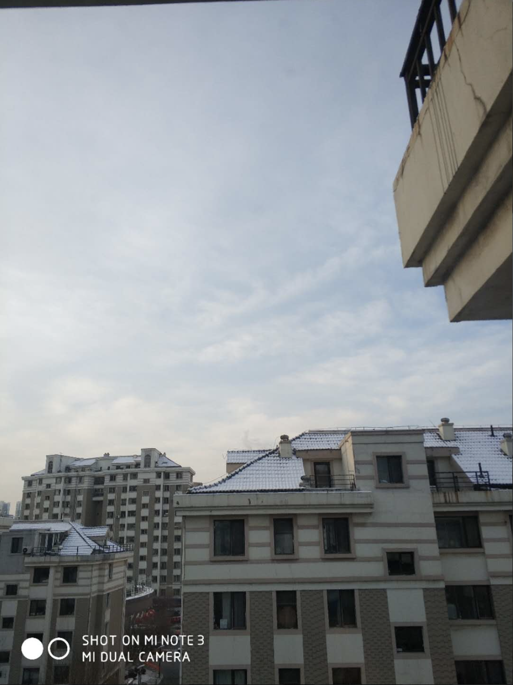

3.1
今天是一号，又过去了一个月。这个月发生了很多事，其中有过年，才发现过年只是一年中的一个小插曲，日子还是要正常过的，昨天并没有浪费多少时间，晚上也睡得挺早的，我并没有犯什么大错，但有一点需要注意，我发现自己工作没有计划，在那儿墨迹也不知道在干嘛，做一件事时先判断这件事能不能做，如果能做，就抓紧去做，如果不能就赶紧去做下一个，而不是在这儿墨迹。
我今天突然感觉到生活之中无小事的真正含义，就像今天做项目，领导说下午要检查，我想着这个页面以后再做也行吧，或者说这点反正以后也要调，现在何必做的那么认真，或者说这件事很简单，以后做也行。 但领导恰恰抓的就是这些细节，没有大的问题，生活中都是一些小问题，但如果我说这个是小事，那个也是小事，那么就没有做的道理了，所以我说生活中无小事，要把每件小事当成大事来做，抱着认真的心态，让每件小事到我这里就是终止。
由此联想到 晚上回到宿舍，玩会儿手机吧，小事，到餐馆吃饭，玩会儿手机吧，小事，人生就是在这样的小事中浪费掉的。

今天因为自己要调样式，就把公共样式给改了，从这里我知道了，样式不一定是要越简洁越好，而是没有冲突，不用去调才是最好的。
告诉了我自己，一定不要去调公共样式。自己写你的那一套就行了。不要去该公共的样式。现在项目还小，如果是一个大的项目，你怎么能保证别人写的和你写的是一样的呢，专写自己的那一套就行了。因此这也告诉我要分开写。

3.3
几点感受，首先，下班后，我路过医院门口，看到一位老人躺在病床上，回来后，路过门卫，看到一位年轻的门卫小哥在低头玩着手机，我很痛恨他们浪费时间，既然我痛恨别人浪费事件，但为什么对自己浪费时间却熟视无睹，当自己不想学习的时候，想玩手机的时候，想为自己不想学习找借口的时候，都要想到你是否在做自己最讨厌的事。
今天收到刘哥的快递，一万三买的thinkpad，帮他下去拿，但我忘了拿手机，于是就没法问刘哥是否开箱检查，于是就没有检查，搞得我还担心一下午，担心刘哥到时候批我，这也告诉我当一件事你觉得你觉得自己错的时候，就要抓紧时间改正，而不是沿着错误路径进行下去。有很多时候你都在做错误的事，比如你觉得自己玩手机错误时，就要停止玩手机，而不是将错就错一直玩下去，就像我常说的，当你觉得一件事迟早要去做时，那最好现在就去做。也适用于这种情况，当我面对刘哥指正的一个错误，还在强力辩驳时，我知道自己该停止了。

3.4
昨天周六，一天没上班，因为前天时元宵节，喝多了，晚上又去ktv唱了首歌，自从毕业后就没有去过ktv了，算下来，都有好几年的感觉了。这次去，反倒没有引起我多少新奇，所以贪图享受只是那一瞬间的事，而且并不会让你觉得多么的享受。反倒是看书更能给你这种感觉。
吃饭的时候李总说了，把你今天要做的事情记下来，这是习惯问题，虽然人们常说这简单，但习惯是最难改的。
像李总什么是都记录在案，我想他肯定有个日历本，把每天要做的事都记下来，
做什么事都要做到最好，今天凌总又让改大安信贷的操作手册，对小到一个逗号都要仔细雕琢。他说，不然拿不出手啊。也是，假如你是客户，你愿意为这个付钱吗，而且改过之后，我也发现文档比以前确实好看了不少，突然发现成功的人都有对细节近乎苛刻的要求。像李国印，凌总，都是这样的人，而且这样才是对产品负责，对客户负责，也是对自己负责。
马斯克虽然致富速度很快，但也全是仰仗人家认真的精神，对事情精益求精的精神，这才是厉害的。
今天上厕所的时候，突然想到自己快要30岁了，当30岁的时候，应该确定自己以后要干嘛，并在该领域要有所成就，这也告诉我不能再玩了，抓住每一份每一秒去提升自己，将来你还要去娶媳妇，压力还很大，哪有那么多心情去玩，让你每天去复习自己的笔记，你复习了吗？

领导说过，人最难改的就是习惯，习惯指导着我的生活，今天，周末下午因为没人，我不想学习，于是就千方百计为自己找理由，最终用流量看完了神探狄仁杰第三部的前10集，然后看天色不早，回去又看，终于把一个破案的过程看完了，熬到12点才勉强睡觉。感觉很不好，感觉自己有强烈的罪恶感，感觉自己又浪费时间了，要多少个边边角角的时间才能凑足着一整个下午。
突然想到了那句话，越自律的人，越能感受到更多自由。
我觉得这句话很有道理。只有善于管理自己的人，才会把时间用在合理的事情上，才不会为了过去的事情而悔恨，才会做任何事情游刃有余，才会心情开朗，有更多的施展余地，你想想如果 你晚上因为贪玩，而不早些睡，明天注定精神不足，这样也不会开心，只有早睡早起，才能精神充足，为自己的英明决定而开心。
今天第一次早晨过来，没有玩手机，这很好，虽然刚开始有些不适应，但十分钟不到，就适应了。这就是自律的重要性，习惯的培养要从一件件小事做起。

3.5
今天的主要任务就是写了一下代缴费的业务，整天都在敲代码，不曾休息，但昨天也是令人振奋的一天，我在吃饭的时候不曾玩手机，吃完饭也不曾玩，一天下来有半个小时花在手机上，这应该是最少的一天了，人只有越自律才能感受到更多的自由，这句话尤其是对于我，显得尤为重要。
今晚，我寝室的灯经过长时间的暗淡之后，终于修好了，这要多谢赵哥，

3.6
只有越自律才能够享受更多的自由。
不知道为什么，今天的工作做的格外慢，本来昨天的框架已搭建的差不多，但今天光处理细节，就花费了我一天时间。想到自己是哪里出了问题，还是那句话，对时间把握不够好，没有严格遵守半小时定律。
今天应该是我的理财元年，我买了很多基金产品，从明天开始收益，希望能有个好的收益吧。

3.7
只有严格的管理自己，才能享受更多的自由
我感觉自己一天天的在这里，打鱼晒网，没有完全的投入到工作中，很多事情很简单，我却要工作一天才能解决，我应该提高工作速度，看到什么事情该做，就要毫不犹豫的付出行动，另外，做事情前要想好自己该怎么做，不要到最后又返工，这样会浪费大量时间，提高工作效率不只是对公司负责，更是对自己负责，这样我晚上才有足够的精力去提高自己，白天要拼了命的工作，上午要把工作进行到一半，下午进行另一半，晚上的时间不是留给你的。
今天晚上世超找我聊天，说他能找到13000的工作，这让我心理很不平衡。我才9000，我现在才意识到不患少而患不均的真正含义，昨晚一晚都没睡好觉，为此事而忧心，一心想着我要怎么跳槽才能实现这个薪资。这样人也不容易安定下来。
上天赐给我足够的智慧去学习代码，去给自己一个温饱的生活，我不求大富大贵，因此不需要那么高的智慧，只要安逸足以。

3.8
人越自律，生活越自由。
今晚我买了两注彩票，是我第一次买，算是了结自己一个心愿吧，我总感觉自己能中，那就看看吧。
今晚和兄弟们一起去一起去兄弟连吃烧烤，五个人花了三百多，多少觉得有些贵了，不过确实吃的很过瘾。晚上也没有上自习，然后回到宿舍把燃情岁月看完了，也算是了了我的一个心愿吧，作为我最喜欢的一首曲子，他的电影我肯定要看。
自己买的电子书，好久都没看过了，刚买回来时的激动还历历在目，然而这么短的时间，激情消失殆尽，剩下的只有平静。我不能把它抛弃，我决定了，每天看10页，看完才能上床睡觉，一会到宿舍就看，把其他事都排在后边。
一直想着用另一台电脑下片来着，但突然一想，绝对不能下，如果下了，你还要花时间去看，这样时间花费就多了，我总是给自己找借口说这是我必须做的，但我知道我能控制住，只有越自律人生才能越自由。

3.9
今天周五，听说明天有位女同事要过来，我提前把房间清理了出来，从最大的房间搬到了最小的房间，不过还好吧，我没有那么在乎房间的大小，两平米的房都住过，还在乎这个？睡了一晚，不冷，还算满意吧。
之前买的基金全线飘红，两天涨了70多，很是兴奋，但不知道会不会跌，也不知道行情是怎样的，希望能多学一些吧。

3.10
今天周六，我们这里来了一位女同事，晚上，一起吃了个饭，怎么说呢，都是伤心事，因为吸取了之前玩牙签的教训。所以我坚决要求不玩了，最终吧，领导反正都很生气，嫌我不给他们面子，但我做了自己认为正确的事，并没有认为有什么不对的地方，
在酒场上才认识到什么叫做平平淡淡才是真，只有平平淡淡的过日子，才是真理，并不总是要什么轰轰烈烈。

3.11
今天周日，我没有像往常一样来到教室，而是在宿舍呆了一天，因为今天要报销，邮发票，我想如果我去了行里，发票怎么邮递，于是就没去，不过这样也好，昨天还是办成很多事的。比如我学会了重装系统

3.13
今天周一，也没什么大事，工作在按部就班的进行，虽然工作上有很多烦心事，比如字段值对不齐，还要我去一个个对齐，但这些在一天结束后我都不会提一下，可见人生的大部分挫折并没有你想想的那么麻烦，不妨跳出这个小圈子，以一种未来的眼光，以领导的角度来考虑这件事，也许你会有豁然开朗的感觉。领导会认为，我交给你这么简单的工作，你怎么做了这么长时间。
还有一件事令我不能释怀，我要求自己每天读3篇日记，但总感觉自己读的很慢，不知道自己在干什么事，我想用时间来约定，比如说规定自己5分钟必须 读完，但又觉得总是看时间也不太好，所以我想着不止是看日记，任何事情，只要下决心去做，就要心无旁骛的把它干完，不能因为任务不大，想着时间还多，干干这个，干干那个，最后才想起来日记还没读完呢，不但浪费时间，还消耗了自己的锐气。
读到以前的日记，我必须在这里对明润表示感谢，正式明润将我从之前什么都不会的毛头小子，从之前在顺义 沉迷于手机不能自拔，不知未来在何方的迷途之人，从之前得过且过，没有钱，没有工作的沉迷之人，拯救出来，通过严加管教，让我找到自我 ，管住了手机，有了小钱，重新拾起了生活的希望，虽然其中诸多波折，但困难都如过眼云烟，留下的只有对过去的怀念和岁月的沉淀，

3.14
我理解到如果想在人生中有所成就，就要时常心怀忧惧，时刻思考自己现在做这件事对不对，玩手机时要想到自己现在该不该玩手机，晚上11点后要想到自己现在看电视合不合适。
妈的，刘哥说个话都这么带刺，我坚决要按着自己的意思来，提高自己，没事做时，就要勇敢的去做自己的事情，而且要做一定要成功。

3.15
今天一早醒来，下了很大的雪，按说天气转暖，为什么会下雪，我也搞不懂，我总是不知道自己的时间，为什么过的这么快，感觉什么也没干，就过去了，这让我很是伤心，比如昨天打算学react-router，但看了一天，也没有看出个所以然来，不禁觉得有些虚度了。还是那句话，要坚守我的半小时理论，搞清楚自己这半个小时想要干什么，想要达到什么样的效果，然后去奋斗，就比如昨天晚上，你根本不知道自己在干什么，昨天来了个新同事，我帮他搬到榻榻米上，这个可以，但办完之后， 你不应该去玩手机，为什么要玩手机，你根本不知道自己在干什么，导致晚上我12点才睡，这就有点不好了，我要把所有事都做在前边，这样方能不慌乱。
昨天，伟大的物理学家霍金先生去世了，举世哀悼，记得小学还学过他的课文，时间过的很快，跟我有关系的人，我知道的人，都会相继去世，也许这就是人生，伴随着长大，在自己身边的人却越来越少了。说人生没有意义的是站在宇宙的角度，但人生有意义的是站在自己的角度，任何对是否有意义的争论都应当有时间限制，比如你做这件事在这段时间内是有意义的，但如果超越了这段时间，那就另当别论了。人生也是如此，自己的奋斗对于自己的一生来说，是有意义的，因为自己的奋斗可以为自己赢得美好的生活，良好的声誉。自己的人生就是自己的全部。但如果跳出这个时间段，那就另当别论了。
之前听到一个段子，感觉有点好笑，昨晚突然想来，发现意义非常深刻。
一位富豪因为经商失败，跳楼自杀了，但人们看他的账户还有几百万的现金呢，想着为什么他拥有比大多数人都多的财产，还想着自杀呢。后来人们知道了，是落差，是心理的落差，心理的不平衡杀死了他。初听到这个故事，会觉得这位商人很傻，要是我肯定不会自杀，因为我又几百万，但细想起来，我是站在自己的角度来考虑这个问题。如果站在商人的角度，自杀并非不合理
一个失落的年轻人碰见一只蚂蚁，蚂蚁问年轻人，你为何看起来如此沮丧，年轻人叹了口气，我已经28了，但还是一事无成，没有女朋友，浪费了太多时间我感觉自己很失败，想自寻了断，蚂蚁听后，不禁大呼，天哪，你还有50年的生命为何如此想不开，你还有足够的时间去奋斗，为何现在就能轻言放弃，如果我是你肯定会珍惜大好的青春年华，年轻人问：你还有多少时间，蚂蚁回答，我明天就要离开这个世界了。年轻人不禁陷入了沉思，
我们就相当于那个百万富翁，我们生来就是带着百万巨款而来，但我们总觉得自己像蚂蚁，一文不值，我们终其一生去寻找宝藏，却不知那个宝藏就是我们自己。我们任何时候都不应该沮丧，即使我们没有一文钱的时候，因为再没钱，我们也是百万富翁起步。
我们经常被媒体误导，他们经常去渲染世界范围内机区区几个人，说他们少有所成，从而对比我们自己，让我们产生落差感，进而觉得自己很失败，但我们应清楚，我们经常错误的认为媒体告诉我们的就是世界的全部，但世界何其大，世界顶尖的几个人并不能代表世界上的所有人，还有很多虽然起步不是很早，但依靠自己的努力，大器晚成，同样富甲一方的人也大有人在，人的生命是充满变数的，不能说我已经30岁了，再怎么努力都没有用了。这是媒体告诉我们的，之际上，只要我们开始努力，什么时候都不算晚。

3.16
每天早晨过来，总觉得自己昨天没有努力，不知道自己昨天干了什么，我觉得有必要把自己做了那些事记下来，看看自己到底做了些什么，比如每个小时记一次进度，花费不了你多少时间。
要采用科学的方法去努力，比含混不清的目标相比，精确的目标更能获得显著的表现，所以我要设立清楚的目标，这不是可选择的，这是一定要的。
之前一直想问问阜新银行食堂的主任能不能让我们在他们食堂吃饭，因为外面的饭实在是吃够了，之前一直没下决心走出这一步，今天终于鼓起勇气去问一下，出乎我意料，主任是个漂亮的女生，没有想我想想的那样呵斥我，而是主动招待我坐下，还要让我喝茶，这让我受宠若惊，看来事情没有我想想的那么糟糕。
当我遇到困难时，我总是纠结于现在，现在我应该跳出那个圈子，比如我想去理发，想理9毫米，我总是纠结于自己掉头发，但我应该把目光放长远，脱发只是我人生中的一小部分，而不是全部，我不应该整天纠结于这个，而忽略了真正重要的事。

3.17
昨天王心顺来到沈阳，请我们项目组一起吃了顿饭，心顺是我们公司的销售，整天到处飞，一个月的机票就要8000，我也想到处飞啊，可惜我不是销售，我尝试做过销售，但实在发现自己不适合。看来我只有专心研究技术了。
昨天饭吃的很尽兴，每次吃饭我都害怕，怕又喝多了，因为实在推不了啊，不过幸好今天酒的度数比较低，我没有喝醉，之前来的那个女同事，张珊，我和她之间有某种关系，我不知道自己该怎么办。怕自己没有足够的资本，如果说上天赐给每个人的力量是无穷的，我相信我足够的力量去喜欢某一个人。
昨天吃完饭后，回到宿舍，本来想早点睡觉，但奈何睡不着，于是就看了会儿电视，我不该看电视的，我应该抓紧时间看书，因为母亲还在等着我，我不能就这样放松自己，我要有自己强烈的自律，在正确的时间做正确的事情。比如我说过，来到行里后不能拿手机，吃完饭后页不能看手机，我说了不能了，那不是商量而已，而是一定不能。是要你一定完成的任务，俗话说军令如山，给自己制定的计划，许下的承诺一定要完成，不然计划的制定与否还有什么区别。

3.18
今天周日，没有上班，还是我一个人来到了行里，昨天没发生什么事，就是没有工作可做，所以在做我自己的事情，刘哥说周末了，把你们的工作汇报都交上来吧。于是我就交了上去，刘哥说你看看我给你安排的工作计划到哪儿了，而你现在才做到哪儿，我说那是因为我在等待接口啊，这时候赵敏突然说，不是有挡板吗，不用非要等接口的，于是我就说好吧。看来我不应该等他，遇到什么就要问他要，不然以后这一切的后果都要由你承担，如果他说现在还没搞好，我就说现在我是等你还是继续往后做。
今天的ui我感觉自己还没有尽全力，我总觉得任元王设计的ui自己达不到，所以总是被领导说，但被领导说了之后，自己又能达到了，所以说不要一开始就认为自己做不到，ui怎么设计，自己怎么做就行了。不要轻易说，这个自己做不到。
今天周日，我又在行里玩了一天手机，我总是对自己产生错觉，以为自己可以做到的，但每次都是失败而归。
我内心里是想有个光辉的人生的，但我只是想，而不是我必须要，如果是必须要的话，就不会意志力这么差，人可以学会自己想学会的任何技能，如果自己想学的话。不要说自己做不到，
我感觉要在自己清醒的时候看笔记，我总以为不就是看笔记吗，很简单，用些边角料的时间去看，结果总是也看不完，殊不知，一个笔记可能耗费你一天的心血，有着庞大的内容，你怎能不用心，因此我决定在我早晨一到时就看，用自己最清醒的时间去复习笔记。我还有很多事要去做，所以我觉得就不要贪睡了，明天六点半准时起床吧。不要贪睡了。

3.20
昨晚睡得晚了，看电视看到2点，虽然好久没有2点睡了，但骤然这样还是令我第二天起床时，眼睛发干，我知道自己犯错了。如果能看书到这么晚，我也不说什么，可见电视剧有多大的能力，能让你晚上2点睡觉，而不知不觉。终究还是太可怕了，以后要远离电视。
我想着以后回宿舍不能拿电脑了，因为拿电脑回宿舍终究还是不学习，别问我为什么知道，根据过去对你的判断。但是不拿，我又不能好好做看书笔记。所以还是拿着吧，任何事情不能一直靠外力来帮助，终究还是自己的内心。还是靠自己的毅力来管理自己。
我分析了自己为什么昨天看电视那么晚，我觉得是因为自己上床太早了，9点多就上床了。所以自然就想看电视剧了，以后规定自己不能过早上床。
昨天我学习的时候有怠工的现象。觉得自己的事情不多了，于是就开始怠工，敲会儿代码，玩会儿手机，看会儿网页，就是这样。我觉得如果知道那段时间容易分神，就要去计算时间了。不能再范这样的错误，工作尽量往前赶，另外工作不要留到晚上。
昨晚看的琅琊榜还是深有体会的。梅长苏从梅岭复活。经受住了骨肉重塑之苦，方能成就麒麟才子，凭借一己之身，号令江左盟。重翻赤焰旧案，如此能力不由让人佩服。一个人的能力究竟有多大，由此可见一斑。所以任何时候都不要说你做不到，实际上人的能力是无比强大的。当你说我太累了，做不到时，记住这是你在给自己找借口。实际上有很多人生活在痛苦之中，他们要么经受着癌症之苦，要么经受贫困之苦，要么经受战争之苦，等等。而你这些都不算什么，我不希望你拥有这么好的条件，却还在抱怨自己没有机会，这犹如躺在金山上喊穷，岂不是很荒唐。
突然想到假如父母去世，我应该怎样给他们送行。是坐在家里的草席上，起陵时走在队伍的最前边吗，我是家里的老大，这也应当是我义不容辞的责任，但我想到时候自己可以有钱，可以随意支配自己的生活，而不是任由别人摆布。

今天看到耿宇昊说话时，声音非常小声，唯唯诺诺，着实令人讨厌啊，有什么话说不就好了吗，所以这也告诉我说话要说清楚，响亮。

3.21
只有越自律，才能感受到更多的自由
因为昨天睡得早，所以今天也早早起床了。昨天刘哥没在，去阜新了，所以过了一天轻松的日子，一天的时间，是宝贵的，但我却没有什么可以写。看来一天中能留下深刻印象的事情并不多。
其实睡得早不一定是好的睡眠，没有人规定，必须什么时候睡觉，正确的答案是困了就要睡觉。

3.22
现在才发现，生活是很紧张的，一个想法只有现在做可以，过几分钟就不合适，这也告诉我想到事情就现在马上去做，而不是说我过几分钟再去，那时候一切已大不相同，比如今天早晨来到行里，想着有一个20分钟的ted演讲，自己等了好几天了，还没看，现在正是看的时候，但又想着先让我玩会儿手机再看吧，虽然耽误的时间不算长，就10分钟，却让我感到一丝落寞，所以说，想做的事现在就去做。
工作场上是一个只相信功劳，不相信苦劳的世界，如果你已经完成任务，打可以休息，没必要觉得内心有什么愧疚，但如果你没有完成，那么请加把劲。
还有把每天晚上的时间留给自己，为什么你白天工作没有效率，我觉得可能就是因为你没有把晚上的时间留给自己，工作是做不完的，不能想着我把工作做完了，才开始做自己的事情，我们应该见缝插针，这样才能让你白天也有压力做事，不能晚上把工作都做完了，留下白天在那儿闲着没事干，这怎么行。

3.23
昨天世超找到工作了，在滴滴上班，也令我很是羡慕，经历了各种挫折，算是一个非常不错的结局吧。希望他能好好工作，不要再起波澜。想来也是有趣，到今天，我们兄弟4人，才都算是有了一个稳定的工作。
昨天有没有什么让我遗憾的事呢？如果有的话，我想是自己没有遵守好晚上的约定，晚上的时间我要看3个视频，没有完成就不要说你问心无愧。想想吧，一天的时间，只有晚上的时候，才有时间去做自己的事情，而且才完成3个视频，每天才看10页的书，这么算下来，我的时间是十分宝贵的，我要在对的时间干对的事，过了这个时间，就没有那种从容不迫的心态了，没有这种氛围了，还有别的事情催促着你去做。所以，要在对的时间干对的事，安排好自己的时间，一刻也不要浪费。

今天就在刚才，你不知道我有多兴奋，我把wampserver配置好了，有反映了，你不知道我当时有多兴奋，回顾一下自己解决问题的历程，我觉得还是要多试吧，中午配了一下，发现不能用，最开始我以为是我装了32位wamp的问题，但我找不到32为的安装软件，于是我看到下边还有一个讲解视频，刚好，这个就是讲解有可能出现的bug，我看了一下，原来是要把目录建到c:/wamp/www/文件夹下,我一试，果然就行了，所以这也告诉我遇到问题，不要怕，敢于创，哪怕有一份的希望也要去多试，只有这样才是解决问题的唯一途径，解决问题的流程都是相同的，就看你愿不愿意去努力，再者就是要怀有绝对的信心。

3.25
今天是周末，我还是一个人坐在行里，习惯了孤独，觉得这样也挺好，我今天来的时候故意没带手机，希望我可以利用好这一天，别再以为没有人就可以为所欲为了，
昨天交周报，每到交周报时，就很发愁，因为实在没有什么东西可写，都一周了，难道我什么都没有完成吗，我觉得虽然我交到领导那里的是周报，但我这里要日报，每天6点的时候，总结一下，自己这一天做了什么内容，只有这样才能在写周报时更加不用纠结，才能更好的监督自己的工作，让自己实时存在急迫感，不要再一个自己不会的问题上，过于纠结。
我突然发现了，写日记的重要性，不单是写日记，包括你记笔记，只有把它写下来，才能在写的过程中，有更深的体会，才能突发灵感，问题或许就迎刃而解了，今天想出日报的主意是如此，之前解决react，WillMount异步请求的问题也是如此。

因为我们总是甘于平庸，做着平庸的工作，生活在平庸当中，忘记了自己所要到达的方向，工作时没有付出100%的心态，总是随意的完手机，没有把这一项工作干完后再去干别的，我要做的就是与众不同，不受他人的干扰，

我现在明白了，人们之所以为伟大而折服，是因为伟大存在于每个人心中，但崇拜伟大往往更容易，见证别人的伟大，比成就自己的伟大往往更加容易。因为这需要投入时间，投入精力，约束自己，所以这就是为什么你只是普通人，你总是做着同样的事情，干着同样的工作，一成不变。你所拥有的一切都是非凡的，但你却刻意选择了平庸，你再学校里成绩平平。你再工作上业绩一般，就像你所做的一切皆是平庸之事。并非他们平凡，而是你做了决定。也许你周围皆是平庸之辈，也许你在一个平庸的环境中长大，也许你上了一所普普通通的学校，也许因为你在一家普普通通的公司上班，所以你决定走与自己相违背的道路。没有谁为你感到遗憾，自食恶果而已。甚至还会有人感到庆幸，这是人们在没有获得成功时的典型心态，他们坐在那里自怨自艾，然后渴望得到其他人些许无用的怜悯和同情。但他们不愿走出悲剧，只是让灾难在他们身上上演。因为成功不是给每个人的，他不属于那些脆弱而柔软的心。他属于那些拥有目标和梦想为之付出努力的人，如果你想走出平凡，获得成功，那就别畏首畏尾，拼命去挣。如果你敢于优秀，那么你也可以伟大，投入到这场竞技中来，要么就退出，别玩儿了。如果你付出一百二十分的努力，你就会看到生命有多精彩
我希望你的梦想能够如此清晰，如此生动，当你早上醒来，你要做的就是向你的梦想全力冲刺。即使我到现在一事无成，但我已经开始追赶。当你在听到这些话的时候，你就要奋起直追
神父曾说：有朝一日你将在心里听到我的声音，上帝给你一个机会逃离过去，别心慈手软，去追赶你的梦想。去追赶他，别觉得丢脸，尽管跑。
把生命的每一天当场最后一天来过，我配得上自己用一百二十分的努力赢来的生活，我宁愿矢志向北，即使求之不得，也不愿胸无志向。无宁愿趋之不及，也不愿望而却步。我宁愿尝试所有失败，也不愿抱憾终身。我不愿带着这样的疑问死去，假如我当初再努力一点，我的生命将会是什么样。我将为之不懈努力，即使天寒地冻，路远马亡。我正在追赶我的梦想，你不能再命运身后踌躇不前，你不能再命运身后彷徨而行。你得全力奔跑，奋力追赶，追赶你的命运，去追赶他，去追赶他，别觉得丢脸，尽管跑

3.26
今天我们终于搬到了大厅，有了一个宽敞的位置，对此我很欣慰。终于可以无所顾忌的看视频了。但有一件事我特别遗憾，就是我意志不够坚定，有很多该做的事，自己没做。说白了，就是没有执行好计划。
3.27
人越自律才能够享受到更多的自由。
今天暂时没有什么新的事情，加油努力吧，冲着自己的目标前进

3.29
这几天有点膨胀了，交给我的任务总是三心二意的，一个九连屏调了两天了，还是没有调好，领导有点着急，这告诉我要用心了，不要说自己不行，没有这句话，你有认真的看吗，你有把它的每一句代码看懂吗，你有看五遍吗，在这之前，不要说你看不懂，不要说你做不到。
昨天看了古巴比伦最富有的商人，有一句话令我非常感触，我给自己定的任务就会不折不扣的去完成，即使是这项任务是错的。扔石子的案例。所以我也要坚持自己的原则，遇到什么不会的就要去问，不要怕批评，我觉得批评也是我前进的动力。就比如昨天晚上，实在没心情调九连屏。于是就去问赵哥，虽然它没有给我提什么实质性的建议，但批了我一顿，让我有了重新研究的动力。所以不要怕被批。人没了批评，也就没有了进步。
昨天晚上，回到宿舍先拿起来了手机，而不是把手机锁到保险箱里。这也是我噩梦的开始，我开始还说就玩一会儿。但看着看着就会逐渐入迷，最后无论我怎么提醒自己，都叫不回来了，就像温水煮青蛙，一开始可能没什么感觉，但随着时间的过去，就再也调不出来了，基本上所有的上瘾都是这样，我注意到我昨天完手机时的内心活动，一开始觉得没什么，但随着玩的深入，想跳出来的时候，又想到如果我此时放弃，还有比这更有趣的事情吗，所以此时在我心里，这已经是目前我能找到最有趣的事情了，就会抵制跳出这个圈套，抵制接受新的事物，不但是玩手机，各种上瘾都是这个规律，如果一个正常人，一开始就知道吸毒会给自己带来家破人亡的后果，他们是断不敢去吸毒的，但是换了一种情况，他们一开始本着尝鲜体验的心态觉得吸一口没事，然后又吸一口，然后又吸一口，最终当他们意识到自己上瘾时，已经无法自拔了。
这让我想到了我曾遇到的几个吸烟的人，他们告诉我，我的烟瘾不大，我是想起来的时候吸一根，烟瘾还不大，我当时还觉得：哦，那你的心态还挺好，现在想来，好像 不对，他们是正在陷入上瘾的情况还不自知，谁上瘾的时候不是抱着我只是试试的态度开始的呢，千里之堤溃于蚁穴，一个微不足道的开始，可能终会酿成大错。
这也告诉我们人生在世，对万事万物要保持足够的警惕，对于容易上瘾的东西，最好是就不要开始，把它扼杀在萌芽状态。对所有不该做的事情，不能抱着我只是试试的态度。就像玩手机，最好就不要 打开。

我觉得基金定投要比一次性投入来的更好，因为如果股市一路上涨的话，肯定是一次性买入比较好，但是股市肯定是有涨有跌的，所以就要求我不要一次性买入，尽量分多次在低点买入，你有可能会说，那我这样也排除不了我有一段时间的买入价格比初次买入价格要高。但没办法，我现在还没有那么多钱，工资什么时候发，我也只能什么时候买，所以工资发的时间决定了我买的时间。所以我要分多次在低点买入。
说一下我之前买入的心态。一开始我投入了1000块钱，然后涨了100快，然后我想着如果我投入的不是1000而是6000，那样不是赚的更多吗，于是我又把6000块钱投进去，结果没有赶上上涨，由于中美打贸易战，股市普遍下跌，我的基金也是如此，由于我是在高点买入，而且投入的资金又多，所以损失惨重，总结这次失败，我觉得自己是犯了典型的追涨杀跌的错误。看到股市上涨，觉得自己还应该再买入，
教训：只在价格下跌时买入，现在相对于价格的上涨，我更愿意看到下跌，因为这样我就可以以更低的价格买入，注意不要在价格上涨时买入，要在价格下跌时买入。可以这么说，价格上涨是肯定的。我买入的价格决定了我的收益。

3.30
昨天9：30回去的，感觉很好，把握之前想看但一直没有看的视频给看完了，我以后每天都要10点回去，时间短暂，没有什么事情可写的，但有一件事情，我要防患于未然，勤关机，今天早上，我一来就把手机给关了，完全不给自己看手机的机会，这样很好，如果知道自己控制不住自己，如果知道自己迟早要关掉手机，那不如就是现在。
今天早上来的时候，突然感觉自己要努力啊，虽然说财富是慢慢增长的，这自己记不得，但是我要让自己升值的速度，远超自己的资金。你还没有娶媳妇，赶紧为此而努力啊。

3.31
昨天心顺来了，又和他们一起去聚餐，在赵四小姐，这都不是问题，主要是我在玩数七的游戏中发现了自己的硬伤。根本毫无招架之力，最终短短一会儿，就喝了3瓶酒，当时就蒙了。于是我借口上厕所，就走开了。哎，才发现自己还有这个bug。
昨天下来后，一个人在街道上等他们。等了有一会儿，他们出来了，于是我们又到星摩尔唱歌，唱到12点多，唱了这么多次歌，李靖今天夸我唱歌好听，这让我受宠若惊，看来我唱歌本来就不差。
昨天真的喝多了，在ktv又喝了很多酒，我都觉得自己醉了。哎，幸亏昨晚睡得也早，没有吐。不由得感谢啊。

