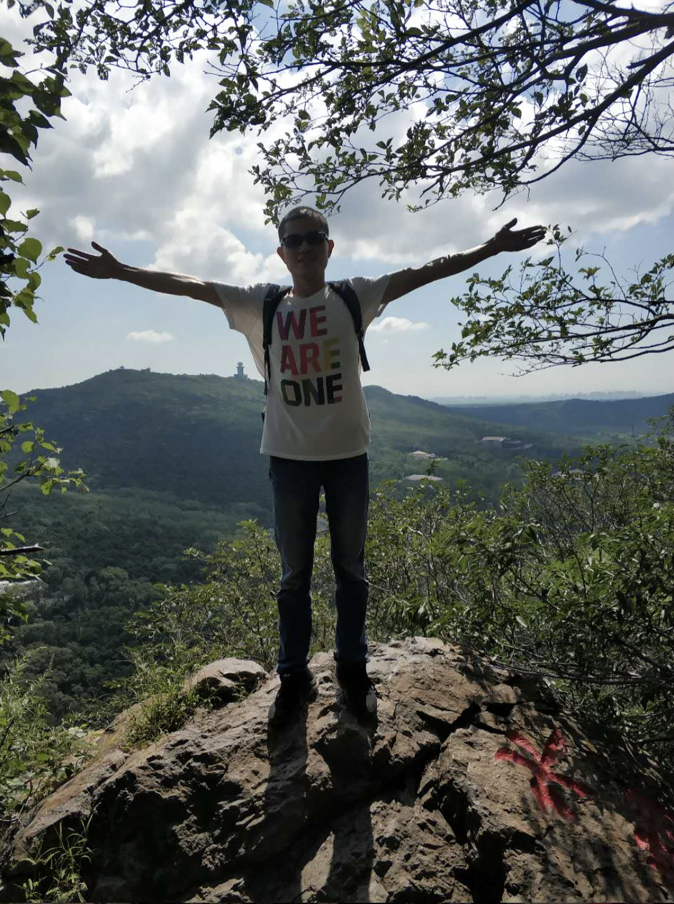
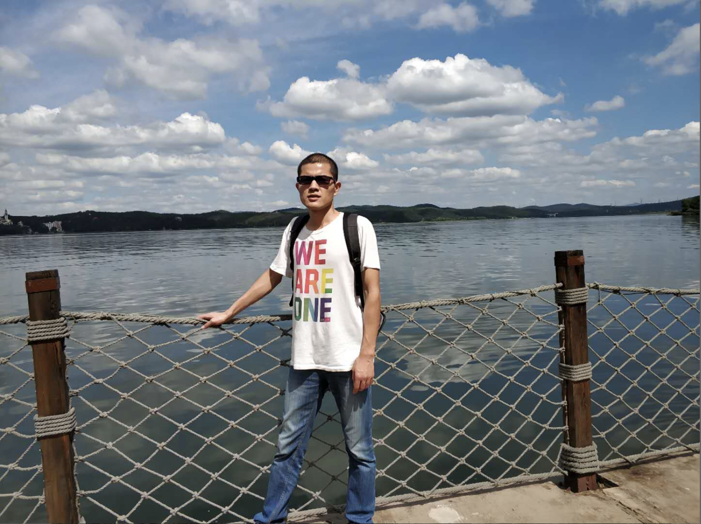
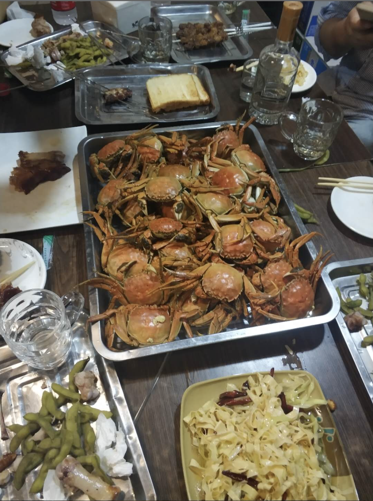
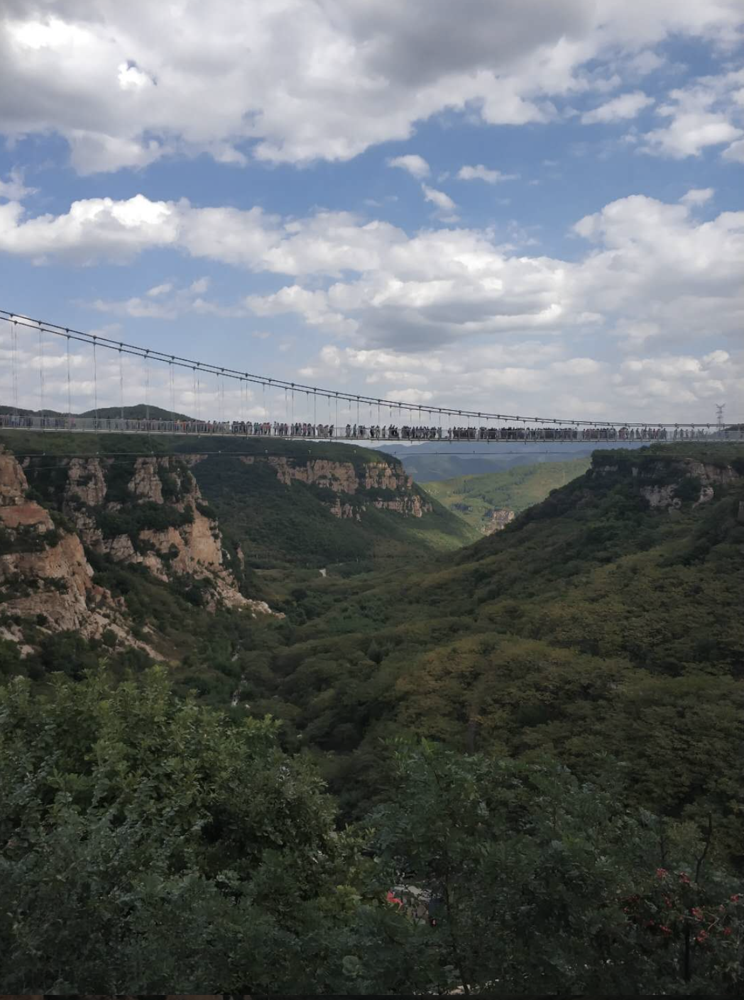
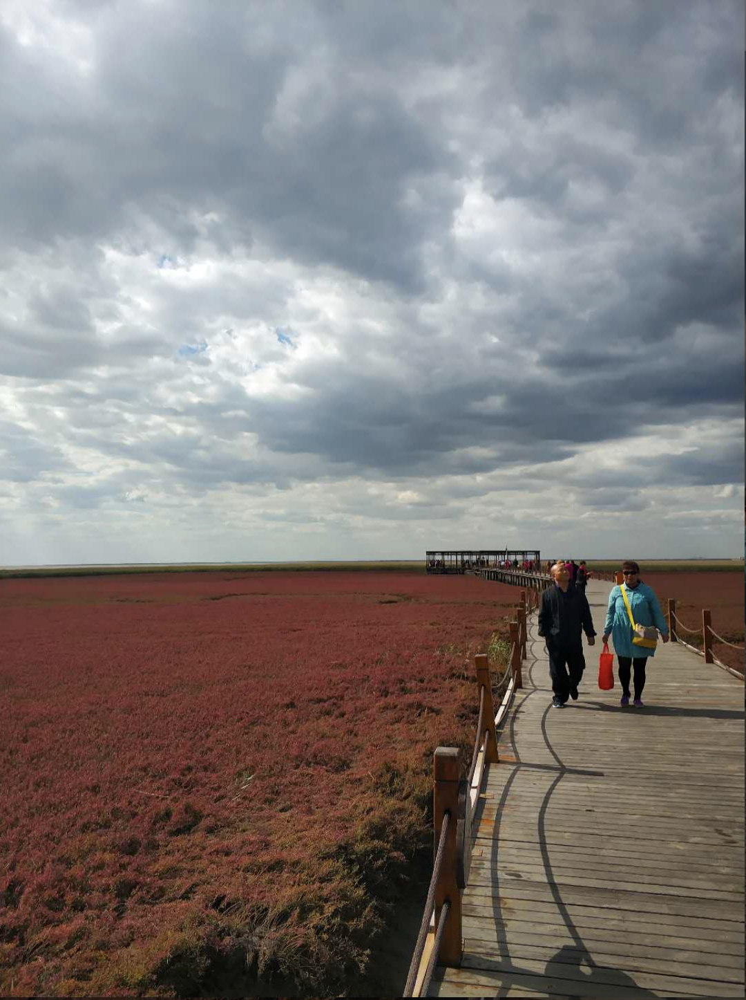

9.3
三件事，
第一件，上个周六，我们一起去了棋盘山，一路上春暖花开，绿草如因，尽管已经到了夏天，但一路上没有一点夏天的萧条景象，坐着滴滴，左绕右绕，终于到达棋盘山脚下，还是非常秀丽的，有很多人是骑自行车或者步行上来的，其中碰到一为大爷，精神矍铄，一看就是不一样。聊了几句才知道，他70多岁了，每天都来这里跑步，半马的成绩是2小时17分，算是很厉害了。不禁感叹生活中还是有高人啊。
昨天周六来到行里。上午玩了一上午手机，一直玩到下午两点多，后来觉得自己不能再这么耗下去了。于是就告诉自己，如果我再玩手机，晚上就给同事们买辣条吃，这一下果然见效果，我没有告诉自己去跑步，而直接是花钱，之前怎么没想到这么好的方法。后来又把自己所有的计划，和这种惩罚联系在一起，效果还挺好。做了很多我之前想做而一直没做的事情。比如看书，晚上不玩手机等。

9.4
快十一了正在发愁，到底要去哪里玩，还没决定，上次十一没过好，这次看看吧。希望能有些不一样的风景。
昨天我的面膜到了，第一次敷面膜，感觉怪怪的，有点扎脸，想着习惯就好了吧。
昨天实行了，没完成任务就罚买辣条的制度，工作明显自律了很多。但工作效率不高，没有完成任务，希望今天能有所提高吧。

9.5
昨天还算没有辜负自己的诺言，快要十一了，我要赶紧找个地方玩去。
昨晚，做canvas的练习，一副很不耐烦的样子。感觉自己是不是 投错了行，我不应该有这种想法，因为大部分人的努力程度之底，还用不到天赋，你说你学不会，那么请问你看过几遍。你上课时有认真听吗。所以不要再有其他想法了。

9.8
一直有件事忘了说，阜新调试智能机具时，有时候会遇到键盘输不上的问题，好久都没解决，看了好久都没觉得是代码的问题。心里还想着，这个问题究竟改怎么解决。到底能不能跨过这个坎，可是前天就让许晓峰给解了。它看到输不上去后，试了几次，然后把java后台运行的弹出框给叉掉，之后就好了。真实神奇。这算是帮我排除了一个大难，值得我好好感谢一番。这也告诉我遇到事，不要慌张，事情总会有解决的一天。第二就是找对方法。到处看看，别总是瞎琢磨，关键时刻还要请人帮忙。
这几天懈怠了，总是学不进去，下班了就想回去，看电视，休息。怎么能这样呢，我还要跳槽去找好工作，还要去当老师，还要享受美好的生活，怎能被这种事情困住手脚。还是要坚持学习啊，看来我是需要继续锻炼，培养一种雷打不动的优秀品格。一种坚持到底的学习精神。

9.9
快要过十一，过中秋了，正是小长假开始的日子。我要开始安排自己的出行计划了，首先我不打算回家了，打算把东北的主要景点都逛完，这样就心中无憾了。
昨天听90后的歌曲，听到《天下》，想到了在广府古城，去看世超，耳边响起这首歌，那时候的一切还历历在目。人生在世，没有什么值得你过分追求的。一切都将化为泡影。
今天把刘哥给我的一盒辣椒圈吃完了，辣得我，本来我想要扔的，但想到这么多好吃的，来之不易。吃了算了，但吃了就是给自己 添堵。还不如当时扔了，这件事告诉我，不要因为浪费而做任何有害自己的事情，如果某件事是对自己 有害的，即便他再好，也不能做。

9.10
今天是教师节。又是周一，粗略估计一下，很多学校免不了一番腥风血雨。今天是周一，新的一天，我要好好工作，争取在白天把任务都做完，其他事情没有了。
哦，对了，昨天看到一句很好的话，这个社会正在狠狠的惩罚不读书的人。怎么惩罚。如果你不努力，只有在香港扫地，而且每天工作十几个 小时，才能勉强温饱，而且还是住笼屋，这是种非人的待遇。
年轻人想外出闯荡，村长给了他三个字。‘不要怕’，的确，这个社会上没有什么事是不能做的。不要怕，充分诠释了，你在面对困难时的态度。

9.11
一天一天又一天，昨天没有完成任务。我没有时刻以任务为中心，去做事情。这是很糟糕的事情，导致今天还要接着昨天的去做。给自己规定每小时该完成的任务。
我发现自己不应该回到家着急看动漫，因为看电视 的欲望是无穷的，你永远满足不了他，每次提前满足，下次他来的将会更加凶猛。因此正确的做法是我控制它，而不是让他控制我。

9.12
昨天想22的小女孩表白了，问能不能请她看电影，看起来她是很生气的样子。我知道这件事可能吹了，直接没有回我，哎，虽然知道自己 有些鲁莽，但我不后悔，最起码我争取过。

9.13
因为前天晚上的表白被拒，让我用一天的时间琢磨怎么赎罪。哎，都是泪啊，连续吃了两顿饭，可不能这么干了。
我一直觉得自己的效率太慢了，整天不知道自己在干嘛，哎规定的任务就要一件一件做完，不要挑三拣四。而且要把今天要干完的事情单独列到一张纸上，

9.15
这个月已经过半了，月底就要放假了，但票还没买，因为不知道要去哪儿。想来个东三省七日游的，但也找不到合适的位置，如果自己规划路线，还要赶火车等各种繁琐的事情，但如果报旅游团的话，又觉得太贵。还是觉得再看看吧。
昨天又一起去唱歌了，这是我们第二次唱歌。感觉还好吧，别人都不愿意唱，只有我和任元王唱，这样也好，不用管别人，随他们吧。昨天我也没在状态，好几首歌都唱砸了。看来还是练习不够。
还有我昨天去22吃饭，态度挺不好的，觉得表白过后，再去吃饭，就会浑身不自在，我起始没必要太过自责的，纵使你表白失败，也不应该摆出一副失败者的姿态，不给人家说话，我觉得还是要像平常就行了，面带微笑，不要给人家一副你输不起的姿态，人生在世，谁能不犯错，没必要求全责备，失败过一次就抓住小辫子不放了，那还如何迈出下一步。

9.16
今天周日，上午没过来，把《秦时明月之君临天下》看完了，下午来到行里，主要是想制定一下，出行计划，经过这么久，我总结出两个道理，工作时，坐姿端正是不会累的，只有你坐姿七扭八歪的才最容易累，所以要想不累，就做端正了。
看视频只是为了让你结束了一天的疲惫后，消遣时用的，而不是让你用大把正规的时间去浪费，你明白吗？更不允许你为了早日看完某部电视剧而用正规的时间去追剧，这也正是我让你不看新剧只看旧剧的原因。就是让你放弃追剧的念头。
十一了，我想去看看大东北，或许以后就不会来了。

9.17
今天周一，新的一周又要开始了，再坚持一周吧，下周就要休息了。这周我觉得没什么事情，但不排除会新增任务，所以也要抓紧干啊。总结今天的任务，然后，把任务都完成。

9.19
没有什么事情，把今天的计划写好，努力工作。争取下班前把工作做完。

9.20
最近并没有什么大的任务，主要的机具都已经开发完了，现在的主要任务就是找bug。其他的我觉得都是次要的。李靖国庆后要撤，我更要利用这段时间，好好测bug。以免他们走了后，剩下的让我自己 去处理。
我之前觉得自己长得不帅。很吃亏，但看了《欢乐颂》才发现，没有什么比在一起吃饭，侃侃而谈，幽默风趣更有意思的事情了。所以我要多读书，读各种各样的书，记笔记。这样才能见多识广，侃侃而谈。

9.24
今天是中秋假期的最后一天，我来到了行里加班，目的有两个，一是改一下自己这些天来的bug，二是看看李靖和张男有没有什么bug，因为他们十一后，就要走了。我要抓住这点时间，尽量多的测bug，不然，就是自己改了。
前两天，我去了本溪大峡谷和盘锦的红海滩，总体来说还行，了却了自己的一桩心愿。先说本溪大峡谷，上午9点多，坐高铁从沈阳到大南芬北，然后就是打的到了大峡谷，在这里要说一下，本来有人说10块钱一个人，我想也不贵，要不就坐吧，但领导没坐，转而又问了问，结果发现有个老大爷5块钱一个人，刚好又是面包车，容下我们5个人，非常好，真是物超所值啊。看来我们遇到事情要多打听，而不是盲目做决定，而且也不要同情别人，心要狠一点，之后我们就看了玻璃栈桥，有呐喊喷泉，对了还有人。然后下午两点玩完，不过我们没走玻璃栈桥，有点贵，然后就坐下午的高铁回家了。第二天一大早，我们坐高铁到盘锦，本来想坐一个公交过去的，但有一个司机一直跟着我们，说是25块钱一个人，我们觉得也挺划算的，于是就上车了，上车后，才发现真的挺划算的。走了快一个小时才到。红海滩现在没有照片中拍的那样大片的红色了，只有零星的一小片红色。不过看着海水，看着大片的滩涂地，让我看到了这才是真正的湿地吗，其中还有好多的螃蟹，怪不得盘锦的河蟹这么有名，最后我还有幸在水稻田里抓到 一直螃蟹并把它带了回来，后来我们都好累，就坐着高铁回去了。

9.25
今天看了欢乐颂，我觉得做人一定要狠，不要蹑手蹑脚，不能帮的忙就不要帮，是自己的事情才做，做人不能低三下四，比如问领导问题，不要低声细语，好像你欠他似的。遇到事情就要问个明白。
再比如我在行里自习。总以为大爷会赶我走，或者太晚会影响到大爷休息。不过这和我有什么关系。我要做的就是完成自己的任务。不完成任务决不罢休。
在去盘锦的出租车路上，敏哥无意中说到他的账户因为久不操作，变成久悬户，我本来想问他久悬户是什么意思的。但因为怕他们骂我啥，或者什么都不懂。于是没敢问，岂料，敏哥主动问我：“党，知道什么是久悬户吗，我说不知道。”这时他告诉我久悬户就是睡眠户，这时我才知道原来只是换了个名字。说这个的意思是不懂就要问，不要蹑手蹑脚。不要怕被别人骂做傻，要敢于被骂，这才是强者的心态。真正的强者都有乐观的心态，对什么事都保持有好奇心，不担心收到拒绝，真正的损失不是被拒绝，而是害怕被拒绝的心态，你能明白此中深意吗。
今天还有一件小事，我从盘锦抓来一只螃蟹，想这个盒子将他养起来，正在找的时候，碰到李靖，他给了我个大的矿泉水瓶子。正想这个剪刀把上半部分出去，留下半部分样蟹，李靖看了，直接用菜刀把上半部分跺掉了。犀利。我也想这么干来着，但怕别人说我就没这么干。看来我不应该瞻前顾后。

可以助人为乐，但要分清界限。
就像昨天和刘小锋，李靖和任元王去盘锦看红海滩，一路上净说要给我过生日，但我真的没心思过。所以一个劲的拒绝。但他们反倒说的越起劲。但我时刻知道自己想要什么。最后还是拒绝了他们，坚决不过。管他们怎么想。说我抠也好，怎么也行。但这就是真实的自我。
但一个真正强大的人不是刻薄的，是温柔的，有一句话说得好，弱者只会残忍，只有强者才会温柔。所以我外表还是要表现温柔的，但我对自己却一定要是刻薄的。看看那些身强体壮的人，不论是施瓦辛格还是强森，他们都是极温柔，极富有同情心的人，他们的狠劲全用来对自己的。相反，你看网上那些杀死狗的云南玉林的小瘦子，虽然外表瘦弱，但都是非常心狠的。我不能成为那样的人。要把狠全用来对付自己，内心无敌，才能无敌于世界。

9.27
最近变得很不淡定，不就是要到国庆假期吗，有这么值得兴奋吗。我现在最需要做的，不是算着有几天到国庆假期，而是抓紧每一份每一秒，完成给自己制定的任务。方为正途。昨天晚上，到了宿舍，说什么也不想看书学习，所以就一个看电视剧，看了三集睡着了。起始看电视剧只是下策，看的时候，毫无感觉，时间就这样浪费了，这是在你无事可做的时候才需要办的事，但你还有任务没有完成，怎么能办这么傻的事。

9.29
昨天李靖把大额存取款机的项目交给了我，但webpack始终安装不上，对此我很苦恼，对于这种没有头绪的事情，不知道下一步该怎么办的事情，不知道以后能不能做好的事情。我不应该像无头苍蝇似的乱撞。这样只会让自己看不到未来的路在何方。
对于这种问题，在厕所时，突然想到一个很好的方法。就是下一步法，因为解决这种问题没有过去的经验可循，没有人可以问，只能不断去尝试。突然想到一个好方法。规定自己下一步就试这种方法。还是不行，再想一下，改用什么方法。突然想到一个，就告诉自己下一步再用这种方法。
比如：webpack怎么装都是报错，那我就想了，给webpack换个根目录重装一遍是不是就行了。那么我接下来的时间就是集中解决这个问题。如果还不行，我就看了，到底报的什么错啊，然后，我想百度这个错误，或许有解决之道，于是接下来一段时间就是解决这个问题。
其实生活中的很多事情都是这个方法。只不过我之前没发现。我们都是先给自己制定一个目标，然后冲着目标前进。
因此没有必要着急，因为着急是解决不了问题，我的方法就怀着必胜的决心是脚踏实地的行动。或许在不久的将来，就会柳暗花明。

