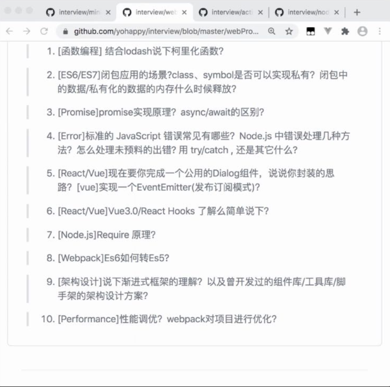
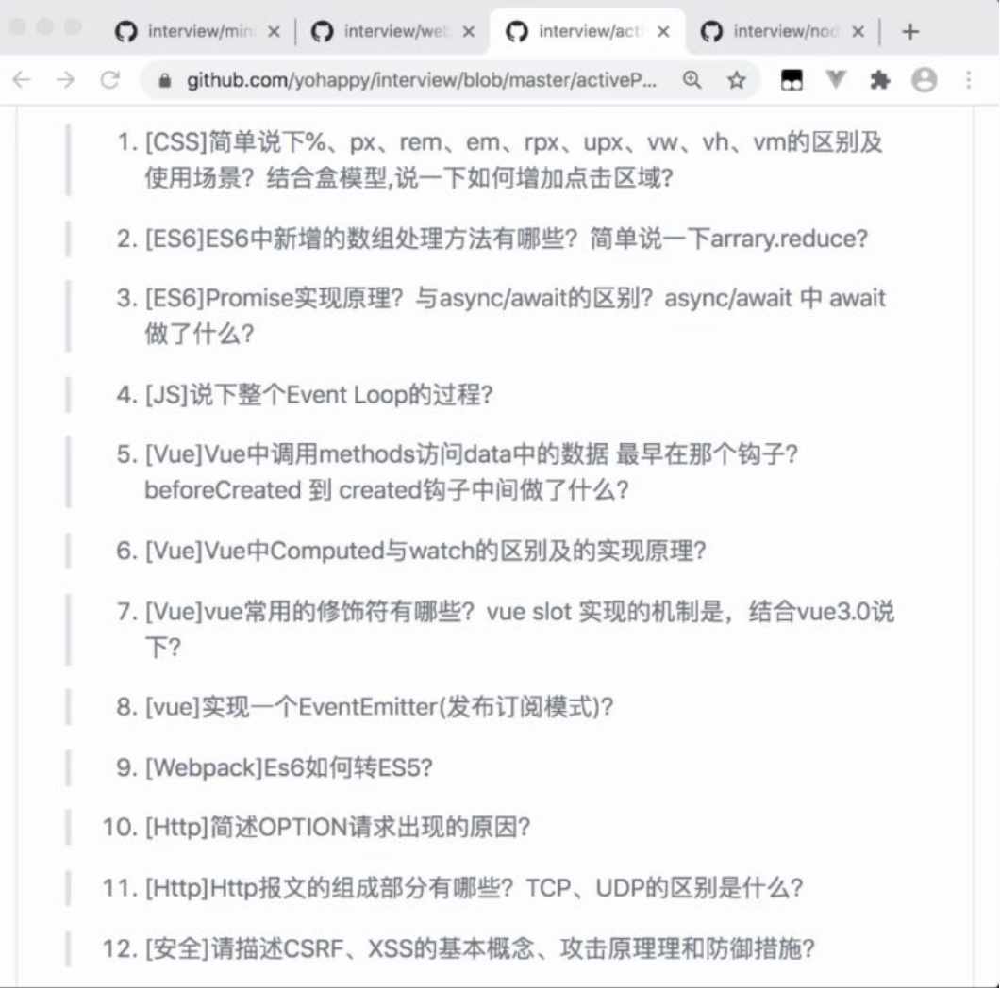

1.3
新年到，现在是2020年了，一年时间总是过得这么快，让人措手不及，回想这一年自己做了些啥，有些不堪回首，除了谈了一场恋爱，好像其他的也没有做。哎，不回忆了，不堪回首。
记得自己上学时，还知道为了考试，每天要怎么努力，如今到社会上，却不知道每天要干些啥，一天天的原地踏步，毫无进步可言，这是不可饶恕的。

1.5
今天是周日，早上9点才起床，然后没别的事情，只能去学习，昨天看视频没半个小时就放弃了，总想着看视频的时候是不是应该找些别的事情干，要不然觉得很空虚。
我曾经告诫过自己，学习并不是难事，你只有在那里坐着不动，然后找找资料，就能够轻松解决，最难的事是你遇见了事根本不知道如何下手，那种无能为力的感觉让人后背发凉。我再也不想要那种感觉，所以才凸显现在努力的重要性。
上厕所也一样，要用心，不要拿着手机进去，寂寞是天下最简单的事情了。

1.8
我想做到像别人一样在办公室侃侃而谈，好幽默，从现在开始练习说话，也能插上一嘴，这需要你平时锻炼敏锐的思维，没事的时候比如吃饭的时候或者坐车的时候别总玩手机，多想想话应该怎么说。预想我如果和某个人打招呼，话该怎么说。

现在我坐在办公位上，手里的活干完了，开始自学，但是总是耐不住性子，总是像看看头条，看伊朗局势，看情形是要打仗，但我清楚知道，现在是上班时间，我不想现在偷玩手机，以后再悔恨，要延迟满足，不要总想着手机，如果我不带，我丝毫不会想，就像之前我没有手机的时候，就什么都不说了，主要是现在有了再去诱惑你，信心就会不自主产生动摇，现在就要想着加入手机就不在我身边，把他就从你脑中抹除不惦记它，那样说不定会心安很多。说白了，这还是要靠自律，说什么把手机藏起来，或者关机，把软件锁住，这样都是不行的，主要还是要靠你找到别的爱好，或者分担注意力来达到目的。
但前期肯定是要求自己要节制，你越看就会越想看，圈子越窄，所以要绕出这个怪圈，就像发射卫星，刚开始肯定是比较难受的，但以后就会习惯了。

1.20
再上四天班就要放假了，日子过得好快，这让我想起了去年放假的情形，我还在阜新调试机器别人都走了，那时的我忙的不可开交，但今年的主要成就就是谈了场恋爱，感觉很不错，就是有点不想回家，因为无所牵挂，所以无所顾忌。心好累。

项目做完了，最近无事可做，于是重新着手于开课吧的课程，但奈何自己的进度太慢，让后页没有信心进行下去，总是三心二意，很是灰心，但后来我想到即便自己再慢，更应当付出不亚于任何人的努力才行。问心无愧就好，不是要和谁攀比。

头条有啥好看的，有那么多恶心的新闻，看着就令人生厌。以后想看的时候，只要想到恶心的感受就不会看了。

1.21
今天继续看视频，你看视频有个毛病，就是希望从每一分钟的视频中都学到新知识，这怎么可能，看一段视频能有所收货就不错了，有很多都是你知道的，所以不要说看了一会儿没效果，以为都是自己学过的，就不看了，三心二意，要把视频看完再下结论。
刚看到个新闻，一个女子，在火车上又看视频，又吃火锅，又化妆的，引起了其他人的不满，我也觉得这样很令人厌恶，这样会让自己看起来很忙，我们需要的是把头脑放空，同样这件事也发生在你身上，不能一有时间就玩手机，手机上的东西都看遍了，你需要的是放空自己，让大脑得到休息。

我在想如何才能让自己更好的有冲劲，能够说到做到，比如说

1.22
我听闻很多大公司比如华为，欧洲公司都宣称自己公司在5g方面领先，但为什么有的公司有些公司会倒闭，答案就是他们是否始终如一的努力，

我看视频，看了一半后发现自己没看懂，好心累，一想到自己一上午白看了，今天看不完了，就不想看了，玩起了手机，但这样一来，今天确实是一个视频都没看完，
如果自己重新多看几遍说不定就看懂了，不要怕浪费时间，成功是属于永不放弃的人，

2.10
今天上班第一天，因为新型冠状病毒肺炎疫情的关系，公司推迟了上班时间，一个星期，最近形势很紧，到哪儿都带着口罩，然后新年在家，都不让走亲戚，甚至还封村，把路都拦上。很是严格，据说这次疫情，是武汉人吃野生动物导致的，所以也告诫我们不要随便吃。

2.21
今天是周五，最后一天，开始了一个新项目，暂时还处在评审阶段，叫大屏项目，说是给新疆的同学用的，用来方便老师备课和学生上课，
今天还有件事，我之前的领导李国印，打电话说要给我加到20k，去做别的项目，我有点动摇，我想去，20k啊，还是不错的，说晚点给我打电话，针对这意外的情况，我久久不能平静，感觉跟在梦里一样，怎么就突然找上我了呢，不过我还有很多疑问，到底能不能长期干，还是之前的公司吗，公司都有谁，加班多吗，还是之前的项目吗，五险一金怎么交，等等，要晚点才能揭晓。
我问了世超，他说还是谨慎考虑，说他也要换工作，

3.6
最近无所事事，每天的周报都不知道该咋写，总不能说都写研究断点续传吧，想来想去就没写，结果今天领导还来催了，看来以后要按时写了，然后就问王宇，每天写啥，他说也没啥可写，就每天写一些不一样的东西，比如大屏项目要求的需要拖动上传拉，等等，这些东西不可能做项目时再取研究，那时候就晚了，我觉得人家说的很对啊，如果提前不研究好，临时抱佛脚肯定来不及啊，谨记。

3.11
今天是周三，因为降薪了，所以会在家轮休，今天是本周第一天上班，现在疫情没有之前严重，但还是日常戴口罩，
我这是怎么了，感觉自己无所作为，在家两天，玩了两天游戏，哎，领导让交日报都不知道写啥，就随便写了些东西，一副做贼心虚的样子，盼望着上班，总是在告诫自己不能再玩手机了，否则会有更大的痛苦在等着你，就这样静下心来一直工作不好吗，这样任何事情都能应付得来，也不会心虚，光明正大的不好吗，为啥非要作，把工作给作没了，这样好吗，
静下心来，心无旁骛，一点一滴，把自己的工作干好，才是现在最大的事情。
总是在为自己拒绝了李总的17k薪资而耿耿于怀，但那些多少有些运气成分在里边，不如从自身开始做起，练好技术，将工资提升到更高水准，这样才是你该做的正确的事，而不是整天怨天尤人，应该向前看，我始终相信人的潜力是无限大的，是不可想象的，怎么会为了两万工资而耿耿于怀，提升自己才是最好的选择，
记得世超说他要换工作，我总觉得多少有点不可思议，我这样的水平还能换工作吗，毕竟找到这份工作已经很不容易了，而且技术也没觉得有多好，但人生在世，不就应该向人家学习对吗，永远有一份坦然，想换就换，对自己有充足的自信，多了一份洒脱。

3.12
突然发现现在已经是2020年了，事件过的太快，还没来得及感受就匆匆而过了，最近看的书少了，感觉自己思想很匮乏，每天只知道吃饭打游戏，没有一点自己的思想。
昨天经过讨论，初步定在10月2号结婚，感觉有点麻木吧，像是在讨论别人的事情，而我的眼中只有手机，一天天，一年年，就这样过的浑浑噩噩。
新的一天又要开始，准备好好工作，把今天的工作好好完成吧。
不要一上班，就在那儿漫无目的的看头条，一会儿喝点水吧，一会儿看个新闻吧，这样随意安排自己的时间，这样时不对的，我应该每天安排好自己的计划，并且分到每分钟，每个小时，应该完成啥，有明确的目的性，这样才行。

3.13
现在终于有活干了，心情也逐渐好了起来，但下一步我需要做的就是多看书，让自己的精神富裕起来，让自己变得自律起来，而不是让别人催，你总是这样，别人越催你，你越不去做，非要等到自己有了内在动力才去做。这怎么能行 呢，还是要过好每一天吧。

4.2
如今疫情肆虐，在国外病例出现爆发增长，幸好国内控制住了，我们现在可以安静的上班，

4.3
昨天没发生什么事情，只是换了工位，剩下的一切如常，好好工作吧，做好计划中的每一件事就是最好的报答。
明天就要清明放假了，很是兴奋，我要站好最后一班岗，

4.7
刚刚过了清明节，今天是第一天上班，腾达因为他哥结婚回家了，预计明天晚上能到，我独自在家三天，不出所料，大门不出呆了三天，饭都不吃那种，堕落到极致，也不知道什么时候才能从根本上有所改变。
我在家狂看头条，基本上所有的信息都被我看遍了，我突然发现，头条看来看去就那些内容，没有什么值得稀奇的，我在家看的眼都疼了，在片刻的清醒期间，我感觉到头条并没有那么大的吸引力，所以我把头条卸载了，我要养成读书的好习惯，随时随地都要手拿一本书，去看，

4.8
昨天玩到晚上三点，真的是不可思议，竟然这么的忘乎所以，不过还别说，就是挺过瘾的，我想要现在开始读书，但是我的缺少一个合适的阅读器，之前的阅读器太大了，放不到兜里，所以想买个小的，你真是瞎折腾，之前想买大的，现在又想买小的，真的是难伺候，但平心而论，我觉得不太靠谱，你说你想在车上读，但在家的不读书，指望你在车上读书，毕竟是那么的不可思议啊。所以我看现在还是算了，等你能用那个看再说吧，

5.6
刚过完五一，虽然现在正值疫情，但基本上中国算是控制住了，所以我才有机会回家，我和腾达回家拍了婚纱照，本来是打算拍一天，但腾达中途因为太热，在山上中暑了，晕倒了好几次，最终不得不中断拍摄，改到第二天拍，第一天拍了三套，第二天又拍了三套，总共六套，不管怎么说算是很满意吧，我还没看到最终的样片，昨天来的时候火车普遍晚点，但我们的没有，下午四点的火车，晚上九点准时到北京，刚好赶上地铁，所以能够很好的休息，一切都是很完美，这要感谢腾达，看到了临时加的那辆车，就这样了，开始工作。

5.10
本来不打算写日记，但想着，什么事情不是挤挤出来的呢，所以还是抓紧写吧，今天是周末，因为五一的关系，这个周末只休息一天，但我还是过来加班了，因为大屏项目比较着急，之所以这么赶是因为都怪我，本来时间够，但因为我瞎接项目，浪费了大量时间，网络大赛二期，本来不是该我做的，但因为那边的项目经理不知道，而我也没说，就跟着他去做了，而没有充分照顾到我这里的大屏项目已经很急了，导致五一来了之后，一切都突然变得紧张起来，网络大赛正在测试，还有很多bug，而大屏项目下周二要出一版，王宇也问我说明知道这里有项目为啥还要接别的项目，我竟然答不上来，因为之前还没遇到这种情况，我以为自己能胜任的，现在看来是我想多了，你总是这样，总是高估自己，只有事到临头又不得不加班加点。要是能早做决断，不玩手机就好了。

5.11
昨天加了一天班，感觉不错，但还是觉得自己最近压力很重，因为大屏项目要着急上线，不过还是又好消息，我们有三个人在做，这也告诉我要努力，不能再玩手机了，上班就要努力工作才行，还有把个人所得税放到待处理的事项里边。

5.22
今天又是周末，这周过的好快，上周两天没休息，清楚记得，上周末重点调试下载功能。这周末我想就是新建文件夹和设置路径吧，
人生最奢侈的东西不是奢侈品，而是慈善，洛克菲勒花了4500万创办协和医院为中国培养人才，这在当时是一笔不小的支出，但也才培养了300多个学生。所以说当今世界，人才才是最值钱的。其他的都是小事，所以我要专注于把自己打造成人才，针对自己专注力不行这件事，我想只要没学死就往死里学吧，只有这样了。我不想自己在世上走一遭而碌碌无为。有了这种想法内心就会充满力量。
昨天打车回去，车刚开出去，突然想起了自己忘打卡，这时候完全要求司机返回去让自己打个卡，结果想得太多，最后想还是算了，但车开出去越多自己约后悔。一路上都在后悔之中。所以说想到做什么事赶紧去做。

5.26
昨天有一个深深的教训，已经写好的代码，不要去瞎改，有个下载失败的table展示，我为了好看，要重写一遍，结果遇上了bug，白忙活到晚上10点，还没弄好，很是不服气，结果含恨离去，哎，这件事告诉我不要乱动已经写好的代码，你没有那么多的时间。

6.1
昨天周末，干了很多事情，这是我三周来第一次过周末，之前因为项目太忙，都是整天加班，第一天我们去菜市场买菜，然后晚上去菜百买了首饰，第二天我们有去买菜，然后晚上包了饺子，反正很是充实，但是我也花费了大量时间来玩手机，以至于我想看书的时候，发现电子书都忘带了，在手机上看了会儿，发现字太小又看不下去，这告诉我，只有集中注意力，不玩手机才能各方面都能做好。

6.3
我之前的老板李国印又来联系我了，问我还有没有意向参加面试，其实当时我是犹豫不决的，因为人都是有惰性的，在这个公司待的不错，就不想换地方了，但为了高新，我还是说可以参加面试，然后他说在紫竹书苑，让我 去参加面试，我说没问题，但他又问我考虑好了，还说你老变我都受不了，我确实挺善变的，哎，我也不知道怎么了，可能我就是个善变的人吧，只能努力去克服，憋了半天，我才说考虑好了，相比他也能猜到我当时犹豫不决的心境，然后我又问了他薪资范围大概多少，他现在也没有回我的话，相比他也在认真考虑要不要我，其实就是这样，找工作并非你一厢情愿的事情，要双方都愿意，现在已经没有一个很好的信任基础，相比成交的可能性很低了，但是没办法，任何人都不能强迫别人做事情。如果谈不到一起，就尽早分开，也省得浪费彼此时间。

6.4
快要面试了，我坐在这里，有种说不出的紧张，后来我发现，你之所以紧张，是因为你没有好好复习，你什么都不会，说明你平时没努力学习，

6.5
昨天下午到晚上没玩手机，游戏也卸载了，这样就有了很多时间，也能早睡早起了，感觉还不错，就是有点寂寞，正当我想着没事干看会儿视频呢，又想到寂寞难道不是你的常态吗，想到这里默默的看向远方，嗯，有道理。

6.12
昨天应约取李总新在的公司君正智达面试，其实没面技术，都是最近的工作经历，说李总带过来的人技术应该可靠，然后聊了下对公司的了解，以及对加班的了解，然后问了我的期望薪资，我说20k，前后没到20分钟就结束了，说薪资要再确认一下，就没了，然后我跟李总见了个面就走了，然后今天问我19k行不行，其实这种情况在我意料之中，想着应该要21k的，这样搞价正好20，奈何自己经验不深厚，只能如此了，我估计最后也就19了，变化不大，

6.15
今天是周一，上周六本来要去水魔方的，但因为北京的疫情突然又紧了起来，都到门口了，无奈人家又临时封停了，只好原路返回，在家宅着，然后听说菜价要涨，就去市场买菜，果然，都翻倍的涨，最后还是稍微买了些，然后我们回来她看电视剧，我玩手机，彼此相安无事到晚上，这事瑞超突然提起要打羽毛球，本来不想去，腾达一直说去吧，结果一打起来，用力过猛，第二天腰酸腿疼的，第二天因为疫情原因，无处可去，就在家宅了一天，期间去了个超市，然后又买了花甲，炒贝壳，别说吃的还行。

非常想说下自己此刻心里的感受，刚刚问李总，我要20k沟通的咋样了，他说，不通过，我说那就19k吧，他说公司决定不录用，听到这个消息，我的心都是灰色的，然后问他，谈的好好的，怎么突然黄了呢，他说，公司觉得我太在乎钱了，对以后不好。我还能怎么说，这么久的面试，最终以我的失败而告终。应该说是很悲伤的，可怜我的19k就这么泡汤了，心里有种得而复失的感觉，一下午 心情都不开心。一直在反思自己哪里做的不对，是不是我太贪婪了，也许我当时不那么说会好点。但我又觉得，无论是谁当时都会砍砍价吧，总要试试吧，哎，毕竟我是给公司老总沟通，并不是和hr，我接连拒绝了两次很好的简历。很是悲伤。哎，哎，哎，心灰意冷。有谁能懂我的感受。虽然显示告诉我要振作起来，但奈何我总是沉迷于过去的幻想中，无法自拔。哎，努力学习吧。

6.16
通过这次面试的失败，我明白了饭要一口一口吃，每个人都应该有自己心里的底价，不能一味的幻想着更高的工资，人家给你两万，你还想着两万一呢，这是没有尽头的，我们应该一步步的去提高。
没有人会迁就你的无礼要求，这是非常危险的行为，只会让别人对你彻底失去信心，最终一事无成。达到自己的低价，收手就好，不能够一味的奢望更高的工资，因为那是没有尽头的，达到自己的心理预期就好。人生是非常危险正经的，不是你玩游戏，觉得会有人迁就你，犯错就在一瞬间，没有人会迁就你。你应该想到在人家开19k，而你还想要20k的时候，就注定失败了。

只有严格要求自己，有着坚强的意志才能掌握主动权，今天看霍英东记录片，看到他鹰一般的眼睛，远超常人的意识，和对自己的自律，让我深受启发，
我也要从自身做起，坚持自律的习惯，短则一年，长则两年，让自己月薪达到两万，着其实并不难，我也不比别人差，只要肯在自己身上投入时间，一定能有所成就。慢慢坚持，做好计划，不要好高骛远，一小步一小步的走，终有达成目标的那天。

6.17
你在学习时有个误区，总是喜欢看别人学习到哪儿了，这是不对的，比如看到文彪中午不睡觉还在敲代码，你会觉得自己是否不够努力，虽然这样比较能够看到自己的差距，但也容易让你产生挫败感，就像当时考研时一样。看到别人努力的样子，总觉得自己考不上。信心和学习的速度一样重要，学习的速度能保证你短时间的进度，但信息却是长时间进度的保证。因此我不要受他人的影响，因为比自己牛的人多了去了，如果都比，拿自己别活了，所以我要和昨天的自己对比，自己是否比之前的自己更努力了，每天进步一点点。超越自己就行。

6.18
昨天的任务是需要为大屏项目加上搜索功能，然后昨天调了一天接口都没调好，而自己也在一边玩手机一边等接口，然后人家的能不能用自己也没有准时发现，到下班时这么个简单的功能都没弄好。想着再加会儿班弄，但时间已经不允许了，事情都是这样，我晚上玩手机到很晚，然后白天起不来，想着如果昨晚能早点睡该多好，结果日复一日还是老样子。人生也一样，在你有充分时间的时候，你不着急，想着还有大把时间，但不觉间自己老了，想做的事还没做，但这时已经来不及了。所以这告诫我，任何事情都应该趁早做，不能拖，做任何事情都没有太早一说，只有太晚，所以我们要始终把问题想到前边，不能够临时抱佛脚，还有当我想玩手机，想偷懒时要时刻想着如果我现在做了，我事后会不会后悔。不要做让自己以后后悔的事。
任何事情都要敢于打破沉默，不能想着别人不问，我就不提，或者别人刚睡醒，要不待会儿再问吧，不能有这样给的心态，要把事情做到前边。
我还发现一件事，任何事情如果写道纸上，感觉就淡了，就像上边这件事，写之前我命名觉得后悔有很深的感悟，但现在感觉和自己无关似的，只像是纸面上的东西。

7.5
你能感觉到吗，领导布置的任务就是大屏项目后台管理一期设备管理项目，明天就要提测了，今天是周日，你赶过来加班，但感觉快完不成了，你心里就会有点发慌，早知如此何必当初，这告诉我要把什么事情都想到前面，别到最后才慌慌张张，你能明白这种感觉吗，

7.24
现在开始新项目了，大屏管理平台做到一半突然不做了，改成做appas平台，也是搞不懂，最近两天一直在做那个项目，也没有别的事情，就是把项目搞完吧，

7.29
今天继续做appas的项目，把接口都调通，另外工作不是很紧还可以做些别的事情，
今天看了张一鸣的演讲，很有感触，他喜欢读传记和教科书，是一个逻辑思维很强的人，对技术有着强烈的兴趣，对自己有强烈的自律，我和他又有很多相通之处，都温文尔雅，
我现在要做的就是使自己的能力发挥出来，通过由内向外的气质引发，而不需要太多的重复性语音，
所以我的机会还是很大的，做好自己的事情。
头条是看不完的，一定要注意 控制时间，懂得适可而止，不能意气用事，说我一定要再看会儿，不能有这样的想法。

8.13
昨天没发生什么大事，平凡的一天，努力工作，昨天预报说有雨，全北京都等这场雨来，结果下雨才姗姗来迟，而且雨也不是很大，

今天上班时在地铁上没看书，起床后的第一件事是拿手机，这个做的不对，人生无大事，有的只是一件件小事，他影响你的人生。要从每一件小事做起，

你不一样。

8.14
今天是周五，本周最后一天，努力工作吧，现在appas一期项目进入到改bug的阶段，今天的任务就是努力吧bug改完吧，
今天上班还是没有把精力用来看书，因为一上车就习惯性的打开手机，故意去排斥电子书，但最起码要有把电子书打开的动作，有时候动作到了，自然就水到渠成了。
你不一样，

8.17
今天是周一，又过了两天周末，而自己呢，又完了两天手机，我已经见怪不怪了，尽管你知道没什么好玩的，但做其他事情的困难还是让你知难而退，一没人管，就彻底的放纵自我了，什么也不想动。

你不一样

8.11
昨天做了appas项目字段默认值输入校验的工作，还有加掩码的工作，完成度80%，存在的不足没有做课外拓展的内容，只是单纯的完成了自己的本职工作，
昨晚回家时，在周庄嘉园4号院大门口看到一个女的和保安吵架，原因是保安别人不要出入证，只要那个女的，这很正常嘛，不可能每个人都看，这原本鸡毛蒜皮的小事让那个女的感觉受到侮辱，于是大吵起来，我这么爱看热闹的人，怎么能放过，于是就在那儿看事情怎么解决，后来女的老公带着出入证气势汹汹的过来了，一副要开打的架势，但保安那边也来了个比他还胖的头头，那男的顿时声音低了，最后不说话了，只那女的在吵吵收尾，说明在实力面前一切都是浮云，发现中止吵架不需要多么有技术含量，本来还想着有什么解决办法收场，结果那个保安头头一直重复：姐姐，都查，都查，那个女的气焰也下去了点，所以车道山前必有路，你不需要绞尽脑汁想什么新的方案，只需要一直重复和稀泥就好，等待别人投降。生活中也是，当你不玩手机觉得无事可做时，静静的呆着就好，不需要，自然有事情找上门，
这就和做某件事一样，大部分内容都是重复的，枯燥的，需要你默默坚持，到最后你会豁然开朗，正所谓量变产生质变。

正当我要走时，突然一辆摩托车压住我脚后跟，我想要是那个女的，肯定就暴躁了，但我没有，向我这样不敢对别人狠的人，不敢争的人，只能对自己狠了（严格自律），不然以后你将何以自处。

你说头条有吸引力，但我昨天刷了好多，最后发现没啥有吸引力的内容。最终对你诱惑的不过只是浮云。在拿起手机前都要先想一下，你要干什么，不要漫无目的。

你要认真学习，每天制定好计划，感觉有事推着你，这样才好。

你不一样。

8.18
昨天有点生气，明明产品说输入框要失焦后校验，今天又说直接禁止用户输入特殊字符，哎，没办法，还得继续改，这充分体现了沟通的重要性，要再三确认，
昨天睡觉时，感觉到些许痛苦，痛苦是因为自己碌碌无为，赚的钱太少，你年轻时的安逸，最后都需要你老时的痛苦来偿还，所以需要我平时去努力的生活，安排好自己的事情，不能把全部的时间都给了工作，要有自己的时间，知道自己要干什么，只要不玩手机就能做到很多困难的事情。今天有一点值得庆幸，我上班时没有玩手机，一直在看书，因为当我上地铁时，想这如果死不了就不玩手机，果然很管用。

你不一样1

8.19
不管今天有没有工作成就，都要写日记，这是你记录真实自我的唯一机会，不能因为表现不好就不写了，这样是不对的。
昨天还是改appas项目一期的bug，字段的输入校验越来越多，令人头痛。但这些都是你不需要做的。
另外我没有写今日收获，应该当时把你收获的东西写下来，这样才能提高。你忘了你在大安时就是这样做的吗。
昨天可欣去面试别人了，问他面试的咋样，他直接来了句：这个不行。
我想不能让别人对你说这句话，说这个人不行。多么悲哀，
你不一样。

8.20
转眼就周四，明天就要休息，为什么年纪越大，感觉时间过得越快，10点上班，打会儿酱油，到12点开始吃饭，然后睡一觉到两点，三点吃个苹果，再工作会儿就下班了，不仅感叹时间流逝，
越来越有紧迫感了，从现在起要制定好自己的计划，按照计划去完成任务，去有意识的提高自己，这样才能不辜负青春，现在30了，我希望到40时，你能够彻底做出改变。
今天开会，讨论很焦灼，因为实现起来比较难，以往我都听不懂的，但今天我隐约能听懂了，因为当时我就一个新年，别人能听懂，你为什么不行，又不必别人差，凭着一股劲，果然有收获，对啊，你又不比别人差在哪儿，比起哪些身体有缺陷的，眼睛失明的，你不知条件好了多少倍，上帝给了你这么好的条件，给了你空气让你免费呼吸，不应该去更加努力吗。
你不一样。

8.21
今天周五，按计划，今晚要回家，然后再凌晨3:20开车回家，这次回去主要是弄下婚房装修的事情，刷墙选一下漆，然后选一下衣柜等一些东西，
昨天没玩多少手机，只是晚上睡不着时玩了会儿，其他时间还是严格遵守的，如果都控制不住自己，怎么控制的了别人。当然也是收获满满，做成了很多事情，更加自信了，才一天就充满了要征服宇宙的决心，要以后还得了。
按照计划去学习吧，一步一个脚印，莫慌，
你不一样。

8.24
今天周一，周末昨天晚上刚到 北京，像是为了迎接我，出地铁就是大暴雨，只能叫个车，上车的时候，腾达伞合不住，而且我也催，他不小心划了道口子，还给我吵了一架，而我能做的只有沉默。
周末两天定了沙发，柜子，茶几和梳妆台，在六星定的。最后还把车镜划了两道，一次是去鸡泽的时候，在东边的河沿上，路太窄，和别人会车，我停着不动，让人家先过，结果擦到了，他说你那边地方还多，而我没感觉，结果我的后视镜在他车身上划了一道，他没计较，直接开走了，右边是擦到垃圾桶了，我不知道为啥家的街道两边为啥都是垃圾桶。
回家的时候，本来跟着导航走的好好的，要拐弯的时候，腾达说不要从这里拐弯，我知道有个更近的。于是就听他的了，结果路很难走，而且还可窄。而且路还走错了，很是后悔听他的。瞬间心情都不好了。不如我直接听导航的，都是大路。不要走单行道，要走双行道的。
本来打算在火车上看学习视频的，结果就回家时看了会儿，来时完了一路手机，到了还下着雨，腾达一开始说做公交，到外边一看雨很大，又返回去做地铁，还不如别省那几块钱，一开始就坐地铁，少了很多事。
我就不能歇着，不然心情会不高兴的，这就要求我时刻都处于学习的状态，不浪费时间，这样才会心安，才会高兴，为了自己高兴，学习吧。
你不一样。

8.25
昨天有个紧急任务，三天要写100个页面，当然也是多人参与，但任务量还是很大。没办法，军令如山，只能加班加点的干了，这也告诫我中途不要玩手机，一步一步的慢慢做就好，不能停。
虽然上班工作无可厚非，但我晚上刷牙时想到，我一天天的费那么大劲，到底得到了什么。除了工作，我应该有沉淀，这样才不枉过一天。
你不一样。

8.26
三天100个页面，交稿的最后一天，昨天还感觉任务量有点大，一个页面嵌套一个页面，看的越多越绝望，不过现在看来，今天应该能够完成，不过调试可能要好久。工作不能想太多，一看到那么多页面，心里会产生恐惧感，我要告诫我自己，要在半个小时完成这个table页的展示，这都很简单，把任务划分为一个个简单的任务。
最近几天在车上都在玩手机，想着看视频来着，一是太吵，二是看不了多久。哎，那你要怎样，看也不是，不看也不是。郁闷死。
起床第一件事是阅读今天的告诫语，把他印在心里。
你不一样。

8.27
昨天终于把3天100个页面的项目做完交工了，真的没想到自己真的能够做完，之前我还担心任务量太大来着。看来还真实，只要把大目标分成一个个小目标，不去看远方，只专注于脚下，凡是都可以很简单，世界上没有大事，有的只是一件件小事。工作是如此，生活也是如此。
今早来时坐300快公交来的，走了半个三环，看了一路的风景，只是有点堵，时间有点久，而且只剩下看风景了，正事都忘了，以后还是坐地铁吧。
今天开始继续做appas项目，会相对轻松一点。但我还是要严格要求自己，做到不玩手机，早点处理完手上的工作，准时下班，进入自己的时间。
一个奋斗着就要有奋斗者的姿态，不能别人玩手机，自己也去玩，你不一样。

8.28
今天周五，昨天玩了6小时的手机，很震惊，看来今天要制定计划把手机时长逐渐变短，怎么变短呢，设置手机使用时长吧，先从减到5小时开始。
昨天太累了，没和腾达说话，导致她很生气，可能是我太过软弱了吧，真正的强者是温柔的，记住这句话，因此不管怎样要善待别人。
每天早上都能遇到很多漂亮的姑娘，没想到这儿，就告诉我要只做正确的事。

9.1
昨天周一，忘了写日记，最近买了5斤鸡爪，整天吃鸡爪，导致自己肚子疼，发现最近的我自控力很差，上地铁就下意识的拿出手机看头条，一直看到公司，我曾多次告诫自己要摆脱手机，现在看来我还做不到，究其原因，我想可能是励志语看少了吧，应该在上地铁前先看励志语的。永远向前的充满力量。

9.2
昨天没发生什么大事，还是在按部就班的工作，怎么感觉最近生活这么平静呢，可能是我的自控力太差吧，说了不玩手机，结果在来时的车上，还是在玩，看励志语也不怎么管用。看来要多看几遍。
你看，本来是9：20到公司的，还想着上个厕所，或者看会儿书呢，这下好了，玩手机到9：50什么都别干了，慌慌张张开始工作，所以还是应了那句话，只有提前把事情干了，才会不慌张。

9.3
我发现地铁里边太吵了，根本就不适合看视频，只适合看书，所以以后不要在这方便做无用功了。
新的一天，我要抓紧工作，总结出了道理，只有努力才是不变的，享乐只是其中的小插曲，是不真实的。所以人生的本质就是努力，不要总想着享乐，那是虚幻的。终将付出代价。
你不一样。

9.4
今天周五，腾达今天早上回家了，着急忙慌的，差点没赶上火车。临走前还生了一场气，说是我妈不去买大书了，全让她自己买了，然后实报实销，她想当然的认为我妈不陪着她去买东西了。哎，她总是愿意多想。
昨天做了很多有建设性的工作，今天还要继续努力。争取上午把该做的工作做完。下午做些拓展性的工作。昨天晚上一直睡不着，4点就醒了，也不知道咋地。于是就玩手机到6点，
勿以善小而不为，不要因为工作简单就不屑一顾。比如我要求晚上必须看两个尤克里里视频，一个也才十几分钟，但我因为这项工作太简单，一直往后推，迟迟不去做，结果就是没做。因为到家先看，而且立下军令状。不能拖。
你不一样。

9.7
今天周一，腾达周末回家两天，去买过大书的东西，我没回去，在家窝了两天，指定好了计划，要完成1234，结果到家就是另一回事了，什么严格的计划都抛到九霄云外，心里只有手机了，什么都不想做，

9.8
今天是周二，没什么好说的，按部就班的工作，想到的事情哪怕是小事也要认真做完，积少成多。今天努力把工作做完吧。
你不一样。

9.9
今天我要努力工作了，昨天打电话，知道世超工资要到22k，很是震撼。想到我的才16，不禁有着深深的落差感。抓紧提高自己的技术吧，争取早日突破。为了做到这样我要好好自律。坚持做正确的事，不要着急，还是要从长计议。

9.10
腾达找了个新工作，做民宿的，在丰台，今天是第一天上班，因为她那儿9点上班，所以我今天来的也比较早。昨天定了婚车，是姐夫开的奔驰。还不错。
我要更加努力了，一天天过的很快，我昨天连一个简单的笔记都没整理好，很失败，每一分钟都很重要，你一走神就是好一会儿。所以我要珍惜每分钟的时间。真的是这样。
你不一样。

9.11
今天是周五，快要放假，腾达昨天刚换了工作第一天上班，做民宿的，比较忙，看得出来她也比较喜欢，这样最好。有个喜欢的工作比什么都强。我也要抓紧努力了，昨天晚上和腾达一起，还是很有收获的，要抓住没分钟学习，没有大事，只有一件件小事积累起来。因此我要在乎每一分钟。
快要结婚了，心里莫名有点恐慌。也不知道是对是错。但是没有回头路只能一直向前了。
我也要努力学习了，看着世超拿着22k的公司，一想起来心就痒痒，但路还很长，不能在乎一城一地的得失，我有一天会超过的，只要指定具体的目标，并一步步朝着目标迈进。比如我想在今年把开课吧视频看完，每天都有具体成长的计划。这样就会水到渠成。
你不一样。

9.17
把每一天都当作全新的一天来过，现在感觉到时间格外宝贵，世超入职了新公司，月薪22k，一想到这，我心里就满是奋斗的勇气。为什么人家总能比你高一头，这里边的差距不是一点点了。要求你把握当下的每一秒，努力奋进。多看视频，多练习。才能赶超。以后就不要想着休息了，周末也来公司吧。
当你不想学习的时候，想玩手机的时候，闭上眼睛休息20秒，或者想想那些癌症病人，也没钱治病，只能在床上苟延残喘，那种有心无力的感觉，人生是一段旅程，不能计较一城一地之得失，我要做的就是抓住当下每分每秒。

9.18
昨天开会了，讨论了新一阶段的需求，看来这个项目又要听了，去做新的项目，没办法跟着项目走就对了。
新的一天，告诉我要抓紧努力了，世超拿到了22k，每当想到这个我心中就有无尽的动力。当前做的事情能让你拿到22k吗，如果不能那要再想想了。
上班时间不要玩手机，抓紧工作，该玩的时候才玩，你看人家可欣玩个游戏甚至还加了群，这就是在玩的时候也要争取做到最好。只有努力工作了应该才有这样的心境吧。共勉。
你不一样。

9.19
今天是周六，因为民政项目比较着急，所以过来加班，其实无所谓，如果 在家还得玩手机，别的事情都顾不上干，多累。
我现在一心想要找高薪的工作，凡是对这个目标有帮助的我都认真去做。我觉得这样是没问题的，有目标是好事，但要把握节奏，别迷失了自己，还有别让自己玩手机，时刻保持头脑的清醒，你忘了你之前边玩手机，边找工作，浑浑噩噩的找了一个月，最终让自己和好工作擦肩而过了吗，不玩手机是一种状态，做什么事情都能全身心投入。别人找你聊天也能瞬间投入状态。
刚才雷阳找我谈话，让我好好干，说要给我加薪。还说看好我，因为我不会给自己设限，什么都愿意往前赶，还说他对忠剑和文彪不认可，因为他们只做自己的事情，别的都不管。这还是我第一次听到对剑哥的批评。果然头头一出口就是不一样。

9.20
今天是周日，不用强制过来加班，但因为自我提高计划，我还是来了，没想到到这儿就玩了两个小时的手机，完全把自己的计划抛掷脑后，在玩的没意思之后，才终于想起来自己是干嘛来的了。
不玩手机的日子，觉得寡淡无味，也许这就是不一般的人生活的常态吧。平平淡淡才是真。所以我还是要牢记自己的计划，继续发扬才是，努力才是。
虽然有诸多不满意，但不得不承认，自从有了女朋友后，晚睡的少了，生活习惯好了，自己也更加上进了，这都是好兆头。也许骑驴找马才是内心想要的。
我发现人首先得有目标，你看人家世超，知道什么时候该找工作，而且就能22k的，这是对自己能力的自信，这样多好，你也要对自己的未来有充足的计划。
你不一样。

9.21
今天周一，过去一个周末，加了一天班，然后又自愿来公司一天，昨晚想了一晚上，想了如果自律，生活该有多好，我们可以每天早晨去健身，做很多自己想做的事，每天严格限制自己的生活，想的我都睡不着觉了，我要为了这个目标而努力。这样的生活不是梦想。
我对漂亮的女生有种无可救药的向往，看来我是那么的多情。今天看到慧珍在那儿，忍不住的多看两眼，有种想要立刻冲过去的冲动。我突然发现，这或许就是我奋斗终生要孜孜追求的目标，也是我或者的动力，也是人生意义所在。这也告诉我要更加努力的工作，并为之奋斗。
你不一样。

9.22
今天是一个好的开始，我6点就起床了，然后和腾达一起出去跑步，跑了半个小时，回来后吃饭8点出门，9点到公司，这才是正常的早晨，才是现在的我该做的。我要让自己保持良好的状态，
今天没有别的事情，努力工作，争取在上班的时间把工作做完吧，今天是第一次头条时间不是手机上消耗最多的时间，要继续坚持，我现在已经不怎么看头条了，一看就头晕，而且每当看时我就会想到哪些癌症病人，人家多么痛苦又无助，你连这点痛苦都忍受不了吗，其实大部分时候，我并不是真的喜欢看，而是闲不住，现在冥想就好啦。
我要时刻牢记理想，不让时间冲淡自己的想法。或许你问我这么努力有意思吗，但我想说，只有这样才能使我快乐，不努力，毋宁死。
你不一样，

9.24
今天周四，周六就要回家了，得赶紧把民政项目搞完，不然走不了了。做完就干到9：30，今天早上没跑步，一点点毛毛细雨就阻止了我，以后继续坚持吧，每天跑步虽然说是件小事，但小事却关乎很大。不可不察。
刚做到这儿，不知道干啥，怎么能有这个想法呢，突然觉得很危险，做到这儿就应该写日记啊，这么明显的事情。可能是我当时觉得做到这儿就应该刷会儿手机，时间还早，这种思想很危险，写日记虽然不是什么大事，但即便再小的事也需要你去做，而且马上去做，否则积少成多，你永远也做不好这件小事，况且你已经得出过结论，世界上没有所谓得大事，都是小事，但往往积少成多。因此我应该把每件小事当成大事来对待。
都说吸烟有害身体健康，而且很多人说戒烟难，你无法体会，但不良的习惯(玩手机，拖延症)和吸烟一样对人有害。只不过那个影响的是身体，这个浪费的是时间。比起来不良的习惯是有过之而无不及的。然后王辰院士说最好的戒烟方法是戛然而止，那种循序渐进的戒烟效果最差，同样的，不良的习惯也应该是戛然而止的，循序渐进的改良只会让成功率变低。因此从现在开始我要革除所有不良的习惯，不是那种循序渐进的革除，而是一次都不玩。不想就没欲望，今天是第一天，先做到不玩手机吧。都说改变习惯很难，其实吧，我没觉得，只要任何时候都有事情做，并在适当的时候控制自己。没有比这更简单的事了吧，世界上没有难事，只有一件件简单的小事。但小事却关乎很大。而我不是一般人。
每天看学习视频，看起来是一件小事，但却关系很大。
布鲁克是德克萨斯州最成功的人，他的成功方法是将每天的目标写到卡片上并都不折不扣的完成，人们都对这种方法不以为然，然而正是这种方法让他成功。所以成功其实并没有多么高深的哲学，其实都是最简单的方法，需要的是你忍受枯燥，不折不扣的去完成。

9.25
今天是周五了，明天要回家结婚，我要用这最后一天把抓紧工作做完，昨晚买的二手mac送到了，很是兴奋，又是弄账号，又是弄系统啥的，搞到很晚。苹果的做工和流畅的系统，我都很是喜欢，爱不释手，希望有了这个电脑后，我能努力工作，再上新台阶。
买了新电脑后，发现windows本就是皮实，随便造，mac本还得轻拿轻放，生怕 磕到哪儿，不多说了，开始干活。

9.27
今天回家第二天，昨天做了4个小时的火车，到家，爸开车来接，一路上哭哭闹闹，总归平安到家。
昨晚看子豪读英语，小时候还爱打闹的子豪，如今也是大孩子了，上六年级了，开始读英语，发到微信群里检查作业。不禁感叹时间过的好快。
昨天到家就和腾达一起去选了床和床垫，并约好了今天送过来。然后下午还去选了结婚用的一些贴花和镜子，手电筒等一些杂七杂八的东西。
今天是回家的第二天，一大早就醒了，本来要去把浴帘拿过来，但出去的太早，都还没开门，于是就回家呆着，然后上午送床的过来了，过道很窄，一次只能运送半个床，前半个轻的是送楼运上来，四个人在那么狭窄的楼梯上艰难的把床运了上去，剩下的半个因为比较重，所以从房上往上拔，多亏了光超，我和我爸，我们三个人把床拔了上去，然后趁着人多把沙发也抬了上去，这样房间里总算有些东西了，
然后下午楠说要去买衣服，于是我，妈还有晓英还有诺诺还有二妮骑着英的电三轮到鸡泽买衣服，我呢不买衣服就在车上看着二妮，他们去买衣服，看二妮也着实费劲，总是喊着找妈妈，毕竟才八个月大，所以要一直抱着到处走，希望她能不哭闹，但这样也只能坚持一会儿，而且车也小，她也喜欢到处乱爬，所以要一刻不停的看着，生怕掉下去，就这样姐买到件很漂亮的黑色连衣裙，也算是不虚此行了。天快黑的时候，我们就回家了，路上还有些冷。诺诺喜欢做三轮，也突然安静了下来，不哭闹了。
对了回来的时候，顺便把婚纱照给拿了。

9.28
今天下午，腾飞先把洗衣机西装等一些嫁妆先给运过来一些，然后下午4点的时候衣柜终于到了，之前催过多次，但柜门始终不到位，所以迟迟不能送，我妈也很着急。因为柜子比较重，所以来的时候都是散的，到楼上现组装，现用三轮车拉到院子了，再一块块的递到房顶上，最后再组装，反正得卖力干才行，晚上要串生亲戚，所以我干完活后就换上了新衣服并准备了8件礼物，开着三轮车去了，本来说有两个人陪我一起去的，但最后都变卦了，没一个人去,没办法，最终只能我一个人去了，刚坐到那儿，就有四个人过来了，少腾（按辈分还是叫我叔叔的），还有其他一些人我都记不得了，我看着这回我不醉是不行了，索性就放开喝了，不该我喝的我也喝了，不一会儿我就醉了，上了三次厕所没尿出来，还把额头上，胳膊上，蹭了好多伤口。非常狼狈的让人送回去了。吐了一晚上，第二天肚子还难受，又接着吐。下午才好。事后，腾达也给我说，以后到他家滴酒不沾。这样挺好。

后来从腾飞口中得知，那几个人是最不能喝的，结果竟然把我给喝倒了，哎，看来我是被吓怕了吧，这告诉我任何时候都不要怕，玩就行了，谁怕谁啊，实在不行，觉得自己快醉了，跑不就行了吗，怎么能把自己喝醉呢，这告诉我下次遇到这个场合要淡定一点。

9.29
今天晕了一上午，浑身无力，还特别难受，都站不起来，那种感觉太难受了，我想得癌症的感觉也不过如此吧。下午有点力气了，上楼看了下昨晚安装的柜子，下午和腾达出来逛了逛，并相约一起喝了奶茶，吃了点汉堡，细数了下我昨晚的尴尬事。晚上和婶子一起串元宝，

9.30
快要结婚了，今天和光超还有前来帮忙的一起粘喜字，各位哥哥的我也不太认识。把腾达买的卧室里的全都站上。墙上，屋顶上。沙发上，都要细细蘸上。还是费了点力气，晚上又和少波把街道的红旗挂上了，顺便拉了锅和碗，盘子等一些东西以便明天用。晚上和腾达出去约会，顺便打了个野仗

10.1
本来世超说好搭乘姐夫的车昨天回来的。但因为路上堵车，昨晚在泊头住了一晚，今天才能到，上午还是把客厅，窗户上，该贴喜字拉横幅的全都 弄上，一大早就把过道口的彩虹门给吹了起来。我们对门的院子里的炊烟也升了起来，用来招待事上的客人。反正每个人都忙了起来，下午4点多我们要去探路了，开了阳一辆车，开了冬一辆车，然后坐了雄等几个人就去了。探路有两个目的，1是把上下轿礼献给了，按照之前说好的，我带了一万六，二是看下接亲来回从哪儿过。对于其中的规矩我也不太清楚，反正全程我都一言不发，一个老头好像是之前的村长当主力，也很能喝，也很健谈，我坐在老张旁边，我也不知道叫他什么，也不知道说些什么，反正全程只有微笑，以表我的感激之情。然后探路回去的时候，在我婶那儿堵住了，然后往前一看，前边就是世超，他刚回来。婚前最后一天了，晚上在一起弄了下楼梯上的贴纸，因为贴纸总是掉。一开始斤斤计较的贴纸早就不见了，换成了只要沾上就行，早该这么办了，今天婚庆的台子搭好了，晚些时候，主持人过来了，说要开始彩排。晚上我把它接到这边，然后腾达领着4伴娘也过来了。而伴郎就两个雄超和世超，因为我实在凑不齐那么多人。虽然是5点，但家里人也很多，光是集合人就花费了好久。但庆幸彩排算是顺利结束了。

10.2
大红灯笼高高的挂起来，今天我要结婚了。早上起了个大早，前一晚睡的很晚，因为太困了，所以没脱衣服就睡了，我，雄超，还有爸在新房睡觉，爸是因为要公公压房，雄超是因为受不了我妈在楼下点香的味道。五点半起床，最近这几天晚上总是做梦，梦见我在背台词，因为婚礼有各种告白环节，所以要提前准备。虽然背了多遍但总是在某个地方卡住，不流畅，如果上台了再一紧张就更糟了。虽然主持人说不提倡背词，但那是不行的，
早上起来先洗了个澡，然后把新娘的胸花给了腾达，胸花是婚庆头天送过来的鲜花，后来腾达说花蔫了就没用。然后又到新开的粥铺吃了个早餐，然后就到小豆的理发店等着开门，昨天说好了，7点开门给我理发。我还是很感激的，7:02果然开门了，我是第一个，没有剪，就是吹了吹然后抹上发胶，然后撒了些金丝，最后也没要我钱，说是我今天结婚，大喜的日子，算是一份祝福，最后还给了我100，说是上的礼。
到家后，喇叭就开了，各位亲戚也来了，我就是等着去接亲，小江也来了，各种录像。大概8点的时候，换上西装，9点多出发去新娘家。我坐着姐夫开回来的大奔去新娘家。先到她的邻居家等了会儿，抹上面膜，然后就是等着去敲门了，等人家说可以去的时候，直奔腾达家，然后就是一顿敲门。光超真是厉害，见外边的门敲不开，直接跳窗户进去了，从里边打开门，这个确实得感谢我的几个兄弟们，没有他们这事还真不好处理，这也正是我担心的。后来才知道跳窗户的时候把人家的窗帘给弄坏了，不过这也是后话，没把门拆了就算是好的。进去后还有个门，塞了两个红包，读了句话，我就进去了。见到人后，就是做游戏，比如做在指压板上俯卧撑，猜唇印，然后找鞋。伴娘也很给力，给红包就给鞋，最后有人来催了，我们也就加快了游戏的进度。最后新娘就和我一起回家了。我坐着后边的车，前边有些堵，所以在路上耽搁了会儿，本来打算11:00下轿的，最后12:00才下轿，我没见证新娘下轿的那一刻，因为说是回避猪羊兔，好吧，那就算了。本来说是在楼下换装的，但姑姑来了，无奈只能在楼上换衣服，为这腾达还埋怨了我一会儿，不过幸好是在楼上换张，不然哪有什么化妆镜等沙发，凳子等各种设备，至于腾达说上楼下楼不方便的情况，这些都是可以克服的，没她说的那么复杂，我当时应该想到的，应该直接指出来。
换成婚纱要卷头发，这花费了很多时间，最后这种人都来催，我也有些等不及了，因为还要典礼，还要走婚礼，才能吃饭。不过好在虽然是晚，终于是好了。我们到院里，我对着天爷磕了个头，然后开始典礼，我的各种亲戚，认识的不认识的都过来上礼，我的心里还是很高兴的。我姐上了个大礼，18800，要不说当老大不好，还有老二老三等着他呢，
典礼办完后，就开始举行婚礼了，期间因为电源总是断，所以等了会儿，最后在主持人的介绍下，我登上了舞台，开始一段开场白，感谢大家在百忙之中参加我的婚礼，今天是个特殊的日子，古人说，人生有两大喜事，洞房花烛夜，金榜题名时，这么看来今天我的一生也应该圆满了，希望大家吃好喝好。然后我走到家门口向腾达求婚，虽然我不富有，也不帅气，也不够浪漫，但我会让你做最幸福的新娘，亲爱的嫁给我吧，在掌声中，在诺儿和恩泽撒花的陪伴下，我和腾达走向婚礼的舞台，最后就是互相戴戒指，以及和交杯酒，还有拥吻10秒，最后就是说告白：从相识到相知到相爱，我们在一起已经一年半了，在这一年半的时间里，我们一起经历过喜怒哀乐，品尝过酸甜苦辣，也曾一起走遍大江南北，感谢你一直以来的包容与信任，和你在一起的这些日子我也成长了许多，希望以后我们能一起经营好我们的小家，一起赡养父母，养育子女，往后余生全都是你。
然后爸妈上台，爸妈给改口费，我想爸妈表示感谢：爸妈，感谢你们对我二十多年的养育之恩，如今我长大了，也有了可以和自己共度一生的伴侣，以后我会赡养你们。你们可以安度晚年了。
最后一家人拥抱在一起，最后就是扔手捧花的环节了，最后刘伊琍抢到了手捧花，上来表示祝贺。
婚礼就这样在大家的掌声中结束了。还是比较顺利的。
最后我们全家拍了张全家福，然后开始吃饭，吃完饭您娘要回家，下午4点的时候，我们再去叫人家吃饭，这时候就简单了，要两辆车，还要8个孩子，到那儿就是问人家今晚去多少桌，在得到七八桌的回复后，我们就回去了。晚上吃完饭后，我们才开始吃饭，最后就是闹洞房了，只是象征性的扫了下身体，还有卷被子，早生贵子，少阳对这些还是比较在行的。虽然准备了酒菜但一口没喝，腾达中途就被嫂子带出去了，这样也好，可以早些睡觉了，毕竟都累了。

10.3
今天起的也挺早，因为要去上坟，当爸问我要一起去吗，我信誓旦旦的说不用，结果到了就傻眼了。满地全是玉米，那个路都找不到，最后不得已让爸过来帮忙，没想到爸也找不到。进去后很可能迷路，出来都难，于是爸又叫了叔，幸好叔没来，因为最后我们找到了，是从对面那条路过去找到的，不得不佩服爸对于这边地形的了解，这样都可以。腾达在路边等着，回去后，腾达和婶婶要串一下自己家的门，我呢，就在家收拾，板凳，桌子，灶台，该给的都要给了，没用完的酒，冬瓜，各种调料，能退的都要退了。还有打扫对门的院子，感觉时间过的很快，前两天还把屋里的桌椅腾出来，现在又要搬回去了。大门前叫不上来名字的院主任用来打子的菜，现在早已踩扁了。物是人非，人都已不再，不过人生何尝不是这样，人匆匆而过，来了又走，每个人都是过客。

10.4
今天没发生什么事情，正常吃饭，晚上我们把腾达妈拿的被子跺到里屋的柜子上了，还有把地隔铺上了，

10.5
今天上午姐走了，麻烦她们了，带着孩子在家呆了这么些天，再次这样估计到世超结婚的时候了吧，那事后诺可能又长大了。
今天下午送锅和碗还有桌椅板凳，我坐着同心的三轮着去给大爷送货，到田隔帘儿，看到同胜坐着马扎在马路中央坐着，看到我们来了，慢慢的站起来，拿起马扎，主动给我们让路，让我吃惊的是，他已经衰老成这样了，之前还经常去我们那儿喝酒，还经常开玩笑，但现在眼光呆滞，走起路来也很慢，头发也乱乱的，听同心说他是喝酒喝的，走的时候还不忘提醒我好好干，同心回到：随便干都比你干得好，喝酒成这样，喝吧。亲兄弟已经没多少兄弟的感情在里边了，顶多就是在困难的时候互相接济吧，现在同心在县里给人当保安，相比收入也不是很高，但还是很乐于助人的。
想想村里这些落魄的人，不禁要勉励自己好好工作，引以为戒，失落的时候想想她们，或许也能轻松不少。

10.6
今天上午腾达回家了，说是有人中午来他们家做客，我呢没别的事情，就是把家里收拾收拾，该给别人的都给人家，因为下午就要走了，中午去腾达家共进午餐，因为家里的唯一一辆电动车让腾达骑走了，所以要等世超开车从鸡泽回来，送我去腾达家，到那儿时，正在包饺子，下午我在那儿睡了一觉，差不多时，就开始收拾东西，然后又到我们家一通收拾，妈也免不了给我们拿好多吃的，然后我开着世超车吧我们送到永年，坐29路车到邯郸，路上，因为旁边的车道又在修路，不得已众多大卡车全挤在我们的车道上，导致一场拥堵，不过我不着急，所以缓慢行驶了一段时间，最终还是在6点赶上了29路公交，顺利到达邯郸，晚上和腾达爸一起吃腾达带过来的中午的饺子。吃完后，我们又出去溜了一圈。看看广场舞以及唱歌的，我还买了两个烤面筋，不咋好吃。不过还是吃完了。腾达爸不吃这些，还劝晚上我们不要吃太多。

10.7
今天上午6:55的火车y512，来北京，因为比较早，所以昨晚就来了，在腾达爸那儿睡了一晚，上次睡觉还是我单独一个屋，这次爸也识趣的让我们住到一起，这就是结婚的好处。火车是上下两层的，没有多少人，我们全程都在上层呆着，感觉很不多。一点到北京东站，然后匆匆赶回家，睡了一个下午。

10.8
今天是十一假期最后一天，昨晚在闲鱼上看到一辆小牛电动车，没有车的图片，当时本来想要张图片看看的，但想着这么晚了别麻烦人家了，（现在看来对别人仁慈，就是对自己犯罪。）商量好今天上午十点去看看，约好了去看一辆小小牛的二手电动车，在北师大，转卖的是一个北师大的博士，不过不管这些，我早早的赶到那边，初看到车子，感觉有些旧，当时就有打退堂鼓的想法，不过也不知道当时是怎么想的，想着车旧也不怕丢，这是什么奇葩的想法，感觉自己当时真是有病，再加上那人的游说，电池不太行，掉电特别快，车座也有些旧了，就这样，我还是把它以1900的价格买了下来，回来的路上很是后悔，但钱已经给了，退是不可能的，因为距离十里河较远，不能骑回家，中途在楠那边吃了个饭，顺便拿个乳胶枕，然后吃了姐夫做的火锅鸡，味道很是不错，但以后尽量应该少去她那里，每次去都做大餐，感觉受之有愧，人家家里也不宽裕，再加上疫情的影响，生意也不怎么好，怎么能让人再破费呢，
吃完饭后又玩了会儿到下午4点，看着电也充满了，就出发了，没想到才到亮马桥就只剩下50%的电量了，想着这样怎么也两个人到不了家，于是腾达做公交车先走，我骑车，电量在飞速下降，到国贸时就剩下3%的电量了，想着回不去了，不如就先把车停到附近的公交站，自己坐车拿着电瓶回去，但附近没有安全的地方，想着再往前走走，结果走了会儿还是3%的电量，于是就这样一直骑，一会3%，一会儿0%，慢慢的骑到家了，也真是醉了。
这件事告诉我，以后不要买二手车，干嘛非要用别人剩下的车，有可能还不怎么好，不如自己买一手，用几年卖了，让别人用二手啦。
再者告诉我，不要盲目的听信别人的话，比如那个博士说就这电瓶现在卖300也有人买，事后想，这不是放屁吗，谁会买，还有电瓶需要充24小时激活，我充了24小时，也没见咋地。所以别人的每句话我都应当打个问号，他说的到底是不是真的，哪句话是事实。
再有买东西千万不能觉得不好意思，如果你因为不好意思而买了，最后还是会烂到你手里，那你怎么办，痛苦只有你自己承受。没人替你承担。不要担心说我不一定买，就不能去店里看看。这样是不对的，难道去店里看就一定要买吗，如果到一个店，迫于不好意思就买了，最后后悔的永远是自己，我不要做那样的人。
买戒指也是，为了避免不好意思，特地要了个男士贵的钻戒，要啥钻呢，直接要个铂金的不就行了吗，管别人怎么说。最后因为买的太大了，总是掉，不得已还得绕几圈绳子上去。哎，也是无语了。
我姐在鸡泽买衣服时，在首尔站，因为担心自己穿的太破了，不好意思进去，现在想来有啥不好意思的呢，如果因为担心不给别人找麻烦，最后受伤的只能是自己。
所以以后逛街要敢于试，不行就走。不能说看上一个就买，那最后只能哑巴吃黄莲，
就像在阜新的海澜之家买了一身新，最后花了1000，太贵了。但为了显示自己不差钱，都不问价格。
喝酒也是，我不能为了让别人开心而委屈自己，把自己喝醉了，那种难受只有自己知道，
吃一堑长一智，我可以原谅你这次犯的错误，但你要记住，以后不能再犯同样的错误

10.9
很久没有写日记了，今天是十一假期的最后一天，这个十一黄金周是中秋和国庆连着过的，所以一连放了8天的假，而我也利用这个假期办完了自己的人生大事，结婚。自己对婚礼还是很满意的，平平安安的过来了，没发生不好的事情，就是最大的福气了。
因为之前在家，光顾着忙，或者做别的事情，所以没来的及写日记，所以比较后悔。说什么也应该在百忙之中把日记写好，也不用事后回忆了，不过现在说什么都为时已晚，幸好现在还没完全忘光，还能回忆出来，这也告诉我不要因为事情简单而不去做，事后你可能要花双倍的时间来弥补之前轻而易举可以做到的事情。之前我还想着这么些简单的事情还需要写日记吗，现在想来再简单的事情也要去做，否则就会变成复杂的事情。

今天十一后上班第一天，同事都有些陌生了，一路上小心翼翼的生怕做错了什么事情，今天的主要任务就是把之前没有完成的民政项目继续完成，
晚上接近下班的时候，腾达告诉我她被辞退了，理由是结婚了，如果怀孕了就不能辞退了。突然感到社会对女性深深的恶意。早知道就不说回去结婚了。哎，只能走一步看一步了。

10.10
现在每天都5:50起床，然后陪腾达跑5公里，今天到萧太后河边跑了5公里，感觉很是不错，希望能一直坚持下去。早早的到公司。快递就来了，自从买了mac后，一直没有称心的键盘，在mac上敲不舍得。所以就买了个联想键盘，用的还行，一起买的还有欧莱雅洗面奶，和佳洁士牙膏，牙膏早就想买了，但每次买都因为运费，就放弃了，趁着这次买的东西多，免运费，就多买了些。
然后就是在工作了，我没办法检测自己工作时的效率，只知道自己一天都坐在这里，至于干成啥样，只有天知道。我应该设法衡量自己的工作进度的，不能把这么多的时间放那儿就不管了，干成啥算啥，不能这样，应该有个目标，有个评价标准
本来打算明天去永宁古城的，但临下班的时候，领导说明天加班，无奈只能作罢。
你不一样

10.11
今天本来是周末，但因为民政项目比较紧急，所以过来加班了，我发现很多东西别人会，自己不会，对于这些问题，我应该赶紧记下来，这是自己提高的关键，而且事后我应该多看代码，看哪里还可以再优化。这样方能在工作中提高自己，否则重复的敲那些代码有什么用。
中午我去北航小牛店拿电瓶，因为之前买的车带的电瓶不怎么好，所以又买了个大容量的，也不知道怎么样，先试两天，还是很重的，自己就这样一路骑车拿到公司。
晚上9点才下班，腾达也刚好在这个点回来，就一起回家了。自从昨天腾达被辞退后，他想去尹志帅的公司，以入股的方式去工作，每月底薪6000，感觉也还行，毕竟是自己当老板了，希望有个好的结果吧。

10.12
今天我骑电车上班，想验证一下电池的电量，结果走到太阳宫时，一辆汽车急转弯，我一个急刹车，就这样摔倒在大街上，摔得不疼，但胳膊擦伤了，我站起来扶车，把东西捡起来，这时侯司机才下来，问我有事没，我说衣服破了，人没事，然后他给我说对不起就走了，我事后才想起来要钱，车把歪了，衣服破了，胳膊也擦伤了，要200应该不成问题，又一想不对，我衣服不值300吗，应该要500的，但人已经走了，我在想自己为什么这么傻，就这样让他走，如果是我撞到别人，会这么轻松离开吗，骑了一段时间发现车子又没气了，没想到撞一下，事这么多，我只能把车停到一个地方，让腾达过来修，自己则坐公交继续上班
随后自责开始冲上心头，想着我为什么总是这么倒霉，是不是电车轮子不妨滑，如果我买新车，这些问题是不是就都不存在了，看来以后一定要买新车
正在我自责，悔恨的时候，我又想这些能算得了什么呢，只不过是你漫长人生中，不起眼的小事罢了，未来的挑战还有很多，我不能让这件小事影响自己前进的步伐，我还是要笑对生活，更加的努力学习和工作，想想如果未来自己得癌症，那该是多么痛苦的事情，
我要每天完成自己的计划，每件小事都举足轻重。要停止玩手机，里边本来也没啥好看的，我要让努力变成自己的习惯，这其实很容易，只要做好每件小事就够了，比如上地铁后，要看三篇笔记，这时你会有稍微的抵触情绪，但其实看起来也就很简单了，不是事情复杂，而是你把它想复杂了。一想到学习你就认为是痛苦的事，一想到玩手机你就认为是简单的事，应该转变这样的思维习惯。

10.13
今天继续加油工作，我要努力把当天的工作，在工作日写完，我自己总是会产生歇一歇的想法，这是要不得的，成功的人从不会产生这种想法，每当我有这种想法时，就要想到如果你对成功的向往像呼吸一样渴望，那才行，如果你对成功的渴望像癌症病人对过去健康的渴望，那才行。这样才能重新产生前进的动力。
我有时会突然不知道自己该干啥，这时候就会产生玩手机的想法，其实这时候应该等待，等待想起新的目标。而不是转移注意力，因为你还是要花相同的时间去做相同的事情，遇到问题我们要做的是解决问题，而不是逃避。你的任何一次逃避都是给自己挖的一个坑，日后还要付出更大的代价去填上。
今天杨可欣同事离职了，还没过试用期就走了，至于走的原因他没说。人家应聘的是管理岗，比我要高很多，还是有点舍不得的，毕竟同事一场。他的离开也让我产生了找工作的想法，现在公司的人事变动太频繁了，人心浮躁，都想跳槽拿到更高的工资。谁还管工作。

可欣走了，大概率是收到内部同事的排挤，到达管理岗就是这样，毕竟管理人员都属于少数，竞争会很大，走的时候还把我叫到楼下给我聊了会儿天，说我现在正是好找工作的时候，因为公司就缺少像我这样有经验和能干活的人，管理岗的人反倒不好找工作，深受启发，现在要开始试着找工作了，但人家在的这一个月结识了不少朋友，走的时候都去送他，能有这样的人缘也是不错了，走的时候还给我们再三道别，还记了我的电话号码，走的时候还拍拍女同事的后背说走了（我就不敢），人家还跑到楼下送他，这样的场景像极了爱情。还有人帮他搬东西到车上。我也要抓紧提高自己的技术，这样自然不愁找工作，处好人缘，变成受人尊敬的人。做到这些首要的任务是杜绝玩手机，这样才有充足的时间思考，时刻保持清醒的状态，

10.14
今天加班到晚上快十点了，有点晚了，其实六点就没啥事了，一直等着开会到十点，应该先走的，都没什么事了何必要等在这儿呢，有事的时候抓紧做完不就好了，干嘛非要拼时间。腾达到了新公司在昌平东关那块，比我还远，而且她也没下班，我可以忍受自己晚下班，但我忍受不了她晚下班，原来是一个客户在她公司从12点一直待到凌晨，凌晨两点才让人送回来。哎，不禁很是气愤，一点时间观念都没有。
不过今天有些事还是要检讨的。
我晚上没事的时候为什么不把简历弄好，为什么晚上宁愿歇着也不愿看视频，是害怕别人看到吗，别人看到后可以说我分享给你啊，为什么要藏着掖着，有什么东西不能放到明面上来，当然写简历的就不用了。
同样是一天在这儿坐那么多时间，你如何比别人更优秀，你比别人更聪明吗，还不是有些事别人不愿做的你去做了。你以为成功那么容易的？如果真的是这样那每个人都成功了。他需要你有脱胎换骨的改变，需要你有明显不同于常人的行为和气质，有对自己超出常人的狠劲，有严格到极致的自律，不是说我偶尔超出别人一点就行了，那样是远远不够的，永远是90度的开水，并没有质的飞跃，要有不达目标誓不罢休的精神，今天为什么没有问耿爽访问域名的问题，虽然十二点睡觉，明天能跑步吗，答案是肯定的。

10.15
昨天简历的事情还是没有搞定，晚上的时候百无聊赖，实在耐不住寂寞，就开始玩手机，一直玩到晚上下班的时候，回到家心情也不好了。还没给老婆好脸色看，为什么会发生这种情况呢，因为没有压力的时候就会轻飘飘，难道工作的事就有动力，自己的事情就无所谓吗，不是这样的，我要把自己的事情放到和工作同等的高度，要让自己对自己更有威严，让自己比领导更严格才行，如果完不成得有相应的惩罚措施，让自己给自己安排的任务更有动力去做。
所以以后要暗示自己，这件工作是领导安排的，不完成会怎样怎样，给自己一种心理暗示。
如果实在无聊的时候就安排自己进入冥想，而不是去玩手机，那样会感受不到时间的流逝，对自己伤害很大，研究表明，长期冥想会让大脑皮层变厚，也就是变聪明。
昨天才知道昊哥走了，剑哥也要走，然后久明下周开始休假，也要走了。这让我自己有点急，本来还打算年底找工作，想想现在就开始找吧，我不应该那么急的，凡事都应该从长计议按照计划完成才好。不能每次都是火急火燎的。
昨天给自己制定的计划是看懂generator，写简历，generator看了一遍没看懂就没动力了，结果今天还得接着昨天的继续看，所以你要明白，你今天挖的坑都要你日后来一个个填，没有说我不管事情就过去了，没有这一说，因此我要脚踏实地，用心做好每一件事。

10.23
好久没写日记了，这两天玩手机玩疯了，不知学习为何物，你想啊，这份工作不正适合你吗，如果这份工作干不好，你将来能去干啥，想想就觉得可怕，那你为什么还不珍惜呢，如果不工作整天蝇营狗苟，躲躲藏藏的玩手机好吗，还不如光明正大点好呢，
我昨天在想，或许 不能完全杜绝自己玩手机，任何事情都有个限度，头条的东西也不是就完全不好，有个限度是最好的了。这就需要自己有强大的自律。但我现在还不具备，需要你自勉，上班时总是玩手机，这时我不禁要问了，看会儿笔记能死吗，我不要求你多看，只要求你看三篇，其实想开了也没那么难。
哈佛大学研究的妨碍人成功的九大根源，我觉得说到点上了，望自勉：
1. 三分热度
2.拖延计划
1. 逃避现实
2. 犹豫不决
3. 自我设限
4. 自尊心太强
5. 总找借口
6. 懦弱
7. 拒绝学习。

10.26
又是一个周一，周六腾达加班我在家玩了一天手机，周日我们一起去看电影了，看的是金刚川，大概意思是在朝鲜战场修桥的故事，在极其艰苦的条件下，需要有桥梁保持军队通过，但经受不住美军的轮番轰炸，最后就是修了炸，炸了修，而我们只有两门高射炮，炮弹有限，即便在这样艰苦的条件下还是成功的完成了过桥任务，可以说非常可歌可泣。
本来打算把两部电影全看的，就不用来了，但看完后发现已经不能预定了。很是遗憾。我就应该提早预定的，既然姜子牙预定不到了，我就应该想到万一别的再预定不到怎么办，但我选择忽略了，而是等着看完电影再预定，想着反正看的人也不多，结果看完后想再预定没有了，哎，通过这件事我学到了凡事欲则立不预则废，凡事我都要想到最坏的结果，比如你不想预定，那就应当想到如果没了怎么办，你现在不想学习，那就应该想到老了以后生活窘迫怎么办，毕竟如果没了这份工作你以后能去干嘛，销售你不行，干体力活那更没人要，必将会被社会淘汰的，所以要抓紧年轻的时候好好历练自己。提高自己的价值，做一个终生奋斗的人，胡锡进从业15年来，只有两天是完全脱离工作的，想想吧，你呢，你还有什么理由玩呢。
周末看了彭德怀元帅，一直快进，想早点看完，看了十几集，时间太晚了，想到电视剧是永远看不完的，于是就不看了，
我发现自己没办法严格控制自己的时间，做到该玩手机时玩手机，该学习时学习，那就需要我有苦行僧般的自律，有些人可以不爱于手机，她们能严格控制自我，但我做不到，但我的优点是善于忍受，我应该发挥自己的优点，做到就不犯错，不开始，不就行了？如果运用的好，说不定比不爱玩手机的更能取得重大的进步。先坚持一周吧。
昨天婚礼的视频到了，看了自己在婚礼上的表现，其他的还好，唯一不满的是，我在婚礼中一直驼背，我在婚礼的时候一直没感觉，只是告诉自己要放松，没想到出来是这样的效果，看来以后要纠正自己走路时的姿势，做到按首挺胸，要做到这些还是自己要努力。每天努力多一点点。

我发现自己不管记录的再多，但具体到落实上还是依旧如此，比如我多次告诉自己上地铁不要玩手机，要看笔记，但每次都是习惯性的拿出手机，并选择性的屏蔽所有之前所有的保证，所以自己还是要紧抓落实。给自己一定的奖励。善于引导，万事开头难。

10.27
昨天是我不玩手机的第一天，但我还是没忍住看了抖音，而且也没完成昨天的任务，于是作为惩罚，今天中午要吃青菜了。昨天和雄超世超商量好了，同意妈买养老保险，没想到我告诉妈这个喜讯时，人家已经定了，对我来说难做的决定对家乡的人来说却是一个常识，很少有人不买的。人家说三四年就能回本，看来是我多虑了。
最近爸看上了手机膏药项目，还一个劲的在微信里宣传，还有别人请他吃饭的照片，昨天爸要去唐山，还要买高铁票，我想着优点贵，就打电话问他普通票不行吗，没想到他还倒生气了，说你想咋嘞，还得让我求你吗，咋让你们办个事这么难，贵我给你钱之类的话，没办法，我只能买了。想着以后努力工作多挣钱就是了。
以后吃饭的时候不许看手机，如果实在感到无聊，冥想就行，要给自己约定好习惯，拟定好奖惩措施，每天都要紧盯自己的目标。这样才能进度，不虚度。
昨天听了钢铁侠马斯克的谈话，很有感触，人家也说了，人每时每刻都要积极的看待生活，错误的乐观也要比正确的悲观要好。即便人类能活一千亿年最终也会毁灭于宇宙热寂，因此人生的真正意义就是这段旅途本身，这时我听到关于人生意义最好的回答。
既然每天6点起床非常困难，那我就7点起吧，不在乎多睡一个小时，只要少玩会儿手机，学习努力些，就能补回来，有个良好的睡眠还是很重要的。

10.28
有时候我感到自己已经一无所有，只有日记还与我相伴，是我唯一的慰藉，
昨天的计划又没完成，我太好高骛远了，怎么能够匆忙的制定计划呢，简单粗暴的说把什么完成，这样是不合实际的，应该谨慎的制定计划。
昨天我又晚上玩手机了，在地铁上玩，然后到家里又玩，到床上还想着玩，这就是没有开一个好头的坏处，如果我管住了自己不开始，不就没有以后发生的一些事了吗，可见还是要管住自己才是第一位的，如果实在控制不住自己就进入冥想状态，
之前一直想着买苹果手机，苹果电脑，现在都有了，要加油啊，不要让这些机器闲着，努力的用好他们。

10.29
现在我要开始面试了，昨天把简历弄好了，放到boss上，结果好多人联系我，排除掉那些工资太低的，投了十几家，有的回了，有的没回，然后还有约面试的，但我现在在职，不太能过去，看看怎么办吧，
我发现你永远不会准备好，除非你已经开始了，之前一直在喊着快面试了，要赶紧复习，结果依然我行我素，不去准备，现在都已经开始了，突然就有了动力，所以还是那句话，你永远都不会准备好，除非你已经开始了。
做完弄好简历后，没有继续学习，这是不应该的，说好要熬到两点的，面试题你准备好了吗，你复习过了吗，这些都没准备好，你怎么好意思睡觉。难道就因为腾达说快点睡吧，你就忘记自己的任务是啥了吗。尽快制定自己在面试期间的学习计划。

10.30
今天又有很多人发面试邀请，未来一周都快排满了，我要控制一下进度，争取每天一个，不能太多，把自己逼得太紧，
昨天爸来北京了，说是来推广手机膏药的，他弄的一个新项目，哎，我虽然不看好，但也没办法，今晚刚到的和我们吃了个晚饭。今晚住劲松一个战友那里，问他什么时候回去，他说不回去，还要到江西去，还要到别的地方，问他投了多少钱，他说投了一万了。

10.31
哎，今天周六，因为最近在面试，而且做完面试被虐的跟渣似的，所以今天来准备一下，没想到来到这儿，像是脱缰的野马随心所欲起来，看了很长时间的视频，想到什么看什么，其实这是不对的，我要把自己的心拴住，不能随意放肆。心在看的头疼，思维都不灵活了，以后还怎么学习，但不管怎么不灵活都不能放弃学习，我宁愿在那里做一个小时只看一道题都不能放弃，哎不说了，说多了都是泪，太晚了，下班了，估计明天又要被虐。

11.2
今天周一，昨天去面试了两家，怎么说呢，之前准备的很多东西都用上了，lili英语的说看看再给结果，然后云智慧的太难了，我没搞定，还是要努力准备啊，要多看面试题，多看别人怎么面的。想着我如果休假了，是不是时间会更充裕一点，后来一想还是算了，如果休婚假了，我肯定就又堕落了，还是就这样慢慢面吧，每天一个的速度还是可以的，也有充分的时间去准备。
周六晚上没上没回家，在公司睡了一晚，主要是因为周六玩了一天手机，深感愧疚，还是有点冷的，腿有些冷，如果带个被子就更好了，哎 ，好好准备，每时每刻都要对生活充满信心，不要玩头条，如果实在想玩就进入冥想吧，
你不一样。

11.3
今天是周二，昨天把民政项目二期完成的差不多了，今天收一下尾，昨晚7点的时候准时到元年科技，去面试，整体下来还行吧，没问什么过深的问题，有几个没答上来，然后说以后再给结果。我就先回家了，当然了回家还是有点早的，想着到家后再准备一下面试，但到家了什么都忘了，哎，怎么能这样呢，你之前面的好，不代表你以后也面的好，你还有很多都不会的，怎么能就这样放松呢，要抓紧每分每秒提高自己才行，不然怎么能实现月薪过两万呢，还有很多东西都不懂，没写过，要充满危机感，时时刻刻充满前进的动力。
今天早上，在地铁上，我本来该看笔记的，结果又看了一路的头条，怎么滴，你是觉得自己已经足够优秀了吗，两次面试不错让你自大了是吗，你还有更高的目标要达到呢，不能满足于当前，要充满前进的力量，在这件事上确实人有多大胆，地有多大产，要努力提高自己的能力，将来我还要月薪达到5万呢，
你昨晚就不应该那么早上床的，别人问的面试题你都弄懂了吗，purecomponent怎么用，看看就知道，之前别人就问过，你为什么不看呢，看来以后不能早回去，不管腾达怎么说，你首先要干好自己的事，还有你来的时候的地铁上为什么不看笔记，明明举手之劳的事情，结果你让时间匆匆而过了，每天都要充实自己，说好了不能玩手机就要充分做到。而不是觉得心情好了就不坚持了。自勉。

11.4
今天是周三，说是新项目要开始，但现在还没开始，趁这段时间，我应该好好复习一下，昨天面试美团的，因为自己的自大，最后多说了一嘴，结果让人家提了个问题直接给毙掉了，面试是很严肃的事情，永远不要嬉皮笑脸的，不要自以为是，和面试官争辩。
我最近有点嚣张，来公司的地铁上又没看笔记，已经这么无所顾忌了吗，你还没找到工作呢，
加油吧，时刻记住，每件小事都很重要。

今天晚上面试自如网，怎么说呢，打击挺大的，我说自己前端干了有5年了，结果人家那t5的面试题让我做，我磕磕绊绊一道题都不会做，太难了，然后她又拿出t4的题让我做，我还是磕磕绊绊，有一半都不会，太可怜了，人家说可能你确实太关注业务了，这个没办法给到你，哎，好心酸，还是加油努力吧，

t5试题

t4试题

11.5
最近面试还在紧张的进行中，昨天刚面试了两个，一个水滴的，一个是自如网的，很难，都不问你基础知识，一上来就问你底层只是或者边问你项目相关的知识，然后边从项目中找相关的知识点，这些才是高手级别，信手拈来，毕竟你说的啥，人家都懂。
这告诉我，我距离t5差别还是很大的，不要再面试大公司了，那种大公司，从它的要求就能看出来。尽量不要投那种公司，这不是找虐吗，再者还是要提高自己才行，往深了学。
最近美国在大选，对这个比较关注，特朗普和拜登，选情很焦灼，昨天一天都没出结果。不过看来看去都是那些新闻，就没什么好看的了。
这告诉我不要总是玩手机，如果实在没事做就冥想，如果实在想玩手机，有两种方式缓解，一是冥想一会儿，告诫自己，给自己一段冷静期，二是要想到，其实手机也没啥好玩的，都是些单调，重复，无聊的东西，可能刚看时会有些许新鲜感，但一会儿就回无聊了。最重要的是不要开始。
现在世界，每个人都在努力工作，我工作时，还听到我们公司也在筛简历（一听到简历我就紧张，总怕自己被淘汰），这是我还在玩手机，听到这话瞬间没心情了。这个世界是非常残酷的，每个人都在提高自己，防治被淘汰，我唯一能做的也是随时随地提高自己。这才是王道，我要绵里带针，时时刻刻严格要求自己，首先从坐姿和打字的姿势做起，背要停止，胳膊不上桌，腿不乱动，这样才能更好进入状态，工作更有效率。
你不一样

11.6
昨天又有两个面试，分别是卓朗的和小米的，都挺难的，都是他们在提醒我作答，但是他们都有给我希望，卓朗的还给了我复试，小米的还说那可不一定不要，这些都给了我很大的信心，但心在每一个人发offer，估计还得再等等吧，今晚还有两个面试，我要好好准备，不能再这样了。
感受到了他们问的有多细，我只能尽量去达到他们的高度吧。
诺儿明天生日，本来是让我们去的。但我有些不太想去，因为到那儿混身不自在，所以就以加班为借口给拒了，每个人都很忙，我没必要去特意迎合别人，做自己就好，我要去努力的提高自己，这样才能在别人面前昂首挺胸起来，
昨天看了个视频，一个瓶子必须要先放球，再放沙子，代表了你的人生，必须要把自己最主要的事情放在首位，而不是把一些琐碎的事情放在首位，如果是这样的话，就放不下真正重要的事情了。所以工作时也一样，你要把真正重要的事情先做完，而不是去玩手机，如果是这样就没有精力去做真正重要的事情了。

今天公司为前中信银行执行董事蒲坚颁发聘任证书，临时让我们去撑场面，我们就坐在两边的座位上，专门鼓掌，没想到人家是清华大学的教授，以前一直觉得公司领导姜博没啥能力，还不洗头，现在才知道人家也是清华大学校友，好厉害的样子，
公司董事长也很牛啊，会见各种大牛任务，马克龙，林郑月娥，以前没发现，现在看，还是很牛的。联想到自己，一个bug就让你叫苦不迭，这都算啥啊，想到这儿，瞬间觉得这些都不是事儿，充满了前进的动力。

11.9
今天是周一，上周末，周六诺儿过生日，我因为说快要面试了，还有好多东西要准备，就来公司加班了，但到了公司，就一直在玩手机，一直玩到晚上，才恋恋不舍的回家，为什么会出现这种情况，我来分析一下自己的心理，我来到这儿，看着没人，自己就可以为所欲为了，想着先玩会儿吧，等到下午再学习，结果到了下午，就彻底没了学习的心情，想着都浪费那么多时间了，现在努力还来得及吗，就不知道从何开始了，就继续玩了起来。对自己很是失望，看来以后还是不要对自己有太高的估计。光明正大的才好。不要有那么多的小心思。该干什么就干什么就行了。
昨天周日，我没来加班，和腾达一起去姐那儿吃饭，上午玩了一上午手机，我发现自己只要一玩手机，什么事情都顾不上做了，下午才骑车去姐那儿，昨天是北京供暖第一天，路上还是稍微有点冷的，不过问题不大，到了那儿后，和诺儿玩了会儿，就走了，也没吃饭，因为自己约了晚上吃烧烤。吃的还是不错了，烧烤看着少，硬菜就一盘猪五花肉，一盘牛肉粒，还有两个鸡胸，还有一堆别的菜，但吃着吃着就吃不下去了。看来还是不要盲目点菜，吃完再点，对于够不够，我有个好办法，就是你看一个人大概吃多少，加起来不就好了，你想，如果是你自己，你会吃多少，你看的想着一盘猪肉，一盘素菜就差不多了，那这样，别人也一样，这样算下来，还是够的。

11.10
昨晚没回家，因为加班到晚上11:00，想着还有面试的题还没搞定，就瞬间失去了回家的欲望，于是就在这儿睡了一晚，
我要时时刻刻都处于学习的状态，不要总是想着玩手机，昨天领导就在我对面坐着，看到我拿起手机就问我还有多少bug，我赶紧开始干起活来，原来在人家眼里，一刻都不行，而不是我只看一眼。我也要小事着手。一眼都不看。
我发现手机上最近也没啥好看的，看一会儿就放下了。实在乏善可陈。那就更不要玩了。
一个人只有时常从事正经的工作，才会遇事轻松，毫不慌张。而你就是该干活时不干活，所以慌张的连和媳妇聊天的时间都没有。
越是伟大的人越有空闲去做正经的事情。这也是为什么别的面试者都能在那么忙碌的情况下还能知道那么多的知识。
而你却知识抱怨时间都用来做业务的原因。
所以把时间都投入到正经的事吧，正所谓越自律越轻松。

11.11
昨天项目上线，改bug一直改到12点多。很是辛苦，发现自己有很多语法都不会，走了很多弯路。看来以后要重基础练习，
今晚有个小米面试，我要好好准备一下，怎么准备呢，就是把所有的笔记先看一遍，先做这些吧，安排太多恐怕你也做不完。
今天是双11，最近也没太关注了。但需要买个乒乓球桌，再多看看吧。
文彪也要走了，哎，搞得我也想要走了，看来一家公司待一年多一点就该换了，不然很容易腻的，但我越是到这个时候越不能心急，
要沉下心，努力工作，好好学习，好好找，不然从一个火坑跳到另一个火坑，那样就得不偿失了。
我突然发现领导的作用对于凝聚人心真的很重要。
你别看平时前端和昊哥和剑哥说话的不多，但一旦他们都走了，人心也像突然散了似的，纷纷想要离职，
我不能依靠别人，我也要将自己炼成主心骨。
你可知道能在这里学习，没人来打扰你是多么来之不易。首先要没人给你派任务，所以你要抓紧时间学习，而不是去浪费这来之不易的时间。
什么时候可以浪费，当别人有问题问你的时候，或者工作的时候。
我发现很多事情都需要你静坐的，还有很多东西需要你去学习，所以不要才看一会儿就动。要管住自己，不要经常动。

11.12
新的一天又开始了，这一天我要更加努力，每天进步一点点，做到遇事不慌张。昨天双11，买了乒乓球桌，扫地机，还买了个打气机，
昨晚 小米二面，面试挺简短的，才问了我两个问题就结束了，哎，估计还是自己的实力不太行，还是专心提高自己的实力吧。

11.13
昨晚参加了美团金融的面试，感觉机会不大，突然发现文彪很厉害，八进制转十进制都知道，之前一直以为这些都和前端没关系，现在看来不应该给自己设限，要努力学习各方面知识。
今天有点乱，来了之后就各种收快递，买的照片打印机到了，期待晚上的时候试试吧。
既然坐到这里就努力学习好好工作吧。

11.16
今天是周一，第一天我参加了一场面试，世超推荐的，他说的算法题我都遇到了，面试的过程还可以，就是没用过dva，可能还得再看看吧 ，晚上去吃了蒸生蚝，50块钱买了100个，还要分两次吃，说实话不咋地，都没洗，而且吃的还有点恶心，决定下次买回来自己弄吧，第二天我配资腾达到处去玩了，上午做了顿土豆炖鸡，下午去逛了铁路博物馆，本来是想去国家博物馆的，说是找灵感，结果到了才发现需要预约，然后我们就去铁路博物馆了，到了长安街，还被罚了20，说是电动车只能带12周岁以下的小孩，哎，真的是无语了，千里迢迢过来送钱啊，看到了各种火车的模型。看的差不多了，我们就回去了，到家才歇了半个小时，就又出去吃饭了，之前预约过的。别说吃的还不错，感觉这两天就剩下吃了。
不出所料，我没有抓住边角料的时间去学习。而是在晚上看了部电影，龙门飞甲，任何人的差距怎么显示出来的，就是在这一件件小事上，王健林开院线的，几年都没看过电影。人家会把边角料的时间用来工作或者沉默。这样才能在任何时候头脑清醒。遇事不慌，人与人的差距就在这一件件小事上显示出来了。

11.17
昨天开始新一轮的找工作，找了快一个月了，结果一个offer也没有，不去想太多，还是好好做好自己的事情，坚持每天看面试题，多学习，
每天给自己制定个计划，去全力完成。
没有人不在负重前行，在舒服的情况下做事情，那种情况几乎没有，所以该做的事情立马坐，不要拖。不管是对别人还是对自己。
昨晚去伴鱼面试了，上来就做题，做的差不多了，面试官上来和我一个一个的掰扯，从最底层的出发，我马上就露馅了，本来还挺饿的，面完试后，一点都不饿了。还是要重基础。

昨天主要是帮助改人社的bug，一天就改了3个bug。

我讨厌自己面试时，一遇到不会的问题就那种唯唯诺诺的语气，相比较于别人中气十足的逼问，显得我是多么的无力。上帝给了你机会，让你去追寻，阳光底下没有新鲜的东西，相信你可以的。年轻时有事情可以做，是多么幸运的事情，总好过老了无事可做，独自叹息。

11.19
昨天下了一天的雨，上班的时候还忘了带手机，到地铁站才想起来，又冒雨回去拿，很是无语。然后昨天又面试了一家，有点难，刚开始就问很深的问题，问class是怎么实现的，这谁受得了，所以也就匆匆结束了。
还得继续面，面了这么多，一个offer也没有，不仅感叹确实比18k的要难一点。
昨天令人欣慰的一点是没有玩手机，一时的不玩，谁都能做到，关键是坚持，这很难。如果你想得到别人的尊重，在任何时候都昂首挺胸，就要做到为心无愧，你又是一个不善于装的人，任何行为都会暴漏出来的，想要人不知，除非己莫为，说的就是这个道理。所以在任何时候都要堂堂正正的。

11.20
面试了两周了，总算有个回音，普惠互联的想要我，但是一个小公司，还让我过去当个小leader，觉得是我的年龄到了，而不是因为我的技术，不禁感叹自己这面试水平有点低啊，昨天还给我讲了好久公司的规划等等，还给我套近乎，无非就是想压我的工资，但我应当坚守自己的底线，怎么说的，我不太想去那种人情太重的公司，这就是小公司不好的地方，辞职都不好辞。看来我要说狠点，让他死心
昨天上班的时候没玩手机，才一天没玩就感受到很多变化，首先反应更灵敏了，不会那么猥琐了。遇到任何事都能光明正大的面对，走路也有底气，就是这样没有什么好遮遮掩掩的，一切都是透明的。
早上闹铃响了也能立马起来了。腾达让我再睡会儿，我也能置之不理，因为她的话只是礼貌客气，是糖衣炮弹，你不能当真，她说这话的时候，就证明你更要开始起床了。而且我也能立马开灯了，之前我都是黑着灯穿衣服的，现在不一样了。而且也能光明正大的开关门了，不用再悄声细语的，因为到点了，都要起床了。不存在谁影响谁，都是明面上的，没什么好遮遮掩掩的。
晚上的时候，我没管住自己，还是看了手机，这时候我应该冥想的。来的时候的地铁上，我也在玩手机，这是我很失败的一刻，看来既然说好了不玩手机，就一会儿都不能玩，除非要查写东西什么的。否则的话，随时可能有漏网之鱼。
我发现我估计了等待的好处，凡事要有耐心，不能够急功近利，沉下心来，时间回给你答案。昨天就耐心了一会儿，我发现也有莫大的好处。

今天主要还是改人设的bug

11.23
今天是周一，按照计划，我今天要辞职，上周六，下着雨夹雪，很冷，我还想着为啥要费心现场面试呢，直接电话不行吗，没想到现场面还是有好处的，我去来广营的什么学堂面试了，技术面的很浅，然后当天就邀我入职了，本来想着要21k的，但给砍到20，哎，没有办法，谁让自己没有资本呢，无奈只能先将就了。面了那么多，还是觉得自己技术很欠缺。在新公司还是要努力提高自己的技术才好。
上周六去面试，上周六mac进水了，很是心疼，一查发现只是拆个机要200，但我进水不是很严重，不太想让拆机，但是不拆机又不放心，于是就让个修手机的拆开看了一下，看了进水不是很严重，都没湿，心情好了很多。200就拆了个后盖，算是花钱买了个安心吧，
以后切记不要把水杯放到桌子中央，要放到边才行，
东西要记得珍惜，不然丢了还是很心疼的。。

11.24
昨天没有任务，然后我就看了一天视频，这件事令我很闹心，我没有全身心的投入去学习，而是遇到一点点困难就放弃了，中途玩了手机，一直玩到晚上，这是不对的，需知道你需要耗费多大的努力，才能安然无恙的在这里学习，这些学习环境都是来之不易的，而你却讲它当成理所当然的，用这么大好的时间，在这里挥霍，1. 有事情的时候不能学习，2. 老了之后再想学习已经来不及，3.周末的时间不能学习。如此种种，可见能做到这里去学习已经很不错，即便不能100%全力利用时间，我也要做到坐在这里不玩手机，这是可以遇见的，
何况你还有很多伟大的目标，足以值得你付出任何努力去追寻，不要再暴殄天物，努力去追寻把。

11.25
昨天本来想提离职的事情的，因为一些事情，拖到今天了，快入职新公司了，自己的压力也随之而打了起来，面对着一切未知，看招聘要求说让过去当个leader，我是被推着当leader的。而不是自己主动要求的。就是这样，有时候你不努力，生活也会推着你往前走。
今天来的路上没有看头条，这是值得赞赏的。宁可闲着也不能动那个念头，这是原则问题，什么是原则，就是你应当坚守的底线。
不论什么时候，都应当有底线思维，当我不知道某件事该不该做时，我都要想到自己的底线是什么，这时候你的心会告诉你声音。
时间过的很快，入职的场景还历历在目，今天就要辞职了，这一天天的，有时候眼睛一眨就过去了。这告诫你要珍惜每时每刻的时间，每一秒都很珍贵，不要浪费每一秒。
存花叔叔曾说过，人只要一天懈怠就跟不上节奏了，更别说3天了。很有道理呢。

11.26
今天是在伟东的倒数第二天，就要走了，还是有少许的留恋，没啥好说的，还是好好工作吧，站好最后一班岗，
我今天来时的地铁上没看笔记，感到很羞愧，自己就这么白白的浪费了这么好的时间，其实这件事情不难，是你把他想的难了，看来就得完全拒绝玩手机才能彻底制止这个坏习惯，这样你到哪儿都不会想，也就不存在看手机的问题了。
今天在地铁上碰到一个女生，人家平时沉默，只有想起来什么事情，才会打开手机搜索一下，平时还看英语呢，这是个人才，人家是主动搜索信息的人，从来不会被动收取信息。
快离职交接了，本来还想着电脑转接头是不是就不还了，为了这个问题还纠结了好久，后来想到让别人发现多难看，这是原则问题，索性就不摊那种小便宜了，回头自己买一个就是了。何必在这里纠结。以后遇到类似的问题，不用纠结，该怎么办就怎么办，省的浪费精力。

11.30
今天周一，上周六去加了一天班，把人社的结尾给弄了一下，然后上周日没有做别的，只是在家看看视频，去努力看看dva和redux视频，为明天的入职做准备。做了这么久，连这些最基本的都没搞清楚，很是惭愧。入职新公司，站在新起点，继续加油吧。

今天是第一天入职尔湾科技，快财学堂，还算顺利吧，忙了一上午的入职，中午下楼去吃个饭，没有我想像的那么恶劣，加油吧，

今天没有玩手机很是欣慰，因为我想到玩手机其实和吸烟一样，你越看就越想看，所以如果想要不看，就要在空闲的时候也不去看，彻底的阻断它，这样就不会产生想看的念头了。

12.3
感觉我快要被开了，昨天领导找我谈话了，和高德的套路一样，今天要求我调研一下react17，并看一下对新项目有什么影响，写个demo出来，感觉有点难了，什么叫弄个demo出来，不是很懂，哎，只能硬着头皮上了，只要我在公司一天，就要尽最大的努力把工作做好吧，但求问心无愧吧

12.4
昨天中午领导申广亮请吃饭，请了我们几个新来的，在潇湘吃饭，点了臭鳜鱼还有其他一些菜，我记不清了，看来还是臭鳜鱼的名头响，吃一次就知道，没有别的意思就是简单认识一下，但一会儿我就给忘了，不管那么多了，还是要好好学习，不玩手机，今天早上来的时候，玩了会儿头条，这应该是本周内第一次打开，今天是周五了，引以为戒吧，明天是小周，所以还是要过来上班的，这个班我还是很乐意的，毕竟也是900块钱呢，
今晚有个运动会，我应该也回去凑热闹，
不多说了，该好好工作了，压力持续会有，但我不能垮，要兵来将挡水来土掩。

12.5
今天是周六，天气还是异常的冷，公司是大小周制度，所以我今天过来加班，不过我还是很开心的，毕竟有钱拿，但这不是最重要的，重要的是我能在工作中实现自己的价值，所以我更要抓紧时间好好学习，不要到老了再后悔，

我发现地铁上是个很好的学习的地方，很多东西平时弄不清楚，在地铁上就看懂了，因为在地铁上不着急，可以慢慢的看，这个很好，每块时间都有它的价值，
当你想玩手机时，你要想到想玩的欲望时无穷无尽的，但最终都会是一场空，如果这么说也就不那么想玩了。

12.7
今天周一，昨天去腾达办公室陪着腾达加了一天班，过的还算不错吧，但我还是犯老毛病，一没人管着，自己就容易松懈，好像，我的所有努力都是给别人看的似的，昨天到她们办公室，说好了没人在，但一到那儿发现有人，于是就找个位置看起了代码，一天都没讲话，下午吃饭回来后就一直在玩手机，虽然页没啥好看的，到3点听见有人来了，就赶紧放下了手机，开始学习，生动演示了，什么叫做贼心虚。
我经常在问自己有必要这么努力吗，但我婶儿告诉我很有必要，谁不是在时刻努力，婶儿不是每天都在摆摊儿吗，在寒风中坚持，想到这些，我就知道了，我要时时刻刻努力，没有空闲的时候。

12.8
今天没有什么其他的事情，还是努力工作，我发现自己工作时，不能够专注的时间太久，昨天看直播间的代码，看一会儿就挺不住了，需要分下神，意识到自己的这个特点，我可以允许你看一下停一下，但我不允许你放弃，要持续的看，
我发现来时的地铁上，我一直在玩手机，这时候你会责怪自己为什么不看笔记，现在我才意识到我没有做好规划，我没有告诉自己，今天我要在地铁上看哪些，其实这个应当是规划好的，
看来不论是什么都需要规划，没有规划就是正在规划失败。
好好工作吧，你不一样，

12.9
新的一天要开始了，我的内心是充满期待的，但有个很不好的地方，就是我来的路上没有看笔记，一直在看手机，哎，看来我要把该做的事情当成任务提前记录上了。继续加油吧，你不一样，

12.10
新的一天，腾达说要到门头沟派出所去领前，上家公司拖欠的工资没给，十一结婚的四天工资没给，把他给告了，第二天就说可以给，哎，这些人，看来告还是有好处的，
坐在这里，我在思考，为什么自己无法做到来的路上看会儿笔记，毕竟浪费了40分钟时间，你平时要怎么做才能挤出这40分钟时间。真的很惭愧，我还在想着不如妥协了，留着晚上快下班的时候看吧，后来发现这也是不行的。凭什么。我还是舍不得那一个小时，想来想去还是去努力克服吧，争取不浪费每一分每一秒。
我昨晚快下班的时候有点松懈，都不知道自己在干什么，你以为人家暂时不开你，你就可以肆无忌惮了吗，不是的。你还有很多目标没有完成。要有危机感，时刻都要处在奋斗的状态，给自己制定好目标，努力前行。

12.11
今天腾达要早点起来签客户，所以起了个大早，8点就到公司了，感觉还是很不错的，昨天把显示器搬到公司，结果发现没有对应的转接头，看来今天用不了了，后来腾达说家里还有个hdmi的线，很是欣慰，总算不用再买了，不过没关系，反正今天要去团建，工作不了多久，
我发现自己总是在一边犯错，一遍反思，都告诫过自己不要经常玩手机，结果你就是不听，结果很残酷，只能是你一遍遍的烦死，看来我得想一个一劳永逸的措施，终于知道改革为什么这么难，想着不就是些行政令吗，但是你改变自己都五六年了，还没改过来，更何况是一个庞大的组织。
你不一样

12.14

今天是周一，上周末是个大周，然后公司团建，我们周五下午去了宽沟招待所住了一晚，到那儿之后先做运动，热身，和旁边的同事熟悉一下，然后分组，开始画队旗，然后起口号，总共是8组，我们是第七组，所以起名骑士队，这个名字还是比较好的，然后就开始做游戏，第一个游戏是看图说数字，感觉好难，脑子转不过来的还真不好弄，像我虽然积极，但就是使不上劲，好遗憾，最后我也不往人群中间凑了，直接在外围看着，不拖后腿，
第二个游戏是根据设定好的规划图去拼接管子，这个还好，不至于产生无力感，但后来我发现分工错了，我应该看图纸的，因为我的立体能力较强，看那个可能会好一点，最后还是我们倒数，好可惜，好慌。不过最后总算结束了，两轮下来，我们倒数第二，
然后就是吃晚餐，都差不多，就是在大厅里围着桌子吃饭，其中还有暖场的活动，总体下来还是比较活络的，吃完饭后，就死自由活动时间，但这时已经8点了，活动时间就没那么多了，我就去唱歌了，最后也没唱成，因为人太多。熬到10点就睡觉了，
第二天听说早餐是7-9点，然后躺倒8点多，实在躺不住了，才起来，到处转了转，吃了个晚安，然后和昨天的室友崔佑亮去爬山，好久没爬了，还是稍微有些吃力，宽沟招待所面积还是很大的，我们住在3号楼配楼，过去还要坐通勤车，还要过隧道，冬天了，万物萧瑟，都是光秃秃的数，还有冻上的湖水，和矗立在中央的亭子，依稀可见昔日的优美风景，不想着只玩手机，就应该到处转转，到了最高峰，就下来，这时候也到了该吃午饭的时候了，还是大鱼大肉，我都吃腻了，吃的差不多了，收拾东西去水长城，
冬天了，没有游客，只有我们这一伙团建的人，然后根据手机小程序上的指示，一边走，一边做游戏，体验还是很不错的，最后我们差一点还得了满分，两轮下来，得了第二名，算是小小的成就吧，天不早了，我们坐上大巴，打道回府，
一路上，人也困了，开始睡觉，到差不多7点的时候，到公司了，回去的路上还下了点雪，突然觉得团建的真是时候，再差一天就要冒雪团建了
第二天，我和老婆去吃蒸鱼，结果蒸的是鲶鱼，想到之前看的视频，鲶鱼在厕所游，我瞬间不想吃了，老婆还怪我事多，但我就是要坚持自己，然后下午理了理发，就睡了，太累了，

12.15
额，昨天没有发生什么事情，就是感觉自己要抓紧时间学习。
我发现实现严格的自律其实很简单，只需要去做就行了，比如我回来不想洗澡，找手蜕皮，困了，累了等各种理由，结果最后去了就什么都不说了，洗的还挺不错。学习也是一样，当你还在为要不要看笔记而纠结时，看就行了，沉入其中便发现没那么难。
自制力强只需要两方面，没有手机诱惑（没有其他的事情在推着你）2. 马上行动

我最近在看视频，但我发现做事要有计划，不能说我到9点就走，至于看了多少，完全不管，这样是不行的，每天都要有清晰的计划。

12.16
昨天回去的很晚，11点才到家，匆匆洗漱就上床睡觉了，感觉一天天过的跟机器人似的，都麻木了，每天就是上班睡觉。没有什么别的活动。但把所有的时间都用在了工作上边，感觉也没有收获到什么，如果每天都没有什么收获那我在忙什么呢，很是费解。
看来还是那句话，我要在一大早就把今天的计划都列出来，要做到哪些，以及什么计划都写好，并向着目标全力发起冲刺，这样才不会辜负每一天。加油吧。

12.17
昨天的任务没有完成，就那个动态路由那个，很是愧疚，害怕他把我开了，已经好几天了，也应该完成了。不多说了，加油吧
我发现在自己做每件事之前都要想到不要做让自己后悔的事，比如昨晚睡觉，虽然回去很晚，但上床挺早的，那就睡呗，我不，偏偏要玩会儿手机，结果怎样，玩到12点多才睡，这和你睡得很晚有什么区别。而且最后还睡得不踏实，很是后悔。有些事情说是不急，但却很急，如果你不一开始就认真对待，那么拖到后边，会真的变成紧急的事情。因此我做任何事情前都要想到最坏的结果，不要做让自己后悔的事。

12.18
怎么办，好怕他突然开自己，一个动态路由渲染的问题，搞了三天还没搞出来。就是怎么加载组件的问题，我还是不太会。本来以为没那么麻烦，现在看来好像不是那么回事。就那么一个简单的问题，说你不会，你就是弄不出来，这就是卡脖子的问题。
今天必须要搞出来了，不然离死就不远了。
今天有一点需要表扬，就是在地铁上没看手机，来到公司也没看。因为我发现手机即便看的再多，也总是看不够，而且不看则已，一看还到停不下来，还总是意犹未尽的感觉，那种感觉很是痛苦。所以我干脆不看了，想到这个问题自己就突然不愿意看了。这样很好。以后玩手机前要经常想到这个问题。

12.19
今天是周六，因为是小周，所以还是要过来加班，不过有加班费还是很香的。
昨天意识到手机是看不够的，所以能及时停止玩手机，这个很好，但自己在来时的地铁上，还是玩了，这样很不好。以至于腾达问我个税专项扣除的事情，我都爱搭不理，因为我不知道，而且我玩手机的时候，对什么事情都爱搭不理的。所以这就告诫我在没事的时候也不能玩手机。否则很容易遭受惩罚的。
还有那个动态路由的事情，我搞了一周，昨天终于搞完了，因为一个小问题弄了三天。我都有点担心自己的前途了，最后发现，是因为不能在原对象上改，只能重新命名个对象。这让我很是匪夷所思。我现在都搞不懂。
但这应该告诉我解题的思路。我想到过按照人家这个来做，但最后我放弃了，想着不可能是这个原因。就放弃了，但即便有1%的希望，自己也应该付出100%的努力啊，怎么能突然放弃呢。以后要引以为戒了。

12.20
又是新的一周。日子就这样一天天的过去，昨天是周日。昨天什么活动都没有安排，本来是打算在家好好学习一下的，但还是忍不住的玩起了手机。很是恨自己。怎么这样不经事。
想着把react-hooks视频看完就行了，因为自己已经很晚了，哪有时间再继续蹉跎。但还是管不住自己，中途玩了手机。好郁闷。
本来技术就不怎么样，还这样肆无忌惮的浪费时间。看来真的距离被开不远了。
我一对自己不满意，就倾向与内卷。谁也不理，只想与手机为伴，这时候腾达以为我不理她，哎，这不昨晚又生气了，一直不理我。只能怪自己，像我这样懦弱的人，连自己都控制不了的人，怎么会有女朋友。
本来有好多话想说给自己，但现在记不清了，还是继续好好工作吧。腾达这周要回家了，希望她不在的这些时间，我能自己作息好，不要熬夜。

12.22
一直没能很好的管住自己，看来我需要报个班，来管住自己。想想如果有老师催着交作业，或许会好一些。就是感觉到有点贵，不过投资自己怎么能嫌贵呢，说的也有道理。

12.23
幸好昨晚回去看了会儿视频，看到12点，让自己有了些许安慰，否则今天还在埋怨自己呢，令我不满意的是今天早上来时的地铁上没有看笔记，对此我表示遗憾。看来如果想彻底改变时不时玩手机的毛病，就要彻底戒除手机，在空闲时也不玩，这样才有可能，看起来是不可能完成的任务，但我可能高估他了，只有尝过别人尝不了的苦，才能看到别人看不到的风景,你要清楚你的任务是什么，你是要成为大人物的人，既然有这不同常人的目标，就应当有着不同常人的行为。别人认为做不到的事我要能做到。只有吃了别人吃不了的苦，才有可能超过别人。
你不一样。

12.24
今天周四，本来还以为周五呢，腾达说不想再尹志帅那儿干了，说什么活都让她干，怎么说呢，针对这个结果是可以预见的，毕竟成功率很低，但你当时为什么没阻拦呢，因为我也还抱有希望，没办法百分百确定还未发生的事情，所以我觉得还是不要替别人做决定。
昨天一天没玩手机，很是欣慰。做到这些其实很简单，只需要给自己找足够多的事情做，不去想就可以了。

当你不想学习时，你要想到只是开始有些麻烦，只要沉进去，会发现很多乐趣，如果想玩手机时要想到，如果成功真的那么容易，那每个人都成功了。你要付出不亚于任何人的努力。因此要善于克服自己的惰性。

昨天8点就走了，挺早的，想着带电脑回去，晚上洗完澡，躺在床上，看着视频敲着代码多好，但发现一切都是美好的幻想。一下为11点后的真情实录：
太晚了，没看完react-redux，沉下心来看，还是很有意思的，要一句话一句话的听，我躺在床上，很困，根本看不下去，回到家洗完澡，就到11点了，想着躺在床上能学习一会儿，但一会儿看电脑热了，而且躺在床上就犯困，有心无力，这告诉我不要回家学习，在公司把活儿干完。

12.25
今天是圣诞节，昨天还发了很多小礼物，听闻今天也要发礼物，还是蛮期待的，这家公司的福利还是很好的，我很是满意。成勇说互联网公司一般都是全额公积金，我很是吃惊，看到了吧，能力高的人出口就是不一样。
在来时的地铁上还是会玩手机，说是不能放过一些重要的新闻，当然我觉得这也是必要的。但如何平衡之间的界限，好难掌握，你要么就是完全停止玩，要么就疯狂玩，哎，你的自制力太差了。做事情太极端。真希望可以折中一下。
我发现你工作的方法有问题，为什么别人一工作可以全身心投入，而你一工作，总是要歇一会儿呢，不全身心投入怎么能获得深度的学习经验呢。这告诉我学习时，不要到处乱动。
成勇竟然会webpack的分片，就是通过分片来看哪个包占用的体积最大。我也要学会这个。
腾达今天要回家，我明天要去滑雪。很是期待吧，别整天一天到晚想着玩手机，即便不去滑雪，我也不能玩手机啊，
刚才上边那个问题有答案了，其实每天没那么多重要新闻，大多数和我没关系，因为为了哪些没必要的新闻，而牺牲了自己不玩手机的计划，没必要。所以我想着就是做到完全不玩。如果真的想玩，那就一个月玩一次吧。
我发现自己越来越没动力在早上来时的地铁上看笔记了，怎么办呢，如果早上都没时间看，其他时间就更没时间看了，想来想去，还是觉得应该在早上的地铁上看，努力克服一下吧。买点好书，放包里，如果没事，就看书。

12.26
今天周六，说好了和世超还有他对象一起去滑雪，因为腾达昨天回去了，就没一起来，早上五点半就起床了，往惠新西街南口赶，到了之后坐上汽车到云佛滑雪场，比想像的要好，有好几个滑雪道，到了就是领雪镜，头盔，滑板，还有雪鞋等一身装备，然后就出发了，第一次滑雪感觉还是很不错的，因为有之前滑旱冰的基础，所以也学的特别快，到下午，我就能外八字从高级道上滑下来了，但这时候也还是非常初级的，

12.27
人无压力轻飘飘，之前总喜欢腾达回家，这样就可以有自己的时间了，就可以想干什么就干什么。以为这就是最好的状态，却不知人要是没有约束，最终会毁了自己。就想断了线的风筝，虽然得到了自由，但也离陨落不远了。所以有时候管束是为了更好的发展，这么看来腾达管束你是正确的，你看没了人家的管束，你上床睡觉都很晚，然后昨天一天都窝在床上。连喝口水吃个饭的时间都没有。上个厕所的时间都没有，真是令人恐惧，幸亏只有一天时间，如果多天，你这样会毁了自己的。真的不知道自己之前是怎么过来的。一点自律能力都没有。
所以才说腾达管你是为了你好，如果不管你，让你自生自灭，那后果是很严重的。这也告诉我工作的重要性，我要在上班的时间里好好工作。
还记得你之前说过的话吗，如果这周末我再玩手机，不去学习，我就让自己报班，怎么样，现在有充分的理由报班了吧，我一个人在家就跟脱缰的野马似的，玩的心思压倒了一切，一点学习的欲望都没有，根本不可能去投入学习的，哎，好神伤。
最近北京的疫情又严重了，顺义昨天查出了5例，然后十几万人做了检测，差点我今天就要在家办公了。不过还好，没那么严重。

12.28
昨晚两点半才睡，我还能说什么呢，明明最简单的事情，我就是做不到，导致自己起床都很困难，想在想来，你玩的东西什么都没记住，最后还浪费了你大量时间。所有玩的都是浮云，最后什么都记不住，真正留下记忆的是你做的有意义的事情。因此继续努力加油吧，
当周围所有一切都尖叫着让我放弃时，那个熟悉的故事又出现在眼前。
你总说戒不掉手机，理由是没有手机的日子，我怎么熬过哪些日日夜夜，但你想想那些戒烟的人，人家在以后的日子中没有烟该是多么的痛苦，这么看来你这也不算什么，手机都只是浮云，不会让你获取任何东西，当你梦醒的时候才发现自己什么都没有获取到。所以我的生命是有限的，我要做些有意义的事情。

12.29
晚上是3点睡的，相当于忘了好久，不过还是有收获的，找到很多线索。
今天的任务还是好好学习，接着昨天的事情干，争取上班时做到不玩手机。再慢的工作也要自己一步步昨晚。

12.30
好久没写日报了，今天写一下日报吧，毕竟时隔时间久了不好交代。今天是最后一天，明天就要元旦放假了，在这最后一天，我要抓紧工作，争取做到工作时不玩手机，这不是很难的决定，
腾达说是今晚回来，哎，好吧，回去这么久，故意的气一气他，所以一天没话。
昨晚认识一个哥们，找到一条很靠谱的渠道，算是一个重大突破吧，这么多年了，总算有音信了，这也告诉我只要敢于尝试就有希望。以后还是要多试，多折腾。

12.31
今天父亲来要钱，2000，我突然发现自己可能并没有多少钱可以支出了，因为花钱的地方太多，昨天世超去买房了，我也是很羡慕的，我也想，但自己的贪玩和优柔寡断耽误了自己，让自己犹豫不决。再一次感觉的努力挣钱的重要性，
如何做到呢，就是要从当下做起，努力完成每天的计划。每天早起，做一个奋发上进的人。

我为什么要让自己整天浑浑噩噩，亦步亦趋，为什么要看别人眼色行事呢，就不能有自己的主见，敢做敢为吗，想到什么就去做，就行了，想分手就分手，该问就问，但是不要玩手机，多看看，多学学，多和别人聊天，做一个光明磊落的人。

