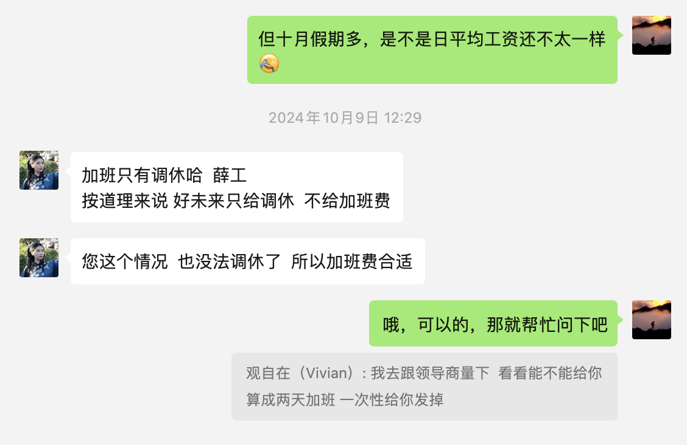

1月2号
今天刚过完元旦第一天，我也入职了新公司，飞虎互动，是做银行实时音视频项目的，希望未来的工作能够如意吧

1月5号
看来我还是低估了这边工作的复杂程度，需要涉及到很多小窍门，各种内外网环境，各种单独的打包构建
还是要做好长期备战的准备吧，争取在这里活下来，即便现在是艰难的，但前途是光明的，有什么打不了的，不都是人做的吗，既然别人可以那你也可以，阳光底下没有新鲜的东西，振作起来，敢于闯，敢于实践，抓住上班的时间去做，别到了下班时间再弄，明白没

1.6
我发现人生真的充满了痛苦，或者说我就是那个不怎么幸福的人
今天起来不怎么高兴，做啥也高兴不起来，难道这是为情所困吗，没找到工作时想着赶紧找到工作，等找到工作了，又为工作中的难题而发愁，这倒还是可以解决的，就三个方面，多看看代码，倒也无所谓，主要是环境问题太过复杂，各种内网外网环境，以及设备的兼容问题比较多，你想想昨天遇到的几个关键问题
1.p30黑屏
2.ie浏览器聊天报错，
3.ios切换摄像头没声音的兼容问题，
这些不都是兼容问题吗，那就需要你反复验证测试，报给zego就好了，总共就三个项目，再坚持坚持吧
我交接的同事是武晓娜，因为刚结婚要被公司辞退了，和我是老乡，永年的，没想到永年还有这等优秀的人，我怎么没早发现，她温柔的性格还是比较符合我的心意的，能承受那种压力，还是比较厉害的，这要是结婚了，还不得上的厅堂下的厨房，哎，看来我不能和女人有过多接触，才一周就春心荡漾，眼中影响自己的斗志
我还是要为自己的二房东事业奋斗吧，这是必须要做的事情，什么事都没这等事重要
最重要的事就是要说到做到，只有这样才能拯救自己，才能不让自己痛苦

相比较于工作，二房东真的是我能找到的最简单的工作了，就这样你还不去行动，你想干嘛，就是，想着老了没钱花，苟且偷生，再来后悔吗？

1.10
到今天这个阶段，大概流程清楚了，接下来就是细节，坐席总共有哪些日志，每个日志，代表什么意思，生产上从哪里取，把那个项目看下代码，弄清楚每个代码代表的意思，没多少代码，以及怎么打包部署的，没多少，以及周末加班，每个bug是怎么解决的，以及我一开始是怎么设想的，等等，总结起来

最近过户快接近尾声了，周二办了过户，以为不用交个税了，因为当时没查出来，今天通知还得补上，哎，发现这几个点的税也好多，足足交了三万多块钱了，
针对要不要骑摩托回家的问题，还是骑吧，因为我不想在陷入十一没人接的窘境，哪里都去不了，我要将主动权掌握在自己手里，让腾达和宝宝提前回去吧，因为不同路，早回也能到时候接他们回去
去年春节是因为腾达在家过年，所以我没有到处走，今年不同，他们在邯郸，所以我要有随时溜的打算
>点评
最后果然让我说中了，去时容易回来时难，一待就搞到晚上，就住下吧，等第二天再走，还得让人送，世超还在用雄超车，还不方便回来，你也不是那种愿意打扰别人的人，结果到了曹庄路口，迟迟没等来车，不得已让晓姐开着她新买的大众来接，

4.7
今天清明放假了，说好要一起去西山温泉体验一下，本来不想去，但在腾达的极力推荐下，就一起去看了下，但到了后并没有想象的那么好，饭是自助餐，随便吃，每次吃自助餐都感觉像喂猪，吃饱了还要硬吃，纵然是山珍海味也没有了愉悦感，所以以后不要去吃自助餐了
玩儿也没有想象的那么好，说是随便玩，其实可玩的没什么，玩个保龄球还需要排队，麻将我不喜欢玩，其他的就是玩水了，但腾达始终领着我赶往下一个玩儿的地方，都没心情玩了，于是水也没玩成，感觉不值三百多的价格，以后要多个心眼，当腾达向我推荐一个地方时，如果描述了100分，只能打个对折，不要期望有多好玩

4.8
今天去燕郊收拾房间，每次去都感觉自己买亏了，园区的环境太差，以前总觉得配套好最好了，现在发现不是这样的，配套好了，小区就会太乱，今天去中兴和园取滑滑梯，发现人家的小区很好，小高层，2.0的容积率，宝宝都有玩的地方，怎么说呢，一进人家小区，人很少，那种阳光的感觉，偶尔走过一两个人，感觉很好，单元门不高，门前就是大片绿植，虽然是11年的房子，但完全感觉不到年代感，比我的房子好多了，
以后看房子不要只看客厅和卧室，那有什么好看的，重要的是卧室和厨房，我有几个不满意的点
1.瓷砖都空鼓了，因为是精装修交房，瓷砖贴的太糙，都没对齐，不要买精装修的房子
2.厨房和卫生间的屋顶太老气，装修都过时了，要买又要不少钱
3.马桶换了
4.卫生间的户型太差，哪有马桶对着洗手台的
所以买了老房子后，我发现距离地铁近也不是很重要，距离稍微远一点，配套差一点，房子好一点，也很不错
怎么算是好房子
1.从窗外望出去的风景要好，这是最重要的，保障你时时都有好心情
2.容积率要低，有游玩儿的地方，房子不是给人一种很廉价的感觉，这点也很重要
3.至于第三点 房内的装修不要很老，这都好，虽然也很重要，但也不是最重要的

5.27
今天工作到十点半才下班，正当我为下班太晚，自己亏了而愤愤不平时，下了地铁，看到摆地摊卖小吃的还在地铁口，出租车司机还在等客人，当走到燕郊时，那路口有很多出摊的还在忙碌，让我想到了叔，那么早还不收摊，还在等着客人，一阵心悸，我有什么理由放纵自己呢，
想想蔡磊因为渐冻症，即便拼命努力也找不到治疗方法，只能眼睁睁看着死神降临，他希望自己能像一个乞丐匍匐在门口看着孩子长大，但一切都不可能了，如果拿一辈子不玩手机和他换，他肯定接受

读到纳粹医生，感叹环境对人的影响远超想想，抓紧自己的时间

及时暴露问题，不要藏着掖着，小程序弄完了，就要抓紧体测，别以为不体测就不会发现问题了，最后一下子干到十点半

6.3
今天周一，周末又玩了两天手机，没有好好履行自己的承诺，
芒格先生非常推崇李光耀有句名言，找到可行的办法，然后做就行了，虽然简单，但却威力无比
我需要防治的是自己做愚蠢的事情，比如只要开始要手机，门都不出，无尽的沉沦，我需要做的是让自己出门，这再怎么强调都不过分，
求求你了，不要再相信在家能工作学习好，只要有一次失误将会造成无可挽回的结果
所以想到了将手机锁到车里，但还需要看闹铃，还是启动我要当学霸吧，好久没用过了，发现很重要

为此

6.7
看到了吗，又是九点下班，干的这叫什么事，三方都要对接，排查问题异常困难，
不明所以的问题排查，哎，干个活这么难吗，没这么憋屈过，我想要离职，但现在离职的愿望又没

6.12
我算是知道了，你晚上回到家根本控制不住自己玩手机，今天早点回来吧，结果一口气玩到9点，所以以后还没进家门就要吧手机锁起来，
以后实时待着手机盒，走到哪儿锁到哪儿，不要进家门了在锁，下地铁就锁吧

6.16
我是怎么错误做出去世超加这种决策的，我当时觉得好久没看望妈了，应该去看看，其实也没错误，确实应该去看看，但我错在不应该在家
自习，昨天试验的结果充分证明了，虽然你将两个小时的视频看完了，但也仅此而已，一会儿中午睡过头了，一会儿艳春要来看望，多呆了会儿，
一会儿累了再休息会儿吧，即便在没有手机的情况下也各种理由，所以还是去图书馆吧，虽然远点，但质量高，只待到6点吧，多一分钟都不呆

6.17
到家时，没有锁手机，因为还要看抖音上学习，并且许诺自己，只能学习，但凡抓住一次，立即将手机锁起来，但后来还是心血来潮要看邓小平传记，
玩了半个小时手机，看这些有什么用呢，都已经看过整部书的，所以又验证了，不要相信自己的直觉，把手机锁起来就对了

6.19
嗨，晚上7点下班就不要带电脑回去了，吃完饭就半个小时了，有啥用，所以不要带电脑，以后要学习就学完了再回去，凡是带电脑回去的，绝对是个谎言，另外不要每天解决生理需求，两天一次就行了，绝对可以的，以后七点回去吧，到家看会儿书就可以了

6.20
自己在备忘录上写的东西，不难的三天内完成，难的一周内完成，不能总在那儿放着，否则你也没有再次记录的动力了

6.21
谈谈面试别人的感受吧，感觉别人并没有我想象中的那么强，想象中的是一个大牛，面试别人可能会把我问住，但并没有出现，
那人技术还没我好，就随便聊了聊，聊了他的工资，聊了他的工作经历，等等，当然如果技术比我好，自己也要承认，那这人肯定可以的
那我之前为什么那么抗拒呢，是因为我想的太多了，把自己的技术想的才菜了，害怕被别人问住了，所以什么事情也只有试过了才知道，一定要克服心理关啊
这种才是最欺负人的，你明明能力可以，只是那层窗户纸没捅破，你就到不了那个阶层，所以做二房东的事业也是如此，你不要想的太大，而不去做

6.25
我发现我对自己太仁慈了，

7.1
已经离职了，如果你感觉自己学不动了，没关系，那就管好你的私生活，这总可以吧，回到家将手机和电脑都锁了，早点休息，人生还有比这个更无助的事情，别这点困难都受不了

7.6
当我晚上回来，在解决需求时，那么多电影，我从一个切到另一个，一个有感觉的都没有，那么多电影，我下载时可都是抱着很大的希望，这个需要，那个也需要
而现在我都没耐心将其中一个看完，看来我是个很有使命感的人，基因里带的不愿意在这种事情上浪费时间，所以你要尊重这份基因，别在这种事情上浪费时间了

7.9
你问我什么时候将手机锁起来，我的回答是随时，不经意在什么时候，就会忍不住看一眼，然后就会背刺你，尤其是在昨晚大量劳动，很累的时候，或者刚回到家有
大量时间的时候，

7.20
今天坐在这儿感觉没什么收获，上午玩了一上午手机，下午浑浑噩噩的，漫无目的的整理了几道面试题，没什么方向感，然后又玩了会儿手机，就到了该走的时间了
怎么说你呢，在城市图书馆待到8点又有什么用，待的时间长，效率就高吗，唉，还是先将我的私生活管理好吧，或许是我昨晚睡的太晚了，12点睡的，导致学习没精神，所以说，如果你不愿意学习，学习没动力，先将自己的私生活搞好，这总不过分吧。早睡早起。

似乎知道你为什么学不下去了，一个在课余时间只知道玩手机，一直看视频到12点的人怎么能在早上有精力学习呢，学习不是说你白天做到这儿就可以了，工作时间
和休息时间是严格分开的，休息时间我就放飞自我了，不是这样的，会有深刻的影响，所以我休息时间也要严格要求自己，将手机，电脑锁起来，早点休息。这叫好好休息，保证工作时间能正常工作

7.21
我感觉你之所以没学习好是因为不会休息，感觉还是要回到之前讲的，学习半小时要休息5分钟，到点就要休息，强制休息，不要加班，才能够在学习时提高注意力，
如果混为一谈就会浑浑噩噩，一会儿看会儿b站上的视频吧，一会儿看会儿尤雨溪吧，等等，看完后，再学习又不知道看到哪儿了，关键是你还以为自己没休息，
这时候又想休息，学习还眼疼，没有耐心，学又学不下去，内心想着这么点东西看了这么久，就不想再看了，属于典型的休息不好，玩不尽兴，学习还没兴趣
不要陷入到这种循环，该休息时要好好休息，学不进去可能不是你的原因，而是没休息好，所以还是要强调令行禁止，6点到了就要回家，到家后10点前上床，学习25分钟了就要休息5分钟，珍惜学习时的时间，而不是拉长战线。

7.22
今天周一，开始投简历了，但没收到一份邀约，明天还得继续投吧，今天比较严格的遵守了半小时计划，整体下来还是比较顺利吧，明天还要再完善下简历。

7.23
到整理简历时才发现很多东西都没做到，比如用户进入直播间比较慢，如何减少进入时间，唉，这个如果当时做了，现在就是简历中的一大亮点
可是我没去弄，只是当做是别人的需求而已，我应该将进入直播间的流程都搞懂的，包括token是怎么获取的，后端怎么校验token，为什么还需要有签名，
这都是前端防止csrf漏洞的一部分。
包括axios是怎么封装的，以及有什么不合理的地方，这些都应该输出到csdn文档上，防止找不到了

春阳是怎么做运维列表优化的，通过Intersection Observer，那这个你就需要知道啊，也写到csdn上，将来遇到了这也是很好的知识点。
包括别的项目组的微前端是怎么实现的，当时如果准备了，现在也不会这么吃力了。
还有后管的视频剪辑如何大文件上传下载，这些都是可写在简历里的点，你也没有收集
终于知道为啥人家春阳面试好了，你看人家写的技术，就不一样，每一个项目亮点都很突出。
在比如说excel文件是怎么下载下来的，怎么实现大文件的断点续传等等

7.24
你什么时候才能明白，我说不推荐去做就是不要做的意思，早上起来突发奇想要 解决下需求，结果一下子搞到了十点，弄了将近4个小时，迫切需要有句话提醒自己
挂在强上，不要去做。
今天等了一天的boss回复，结果没有面试，我没有把手机锁起来，导致一会儿三心二意的看会手机，没有学习进去，再加上上午来的比较玩，总归今天没什么收获吧，
我要认识到问题的严重性，我还没有工作，要抓紧找工作啊

唉，我就不明白了，开心也是一天，不开心也是一天，你就不能做让自己开心的事情吗，晚上准时把手机电脑锁起来，按时睡觉，早上6点起床，骄傲的去吃第一份的豆腐脑，然后充满成就感的去自习室（车也不堵），然后遵守半小时工作计划(我不纠结你浪费时间了)，收获满满的回家，让一切水到渠成，不担心没有工作，这样不好吗，
干嘛非要该做什么时不做啥，晚上玩手机到很晚，白天到10点才充满罪恶感的出门，到早餐店告诉你豆腐脑卖完了，大热天的到图书馆，到了自习室也是隔一会儿玩儿手机，搞得自己很累，还没学进去。最后充满失望的回家。
干嘛非要这样呢，你明明能够做出选择的。你明明知道自己生来就适合努力的体质，怎么能连控制玩手机这点小事儿都做不了呢，不就是寂寞会儿吗。

    
7.26
跟做了一场梦似的，长城电子接手了飞虎在华夏的项目，需要我过去帮忙，之前聊过一下，但很久又没联系了，昨天又聊了下，到前门的星巴克见了一面
他说我还行，让我过去，我也答应了，昨晚一直没睡着，一直心情很激动，因为从飞虎离职后，我一直在找工作，快一个月了，有点再而衰的感觉，刷简历都没有好的约面，他这么一说感觉像是雪中送炭，我给他说我在职，现在23k，哎，我想要25k的薪资不知道能不能给到。所以昨晚想怎么谈薪资的事一直没睡着，
今天也没怎么复习，投简历，因为没心情，一直在想着他什么时候打电话过来给我谈薪资
怎么说呢，我觉得还是平常心吧，是你的就是你的，不是你的想再多也没用，你在这儿想来想去，人家可能就是一句话的事儿，最终还是要落实到行动上
把自己想做的做到就行了，至于结果如何，随天意吧，也没必要非要争取，就当是个过客了。

7.27
今天周六，不想去图书馆了，感觉工作有了着落（虽然并没有，还没发offer），就在漫无目的的看着电视，今天是巴黎奥运会开幕式，看来看去，找遍了b站，实在是没什么有意思的视频。还把脑子搞得糊涂不已，算了弃坑吧，还是冥想吧，还是做饭吧，所以不要总是想着玩手机，没啥有意思的东西。
而且一边还在解决需求，最后脑子也不清醒了。最后也是糊里糊涂的结束了。毫无体验感。这就是所说的玩也没玩好。

7.27
薛帅超，你该啊，昨天周六，不想去图书馆，想着就在家吧，一开始还想着在家把饭给做做，还想着未免也太轻松了，结果手机一玩起来，别说做饭了，自己都差点饿死，什么都没弄，晚上还熬到2点多才睡。所以说别相信自己说在家能干事情，啥也别说了，直接去图书馆吧，即便去玩手机都成，家不是那么好待的。
另外，早上醒来第一件事儿是穿好衣服出门，剩下的再想，是去图书馆，还是去菜市场买菜，否则，在家没穿衣服，玩手机，就相当于这一天出不了门了。
即便你在家就不出门了，也要穿戴好做好随时出门的准备，也不能玩手机
那么你会说，手机不能锁了吗，但那时候你不会让自己锁手机。
以后还是放心大胆的锁手机吧，因为手机上确实没啥好看的。

7.31
4天没来图书馆了，哎，人生就是遗憾的艺术，我甚至认为只有感受到遗憾了，才说明你正在进步。
体操队因为失误连续掉下来两次，憾失金牌，张艺谋导演北京奥运会，那么完美了，还是在最后时刻小林浩差点没赶上游行队伍，一名独舞演员刘岩不慎摔了下来，
终身瘫痪了，，你当然认为躺在家哪里都不去就不会有遗憾。前进就会有遗憾，一次次不断的失败才可能会成功。我们要习惯失败，因为失败也是成功的一部分。你可以

久看手机，突然想学习时会看到遗憾，有种挫败感，
你去做二房东，有的差点没谈下来，遗憾

你要去拥抱这种遗憾，享受这种遗憾，遗憾不意味着失败，恰恰以为着成功，可以认为是成功的一部分，成功可以分成两种形态，一种是你登上领奖台，一种是差点成功，真正的失败是根本就没去做，是在家躺着。

整理小说也没啥用

8.1
当一件事可做可不做，那就是必须要做，比如回到家上楼前要不要把手机上锁到明天十点，彼时彼刻就感觉可做可不做，又不一定玩，那就是必须要做的，没得商量。
不做可能会因小失大。再比如要不要把电脑锁起来，可做可不做吧，那必须要做。这是原则，什么是原则，就是不可逾越的。

8.4
今天还算好吧，提前锁了手机，所以今天没看手机，但是收获不多，被内存泄露卡住了，百度了好久，感觉一天就弄了这一个问题，哎，不能再这么搞了
你是在找工作，而不是已经找到工作了，针对这种不高频的问题大概知道就行，可以先打个标记，以后再细研究。

8.19忽然想到大学时，办完培训班后，请那位女同学吃饭，他没有赏光，哎，你也不看看你是什么德行，怪不得你追女朋友没戏，反而，另一个男同学，他的阳刚性格一直出现在我脸庞，人家的性格又好，长的又有性张力，还学习好，我应该学习的是他伏案学习时的模样。
不要再看知乎了，昨天看了一天，哎，有任何事情时也不要打开知乎了，可以到处走走

9.19
昨晚，领导找我谈话了，表达了对我在新入职的这两周工作不太满意，没有表现出主动性，可能是没有主动承担任务，一个视频组件搞了很久，其他的就是做写小改动，
这样肯定是不够的，我还以为让我离开，然后他问我有什么想法，我说那就直接安排任务吧，可能是之前安排的任务不够。要主动去请求任务，不管是大任务还是小任务
要事事有回应，让别人看出你的能力，在心里给任务评工期，按期内完成，该加班的加班。

天底下没有新鲜的事情，给的任务不论是问也好，还是怎么也要，一定要按期内完成。我一定可以的，一定，一定，一定可以的。

我发现每次新工作，都让别人警告一下，之前在飞虎也是，廷会给我说，再不行就要换人。看来我自己真的缺乏主动性。要给自己压力啊，主动去完成任务，否则只能被淘汰。
相比别人催你，自己催自己我会更好受点，

9.20
昨天让查一个bug，结果查了一天，唉，还是太慢了，不要犹豫，感觉出结果了，就要立刻说出来
共同商量解决，不要一个人死扣出解决方案，还不一定对。

要多交流，多反馈结果。让别人知道你在干啥，别一天都不说话

成功最大的障碍是懒，这句话很有道理，所以说不要养成懒惰的习惯，包括思维懒惰和行动懒惰
要像小蚂蚁一样，每天都勤勤恳恳的。另外在培养子女的方面，也不能让他养成懒惰的习惯。

薛帆尿尿时，我总喜欢帮他，自己还特别有满足感，其实这是不对的，要学会放手，让他自己去做
别离不开孩子。你帮他其实是害了他，力所能及的让他自己去做，别不忍心，现在放不开手
等到老了，你还能帮他尿尿吗，你是在给自己挖坑

不论是做私活还是松歌安排的活儿，一定要每半天汇报一次，让别人知道你的进度。

9.21
回来的路上，一直在看视频，突然想到看视频不用你动手，多简单的事情啊，相比较在公司手足无措，困窘的样子，这样轻松多了
想到了招商银行还欠着十万块钱，而自己现在赚钱能力又降低了，该怎么办呢，

想着想着就想要玩手机，但看手机又看到一则舅舅打小孩的视频，小孩无意扔到了舅舅，舅舅直接一脚将孩子踢的老远，都碰到了墙，孩子起来的第一件事是找舅舅求安慰。看着自己很伤心，这无疑是在消耗自己的情绪，都这样了，还有时间看手机吗

9.23
我已经没有时间陪孩子了，我得做属于自己的事，周末不可能都一直在家，什么都不做，我只能晚上陪孩子。带孩子大部分责任要给到腾达。

9.24
昨天自己工作不是很积极，一个小东西搞了很久，还是要提高效率，
如果说影响一个人成功的最大障碍是懒，那这么说只要勤快，就能拜托生活中大部分烦恼，这无疑是一比很划算的买卖。时刻告诉自己不要懒，像蚂蚁一样，动起来

坐在这里研究好未来的代码，有很多还是看不懂，就有点退缩的感觉，开始胡思乱想了，想了很多，想到了如果我晚点从飞虎离职会怎样，会不会就入职长城了，就能拿高工资了，想到了入职新公司熟悉代码也是一项很艰苦的工作，以后还是尽量少换工作吧，在飞虎毕竟都熟悉代码了，再待两个月又会怎样，终于明白了，为什么很多人都不怎么换工作，像广数，有熟悉的代码，始终可以居高临下的看项目，就会不断地增强自信。

唉，但我当时并不知道长城要招人，还面对那样的环境，我当然是不想待着。趁着领导刚好说要裁我，那我当然是就坡下驴，早早的提出离职，只能说一切都不凑巧吧，明白了，有时候，为人方便，有何尝不是为己方便。要怪只能怪造化弄人吧，一切都太不巧了

很多时候，人的不顺都是自找的，松歌我愿称他为努力形选手，人家敲代码时，一会儿手机都不看，这份毅力，如果我能一直坚持做到，也不会陷入到外包的困局中。只能说还是要继续努力吧。

10.5
今晚我充分感受到自己的教育方式有问题
因为今晚和腾达吵了一架，今晚宝宝和我睡，然后看ipad到快12点了，还不睡，一拿走就哭。试了关机等各种方法都不行，我都有点生气了。明显就是不怕我的节奏
今天下午在图书馆也是，有我在时，宝宝一直让我抱，否则就不走了。和腾达在一起就没这个问题。

这可能是因为在三季市场，他一说让我抱，我就会抱起来，而且在其他人多的时候，我也会主动选择抱他。这两点促成了我一定会抱的印象。
说明什么，宝宝也到了看人使颜色的年纪。
为什么会这样呢，根本原因是，我太软弱了，宝宝一哭，我就放弃了
所以根本办法是要不妥协的拒绝，比如今天在图书馆，我说不抱，他肯定就不走了。

10.8
好久没写日记了，今天写写吧
今天是十一假期后，第一天上班，但我没有去，因为我被辞退了。在好未来上班一个多月吧，感觉自己还没用力呢，就被领导谈话说不合适。好吧，那就走吧

十一假期，第一天去了南锣鼓巷周边逛了逛，主要是带宝宝坐地铁，宝宝现在越来越可爱了，很多话都会说了。真的想留住他的每一天，把他的视频拍下来。
第二天在家做饭。做了很多菜，第三天去了西湖园看飞机。然后剩下的四天我去了图书馆。哎，说是去图书馆，感觉一半时间都在玩手机。其实我要告诉自己，即便不玩手机我也一定有别的方法可以排解的。

因为节前腾飞来我们家推荐保险了，我曾承诺过腾达，要在假期将保险研究透，然后给宝宝买保险，但最后自己也食言了。很是抱歉，我总是做不到自己说过的。
要赶紧买啊。

最近看短视频，感觉有个从化中汉良卖牛杂的视频号很不错，人家摆地毯卖牛杂很火的。我也感觉有个自己的生意也算是创业了，将生命掌握在自己手里，就不用再去敲代码了。创业是一个人致富的最终途径。

10.9
怎么搞的，最近老是看手机，其实也不是非看不可，不看完全有别的事情可以做的。
今天还是来到图书馆了，一边玩手机，一边找工作。以后不能这样了，6点之后就要走。不要弄车轮战。要有时间观念。

任何时候都不要精神内涵。节前问长城电子的领导，问他还招人不，他说可能招，但要问下项目经理，然后节后就没回复了。我今天一直在纠结要不要和他确认下，
内心想着这时候都没回复，肯定是不招了啊，这还用问？但有想着会不会是忘记了，要不要再确认下，就这样纠结了一天，
告诉自己不要有精神内涵，直接去问就好了。就像之前字节外包骂我一样，即便骂了，我也不后悔了。将选择交给别人。

之前还想着要不要回复中汉良牛杂，因为都过了那么久了。直接问就好了啊。当你纠结要不要做时，去做就好了。

10.10
三个笔记软件对比：
onenote 没有目录，
有道，比较垃圾，总会报错，而且有些东西莫名就丢了
印象，要钱，而且粘贴也要钱
这样看来还是md最好
为什么要将onenote中的前端笔记整理到md文档，1.因为容易搜索，2.因为代码可读性高，这太好了

好无聊，有在这儿看了一天的手机，根本没有学习的动力。哎，我这是怎么了。

10.11
昨天没去图书馆，因为有点低烧，晚上睡觉时，浑身酸痛，现在好多了。今天到图书馆后，又玩手机到了下午五点。哎，不要再玩了，感觉将手机锁起来吧
哎，早点锁起来就好了，你怎么就做不到呢，本来我以为刷boss要频繁用到手机，于是就没锁，但最后boss上没有消息，自己倒玩了好久的手机。

对啊，我怎么从来没考虑过将微信卸载，如果实在卸载不了，就再买个手机，不包括微信的
可以给自己准备两台手机，分别是在外联络手机，和安心工作手机，分别下载对应的应用
那你为什么不将手机锁起来，这样不就一劳永逸了吗，如果锁起来就无法投boss简历了。所以我就没锁。

哎，给自己准备两台手机，一个是全功能的，就是现有的手机，一个是特殊工作环境的。比如在图书馆，我现在只需要boss直聘

只有boss直聘也不行，比如今天就有个hr通过微信发面试链接，面试还需要通过腾讯会议打开，我还要通过录音功能去录音。这些都是正常手机的场景。
所以我还是只能在现有条件下克服了。
那就每次用完腾讯视频后，将视频隐藏吧。

10.12
在图书馆，看了一上午的手机和知乎，中午吃饭时都舍不得走，往后推了又推，陷入了死循环，不想面对真实的世界。恨不得在路上都拿着手机，沉迷在手机的世界，有这些严重的反噬，我为啥还要去做，不如真实的世界，看了一上午面试题，累并快乐着，怀着坦荡和休息的心情去吃饭。所以真实世界才是永远的王。

归根到底，沉迷于手机的世界终究是没有意义的，李敖说年轻人不知道什么是真正的快乐，也是，说不出两句有道理的话，怎么有快乐可言。

10.13
今天早上的需求解决的很好，早上失眠了，睡不着，5点起来，躲到次卧中，只看了一个视频就射了，此时也刚好在兴奋度最好的时候。
不至于因为频繁切换导致期望太高从而降低敏感度，体验会直线下降。所以要记住少就是多。仔细体会一个视频比你漫无目的的浏览要好。

这是以后解决需求的第一准则，少就是多。在兴奋度最好的时候，既解决了需求，又不浪费时间。这种双赢的事情何乐而不为呢。
类似双赢的事情还有没有呢，其实任何时候都是，我把他解释为过犹不及，在知乎查东西，查到就行了，如果看推荐，那就没完没了，可能最后要查什么都没记住。
那为什么没有需求，也会想要浏览呢，那是因为你寂寞，想要通过其他活动排解，至于形式，其实你无所谓，刷视频，刷头条，整理收藏小说，都只是形式而已。要摆脱这种倾向，寂寞就寂寞，不一定需要排解。但寂寞是最难熬的，没办法这是必须要度过的难过，一定有事可做的，你再想想

今天投简历，因为是海投的，遇到一个招聘人员，问我会ssr吗，我说不会，便不回我了，我还觉得他没礼貌，后来想想也对，你都没好好看我的招聘要求就投我公司，我都懒得回你，不骂你就不错了，浪费我时间

看斗破有感，熏儿私自跑到叶城去见萧炎，古族让翎泉统领将熏儿带回来，翎泉说：，我在想为什么要给主角设置障碍呢，他将来可是古族的盟友。古族怎么能放心交给翎泉处理呢，万一他给办砸了。原来，如果主角在翎泉手中都活不下来，证明他还不合格。就此抹杀也无不可，古族根本不会在意。如果他能活下来，则证明他有足够的本事，到时候古族再去招安，也无不可，此举便是能过滤一些不必要的人。
就相当于古时门前的管家，只有搞定了他们，才能再往前进一步，如果他们都搞不定，那证明你是个没有能量的人，即便进去了大概率也办不成事。至于管家对你做过什么，上边的人不太关系。
我被裁员也是，廷杰和有个叫不上名字的hr迫使你接收补偿，他们只是小鬼，如果连这都熬不过，你便死了，别人也没有义务知道你。如果你熬过了这一关，别人才有义务知道你，这能够过滤一部分人
那你到底在怕什么，为什么屈服了。因为廷杰说要布置我完不成的任务，我对研究主播端太畏惧了，搞不定就会度日如年，比如还让我换工位。我没想到这已经是非工作范畴了，人家志龙就敢于说不，敢于说“谁敢动我工位”，我怎么就没想到呢，只能任由他们欺负吗，
所以现在回想起志龙的种种，敢于在酒桌上说不，敢于和王琦动怒，敢于在周会时否定廷杰的计划并提出自己的计划，只有这种有血气，敢于说不的，并专心投入工作，投入自己的人才能享受生活的馈赠。像我这种因为廷杰一句话跑到邻桌敬酒，在聚会时碰杯比谁都欢快，表面上一团和气，最后领导第一个裁你。甚至连一个季度评奖都没有你的份。纵观整个项目组也没别人了吧。我加了最多的班，混到这个地步，回想起来不禁令人唏嘘。
那么落到这个地步，我有什么需要改进的。
1.还是要提高自己的核心能力，提高生活的自律，养成高贵不可侵犯的性格，敢于拍案而起的性格。
2.提升专业技能。
3.不要脑子里全是工作，多用时间提高下ppt。让领导知道也是一项技术活

动漫里靠打架过招来确定孰强孰弱。真是一打借千愁，那现实生活中靠什么呢，靠的是说话，气场，气场可以表示你是几星斗宗，说话可以有来有回频繁过招，又不会伤及性命，真是最恰当的比喻了。

10.14
早上，腾达大姨妈走了好几天了，想着好久没做了，打算来一炮，又是一个被窝又是蹭蹭唧唧一个晚上，结果早上套都戴好了，要进去时，她又在找卫生纸擦手。我很理解不了，不能等我进去再擦吗，太容易分心了，而且很干，也不容易进，我一下就软了。她可能也在抱怨我吧，是你自己不行，还怪我擦手

既然谈不拢，索性就不做了呗，都宽心。
所以做爱要遵守以下几个条件
1.要足够的湿才行，太干了不弄，还得自己费劲
2.必须要双向奔赴，只要她不想要，表示太困了等字眼，一律停止
3.如果她不想要，就不要一个被窝了，会忍不住蹭蹭唧唧的，也睡不好，到头来一场空，干嘛呢

我发现一个很好的地方，楼梯上，既安静，温度又合适，而且也没网络，这样知乎都看不了了。简直比图书馆还好
为什么安静那么重要呢，你在家里的次卧也没人打扰你，怎么就不行呢，我觉得主要是不安静，会打扰我的思绪，没办法进入到工作状态。无法进入深度思考。
那还有必要去图书馆吗，图书馆的好处是有氛围，那我觉得现在氛围也可以，先不去了，再看效果吧。主要面试的时候没网，不太好

我现在在楼梯间学习，下腹有一直有一股冲动伴随着我，想让我来一发，说明欲望有时候不是一阵一阵的，他会一直伴随着你，诱惑着你，我认为这和演讲紧张一样，他会一直伴随着你，克服办法只有与他共处，当你足够熟练时，紧张也影响不了你，所以我需要和欲望共处，当我足够坚定时，欲望便影响不了我

10.15
昨天晚上失眠了
因为有两天调休，算起来，10月9号从上家公司离职，然后公司说将那两天当做加班费一起发了吧，我想着虽然十月工作日少但也只少一天，工资会多100块钱，但能提前一个月发就发吧，于是就答应了。

我还想着，都是打工的，她应该会为了我好吧。她说合适就合适吧（现在看来不能有这种想法，即便他是个打工的，他也会为自己着想，为公司着想，买房时，让你买车库的这么干过，尔湾的hr这么干过，现在她还是这么干，不要有他人为了你好的想法）
今天工资发下来了，晚上腾达问我，我说一起发了，他一听，怎么能算多两天呢，十一假期中有三天是有工资的，还说之前她就是这么弄的，还要帮我去仲裁，还说他之前为了700块钱跑了门头沟两趟，你这是几千块钱呢。是按照每个月工作日21.75来算的。
一听到这些我就头大，晚上一直在想怎么和别人吵架，搞得我昨晚都失眠了，这事儿该怎么弄啊。非常厌恶和别人去扯这些，怪自己为什么要让别人占便宜，即便100块钱，我也要。是多少就是多少。
>工资条看了，完全不是我想的那样，加班费每天才909，是去除杂七杂八之后的。远不如单独算。
我应该如何避免这种情况
1.按规矩办事，不要让别人占自己便宜，一块钱都不行，该怎样就怎样。也不占别人便宜。我发现自己总是弄反，买房缴税时想着逃税，占别人便宜，被腾达止住了。现在又心甘情愿让别人占自己便宜。
2.我真的不是那种愿意斗争的人，还是遵从自己的本心吧，没必要为了这事彻夜难眠

昨晚真的欲望很强，而且老婆也处于排卵期，本来想来一炮的，但昨晚临时拌嘴了。打消了积极性，看来只能各睡各的了。安慰别人又不会掉块肉，要什么情绪价值，但经过她说了工资的事，彻底断了念想。

昨晚趁着失眠打了个飞机。结果今天早上还是想要，下腹憋着一股劲，说明大飞机并不能有效解决欲望，缺的是肌肤之亲。但不能满足怎么办，只能带着镣铐舞蹈了。

10.16
昨天面试了美团的外包，提前给了两道题，但我没准备充分，还是没答上来，今天还要继续面试中。
今天下腹中的冲动明显减轻了，说明只要忍得住，还是管用的。

10.18
今天早上醒了，本来想来一炮的，酝酿了半天，又是蹭又是扣的，该带套时，迟迟打不开，等着打开了我也软了，她一直躺在那儿不动，全程我主动，好像我求着他似的。一点兴致也没有了。

前两天正处于性冲动期间，晚上一直蹭来蹭去，搞得双方都睡不好，腾达已经明确表示不想要了或处于大姨妈期间，事后反思，这样弄有什么结果呢，最后还是各回各的被窝，因为在一个被窝根本睡不着。所以除了浪费时间没有别的用途。所以不要做不用功

自从前两天忍住性欲后，我发现消退的时间是一天，第二天就不怎么想了。现在是完全不想了。而且解决性饥渴不一定要靠插入，只挨着睡觉也可以。

所以我有两个办法解决性饥渴的问题
1.如果正在兴头上，并且一方不想要。那就坚决分被窝
2.如果兴头消退，只是有轻微留念，只需要一个被窝有肌肤之亲就好

本来感觉形式还挺好，经过下午这两个面试后(字节外包二面，中信银行外包)，又凉了，哎，现在都没心思复习了。还得继续找。最想放弃的时候就是最接近成功的时候，因为我的面试技术已经磨练了那么久，渐渐的已经炉火纯青了。正是最接近成功的时候，千万不能放弃

终于理解了失败是成功之母这句话，是说每失败一次，你对业务就更加熟练。越接近成功，失败并不可怕，进步才重要

10.25
今天周五，又一周要过去了，有个美团的可能会给offer，但只能给到17.5，我正纠结要不要过去。毕竟给的还是太少了，但我又没有别的offer，这就是我找工作漫无目的性，找到哪儿算哪儿，从来没有规划下自己的职业方向。
今天做到这儿看到一个老板模样的人，怎么一眼就看出来呢，就是一看就休息的很好，精力充沛，有充足时间打扮自己的人，这也是超级自律的结果。所以你自己要早点睡觉。
哎，今天面试天弘基金，我连一个react hooks也没写出来，怪不得人家不要了。这太悲哀了。分析你每次的面试，哪道题错了，重点加强练习。

10.26
今天周六，本来打算去图书馆的，结果上午有点事，下午空闲了，趁着腾达和邻居一起出去吃饭就看起了手机，一耽搁，一天就过去了，所以当你觉醒的时候永远是最早的时候。
在图书馆准备面试，玩着手机，不知不觉就到下午6点了，该回去陪娃了才意识到自己没学什么东西，不想回去，索性又玩了两个小时的手机，到八点闭馆时才回去，这告诉我当你意识到已经晚了的时候，就是最早的时候，切勿一错再错

当微信已变成不可卸载的应用的时候，他就已经成了累赘，所以我决定再拿一部手机，备用，上边只安装必要的软件，并且作为正机使用。非常时刻得用非常之发，我现在没工作，那我只考虑这段时间的手机使用情况

10.27
不要把做爱看的那么隆重，其实也就是几分钟的事情，不要有心理压力，早做完早工作
本来打算晚上做的，因为哄宝宝，提前睡着了。蹭了一晚上，第二天早上本来也是可做可不做。但我强行做了，这样才能安心工作，切勿因小失大。
因为这点小时还想一天

10.29
早上来到图书馆，看到一群人在图书馆拍摄短片，其中有个女生很漂亮，很瘦，穿的也很少，随着视频拍摄，将自己最好的体态展示了出来，我忍不住看了很久，但我应该看吗，看这个无疑会影响我找工作。这和我刷视频猎奇有什么区别，既然刷视频会影响我，那这个也同样，类似的还有路上的车祸，做地铁时偷看别人玩手机或偷看漂亮的姑娘(我曾经为了看一个姑娘，故意跑到同一个车厢)，这些都应该归类和刷手机同一个性质。应当及时抛掉

我感觉在社会中，确实需要融入某些组织，比如我的二房东群，不能只是围着小家来回转，终究这样是没出息的。

回想起15年刚毕业时，无事可做，世超都学了计算机了，我还迟迟没开始，那时行业还是很需要人的，工作很好找。但我硬是在出租屋沉寂了好久。迟迟找不到方向。所以方向比努力更重要。怎样保证自己能找到正确的方向呢，那就是要多尝试

当我觉得我现在努力太晚的时候，就想到我现在是给宝宝努力的，我的终点是宝宝的起点，从现在开始努力总很早了吧

10.30
我的找工作策略是不是有问题，不论工资多少，最关键的是不要有空窗期，就像欧神说的你一个月的空窗期要用好多个月去弥补，这是最吃利润的
假如你一个月成本是2万，假如你因为工资少2000而不去，耽误一个月，就要用十个月来弥补，如果因为少500而不去，就要用40个月去弥补。所以说要在职找工作，工资多几百少几百都还好，最重要的是不要脱产，假如脱产的成本一天是800，那么一天不上班就会耗掉一个月的工资差。所以有个工作很重要。不能因为2000块钱工资而丢掉2万的，这是为了一片树叶而不见整座森林。所以要搞清楚这个道理。

昨晚，感觉玩了好久还是只到8点，这事宝宝说是不是该睡觉了，我想可能是困了，那就洗洗睡吧。结果在床上迟迟不睡。折腾到10点才睡。最后弄的自己也异常兴奋，迟迟不能入睡，最后玩了会儿手机到12点才睡。所以要到点才能谁，实在没的玩就玩阿基米德积木吧

### 如何更好的吵架
发现相互骂并不能解决矛盾，反而容易加深矛盾，这时只有大度才是解决问题的方法，比如腾达吵架时（因为她给宝宝洗头，宝宝哭了，我说差不多就可以了），她突然吼我，我需要将最恶毒的话说出来吗，如果我们都这样说，除了让自己出气，仇恨更深外，没有更多的好处，这时不妨说一句你失态了。点到为止。反而能让对方反思我是不是过激了。

### 何小鹏在华南理工大学的演讲 如何快速成长
如何更快更大的成长，这个问题困扰了我毕业后很多年，我曾经在见马云和王健林的时候问了同样的问题
第一：行万里路，到处去看看
第二：读万卷书，特别是不同类型的书
第三：聊万次天，和不同的人聊天，不要只和你的专业兴趣爱好相同的人聊天。他无法打穿你原来的固定思维。
第四：创造一个小的平台，去探索，去尝试
> 这才是最快的成长。所以我要去做二房东项目，有一个自己的小平台，当然重拾这个项目也是你成长的一部分。不要想太多，主动去参加个活动就好了。或者多聊一次天。

在大学期间有3个对我印象最深的词
1.学习，要跨行业跨专业的学习
2.同学，再过5年，10年，你会发现大学同学是你人生最宝贵的财富(我现在有了这种感觉，毕业这么多年，始终没有在工作中的知心朋友)
3.折腾，要折腾自己才能有不一样的人生，千万不要怕别人的嘲讽，千万不要怕别人的劝阻，因为你折腾的是自己，不是别人。

> 所以干二房东也是折腾自己，不要理会别人的劝阻和嘲讽，因为成功的只是少数人，你注定走在一条孤独的道路上。

所以真理到底掌握在少数人还是多数人手中，我认为：如果只是常识的小问题，比如陌生的路怎么走，应该跟随这人群，但像赚钱这种反人性的行为。
应该自己来。

