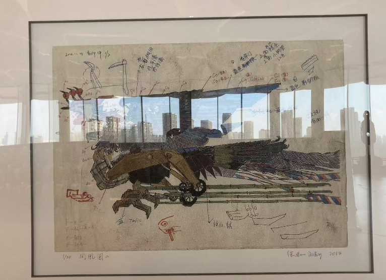
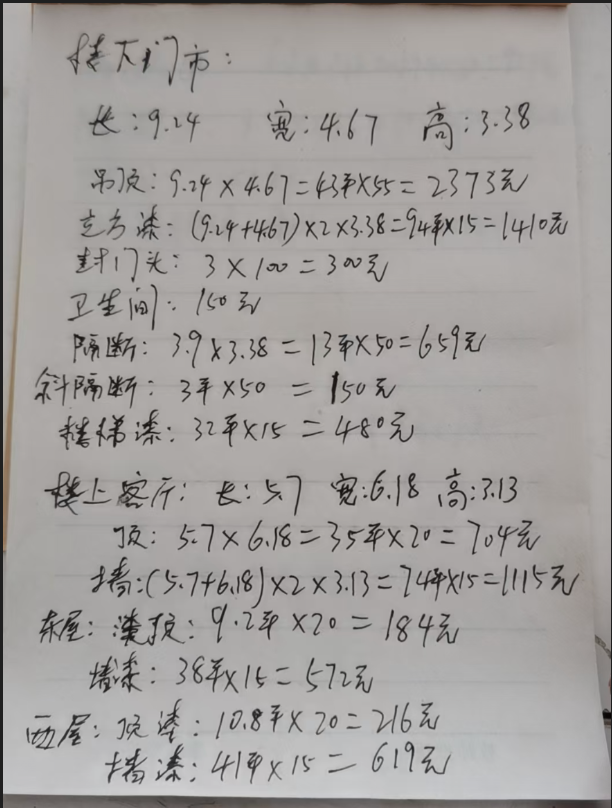
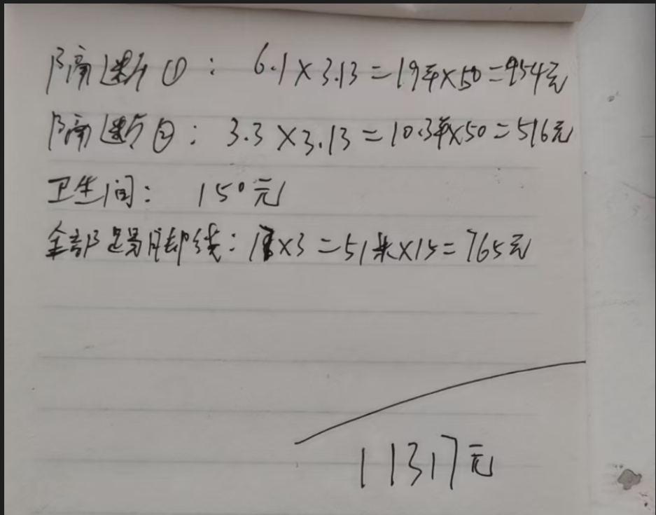
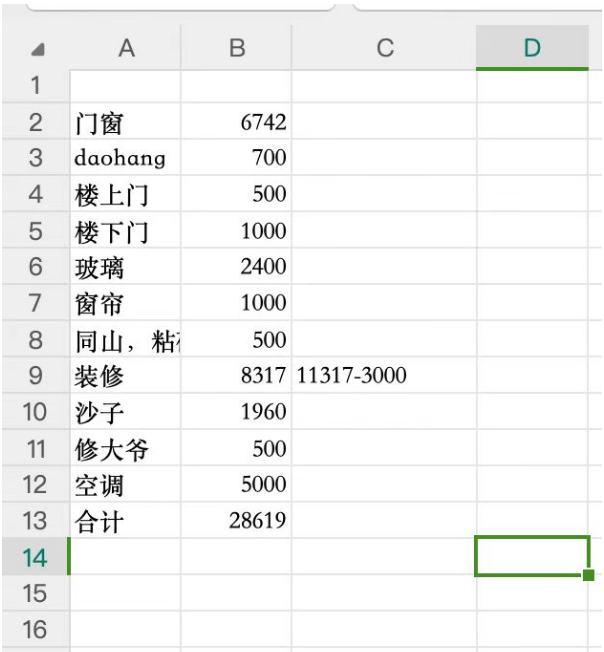
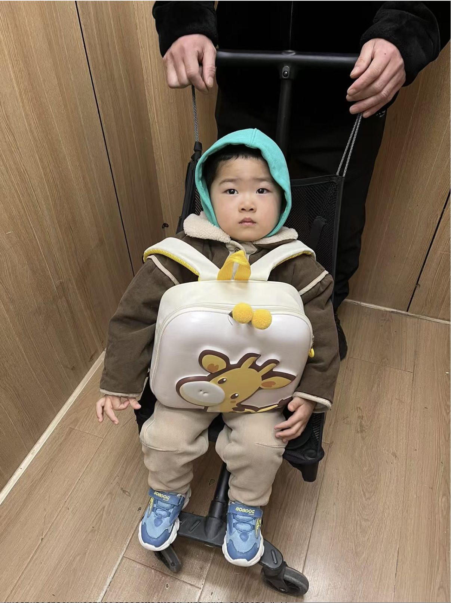
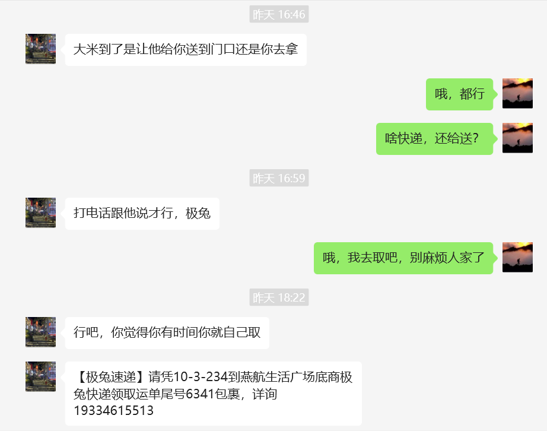

1.1
今天是元旦，走在通燕高速上，空气中弥漫这鞭炮和烧纸的味道，因为担心安全问题，各地几乎没有什么跨年活动。唯一能做的就是早点睡觉
做一个年终总结吧，
今年是遗憾的一年，因为之前的决策失误，使得今年生活比较艰难，我都34岁了，
今年换了两份工作，脱产了3个月，没有挣到什么大钱

每次都在关键时做错选择，这绝不是失误那么简单，需要做下总结
1.选择老婆
因为我之前没做过选择，想当然的选择了爱自己的，忽略了个人的成长也很重要。和你爸一样，总是一句话，有啥啊，觉得凡事都无关紧要，靠自己的努力，总是可以扭转乾坤的，现在日子过得很辛苦，才明白，凡是不是一句扭转乾坤就可以的，生活不是爽剧，是需要你一步步去积累的，每一步都很重要，我需要取得一个又一个成功。需要每一天都精心计算，每一天都获得成功。（不是让你计算鸡蛋在哪儿买便宜，而是对大事一定要慎重）

而且才明白，女人的嘴总是靠不住的，不是每个人都言出必行，要看他实际做了什么，不要相信人会改变，不行就远离，不要优柔寡断。即便没有，也不要找个错误的，让自己的生活更糟。

2.买房
每次回想起来，都会捶胸顿足，投资的关键是不要仓促做决定，要保证自己还有足够的牌在手上，感觉读书太少了，对人事了解不够透彻。花钱买教训了。

3.二房东项目
还是太仓促了，不要想着没有好的机会，机会永远是有的

4.赔偿金
要学会斗争啊，知道什么时候该怎么斗争，多学习，

5.换工作
为人还是要厚道把，我不知道后来的工作机会会变得这么难找。哎，我也不知道后来会有项目，工作是对比出来的，你觉得华夏银行的工作不好，结果到了京东才发现更差。所以呢，做人还是要知足把。

1.5
我是否对宝宝太好了，对他寄予了太多的期望，他真的能好好学习吗，他真的能寄托我的期望吗，我需要为了他把自己困住吗？大可不必，他也是我生命中的过客，

想让宝宝少玩电子产品，想让宝宝每一分都有意义，于是还要假装很有兴趣的陪他一起玩，但你小的时候也不是说每一分都有意义，不可能为了陪他什么都不做，最重要的是做好榜样，做你该做的事

我觉得带孩子还是比较辛苦的吧，有点无聊，而且总是想着去看手机，这种拉扯很耗神，一点也不像在工作上，我只要把工作弄好就行了。所以还是赶紧去幼儿园把，专业的人做专业的事

看看加湿器，以及相关作用
写一份简历

1.6
面对这种现状，我要如何改变呢，如果按照之前的轨迹走，得到的必然是相同的结果，只有走一条不同的路才行。
近点上班，

想到的事情，就要赶紧做到，比如回顾我的整个上学生涯，只对康双燕很倾心，那就应该抓紧行动，后来就再每遇见过了。再比如碰见过什么好的创业项目，应该赶紧行动。即便做错了，也不后悔。

更严格的控制手机，
更长期的冥想，
花更多时间看书，制定自己未来的规划，
要敢于行动，看到什么就去尝试，只有多行动才有成功的可能。
做到这些也只是保证你不犯错，如何在事业上更进一步。
更多的掌握业务功能，更多的掌握技术方面，最好是能找到一家公司深耕。迈上管理岗，哎，我对管理别人还是没有经验。只能先把自己能做的做好了

想到什么就去做什么好了，一般那都是正确的决定，即使是错的，那也不后悔。

为什么都是同样勤奋，人和人之前差别还是那么大，我认为是勤奋的方向不对，以及还是努力的程度不够。

未来时间还很长，我不可能从现在就不学习了，我要时常保持学习，

做成功事情，不是粗枝大叶就可以了，而是要深入到最细节的事情，这也是为什么召松要再三强调工期，再三强调细枝末节，
细节决定成败

1.10
有两点需要记录吧
来的时候骑摩托车，等红绿灯时，看到一个送外卖的小伙儿在刷手机，相对比，我是多么高贵，保持冥想就好了。我在问自己，真的需要这个时候玩手机吗，每当我想要玩手机，就要想到这一时刻，是否有必要

1.20
为什么我在这儿总是刷手机，不好好工作呢，不应该在该工作时，好好工作，早些下班吗，为啥吊儿郎当的，稍微有空隙就刷会儿知乎呢，要忍啊
了解到段永平后，才知道不要加杠杆，只变富一次就够了，不要为了三五倍的收益而冒着失去所有的风险，
那买房子明显就是在加杠杆，虽然可能会获得三五倍的收益，但也可能会损失所有本金。如果只是为了自主而买，你会考虑房子的位置，自己住的是否方便，但你是为了投资，考虑的就没那么多，会匆忙做决定，导致自己后悔无比。
在房地产高歌猛进时，当然能赚到。但在下跌行情时，就会亏。而且当时真的时一个畸形的市场，以后会逐渐走向平稳，
所以还是那句话，不要加杠杆，不要冒险。
欧神显然是在冒险，在对赌，强调血酬。风险于报酬成正比，要勇于承担风险。

1.23
别懒，一个人如果和懒沾边，那就别想翻身，当你意识到自己懒惰时，要及时敲醒自己

不要怕麻烦，最难的路也是最简单的路径，周末和世超，葛涵，老婆，薛帆去大厂民族宫，想着到处转转，拿着2个平衡车太费劲，就把他放到路边了，结果转的时候，还一直惦记着，也玩不好，没转完就匆忙回去看看了，

要尊重别人，主动给别人台阶下，
1.去宾馆开房，如果你的朋友不想刷身份证，就别往台前站，别人也不会说什么，都站了，还不刷，你让人怎么办
2.和女生约会，想带回去，不能直接说跟我回家，人家要答应了，不是很丢面吗，要说我家猫还没喂

1.25
今天请了明后两天假，坐世超的车回去过年，还是比较快的吧，路上没怎么堵车。以后尽量还是别做人家车了吧，之前葛涵邀请我一起回，我本来是做火车的，想着是不是他想找个司机什么的，不好明说。于是就答应一起回了。路上世超从头开到尾，没有我开的必要。而且人家新车，薛帆时不时会踢到什么地方，你得管着。还要祈祷薛帆最好不要在车上尿尿。有着各种限制。不如做高铁来的自由

世超让我做他车回家，也是出于礼貌，人家刚买车了，能不提一嘴吗，你也有拒绝的权力

1.26
晚上带宝宝去玩火，收摊后，会将垃圾扫成一堆，点着。记得我很小的时候，估计还没上学，就在街上玩火。点着皮筋。现在又带着宝宝玩，像是经历了一个轮回

帮父亲还账，我明白了，人们为什么要我核实工期，核实数据
当我问父亲要账单数据时，他才刚开始算，而我只是想要个准确数字而已。反推领导要工期也是一样

1.27
今天早上，别人又来上门要账了，被逼帐的滋味很难受。以后做决定一定要慎重。人怎么能不涨教训呢

再回顾一下，我当时为什么同意盖房，因为以自己当时的实力，盖房很容易。一开始想着10万就能盖起来，再加上2万装修就能搞定。相当于一个人3万块钱。
不要按照垫垫脚就能够到的极限取规划，一定要在自己的实力范围之内，不要强求，否则就会像现在这样，你当时觉得盖房已经出了很多钱了，结果现在还不断有新帐出来。而且成本严重失控，父亲啥也不干，只把活儿外包出去就行，最后人家说多少钱就是多少钱。地板砖美缝还花500，我的都是自己美的。让这样的人控制一个项目，真的是灾难。

我时常会因为自己的能力而自责，因为自己的能力不够，自律不够，看书不够多，不能够洞察事事而懊悔
抱着宝宝去婶子摊儿前，人家也没怎么理我。哎，明明我们花了那么多钱翻盖了，明明我才是最受伤的，最后反倒弄了个不相往来。真是个教训

1.28
今天是大年30，或许是我昨晚带宝宝玩火受寒的原因，晚上9点摸着有些发烧，然后用父亲给的精油擦了擦。12点就高烧到39度，我说给冬冬打电话拿点退烧药，父亲一直在一旁说没事，哎，真的是生气，他总是这样，事不关己高高挂起。这几年最大的教训是知道了父亲是怎样的人，不会再为他的错误买单了。总不能这样硬抗吧，出了事我怎么交代。最后还是打通了电话，到冬冬门市上拿了3包，婶婶还没睡，还在请神灵。给宝宝吃了半包，烧就退了

1.29
大年初一
今早去拜年，还是转了以前那几个门，这一年年过得太快了。以后都是以年为计量单位了，我之前做拜年攻略时，还想着一年后才用得着，还不知道在哪儿呢，现在都用了两次了。所以以后要着眼长远，一年也是很短的时间，并非遥不可及的

1.30
大年初二，
宝宝病好些了，照例，上午胜哥和利军哥带着他们的小孩过来了，腾飞也过来拜年，刚好凑够一桌，歇了会儿，没喝酒，到11点多，他们走了，我马上去姑姑那儿打个卡，姑姑还是一如既往的健谈，又是张罗着把盘子端出来让我们吃饭，我们说着马上走，不吃了，欢欢刚好也在家，和往年不同的是，她养了一个布偶猫，很漂亮，宝宝也是喜欢摸，**以前我是真的以为，他让我们吃了饭再走。现在或许明白了点，人家或许是出于礼貌。但你要跟随自己的想法，该走就走，谁不想轻松点。**
从姑姑那儿出来，我们直奔大姨那边，每次去他那儿喝酒都很尽兴，到了那儿，胜还有利军哥，还有姐夫已经在那儿喝了一阵了，我发现现在喝酒不是比谁喝的多，而是比谁喝的少，谁通过喝酒会来事，喝酒谁不会啊，喝那么多酒，把自己喝醉了，还浪费别人酒呢，所以不要急，

今天我做了两次庄家，当发现自己牌很好时，直接选择通开，不能这样，一点游戏体验没有。要慢慢开，不要开完，一个一个喊，不要可着一个人开，并且给别人反悔的机会。开够就行，努力少喝酒。
当自己不座庄是，遇到牌大，就放上边，尽量不要让别人开自己，遇到牌小，就放下边，做到不多喝。不要明明牌很小，还要放上边，诈人家一下，没必要，一般来说，人家的牌如果很大，根本不怕你，如果牌不大不小，可能有一丝机会，但选择权在人家，你们俩的胜率是不相等的。

在玩牌间隙，世超还和楠打电话，问他什么时候回来，其实昨天妈就和楠打电话了，楠说然然晕车，可能去不了，她想回来，毕竟都两年没回来了，我觉得她还是比较坚持主见的，今天给人家打电话，还是这么说。胜哥可能喝多了，也和她打电话，问他什么时候回来，要是我被别人这么撩，肯定就回去了，但我站在家的立场，发现，即便被人这么撩，她也可以不回来，她回来也没那么重要，所以要坚持主见，即便别人再催，别人可能没那么重要。

最后杰哥要走时，我们想着，也跟着走吧，结果大姨挽留，说已经煮好方便面了，我看下了4包，想着那就留下吃了吧。其实走了也行，比较家里还有那么多孩子。所以还是那句话，别人可能只是客气，坚持你的目的就好

回来时发现宝宝的小车玩具丢到姑姑那儿了，想着要不要去拿，父亲说别拿了，但宝宝一直会要的，最后拿了回来。
这告诉我一定不要丢三落四。再小的东西都要拿齐。

今年回来，发现时间真的过的很快，子超都上要上大一了，杰哥的两个娃上都17了，可惜都上了职教，没上高中，感觉他们都还没我会学习

没有人的事情比你自己的事情更着急
别人说着急，可能也没那么着急
别人的事情可能没那么重要，
宝宝的事情没那么重要，他12点还没睡觉

1.31
大年初三
今天去大舅舅家拜年
先给小舅舅拜年，匆匆见了一面，舅妈还给了薛帆20块红包，按说不给也行  
今年该在大舅家吃饭，得知大舅今年74了，身体还是不错的。
以往都嘲讽大舅家的酒不好喝，今年还是浏阳河，还是不错的，连续输了几场，喝的我都有点上头。贯彻我昨天总结的方针，争取让别人少喝。牌大的，主动放上边，效果还是不错的。
大舅妈也没和我们怎么叙旧，只是匆匆做饭，吃完就让我们走了。感觉像是应付工作似的，
过年就是这样，首先要把形式做到位，亲情就是一件件形式做起来的，要不然就都待在自己家里了，
还是比较佩服胜哥的，吃完就走，不久待。走时心肠要硬，因为每个人都有自己的生活，赶紧让别人回归生活，到小舅舅那里，给人家说如果没饭了就过来吃，到大舅舅那里，

回来时又把宝宝的小汽车拉下了。刚出门想着要不要回去找，要不别找了，回到家越想越不对，心里总是放不下，于是索性又返回去拿回来了。这告诉我任何时候都不要嫌太晚，当你意识到的时候，就是最早的时候

宝宝晚上一直在家哭闹个不停，怎么哄也不管用，母亲说明年腾达要是不回来，薛帆就别回来了，我明白他是随口说。没有恶意，但我当时想着，大过年的，一定要让宝宝回家过年，现在看来是自己错了，别人并没有那么想念薛帆，过年缺了谁都行，那为什么年前母亲三番五次的给腾达打电话让回来过年呢，可能是出于礼貌吧，而腾达做对的一点就是知道自己想要什么，知道别人是出于礼貌。坚持自己的想法

母亲的话也不能太相信，墙头草，口头禅就是，"你爹非要这样"，"俺也不知道"，一边说雄，不管哪个娶了就行，非要挑那么高。一边又说腾达，不回来是给谁看的。都让她说了，要不是当时随便娶，能取个这么差的吗。

2.1
大年初四
还是和往年一样，还是那波人，世超开车过去的，不能喝，雄没来，我本来要喝的，胜哥没开车，我说帮他开车，让他喝吧。聪聪今年要订婚选日子，利军哥着急回去，所以来的早，敢早上，所以到12点就匆匆走了。走时，胜哥又感觉我开车不行，于是自己开车走了。尴尬了。
所以还是那句话，能不喝就不要喝，酒有啥好喝的
下午世超要去邯郸玩，问我去不去，一起送走。我给腾飞打了个电话，因为他之前说明天接我走，打完后，果然回来了，那就明天早上一起走吧
2.2
早上7点起来，一起去邯郸，宝宝还没睡醒，又是哭闹。到那儿后，完了一天，又是招待腾达的五叔，一起喝了点。哎，不喜欢他们家的环境，以后还是少去吧，菜做的也不好吃，那么大个肘子，感觉半生不熟的，屋子里一股腥味儿，哎，一言难尽。饺子弄得有点咸，而且还煮烂了，不明白为啥能煮烂了。7斤大鱼的鱼尾，说是酥鱼，感觉喝水煮鱼差不多。我就简单吃了点米饭以及炒菜。最后给薛帆煮个挂面吧。不是那种手工面，是机器面，而且不知道哪儿弄的汤，有点苦，好好的放点盐，香油不好么。无力吐槽。

晚上腾飞说要去邯郸道玩，还以为开车去，就答应了，结果是骑自行车，本来应该拒绝的。应该先问几个人，如果去的人不多，那我也不去。人家可能也是出于礼貌。能不问下你吗，你是有权利拒绝的。

2.3
晚上坐了一晚的火车卧铺，第二天五点半到北京了，宝宝不起床，我又是抱着她上地铁，下次还是果断坐高铁吧，这样早起了两个早上，没必要。

2.4
今晚没啥事，去燕郊公园看打铁花，结果生火弄了好久也没成功，站的冷的实在受不了，就回去了。

2.5
今天第一天上班，来的时候路上没什么人，估计都请假了吧
假期过得好快，一如我放假走时那样，总结下这次假期吧
本次我带薛帆一起回去，腾达没回去。中途也没找妈妈，还是可以的，只不过比较累，时刻要看着他，去哪儿得抱着，腰都疼了。

我发现，做菜是一件严肃的事情，刀工，火候，菜的多少，放什么料，放的时机，都有精准的要求，马虎不得

2.6
以前总以为做什么事都要快，现在感觉做事要慢，比如打字一味求快，结果总是打错。比如学习一味求快，结果一会儿就没兴趣了

上大学时，总以为自己能量无限大，前途是光明的，但没有具体的目标。等到现在过年35了，意识到自己可能连一个非外包的工作都找不到，不得不面对现实。后悔自己之前没认真学习，发现人的能量终究还是有限的，必须要一步一个脚印，好好对待自己的人生

2.7
今天风太大了，零下11度，骑摩托吹的脚脖子疼，每天上下班都要骑那么久，想起来就烦，得赶紧行动，准备换工作。
昨天和艳春聊天，聊到当前的处境，都35岁了，发现可能连正式工作都找不到，可怎么办。还得是那句话，每天为自己设定一个目标。
每天进步，不要想着挣快钱，每天进步一点才是正确途径

我现在没有别的，只剩下了坚持

2.8
昨天评审测试用例，评了3个小时，我感悟到要敢于打断流程，敢于提出疑问，敢于出格，你就像啊，为什么别人中途打断提出个问题，你觉得很好。我就不能提出问题呢，把自己当成别人就好了，不需要让流程那么顺利，一点问题都没有。

2.9
今天真的很郁闷，因为下午宝宝才睡了一个小时，腾达就给喊醒了，我觉得宝宝没睡够，她说要帮宝宝养成好习惯，我就有点生气，独自在小屋刷起手机来。越刷越自闭，都忘了吃晚饭，后来宝宝去我屋里，我都不给开门，腾达就生气了，过来踢门，宝宝真的是天真，不记仇，来到屋里就让抱抱，我正在气头上，不想抱他，他就摸来摸去，吵着要我打开小猪佩奇，见我不为所动，又拍了他一下，他就生气的走了。唉，真的对不起宝宝。不应该这样的，后来，实在没有视频可刷了，我也想通了，没必要钻牛角尖，这么冷战下去，于是出去主动道歉，和腾达还有宝宝和好了。宝宝也是真给面子，只有他永远不记仇。永远包容我。
真的，以后不要钻牛角尖，有事就说事，不要冷战。
还有今天周末，本来要去图书馆的，腾达说好不容易放假，就在家陪他一天，结果发现还不如去图书馆，哪怕少去会儿呢，宝宝可能不一定那么需要你

看了橘丝美房的视频，人家挣第一桶金是通过帮别人装修房子，然后广撒中介，真的好专业。我有什么能力呢，自己的房子都不想弄。发现致富真的好难。我没有别的，只有强制不看手机，努力做到自律了。

2.11
最近沉迷斗破苍穹的视频小说，影响到我中午休息，不错，小说是写的很好。但你不能总想着他
我需要的是足够的平静，这样也能休息好

2.13
吾日三省吾身，每天要做到对昨天的反思，昨天前半天表现的很好，后半天就很邋遢了，以为无事可做。在那儿玩手机也不工作。就显得很累，坐没坐相。不要这样，珍惜自己的注意力。
晚上没有及时锁手机，非要看手机到12点累了才锁手机，第二天起来都感觉没睡好，为什么要这样呢，说过好多次牢记自己的原则，否则会后悔，看来我真的需要赶紧买手机，将微信和其他的分开来。

自己下的注，自己要承担后果，怨不得别人，
当时自己非要买房，如果房子下跌，就得承担后果。
当时不好好工作，不自律，如今工作找不到，就得承担后果
当时非要从那儿离职，如今后悔，没用的，人总得为自己的行为承担后果。所以不要再后悔抱怨了，看以后就好

一定要熬到房子上行期再买房，能少亏点。

人最大的风险是什么都不做

2.14
我理解到做事不能强求，要相信自己的原始判断，一切要顺其自然才好。你非要和人结婚，以为走了捷径，结果现在又不愿意给人家说话。这不是最大的坑吗。

慢慢工作不好吗，为啥非要看手机呢，为啥非要麻痹自己呢

2.20
一直在想着等苹果新手机下来后，换个手机，今天iphone 16e终于发布了，但有点贵，又不想买了
路上想到假如你有两台手机，必须要有两张卡，否则怎么都不合适，所以还是要靠意志力去限制玩手机。外物总会导致事情繁琐

马路上骑着摩托车看着那一路的好房子，想着如果我当时不玩手机，认真学习，努力精进，或许现在就能买得起了。人总是遗憾于或许你明明可以。
所以要明确不要刷手机，而是要搜索，带有目的的去看
关键是要找到出口，比如看书，芒格的复利看了吗？
不要总觉得说我看会儿手机无所谓，

盖房
明明你认为与人方便，把自己房子盖了，就因为之前说不想盖，现在还倒不说话了

特朗普
明明之前和乌克兰说，打吧，开打了我援助你，结果现在特朗普上台，为了要账不惜撕破脸

向楠借钱
向楠借了9万，幸好我还了，如果我没还，楠会想着看在家人的关系才借给你的，你现在还想着不还或者少还，哪有这样

坐世超车
回家时，世超说你坐我车吧，好的(本来不想坐的，想着坐高铁，也快，自作多情想着他是不是想让我当司机，是不是想让我坐他车，那我就勉为其难吧)，结果我坐了，感觉到了很多不方便，害怕宝宝在车上说要尿尿，害怕宝宝把人车给弄脏了，到时候再生气

爸装修也是
看在是朋友的介绍才让你接这个活儿的，结果你现在要的还倒多了，早知道不让你接了，任何选择都要出于明确的利益，否则朋友都没得做。人家也很委屈，明明我就是这个价啊

这些都告诉我不要说为了别人着想，出于好心去做某件事，一定要有明确的利益才去做。因为如果你那样做了，但别人不一定感受你的善意，将来在利益分配时，别人不会把善意考虑在里头，你会想着说我明明为了你才这样的，怎么最后反倒平分利益或损失，你就不想投入了。然后信任破裂。

玩手机总要有清醒的那一刻，当醒过来时，沉迷的时间有多久，就会有多后悔

2.22
今天周六，在家做了一天的菜，累的腰都站不起来了，发现以后做大菜时，不要雄心壮志，比如今天买菜，
买了6个柿子椒，4捆的芹菜，还有两个大白菜，还有一斤多的肉，总以为有点少，还想买个萝卜，幸亏腾达叫住了，不然就更累了，这么多菜做了17包，以后就照这个来做。

2.23
今天周日，终于来到图书馆了，但是到这里就开始看手机和知乎，一看就看到下午5点，唉，真的是罪过，看着旁边那位学习了一天，都要走了，和他一样该有多好。
继续努力吧，把手机收起来，看了一天，真的没什么好看的。想看的时候，望向窗外，冥想一会儿就好了

2.24
终于更深刻的明白了复利的含义，复利就是每天留时间给自己，进步一点点，这点很重要，一天到头总要留下什么。刚开始看起来很小，类似于滚雪球，最后产生的能量是很大的，说复利是第八大奇迹，不过分
各行各业都会讲究复利，
在学校学习，日复一日重复着枯燥的工作，就是在不断复利。每天不断听英语，持之以恒，也会产生复利
姐夫在一个公司干很久，也是在不断的复利，复利的能量是很大的
我工作一会儿玩会儿手机，每天也不注意积累，那每天就是白过了，不会有多大成就的。所以千万要注意积累，不断产生复利的力量
中国的和平发展也是在不断产生复利
每天磨砺精神，看些很好的书，也是在复利

复利就是持之以恒吗，不准确，复利包括持之以恒，复利讲究每天积累并持之以恒，持之以恒不一定会每天积累

经历了去年疫情的反复折磨，今年股市终于开始涨了，还记得A股始终在2800点徘徊的日子，类似惊弓之鸟，稍微涨一点又下跌，所以要想开点，段永平反复说关注本身的价值

下午坐在工位上，一下午没刷手机，心里难免觉得空虚，一直在看窗外，看那里有个塔，在想，我这样坚持的意义是什么呢，真的能够提高工作效率吗，我觉得可以吧，时刻让自己处于无聊状态，这能够产生复利吗，最起码这样能减少对那头巨兽的投喂，避免将整块的时间切碎

现在我总是怀念在华夏银行的日子，想着那是有限的代码，工作起来会轻松很多，但真的是这样吗，我不是在怀念高薪吗，人只能挣到自己能力范围内的前，所以抓紧提高自己的能力吧

2.26
因为忍受不了宝宝晚上11点多还不睡，就一个人去次卧睡了，结果又看手机了，到最后真的是为了看而看，真的是没什么看的了，还在不停的刷，最后心肺受不了了，凌晨一点才睡，第二天起来，昏昏沉沉的。从来没有因为哄宝宝睡觉晚的，都是你中途走了，然后放纵自我。所以最大的责任还是在自己
今天腾达和宝宝回家了，宝宝要去上幼儿园了，他有自己的生活，我也有自己的工作要做，各自努力吧

3.3
今天周一，周末两天，我都在家玩手机，现在感到深深的自责，我不是一个这样的人，为什么屡屡犯这种低级错误呢，
可能是因为我是对自己严格要求的人，但喜欢破罐子破摔，如果没有一个好的开始，那我就会放弃整天，
所以以后要保证自己有个好的开始，比如将手机锁到摩托里，保证早上不看，早些出发

今天是宝宝第一天上幼儿园，以后就要与书包为伴
而我以后还有很多个周末要自己过。既然你喜欢严格要求，那以后就严格要求你，长期把手机锁住，想看都不行，从根本上杜绝破罐子破摔，为此我要做到
1.到公司，将手机锁一整天
2.晚上回来时不要带手机，只回来睡觉就行(但是摩托还要加油，还是待着吧，但要将手机锁摩托里，看来确实需要买个备用机，将微信隔离开来)
3.

3.7
昨天1天都没玩手机，因为新手机到了后，就把微信锁起来了，一锁就是4个小时，现在也没有看手机的欲望了，这很好，要不断坚持，不断产生复利，每到一个地方都要想到，"如果我知道自己在什么地方死，那我永远不会去那个地方"
最近股票又大涨了，哎，还是很后悔没有早点买股票。进而又想起来腾达擅自把股票赎回了，那你也可以再买回来啊，你又不买，不能怪别人，说明你也不确定。还是很佩服段永平和二小姐的，人家都抄底成功。经历过这一次，我明白了，赚钱每那么复杂，不要把股票买卖赋予特殊的意义，价值低了就买就对了。

3.12
今天早上4点就醒了，睡不着，就穿衣服，做起来看了会儿youtube，其实也没啥好看的，也都是一些老生常谈，突然后悔了，应该看段永平投资笔记的，事后想想，我违背了第一条，要做对的事，显然那不是一件对的事。引以为戒。
深夜睡不着不应该是看书吗，

这是宝宝第二周上幼儿园了，早上起来就哭，不想去幼儿园。再适应适应吧

3.15
巴菲特说我从不赌博，如果有99%的概率会盈利，但有1%的概率会输掉我的全部身价，我不会去做。
同样，你买房的时候，能100%笃定他会涨价吗，你不能，但你赌上了全部身价，这就是在赌博

当港股跌到200多时，你不去买，现在涨到500了，你又想要买了，不能这样，这明显是追涨，投资关键是不做什么，要忍住，不出手，等待关键时刻在出手
巴菲特投资多年，从未失过手，这里边肯定有科技树的

今天因为要给宝宝买药，所以来顺义图书馆，买到药后，感觉都11点了，太晚了，就别去买包子了吧，赶紧去图书馆吧，以后的事以后再说。现在到下午两点半，开始有点饿了，又在想要不要出去买点吃的，做对的事情慢就是快，要牢记啊

3.17
昨天在图书馆，差不多看了一下午的知乎，也并不是非看不可，就是用的deepseek很好，突然想搜一下字节对deepseek出来后的态度，想看他们说(哎呀，我们错了，你才是老大，我压错宝了)，但这你先让自己想一下，假设你现在已经搜到了，你会看到什么，无非就是承认deepseek的先进，并开始追赶，对你有什么意义呢，所以赶紧干自己的活儿吧

3.27
自从上次一周没看手机后，现在又开始看手机了，不是说买了手机就不看了吗，那就不要看了
自从上周没去图书馆，在家写了个程序后，有收藏了很多动漫视频，打算搞个大合集，昨晚才弄完，不要再搞了，把tele卸载，因为视频是看不完的，而且现在看真的大同小异，无非就是那几个姿势
昨天学到一个教训，不要替别人做决定，我本来也不想这么做，纯属无意之举，要在乎别人的感受，再比如昨天appkey那个，你知道了还不和召松说，让人家猜，这怎么行呢

3.28
今天开始匆忙赶火车

3.29
请了4天假，第一天

3.30
请了4天假，第二天
今天雄超订婚的大喜日子，上午11点在金港饭店开始，我还是很高兴的，拍了很多照片，吃了顿饭，见了很多熟悉的人，时间很快，就这样不时能见到很多熟悉的人。感觉很好
感觉以后回来的时间不要超过3天，不然容易出矛盾，切记，
经过这次回来，发现宝宝也不一定爱我，他一直在哭着找妈妈，我还是要根据自己的需求安排生活的。 比如想回家住就回家住，不必在乎别人的想法

### 喝酒
今晚腾飞生日喝了4两老五粮，40度的，晚上就不行了，本来还吃了很多当时能缓解一点，睡到2点半，就开始肚子难受，没有呕吐的迹象，想着估计是在消化，一会儿消化完了就好了，结果并没有，一直到3点多还是难受，就起来扣了点，可能是胃里没东西所以没吐多少，就喝了两杯水，果然开始吐了，最后没得可吐了，就剩下难受了，因为酒精已经到血液里了，只能忍着了，所以要注意几点
1.你就是2两的酒量，不要多喝
2.如果实在要多喝，记得多吃点饭，吃到饱，到家就扣出来，不要说当时没事，就睡了，那到晚上就不行了
3.31
请了4天假，第三天

4.1
请了4天假，第四天

宝宝上幼儿园的好处
1.作息好，到点就睡了
2.能吃蔬菜
3.

坏处
早上总是哭

4.8
我总是纠结于通勤时间太长了，不能抓紧足够的时间用于学习，怎么解决这种心态呢，那就要平时努力学习，只有在路上时才是真正休息的时候，如果其他时间真的控制住自我了，你就不会太纠结于这一点时间，在永欣时通勤3年了，也没见你在地铁上学习不是。

昨晚做梦，梦到别人找我调接口，我只顾得自己的一亩三分地，其他的都答不上来，不要这样，其他的也要了解才行

4.9
昨天没怎么看手机，因为将手机锁了一天，所以看再多的圣贤书也不如把手机锁起来来的干脆
最近特朗普在普遍对各国征收对等关税，对中国征收了34%，中国马上对等征收了34%作为回应，其他小国则没有报复，特朗普马上回应将对中国增加征收50%的关税，贸易战一触即发，股市纷纷下跌，我还想着什么时候抄底比较好

最近用户行为轨迹的需求说好本周一提测的，现在都周三了还没有，一是因为产品没有用心推动，二也是因为我也没有用心推动。因为还有一点结尾没弄，想着或许没那么重要，就这么一直搁着，昨晚召松突然问我用户轨迹需求怎么样了，我说可以提测，但还要产品建任务，我再催下，他说赶紧催啊，留着干啥呢
说明每一个任务你都要把自己当成是负责人的态度，抓紧推动。即便别人或许不用心，但你不能。1是因为还有上边，上边怪罪下来你也跑不了。2是一种工作态度，为自己以后的发展，要发挥主动性，不能一直被动去执行，要了解需求的具体进度，细节，不要说都是别人的事。
你可能会问有产品在，交给他就行了，我就不用关注了吧

就像什么时候上全量，还要我去问才行，为什么不是业务主动发起呢，那没办法，每一个人都是该需求的负责人

再比如上灰度和分支，代码有没有合并，该推动姚宇就抓紧推动，不要寄希望别人帮你推动，每个人都是负责人。

说明有时候不能当个甩手掌柜，把任务推动寄托到别人身上，那样自己会很被动。永远让别人推着你，

4.10
昨晚消息，第二轮贸易战，美国对中国加征50%的关税，到了104%的关税，中国同样对美国加征50%，到了84%的关税
今天早上最新消息，第三轮，美国直接对中国加征到125%，并暂时对其他国家90天豁免
这相当于将中国吊起来，杀鸡给猴看，

所以怎么说呢，如果你遇到这种恶霸你会怎么办，一是直接怼回去，放弃幻想和他干一架，让他知道我的厉害，二是绕着走不理他，坏人自有坏人磨，

昨晚骑摩托车，遇到快红灯了，想着加速冲过去，结果路上有个坑，墩了一下，怪心疼的，所以要本分，慢就是快，不要强求

4.14
凡事预则立不预则费，在周末这种大是大非的问题上，你怎么能不预呢，上班工作时你都知道锁一下午，所以周末在前一天晚上要锁到第二天早上12点
周末预报有罕见的大风
周末又玩了两天很是后悔，***我意识到小事是多么重要***，第一天是因为下载断面图视频，搞了一天，第二天可以去图书馆了吧，就因为吃早饭时想玩手机，结果在家完了一天手机，玩到晚上10点
周末不要将数据线带回来，怎么能冒这个险呢

4.15
那台手机，除了打卡时用一下，其他时间一律锁住吧，否则你会报复性看手机，锁了一天后，一旦解开，你能看手机到晚上12点，不要这样，人能经受住任何痛苦，小事要做到，凡事要预判

4.16
每次想到买燕郊房都捶胸顿足，懊悔不已，我应该先住一下的，不能只评欧神说燕郊房通勤完全没问题，是有价值的就买，我当时深深的被洗脑了，就连在参加二房东聚会时说出自己的想法，别人立即阻止了我都没影响我继续行动。我想着北京房太贵了，买不起，还想着你们不懂燕郊的价值，只要便宜就可以买，现在想来也没问题，但低估了困难程度和楼市的下探程度。不要想着我能吃苦，就不管不顾，想着能有多大事。长久的吃苦会磨掉你的任性，不要做这种事，人因为自己手里的工具而值钱，选择大于努力，男怕入错行，姐夫因为从事的事业而让别人产生尊重。人和人之前的差距并没有千百倍的差距。你手里有什么，只有靠自己的时间挣钱，还有什么，还有燕郊房，负资产也算工具，只不过是负数而已。

一个人最值钱的就是你的精力和时间，因此我更要珍惜时间来弥补这件事情的影响，将自己打造成完美的人，那就是只做对的事，把事情做对。

4.17
我觉得还是始终不要看手机了，晚上回来都十点半了，看一会儿吧，结果做到沙发上一看看到了十一点半，睡觉时还总惦记着，不好受

***随时随地锁手机***，任何一个小事，早上起床洗漱完后，就拿起手机刷了会儿视频，刷了半个小时，导致七点半才出门。很懊悔。晚上八点手机解锁后，想着一会儿走还要打卡，就没锁手机，结果一会儿拿出来看一下，10点才走，两个小时的时间浪费了，注意也可以按照分钟锁手机。而且看手机是没有尽头的，越看越想看

4.23
看着咸菜不好吃，想着退货，然后店家说退你2块行不行，都不容易，我也想着都不容易，就这样吧，
事后想着，她不一定是店家，

今天骑摩托差点出事故，一定要小心点，出通燕高速，在桥下左拐时，因为当时车少，当时看和空旷，以为左边没车，就跨车道左拐了，没有在线内，结果左边刚好有辆车，冲我鸣笛，幸好没擦着，告诉我开车要规矩，越是没人，越是大意的时候。

4.24
今天八点多出门，走通燕高速，刚好看到人家收费口查逃票的摩托车，只能老老实实交5块钱了，以后如果超过7点才出门，就等到9点出门吧
其实当时差20分钟就九点了，我应该在路边等会儿的，看会儿手机也好，哎，脑子糊涂了。

昨天腾达问我大米要不要送到门口，我想这自己拿也行，就算了。今天发现没那么容易。首先你得先下去再上来。8点半到那儿发现没开门，只能等明天了。导致今天没米饭吃，只能吃馒头了。**选择比努力更重要**，
为啥我总是选错呢。昨天咸菜该退的没退，今天大米该送到家的，没送，因为我总是低估事情的难度，什么都是无所谓，结果只能自己承担了。所以也不必过于自责，以后记住就好了。别什么都自己做。不要低估任何一件小事，任何一件小事都是有成本的。

**选择比努力更重要**，我知道你肯努力，但能做到2倍的努力顶天了。一定要选择对，选择对了才会事半功倍。否则如果每次都选错，努力也会没有动力。

