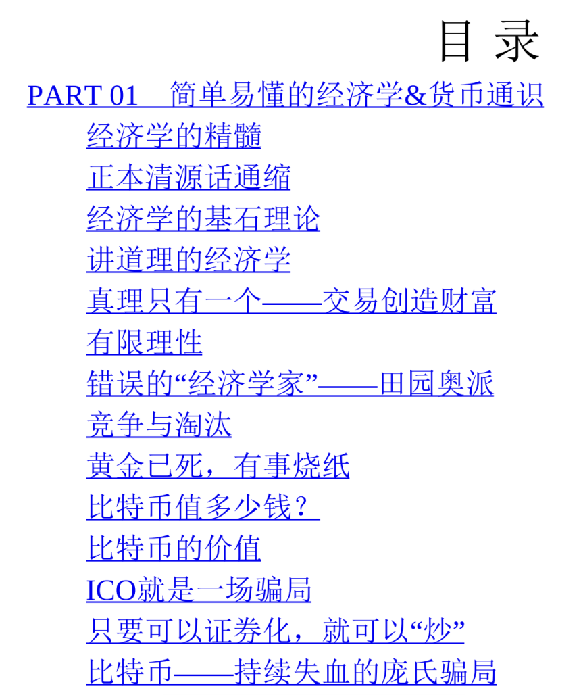
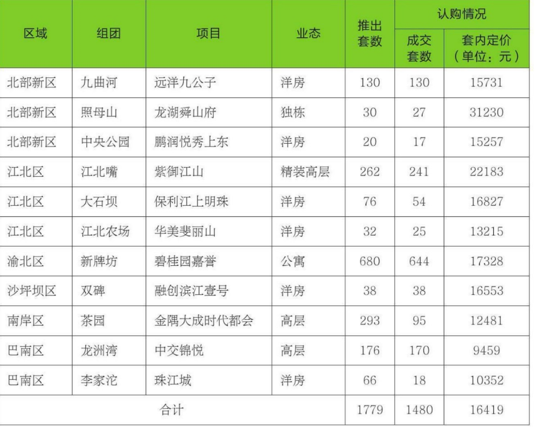
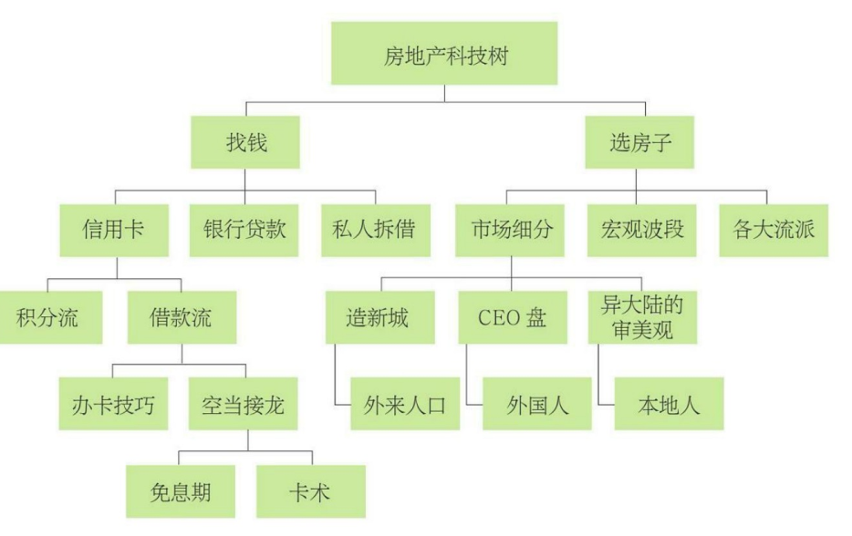

四、二线城市的碾压行情
相应地，上海人接触迈入二线城市，若稍许花点心思，应该可以比 其他省会城市的人获得多得多的信息预判。当我在2016年8月开始写重 庆房产形势的时候，后台留言就从来不乏“重庆中介”的冷嘲热讽。归纳 他们的发言，不外乎以下几种：你们外地人不懂我们重庆的楼市啦；重 庆库存这么高，涨不起来的啦；重庆特有的地票制度，每平方米永远只 会卖8000元；你们外地人怎么专买南滨路、北滨路，重庆人不喜欢；重 庆人喜欢买渝北新区，喜欢买商铺。

我冷眼旁观，笑而不语。 
当京沪的资深投资者来到重庆时，他们相对于当地人的见识，几乎 
是全方位碾压的。什么“万年不涨”，你懂什么？疯涨起来吓死你！ 
什么8000元涨到1万元，就急着要抛，落袋为安。赚十几万小钱就 
捏不住，你懂什么？真涨起来，涨幅让你瞠目结舌。 
什么购买力最多承接到2万元。你懂什么？过两年玩个每平方米8万 
元的房子给你看你信不信？ 
什么涨了一年就喊风险。你懂什么？你知道大牛市可以维持多久 
吗？

六、结语
投资是科学，在这一行，赚钱既很容易，又很不容易。容易的是， 
只要你认认真真去做，地方政府可选的套路是极其有限的。如果你 
有“一线城市”的记忆，“二线城市”大概率会复制一线城市曾经的走势， 
只不过时间拖后十几年罢了。预知未来，赚钱不难。碾压“土著”，降 
维攻击。
但是，投资是一门严肃的、专业的活，和工业工程师并无二致。那 
些头脑发昏、只知道买买买CEO盘、烧现金全款的土豪，仅仅是“贵妇 
流”。
亲，他们和我们真的不是一路人。 

相对来说，重庆就是Easy模式。它依然保持着完整的“市区—郊 
区”结构，市中心就是比郊区贵，人口密集度也远超郊区。尤其是南滨 
路、北滨路一带，由于有着不可替代的“大江大河”自然景观，更显得标 
锚得恒久。

我们要知道一个基本结论：目前的房地产市场，大概率是上涨 
的。只有买贵，没有买错。尤其是那种单价一万、八千的房子，贴近 
成本线也不远，又是1000万以上人口的大都市核心区，亏钱的概率微乎 
其微。对于房产投资者来说，重庆简直就是一个金矿，只要你涉足，轻 
易就可以掘金。

一般一套重庆的房子，每平方米1.2万元已经算是很好的品质了， 
哪怕买小三居，总价也不超过150万元，这是什么概念？在京沪买个厕 
所都不够。北京人、上海人一到重庆，顿时就看傻了，首付三成，每买 
一套重庆的房子，才消耗现金40万元。

在知识星球里，经常有人问我：“手握700万元现金，请问如何配 
置？”对于这种问题，我只有苦笑道：“大象只能待在京沪。”因为重庆 
是一个很小的池子，仅适合新手练手，大象跳进池子，水就漫出来了。 
700万元现金足可以购买十六七套重庆房产，无论如何银行也不会批这 
么多笔贷款给你的，你也找不到这么多贷票。因此，你只能待在京沪， 
只能耐心地和Hard模式格斗。

楼市的生命周期 
大约在一个月前，有人在分答上问了我这样一个问题：欧神，为什 
么重庆的房价一直这么低？重庆为什么不限购呢？重庆的房价没有启 
动，是不是跟土地供给、人才结构、人口流动都有关系？ 
楼市的演化阶段其实很像人的成长过程，有幼年、壮年和老年阶 
段，而且这些演化是不可逆的，同样也是没有轮回的，下面就根据楼市 
的每个演化阶段进行具体分析。 

一、懵懂阶段 
楼市的第一个阶段是懵懂阶段。谈论楼市，有一个话题是无论如何 
也绕不过去的，那就是“谁睡在马路上”。大城市并不缺房子，没有任何 
一个人睡在马路上。从来不存在“刚需”的说法，没有人会因为房子过不 
下去，因为房子不是水、食物，不是每天都要消耗的必需品。老房子稍 
微凑合凑合，继续住下去也是可以的。
在这样一个“不缺房子”的大前提下，就养成了三四线城市（渝蓉） 
人口的一种观念：买房子干吗，房子本身是不值钱的，一点点折旧就不 
要了，坚决不买二手房，老破大没人要，买房不如买车…… 
2016年重庆人民看待房产，如果用两个字形容他们当时的心态，那 
么应该是“绝望”，真心的绝望。房子怎么可能涨得起来呢？那要多大的 
购买力、多大的拉力啊。2016年你和重庆本地人讨论房子，他们当中的 
那些所谓“高手”会真心劝阻你：重庆这个市场，你们外地人不懂；重庆 
的房子太多了，永远不会涨；重庆人不缺房子，人人都有房子……另一 
方面，成都的“朱红之泪”同学，长篇累牍地控诉成都人都是“处女座”。

二、启动阶段 
楼市的第二个阶段是启动阶段，其具体的特征是部分楼盘已经有了 
翻倍的涨幅，但并不是全部的楼盘，火车头轰鸣，但时速还不高。 
在启动阶段，主要的特征是“怀疑和希望并存”。一方面，肯定有人 
啃了一口大葱，喝了一罐啤酒，吐了一口唾沫，狠狠地骂道：“泡沫， 
肯定是泡沫，怎么样上去，怎么样下来，得有人跳楼去了，全都是外地 
人在买，一群巴子不领行情。”另一方面，肯定有人买买买买买。例 
如，武汉一口气爆了114个“日光盘”，一直到旭辉御府，才因为性价比 
实在太渣，没有连续爆出第115个日光。 

在楼市的所有阶段中，启动阶段是最重要的，因为它几乎是唯一可 
以踩刹车的阶段。 
楼市的道理也是一样，让一个3亿平方米存量的超级大城市楼市启动，那是千难万难。天时地利人和，缺一不可。你听着这个庞然大物嘶 
吼着、挣扎着，甩去身上的枷锁，一点一点尝试着爬行，慢慢加快了速 
度。例如，现在的重庆，楼市只能算是“小涨”，表现最亮丽、最耀眼的 
是南滨路、北滨路，尤其是拥有一线无敌江景的所谓“婆罗门”区域。 
在过去约一年的时间内，“婆罗门”区域从8000元单价，一口气涨到 
1.8万元单价，部分楼盘下一期报价已高达2.2万元。

但是，在这一片“猜对走势”的庆祝声中，我们还要清楚地看到，整 
个市场仍然存在“乌云”。对于整个市场来说，依然存在“没涨上去”的物 
业类型，这就是渝中区的老破大。没涨上去，原因依然是启动阶段。启 
动阶段，一股强大的力量扫光了“南滨路、北滨路”所有的江景豪宅。
但是“土著”是迟钝的。对于老重庆人，那些住了十几二十年的人， 
他们觉得太阳照常升起，丝毫也没有紧迫感，也没有要买房子的意思。 
针对他们的物业类型，或者他们抛出的物业类型，价格就上不去。设想 
一下，四居160平方米，每平方米只要6000元，总价才100万元。100万 
元，在未来楼市意味着什么？ 
1.45万元×70平方米，稍微像样点的房子，只能买两居。2.2万元×45 
平方米，有名有姓的豪宅，只能买一居。2.5万元×80平方米，楼市再涨 
上去，只能买厕所。所以你现在四居只卖100万元，显然是极其不合理 
的。(1) 

三、成长阶段 
楼市的第三个阶段是成长阶段。如果说房价从8000元涨到1.6万元 
是启动，依然唤不醒“沉睡的人”，则楼市再翻一个跟头，1.6万元涨到 
3.2万元是成长阶段，再再翻一个跟头，3.2万元涨到6.4万元也是成长阶 
段。目前重庆处于启动阶段的话，武汉则处于成长阶段。 
成长阶段有两个特征：（
1）楼市开始有赚钱效应；（
2）开始有人 
买不起房子。重庆人的收入大约是上海人的一半，但是2016年8月，重 
庆房价只有上海房价的一成，比例完全不对等。重庆人买房子，其实一 
点压力也没有。一套房子80万元—100万元，小夫妻一年也有二三十 
万，因为生活太安逸，所以不是不买房，是买得起而不买。 
但是，在楼市从8000元涨到1.6万元，又涨到3.2万元的过程中，就 
逐渐产生了“财富效应”。你8000元买进，1.6万元卖出，每套房子就有 
了“近百万”元的利润。以小夫妻每年20万元的收入，这也相当于5年工 
资。于是有中介打出了如下的标语口号： 
“工作再忙，别忘看房。毕竟涨100万比挣100万容易多了。” 
而如果楼价能有幸从1.6万元涨到3.2万元，则很多人就非常幸运，

在成长阶段，势头是无可阻挡的，一旦过了第一个200%、第一个 
300%，有了赚钱效应，那么人们一定会快速狂奔，这时调控是无效 
的。因为火车头一旦启动起来，就肯定奋力狂奔，楼市只要可以赚钱， 
就一定有人前仆后继冲进来，哪怕你把交易完全锁死掉。 
在成长阶段，真正受益最大的是“老破大”。因为你开始会“买不 
起”，只有当你真正买不起时，你才会收起那么多的挑剔，那么多的矫 
情病。你想一想，假设房价每平方米5万元，20平方米的主卫（套内15 
平方米），价值就要100万元。对于绝大多数工薪阶层，100万元已经是 
好几年的工作积蓄。对于你的父辈来说，如果是农民，可能一辈子都没 
有积攒过100万元。

我们看到，重庆目前市中心，每平方米2万元的江景豪宅与每平方 
米6000元的老破大，大约是1∶3的价差，这是极度不正常的。在上海市 
中心，如果一手豪宅每平方米卖10万元以上的话，则同地段的老破大每 
平方米也要卖到6万元—7万元元的样子。 
最初的时候，外地“移一代”也是看不起“老破大”，甚至有外地IT白 
领用不屑的口吻说：“谁会住这样的房子。”然而润物细无声，“老破 
大”在不声不响中也涨到了六七万元的样子，涨幅傲然卓立，而你买浦 
东的部分一手新房，恐怕还没有这个涨幅。

四、泡沫阶段 
楼市的第四个阶段是泡沫阶段。我曾说过，我并不认为每平方米10 
万元以上的房价是合理的，而认为它是有泡沫的。但有泡沫不代表不 
涨，2000—2013年是上半场，2013—2026年是下半场。如果楼市产生 
了“赚钱效应”，老百姓就会前仆后继地拥进去，今天不买，明天就再也 
买不起了。别和我说调控，我买来是自住的。 
问题是，这样一股热潮到什么时候终止。答案是：当人民再也买不 
动的时候。像目前的上海房产市场，就有一点“涨不动”的感觉，因为房 
价真的已经很高了。大宁金茂府、四方锅炉厂，传统上很中环的位置， 
开出每平方米12万元的价格，80平方米需要1000万元人民币。这真的是 
很贵了，这个价钱在其他城市足以买下一家中型工厂。 
在泡沫阶段，如果还想维持房价，那就需要逆调控。每当房价摇摇 
欲坠的时候，就需要发动限售，把供应全部打掉。泡沫阶段最重要的一 
个特点，就是“供应”一定少。不仅每一年的供地只有少得可怜的几十 
公顷，而且所有供地还都在非常偏远的郊区，这就保护了市区的每平方

五、死亡阶段 
楼市的最后一个阶段是死亡阶段。如果说，香港的高房价、高地租 
已经严重影响到了香港的工商业，损害到了香港经济的发展，给香港市 
民带来非常大的痛苦，香港想改变这一点，该如何改变？ 
香港特区政府也采取了一系列措施，比如政府开闸多建公屋，但供 
应量却始终上不去。症结出在哪里？是万恶的六大地产商吗？当然不 
是，商人是降低物价的，问题的症结出在立法会。 

六、生命周期 
楼市的生命周期并不像某些投资小白想的，价格围绕价值波动涨涨 
跌跌，楼市的生命周期其实是一个“不可逆”的过程。这里面贯穿着一条 
主线，就是“认知”。老百姓从完全不懂“楼市＝财富”到完全懂得，就 
好比小孩子成长为老人，其知识和经验、其对社会的理解，都是日益 
增加的。你绝不可能再把他塞回娘胎，再抹去所有的记忆。 
在最初的时候，田园牧歌，民不知有饥，鼓腹而歌。其后，M2急 
速增长，降维攻击者冲进楼市，寻求保值。接着，财富效应显现，金融 
属性人人皆知。再次，楼市超过合理范围，靠调控防大跌(2)。最后，所 
有人的所有财富都在房子上，大家绑着一起死。 
整个周期有可能长达三四十年，许多人终其一生可能也就是其中过 
客，而不能跳出棋局。

楼市秘籍速成法 一、前言 
（1）首先，你需要一份工作。 
（2）工作至少维持六个月，工资不重要，但一定要让公司帮你 交“四金”。 
（3）在公司中结交一帮好姐妹。
 （4）开始养流水，每个月固定入账，三个月可取走一次整数。 
（5）在每个银行开设借记卡，办超级网银。
 （6）开始养社保，纳税证明。 
（7）开始扫街，假装买家，看房200套。 
（8）对笋盘形成自己的判断体系。 
（9）板块轮动，判断下一个热点。 
（10）对重点区域30个楼盘必须做到完全熟悉。
（11）避开“处房情结”，专注于二手房，不推荐学区房。 
（12）了解Marketing，市场客户分类，口味趋势。 
（13）理解当前形势。 
（14）选择两个有能力的御用中介，建立私交。 
（15）认识至少一个贷款中介。 
（16）工作三个月后开始了解信贷，找到低成本的资金。
（17）累积一些（＞50笔）小额消费。 
（18）信贷目标200万元额度。 
（19）请小姐妹吃饭。 
（20）开始练习“空当接龙”。 
（21）初次接触私人拆借。 
（22）准备两张房票。 
（23）房票A开始“凤变冰”，全款买老破小。 
（24）买房的时候带现金去，增加震撼力。 
（25）四字大法：“哭晕，认 ”。 
（26）老破小交易周期尽量缩短。 
（27）优先使用老人房票。 
（28）熟悉交易流程。 
（29）熟悉建材市场。 
（30）熟悉买卖，租赁实战。 
（31）迅速抛售，赚取第一笔利润。 
（32）第二次“凤变冰”循环，更熟悉流程。 
（33）三到四次“凤变冰”，积累原始资金。 
（34）房票B开始大面积低单价。
 （35）大面积交易周期尽量拉长，拖六至八个月以上。 
（36）选择30年期等额本息。 
（37）先不要用公积金。
（38）简易装修，分割成单间出租“民宿流”。 
（39）制造赚钱效应，获取家人的支持。 
（40）获得家族资金。 
（41）获得多核。 
（42）帮多核开始申请各种银行借款。 
（43）59岁之前，资源一定要榨干净。 
（44）目标500万元银行借款，500万元私人借款。 
（45）继续买入，组建航母编队。 
（46）对于多核可以用抵押证控制，记得保留全套文件。 
（47）房产开始升值。 
（48）依靠抵押、截断、高评、对敲等方法获取资金。 
（49）用低成本资金替换掉高成本债务。 
（50）“无限房票大法”，破限购限贷。 
（51）循环2N。 
（52）增加朋友圈。 
（53）拓展私人借款渠道。 
（54）涉足成本更昂贵的资金，直到扩张边界。 
（55）逐步打造团队，开始伙伴分工。 
（56）绘制现金流量表，预估未来缺口。
 （57）在中介处挂牌，涨价顶帖。 
（58）假装买家，了解卖房行情。
（59）春节前最淡，春节后最旺季。 
（60）有秩序地在三重顶卖出房产，优先卖充分成熟的。 
（61）开始考虑全职，投资房产比工作更重要。 
（62）主要的时间以融资、扫笋盘为主。 
（63）按照1∶10的比例，逐步有计划将资产兑换转移到重庆，保 留胜利果实。
 （64）花50万元给女人买个包。 
（65）构建以“娃本位”为核心的资产组合包。

我们的时代在变迁，社会在变迁，更要命的是政策也在变迁。环境 
和政策一天一个样，这导致我们今天学的“整套手法”，到明天可能就没 
法用了，就好比在上文提到的第24条、第25条，我们说我们需要“两张 
房票”，其中A用于“凤变冰”，积累原始资金，B用于大面积低单价流 
派，这就是2016年11月28日上海楼市“新政”之后的新改变。在这之前， 
只要“首房无贷”（没有贷款记录也是可以认首套的），你只要A这一房 
票就够了。 
如果说这还属于“小改动”的话，则随着“水库论坛”的普及面不断扩 
大，目前市场上“凤变冰”也越来越难找。“凤变冰”的特点在于“凤姐”， 
不在于“冰冰”，“凤姐”才是你可以赚取的利润。而“冰冰”溢价少，最多
使你卖得快一点。随着“水库大军”越来越多，“凤姐”都快被挖光了，洼 
地也是越来越少。整个逻辑链上，“凤变冰”也属于很重要的一环。但 
是，失去了“凤变冰”，资本原始积累如何走？如何获取家人的信任？
这个问题，光靠第一部分的内容是无法回答的。1000个字可以速 
成，但速成的是“专用件”，只能用于特定时期、特定场合、特定人群。 
而只有把“体”“用”都学会了，从头开始学，把基础打好，把整个逻辑理 
顺，当外部环境变了，你才能够自己顺着逻辑推导，想出对策。

终极格式我只要43个字就够了——七成30年按揭，去买上海康城一楼带地下室的户型，按照2017年1月的价格闭 
着眼睛买，即买即赚！ 

五、流水 
一般银行的需求是让你打6个月的流水，有些管得严格的城市甚至 
要求你打12个月的流水。所以无论如何，你在公司里得待6个月，在这 
段时间内，你也不能闲着，你需要“养流水”，你要严格地做到“收支两 
笔账”，甚至可以说，同一家工行开两张借记卡。其中所有的“支出”走 
一张卡，比如月供、信用卡还款、分期付款等。所有的“收入”走另外一张卡，比如工资、房租、定期收入等。等信贷主任管你要“流水”时，你 
的“收入卡”才会好看。 
而对于初入职场的年轻人来说，工资不会太高，“流水”也十分难 
看，这时你也可以“养流水”。也就是说，每个月固定有一笔23456.78元 
的进账放在卡上，暂时不要取走，每3个月可以集中取走一笔6万元，按 
照谨慎的原则，银行应该集中监督你“工资”项目下的每月定期收入，但 
我们实战体会，只要你每月固定日期存入一笔钱，非“工资”类目其实也 
是很有用的。 
总而言之，你的流水得养起来，万一哪天真用上贷款时，谋而备就 
可以用。另外，社保和纳税证明也可以养，这里不展开讲解。当你看见 
职业房产投资者唰唰唰地“万箭齐发”时，却没看见人家其实两年前就开 
始准备了。 

六、扫街 
在这6个月内，除了养流水，另一个可以做、必须做的事情是“扫 
街”。天底下本没有捷径，也没有速成法，一切都是无差别的人类体力 
劳动。扫街，我们一般的要求是“看房200套”。 
对于一个房产投资小白来讲，你会有太多的疑问。但是说了你也不 
听，听了你也不懂。在这种情况下，我给你的建议就是“看房200套”， 
你不用质疑，先自己去看房200套。 
随着你皮肤被晒黑，脚底被磨破，晚饭今天没有吃，明天没有吃， 
后天忘了吃，你自己的经验值就会上涨，就会有实战心得体会。“谋而 
寡断”是男人最令人厌恶的品质之一，“杀伐果断”是可以后天学的，其 
最佳的办法就是长期泡在第一线，经历足够多。 

七、人脉培养两个御用中介，培养一个御用贷款中介，就像我曾在《信息不 
对称是伪科学》一文中所写的，凡事皆是资源，信息不是免费的。 

八、借贷 
“四金”社保大约交了三个月以后，征信系统已经有了足够记录，这 
时候可以开始申办信用卡。由于银联偷偷地规定了“个人总授信”有上 
限，因此办卡有很多的讲究，比如工行卡最优先、56天卡优先、继续办 
付费白金卡。当这些卡发下来以后，你还要进行“养卡”。因为到了后 
期，你根本没有精力干养卡的活。你要为每张卡刷50笔小额消费，笔数 
要多，商户要杂，类型要全面，这样你的信用卡统计报告才会好看。最 
后则是开始请小姐妹吃饭，真心诚意地告诉她们你要投资房产，要借她 
们的名字办信用卡，千万不要撒谎。 

十、富二代 
通过这段内容，你就可以看出自己和口含金汤匙出生的“富二代”之 
间的区别了。我们假设的主人公始终都是“赤手空拳来到上海，无存 
款，无人脉，无资源”的三无人士。他很能干，很拼，想出人头地，但 
22岁时一无所有。 
对于这样的年轻人，他才需要“借贷”“凤变冰”这两棵科技树。信用 
卡可以通过“空当接龙”的方法虚空幻化出几百万，尽管其中的过程苦不 
堪言，“凤变冰”获得100万元启动资金，并获得家人的支持。 
不管是谁，起步的时候都不轻松，而你没有爹可拼，你就必须更 
拼命。你从零起步，就必须冒更大的风险，吃更多的苦。值得欣慰的 
是，房产投资相对其他投资来说，还算是轻松的。

十二、筑巢引凤 
上面说的所有事情全部都做完了，也就是“蓄势待涨”，就像我所有 
的准备工作都已经做完。手里的600万元现金，变成了“2000万元房产的 
三成首付，1400万元负债”。在这个时候，有一个最关键的步骤：房价 
必须大涨！ 
理论上来说，600万元现金和“2000万元房子的三成首付”在会计上 
是等价的，两者的唯一区别在于“房价是否按照预期大涨”。你已经“筑 
巢引凤”，结果房价没有大涨，那你就是埋坑自己躺。 
而房价会不会涨呢？这不是“术”里面的问题，而是“体”里面的问 
题，是基于奥派经济学、货币经济学、宏观调控、土地政策、人口大数 
据等一系列分析的结果，要把“房价是涨是跌”的道理说清楚，要写100万字，因此这是“速成篇”不教的东西，您记住结论就可以：“涨”。 

十三、中级阶段 
先让我建仓，把“600万元转化为2000万元房产三成首付”，然后房 
价必须“如期大涨”，恭喜你，你可以进入中级阶段，这个阶段钱财是来 
得极快的。初级的时候，为了100万元信用卡额度，为了20万元的“凤变 
冰”利润，你被折磨得痛不欲生。而在中级阶段，也许一觉睡醒你就赚 
了几十万。 
一般而言，上海楼市好的时候，2000万元房子一年可以赚600万 
元，也就是本金翻番。这还是考虑到本金可能也就是200万元，你还有 
大半不是自己的钱财。也就是只要一年的时间，你就可以脱离赤贫、脱 
离苦海、脱离小康，稍微超越中产！ 
在“水库论坛”里，常有“一年时间1万到1000万”的故事流传，其实 
前半截都在建仓，建仓后楼市一冲就千万了。 

十四、2N 
中级的后续做法是2N，也就是每年投资两套，持续扩大，顺着这 
条线，最终可以一直做到A9。至于2N的具体做法，“水库文献”中已经 
有了详细描述，不再赘述。 
值得一提的是，除了抵押、截断、高评、对敲等各项手法之外，还 
有一个极重要的选项：“卖出”。因为楼市也和桃子一样，存在一个“成 
熟”的概念，一个地段从潜力、青涩、成长、发展，最终会达到成熟和 
过成熟这两个阶段。其中“成熟”阶段，该板块已达到热炒顶峰，继续成 
长可能性不大。到了“过成熟”阶段，该板块已炒完，产生审美疲劳，此 
后只会走下坡路。

我们在前面《楼市秘籍速成法》那篇主要讲了两部分，一部分主要 
讲选房子，另一部分主要讲融资，而其中又分为信用卡、银行贷款、私 
人拆借三大渠道，信用卡再分为积分流、借款流，借款流再分为办卡、 
用卡，用卡里面。而关于中国银行的三张副卡会不会损伤征信，那是细 
节的细节的细节的细节……

拖延流 
一、拖延流 
首先要搞清楚什么是“拖延流”。拖延流是一种技巧，指的是“尽可 
能拉长交易周期，来缓解融资和筹首付的压力”。那么，为什么要“拖 
延”呢？很多人完全不能理解其中的意义。 

对于许多人来说，他们觉得买房子就是“拿钱去售楼处”排队抢号， 
手里有多少钱就买多大的房子。别和我说“买房技巧”，我连贷款都不怎 
么用，我是全款！比这些“菜鸟”进一步的，则是有基础的理财概念，知 
道“构建以房贷为核心的资产组合包”，他们往往会算一算账，比如我手 
里有350万元，留一点钱付契税，则可以买1000万元的房子。 
比这批人更进一步的，则是“连首付都没有却也想买房子”的人。你 
手里只有一成或者一成半的资金，剩下的资金在途，但是笋盘已经出 
现，或者市场启动在即，你心头热火燃烧，知道这是一个搏命的单子， 
咬咬牙冲了，抢到就是几百万的利润。这时怎么办？就要靠一点点的技 
巧

三、合同的拟定 
对于合同的拟定，也需要花一番心思，原则上我们建议采 
取“3+3+3”方式。比如说，正常的房产交易流程是“付定金→网签→审限 
购→审税→办贷款→过户→银行放款→交房”，整个流程大约持续三个 
月。你先直接去和房东说：“亲，这笔交易我想拖九个月。”有可能成功 
吗？绝对没有任何成功的机会。 
要想成功，你首先要让中介去和卖方说：“我的客户是一个非常小 
心谨慎的人，他很怕交易流程有什么意外，造成违约。因此，客户希望 
把流程写得尽量宽松一点。”传统的房产交易，审购买资格、交税、办 
贷款，一般是预留2个月时间，你可以要求4个月的时间。 
在付款的资金途中，比如300万元首付，你可以拆成先付100万元， 
过半个月付50万元，再过半个月付50万元……光付清首付就拖了两个 
月，银行又要等首付资金齐全才开始审核贷款。这样就有理由把合法的 
交易流程拖延4—5个月。 
有人问：房东又不是傻瓜，会接受吗？答案是，房东大部分情况下 
是会接受的。因为“买家”是职业的，而房东并不是，房东绝大多数时候 
只有有限的一两次售房经验。只要你放下身段，苦苦哀求，将心比心， 
将普通的交易流程由2.5个月拖长到4.5个月，一般还是在合理容忍范 
围。
合同的第二步，和很多人想法不同，是“违约”，因此第二步是有损 
失的，也就是说，你一开始就想好了，要赔一笔“违约金”给房东。 
我们经历的商业文明洗礼太少，很多人不明白“合同就是合 
同”。“合同的每条条款，都是不可分割的一部分”，“撕毁条款，赔偿 
条款，都是天然权利的一部分”。最初的时候，我们和他人讲述商业文 
明时，甚至有被抢劫逻辑洗脑的学生对于“退出条款”大发雷霆，质问合 
同都签了，怎么可以不执行。我们耐心地解释，告诉他们只要约定了赔偿，就可以不执行，否则全世界的期货市场、权证市场，都没有存在的 
可能了。
同样的道理，关于“拖延流”这件事，它最主要的“拖延点”在哪里 
呢？主要是以下两条： 
（
1）截止到×年×月×日，首付资金必须到位×××万元，否则按利息 
赔偿。
（
2）截止到×年×月×日，交易过户，滞纳期最多60天。 
其中最核心的是这个“60天”的约定，你去拿现在任何一本“官方 
版”的房地产交易合同来看，里面写的全是60天。意思就是“拖晚”了60 
天，属于轻微违约，购买方只要赔利息和违约金就可以了。而“拖晚”了 
61天，就犯大错了，业主可以没收你20%的购房款，把合同取消，惩罚 
是十分严重的。 
这句话反过来的意思，则是你可以合法地违约60天，以金钱换时 
间，如果配合违约金写低，效果更佳。目前网签的标准合同，赔偿金是 
每天0.04%，折合年率约14.6%，这样的“利率”依然是太高了。所以当你 
和卖房者谈合同时，你可以不经意地随手指出两个合同细节，例 
如，“哎呀呀，违约金万分之四太可怕了，能不能写成万分之二？”这个 
时候，要看卖方是不是十分较真的人。如果卖方好说话，又或者整个签 
约谈判流程已经持续了四个小时，所有人马筋疲力尽，则你有非常大的 
概率蒙混过关。 
设想一下，你把滞纳金改为每天0.02%，年利息7.3%。运气好的 
话，甚至可以把“宽限期”改为90天，拖两个月，大概多付了1%的房款 
作为利息，这是一笔非常划算的生意。要注意的是，最后结算时，你一 
定要极度诚恳地亲手将这几万元“滞纳利息”交给房东，并且对一路上贷 
款的不顺利、银行的刁难深表歉意。对于房东来说，7.3%也算是一个很 
高的利息了，而且又实打实地有现金拿，房东自然会很高兴，也就不会为难你了。 
“拉长交易周期＋赔偿滞纳金”，双管齐下，可以将交易流程拖长到 
7个月左右，最后一个关节是延迟放款。银行放款是可以人为控制的， 
目前上海的房产市场租金回报不超过1.5%，而银行贷款一旦发放，就要 
付利息供楼，利率6.5%，每月填几万月供。这时可以在银行放款上做手 
脚，和信贷员很熟的话，把你的名字拖到最后一个放款，房东千等万 
等，贷款就是不下来，就又拖了一两个月。 
我们说过，“拖延流”最主要的目的是让你喘口气流血筹款，笋盘来 
临之际，一口咬下，以后再慢慢补巨额窟窿。因此拖延放款意义不大， 
而且也太损，能搞定前两条，拖延7个月已经不错了。

四、拖延流的价值 
你费尽心机，拖延七八个月完成交易，有什么好处？能赚多少钱？ 
问这种问题的人主要是对房地产“现金流”模型理解不足。买房子的钱不 
是赚的，而是筹的，在我们眼里，这不过是一个“现金流游戏”。 
笋盘来了，就要抓住。行情来了，就要抓住。把4月的价格锁死到 
12月再进行交易。2017年4月的重庆、成都、武汉、杭州、郑州、南 
京、石家庄，无论任何一个城市，只要买了，12月都赚了很多。投资房 
地产是一个和时间赛跑的游戏，资金是可以“筹款”的。严格地说，这无 
非是一个“代价”的问题。 
友情提示：技巧越复杂，风险相应越高，请谨慎！

六、资产质量 
上面我们提到了“有钱人为什么暴富”，与之相对应的，是“穷人如 
何保护自己的财产”。 
你老婆“双十一”买东西，不会让你迅速变穷，应该予以支持。“双 
十一”当天，你老婆是谨慎的，为了用上25元优惠券，可以考虑半小 
时。而买股票时，你是不谨慎的，25万元投进去眼睛眨也不眨，花几十 
倍价钱接别人的老庄股。所以，买卖资产才是变穷的最快办法。 
在这里我要讲一个“资产质量”的问题，举个例子，如果你想拥有1 
亿元，最快的方法是门口的小吃店老板娘塞给你一张储值卡，卡里面有 
1亿元余额，每天你都可以来店里买螺蛳粉。但是只能堂食，不能打 
包，不许浪费。那么，这种“资产”就是没价值的。 
在你的各项资产之间，“含金量”是有很大区别的，同样的100万 
元，如果你买的是GE的股票，它是蓝筹股，那么价值会很稳定；如果 
你买“汉能薄膜发电”，你心里就要打个问号，因为它分分钟会被腰斩； 
如果买的是20枚比特币，那恐怕问题就更大了。
所以，透过现象看本质，追逐真正有质量的财富，而不要用金子 
换沙子，把优质资产兑换成劣质资产。我曾写过三篇文章，我把它们 
称作“价格三篇”，可以在“水库论坛”上找到，在我的上一本书《中产阶 
级如何保护自己的财富》里也有收录。 
在“价格三篇”里，我提出了一个赚钱的手法：
优质资产→3倍的劣质资产 
3倍劣质资产→3倍优质资产 
循环往复 
比如说，现金是一种非常好的“优质资产”，风险几乎为零，流动性 
为无穷大。你让我用现金购买比特币，就是用黄金换黄沙。这么吃亏的 
生意，我是无论如何都不肯做的。但是你要是和我说：“比特币目前大 
约1枚5万元，我给你打折，1枚5000元。作为交换条件，你一次性买×× 
亿，或者是买入后锁定6个月，在这6个月内不许抛。”那我肯定会根据 
风险权衡一下，这笔“1优换N劣”的生意值不值得做。所以，用优质资 
产换劣质资产一定要求加倍。 
你看比尔·盖茨的股票，全部都是1美元的时候买回来的，现在市价 
100美元，他就不会去购买自家股票。所以，穷人和富人的区别是穷人 
用优质现金换劣质资产，比如买A股，买比特币，买珠宝玉石。而富 
人买劣质资产时，一定要求加倍，1∶1是不肯换的。 

七、纸币 
我们来看这样一个不等式： 
币圈＜垃圾股＜珠宝＜蓝筹股＜现金＜矿产＜劳动＝物价＜房产 
＜？
刚才说到了“资产质量”，就是要尽量左换右，如果是右换左，没有 
人会同意。在这个不等式里面，值得单独拿出来谈一谈的，是这个不等 
式：现金＜劳动。 
“回避垃圾资产，不要投机。”这个道理绝大多数人都懂的。可是他 
们不知道，普通人的生命中，接触的最大型的“高危资产”是什么。那
就是现金，现金大概被高估了4倍。 
中国目前的居民本外币存款余额大约是60万亿人民币，M2的总量 
是160万亿，金融业总资产250万亿（
2016年GDP 75万亿）。单单看存 
款数据，大概全体中国人一起躺着，什么事也不做，物资可以吃一年； 
如果算M2，可以吃两年；算“金融业总资产”，可以吃三年。而事实情 
况呢？我们社会上的物资够不够吃三年呢？答案是不够，连一年都不 
够。这就是东亚国家的“货币”之谜，最典型的是日本。 
只有在中国，才会出现一个人拆迁分了八套房子，5000万净资产， 
却在第二天发现他仍然为了拿6000元的工资，老老实实地坐在那里工 
作。有些老年人，家里存了两三百万定期存款，却仍然舍不得吃，舍不 
得穿，一件衣服缝缝补补好几年，一个月生活费2000元都不到。你永远 
都在劳动，永远都在储蓄，你有了100万，还在劳动，还在储蓄，一点 
都不懂得享受生活。你有了1000万，仍然在劳动，在储蓄，还是一点都 
不懂得享受生活。因为不劳动是可耻的，吃利息是可耻的，是被人看 
不起的。所以，无论你有多少钱，你永远都在劳动。这样的国民性导 
致的结果就是：中央银行可以大规模地增加货币，而不会引发通胀。 
于是，在“劳动—消费”的价格之间，就会产生一个错配。劳动的价 
格被压低，你的工资被压低(2)，“消费”的利益被拉高，你可以享受到廉 
价的商品。这时，“完全不工作，拼命地花钱”才是对你人生最有利的博 
弈方法。
举个例子，在目前北京、上海这样的城市，找一个钟点工阿姨上门 
帮你打扫卫生，大概是1小时35元，其中许多阿姨生活并不窘迫，她们 
很可能家里有几套房子，几百万的身家。她们之所以出来工作，纯粹是 
不劳动就不舒服的“基因”驱动。在这种情况下，“请阿姨”是极明智的举 
动，而出门去当清洁工阿姨才是愚不可及的行为。现金购买力是不可持 
续的，假如我们现在每个家庭都有600万元，但是老阿姨们舍不得吃， 
舍不得穿，拿着微薄的利息，导致物价被锁死在低廉的价格上，请个人 
打扫卫生，1小时才只要35元。 
但是人口趋势的变迁是会摧毁这一切的。就拿2017年做对比，“80后”最大的37岁，“90后”最大的27岁， 
而“00后”最大的也已经17岁。再过不到十年，“21CN”世代一定会踏上主 
流社会，未来的世界是“00后”“10后”的世界。而“21CN”世代在出生的时 
候，家里就已经很富裕，他们是泡在蜜糖里长大的，对于他们来 
说，“家里面放着600万不用，还要弯下身去赚35元每小时的工资”这种 
事是不可想象的。“00后”“10后”会做什么事，用大腿想也知道，拿钱出 
来花啊！
最多再过一代人的时间，劳动与消费的价格就会发生巨变。中国目 
前的M2/GDP是220%，是正常水平的3倍。中国的物价能维持这么低， 
人工成本能降到1小时35元，是因为有老一辈在任劳任怨、辛勤地工 
作。如果中国降到“世界平均”水准，哪怕只要不是这么变态的水准，如 
果中国人变得像中东人、法国人、印度人一样，中国的物价马上就会飞 
涨。但存在于我们骨子里、流淌在我们血液里的“勤劳勇敢”的传统美 
德，看不起“好逸恶劳”的国民属性，还能支撑我们走得更远。 

八、杠杆式交易 
我们再回到这篇文章的主旨：怎样才能赚很多很多钱？前面提到两 
种方式：一种方式是资产差换好，把垃圾股卖给散户，换成现金；一 
种方式是翻倍交易，打三折买入大量翡翠，慢慢卖。但是，其实还有 
第三种方式：借贷交易。 
你“个人财务”优化，终究是有限制的，而在过去的十几年间，涨得 
最快的资产市场，主要是房地产市场，它创造几千几万亿元财富。但问 
题是，就算你把所有的钱全部转成“房子”，从2000年开始，静默持有十 
几年，你的收益是多少呢？大概18倍。如果你想获得更多的收益，就一 
定要使用“杠杆交易”。最典型的就是“贷款买房”，100万元的房子首付 
三成，贷款七成，然后房子涨到1800万元，你首付的30万元大概获得 
6000%的收益。
有很多人认为贷款买房是向银行背债，是做房奴，这些人的三观 
是非常歪的。“贷款买房”这件事是赚是亏，关键只看一件事——现金 
和房子，哪个涨得更快。
我们再看前面提到的不等式： 
币圈＜垃圾股＜珠宝＜蓝筹股＜现金＜矿产＜劳动＝物价＜房产 
＜？
在这个不等式里，“做空”左边任何一项资产，“做多”右边任何一项 
资产。例如，“股票/现金”“现金/黄金”“现金/物价”“股票/烧鹅”，其实都是赚钱的。
中国几乎没有做空市场，人们唯一可以借的，只有“现金”。所以， 
你只能选“现金/物价”“现金/房产”“现金/？”。

