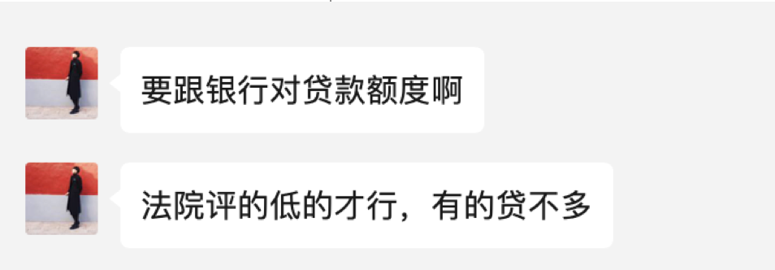

只要他转我备注货款就行，对吧
需要媳妇去三次吗

你是如何将50万不断变出钱来的，新路历程
3年后，续贷时还能贷出来这么多吗，找谁贷呢
贷了这么多的款，怎么还上月供，如何形成稳定循环的现金流，让这个项目自行运转产生资金，而不是依靠出卖体力劳动来填补月供？，需要还本吗

我看有的房子，单价也挺低的，位置也好，为啥不能拍呢，为啥评的低呢
如果我看到位置和推荐的差不多，单价也差不多，您这儿也能帮忙办，对吧

本次沟通内容：确定只收3%，30万收九千
抵押贷大部分是3年，到时候再转
做流水只要他转给我备注货款，在我账上留一夜，再转到我别的银行卡，目的是不要在你们两个之间互转

为啥我看有的房子位置也好，单价也差不多，不能拍吗，这个要看银行怎么评，有时候，挨着两个小区价格也不一样
周日可以喝咖啡，到时候再聊

周末喝咖啡要问的问题
怎么看房子：有地铁吗，如果让你选，你选哪个
燕郊房子能买吗，后年地铁开通，准备好两套房子，让佩琪看下
欧大说负债率当小于70%，你怎么看
做二房东的生意，人家看怎么样
你是怎么填补月5万的现金流的
沈阳往哪个方向发展，南区，还是北区，去看下阳光100，再去看下欧神推荐的房子

找银行聊一下贷款的事情，看能否自己做
怎么从多套老破跳到次新，怎么始终有现金流

自己做要比佩奇高

-----------------

佩琪想多买几套，没房票，每个房票，也就能买500万的房子
必须两套起拍，就是让你有其他住房，如果只有一套住宅， 5-10万住房补贴

沈阳地铁口的房子，1500一平，
20万能买2套，也能买，但太偏了，最好能30万两套，
20万，评估价45.3万，实际上这个房子能评估到55万，奥园旁边，欧大团购过，108平，2000一平
18年买的房子，一套也没卖

沈阳二环和北京四环一样大，一环和二环已经没有新房了，

什么样的流水是银行认可的，
办房本，进件，房款

为什么我从50万开始，能搞到4000平，是有原因的，

大致方针：可以买，熟悉贷款流程，方便后续自己操作，(在2000块的前提下，)拍个单价小的，

原则：一定不能着急，我宁愿不拍，也不能背负十几万的不良资产，

我媳妇对于我花钱买这么旧的房子有点抵触，而且她也不像带着孩子跑那么远去签字，
要不这件事就先放放吧，但也耽误你这么多时间，我想着付给您200块钱服务费，剩下的钱就推了吧

