1
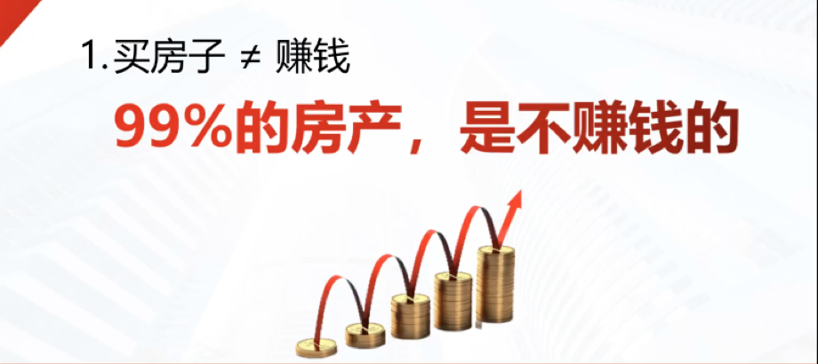

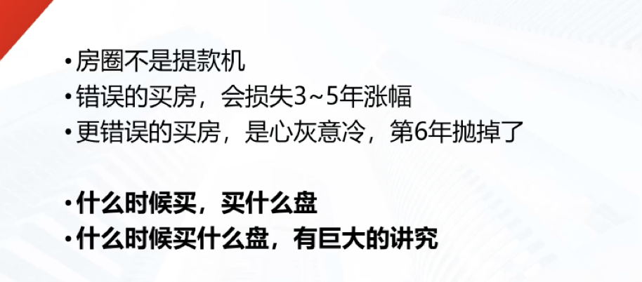

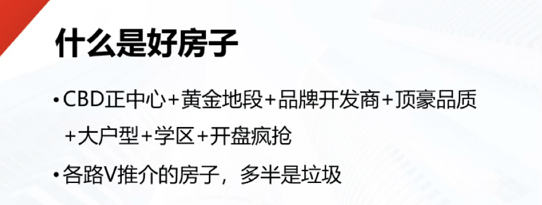

这些都不是好房子

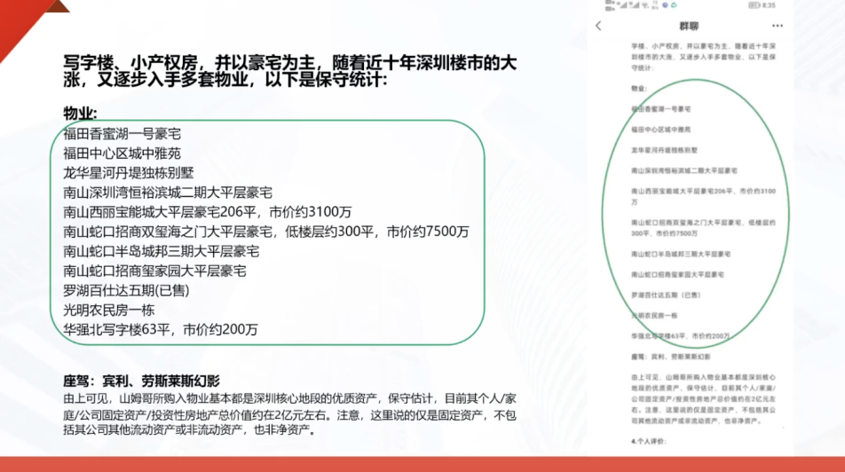

以上房子都是垃圾
好房子不是好房子
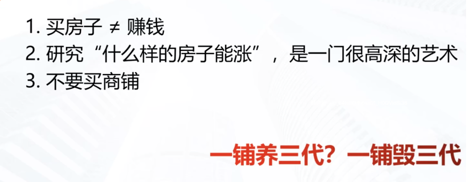

一套房子消灭一个中产，一个商铺消灭一个土豪

一套商铺1500万，买进容易，卖出难

正确做法，买20套房子，贷款买
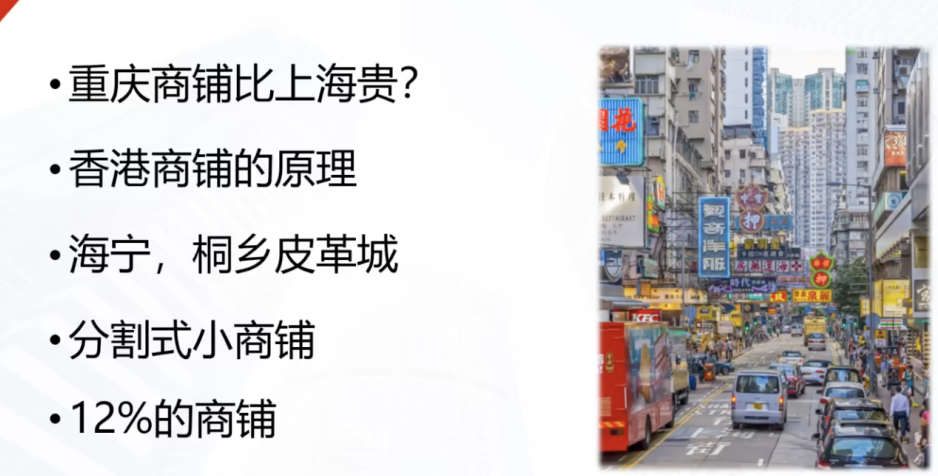

重庆商铺是住宅的6倍
香港住宅的价格是商铺的4倍
有没有比商铺更毒的东西，有，分割式商铺

有12%租金的铺子也不能买，
是真租金还是假租金，如果和你不认识的，那是真租金
如果是认识的，相当于多收你24%，因为包两年
打完76折，还是不值这个钱

重庆，喜马拉雅商铺，也是包两年的，
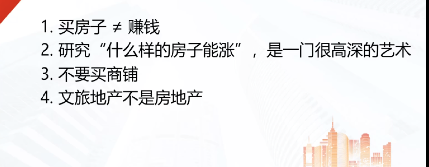
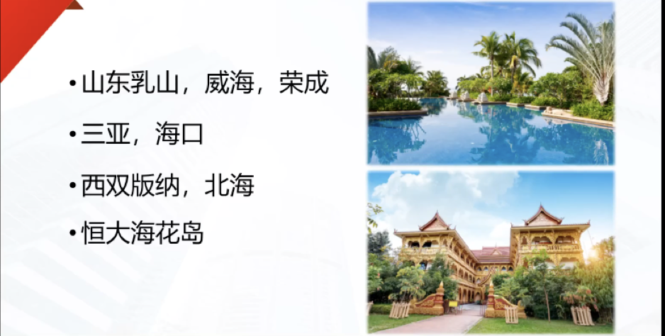

去博鳌，三亚旅游，回来买套房子，没事儿去住
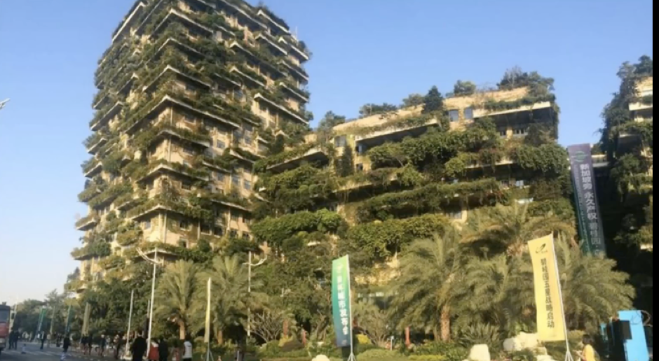

碧桂园，马来西亚，森林城市

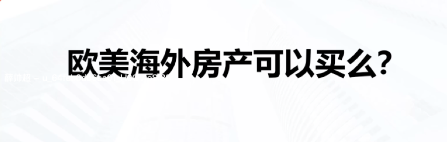

比如澳洲打包叫，

欧美的文旅地产也是不能买，要买也买在大城市，纽约，巴黎，

老师重庆观音桥1号院可以买吗？
三万六的ceo盘
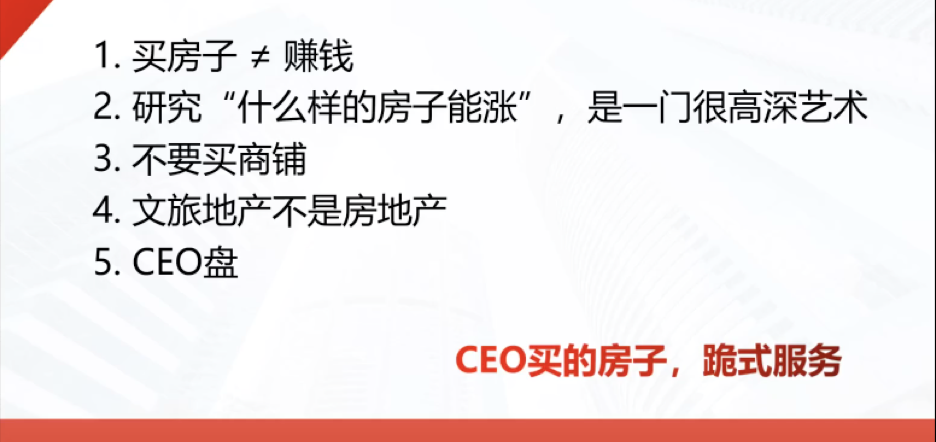

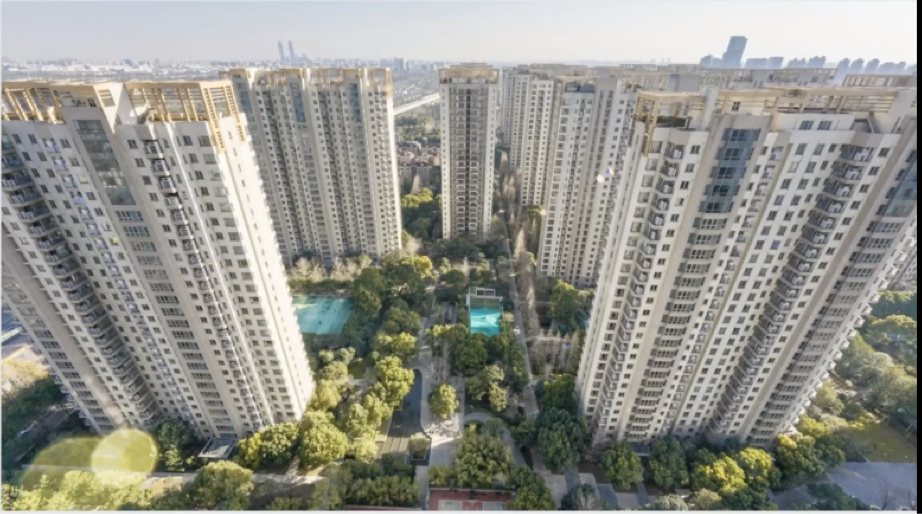

这楼盘，平平无奇，上海的仁恒he'bin'cheng河滨城，
在2009年，卖4.5w

ceo的标志，比周边贵30%-50%

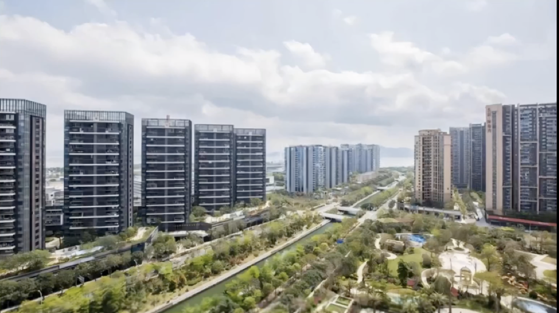

深圳，恒宇滨城， 40w一平

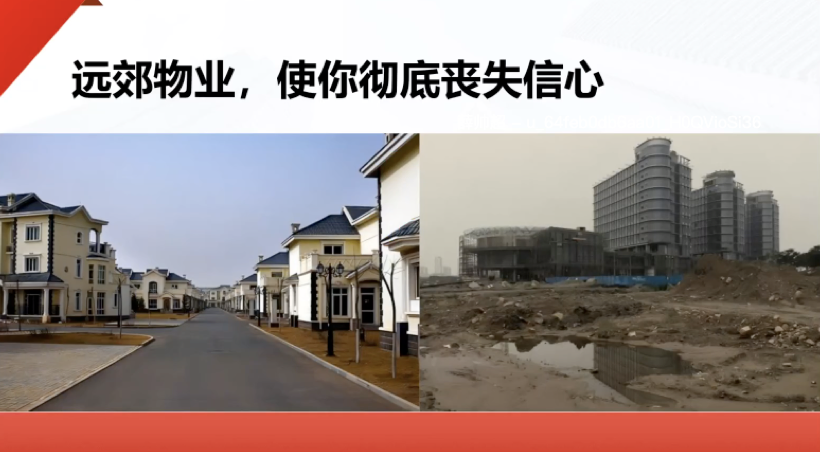

天津滨海新区，曹妃甸， 房子造完了，一个人也没有

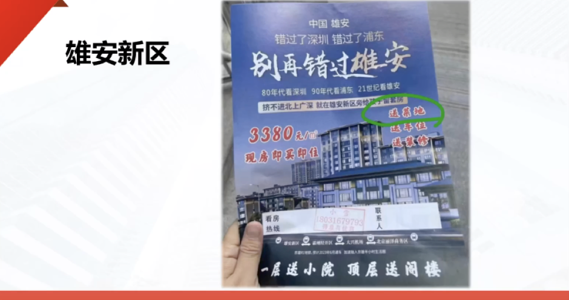

远郊就是最后一家星巴克

7.不要过度装修
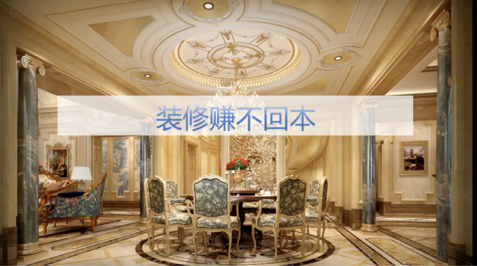
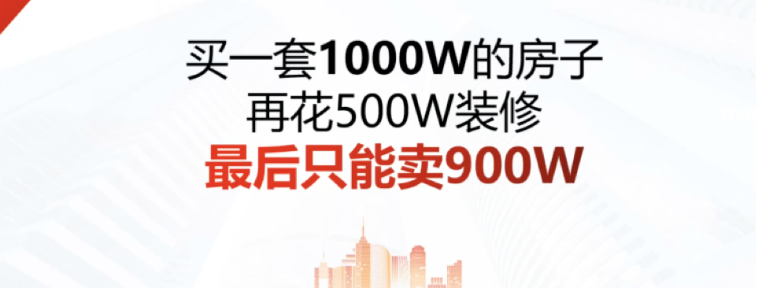

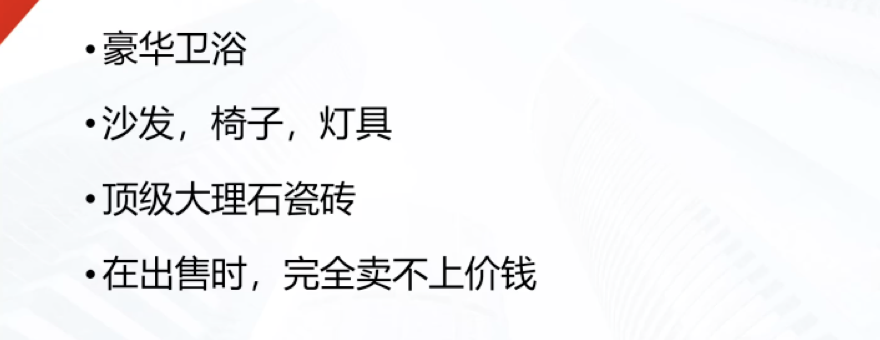

100万的房子，装修花了40万，女人装修房子没底线
装修的
装修不超过房价10%

以下两点有争议
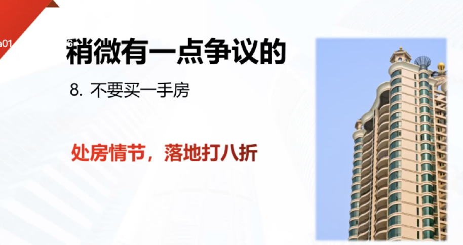

如果二手交20%的税呢，还是买二手，因为yi'shou一手会更贵

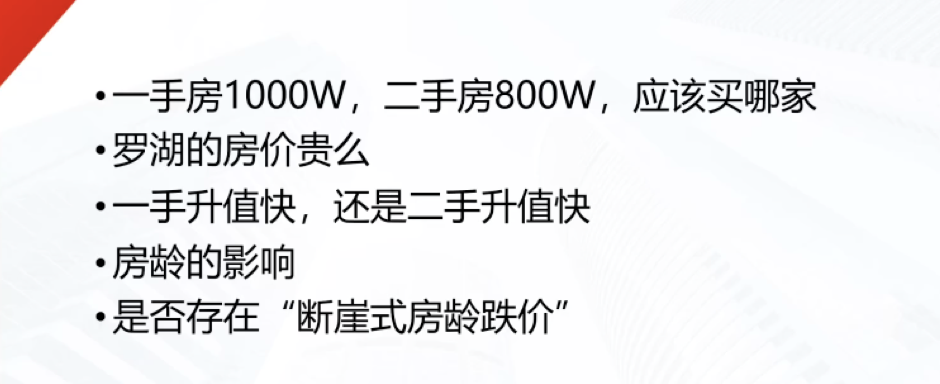

一手比二手贵20%

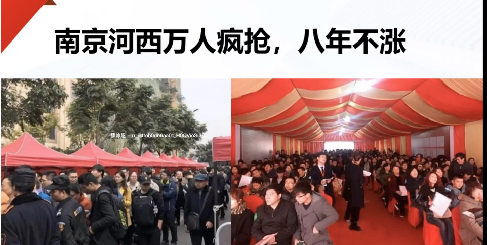

一二手倒挂就是个噱头

不要买新区

所有的新区都劝你和她共同成长，

不要买刚涨了两倍的板块，
认得劣根性就是追涨杀跌
楼市所有的货，涨了一倍，都要回吐

没有强者横强的说法
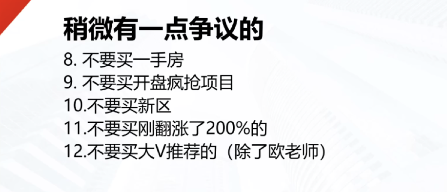

