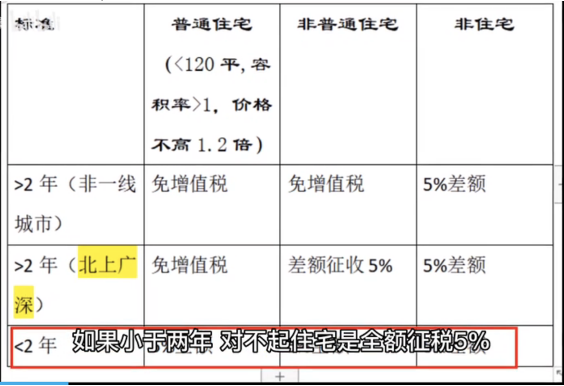

在商品房交易中，有着普通住宅和非普通住宅之分，普通住宅一般会用作民用住宅，非普通住宅建筑面积较大，商业用途大些，现在就来说说普通住宅和非普通住宅定义上的区别，以及二者交易税费的不同。

普通住宅：容积率在1.0以上，建筑面积120平一下，实际成交价格低于同级别土地上住房平均交易价格l.2倍以下

非普通住宅：
1、住宅小区建筑容积率在1.0以下(不含1.0);(除高档别墅外，平常的居民楼一般都在1.0，这条基本可以不用考虑)
2、单套建筑面积在140平方米以上(含140平方米);(你买了套房子138平就是普通住宅，你要再买套141平的，这套就是非普通住宅)
3、实际成交价格高于该区市场指导价1.2倍以上(不含1.2倍);(有的地区有成交价规定，比如有地区规定本区域市场指导价为10000一平，而你买的房子合同单价是13000一平，这就是非普通住宅了。
普通住宅和非普通住宅的区别以上三点只要符合一个，即为非普通住宅。

炒房客一般都是等两年再出售

