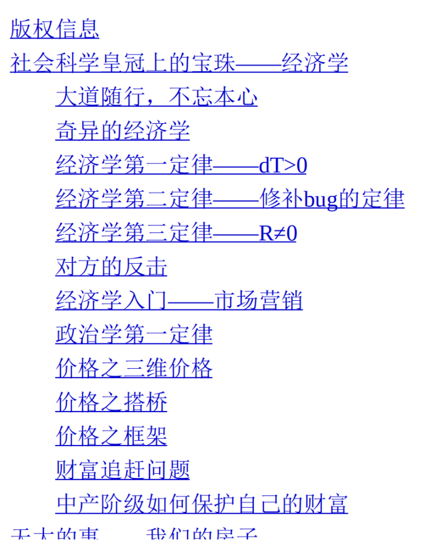

所谓笋盘 
笋盘指低于周边价格的楼盘。 
说一下笋盘的问题。在一些人眼中，他们是无法理解“笋盘”的概念 
的。他们观察这个世界，价格是二维的，是K线图。你和他们说：“这套 
房子很笋，500万元的房子只卖300万元。”他们会反过来问你：“据我的 
理解，价格就是最后一次交易的价钱。”“如果这房子卖给我300万元， 
为什么我不可以理解成这房子只值300万元呢？”所以有些人永远无法做 
房地产投资。他们根本无法判断价值和未来中枢在哪里。而在真正房地 
产投资家眼里，是有两个价格的：总体价格，99个业主的心理价位；边际价格，最便宜的1个奇葩价位。当这两个价格发生冲突的时候，我们 
就认为是笋盘。是笋盘就买入。 
“笋盘”是一种很不正常的现象。Step5：1个业主，要价30000元/平 
方米，99个业主，要价80000元/平方米。很多人会问：如果市场价 
80000元，别人都卖这么多的话，为什么会有一个业主卖30000元呢？这 
个问题问错了，错在因果倒置。正确的说法应该是，市场上永远有 
80000元卖30000元的现象，问题的关键是，为什么会给你遇到。 
如果你学过真正的经济学，你就会知道，经济学所谓的“完美均衡 
状态”其实是不存在的，市场上永远有人卖贱货，买贵货；永远有人不 
领市场行情。不领行情是正常的，是常态化的，人人都领行情才是不正 
常的。问题的真正反面，是市场上还存在很多“套利者”。 

三维价格的实际分析 
最后，我们说一个实际例子。 
2015年深圳房价涨了近60%。而到了年底，被打压一整年的小编终 
于又忍不住了，跳出来喊“深圳楼市开始下跌”“业主削价10%抛盘”“花园 
小区大降五千”。深圳楼市有跌吗？我可以告诉你，“当所有的业主都在 
提价时，整体房价却是下跌的”。 
Step1：A、B、C、D、E挂盘20000元/平方米，F、G、H、I、J自住 
不卖。
Step2：A、B、C、D、E挂盘30000元/平方米。 
Step3：A、B、C、D、E挂盘40000元/平方米。 
Step4：A、B、C、D、E挂盘50000元/平方米，F卖45000元/平方米。
Step5：A、B、C、D、E挂盘60000元/平方米，F卖60000元/平方 
米。
Step6：A、B、C、D、E挂盘60000元/平方米，F卖60000元/平方 
米，G卖55000元/平方米。 
你仔细看这个模型中，对于单个的A，单个的B, 
A、B、C、D、 
E、F、G、H、I、J每一位，其价格都是“越提越高”。 
然而：Step5的小区售价是：60000元/平方米；Step6的小区售价 
是：55000元/平方米。 
这一步中，小区价格却是下跌的。为什么会这样呢？你采访一下业 
主G，问问他是怎么想的。 
“这套房子是我几年前花两万买的。 
“买了之后醉心工作，也没怎么关心房价。 
“前几天我去中介问了一下，哇塞，中介说现在市价快到60000元/ 
平方米了。 
“我想想，我也不那么贪心，就挂个55000元/平方米，咱也不要挂 
到尽，赚两三百万元很知足了。” 
这就是楼市中常出现的现象。每当一轮大涨后，常有一些原先“不 
卖”的业主改为出售。而这些业主的挂牌，通常比长期拼搏在第一线的 
房地产投资者要低，一般是九折。

当整体大势涨了40%之后，你能确定每一个楼盘、每一个小区、每一个业主都提价了40%？你能确信市场如此有效率，信息如此准确无误 
直达每一个人？答案肯定不是的。每一次大涨之后，肯定有业主跟不上 
形势。这等于在已经确定涨幅之后，再给你一个去年的价格。所以“捡 
漏”始终是一种低风险的交易策略，只要你花心思去做，在任何已涨的 
区域内都可以发掘出懵懂的业主笋盘，低风险高收益，捡漏流。

搭桥
我们花了这么长的篇幅，就是来介绍“价格的三维属性”。我们讲述 
了价格深度，告诉你老庄股的市值毫无意义。 
中国人传统上以为，“价格=价值”，这只股票最后一次以200元交 
易，它就是值200元。当我打开电脑，打开股市行情，能看见200元的买 
1，那么它就等值于200元。 
这个说法是完全错误的。我们竭尽全力让你明白，价格是很复杂的 
一件事。它其实对应背后一座山，有山的厚度，而不是简单的一个价格 
200元。
然后我们就要说“搭桥”。 
什么叫搭桥？搭桥就是“把现金变成几倍的价值但是流动性不好的 
资产，再把资产变成几倍的现金”。很多人对于“钱生钱”不明白。钱本 
来就是钱，怎么能变成5倍的钱呢？资本市场的游戏，就是如何无中生 
有。的确，这个市场上，是不会有人拿5元钱换你的1元钱的。 
但是你换个玩法，你把它拆开，分两步走：把现金变成几倍价值但 
是流动性不好的资产；把流动性不好的资产变成流动性好的资产。
金融业是很赚钱的，在本篇中，我们说到了一个比较主流的“钱生 
钱”方式： 
把现金变成翻了好几倍但是流动性不好的资产，再把资产变成翻了 
好几倍的现金。 
一般而言，你拿1元钱去换别人的5元钱，别人是肯定不会换给你 
的。但是如果你拐个弯“搭桥”，分两步走，绝大多数人的抵抗力就没有 
了

你的第一、第二套房子 
第一套房 
当你购买“第一套房”时，几乎不需要任何技巧。你唯一需要的，仅 
仅是下定决心。修真路上有三道槛，第一套、第六套、第十六套。其 
中，第一套的“筑基”阶段最重要，是一个分水岭。对于买第一套房，关 
键有三点：守拙，勤奋，大智慧。
就买房这件事来说吧。房地产投资老手再三告诫的是：“远郊、一 
手、品牌、精装、CEO盘、小户型、高单价、酒店式公寓。”也就是 
说，这八个元素统统都是不可以碰的。而资深房地产投资者建议：“市 
区边缘、二手、国有开发商、毛坯、亲民盘、大户型、低单价、纯住 
宅。”房地产投资者建议你买房龄略老的二手房，这样的房子，虽然没 
什么“新鲜刺激”，但是随着大势上涨，涨价却是十拿九稳的事。新手最 
怕上手第一单就亏钱，只要第一单能赚，以后都好说。

笋盘在哪里，我也不知道，但看房二百套，自然有笋盘。这一个片 
区，你几乎每套房子都看过了，然后一下子眼前一亮。从逻辑上来讲， 
笋盘有非常大的救命意义。尤其是对于一些“聪明人”来说，他永远觉得 
房价贵了5000元/平方米，总是想着赚尽最后一分钱。在过去16年，死得最惨的就是这帮“聪明人”，他们的名字简直成了“观望”的代名词。此 
后房价涨了16年，他们就“观望”了16年。一直从内环三房，观望成了郊 
区厕所。对于重度“聪明人”那是无药可救。对于轻度“聪明人”，笋盘则 
可以医病救人。笋盘七折，相当于回到了一年前的价钱。“勤奋”本身就 
是一种智慧，一种最大的智慧。只要你老老实实地做到了“看房二百 
套”，你就已经战胜了95%的业余选手。 

屌丝买房子，第一点是贫穷。所以他们要往郊区买，地段是首先被 
牺牲掉的。第二是梦想。屌丝要买板楼，打死也不买老公房。因为买了 
老公房，你就一辈子住老公房了。这对屌丝的“出人头地梦”是一种否 
定。屌丝还特别喜欢买期房，幻想中的房子才是完美无缺的。然后是颠 
覆，屌丝们创造了无数的新理论，来论证自己买的不是垃圾地段，屌丝 
男打死要买板楼，要买带小区的，他们要有面子的，而不是最实惠的。 
这些因素累积，答案就只有一个：“超远郊、新城、品牌开发商、一手 
期房、精装修、小户型、现代生活派。” 

而12～1月，市场 
上根本没有普通买房者了，价格就会降低。如果你“反向操作”的话，是 
最容易买到笋盘的。本身这个时候价格就会比平时低10%左右。“年末 
不卖房，年末只买房”是我们的原则。更重要的是，年末会猛然冲出笋 
盘，而笋盘可以活一段时间，不被人扫走，直到被你扫到。当别人都在 
红红火火过年的时候，你要做那个唯一的“在大年夜买房的人”。买房一 
定要在除夕前，市场极淡的时候下手。无论如何，都不能因为偷懒或者 
与家人团聚，“年终奖没发下来”，“等钱筹齐了再看房子”之类的理由拖 
到春节后。春节后，大家都拿到年终奖了，价格就上来了。

房产投资业的2N定理
什么叫作2N定理？就是每年买两套。
你 
要赚“一个亿”其实很容易，最简单的话，你买京、沪、深“1亿”的房 
产，过了两三，年房价翻一倍，你就赚了1亿。 
问题是： 
（1）你没有1亿本金； 
（2）你不确定房价会再翻倍。 
关于（2），我们就不讨论了，这也没什么好说的，反正是拿命换 
来的。任何一场对于风险的赌注，都是拿命去换的，你不愿意冒险，你 
就不用看下去了。对于（1），“如何筹措一亿本金”，大而化之的心灵 
鸡汤，书店里面的“理财宝典”，这些书籍能教你那些营养。而对于专业 
的marketing管培生来说，他思考问题的第一步，就是break down。

我要赚一个亿。 
赚一亿细分成：拥有3100平方米，并且静待三年涨幅。 
我要攒3100平方米。 
将问题细分为50平方米×60套。 
因此，我们就拥有一个更详细的目标，如下： 
我要拥有50平方米的“老破小”，拥有60套左右。 
然后随着上海房地产的大船一起上涨。 
现在用50平方米“老破小”举例，你也可以是100平方米标准二房×30套，如果是“大面积低单价”流派，甚至仅仅需要250平方米×12套就够 
了。任何人一眼就看出，“大面积低单价”对于“小目标”，有更强的逼近 
火力，12套还是比较好操作的。当然，大面积流派的缺点是流动性不 
行，账面好看，出货需要漫长的时间。对于一般的普通市民，我们的要 
求没有这么高。假设房价从8000元/平方米涨到60000元/平方米，则平均 
每平方米赚50000元。一般来说，按照目前的上海物价，我们粗浅地认 
为，“财务自由”这条线设在4000万元左右，算下来，4000÷5=800平方 
米，你大概需要800平方米。
等你积攒到800平方米，我们就认为你是“业余选手”通关了。而800 
平方米，相当于50平方米“老破小”的16套，或者100平方米标准二房的8 
套。

2N起步 
十几年前，大家都很穷，时光回溯到2000年，当“游戏开始”时，每 
个人都是0积分。哪怕职业房产投资者，当时也只有1～2套。这是很悲 
哀的一件事，你先要积累巨大的头寸，然后才可以享受头寸升值的收 
益。第一个100万元，永远比1亿元赚到1.1亿元要困难得多。我们几乎 
将半生的心血，耗费在“建立头寸”上面。这就是2N的意思。 
理论上，你需要16套50平方米的老公房。可是实际上，房子又不会 
从天上掉下来。你还是需要一本一本房产证去攒。用最简单的算术，每 
年攒2本，8年之后，你就有16本。但是你一定要起步，走二万五千里长 
征路。如果你坐在家里抱怨，永远也不会多一本房产证。 

雪坡的长度 
对于穷人，真的是很惨很惨。对于富人，如果你“看对了”走势，你 
满仓扑上，只要一两年的大牛，就足够你赚得翻番。可是对于穷人，你是从“一穷二白”开始的。你可能要先经历十年八年的“2N爬坡”，慢慢积 
攒16本房产证，然后再指望一年大涨，赚得满嘴流油。因此穷人需要一 
个长得多的雪坡。可能需要10年，甚至20年的大牛市，才能翻身跨越阶 
层。

因此，任何一个人看到“2N定理”，想问的第一句话是：“雪坡还有 
这么长吗？”2N是一场长期规划。普通的中产家庭，如果想积累16套老 
公房（1000平方米），真的要10年人生，10年节俭，10年赌注，家当全 
部扑押上去。你花了10年建仓，10年之后，才慢慢开花结果。11年之 
后，你才能享受“每一年升值1000万元”的美妙畅爽。 
可是，10年之后，房地产还是牛市吗？关于这个问题，我们有两个 
回答。第一个回答是，“永胜不败”之法——“定期定额投资房产”。定期 
定额，每年买一套。你如果上过任何一个股票培训班，有一丁点证券基 
础知识的话，经纪人都会推荐你定期定额定投，每个月固定从工资里凑 
一笔钱出来，定投金融市场。定期定额的好处，真的说也说不完。它在 
数学算法上很巧妙，接近于二阶微积分求微导幂函数指数曲线重心外 
移。只要市场“长期向上”，则定期定额的赢面极大。哪怕遭遇香港1997 
年大跌，只要你是从1991年开始定投的，你也没有任何亏损。对于房地 
产的概念，很多人都以为一辈子供一套房子，一套房子供一辈子，所以 
从来没有人想到过定投。但是你把定投和房地产结合起来，每年固定买 
2N，则你的赢面更大。跑赢现金和定存几乎是99.999%的事。
第二个回答，是“雪坡未尽”。

2N之通关 
所谓的2N定理，其实就是每年400万元的资本支出。房地产投资是 
一行“重资本”密集型的行业，房本的扩张严重依赖于固定资产支出。每 
年400万元的现金烧钱，把你折磨得形销骨立。 
做2N模型 
我们来看数学模型： 
第一年：买入A、B； 
第二年：买入C、D； 
第三年：买入E、F； 
第四年：买入G、H； 
第五年：买入I、J； 
第六年：抛出A、B，买入K、L、M、N； 
第七年：抛出C、D，买入O、P、Q、R； 
第八年：抛出E、F，买入S、T、U、V； 
第九年：抛出G、H，买入W、X、Y、Z（拥有18套）。 
如上所示，整个模型的前提，建立在“五年之内房价可以涨很多”的 
基础上。只有当房价大幅上涨，你才可以在第六年抛掉A、B，并买入 
K、L、M、N；当然，“抛掉”仅仅是一个笼统的说法，你也完全可以 
是“截断——加按揭”，如果交易税费非常高的话。但是“加按揭”一样需 
要房价的大幅上涨。我们一般的精算，需要有4倍空间，这样截断七折 
按揭才有利可图。可见，所有的事情都是“环环相扣”的。只有房价大幅上涨，你第六、第七年才可以循环买入。 
持续买入会导致你财政崩溃。 
你财政崩溃，是因为你看好房价会大涨。 
这几件事，几乎就是头尾相连，循环逻辑。当你不惜抽血，冒着杀 
头的风险和无穷的苦难，以各种合理与不合理的（如信用卡和小额贷 
款）杠杆式买入房产时，本身就意味着你极度看好、看涨，预估有高额 
回报。因为有高额回报，几年之后，房子就一定会“回哺”于你。 
2N之残缺 
同时，我们也说明一下，2N并不一定非要十套不可，哪怕你第 
九、第十套没有完成，也不影响大局。 
第一年：买入A、B； 
第二年：买入C、D； 
第三年：买入E、F； 
第四年：买入G、H； 
第五年：（停工）； 
第六年：抛出A、B，买入K、L、M、N； 
第七年：抛出C、D，买入O、P、Q、R； 
第八年：抛出E、F，买入S、T、U、V； 
第九年：抛出G、H，买入W、X、Y、Z。可见，缺乏“幸运”这个缺口，对于大局是无关的。可是，我们为什 
么还要“竭尽全力，使用运气”？因为你再抽掉一年，只剩6套，你也是 
转得起来的。 
第一、第二、第三年，2N； 
第四、第五年，休息； 
第六、第七、第八年，卖出2套，买入4套。 
按照这个逻辑，哪怕你只剩下6套，你也可以“循环往复，依次更 
生”。但是，更进一步，只剩下4套、3套、2套呢？人的堕落是很快的。 
60分及格线，不仅是一条考核线，也是底线。我们设下“5年10套，开始 
2N”，是希望你的“底子”打得扎实。基础越深，以后循环越顺畅，武功 
才能练得越高。 

房地产投资的流派（一） 
流派是什么 
从顺序上讲，这段还轮不到讲流派，因为我们要引用一个很重要的 
参数：“交易成本有多高？”答案是单次交易，房价的20%左右。这是一 
个性命攸关的数据，交易成本的大小，严重影响到房地产投资各大流派 
的存活性，并最终改变了整个产业的运转方式。关于这个数据，纯引 
用，不解释。 
房产投资的流派，就我们目前的这个圈子，大致已经可以列出： 
（1）大面积低单价； 
（2）老破小流；
（3）低总价流； 
（4）法租/民宿流； 
（5）药单法拍银主流； 
（6）疯魔流； 
（7）装修流； 
（8）使用权流； 
（9）二房东流； 
（10）其他失败的流派。 

“大面积低单价”流派 
盈利=（卖出价-买入价）×持有面积×周转 
这是一个颠扑不破的绝对真理。无论你怎样绕圈，这个公式总是绕 
不过去的。大面积低单价，在其中占到了两条，即“买入价低，面积 
大”。在一般情况下，“大面积低单价”可以获得极为惊人的暴利。这个 
流派也是最容易产生千万富翁的。在这个流派下，一张单子赚七八百万元是很容易的，三张单子90后赚到2000万元也挺容易的。这对于实体经 
济，已经是一个可望而不可即的天文数字。同时，离财务自由也仅差一 
步之遥。你要做到的是： 
（1）找一个相对低估的房源； 
（2）尽可能买较大的面积； 
（3）耐心持有。 

一般而言，（
1）和（
2）是有一定的相通点的。就2000—2015年的 
上海楼市轨迹而言，卖得最好最贵的是二房。二房单价远远比四房或者 
复式要贵，一般要贵10%～15%，大面积本身就显得便宜。而在这个流 
派下，我对此不在乎，我就买四房。然后我有足够的耐心，一直等到四 
房比二房贵的那天。同样一个小区，四房可以赚到远远比二房多的盈 
利。因为你的面积比它大，而你的“卖出价-买入价”差价拉开得也比二 
房远。可见，这个流派赚取的是纸面财富，推后延迟，乃至完全不考虑 
未来抛售的困难。 
那么这个流派的缺点是什么呢？缺点是： 
（1）没有流动性； 
（2）没有租金。 
大面积低单价，尤其是我们还特别喜欢买一些很特殊的户型，一些 
很“妖”的房子，火箭外挂助推器，以获得更大的超额利润。但另一方 
面，则是我们完全丧失了流动性。当你买入时，别人都不看好。譬如居 
民区的无电梯顶复，抑或通河八村打通的超大户型职工宿舍。这种东西 
别人都不看好，怎么会有人要呢？的确是没人要，所以价格也这么低 
啊！我只要你买入价低就可以了。然后再卖出时，我需要等待漫长的岁月，而买入价低，则确保了我 
立于不败之地。“大面积低单价”这个流派，从来不追逐热点，从来不会 
一夜暴富，在最初的两三年是看不见利润的。不接受这现实的，别入这 
一行。此外，大面积低单价流派，在租金上也是非常吃亏的。此项每年 
大约要吞噬掉1%的利润，税费也是吃亏的。 
大面积低单价这个流派，特别重视单价面积。入货的时候，单价一 
定要足够低。如果旁边的小区卖6万元，那我最多只肯出到4万元，甚至 
理想是3.5万元。所以这个流派做单子十分慢，一年中大部分的时间都 
在闲逛。平均下来，一年也能做两三单。但这个流派的特点，就是特别 
注重买入价，对于卖出不是特别重视。难卖就难卖了，只要有足够漫长 
的岁月，一切都是可以克服的。 
这个流派的优点是什么呢？不要忘了我们再三强调的特点：风险。 
假如上海楼市彻底崩溃，你该怎么办？不怎么办，我买来的时候，本身 
价格就低。“大面积低单价”，防线就是我的成本足够低。

“老破小”流派 
“老破小”是最适合初学者的流派。 
房产投资有两个最主要的流派：“大面积低单价”和“老破小”。所谓 
的“老破小”流派，并不是指专门喜欢买又老又破又小的房子，指的是一 
种思想：“房租/房价，百分比最大化。”“老破小”流派追求的是租金回报 
率。最好是5%，但目前上海房价涨得太快，已经很难找了。那退一 
步，4%也行，最差最差3.5%也行。但“老破小”流派一般不接受3%以下 
租金的房源，看都不会去看。“老破小”流派并不是一定要买小房子，而 
是在目前市场上，形势很明显。你要获得高的租金回报，唯一的方式就 
是面积尽量小。
因为首先人是有一个基本生活需求的，然后才是进一步的愉悦和舒 
适。这是非常强大的刚需效应。其力量如此之强大，千锤百炼。在租赁 
市场上，面积到了35平方米以下，租金就不再变化。而对于买卖，买卖 
是按平方米算的！所以，如果你要追求“房租/房价”租售比最大化，倒不 
如说你在寻找“最小户型”。 
“买卖是买卖，租赁是租赁。”“老破小”流派的问题是，它赢得了租 
赁，却错过了买卖。市场并不会因为你有更高的租售回报比，而给你更 
高的估值。相反，起决定性力量的是，盈利=（卖出价-买入价）×面 
积，是这个公式。“低单价大面积”流派最大的特点，就是赚得多。 
而“老破小”流派从赚钱的角度而言，是极其吃亏的。不过，“老破小”流 
派也是不怕上海楼市彻底崩溃的。从目前看，租金下限就是底线。

“老破小”流派有几大好处：（1）入门门槛低。“老破小”几乎是门槛最低的一个流派。 
（2）租金比率高。房租和月供几乎可以相冲，后续无压力。 
（3）没有空置期。 
（4）拆迁概念。 
（5）出租房东不付佣金。 
（6）风险有限，便于练手。 

卖房子这种事，大致要经过一个“1000—100—10—1”的过程。也就 
是你说，现在在58同城、赶集、豆瓣之类的网站挂牌，然后你要接到 
1000个电话来询问你房屋信息的细节，100批预约来看房子的中介，10 
批真来现场的，却是拍照的，只有1个诚意客户，并且在观望期。降价 
是无效的，你哪怕降得再低，也不能促成成交。 

逼空式上涨 
一旦市场进入观望期，房东就开始跳价。譬如，你1000万的房子， 
一旦进入了观望期，哪怕你降价到700万，你接1000个中介电话，诚意 
客户也是没有的。在这种情况下，房东一般采取的策略，是加价到1020 
万。什么，加价？没搞错吧，1000万都卖不掉，你还加价？对，就是加 
价，因为市场上没有诚意买家。降价无效，那我干脆把价格挂高。价格 
挂高，有几个好处： 
（1）在市场上形成“2年前就卖50000元/平方米”的印象，美化K线 
图；“××楼盘一直比隔壁贵”。 
（2）在市场上制造new news。 
（3）告诉对方，房东的心态是乐观的。

房地产市场的两朵乌云 
房地产市场的第一朵乌云，是一线城市过度上涨。从某些意义上 
讲，房地产投资完全是一种京、沪现象。或者说，在过去十年，真正靠房地产投资赚钱的，只有京、沪、深等寥寥几个城市。 
随着2016年的二线省会城市大涨，这个坑目前来看渐渐被填上了。

第二朵乌云，是一手房和二手房热度之间的巨大裂痕。
目前市场的狂热，貌似严重集中在一手房市场。老百姓买房子的第一选择，依然是一手房市场。第二朵乌 云，我主要担心的是：房地产，究竟值钱的是什么？究竟卖点是什么？ 
究竟吸引消费者，能让他们掏钱的是什么？按照目前的上海房地产市场 
现状，则房子值钱，房子价值的核心要素是房龄，房龄，房龄！如果房 
龄=0，那就是一手新盘。如果你观察目前的重庆、成都市场，你会感到 
绝望的。因为在重庆，任何一套楼龄大于5的房子，都卖不出好价钱。 
在上海，哪怕你再好的房子，一旦楼龄大于10，你就卖不出好价钱。我们为什么要高度关注这件事？因为我们需要判断房地产的真实价值所 
在。我最怕的是，房子价值的50%，来源于房龄。而房龄是一种高度不 
保值的东西。 
“两朵乌云”为什么重要？因为这是严谨的科学素养。我们对房价的 
判断，是算出来的，而不是蒙出来的。只要有一丝一毫的裂缝，这整幢 
大厦就会轰然倒塌。

抵押和再抵押 
“全款—抵押”是一条非常好的路，买房子追求两个KPI：①价格尽 
可能低；②杠杆尽可能大。 
所谓“全款—抵押”，是指你先拿着600万～1200万元不等的现金， 
在市场上寻觅笋盘，然后反向抵押。重点定位于： 
中小企业破产； 
离婚分家产； 
转移财务； 
某人着急出国（原因很多）； 
法拍； 
笋盘急抢破头。 

对于那些现金到位要求十分紧迫的案例，你全款扑下，自然比慢吞 
吞地申请贷款大为赚优。而你再要求房东降价，看在立即拿钱的分上， 
要求房东给予额外的5%～7%降幅。一般而言，最容易出笋盘“暴 
击”的，主要是两个地方：①地方钢材城周边；②跑路抵押贷款。 
（1）抵押贷款从字面上讲，政策可以贷款“七成”。而在实际操作 
中，评估公司普遍估不足价钱。一般给予“估值”是市价七成，也就是实 
际贷款70%×70%=49%，抵押就贷五成，高评后55%。 
（2）抵押贷款通常是10年，部分银行可以做20年，大概只有中信 
某些年份可以做30年。
（3）超小户型比较吃亏，很多银行不做小户型抵押。 
（4）中国银监会规定，银行不得接受有抵押的物业。其主要目 
的，是你把房子先押给了A银行，若再“二按”给B银行，万一出了坏 
账，A和B要协调处理债权问题。所以，中国的银行业一律不得接受“二 
按”。社会上如果出现了二按，无非以下几种情况：①担保公司介入， 
银行其实和担保公司发生业务，费率很高，月息2%～3%；②个人抵 
押；③先还清旧的，再加笔新的。 
（5）银监会要求，抵押贷款不得放款给个人。按照银监会“两个要 
求，一个指引”的文件精神，全中国任何贷款必须有指向用途，必须是 
促进实体经济的。 
实战操作中，银行只接受三种用途：①装修；②买汽车；③买家具 
和艺术品。 

（1）抵押贷款有费用。在2008—2014年大概是1%的总成本。2016年开始突然猛涨，目前行规1.8%～2%，一般你不需要多问费用的细 
节，乖乖付佣金即可。 
（2）利率。利率完全不敏感，一般抵押贷款按P×1.2计算，利率 
6.0%。再加上“前置”2%手续费分三年摊销，实际成本6.6%左右，完全 
可以接受。评价抵押贷款的优劣，主要是“成数”而不是“利率”。 

