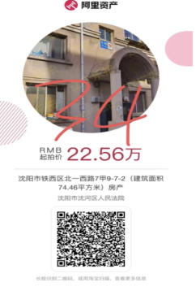
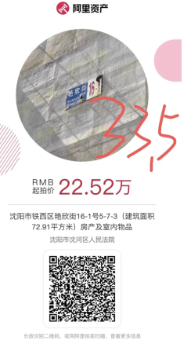
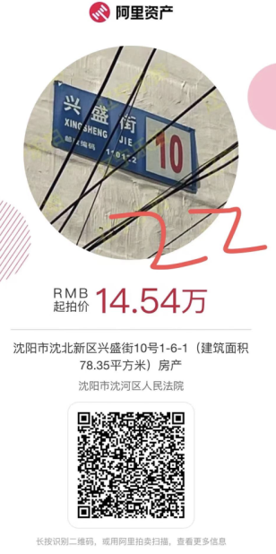
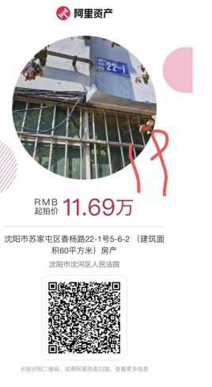
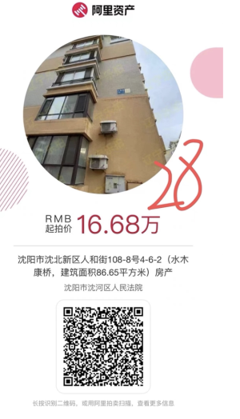

直接搜索街道，就能看到很多已经结束的法拍

沈阳市铁西区北一西路7甲9-7-2(建筑面积74.46平方米)房产

  
沈阳市铁西区艳欣街16-1号5-7-3（建筑面积72.91平方米）房产及室内物品		

沈阳市沈北新区兴盛街10号1-6-1（建筑面积78.35平方米）房产		

沈阳市苏家屯区香杨路22-1号5-6-2 （建筑面积60平方米）房产		

沈阳市沈北新区人和街108-8号4-6-2（水木康桥，建筑面积86.65平方米）房产		

    
    
    

