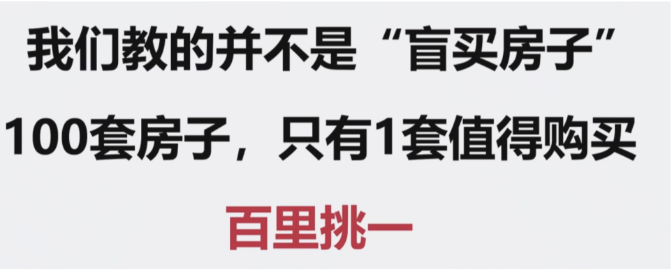
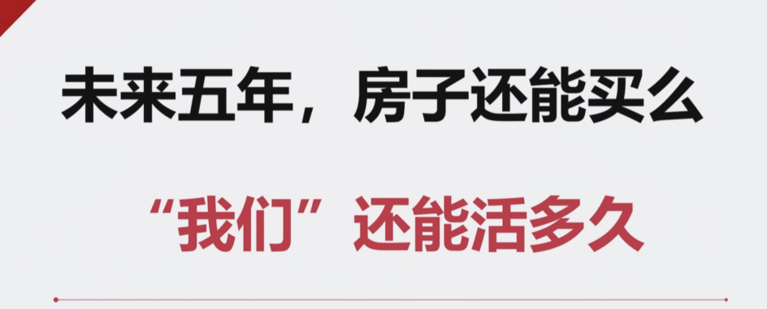
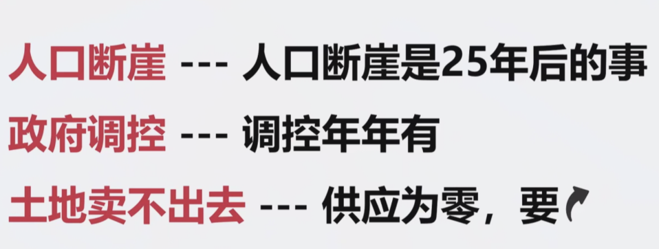
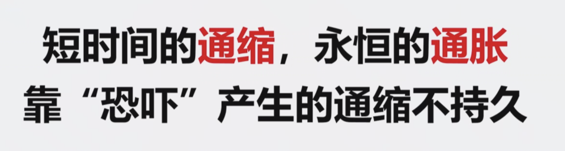
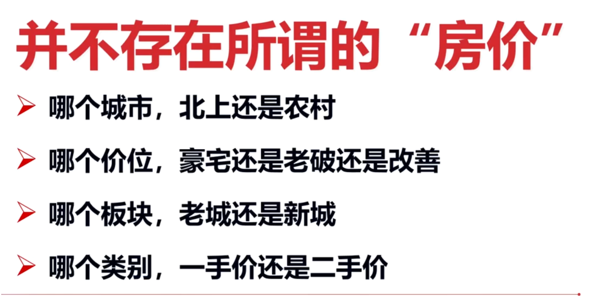

我们要求不高，你看房200套，再挑出性价比最高的两套
看房200套，笋盘自然见

如果不做基本功的话，会损失2年，3年，5年的时间

我们的赛道并不拥挤，专业人士非常少

以前虽然涨了很多，但是现在政策变了，国际形势变了，金融大趋势变了，大环境变了，
所以你以前的狗屎运不可重复了，

投资高抛低吸是小事情，很low的，投资的大事情是方向

通胀是永恒的未来，一直到宇宙的尽头

怎样判断自己的家庭该不该买房

租金在15年内翻了3倍，但我房子是之前买的，不能看当前的租售比，应该用未来的租金和当前的售价对比
从70年的角度讲，买房比租房更便宜，没有任何一个房东承诺，把租金停留早2800一个月，

目前房租涨幅最有潜力的是重庆，重庆的两房三方就租2800

城区老破小，郊区大别墅哪个更值得购买

