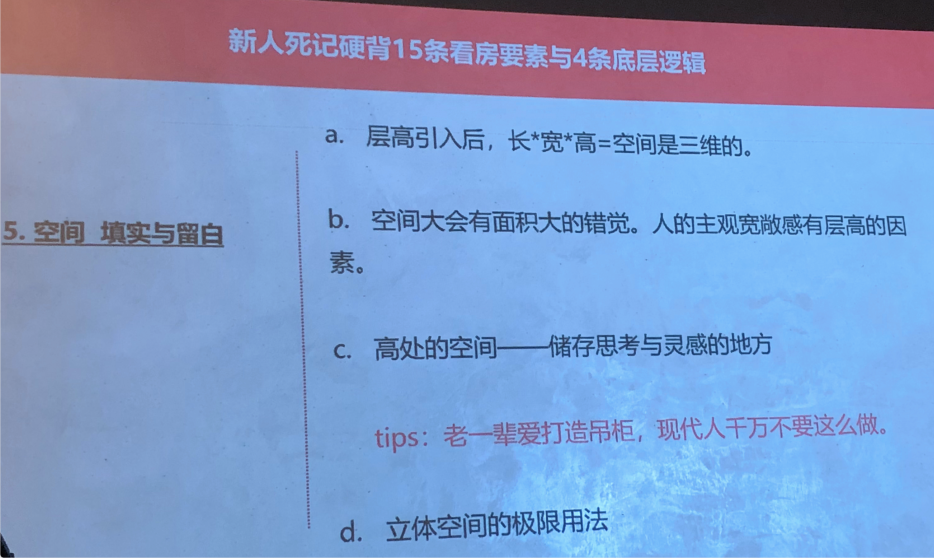
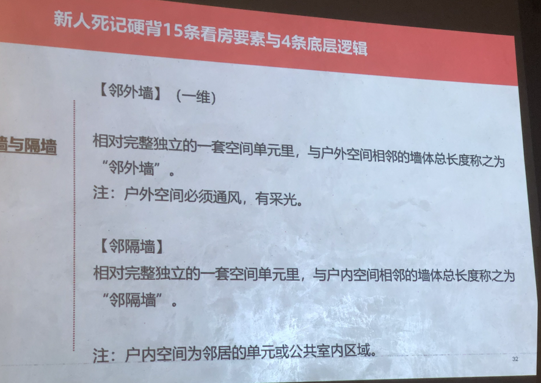
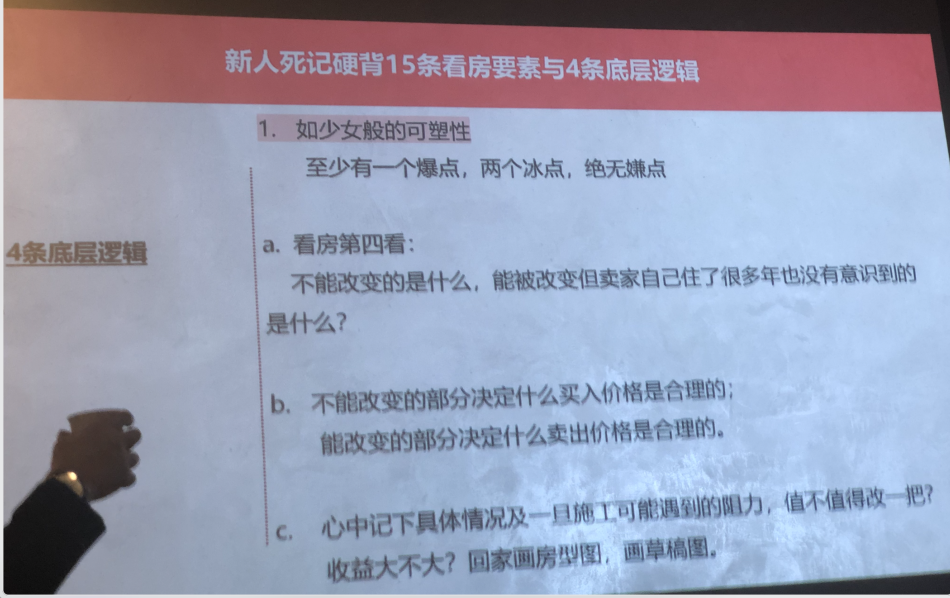

欢迎大家来到马**的二手房实战斯授课。所谓资授就是资相传授，所以我们没有在大庭广众，没有在直播间，也没有在微信群，而是选了这么一个小众又私密，甚至是隐藏在民居中的地方，由马**来为大家传授他在二手房市场的实战经验，尤其是他自己独创的全套共同留课程，就马**在水库实事求是回答，关于买房卖房的时候曾经写过一段话，我一直都记下来，我读给大家再听一遍。
他说买卖的一瞬间是一个人之前所有年华自我训练，大脑到底到什么程度，交卷子的时刻是所有的支持、智商、情商、人脉、判断力和分析力的总和，像买房和卖房这么重要，有的是人生中很重要的课程，但是大多数人是没有机会，包括我自己是没有机会去系统的去实战或者系统的学习。
那么今天马**就想使用在座的各位一整天的时间，全然沉浸在他的二手房几站课的4 大篇章，这4 大篇章分别是看买房、改房以及卖房。下面我们就有请马**老师开讲。

讲课人2：
好。看到大家我就很放心了。因为我性格有点内向，有他在我这比较有安全感。今天可不好意思，我外面在修路，所以我得嗓子响一点。但愿他们早一点结束，待会儿雨万一越下越大，他们可能就会每一次开始前我都会根据最近的市场的跟大家先拉拉近，但是最近的没有市场，我们知道春节到现在几乎是停摆的，所以我们要把时间稍微倒退。春节以前的上海是非常的疯狂。
对吧? 已经怎么说新房子都是房东随时随地的票价出到他的价格不收国票的，再出到他我不收票的，然后最后政策就来了。每一次都是这样，每一次上海都是在最热的时候政策总会要出来的，我觉得这次的政策是非常温和的。
这次的政策基本上就是说读假离婚冻独假离婚这个事情，这个东西我再三要跟大家讲，所有事情炒房这件事情都要趁早，什么事情都要趁早，离婚也要趁早。
大家有没有想到，我不知道在座有多少人是这么做的，有谁会对有些离婚满三年，离婚，如果你满三年，我打个比方，你今年 6 月份如果满三年，你今年 6 月份你就

有一个机会就是找一个人去结婚，结完婚你又能多买一套，对不对?是不是? 如果你离婚的早，你现在就可以走这一步。
因为我们的政策从自从把婚姻跟买房资格捆绑在一起，就是说原来是一个好好的酒囊，那个酒囊是好的，自己去划了一个刀子，第一个口子是他们自己还，划下来以后发现不对了就去补，每一次漏了他们又要补，最后就变成了一个打满补丁的九龙。本来婚姻跟购房资格完全没有关系，所以本来是一个完好的酒，所以这第一刀是我们的政府责任。但就我在微博上还是公众号上都不可以这么写的，写了我就被封掉了。
但是我们关起门来我们就可以讲，所以炒房真的是每一步都要赶在别人前面，结婚要趁早，生娃要趁早，离婚也要签字，复婚也要成长，什么都要，什么都比人家比政府出政策早一步，你就可以赶在九郎那个洞被补起来之前喝上几口酒。
我觉得接下来就是斗智斗勇，进入到一种非常残暴的一种程度。
好像在怎么说炒房的市场的越来越是要极度的理性，理性的是唯利是图，只做对自己有利的事情，你才可以在这个地方活下来，你一点点的浪漫情怀，一点点的完美主义，一点点的洁癖，可能在这里面就活不下去。
这是我们现在生活的一个具体的，因为我们这些人，我们既然大家付了钱来上炒房子的课，大家都想保住资产，都希望自己通过房子这件事情，资产变多而不是变少。
所以这就是一个很考验大大家的，所以底层的三观内心的不能有一丝动摇，有一丝动摇的，我今天讲的所有东西你都会怀疑，你都会怀疑的，你会觉得这个地方是不是这个家伙太坏了，这个家伙都被骂上人民日报了，他是不是真的不是个好东西，就是你们明白吧，这个心态一定要摆到一个这个不是你自己要做坏人的，是我们逼着大家要变成这样的一个生存动力。

0k 我们一点点来看得到。折叠时间的，我这个人就是说我在炒房这件事情上，我觉得如果大家对整个的时间，这个维度，就是说一般性我们去看房子，大家说面积房龄什么，大家有各种各样的标准，但是其实在这件事情里面，房子这件事情跟股票比特币，所以世界上所有的投资品有一点是完全一样的，它是在一个时间的维度里，你的资产的多少是跟时间是有关的，但是跟比特币股票比起来，房子又是相对来说风险很低的，尤其在上海的房子，尤其上海外环内的房子，这个机器有时候烫了，它会自己喘一口气，然后时间所以是一个很重要的维度，这个时间有时候你要感受你什么时候买入，什么时候卖出，什么时候加杠杆，什么时候减杠杆，如果你在里面经常能够找到这种节奏的话，找到这种节奏，在防止你买卖的整个的一个怎么说你的历史当中，你会发现你经常能踩对点。
比如说现在上海我们知道今年差不多接下去就是一个普涨的情况会发生，学区房带头，次新带头，其实大家不知道去年上海的老洋房市场，老公寓老洋房市场，因为那个市场太小了，整整涨了一年，比学区房还要早。
因为我一年当中我经常带一些客户看这样的房子，为什么我看比较大的房子，因为我自己不是做中介的，为什么带别人看大房子?万一他不买，我也欣赏到了一套房子，我带着我喜欢看老洋房，所以我经常会去看，所以去年一年长得非常厉害的，非常厉害，有很多年初 800 万买入的，年年未他可能就 1300 万就卖掉，他就一年就能赚 500 万。
我身边的朋友有人这么操作，然后先买后卖还是先卖后买，我就直接给大家答案。像现在来行情了，大家一定要先买后卖，千万不要在行情当中你会去想我是不是先卖掉一套，是吧? 把我本来 90 平方一套房子卖掉，卖掉以后再去换一套 140 平方，你脑子里会这么想，2 房换3 房或者 2 房换4房，我直接告诉大家一定是错的，在我们就直接最好，你意识到大涨了，最好的做法先买入，先平直老命的到处去求爷告娘去借到钱，在大掌前夜多加一套，多加一套大涨过后的，你把本来满 5年或者本来我们要满满2 年就够，现在要5年满5年的那一套卖起来，就把本来持有时间长的那套卖掉，它新买入那套放在手里，这样打一个时间差，这样一波行情你就吃了两波，对不对?
还有一种更厉害的方法是意识到这种板块的轮动，先是先是找到齐涨的这种比较热的板块的房子，先去炒一波，然后后面最后谱奖项这一次肯定是老婆小和老婆大还在最后，因为这个是有一个拨倒的作用，但就算老婆大老婆小全讲完了，最后还有内环内上海的房子每一次都是内环内，最后的都是郊区的，整个定价体系全变掉了，大家意识到内环内的这些老房子是不是跟着也要动一动?
所以这样如果你轮番这样操作的话，极限的做法一波行情里面可以吃到三波行情。
如果你每一波行情都能够把它吃成三波行情，你的资产增加的速度会非常可观
但是底层逻逻辑就是说跟那些炒币的炒股的有一个非常大的不同，因为我们在房圈这件事情，我们是非常安全，我们风险是非常低的，大不了买错我就拿着，对不对?房子总归在，大不了实在我找个人住进去，要么我自己住进去，要么我找别人住进去，而总归是有方法的，对吧?
不会有，除非你外面借了高利贷，我也希望大家不要这么做，一般的 7%以下的钱是闭着眼睛打的，解接过来买房子不要紧，对吧?
这个但是你在当中会很操劳，会很辛苦，你的人格会变成一个很实干的人，所以基本上在房圈你会经常会碰到的人都是好时好好干，就是谈情说爱的能力会有所有所平静，突然谈心说话会有障碍，就天天都在做，
因为很多所谓川中的大佬，你最后听他分享他的整个过程，你也不是很羡慕，因为也不会像炒股炒期货那些人好牛逼，我 13 个涨涨停板，怎么样一年花了 300%，就是讲出很多这样的故故事，好像都是脚踏实地的，非常辛苦。看了很多的房子，比较了很多东西，到处为银行借到的钱都是很实实在在的。但是这种性格确实是在皇权生活下去生存下去，生存下去的一种信仰。所以我们还是要从底层的东西先讲。

说话人2 12:36我们所谓看买房、改房、卖房，所有一切都为了一个目的流通性，流通性就是说我们大家都非常知道，就是说收益性、安全性和流通性。房子安全性没有问题，收益性的也完全没有问题，时间放的长，收益性肯定比股票但是流通性有问题，流通性可能很有问题，但是我恭喜大家，你们现在处于一个什么时间点? 中国的历史点，个老龄化的社会给了我们一个什么样的市场?
一个老龄化的市场，绝大多数的房子流通性，因为自己的原因降得非常低，所以为什么凤冰还是有有肉可以吃，因为市场上卖的大多数房子你走进去，又拉他又脏又一塌糊涂。
我遇到过最离谱的房子，我进去有一个老头子在他的客厅中央，对了，像碉堡一样的米，我们尤其是男性其实是我们的 DNA 里面有一些血瘀人的本能，山洞里面这种确知人的本能，所以那些不太会安排好自己生活的人，不太会做断舍离的人，家里面是 a踏步，走走进去就是灾难，这样的房子非常多，市场上像灾难一样的房子非常多,这也是为什么很多年轻人喜欢一手房的原因。走进去干干净净，对吧?

有一个主观的美好的心情，尤其如果你有一些浪漫的情节，你有些浪漫的情节，这是一套我花了大钱买下来的房子，我走进去要有一种恋爱的感觉，完蛋，基本上你就上钩。
所以市场上既然那么多房子，它因为自身把自己给弄的第二车一塌糊涂的原因，它的流通性自己降下来，所以我们凤兵甚至我有一个好朋友，这个人他所有的凤兵他是怎么做的，告诉大家。他又不懂户型，又不懂装修，又不懂什么，但他也能赚到钱，因为他心比较平。以前税费比较低的时候，他还赚很多钱，他跑的比别人快，他每套房子他就做一件事情全部砸光，弄清楚弄成毛坏，卖。
他每条就是弄干净卖，到后来他进化了，他会把墙刷白，他说刷白以后房间更亮，也花不了几个钱，到后来他又进化了，把电线给别人排一排，他说其实我也没有换电线，我也没有拍拍槽他怎么做的，他就把所有的面板给换一下，所有的开关面面板换一下，换成新的电线它根本不管，他就把房子里脏东西全部扔掉，找两个清洁工人把它弄干净，他就怎么办?
他照样每一套都可以加个比如说一二十万，我是指 50 平方的房子，加个一二十万，他就卖了一年跑个四五趟，他赚很多钱，他没什么本事的人，他就喜欢擦擦脸，一俗话叫他不明扫黑欧洲卡布比它就是不停的卡布比。我比他要，我觉得可能是因为我自己是搞艺术出身的，我有点浪漫情怀，可能是我傻逼也最多有可能的。就是说我喜欢弄的稍微漂亮一点，稍微漂亮一点，也不是那种像民宿一样的满满当当的。
民宿是另外一回事情，因为别人要住进来，今天这些该有的都要有，但是凤冰就是说有时候要留一点空间，让买的人他自己去发挥，他自己喜欢的东西，让他自己选。比如说一个厨房，我可能装修到冰箱的位置留在那里。
只要是个人，他不是一个动物。都能发现一个冰箱位空调我甚至。打完一个洞放在那，实际上是个人不是一个傻子，他不是一个弱智，他就能发现那个地方是挂空调的，但是我也只做到这一步而已。
最后用什么东西你自己去选，用什么洗衣机你自己去选
我自己也尝试过帮别人把电器全配足，最后效果不是我发现还是留一点空比较好。市场上我说奶油蛋糕上的裱花总会。最早被小孩骗。填掉这是。

人性的一部分，这是人性的弱点。人性的弱点就是会把美好的东西先占为己有。同样两套房子在卖一套房子装修得漂漂亮亮的。
一套房子又脏又乱，一个有老人臭的老头天天守在客厅里，地板上堆满了米，他就很难卖掉，你肯定比他走得快，而且你可能加个 20 万，你说那些米根本不值 20万，他只是只值 300 块钱，但是没有用，市场就会觉得你这个是一个非常 smooth的交易，就是非常顺滑的交易，跟你交易会很简单，里面也很干净，没有贷款没有抵押，没有户口，你交出来的房也是干干净净的，就是我接下来的当我买下来的当天下午我就可以去挂牌，我要出租，确实有很多买我房子的人，他们可能一个礼拜就把房子租掉了，他就回外地了他就不管了。
每个月说说组形变成一个非常简单的事情，如果你让下家把事情变得 easy，你的胜算就会比别人大，对吧?  

说话人 2 18:53今天我们主要就是分这 4 个章节，然后最主要讲的是 134，因为二大家都太有经验了，各种各样的房比讲的也太多了，在买这件事情。实际上我觉得每个人都觉得自己是对的。因为买房。这件事情当中有一个人性的考验
说话人 2 19:14人一旦这个房子自己买下来，哪怕他买的不是很好，他也会觉得很好，没有人会觉得自己买的房子不好，人总是在买之前说一样东西不好，买完了都说好，这是人性。但是他到底在市场上好不好，往往是最后卖的时候才知道。卖的时候有些房子开了三组人已经开始调价了，有些人看了 30 组人，没有一个人停留满 30 秒，你跟别人说我这套是三房，人家看厅人家叫我走了。很有可能的，因为你这个房子别人不要，所以这个东西卖的时候是真正的考验你买的到底有没有买对。

我们大家看我微博，我经常会写些马丁深造词，就是我自己造出来的。
因为有一些概念法条放在这里很准确，但是我们的汉语里面本来没有这个词，我只能自己造。
第一个叫爆点，通过一个环节的重点改造，大幅度增加一套物业的市场价值。
我打个比方，比如说两房改成三房，3 房改成 4 房，本来一室户你改成一室一厅，对吧?它的或者本来楼顶有个露台一塌糊涂，现在被你改出来了，改出来你能用变成一个很休闲的地方，这种都是很加分的，对吧?
第二个是冰点，就是我前面插把脸的朋友，可能这就是弄干净，就普通水平的，弄赶紧这里换个灯。
你换个窗就是这样，
第三个嫌点的就是令人产生厌恶的外部客观因素，比如说今天这个房子如果你要卖别人来看房，正好喷到外面再修马路，别人可能就不一定愿意买，觉得实在太吵了对吧?
那个人产生业务的外部客观因素，有时候你窗一开正好是一根电线杆，你窗一开你的厨房正对着一个垃圾桶，这些都是哪怕你的房子的定价在市场的体系里面是ok 的，别人心里面也会有一个小揪揪，好像就下不去手。
最后我叫 韭性，酒性我是想我发明的一个词发明的一个词叫酒性大发，有些大班就是人的自己有时候是很愿意做韭菜的，很愿意被别人割的。
我们从小我们从一个小孩压压血雨，他还没有压压血雨，他就很希望被割，这是人人性中很脆弱的一部分，我们对这个词认知越深刻，你就变成了一个资本家，就是你割别人而不是别人割你。我有一个好朋友，我经常跟他一起去看房，因为他自己是学建筑的，看房子还蛮有一套，它也有很多二手房买卖的经验，但他有一个问题，他这个人每次跑到人家客厅里面，他一进去喜欢。
尤其是那种景观很好，你跑进去当时人家房东的面哇，好我行，我只替他，完了你
哇一下 20 万没了。因为别人房东马上就知道你喜欢，不能让房东知道你喜欢买房子，要让房东觉得你很厌恶这套房子，实在是因为钱不够，所以才选择他。

我觉得你看房 200 套，我觉得欧老师我们尊敬的欧老师在水库永远回答人家开房 200 套，开房 200 套，别人问他怎么看房，他就回家看房 200 套，当然我就意识到他留了个空间给我，我就可以变出一些内容来，但是有一点耍流氓，无论你怎么问他，他都回答你开发 200 套。
但事实上看房是一整个体系，有很多的细节，你叠加在一起，这些标准别加在一起，很多可能有 200 个标准叠加在一起，最后看房就看的比别人懂一点，练出火眼金睛，
所以需要一个处理视觉信号的脑子，看到一个房子，开间是多少，进深是多少，层高是多少，朝向在哪里，可能出现的噪音是多少分贝，哪一堵墙隔壁是邻居，哪一堵墙外面是走廊，哪一堵墙，外面是室外，马上就反映出来，就穿你看一眼，别人也是看一眼，甚至有人看房子，他就在看窗帘。
我以前认识过一个老阿姨，这阿姨自己是卖窗帘的，她别人看房子她出来的时候一个槽皮子被吹掉了，这个就是说因为他做什么他就发现什么，你去看房子要看什么很重要。

所以在看房的过程当中，我们底层的三三个挑剔是美德? 我们在生活当中可能很大方是美德，有一些人很很豁达，很豁达。怎么说应该用一个什么样的词就出现了大大咧咧的生活中我们挺喜欢大大咧咧的人，跟他相处起来比较轻松，大家都有这样的经验，但是买房不是这样的，因为你今天不是挑剔一样，拼多多 10 块钱的东西，你今天挑剔的是一个 7 位数甚至 8 位数的东西，对吧?
所以你挑剔货物的对标的价格值得你调节，值得你挑剔。要是你买一个 8 位数的东西，你都不挑剔，你这个人就没救了，你真的就没救了。对吧? 
然后刻薄是天赋，刻薄是天赋，因为为什么? 其实就告诉大家，你跟房东你买房去跟房东之间博弈，或者你卖房去跟买家之间博弈，或者当中有中介在当中还在那里打架，其实随时随地你都是在挑战互相的底线。我们去动物园看猕猴的猴山，两只猴子要打架，他们是不是要把对方弄死，从来没有。看到猴子打架就是为了互相试探互相的底线，卖房子买房子，这个是要迅速试探到对方的底线，也让对方知道你的底线在哪里。因为是因为这个数字太大了，我打个比方，如果你每年的工资，我们假设是 20 万，买一个 2000 万的房子，你 100年的公司，我们忽略突破百年的 100 年的工作，你买一样这样的东西，你是不是应该很挑剔很刻薄，对不对?
因为你损失一点点，可能就是 5年的工作，再损失一点点就是 10 年的工作，因为这些劳动量在最后你实实在在去做的时候，风雨无阻，每天坐着地铁去上班的时候，那个是实实在在的劳动量，所以值得克服一下。
享乐是优势，这句话是什么意思? 很多人尤其是多菌圈有这样的人，吃了很多年的苦，自己明明已经是 a8.5了，给自己买一个 5000 多块钱的东西都有心理障碍，我们多金圈经常碰到这样的人，给自己买一瓶好一点的面面说买一双好一点的皮鞋，心里面都有障碍，完全不像他的小孩可能根本就还没赚钱，已经开始好东西买起来，享乐在看房这件事情上，我告诉大家反过的是优势，当年家里面比如说是大资本家，或者家里面把他从小当小开，把它当公主，养大的养尊处优，他倒反而看房了不容易跌到很理性数据主义的这种坑里面去。因为一个人会享乐，他才能够与好的房子发生共鸣等等。
很奇怪，有我们知道上海的最早的我告诉大家很有趣，香港人和台湾人最早来上海炒房子选择的品种是完全不一样的，台湾人选择了两个品种，一个是老洋房，因为他们有民国情结，民国青年。
去年郎咸平在南京西路买了一整套的老洋房，带花园的很大的，因为他有民国情结，他跟我们的欧老师讲，我要买一套有民国感觉的房子，台湾人很喜欢这种遗老遗少的有身份感的，所以台湾人还有就是把古北的我们知道古北黄金城道那种地方，台湾人买了很多，他们很早就发现了古北是一个比较不错的能满足他们生活需求的一个社区，这种享乐是优势，因为他有享乐的心，他知道什么是好东西，八旗子弟就这种意思，他反而看得懂什么。
长期虐待自己，对自己不太好的买房子的时候有时候倒是很怪的房子，最后朝北的房子都是卖给这种变态纯朝北的或者有三角形的，房型怪的要死的，他觉得这是笋盘，明明这个是这个是个很糟糕的一个牌，但他觉得是笋盘，明显是因为硬伤造成了便宜，而不是他好东西卖便宜才叫笋盘，差的东西卖便宜，这就是他原来的价格。那都是这种苦待自己的人买了这种很糟糕的房子，我遇到很多最后卖的时候，cw天窗地看了 70 70 主人都没卖来卖，
然后最后理性是赢家的就是说理性还是要有。
我告诉大家一件事情，我敢保证如果我们的国家测量局测绘局没有在产证上面帮所有人把建筑面积打上去，绝大多数人买房子都会掉在坑里，就是因为建筑面积给所有人产证上印好了，才导致了所有人再错也不会错太大。
大家能明白了，你看到了你真的自己进去一个房子，比如说我们这间房间，你真的能进来一分钟之内判断出它面积是多少了，你真的能判断对吗? 我们随便抽一个人实验一下，好吧?
最准的是你看你们有 2 个人多付了25 个平方的钱，还有一个付的多付了一倍的钱，所以如果没有建筑面积，大多数人买房都会实实在在的掉在坑里。
但是我希望大家在这件事情上面，自己要你回家就要练了，就要练习了，没跑到间房间里要练。太厉害了。太厉害了，他太准了对不对? 跟我们家客厅可能差不多，你看非常好，这就是有生活经验。非常好。恭喜你买房肯定不容易掉在套的很多现金，但是今天你非常成功，40 个平方，这间房间就是 40 个平方，可能还多一点点，因为后面多出一个角把阳台算进去的话，对吧?

也就差不多，我觉得阳台算进去这里再折折掉一点也就差不多 43 44 差不多这个房间靠那面积了，所以这个太重要了。
大多数人，但是你们你们看男孩子有多高不会错的，因为你有经验，不是说我们每个人的智商有问题，智商都没有问问题，这就是经验。
如果一个女孩子一天到晚在看男孩子，身高不会差三公分的，不会看错三公分的.体重都不会差很多，有些女孩自己天天要上秤，天天要看的，我今天又重了一点，明天又轻了一点，你开一个人大概体重是多少也不会出大问题，年龄差多少也不会有大问题。所以这个是理性是影响，所以一定要大家要回归理。

好，下面就讲第一点，我们就正式开始讲看房，这个是死的话，垂直于主立 面两墙之间，主立面是什么意思?比如说我们这间房间，主立面是哪个面? 随便问，你说，这面，对，因为这个是沿马路的，这个是对着室外的，这个就是主立面，开间就是从这里到那里我们前面测出来是 10 米对吧?

精确开间的测量法，精确的测量法就是以具体长度作单位，尺寸多少就多少，10米1就是 10米1，4米2就是4米2，老公房3米05 就是3米05。就数字是多少? 就是多少多少多少。你要有一个理工男，任何理工男，第 b 就是写意开间的称呼法则，这是一种。只有中国人有这种说法，只有中国人有。
我电话里问别人，中介，比如说王先生听出来一套什么老洋房，在什么路什么，然后我就问他几开间，他说一开半，一开半是什么意思?
一开办就是一间房间，边上的半开间，要么是楼梯，要么是卫生间，这是一种很不精确的说法，是一种很民间的说法，但是中国人古时候买房子看讲种，很便于交流，两开间的一栋洋房，三层楼，你基本上脑子里就知道了，它大概是什么样子，对吧?

这张图半开间比如说小卫生间，小厨房间，一开间比如说那种就主卧开间就是主卧，餐厅是吧?间歇性还要跳一下。

我们看看这个看看有一点不一样的，我们对着图看一下。这个是一个一九三几年的房子里面的卫生间，这个是孙中山故居的用人用的卫生间。以前的用人有这样一个卫生间，太高级了，普通人都没有的。这个大概是 20 年代末 30 年代初的样子，很多资本家大家集资支持孙中山和革命给他买的房子，在香山路，现在是故居，大家可以去看，大家看到这个台盆还嵌在里面，
这就是一个半开间，半开间这个是我弄的一个为什么卫生间的大概这里的宽是 0.9，这里的长是 1.2，所以这是我做过最小的一个微博记录，一个平方出头一点点，小小的简直有点离谱了，台盆为了放下马桶，我把墙壁挖掉一块，这上面是扇窗，下面我挖掉一块，把马桶就嵌进去了，这样就多一条路可以走。
这个我的工人告诉我，这个木头上面贴不了马赛克，因为买不到，所以这个是自己做的。这上面买了一个，下面这个是自己做的。马赛克是我贴的，我用硅硅胶贴上去，我说你干不了我来干，我来干半个工，自己给自己省钱。这个也是我弄的一个卫生间，开间是一米，才一米，一个卫生间就一一米多。这个厨房就快一点，要 1米5的，对吧? 这种比较大的半开间。
好，这个是这个你们是东京可以看到，东京现在是做国际美术馆，以前是日本一个皇太子的弟弟，他住的一个阿特戴克的一整栋的老洋房，它里面的一个卫生间，大家看皇室的不是普通人，皇室子弟用的卫生间也不过就这么宽，因为再大要冷死没有意义的。
就这么大，这个我有点看不懂，他起淋浴的地方好像是有点太小，但反正他就是这样，但我估计也就 1.5 米，1.5 米可能稍微超过 1点点 1.61.7的样子。就这样。这就是一个一开间的厨房，大家看到就很奢侈。在瑞华公寓在上海常熟路上面，这里就是两三个人操作，互相都不会碰，对吧? 这就是很奢侈。浓浓的一股什么感觉的? 就是两这对夫妻肯定没有小孩，没有小孩才拿得出这么大一间房间做厨房。
好，
这又回到孙中山故故居了，孙中山的自己套内带的卫生间，大家看到卫生间暖气要往死里烧才能暖和起来，因为它实在是太大了。差不多就是大家普通去买的老公房，人家一间屋卧室的大小，孙中山洗完洗完澡就光着屁股躺在藤椅上面看棒，这是他的一种爱好。

这种链家装卖出来的装现代新的房子，最小的这种客厅，这种就很坑爹的这种，其实大家发现它非常窄，
这个是我做的一个老公房，老公房的开间的基本上都是 3 米到3米1，如果你看到一个老公房的开间是3 米 2，你不要看是多的10 公分，那是很大的优势，老公房都是算着用。
所以这个你看我这个就是擦把脸，装修有什么花头凭良心讲，我自己觉得也没什么有意义。
这是最简单的差异把点，给到我的下家，就是他进来，他只要淘宝上买一个空调，我动不动就给他打扫车了，他只要买个空调，自己配点家具，他是可以住的，那就可以出租了。很简单，
这个是周恩来开过会的一个地方，新亚饭店上面的一个，这个是一个开间是3米5，你看弄得像伪中南海一样的，两边的沙发当中放桌子，这种有一点点一开半的意思了，因为他有三扇窗，大家看到这种老钢窗，两扇就是一开间，三扇就是一开半，这也是一开半的主卧，这是很典型的一开半的新式理论的那种老洋房，一开间是房间，这个半开间的版面肯定是楼梯，肯定是楼梯，这里出去是个阳台，
这个是浦江饭店，因为是一个一开办的房间，所以你看他把电视机放在当中了，像从心理上面把它隔成这里是卧室区域，对吧?这里是起居的区域，这种一开半。
所以现在很多你去看一手房跟你说，90 平方的三房，90 平方的三房不可能有给你一个一开半的主卧，不可能的。对吧?
主播跑进去也就比老公房的宽不了多少，老公房三米，他可能 3 米2，但是他的进深还短，所以这里面都有很多坑，现在的一手房基本上就是用一种功能来忽悠，但是在面积上其实它是损失掉，打个比方他跟你说是三房，但是这三个卧室每一个都是不正规，每一个都是少掉一点。
他跟你说卫生间双台盆，你一看那么小的一个卫生间，其实真的生活起来真的好吗? 因为你不是你要是真的面积够，你就做两个卫生间。还有衣帽间，很多卧室已经惨不忍睹的小了，你还去给他配个衣帽间，真的是两个人都没办法走路的房间。这个很浪费，他就干这。
开发商为了卖给你的时候告诉你我们主卧是带衣帽间的，他就是为了把这个概念迫使你

这是一个大横厅，这个厅其实跟我们今天这间房间很很像，我待会会教大家一一句话，给我的死记硬背，横厅都是好，只要是横厅，只要是横厅，你看这里是起居的地方，那里是吃饭的地方。对吧? 
我们今天这个房间也是一个大横厅，大横厅的就是版面不需要做储物的，因为进深比较短，这种都是比较好的房型。这是lina请我吃饭，我们在和平饭店，我随便找个人问一下算几块开间，一开办一开办，

苏宁保加利。这种人你说一开半好像就看上去也不像，其实也只能算是比较宽的一开半。
但反正大家记住，看卧室的诀窍就是床的床角到另外一边的墙到底够不够? 有多少区域?老公房为什么要三米的? 我告诉大家， 就这里到这里。三米，3.1 好，就相当于宽裕的 3:1 好。这样一张床两米，这是一个电视柜，0.4, 2.4，3.1，这里面所以当中还是 0.7。0.7 可以过个人，老公房就是这么来的，那有一些可能三米当中过人只有 0.6，这个就比较宽了，因为他比较宽，他不知道床尾放什么，他放了一个床尾凳，床尾凳又去掉 30 公分，还是很宽，大家所以一间房间开间有多少?
大家去看商品了，这种装修好的商品房，你只要做两件事情，第一是看床尾到电视柜这当中的距离是多少，这是第一个。第二，不要被样板房骗，他们床会做的短一点。我看到过最恶心的样板房的次卧，小孩在床上只坐了1米5长，
这个是说你看就很难，这种一眼就可以知道它开间非常难。又有常委任这里还剩这么大的距离，这房子就是干了。
所以大家知道一个经验，看房的经验就是过人的地方有多大来判断这些房间到底有多大，这是一个经验。

好，后面不讲了。就看一些图，大家有一点感性的认知，你现在再回来看这间房间，一间房间有多大，你看到双开间我讲的一开半，大家前面看到一开半的房间非常大，相当富贵，所以那种一手房，如果你们去买一手房，主卧真的能够达到一开半。主卧其实开间3.2，4.3 已经很好，如果主能到 4 米 3，就是这个房子就是真的很好，有些 150 平方，我看到过 150 平方的两房，那就非常大很宽敞，就很舒服。好，看房第一看主立面开间有多少? 你们每次去看房，一走进去，保持理性，第一，开间有多大?

第二看这个很重要，知识点从来没有人讲过，有没有假开间?  现在的商品房有很多的坑，当中最大的一个坑就是假开间，我待会把昨天晚上你们发给我的学员图打开了，我们找一找有没有假开卷，好像第一章就是有假开卷的，我找一张图给大家看一下，

这是这次大家发给我的第一张图。是哪一位发给我? 这间房间大家都看得很清楚，对于这个卧室来说，这一半其实是暗的对吧? 这一半好像是亮的，
其实如果这里隔壁有房子，这里有堵墙，它其实是一个夹缝中求生存的房子，所以这间房间其实就很糟糕。这间房如果这个房子他 8 万一个平方卖给你，这间房间的面积我觉得只值 4 万，你们懂我意思吧? 这个也是厨房也是一半都是暗的，卫生间的窗对着也是一堵暗墙。

在改造过程当中，任何缩小主立面开间幅度的尝试都是错的，任何增大主立面开间幅度的尝试都是对的。比如说这个房间它现在空间有 5 米，你非要在他这个地方去打一排橱，满满打掉一排橱，打掉完一排除，你的开间就小掉 0.6，这肯定就是错的，对吧?

甚至有些人还喜欢以前以前那些储物 p 喜欢阳台的左边做一排橱，阳台的右边再做一排橱，整个房间就一下子就变小了。
像如果这间房间要做储物，空间肯定是做在这面墙上，对吧? 你缩短的是进深，你缩短的不是开间，这就是对，
这句话就死记硬背，买房就是买开间，买房到底买什么? 这种话就把它背出来，
这间房间跑进去，开间 4 米2 就是 4 米 2，3 米1 就是三米一，有一些次卧2米7就是 2 米7，2米7就是2米7的价格，3.1 就是三米一的价格，4.2就是4 米2的价格，

好，然后讲进深，讲完开间就是长，长乘以宽就是一个面积的宽，就是这个深度晋升的没有写意的说法，不像几开间、一开间、两开间、三开间，进深没有，什么一进深两进深这种说法。

进深到底多少为好，怎么算一间完美比例的好房子? 我就是说一直有一个概念，人类历史中所有足够美好的不再需要进步的东西，我们称之为足美物，这是我发明的词。
比如说铅笔，自行车、 
我们觉得就是说黄金比例是什么意思? 一间房间的黄金比例怎么分?很简单，比如说是三米，这个等于是我们算它为一个单位，一个x3， you got x 这里 1.618 个x 当然我们前面讲的横厅都是宝，如果长的那就好像更占便宜的，因为窗口的面积大，但是你也浪费掉了。

就说这个黄金比例就是一间房间，他越黄金比例黄金分割就是说越实在无论你得到的和支付的他怎么说，如果比这个更扁，你得到的东西是更多，但同时你可能也过于奢侈，过于奢侈，你最后可能会在双边明亮的地方，不得不在很好的地方去做。
储藏空间那就有一点过于奢侈。所以大家就记住一间房间 1.66 亿，
过长的晋升如何补救?如果一间房间的晋升过长了，我打个比方，这间房间他就多出来这样定格，就很明显这间房间太长了，太长了，大家就很清楚把除坐在这里，对吧? 大家都会这样跑进去这间房间还是黄金比例。黄金辉。3 块 4 对吧? 但是还有一种还要是要是再深一点，甚至有人会把一个数做两个数，在做一个在走廊上，这个是朝里面改的。
走廊上面是朝外面的。太深了，就把晋升就是想方设法把它变成储物空间，储物空间永远不嫌多

好，下面讲面积，开间和晋升是一维的， 面积是二维的，这个很容易理解 B 就是贵面积与贱面积，这个词是我发明的，同样一间房间不是每个平方价格都一样的，甚至有时候什么江景房，大家就为了有江景的那些面积，对支付的过多的价格，最后他把后面看不到江的走廊、储藏室、保姆间，也按照江景房的面积的价格卖给你，这就是你多付的钱
有景观、有日照、心旷神怡的面积，攀草舒适能惠客的原因，孩子们能跑起来，玩具的看看来玩的面积，然后这些你听这种形容词就知道就非常美好，这些都很美好，
然后贱面积，就是交通面积面积，储藏面积按面积差朝向鸡肋集不规则的面积潮湿的地下室，你一定要把地下室潮湿的地下室跟这样的面积平均一下肯定是不划算的，对不对?

但是我们的欧老师是非常聪明的，我们不要质疑他选房的思路，欧老师是怎么我们因为关起门来解释一下，欧老师抓住了依附地的一个历史性的信贷机会，它是怎么样的?
银行因为他那个时候康城买的地下室是上产证，银行最早没有觉悟过，把上产证的面积都按照同样的价格抵押，现在做不到对吧?现在做不到地下室就是地下室的价格对吧? 那个时候最早出来有一过一段历史性的一个洞，洞口没有反应，这地下室照样按照怎么好的未面积的价格抵押给你，这个就是一个历史性的事情机会。
那一套 100 平的家底房，如果单价是 5 万块钱一平，其实我也反应不过来，我们全国现在哪个城市的江底房是卖 5 万亿。上海市肯定会有重庆老乡又开会，10 平方的阳台可能值 7万亿，进门时平方的走廊是指3 万一平米，其他面积才是 5万一平，所以它最后平均一下，所以我还是差不多，我这是一个帮助大家去理解了
现实当中可能有时候有时候有一些房间，他跟你讲是江景房，但其实整个房间里面，比如说 100 个平方里面，只有三个平方是看得到江，对吧? 还有一种房间坐在很深的地方，他都可以看到江那就不一样，对吧? 我哪怕比如说这个位置我今天坐在这里，而我照样可以看到讲，我这个平平平方就比看不到要值钱，这是一种精算。

好高效面积与低效面积，这个不是贵贱的问题，就是说高效面积就是日常使用操作更多的面积，比如说两个平方，在淋浴、马桶台盆都有个小卫生间，那就很实用。
我一直讲现在的主流的一个倾向，不是大卫生间了，像前面大家看到孙中山用的这种卫卫生间有点太浪费了，对吧? 看到浪费，现在你说是一个所谓的大卫生间，给你双台盆说，还是两个小卫生间，各只有一个台盘爽，肯定是两个，对吧?
它关起来在里面他我们讲讲难听点，门关起来放屁都不要紧.完全不影响他在另外一个人面前的面貌，
低效面积就是日常用不了，其实很偶尔才会用一次的管道，必择狭小不规则的面积，没人用的游戏是游泳池多余重复的空间。
讲到游泳池，大家知道虹桥路上上海别墅区，我去看过一套三个亿的房子，它的地下室，它的地下室有一个游泳池，毛坯的，它就是设计的人把它设计成地下室，是一个游泳池，但谁会在地下室做游泳池? 整栋房子当这个潮气没有人会做的，结果你因为那个房子它整个都是毛坯的，整个别墅它空了 10 年都没有人住过，是毛坏的，也没有人装修，然后几个用人在那里管。

贱面积比例增加，贵面积比例减少。建议增加储物空间，我贱面积多一个房间，那就增加储物空间。如果一个房间贵面积多，那就增加休闲工作，减少储物空间对吧? 比如说这里摆一把沙发，单人沙发，后面放一个落落地灯，前面放个咖啡书或者怎么样，可能就是让你舒服的地方，可以 Leh bac 的地方好吧?
卫生间厨房工作中以操作为主的空间，将来每个平方都变成高效实用为主功能强大的。客厅主卧和观景阳阳台，我就希望大家一定不要有穷人思维的，想方设法要浪费点空间在那里，就浪费，就空在那，小孩可以随时随地把玩具摊开了，面积是客厅的展示，

这里我要给大家看一张图，这是我的一间房间，这间房间的客厅很明显，一开半，我拍照的永远是太阳最好的时候，因为它太大了，你不知道家具怎么放，实在太大，所以就把 4 个沙发围了起来。
我租给别人以后，人家租客是发挥想象空间的，是他把两个小沙发放在一边转过来，就是他围了三三三面，没有像我这样这么变态，为4 面有一种大家要开一个很正式的会议的感觉。然后有一次我楼里找了一个阿姨来打扫，临时找的一个阿姨，这个阿姨平时不是帮我干活的，她是像临临时工一样我找的。
这个阿姨就在冰岛，我应该很熟悉，和平大道有很多佣人房 4.3 个平方，那个阿姨就住在 4.3 个平方，阿姨大概 60 多岁，他跟他老公两个人的抚养他们的孙女，这个孙女是他儿子跟不知道哪个女人搞出来的，搞出来以后女人把小孩扔给他，自己就消失了。
然后他儿子当然一个人没法养，就丢给他们老夫妻了，他们三个人住在 4.3 个平方米。对，他那天来打扫的时候，阿姨把小孩也带过来，小姑娘的大概5四五岁，那个小姑娘就在这个房间里面不停的跑，就绕着这 4 个沙发正过来 20 圈，反过来 20圈，像疯了一样的话，所以那一刻就是好像很诗意。

我觉得我看到了一个非常诗意的画面，这种人的心灵对这种自由了，对面积有多渴望，小孩子的反应完全是本能的，我就知道原来面积对人性这种自由的那一面有那么大的作用，我觉得很感动的，我觉得如果拍成电影，这肯定是一个很好的这种感觉
所以这就是为什么客厅一定要浪费一点面面积，就摆在那里，我随便看了一下，后面地方本来是走廊，我们把那堵墙给打掉，然后就变成一个餐厅。小孩就不停的跑，包括有这个概念，要不我们休休息一下。
---休息

说话人1 00:04然后我们要不开始好吧，今天时间比较紧，内容比较多。下面我们讲层高，层高为什么有阶层的? 因为房子造的高是要花钱的，这个道理很好理解。比如说一个高层的房子，它层高是2米8，也是另外一个是3 米 3，到7层，只能造 6层，大家算一算就可以处理。如果是 2 米7的房子，另外一个层高是三米，这个能造 10层。这个只能造 9 层。所以现在的主流的商品房，尤其是高层越来越没有节操了，卖给大家的房子越来越矮。
像我们今天这种层高的房子，几乎在商品房市场上是不可能看到的。矮就是说其实对人的大脑其实是有种压抑感，人就是坐着的时候视线看到对面的角，要有种空旷感，大脑才可以得到足够的放松。有科学研究是认为层高矮的房子里面住着的人容易得阿尔茨海默症，这个我基本上就稍微列了一点1 米9 就是地铁的中折处，大家乘地铁的时候可以感觉一下。
然后就一点点高，老公房的标配层高就是 2 米7，有些地方是 2 米6，2米 6 的房子就比 2 米 7 的要更真的不能差一点点了，要更工人一点。呵呵就老公要厉害一点，上海的老公寓的标配就要三米以上，

然后大家要知道层高比地暖值钱，层高比吊顶值钱，大家装修房子的时候一定要，因为你的工人是怎么容易怎么来，大家知道你所有请的装修队他们不管的，他们做一天和尚撞一天钟，反正是拿这点工资，损失是你损失，对吧?
这个层高，如果它上面吊 20 公分，下面地暖一坐又少掉个 7公分，你的整个房间就矮掉很多，对吧? 那就那就很难受。

C 我讲的深井效应，这是什么意思呢? 就是说我不知道你们有没有看到过那种房子，就很小的一个卫生间，但是他竟然非常层高非常高，就跑进去想跑到一棵井里，所以说层高要跟面积要相配，这个意思就是多大的面积配多大的多高的层高就像我们今天待的这间房间，它层高和面积就比较配，对吧?
如果大家想象一下，如果本来顶是在梁下面的这些房间，看到说要压抑很多，

层高引入以后长宽高是三维， b 要讲讲非常重要，空间大会有面积大的破解，一旦有错觉以后，这就有一个韭性大发的点就来了，
我有几套老公寓，其实不是很大，面积不是很大，实际面积它产证上是 90 多，实际面积才 70 个平方，竟然有人跑进来说这房子大概有 120 平方，但因为层高有 3米 3，所以他一进到客厅里有一种好高的感觉，所以他经常会觉得大，但是他说的大是长乘宽乘高的大，你的大脑对长城宽城高产生了一个反应空间大。
但其实我们知道房地产我们主要是根据面积就是长乘宽把高去掉来计价，所以有时候高的房子并不是面积的，它只是空间的。这当中如果一旦你产生了错觉，你可能就要多付钱。因为层高增加的钱毕竟赶不上面积增加的一些，对吧? 大家可能理解，
 c 就是高处的空间是储藏人的思考与灵感的方法，这是一种很浪漫的说法。
以前的老一辈就是我们知道上海因为老龄化厉害，以前空间少，老年人很内卷，他们喜欢在一个房间高的地方打满吊柜，我自己买过一套房子，最离谱的是对老夫妻在他房间里面做了多少个吊柜呢?
吊柜的门我数了数是 72 扇，他那个房子卖了很久卖不掉，因为它本来层高有 3 米3，你跑进去以后你就发现到处都是掉过贵，就到处都是柜子太可怕了，然后你正在打开看里面有什么呢?好，一只 15 年前谁送给他的一只熊?
上面已经都是细菌病毒脏的不得了，但是他们不管他们然后给大家看一看，以后要在我们现在不那么内卷的时代以后，大家不要再去做这种蠢事情，把很值钱的面积全部替换成大家看一眼这些吊柜，大家看看到了吧? 你的电梯要签字。对。好。72扇。差不多是这个感觉。
  
他在阳台就是一边做个厨，一边再做个厨，开间就变小了。所以他就是无数个错误，所以导致他这套房子怎么都卖不掉，他卖卖不掉，降价我来了，是吧? 我就喜欢这样。
人家看不懂，我看得懂，我进去第一反应打光这就是怎么样? 到最后都是火眼金睛，任何房子也就可以看到她裸体的样子，一进去就是叉叉叉，脑子里面就一删除，这就一个空间，就是一个毛坯的。不管什么空间，一进去就是毛坯，只剩剪力墙，除了简历墙，其他一切都没有。

这个是大家都经常看这个节目梦想改造家，我对梦想改造家的所有改造都是持否定态度，就在二手房的市场里面，你要这样做都是要吃药，你要买这套房子叫梦想改造家，这样做完你卖给鬼去，因为梦想改造家他的前提是什么?
是住在里面的家人他内准他不愿意搬走，他换不掉，他只得住在这儿，他不得不住在这儿，在这样的前提下，帮他根据他们家测量了最高的那个人身高，比如说 1米72，他就给你层高降低，有一层留到1米 75，他说你在这里可以站直了，他就是这么给你算，然后就是高低错落的大家都看得到，然后花了很多的钱楼板重新交花很多的钱很搞脑子，最后给你弄的一个高高低低像猫屋一样的房子，然后他只是为你量身打造而已。
它一旦流入到二手房市场来买的人，他不用内卷，他没有不得不要住在这里的前提，他看到他第一个反应我为什么不买别的，他是横向比较市场上那么多房子在卖，我为什么要买高高低低像猫窝一样的宝宝，我不能买舒舒服服的，清清楚楚的，对吧? 所以这就是一个内卷和一个外卷的思想存在的。
所以如果你花了老大的钱，把你的房子改成了梦想改造家这种房子，你二手房市场上很难消掉，你会吃药。别人下家给你的定价就是你碰到一个聪明人，他就给你定一个价，全部打光要花多少钱，然后市场价是多少钱，他第一个想法就是打光，所以你全部是白做，就劝大家还不如我前面跟大家讲那种擦把脸的做法，索性都能干干净净，倒反而很容易。
有人要，因为流通性很强，他觉得你卖一张白纸给我，我不会付冤枉钱。这就是流通性，什么指头流通性最好，是印上字的纸流通性好，还是不应制的只流通性啊，不印字的纸每个人都能用，印上字以后别人不一定要看这些。所以这个是一个哲学。

好，这个朝向我们就稍微讲一讲。上海太阳早上是东边偏北一点点来的，很短暂，五六点点钟初升的太阳，要最后在西边平，不一样，是吧? 从东偏北一点点开始，到西偏北多一点，差不多这个方向都是有的，只能说有态度。
真正有效的上海的老年人会告诉你，最好的朝向是南偏东一点点南偏东 15 度是全上海日照时间最长的一个朝向。
如果你整个房子是南偏东 15 度，太阳是最多的，但是老年人没有告诉你还有一个原因，为什么南偏东一点点这个房子是好的? 因为我们假设一个房间，假设一个房间南偏东，比如说它是一个两房，这里是一间房间，这里也是一件好话题。这样能看到如果它偏东一点点的话，它会有一个效果，有一个效果就是他北边的房间，每天下午 3:30 以后也会有态度。
北边如果是个阳台，它这里亮一下，伸出去西边的太阳就可以晒。
这就是为什么偏东的房子其实比偏西的房子好，因为天气的老子他的反面的病立面是中年日光，所以你的主地面如果是偏东的，你反过去北面的房间，如果你是一事故，当我白白说对吧无所谓。如果是有两面的，你北面的房间有一点太阳总归比没有太阳好，对吧? 就是这个原因。其他都不是很重要。
就到了我已经讲了，南北通的户型，户型方正，主立面偏东好，
这个就为什么要规避东北?规避东北就是很清楚，因为东北这个朝向是终年无日光，当然你如果去重庆买房子也无所谓，反正那里朝哪里都没什么看的，对吧? 但是如果在上海这种这么潮湿的城市朝南和朝北完全是两个价格。
如果你买塔楼，你就不要买东北东北角，东北角终年无日光，讲到朝北的房子有很多的坑可以讲，很多多军尤其不太懂看房的，我前面讲很苛待自己的不太会享受，经常以为是笋盘的价格，买了纯朝北的房子，结果卖的时候别人可能两个月就卖掉了，他整整卖了一年都没卖掉，最后只能降价，他自己舍不得降价的时候，他就别人涨价了，你不涨其实也是这样，对不对?其实也是，然后就卖很久，你耽误了很多机会，所以我建议大家东北的房子不要去买，东北角的房子不要买，朝北的房子纯朝北的房子不要买，到时候你损失掉的时间都是成本，机会成本也很多。

如果你真的手里不当心，已经有了一套神朝北的房子怎么办? 你忽悠别人的方法无非就是把地暖全做好，对吧? 告诉别人很暖和怎么样。
我有过一次前一周大概 1月份给一个朋友去看一套房子在大宁，大宁它是对着大宁公园，它整个房子也是一个横厅，很长的一个一溜的横厅，厨房、餐厅、客厅全部是朝北，朝北就是看整个大宁的公公公园景观还不错的，房东就是嘴巴里面就是不停的说自己房子有多好，自己舍不得卖。
我说我就是来看房子，你跟我讲这些有用没用的人干干什么? 我说你有硬伤的，整个厅全是朝北，我就当着他面说，因为我们跟房东如果见面，其实大家知道交流的时间不会很多的，你要瞬间把它打压下去，去你妈的我就是要你喜欢什么我就说什么不好。你说你女儿漂亮，我就说他鼻子当中有鼻子，我就这么说。不要紧的，不要怕，反正大家是陌生人，你走出去以后你们从此就不搭界，你不是到他家去做客，好不好?
然后我就跟他说你这个朝北好像怎么样，然后中介在那里说这里虽然是朝北，但是景观很不错，但在这里心情很舒畅。
我说其实你这个心情舒畅是因为今天是阴天，如果今天是艳阳天，全世界都有艳阳高照，就你看出去什么地方都有艳阳光的，就你房间你一点阳光都没有，这种落差心里面是很失落的，我就当着王东的面这样讲，当然房东脸就很难看，很难看，知道交的朋友能水上，但是我们就是要这么干，对吧?
房东房东我们就是要打压的，买房子就是要打压的。就前面讲的道一回事，

你上两个朝向拍照片要记得择时这个很重要，
要东淋西晒，东面为什么大家要装透明雨盆，因为上海我讲讲的是上海，上海东面的雨要比西面的厉害，东面的雨风有时候都是直接往里面冲的，直接往里面冲，做很大的雨棚有时候都没有用，直接往上上打。
西面其实遮光帘只要一拉起来，其实西晒现在现在问题就不大了，就解决了。

通风我一直讲南北通风和东西通风一样，其实我告诉你们南北通跟东西通是一模一样的，没有任何的区别，那都是忽悠。地球每天你们看气象台风都是卷着刮的，风不是说它就是从南刮到北，从北刮到南，没有这样的风，风都是游涡一样，对吧?所以我们要讲的真正专业的讲法是正面对流还是斜角对流，这个是很重要的。

就说这个房子如果我今天侧面有一个窗，它就是斜角对的。如果这个窗没有，这个窗在这儿，他这样正对着，这个就是过风的面积会大一点，就正对着过feng面积大，所以这个是比较重要，是正面对流还是斜角对流? 什么南北通比东西通好，这个是放昆，这根本就不理解，这个是乱讲。对流在室内途径的距离越长越好，隔墙越少越好，通风效果就比较好，但是其实也是很传统的说法。
现在的小年轻，南北通真的那么重要吗。其实你给他一套南北通的房子，现在小小年轻住一年也不见得开开窗透几次风，真的对不对?只有烧焦东西的才会投一次。事实上我们长期如果房间里面开暖气，哪怕就看一扇小的窗，外面的空气是冷的，这里是热的，它迅速就有对流，这个是自然的一个，所以南北通的只是在市场上我觉得被高估的，实际价值被高估的，但是南北通还是比其他的房子只有一面朝向或者是角上面的房子要好卖，这是一种大家的约定俗成的观念，就南北通的房子流通性会好一点。
很多小小中介他根本讲不出 123，他就知道南北风比较好看，就是这样。栋距的楼层越高的越通风，如果出现高楼层单一朝向的房子，甚至会比一楼层南北通的房子更通风。就说你南北通的房子，如果你在一楼;其实有时候你通风没那么好，因为你前面有楼挡住，后面有楼挡住，高楼层的房子有时候就开一扇窗鸣风就对吧? 

这个是室内气窗的作用。有一些这是我做的一种人，这种就是上海老公寓里面比较用得到，因为层高有3米3，层高有3米3的，你上面如果做成这种气窗的话，心里面的感觉就算你不通融，你不打开，你心里面也会感觉很很舒畅
你的视线好像光在房间里面就有流动，不会是一堵蒙墙的感觉。
然后有一些老公房，大家看到过这种走廊对走廊的入户门在走廊这一块，现在有很多防盗门，大家看到防盗门当中有一个小的窗打开可以通风的，我觉得那个也挺好，挺好的时候就能解决一些对流动温差也增加。

这个楼层顶楼凭什么折价? 罗尼群都来找我，对吧?你楼下那家人家因为他们有摄制组在那拍东西，经常有声音，楼下那家人家火很大，大家就是我自己很喜欢买顶，顶楼最爽的地方就是永远没有人在你头上着踩下去。缺点就是说冬天你可能暖气要开的再热一点，因为你多一面空间是多一个维度是接触外立面，然后顶楼真的是对年轻人来说，我觉得以后一定会越来越多人喜欢这种没有人在头上拉屎的感觉太爽了。
中层，我觉得有很多大家一手房大家看到了有那种差一层价格就会差，大家去看到过开盘摇号的地方，13 楼和 14 楼的价格有时候都是不一样的，其实你住在里面有个毛区别，13 楼和 14 楼有什么区别?
你们告诉我住在里面实际居住体验也有什么区别? 你要是二楼三楼那倒好低的采光可能差一点怎么样，但其实没有区别。
所以然后现实中一手房它是给你有这个价格，它给你一个线性的这样一个表格，做好了，比如说 13 楼一个价格，14 楼一个价格，但是真的到二手房往外卖的时候不管的，二手房可能你上一个月一套 18 楼的成交，比如说7万单价，下个月就到这个小区没有房子卖，13 楼的卖的比 18 楼贵，有没有可能性? 非常有可能性。
二手房看看运气。这个东西就是很偶然性。
底楼我讲的老龄化无障碍，就是说这是我今年可能要尝试一次的一个事情。我最近弄了一套极小的房子，可能是全内环总价最低的房子，先告诉大家价格是 155 万，155 万 23 个平方。老公房的一楼，带一个 4 平方的院院子，房东因为住的非常远，所以平时看房也不方便，我就外面看了看我就买了。
然后等于说最后杀了他一点价格，因为他开 158 万，大概还掉 3 万块钱。那个房子我打算做一个什么实验就是说我觉得上海有很多动迁出来的非常手里不宽裕的老年人，我想做一套老龄化的无障碍的，到处都是扶手的，推着轮椅就能进房间的这种房子。我想做一套这样的房子，试试看在二手房市场上能有多少溢价。我自己是做实验，我知道这样做可能赚的钱可能会少一点，有可能的，但是我要做个实验对吧? 反正也亏不掉。

然后这是我的另外一套房子，就在思南路复兴中路，这就讲到上海法租界的好好处在哪里，把租界的房子妙就妙在梧桐树，他这个房子是严格要跟法国梧桐他要结合在一起讲，我这个房子是两楼半，因为它一楼的房子是垫高了 1米 5才是 1楼，所以这个等于两楼的房子等于是两楼半的高度，所以他正好夏天的时候，梧桐树枝繁叶茂的时候，把所有的烈日全部挡住，所以夏天很凉快，太阳不但是冬天你们看梧桐树全枯掉了，全部哭掉，哭掉以后太阳能冬天的太阳才说那个角度有鼻子全晒进来了。
所以法租界的这种不太高的容积率很低的这种房子，它妙处就在于梧桐树跟这个房子是配合起来，它也起到了冬暖夏凉的作用。真的是风暖下来这些妙处如果这里你没有住过，你很难去理解。冬天就一房间太夏天就一点太阳都没有。

后面讲买地的这句话就是说国家在哪里大凤冰，你就去哪里小凤冰，花别人的钱改善你的景观，你稍微长持的房子更要看重这一点，因为你能花多少钱给你的房子做改变，你花不了多少钱，要你花钱把周围的环境全部换掉，你做得到吗? 你绝对做不到你个人能有多少财力。国家搞你看你现在像我们小时候新闻里面天天浦东谁不去买谁，就是错过了一个历史性的大行情。
对吧? 我们家我老爸当年犯了一个极其愚蠢的错误，对吧? 我们有老房子空闲给了两套 30 房的房子，我爸说这种鸟不打屎的地方，我收租都嫌，就不要不要拿着钱。当然我们也去买商品房也不算错太多，但是那个时候如果浦东 的房子拿到现在的话，不知道翻多少倍，现在大家看留意一下上海的新闻，天天都是北外滩，天天密密麻麻的北外滩，国家的钱砸在哪里你就买到哪里去闭嘴眼睛。

然后我们看几张图，还是讲到我前面这个房子，这套我买的时候大家看一下窗外，丽丽去过这个地方，我买的时候窗外是这样的，还有一张好，窗外是这个样子来的时候，对吧?买完以后是这个样子。几年以后他就变成这个，也是几年前拍的，现在要比这个更好。
这种要紧紧跟着国家把下面的路，这种就是国家在哪里，它在哪里动，我买了很多房子都有这种气场，就窗口一个工地，我喜欢什么，就是说我个人喜欢一个方式，比如说我们画一个九宫格，所以说如果你买的房子在这里，我最喜欢是这周围的巴格里面有 5个是公理，有 5 个如果是工地，你哪怕买进去天天是很吵的声音，但这个炒的都是钱的事情，那都是在给你送钱，等他全部弄完了，全部发展好了，你的房子市场价肯定上去。
所以听到那个声音，我心里面就欣喜若狂，一种很积极的偷到什么东西的感觉。不要紧，大家我前面还是讲做这个事情不要太高尚，赚钱就是赚钱。你看这个是我们在苏宁保利家的窗台上，我改天找 10 年前这个角度的照片给大家看，这种地方都是百亿级的投资，才可以把一个我上海的就是苏州河汇入黄浦江的点
1843 年英国人到了上海，第一个选择就是这个地方，他们觉得苏州河汇入黄浦江的点是全上海的 golden.，点石成金的一个点。
上那个时候上海人不要这个地方，上海觉得这个地方因为都是淤泥，改造的成本太高，那个时候到外滩你一脚踩进去，大概你能够摸到你的膝盖，但是英国人就喜欢这地方，他们觉得这里有点像伦敦的泰晤士河，所以英国人就选了这块地方做英租界，所以一路开发都是从这个点开始的，全上海就是进入现代化，这种我国家在改变你的画卷，如果你房子买在这里，你有景观的话，真的就不慌了，

这个非常重要，我们今天要花很大的篇章来讲。
邻外墙这个词是我发明的，相对完整独立的一套空间单元里，与户外空间相邻的墙体总长度称为邻外墙。户外空间就是必须要有通风与采光，比如说我们现在呆在这间房间，它有两面邻外墙，一个是主立面是邻马路，这一面一半是临走廊，一半是邻天井，你们厨房的地方外面是邻一个天井，天井也是有采光的，这里比较安静，这里比较吵，但这里的通风景观肯定要比这里好，但是这两面隔壁都是别人家，这个就叫邻隔墙。
但是老房子你去看他当初这个其实是烟囱，原始的应该是有壁炉的。这块地方反正这个是邻隔墙，邻隔墙的隔壁就是有人的，那就属于有时候如果隔墙做的薄了，这边说话那边都能听到，这边吵架夫妻在吵架，隔壁已经听到了，这个就很不好。
邻外墙这个观念为什么重要? 今天因为我讲的是凤冰流，凤冰流邻外墙太重要了，简直是灵魂。我跟大家比如说画一张画，我们来比如说一间房间。如果它只有一面是邻外墙，这个是窗。你今天弄到一套这样的房子，如果它的开间只有三米，你只能一间房间就是一间房间，你变不出两个房间，你硬要这里隔一间出来，这间就是暗，暗的他就不成立，我们讲暗的房间它就不成立。
但如果它的邻外墙长这边也是邻外墙，那你就可以把它变成两间房，能理解吧?  如果开间又足够大，你就可以把它变成 3间房。因为两面都有窗，开间又足够大，你把它变成了三间房间，这边是有窗的。如果他是三面临空的话，如果这个房子是三面临空的，你就有一个可能性，从这边入把它变成 4 间房子，这就有一个便利。
你的邻外墙越多，你越有可能把房间隔的隔的间数越越来越多，当然面积可能是受限的，对吧?大家要考量面积值不值得割，但是如果他没有这点窗户，没有邻外墙，你要变你也变不出来。所以零外墙是一个很重要的参考的东西。

这个里面大家看一下，从一室户，一室一厅一直到大平成到复式，它真正的区别在哪里? 这些房子本质我们都知道，下面越大越好，谁都知道，对不对? 别墅比一室一厅好谁都知道，傻瓜不知道，但它到底好在哪里? 为什么四面邻空的独栋别墅要比联排边号好，联排边号要比联排中号好，中号就夹在当中的。他们本质的区别就是邻外墙不-样。
比如说我们今天比如说听到老公房，大家第一个反应是一梯4 户，对吧? 说明什么?我画 4 个简单一点的格子，我们不要按照很精很精确的来画，一梯 4 户，一听似乎就说明当中有两套是只有一面邻外墙，对不对? 边上两两套，因为它是边套，他有三面是邻外墙，这边因为是楼梯对吧? 大家都懂，这边是楼梯，那就很清楚，这一栋老公房这 4 套给你选，你今天要做凤冰，你应该选哪一套? 肯定是选边套，你还有文章可以做，对吧?
一会儿得称 3800 保险这个可能隔成两间房间，或者当中再弄个厅或者怎么样。然后好这种就是一期一梯 4户，如果是一梯两户，你就反应出来了一梯两户的房子，一梯三户，一梯三户就当中一套是中考，没有什么另外外墙，能做文章的是左右两条，对吧? 当中一套是中方，如果是一梯两户，那就是两个边防，一梯两户就是两个编导。
前面讲到联排别墅，联排别墅当中这两个其实住在里面就很憋屈了，说你是住别墅的，但其实你跟邻居是有隔墙的，你能听到别人家的声音有没有?有的时候那就很难受。别墅如果是双拼别墅，别墅那就跟一一两一梯两户一样，大家都是三面墙,是另外的，大家都是三面墙，这个花头就很多了，你可以变很多的房型出来。
为什么四面凌空的别墅，他值钱就是因为你有很简单你有 4 面邻外墙，甚至于比较极端的，我在梦想改造家看到过，别人有 1 栋一整栋，在苏州，苏州他也不想别墅的，因为那地方所有的墙都是所有的房子都是密密麻麻，你贴我贴你，这当中就没有任何空隙，他最后怎么办?
因为他是独栋，他把顶上开一天窗，顶上开天窗的那三楼是有光的，二楼没有怎么办?他做了一个玻璃的透明的大桌子，把光在引到二楼，他用这种方法，反正还好，这个顶是邻着外面，邻外顶你可以叫它，无论是邻外墙邻外顶一定要对着户外才有变出光的可能性。
所以邻外墙是一个非常重要的参考指标，如果你要凤冰流，你要改造房子，你就要买邻外墙长的房子，邻外墙越长，这房子改的空间就越大。

 这个是户外的空间，就是另外墙的外面的景观，对这个房子的也会有加成或者减成，对吧? 你户外空间如果是有景观的，无论是城市景观，还是江河湖海的景观，还是绿水青山的景景观，它总归是要有加分的。户外空间为通风站采光落的天井，比如说大家看厨房，现在厨房外面就是个天井，他把他下车看一看，里面就可能很糟，但是没有什么动动不动。
户外空间有闲点，那就要要打折。比如说你看到垃圾站、寺庙、殡仪馆、变电站，是吧? 林外强很重要，但是实在逼不得已的情况下，哪怕是对着天井，也比没有邻外墙也好，因为我们讲一个暗的房间是不成立的，起码在上海是不成立的，在重庆有时候不管，在重庆看到过厨房是暗的，卫生间是暗的，他们不管还有卧室次卧都是暗的。
好奇怪的。

这个就很理性了，邻外比：就是说林外墙的长度跟总的你房间的长度，总的长的长度比一比，这个比例数字越高，这个房子就越好，最高当然就是别墅或者说四面临空的大平层对吧?你 4 面临空的话，你的邻外墙是非常多的。这里讲到冰冰点，就是多一间像样的房间永远是最主流的增值点。为什么我们要邻外墙，就是要想方设法变出多一间房间。One more bedroom。因为上海的总体的大城市的发展的方向以后一定是跟香港一样的。
前两天我微博上面转发了日本的 1个小户型，极窄的小户型，客厅只有 5个平方，是要把他房间只有 5 个平方，照样很好租。他可能不是卖的是租的，很多年轻人他们钱不够，他就住在一起，反正至少是一个独立的自己隐私的空间，是吧? 
进门位置，进门位置我要给大家看看几张图，进门位置也很讲究，我们今天在的这间房间就非常好。对。可以。这张图片看一下。
我们今天这间房房间，大家看到这间房间生就生在什么? 它从整个房间的正当中去这当中进来你有很多的可能性，如果你当中来一来，那就是两间房子，如果我这里弄一条走廊，我可能能够把它变成 4 间房子，我可能我今天房间可以变成 4 间房间，我留一条走廊好了，我这里留一条小的走一个门进去的，这边创当中隔一格这边开这间房子，4 间房间就变出来了，因为他进门位置在当中，因为他在当中,他如果在一边的话，大家看这种户型就不要了。
老公忙大家经常边套会看到这种户型，这种户型就没办法改的，看看好像是一个鞭炮对吧? 这里也有窗，但这个窗没有价值，你变不出多一间房去了。如果他从这里进就好了，他门在这里就好了。进去左边它就可以编两间房的时候，右边变间对吧?这里如果有个窗，它可以把厨房坐在这，大家现在一定要从一个角落里面进他就很尴尬，就没有办法改。
所以进门位置大家要规避这种从一个角落进去的一个角落进了房子，尽量看到你就皱眉头的这个就是文化上我就稍微讲一讲，

钢混框架结构的房子是最佳的凤盘，就是那种梁用梁和柱支撑起来的结构，就是说它就没有剪力墙，除了外力面的墙你不能弄，房间里所有墙都可以打掉。
对我们作凤冰当然就是说你能改变的东西越多，你的机会就越多，对吧? 等于摸到张机会卡，对不对? 不要到处都是剪力墙，你这里动一动城管就来了，那里动一动，物业又来了，那没有意思对吧? 这个也不要讲住户越多，开发商越会在意当下主流买家的时候，住户越少，开发商越突出产品本身的个性。
这个就是说这个其实里面是一个哲学问题，就是说如果你商品房这个盘足够大，他就会很主流，一代人的主流就意味着下一代人就会把他淘汰。
所以长期来看，所有住户多的房子长久以后都是老大楼。大家能理解这句话，20年以后他无论现在有多流行，有多大家趋之若鹜，觉得这个是现在最红的房子。20 年以后，大家只根据他，比如说卫生间是不是明的，厨房是不是通风，开间有好不好，开间有多大，朝向好不好，房子怎么样来来不及用，20 年以后它就是一个老大楼，住户越少，那就产品本身的个性就很重要，如果有一些特别好的作品，做作品的话，他就可能过了 80 年，有很多老上海的房子过了 80 年，你现在去看还是很时晕，是吧?
很多乌达克的建筑做现在到现在都有很多的污泥，对吧? 过了九九十年了，都觉得怎么还是这么时髦，新造的都没有他时髦，走入历史建筑的当一门学科和兴趣去深入了解。因为我觉得作为一个上海人最大的幸福就是在上海，是建筑样式太丰富。有过一个调查，上海的阿特别克的建筑是全世界存量排第二，只比纽约少，就是时量到这个程度，老上海是一个很摩登的大都市，各种各样的形态，我们有法租界有英租界，有美租界对吧?
有日本的房子，还有比利时房子，还有德国式的房子，还有英国乡村式的房子，还有各种各样我们海派文化碰撞出来的，比如说石库门，别的地方都没有各种各样的建筑样式，如果你脑子里面都是想到一个房子大概是什么样子，你脑子里都能够画出来，那就是变成一个兴趣来引导，让这个兴趣来做你的一个领航员的话，你会很多养分存在你脑子里。
这个讲到地段，这其实就是国家在哪里大凤冰的意思。这是瑞虹新城。虹口区大家都知道，瑞虹新城大家都应该知道，跟翠湖天地一个开发商瑞安做的，然后这个是开发权的样子。虹镇老街，虹镇老街是什么地方我告诉你。完了我们上海人是怎么看红尘老街，就是出杀人犯和拉塞拉塞的破鞋。这里的小姑娘天天想着帮大户出去，就是大家懂的。所以这里这里面就乱得一塌糊涂，各种各样的罪犯最后都藏身在这里。
你看最后能变成这样，所以你不要看这个房子一塌糊涂，里面的人一塌糊涂，沧海桑田，土地是纯洁的，土地是无罪，只要把房子全干，光重新统一开发，都会变，都会变，所以买房子要跟着这种，有一个统计，上海几乎那种比如说连续会开发的商品，就是 1期2期3期4 期一直要开发到 7期8期，只要是这样连续开发的品牌，早先买的全赚钱，因为他不停的开发 Ip 就会越来越越大，因为现在 IP变成了一个价值，上海人买房 IP 价值历历史上没有，现在瑞宏它就是一个品牌，它就有 IP 的意见，

地段外部性的价值计算，就是比如说为什么很多图大家有没有发现上海的5 角场涨得很离谱，跟我们小时候对五角场的印象，我们觉得杨浦区是大杨浦是工人，新村全部是红卫兵是一个很差的地方，但现在的五角场卖的检测天的价格都贵的，因为外部性太好了，学校里毕业的人每年这些大学同济、复旦你还有什么?财大也有，好像很多学毕业出来的人，他都因为他的导师在那里，同学在那里，他的乡好在那里，他的师哥师姐在那，所以这是他们的一个小圈子，他进入上海的一
个圈子，所以很多大学毕业的人他就选择留在我们教室。这些心血源源不断的输入杨浦区，就把杨浦区就发展下来了，普陀区没有这些大区，只有一个华华师大，是吧?华师大以外的地方，而且他还不知道，因为新的血糖不进来，对吧? 所以外部性很重要，就是你呆在哪里能够给你带来便利。浦东张江更加不要讲这个例子就更准确，包括现在临港以后可能也是这样一个趋势，因为外部性所以它地段它就会长，不要用哪一只股票的思维来选地段,
这句话什么意思就是说。对。
地段它不是一个涨涨跌跌，它不是说买的人多了，它怎么说它是有一种要比较长线思维，还是要非常的长线思维，这个就是说不要用短短短线的思维来看，
还有基本很滑稽气氛在上海很明显，大家可以感受到在浦西原租界的地方，有时候哪怕跑过去三条路，气氛就完全不同。因为这个是历史的时间的发酵的作用，有时候就隔了一条淮海路，淮海路的北面竟然和南面是两种气氛，很巧妙，如果你经常生活在上海，你会发现同样是浦西内环，虹口区是虹口区的感觉，闸北区是闸北区的感觉。徐汇区是徐汇区的感觉，静安区又是静安区的感觉，完全不同，但这个气氛其实是在选择地段里面，我们认为是值钱的。好，气氛是值钱的，因为你会有一种尤其是女性对气氛有一种很明显的反应是不一样的。我们知道房地产的定价经常是女性定，老婆看中的房子就是好房子，太太看中的房子就是好房子。

嫌点这个很有趣，我就稍微因为今天时间是有限，我们要抓紧稍微我有一个朋友,我曾经给它选中一套笋盘，真的是损害在北外滩，只卖那个时候只卖 37,000，那套房子朝南的卖 37.000 一个平方。大概在 2016 年 2016 年年初，2015 年年末大概这个时候觉得价格非常好，房型也好，什么都好，他老公来看发现 4 楼他那套房子在 4楼，窗口有一根电线杆的上面一小部分，她老公看到这个东西就错失，就难受就没有买，没有买的过了一年就差不多涨到 7万多，小小小区马上涨到7万，然后最气人的是北外滩缆线入地工程就开始电线杆没有了，埋到地下去了。
所以这个嫌点这个东西有时候你要想它会不会变。
还有恶邻友邻，我自己经历过，就上个月我就经历了一次，我的隔壁邻居，我有一套房子，隔壁邻居，因为那个房子的原先都是老干部住，都是外科医生很顶级的那些动手术的医生住。
那家人家当初小孩生的多，他们生了 9 个孩子，就是他们的父亲最早的房东生了 9个孩子，甚至9 个孩子最少 1个有点残缺，智商有点问题，有一个眼睛还是斜着插把眼镜插把眼睛就一个眼睛看着你的时候，一个眼睛是看着，然后智商的明显是有问题，脾气情绪也很大，这个人就是一个很讨厌的人，整天开着他的门在那里大声说话，这个人就娶了一个前面红军老街出来的女人做老婆，然后那个女的也很会吵，两个人天天吵，1梯4 户的房子本来很安静，因为素质都很高，因为他是小儿子的，最后霸占了那个房子，就前面 8 个哥哥姐姐全部住到外面去了，就把这个房子，因为他是个蠢货，就把房子留给他了。
结果因为他们最后产权划的时候，大概有 1/3 的产权是属于他哥哥姐姐当中的一个，然后就常年有矛盾，因为等于说你只占 2/3，但是你却一个人住在他住在里面，他最后生了个女儿，他女儿结婚招了一个凤凰男也住在那里，因为她女儿嫁不掉，最后找了个凤凰男，咱们就住在这里，能忍受这样的怨妇人才，上海中的才上海。对。然后然后最后因为他跟哥哥姐姐他们有矛盾，瑞红星辰的老婆就回贵红星配红星老婆、见的，老婆就是做了一件无比愚蠢的事情，他去告他亲戚。
人家没告他，他去告人家，结果法院判他输的。
要在多少时间内把房子打 85 折卖掉，他们有一个评估价，如果法院强制你卖的时间到了打 85 折，第一次要是卖不掉，进入法拍流有流程，最后会逼着你 6 折买掉，最低的话要是 6 折
本来那房子能卖7万多，他因为是纯朝北，卖 7万多，他最后大概他只挂了 5万9 差不多就是很便宜的。他卖掉那么我就等于少掉一个恶邻。我开心的时候跟那个男的还打过架，那个男的还要拿菜刀劈我。因为我我做了点什么，把窗开大一点的他就去举报，我也举报他在门口堆东西，然后城管过来看到他差8 年，一开始就跟我是一样的样子就来劝我，你不要跟他搞，他活不了几年，来去城管这么来去。知道了。最后他就是跑到我门口来骂我。
我那天是我在德国租客，有一个女孩子住在那边，德国租客我每三个月要去跟他见一次，因为德国人很死板，因为我跟他当面算水电的时候，然后他就到我门口来，嘴巴里面不干不净的是你也看他清扫的，我们都在博物馆之外有这个是上海人听得懂，然后我就冲出去了，我也不敢打他。
自从我背了很多贷款以后我就不敢打，打架拘留了以后要上征信，上了征信以后我就贷不了款，但他最后因为我就把手看了看胡同，因为他手比我短，他达不到，就这样你不要动，他最后也跑进去，他要拿菜刀劈我。就是这样一个领取，最后搬走，然后我跟隔壁邻居我们我们开心的要放鞭炮，这种有可能这也是一种凤冰的思维。
你买的时候存在这样一个问题，但是这个问题之后是有可能解决。这个是很很关键，

凤冰盘怎么买?怎么找到凤盘? 如少女般的可可塑性，
这个房子一定要有一个爆点，两个冰点，绝无嫌点，这种房子改造空间就非常大。

看房第 4 课看不能改变的是什么? 很重要。你进去看一个毛坯的房子就是不能改变的是什么? 能被改变，但是卖家自己住了很多年，自己也没有意识到可以改变的是什么。比如说我买一套房子，本来是1室1厅的卖家在里面住了 30 年，卖家走掉以后，我把它改成了2室 1厅，他自己住了很多年，他也没意识到，但是我改完以后市场价格不一样，我可能就一年我就赚了他在里面多住四五年赚多少钱，对吧?不能改变的部分决定了什么买入价是合理的。对你没办法改变马路就是野马路，你不可能说买入以后门口变成一条河了，不可能的，能改变的部分，包括这个是邻隔墙，隔壁是别人家，你说我要在这里开扇窗，我看你洗澡可能吗? 不可能的。对吧? 能改变的部分决定什么卖出价的时候。然后下面是一个习惯，就是心中记下具体情况，一旦施工可能会遇到的阻力，值不值得一改，收益大不大?
我建议大家每次看完房有趣的房子回到家就把房型图大概的不要很精确，大概的画一画，回来的路上的时候就可以换，大家就养成这个习惯，到后面会很快看完一套房子，你脑子里那就像我这种话，就很傻很愚蠢，不要那种学建筑的那种很精巧的画法，完美主义没有意思，就这个画法。

第二永远在追求舒适，成为懒人的必要性在于怎么舒适，这一点上不会犯错，想乐主义者的优势
我们早上讲，往建材城接触供应商，了解新方案如何住得更舒服。
第三个就是不要太快填满你的房间，如果你是自住的话，家具不要一下子全到我慢慢的加，根据自己的生活习惯一点一点来，舒适度到位的房子很容易走走的，别人好像也会感受到一个舒适

万事不易之阶层的阶级斗争，天天讲年年敢讲，但是我们的想法不一样，我们是我们的屁股不再无产阶级，我们的屁股在有产，从大家买的第一套房子开始，你的屁股就在流产阶级这里面，你的产证就是神圣，不可强制。
有一个阶层的审美无形中会左右你买下的房子。
有一些房子它原先的阶层是非常高的，可能最早就是为很高级的人设置。但是因为历史的原因，比如说有一些老洋房，你们可以看到 1 栋老洋房里面住的7家，甚至 8+9 加更多的人，如果你能全部买下来，你就恢复阶层的，该有车库的就有车库，该有个大厅的就有个大厅对吧? 阶层感就恢复出来了。

然后最后凤冰盘最后卖的时候，就是说所有优点的共振，应接不暇的high点。
你有一些凤冰盘，就是说你最后改到后来就是说这里也有一个嗨点，那里也有一个还这里也很美，那里也很美，这里也很棒，那里也很棒。
看客的就会有种应接不暇的感觉，比如说我们其实目的就是要他韭性大发，然后产生了购物，产生了冲动，这有一点骗骗术在里面。但这个没办法，我们关起门来就得这么讲。完成的完成感本身就是美学的一部分，看客有很多看客看看房子，其实他记不住细节，它技术的一个感觉就是这套房子我买下来，我明天就可以出租，或者我拎包就可以入住，这个就很好。Easy 模式了解这些人性的弱点，好吧，我们上午就先讲到这里。

