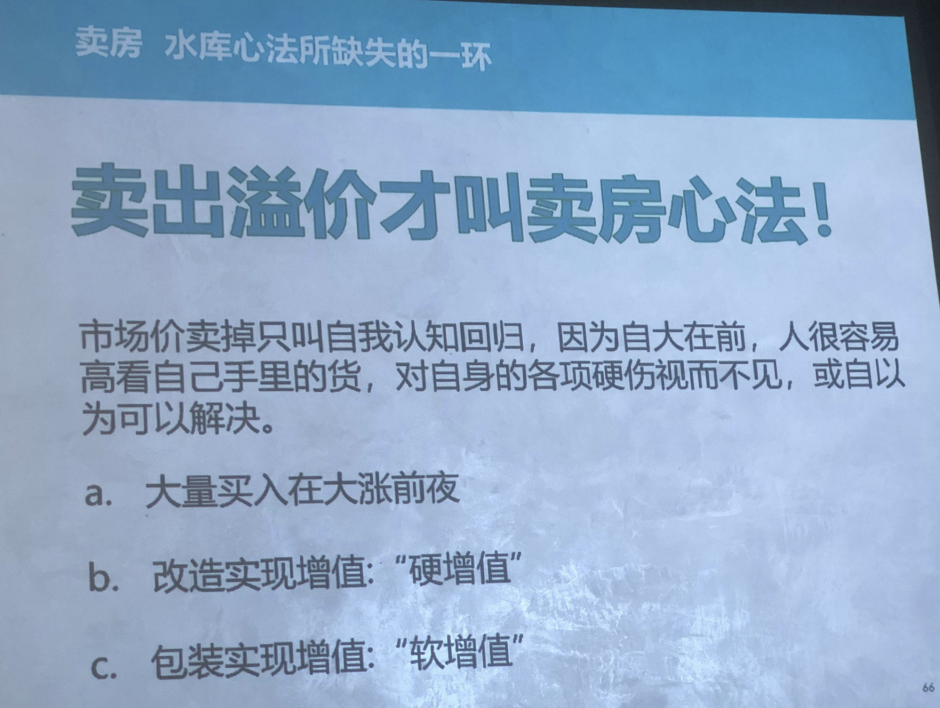
好，下面讲今天最后的一部分，卖方卖房这件事情很多人没有经验，我不知道这里卖过三套自己名下房子的，请举一下手。三套好厉害。
天花板来了去蹭。我卖过两位数的。对。确实比较多。因为我流派会卖房这件事情，卖房这件事情普通人很难经历，很多人一套自己的房子都没卖，一套都没有卖。我每次微博上面买房经常给别人骂成狗屎，大家都可以去刷那些评论是吧?其实我从来不跟他们解释的。我去年年末挂出来的一套房子，所有人都在骂我，这么小破房子只能卖 5万 6万，他竟然要卖 9 万这个王八蛋，然后就所有的评论全是骂我。
我没有跟任何人去解释，因为我心里面想为什么我要卖的高，因为万一碰到一个人，他能接受我就卖给你，要看不到，我正好看上今年 1月份的大涨，我已经算好了，12 月底1月份要大涨，这些事情没有发生，我们已经心里知道，对吧? 所以我不可能降价的对吧?我们就很严格的说卖出议价才是今天讲的重点
你卖不出溢价，你只是市场价把它卖掉，你有什么可吹的谁都能卖掉。你要是通过降价来卖房，你就是谁都可以做，今天这个课你也不用报报名，我钱退给他。谁做不到，谁都做得到，我们要卖出溢价才是成功。什么叫卖出溢价? 别人卖5万，你要卖出7万，这才叫成功。别人卖7万你卖掉 10 万，这才叫成功对吧? 市场价卖掉只能叫自我认知回归，因为人卖房子经常会很自大，结果卖不掉你的心气就跌下来了，有一些儿童心理，一些儿童的小孩子的心理，刚开始卖的时候，他的心气比任何人都高，绝对要能够把别人全吞掉，卖着没人看了，他的心又跌到了谷底，又觉得我这套房子烂透的，我当初怎么会瞎了眼睛把她买进，你就是来回摇晃，你的世界观就从一个天堂掉到了地狱，这个都是不可取。
我们卖房就是要很理性，很冷静，对吧? 
自大在前人很容易高，看自己手里的货对自身的各项硬伤视而不见或自以为可以解决。

然后我们的步骤就是大量买入，在大小前夜，我早上就讲讲过了
改造实现增值，这个叫硬增值，
包装实现增值叫软增值。
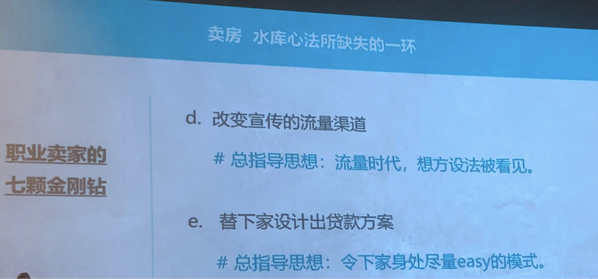
然后宣传是年头太重要的一样东西，这年头真的我觉得有一个溢价是历史上在流量时代没有来以前，大家没有意识到有一种溢价叫 IP 溢价，以前没有 IP 以上，现在大家只是听到一个商品房的名字，大家好像心里面钱就给他加上去了。
你听到翠湖天地华府天地你心里面价格就给他加上去了，但实际上你要他徒手画出一张华府天地的房型图，他可能根本画不出来，他脑子一点印象都没有。就是房子本身是没有名字的，像我们人一样，本身是没有名字的，我们是赤裸裸的来赤裸裸的去，这些都是后面加上去的东西。
总指导思想在流量时代的就想方设法被看见，被骂也是一种被看见。我不怕别人骂我，我只怕你骂我的时候不转发。
如果一个非常讨厌我的大逼，转发并且骂我，我还会给他买热搜，我经常做这样的事情.最后人家更恨我，我只要被看见就好
替下家设计出贷款方案，这条很重要。
这条就讲到为什么你需要一个自己人的贷款中介，有时候你卖房的时候，最牛逼的就是看到一些下家，他愿意支付溢价，他愿意支付溢价，但是他付不出，你们能看到这种人看得到，我前两天碰到一对小夫妻，要买我一套 27 个平方的小房子，这个女的是海外回来，自己家是住在深圳，她落户要上海要 6 个月。
他大概 1月份回来，他要7 月份才拿到上海的户口，他可以落户，因为他的学历蛮高的。
然后他有个老公是台湾人，台湾人长得又矮又丑，那个女的长得很漂亮，所以那个女的跟他说我们假离婚，我就可以买了那个男的死也不要离婚，因为他怕一旦离婚再也娶不回来。因为他觉得这个女的比他漂亮，我绝对不能跟他离。那个男的就痛点就在这里，然后他就背后跟我老婆说，我在一分钱不还价，只要你教我一种方法，让我不离婚，把这个房子给买了。
我老婆就回来跟我说，因为带看房是我老婆带他去看，然后我就跟他们见面，见面以后我跟他讲就是说还有一种方法，我先卖给你，你钱全款付给我。7 月份等他落户了，我再跟他过户，但是你要耽误我一张房票整整半年，大家能理解了，耽误这张房票半年不能买房子，7 月份才能过。所以我还要多加 20 万。
然后他们有一点崩溃，最后加的时候他有没有出，大概就是这样一个故故事，但是就是说我要替他想想出方案来，想出方案来他就愿意支付一下，但事实上已经比市场价高很多。
就算我后来这 20 万没有加上去，也比市场价高很多，但我是因为觉得在大涨前前夜，我不急着跟你成交，你的条件不是很好，要拖我整整半年。
虽然你钱付掉了，我一张房票会给耽搁掉，我这个也现在搞一张发票多难，你们知道对吧? 所以一定要有方案，有时候帮下家想好你是找哪家银行贷款，找谁怎么样做，每个月的月供帮你算清楚，你没有贷款中介，我介绍能够信得过的人给你，就帮他设计到这种就是说跪式服务。
因为你的对手可能做不到这一点，你就超过他了，你就能卖出溢价，
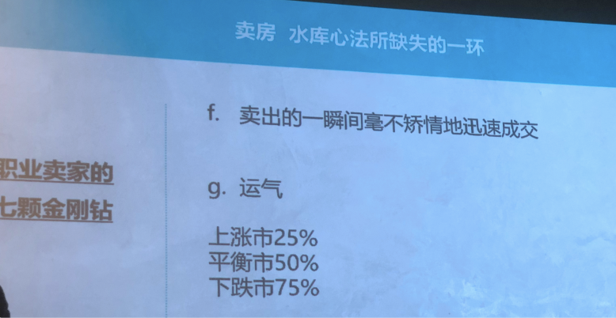
卖出的一瞬间要毫不矫情的迅速成交，这句话我要里面讲一个哲学道理在里面。我们人性就是最早买自己的第一套第二套房子，你都会觉得像买一个自己的爱人，我太喜欢他了，或者像子女一样，我太喜欢他了。但我告诉大家我的心态是什么? 到我现在这个阶段，我现在每套房子装修的时候，我心里面就想着是别人的老婆，从进去装修的第一天，我就想这是别人的老婆，我把他打扮好，不是跟我过的，是跟别人过的。所以这个心态有了以后，你卖掉的那一刻就不会有那种依依不舍的，很矫情的这种心态很重要，

然后最后讲一个运气，运气在上涨是像现在是上涨时只占 25%，平衡是占 50%，下跌是要占 75%甚至更多。就是不可否认卖房子卖出溢价跟运气是有关的，是因为运气的有时候机会成本，你明明知道这个人还的价格也没有那么好，但是下一个在哪里你等得起吗?有时候你倒是等一等那个人来了，有时候你等一等那个人不来，所以这里面有很多运气的成分。所以这个东西尽人事听天命，这就是这个道理。
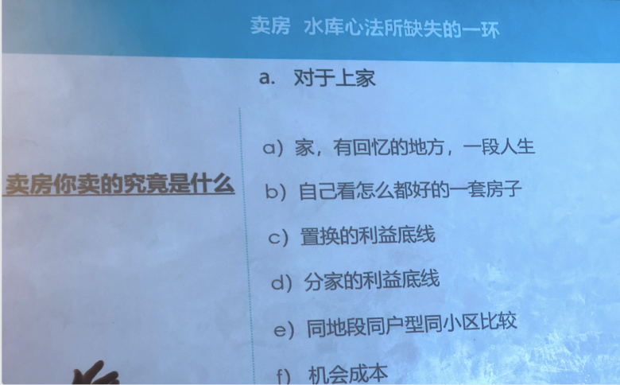
对于上家他总觉得卖的人，他觉得这是什么? 有回忆的地方，一段人生自己看怎么都好的房子，其实我们就感这个是很感性的，到后面就越来越理性，但所谓的谈判就是到最后大家把条件就会把感性的东西全部删光了，谈判到最后大家都会到最后只剩下成本都变成很直接的利益，到最后全部剥干净以后，所以最后才会成就，所以这个是要深化。
所以不是什么中介都能帮助你成交的，有些小屁孩他只能代看，带看的时候像一个孙子一样站在边上，你说好他也说好，你说不好他就不说话了，他没本事深入的，为什么买房子卖房子经常要找御用中介，要找老中介要有本事细化深化，把双方的利益摊在桌面上，最后就是一丁点一粒花生米放在你的碗里，还是放在他碗里都要谈清楚，有这个本事的人才会带你走到最后。
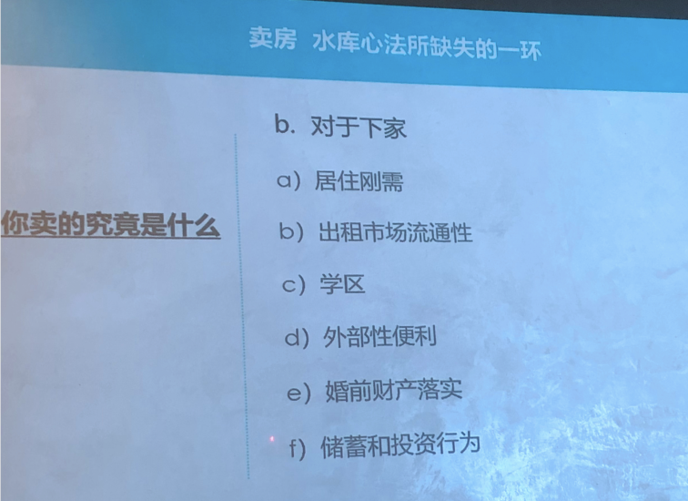
对于下家一样居住的刚需出租市场流通性学区外部性变的婚前财产的落实，你有时候要帮他算算清楚，你这套房子不买，你明年 8 月能结婚吗? 你来得及结吗? 结了以后在这边婚后财产，你现在要快点把它落实，你要把它这种利益全部理清楚，有些小孩他自己不清楚，你就要他把脑子给洗清楚。
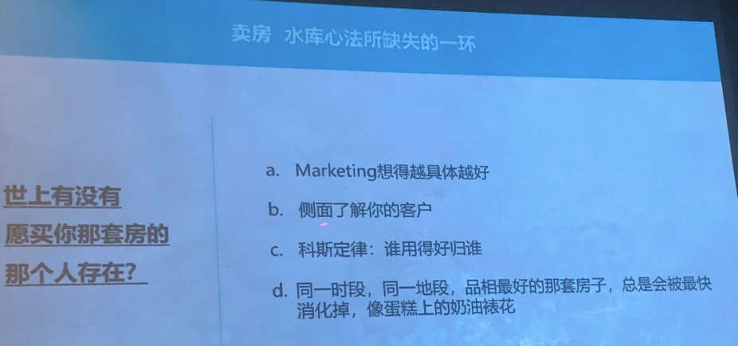

世上有没有愿买你那套房的那个人存在，marketing 就说想的越具体越好，我这套就是卖给老年人，我就做成无障碍了。
这套就是卖给年年轻人的感觉就像婚房一样，连小孩的房间保姆带小孩过夜的房间都准备好，
侧面了解你的客户科斯定律谁用的好归谁。我越对你的鼓手他买了一幅地，他就买一副地，他地下室放了 7套，他用比谁用都好，吵得要命，只有他有
同一时段同一地的品相最好的那套房子总是会最快消化的，像蛋糕上的奶油表，因为韭菜和普通人和老把式他是有一个比例的。
同时出来看房的人当中有一个比例的，总会有韭菜，而且非菜越便宜的房子当中出现韭菜的比例就会越高，因为他是韭韭菜，所以他就只能买 200 万的房子。你买2000 万的房子来的都是老油子，就算那个人自己不懂，他身边的人也会懂，他也会带着懂的人来，对不对? 你卖 2000 万的房子，你碰到韭菜的几率就会小。要么是哪个大老板的小三，他根本不懂钱来的太容易。
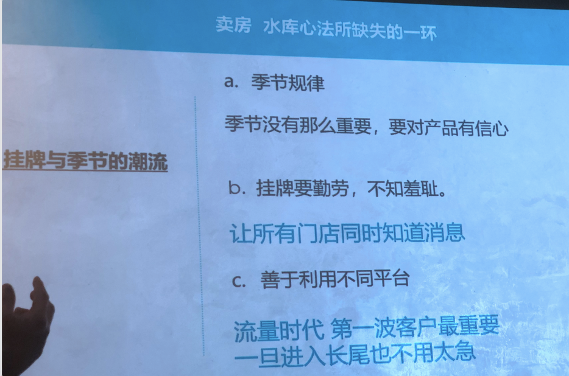
季节规律，我们发现这次上海的上涨行情当中，就是把季节规律给打破了。以前冬天都是逃房的好的时候对吧? 外面下着鹅毛大雪，这个时候买房子还在卖的，房东都是真心要卖，差这点钱了，差这点钱就能安心过年了。今年没有，今年整个 12月就长，所以心灌意情把一切都打乱了。然后我是觉得现在季节越来越没有那么重要，因为这些洞知道的人越多，就反过来做的人就越多，所以最后这个洞就塌了。所以关键还是产品的质量。
挂牌是要勤劳，不知羞耻，你不要心里面想 A8，我是个 a9，自己有多牛逼，不去挂牌，就有些事情还是要骑着小毛驴去做，该做就做。挂牌了就跑到人家店里面，我是怎么的，一般就是加一个人的微信，我准备好的材料，一套图片和一套介绍文案直接就转发给他，也不要写了，节约时间加一个微信一下子就转发给他了。然后要再三嘱咐你要挂到你们公司的内网，让所有人都看到，这就是当个活。那天你就当自己雇佣自己干干一天活，让所有中介同时知道

善于利用不同的平台流量时代，第一波客户最重要，以前不是的，以前卖房有一个预热期，对吧? 以前卖房这个消息要一点点传出去，让所有人知道他有一个时间的，所以以前的老中介会告诉你，如果你半个月就卖掉了，你肯定是卖便宜的。
你们都听到过这句话，现在不是这样，流量时代，因为这个消息传的太快，一眨眼所有人都知道，所以第一波客户可能里面就是有一个冲头来了，前面讲运气最韭菜，韭性大发最厉害的那个人可能就第一波了，你抓住他就抓住他，你抓不住他，你就进入长尾，马上就进入长尾，一两个月就进入长尾。
当然进入长尾你也不要慌，不像微博上那些人他卖不掉的，马丁要断供了，马丁要破开了，我是房子，我卖的是房子，我又不是卖一碗大牌面，一晚上卖不掉，第二天就收掉了，房子也不会收掉了，他也不会塌掉了，我们两年都可以，我们 20年都可以。有什么不可以的?
所以出不掉进入长尾我也不急着，但是第一波客户第一波流量来的，甚至一开始像做状况一样，10 组人同时看你的房子，这个时候你要知道咱还应该吃饱的，希望的这个时候是一个抬价的好时候，你有时候抓住就抓住你心也不要太黑，这当中有一个人出的价格还可以你就走，
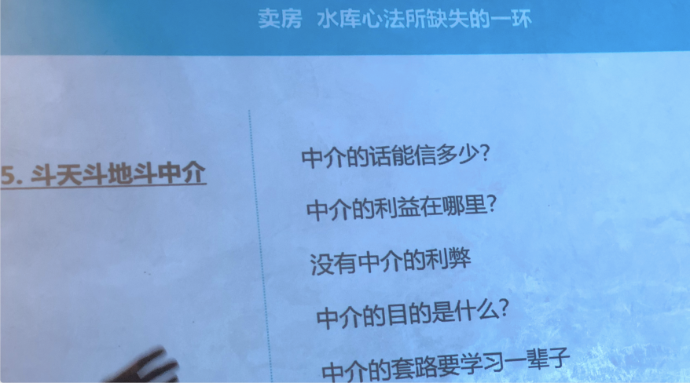
大家我相信都比我有经验，每个人跟中介打交道的故事都可以，讲一天一夜对吧?
中介的话能吸引多少，就是你随时一定要想清楚中介的目的是什么，它的利益点在哪里，他的利益点就是成交，他才不管你多少钱成交，他根本不在乎中介费高一点低一点，他怕的是这单给别人做的。
中介的目的是什么?其实我就说中介的目的就是要想方设法打听你是直接打听不到的消息。
他其实就是个探子，他就是个探子。来买的那家，人家最好把他祖宗十八代都查清楚，我告诉大家这方面是天才，他可能连你们每个人的职业都查过，都会做 Excel表格给我，他这方面是天才中的天才。
我这个很厉害，就有一些好的中介，他就能迅速这两个人是什么状态，年纪轻的人，有时候会把一五一十全托盘讲给你听，那就是他还不够老手，导致的他就一五一十全给你讲讲给你听，然后把他的弱点也讲给你听，软肋也讲给你听，你都可以利用。
然后你卖房子的时候接中介的电话一定不要太客气，什么时候可以客气，你把房子出租的时候你可以客气，因为租的产品过掉一天就亏一天，一天没租掉就亏一天。
一个晚上没卖掉，这个产品不是馊掉，它连尸体都没有，面包发霉面收掉，还有一
一个尸体在那里，租房产品隔夜的连尸体都没有，所以你要求着中介，总结专门做租赁的中介，你要跟他们保持一个友好的关系，但是卖房子不是，卖房子的中介。王先生，咱这房现在还卖多少钱，咱那个屁呀，有你什么事? 你就直接就冲他，好不好?凶一点不要紧，
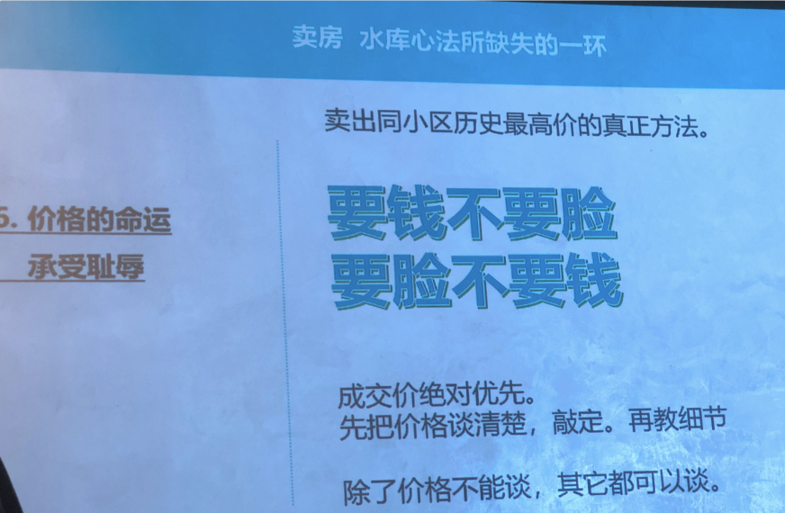
卖出同小区历史最高价的真正方法，对吧? 非常大的字非常不要脸，要钱不要点，要点不要钱。你要想清楚一点一开始我的做法是一般性，我的做法都是一开始就挂一个超级高的价格，你就要给别人骂好了，骂我也不会被你骂死。
我打个比方，一套市场价 250 万的房子，如何这个小区历史上刷出过的最高价就是250 万，你现在的目标是 300 万把它给卖掉，你怎么卖? 我讲平衡势，我们不讲大涨，你怎么卖掉 300 万? 
你一开始挂牌你就挂 350 万，你挂出去肯定给别人狂骂这傻逼疯子神经病。有的是人骂，你不要紧，你要喊马，卖不掉，350 万肯定是没人看。
然后过一个月你降到 330，别人继续卖，比方真的卖不掉了，果然卖不掉了，我说你卖不掉了，你降价了，然后你再讲你降到 320，我这个时候那帮人爽死了，王马丁就要断供了，王马丁要破开了又来了
然后最后你再讲降到三百十，然后下一次降不要降 10 万，你降 5 万，你买 305万，别人感觉他先降了 20 万，又降了 10 万，又降了 10 万，现在还降了 5万，马丁割到肉里了，王马的快死了，他真的不行了
觉得碰到 305 万的时候，我告诉你有人就来了，有人就来了，可能就还掉你 5 万块钱，你们当场就成交了 300 万，可能最后还会扯皮扯掉一块，最后成交价很有可能是一个很没有整数的，最后可能是一个 301 万成交或者 302 万，甚至甚至是最后他加盟你，让您付钱，还来说给老太婆一个面子，你们就是 3,015,000 块成交也有可能的，你又让了 5000 块钱给他，很有可能。
最后就是这样细化，到最后就是变成一粒花生米，就是一个小小面子，就成交了。你被骂了几个月，但你确实卖出了全小区历史上的最高价，我就是经常这么做的，我完全不要脸。你骂我好了，我只要力我要卖出全小区最高价，我就要这么做。成交价绝对有优先，对吧? 其他都是假的，成交价是有风险，这个公司抓住除了价格不能谈，其他都能谈。
价格是最重要的，有一些人的付款方式先谈，扯了很多没就说，有些人过来什么菜场幼儿园小学都问清楚，价格还没谈清楚，要这么客气干什么? 还有人卖房子发传单，我不建议这样做。卖房子的时候不要让别人感觉你很想卖房子，卖房子的时候要让别人感觉我不卖也是可以的，我不卖完全没问题的。
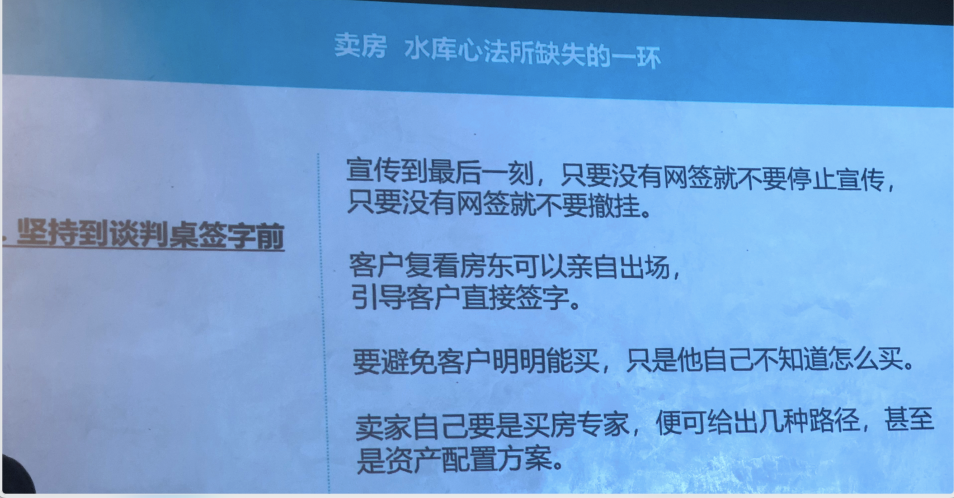
这个是坚持到谈判桌签之前，宣传到最后一刻，没有网签就永远不要停止宣传，因为所有你感觉这个人要付的，他临时可能会变化，你自己把它撤掉了你就傻逼了，前几个月全部来宣传。
一般我们第一次客户看房，我的做法呢是我自己不出场，找个中介代看中介要实在找不到我叫我老婆去代看。亲自引导客户直接签就是复看，如果他看第二次，第二次概率其实不是减掉 50%，看第二次已经说明这个人已经是心里面有一点动心了。
这是这是甲鱼已经爬到你家门口了，你把门缝再开大一点他就进来了，这种时候你可以自己出场，自己出场的就是我甚至以前我很告诉别人，所有的凤冰盘要在现场放一张桌子，最好是圆桌方桌也可以，就是几张椅子放，引导别人直接坐下来，引导别人坐下来，我们深入谈谈清楚，当场就签。
要避免客户明明能买，只是他自己不知道怎么买，这个就是说你要比他懂，你要比他懂，只要他肯付议价，什么服务我都愿意。
卖家自己要是买房子专家，给出几种路径，资产配置方案，
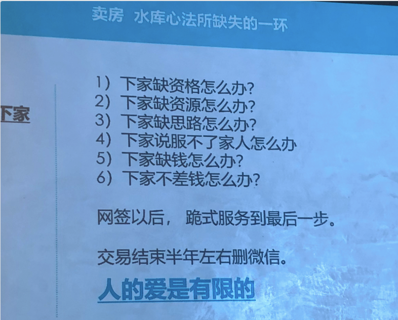
爱诗人爱下家，这也是跪诗服务这很清楚的。
下家缺资格我帮他动脑筋，缺资源，我给他提供人脉，缺思路，我帮他洗脑子，说服不了家人，我把一套话术教给他，
我读一段话给大家听一听。上次我跟大家讲，前面我讲到深圳女孩和台湾老公，他们给我 1月2 号他们给我发了一段话是这样，
马丁老师马丁嫂，经过这两天的考虑，我们还是很想买您的房子的，只是目前还有两个问题，一全款付清价格，您这边能不能再降低一点?这个单价一平方约高出同小区将近 2 万，父母们这方面不太接受。
二由于是先全款付清，半年后才能过户，不知道您这边是否愿意配合我们做一些相关公证的事务，需要具体做什么，我们还要请教一下律师。
这是他发给我的。然后我那天心血来潮我就回了他们一段话，我说许先生 And Sherry 两位新年好，首先纠正一个错误，你们APP 上看到的区域均价都是线上很久没有调整过的假招牌，中介希望用地用低价谁骗你们电话打过去再告诉你们现在不是这个价格。房东涨价了，不像这边，我是房东本人给是实价，
其实第二其实越小户型单价越高，然后总价依旧是区域上车价，其类似读书挂户口等社会属性是价值的内核，是不因面积小而贬值的。
第三，越小的房子装修费占总价比例越高二 27 平方和 47 平方，装修时卫生间也都是一个，厨房也都是一个，洗衣区也都是一个，我装修油漆窗户的置换下了血本你们知道的。
第四，我的选房能力是业界有口碑的，我在吹吹自己的老王卖瓜，你们自己去茫茫二手房市场，看毛坯房能不能选到朝向楼层、户型如此精巧合理的是打问号的，我等于节约了你们的参谋和顾问的成本。
第五，我们直接交易，省去了中介费，也避免了黑心中介介入或者诸多陷阱。
第六说到公正，我们愿意配合我是民生在外，我在民处坑骗你们有巨大砸招牌的风险，所以我没有任何理由这样做。
第七你们的条件我是认为相当不好，一张房票要占用到 7月，还是理想估计，有第二个房东能答应你们这样做吗? 你们能找到吗? 找到敢签字付款吗?
第八，除了离婚有第二种方法帮你们现在就买房吗? 外面的离婚中介你们敢信吗? 现在离婚冷静期刚刚实施，重点防范打击假结婚买房，这是 1月2 号说的话，新政还没出来，你们想试试看政府的决心吗?
现在判断春节后上海就有一波跳涨，毕竟上海4 年没有涨，我很乐意观望一下，坦白说你们上次谈成的条件我都不是很满意，所以还要进一步，我们可能就没有缘分，反正那么小的房子我多拿几个月又不烫手，互相理解，我就先写到这儿
这段话是谁给他看的吗，是写给他妈看。我如果打电话跟他讲这段话，我很难保证他有本事付出给他妈，但是我打字给他，其实我有模本，我有一系列回复的模本，我回复不同的人经常模本里面稍微改掉一点，就发过去了。这些话让他拿回去讲给他家的老年人听。
然后最后往前以后贵是服务到最后一股什么物业水电煤名字改掉，现在都好像不需要水电费可以自己改。
交易结束半年左右，删微信，只要这个人不可能成为以后再来买你的客户。
我有一个客户我留下来了，因为那边是义乌老板，他有很多姐妹还要买，所以我把他微信留下，其他的交易结束半年左右都删掉，因为时间一长，万一出什么事情对吧? 很搞的人的爱是有限的，我的精力也是有限的，我就不管他了。
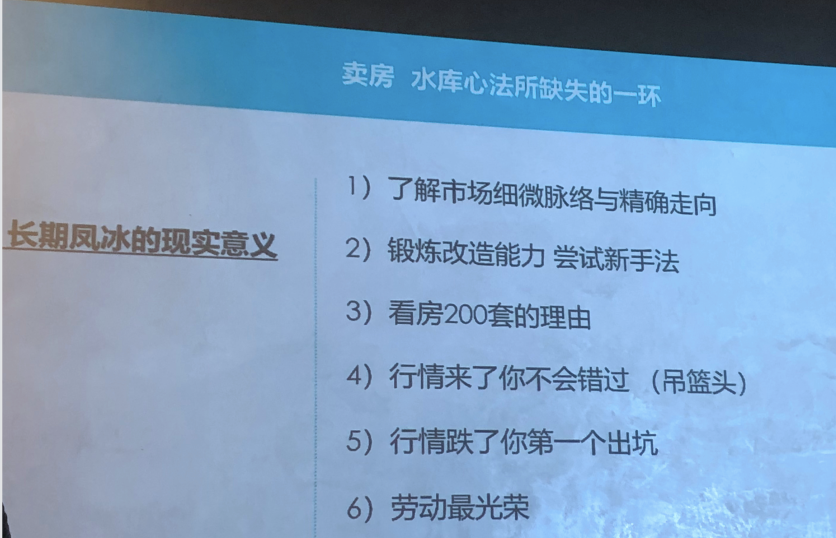
好，今天讲最后一条，长期凤兵的现实意义。我具体讲这里面内容之前，我先讲一件事情，我有一个好朋友，他大学是在天津读的，他在天津有一套房子，就上次全国大涨的时候，大概 16 17 年，一个月一个价格，他那套房子从 150 万开始涨，16年开始涨，150 万涨到 170 万，涨到 190 万，人家就是拿着定金去找他，他在上海他工作都在上海，出到两百十万他不卖，他又跳跳到 220，别人出到 220 找他，他又跳到 230，最后人家 230 人家加不动，就在这个时候，好像出政策，天津也出政策，出了政策以后房价一落千千千的，天津的房子不像上海的房子，上海跌是跌不会真跌的，天津的房子是真的跌的，他是怎么对你们去查一查应该知道这个事情直接又跌回到 150 万，他这个过程当中都等于坐了一次电梯，就像炒股票一样做了一次电梯，因为他生活在上海，天津离他太远，他根本管理不了。对那里市场一手的情况，他也没有那么仔细的了解，他也感受不到。然后他的房子本来可能还有租客也不处于很好的一个出售的状态，所以综合的原因加在一起，就导致他做了一次电梯。
我们长期凤冰就会有一个什么?叫滚石不生痰，因为一直在滚，你一直处于让你卖的货品处于上架的状态。On the market。我找不到男朋友，就让所有男人知道我现在再找男朋友。不要过了很多年才有人，只有你妈知道你没有男男朋友，不要这个情况，所有人都知道，你就长期处于一种卖的状态，我就是卖，我又不卖身又不丢人，对吧?
然后这样你了解市场细微的脉络和精确的手术，因为你有一套房子卖，你就有一个理由跟你同片区的房子，同片区的在做这些事情的中介，每过一段时间你们要交流一下，比如说你有一套翠湖天地的房子在卖，如果你没有这套房子在卖，翠湖天地附近的中介成本很高的，他们门店成本很高，这些人也很忙的要服务大客户的，谁有空每个月告诉你现在市场什么情况，谁吃饱了空告诉你，因为你有一套在卖，你就有一个理由跟他们保持这种态势，你就了解了这个片区发生了细微的变化，你长期就知道，所以你的反应就比别人快。
你一直有一套房子卖，市场到底有没有长，有没有快长? 你都别比别人知道的早，无所谓的，我的大仓位可能是不动，但是我的小仓位我一直在动，所以我保持跟这个市场同节奏，我就很敏感，有一套房子在卖，我觉得很敏感对吧? 
然后第二你锻炼了改造能力，尝试新手法主要是还可以做实验，你可以做很多的实验对吧? 我试试看这样做怎么样?电器配齐是怎么样，不配齐又怎么样? 这个房子改成两房怎么样? 我就宽敞一点，又怎么样都可以做实验。
第三最重要的是看房 200 套的理由，很多人只知道看到 200 套，但怎么看 200 套?谁给你看 200 万，一年到时候给你看 200 套房，谁给你看? 我一年看 400 套房，400 套房有时候可能还不止，是因为我一直有一个我要再买一套的这种幌子一直在那里摇，所以很多中介有的损害，他就直接最早他就打电话给我。王先生我们早上刚出来一套，你要不现在来看，我怕很快会成交，我说你等我马上过来。
曾经有过一次我错过一套，我又要讲了，全上海最小总价的房子在闸北区芷江中路
7 楼的朝北的 17.5 个平方毒不毒? 太毒了。这房子听上去简直是灾难，但是他卖多少钱? 他们120 万。我说我吃个饭我就来看，等我吃好饭去已经卖掉了。因为总价太低了，无数人打破头想，他不需要自己住，他可能就挂个户口，甚至于有一些人他出国去了，他国内上海户口不想放弃，他就买个小房子，他就挂个户口，而且我本来想尝试 7楼朝北的房子，顶楼开个天窗，太阳就引进了，我想试试看这么做。好，就因为我吃了一个饭就套房子就没有了，所以你一直凤冰，你就有理由看房 200 条。当然我还有很多的御用中介，他们要看一手房，要找一个看上去像买家的人就伪装成了穿的像衣冠禽兽一样可以去看房对吧? 他找一个理由带你去看房，其实是他要看，我也要看的对吧? 增加一点见识对吧? 行情来了你不会错过。这就是为什么我卖着某一套房子我不卖了，因为我感觉到行情来了，我不卖了我锁了，我马上就是我不卖了，你出到我的价格我也不卖了。
你出到我就跳，出到我再跳，因为行情来了，我急着卖干嘛，我为什么要急着卖? 我丙一丙好了，什么东西丙一个月能变出 10 万块钱? 对吧? 我就比一比，然后行情跌的这点很重要，就讲到天津的我朋友这个案子，行情跌了，你第一个出坑了，因为你一直处于卖的状态，你一直处于卖的状态，谁把定金付掉，直接就是几天内就可以跟你过了户干干净净。
所以你处于所以我一直讲，如果如果发生了战争，凤冰流的人一定逃得最快，一座城市要被毁灭了，凤冰流的人肯定跑得最快，擦擦就卖掉了。你要手里拿着套地下室老破大，你可能就跑不掉。对吧? 
还有最后劳动最光荣，我经常跟工人打交道，咱们工人有力量对吧? 我劳动最光荣，我天天在劳动，我长期跟很多工人保持很好的关系，我要做一些什么事情，我一个电话很多工人愿意帮我做，很苦很累的事情也有人愿意帮我做。
人在上海，最怕的就是你有钱，但是你调动不出人力资源
你在关键的时刻，我甚至有过一次我告诉大家，我踢球踢断两根韧带，我从医院里回来，我那时候住的一个房子是老公寓的，4 楼没有电梯，有一个工人就直接到我家来把我背上去，这种是因为我平时待我带他们一直很好，关键时刻有人帮你，你长期有一群工人帮你干活，劳动最光荣就是关键时候你就调动的出人，对吧? 这些都是凤冰的好的理由。好了，今天就讲到这里好吧? 这是我的知识星球，如果有人需要的话可以加入。好吧? 讲到这里。

