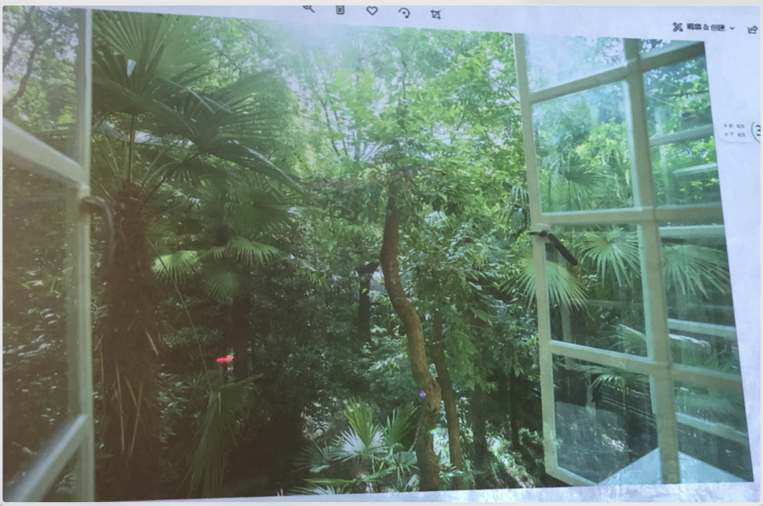
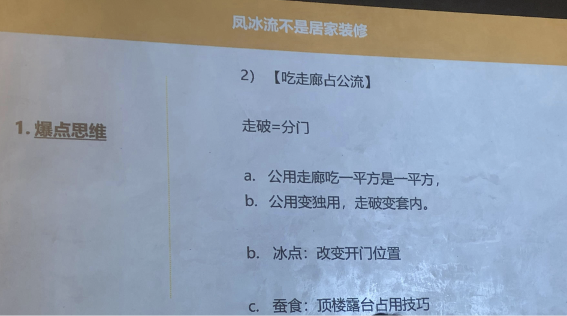

好，这个我觉得这是我今天讲的重点。
不外传的三条秘籍：
开窗流，这件事情的开窗流的是我赚钱的核心。大家知道我第一个我要看中原料，要有邻外墙，原料有邻外墙，然后要开窗，开窗就是为了多一些房间，想方设法变出房间。
开窗这件事情，老房子相对新房子而言，容易操作，很多新房子，一手房是新房，次新房，外立面怎么改?不可能改对吧? 没有办法改。
建筑的背面与侧面相对主立面而言容易操作，主立面，因为马路上所有人都看得见，全小区都看得见，也很难弄。有些地方就是小区的角落一个角落里那也没人管，小区的镜头死角相对起来会很好。
好，我们来看几张图

这套房子看这张图，它是一个大一室，这个房间整个跑进去就一间房子，这间房间当然比较大，开间大概是这个样子。你感觉这里应该有一堵墙，但是没有一堵墙就是空调的位置。就是因为他大一室的原因，很多人不敢买，之前很多人看不懂，人家大概是 2014 年的年底，想我为什么要花 500 万买一个厅，但是地段比较好 
然后我进去第一个就测的开间有 6 米 36，我心里面一算的花头巾又来了，既然开间是 6 米 36，我就可以把它改成双开间了，我就有空间可以弄。
看一下它的反面的，但是反面是这样，反面就是几个图，这个是进来的门，进厅的门，然后它有一面墙，上面侧面就是东面，东面有两扇小窗，这小窗外面是 9 万平方的复兴公园，我那时候看这个房子之后，我老婆看了很喜欢，我回来问他你有什么? 你的感觉是什么? 我老婆给了我 4 个字，心旷神怡。我就懂了
所以这块快点买下来，买下来以后我就觉得景观太浪费，9 万平方的复兴公园就在隔壁，这个是随便怎么样，也不能浪费掉了。

所以最后这个是我手绘的，我手绘的画皮图最后就是这种样子。就这样改成一个两房。
刚才看到了两扇小窗，一个是在这，一个是在这里拉了一堵墙，这里拉了一堵墙，这里是一个主卧，这里是一个次卧，次卧带着阳台上的这个就变成一个套间书房。
这里是个厅，这里是两个卫生间，改成两个来，这里厨房后面是北阳台，北阳台本来这阳台只有一半，我自己搭出来一个，我才变成了一整个然后这个时候这间房间我觉得整个这边是复兴公园的， 我要把它偷出来，所以我就动坏脑筋要在这里开一扇窗。

下面就要向大家演示一下，展示一下整个的脏活是怎么干的。起先是这样的，大家都看到了，外面你看景景色非常好，对吧? 

然后这一一溜进来是一个很长的卫生间，有很长的走廊，有点浪费的这条走廊，我们前面早上教过，交通面积是贱面积，我们要把贱面积变成贵面积，那就要把房间变大，走廊面积要变小。

好，这根是根脚铁，先打在里面上一根角铁，缝起来安全是很重要，对吧? 物理上不能有问题，其实我做了两根脚底，还有一个要等挖出来以后从外面再上，然后要有光就有光，对吧? 以前打造这么大的，我叫他不要打，因为外面没有遮起来，没遮起来我怕别人看到。

第三天我拉了一张布在外面掩人耳目

然后就是我外面也上了一根梁，这个是外面的梁，里面上一根，外面上一根，而且上第二根梁的时候，瓦工还在嘴巴里，用他们那种农村的话，什么天灵似的这种嘴巴里还在念，把我笑死，我从来就没有听到过这种。他们上梁的时候有一段话要念，笑死我了。

大家看是做好的样子。然后外面的酒景观偷偷瞄一眼，好了对吧。

从外面看是这个样子来看的，整个过程像做贼一样，但是我告诉大家这个时候是什么季节，前不久的时候差不多春节里面城管都放假了，我就是要抓住这个时间空隙，城管都放下，我要他们以后来看是一个现成的结果，而不是这个过程肯定会被叫停。

还是要然后大家看到一开始这个房间这里有一扇窗，这个是老窗，这个门有一点歪掉了，歪歪扭扭他不正，就扔掉了。我就把这扇窗，因为它使用了 80 年里面都几乎没有用过，像新的一样，我就把窗挖下来，一模一样，搬到老的洞上去，拿老窗补老房子的窗，这样别人说起来我可以说他本来就在上边。

好，下面一张图。很好了，大家看到了，把它粉全部粉平，以后一个完整的样子已经出来了

好，下面见证奇迹。就完成了。对吧? 这景观可以了，对不对?
这个动作值不值10 万块，对吧? 可能 10 万都不止。你看窗上面还有三块老的法租界的玻璃。

他最早一九三几年这房子造好的时候用的这种原始的玻璃
从外面看上去，当然我外墙涂掉也是事先准备好，弄完以后外面马上就刷好，怎么都看不出来

好，然后又做了一个窗帘盒，做一个窗帘盒。窗帘强，前两天都上去了，这就是完成以后的这就可以 airbnb 可以卖了。对吧? 
大家看地面，就看到我卫生间。

然后我削掉一块，削掉一块到房间里了，我觉得也挺好玩的，是他原来房间的痕迹，我就不把他打掉了，就这样保留在这里。

阳光好的时候就是这个样子。这里虽然是朝东，下雨也没有风和雨进来，因为这么多绿化等雨飘到这里已经没有了。

然后我们再来一套，这套房子改造前先看一看改造前的样子，这个也不要拍了，这个没什么好拍的

就那种很多年没人住过的这种老公房，好，这套房我给大家先看一下这个样本，给大家看一张图

看一下图，它原始的样子是这个样子。
我解释一下房东的身份，他们是对老夫妻，男的是 83 岁，女的是 79。它其实就是符合前面7d理论里面的一,不再需要这套房子，他们不是丁克，他们有一个女儿女儿嫁去加拿大，然后老夫妻两个人在上海有几套房子，7套，卖掉两套根本无所谓的。就养老用。
根本他不差房子的，他女儿都不需要，他们自己商品房也买好了。
当年老夫妻里面女的，他是虹口区教育局的，教育局先分配了，因为这个小区的全部是教育系统，先分配了这套叫 403 给他，本来这里是个厨房，大家看到这里有根管子看到了，这间本来是厨房是 403 门进来，能在这里 403 的门在这里就进来，403 的卫生间，卫生间在这。北房间南房间。

后来他做到了虹口区教育局的局长，他们觉得他身份上去，国家把 402 也分配给他，增配给他以后，他自己做了一个小违建的动作，就是这里开了扇门，其实是不允许的。因为那个是承重墙，让他开了。
等于 402、403 都是他的
这个时候他们有一个操作，非常少非常骚的一个操作。
你们见过以前的产生是用手写的，增配给他以后，他就把新的那套房子的信息写在了他本来那本产证的后面，就同一本来那红本本就最早的深红色的本，本不是我们现在新的这种也不是绿本，用手写面积也是手写的，一直也是手写的，什么信息都是手写的，然后同样用是黑钢笔，在下面 403 下面写了 402 什么写上去，所以他最后手里还是一本本子，说老头 83 岁他搞不清楚，他以为这是一套房子，他以为他们最后把这两套房子做成一本产证，这是一套房子。
然后我马上就通过我的中介，就是迅速到虹口区的房地产中心，找到专门的人问清楚这是不是两个编号，告诉我是两个编号，我机会来了，因为我经常做这种事，两套房子一起买，我只要拿得出两张房房票，因为我是全款，凤冰流，我是全款。
好我知道了，然后他的他的错误就是说他把小的这套和大的这套卖一个价格，大的是51 个平方，小的是多少? 28 个平方。
他卖一个价格，其实越小的房子，大家知道价格单价应该是越高，因为他挂户口的能力，读书的功能，这些东西配套都是全的，所以他这套肯定是贱卖。好，我就迅速搞定两张房票全买下来，然后我们就开始设计，

403

这个房子它巧妙的地方大家看到。这两套房子的优点是什么? 南开间虽然都只有一开间，403 是一开间，402 也是一开间，但他们的北开间都大于一开间。这套你去看它北开间有 5 米6。对，还是非常大。这套是对着这个是楼梯了，走走上来虽然是通道的，但是也是多处在这样的一个位置。
就比那种老公方你们看到的就是一整个长方形的，你们看到过吧，整个长方形的就不灵了，一定要斜出去一个卫生间，因为就不占走廊面积。好，花头就从这里来，巧妙的地方就从这里来。然后户型图就是他们建筑公司帮我做的，我们能帮我做的，50 平方的房子我改成了三房，三室一厅，51 平方的 3室1厅，我在这里多开了一扇窗，在这里也多开了一扇窗，北面既然是开间有 5米6，对不起我就动坏脑筋了，就改成了两个单人卧室。
南面这堵墙往这里移，往往南面移，卧室小一点，洗衣机放在这里，厅就很明亮,这就造成了一个结果。
整套房子你们看一下，其实进来的门应该在这里，浪费在交通面积上，平方只有两个平方，一个平方在这里，这是交通面积，还有一个平方在这里，只有这两个平方是用在交通面积上，其他所有的全都变成了有效的贵面积，贱面积变贵面积。卫生间也不是，它有个这样的窗对着通风走廊，窗原来就有。
402

然后402 改成了1室 1厅，我们用透明的窗往这边推，把外面变成了一个开放式厨房加一个餐厅，这里是卫生间，然后这里面就是一室户，不能再改，因为没有窗的，因为他没有邻外墙，这边也没有邻外墙，这边也没有邻外墙，只能改成这种。

然后大家看一下实际的，我们先讲窗怎么开，窗开在这堵墙上，这堵墙已经打掉了。这是原来有一扇窗，边边窗有一扇，大家看到边窗打完以后，边窗只有这一扇，我要在这里加一下，在这个过来再加一下。这是原来的样子。然后边上是一个学校，我趁学校放假的时候干的，他们放寒假也是在春节里面，城管又休息回老家的时候，我又下手了。
好，这是一个切割机师傅叫梅师傅。切割机切完也要上梁的，是吧?

做完以后是这样，看出去还是有一点小景观对吧? 起码能看到一点绿色。最后一个厅是这样的，完成以后厅就是这样。这种装修不算很过分的装修，这种装修还是很怎么讲?属于擦把脸。弄干净。墙上贴的瓷砖也不是很贵，地上的地砖也不是很贵，用的东西都不是很值钱的。
热水器也没有装，但是我这个门给它装了。大家看空调洞打好了，空调我们没做，空调你自个做，就多一扇边边窗，这间房间是朝北的? 我多了这一扇小窗以后太阳就进了，你看我拍照永远是在有太阳的时候，没有太阳我就叫摄影师休息。就是这样，然后在大家再看几张全部完成的照照片。改造前改造后
先看402，

用的灯也是很便宜的灯，淘宝货，反正你不喜欢自己换，看到这里我用的那种透明的，看到重点是在这里，这样。
这个厅平时也就不暗了，因为这种房子小房子平时大多数时候是一个人住，一个人住或者一对情侣住，也无所谓了，是不是? 不像跟父母住在一起，你觉得私密性很重要，放冰箱的位置我也留给他，但是我没有买，但是我最后告诉他你要买一个左开门，但是他还是买反了，我反正卖给他我就收到
这个水槽特别小，只是好看，洗个铁锅都洗不了，我就不管了。那就有一个对着走廊的床，下面我用的是磨砂玻璃，因为这样别人就看不见你。透光是会有点影响。现在我知道最透光的看不见的，玻璃应该是钻石玻璃，还有长虹玻璃，这两种玻璃透光更好一点，别人也看不到你。
大家看那边就是一个小卫生间，好，大家就发现这条交通要道走走进来，右边是厨房，左边是卫生间，很舒服对吧? 安排很合理。就是这样。卫生间再多看一下。大家看到马桶就是挖进去，是吧? 这是我贴的马赛克，我卖给他以后，他反正产证拿到以后，他几天之内他就租掉了，就把月供给抵上，等于这套房子他拿在手，小男孩拿在手里，虽然他买的是贵了一点，因为我 10 万块单价卖给他，大概是 2017 年，2017 年我是 20 也不是 17年的，2017 年我是 2 月份入手的，这套我装修完卖给他大概是 4 月底，我买进的单价是 43,000，卖给他是 10 万，因为户型小，那就一定要赚这个钱

然后 403。403，那弄完是这个样子，随便看看。多几个角度? 看一下，对吧? 这里就有一个。卫生间是暗的，我这里用了点玻璃砖，可以从那边借点光过来，是吧?然后门进来是这样，这里是一个卫生间。这个就是原来他自己自己挖的去 402 的门，我也不把它填实了，我做成了一个电视柜，这样就充分利用。

然后再看一套，这就是前面 72 个吊柜的，这里本来有一扇小小的窗，大家看到我上面是根梁，我就对对不起了，你上面是跟梁，也不是主立面，是对着院子里面,我就把它尽量的扩大，对吧?
大家看我留了一层墙皮在那，我要在窗子做好，拿过来我才一下子打开，是吧? 留了一层墙皮，里面已经挖空了，砖头都完了，新的窗上去，是不是比本来一点点只有一半的窗户感觉要好得多? 朝西的，太阳进来，最后完成以后是这样子，完成以后的样子。这是他卫生间的一扇小的窗，原来是这样的，因为它是混凝土，就上下都打。你看上面这个样子换一个窗进去，完成以后的样子，可以卖了。

好，这是另外一套。这套是弘一小区，这是去年我做的一个凤冰，最早窗是这样的，他在顶楼顶楼的阳台，他自己有一个泡沫的顶棚，我当然是把它干掉对吧?
你看看原来是这个样子的，大家看一下，然后做完以后是这样，

这个是加上电动窗帘，我们做的过程呢就是对吧?

然后最后加上电动窗帘，你随意可以开关的，越小的房子越要安排点这种雕虫小技，为了留住别人，多看一会儿，弄一点可以表演的东西。这些花不了几个钱。
然后我这两天在这个小区里面，这套房子因为我已经卖掉了，大家看这个是原来的户型，它是怎么样的? 我就是看中他有一个边窗，原来的户型这里是一大间房间，这里是一个厨房 ，卫生间是到这里。
卫生间是暗的，我现在把卫生间往这里弄小了，还在走廊上面开了个窗，现在就是 2房1厅，往这里移了以后床是这么摆，门是从这里进，看一下完成以后的图。这个是卫生间的窗看一下。这个地方挖了一个窗，看一下完成后的图。这个是小卧室，其实他床头的这个地方里面是根煤气管，这个里面包的是根煤气管，这跟煤气管本来厨房把我从窗帘箱里面走走，移到别的地方去，但我都包起来了，所以安全是没问题。
这里其实是一个粪管，本来卫生间的粪管，做的一个书厨，也把它包在里面，这个是卫生间从里面往外面看，这个就是为了透一点光，光白天可以透一点光进去
所以卫生间你看光也有，通风也有，这个是客厅当中最薄的隔墙，用老钢窗做的长虹玻璃，就是这样。
大家看这种图，只要看到太阳能晒到这么深的，你们如果效果图上看到这么深的，这房间一定是朝西或者朝东的，介于早上摄影师不可能 7点多就来拍照片，说一定是朝西，因为朝南的阳光是不可能晒到这么深，这也是一个小 tips。
你大家看一下这里面的技巧是什么? 马桶的水箱是嵌在墙里，因为这堵墙是外面是走廊，不是邻居家，我就可以挖的对吧? 不是别人家，水箱也是埋在墙里，上面还埋了个壁龛，里面那个淋浴，大家看龙头的这些预埋件都是埋在里面，这个龙头也是埋在墙里。这些动作只有隔壁没有邻居家才可以做，隔壁是邻居家，你一个都做不了对吧?别人肯定要跟你闹，你看这样舒服了，虽然是 6 楼老公房 6 楼楼梯要走上去，但是看到景观你就觉得值了，这就是贵面积，我早上讲的贵面积，心情非常好，我吧台也给他做好，我这两天在这个小区里面一模一样的户型又买了一套，因为户型全上海的老公房一共就那两栋，别的地方找找不到了，所以我就重点开发了，出来一套我就拿一套，这个太容易改，因为大窗户不用我动，因为改窗户还是有违建的成本，

好，我们继续往往下面走。违建的风险永远存在，机会成本大于惩罚，成本就值得一试。
大不了最后我恢复好了。对不对?大不了最后我恢复。有此事情你就死皮赖脸你就做。有时候
一个小小姑娘看上一个穷属丝，觉得你不能跟他走，但是你真的爱死他了怎么办?先斩后奏。先这样，多军就要有精神了，事后再补，什么事情坏事情先做在前面，

然后给大家看一张我家的图，罗尼是去过的。
这当中有个阳台是一个圆弧阳台，这是我家的户型图，大家能看到不要拍了，这个我家就不要拍了，邻外墙特别长，我有那么多邻外墙，当中凹进去一块也是户外的，就等于说我有那么长的整个南面。
这是朝南的，不是朝北的。
这里是西面全部是邻外墙。这个房子最后就能改的就是说最后全是方方正正，一间又一间，你去看，我们家里没有一个三角形的死角，这个当中的圆弧阳台，因为是嵌在凹进去的地方有一点暗，所以我动了一个坏脑筋，我开了两个天窗，我给大家看看，

大家看这是没有装修的时候，然后我上面挖了两个洞，你说是违建吗? 这肯定是违建，但是我有办法的，对吧?

然后把威卢克斯天窗弄进去，一个是顶楼这块地方别人也进不去，防水全都做好.

好，就是现在完成后的样子。对吧? 这是前面，但是那个时候是怎么样的? 我们家里有半堵承重墙被前面的房东干掉，然后城管来查的时候，我就说就像苦肉计一样，自己把它引到那打掉的半堵墙去了。
其实是一个讨厌的邻邻居，就是说他为什么要举报我，只是因为我吵到他，他也不知道我有什么违建，他不是冲着我天窗来的，所以我当场叫工人用两块石膏板把那两个天窗封起来，下面涂一点水泥，看上去像没有动过一样，然后带着城管去割掉的半堵的承重墙，我说这是前面的房东弄掉了。
所以他们就不惩处，说责令你多少天之内恢复，有专门的公司恢复，但是你可以拿着到时候我们给你的报告到法院去举报，前房东叫他赔钱，前房东已经在日本了，我就算了，
但是用这种方法城管就满意了，他就走了，最后给了我一张整个房子检查下来，结构没有任何破坏的一张证明，我是真的是应该裱起来。其实我天窗已经开好了，我物业经理已经 5条红中华塞过去了，就没问题了，然后今年物业公司都要走，那就更加没问题。所以有一些事情就是要勇敢做，你不要慌，利益在哪里你就要做。我们稍微休息一会儿，休息 5 分钟。

上边讲的流派的最重要的一件事情是开窗，这个流派最重要的事情是开门，开门很重要，大家如果接触过一些年纪比较大的以前房管局做的这些老阿姨，他们就会告诉你一个专业的词，走破，现在的中介嘴里叫分门，因为他们把这个词把专业术语简化，以前这个词叫走破，走破就是说厨房和卫生间不在你自己的房间里面，你要经过一条公用走廊，走到你的厨房或者卫生间，公用走廊，我们上海人都懂得，公用走廊吃掉一个平方是一个平方，公用边独用，走破变套内，这也是一种凤冰的思路。
有时候凤冰的好，你房间里可能会多出 4 个平方，对于你们家是 120 平方，多出4个平方也不算什么。但是对于他 40 多平方的老破小来说，多 4 个平方那就是很大的利益，对吧? 冰点就是改变开门的位置，我们来看一下，我弄过一套房子一个案例，

这个房子是非常有趣的，他内立面有一个大的环形的
大家看这个叫大浦西公寓，这个叫小浦西，大浦西是一个围起来的，上面两层是夹层，它里面你看非常有意思，它是内连的，有走廊把它连起来，走在那里有一点怕，这两套是我买下来的，这两套大家看到一左一右，待会给大家看户型图
有人拍的艺术照是这样.
好，大概知道一下他的样子。然后它的户型图，整个房子原始户型图是这样的，我这张图可以反反复复看几个小时，非常有味道，看它原来一一套的它是怎么设计的。我买的时候他是这样，房东他在 2012 年底跟他的老婆假离婚，然后他老婆的名义在外面买了套 500 万的房子，2012 年 500 万的房子，所以买完以后这个男的天天寝食不安，他怕他老婆跟人家跑，他老婆长得又矮又小又难看，谁要? 他很慌，他急着要把自己的房子卖掉以后去复婚。
这两套是两本产证打通成一套，因为外面是外走廊，他原来的门是从这里进，这里有一条 6.8 平方的公用走廊，橘红色的这个部分是 8053，我们讲的三室这绿颜色的地方叫二室，这里是叫公用走廊。
这家人家要这样进他的厨房和卫生间，然后他打通了，打通以后是两本产证，也是印在一本产证上面，他以为不能分开来卖，他要同时卖掉，这种时候我又去了。
大家知道我碰到这种两套一起卖，结果卖便宜的情况，一般我都很喜欢去看看这种房子，一看到外面发现这条公用走廊，我觉得就有利可图。
买下来以后，然后他两套卖给我是那时候的市场价，这个房子是 2 万5的样子，我是 2 万买下来的，因为他两套一起卖要两张房票，你要便宜我 2 万买下来。
而且我去了两家银行贷款都贷了 7成，同时告诉两个银行都是首套，当年这种操作法，我那个时候还不知道有并发这种专业词汇，就是贷款中介给我这个意见，那我就采纳。
买完以后，我觉得我一定要把它改成两套，然后都是单独进入，单独入户。因为如果他都是独用的，单独入户的，我觉得它的市场价格就不一样。但那个时候我自己的水平也有限，所以改的也不算很好，现在看看把卫生间都改成暗的，如果我现在改可能会改的更好一点。然后给大家看一下改完以后是什么样子，然后等于我把这道墙给封起来了。
就算一套，就这家人家多偷了 1.2 两两个平方，这家多偷的大概 1.556 个平方，一共6 个平方，这里抽了 6 个平方，看一下他改完以后的样子一套是这样的。
从外面的外廊进，原来这扇门我也保留了，这里是一个暗卫生间，这里是厨房。如果我现在感到卫生间肯定不是暗的，那个时候感觉我水平有限，这里也是从这里去。这个就是要把本来的窗变成门，技巧就是要把本来的窗变成门，然后看一下改完的图你们就能理解，我说的是正方。大家看一下，这本来是扇窗，本来是扇窗，下面是堵墙，我也是趁过年的时候，我老是趁过年的时候做坏事情，过年的时候把下面给砸掉了，然后变成了一扇门。
因为那个楼里面这样做的，我不是第一个，所以也没有人举报。改完以后，后来就做民宿。
那么这个门是朝西的，外面像铁门，大家看到这西边的太阳晒过来以后有影子，是一个像画画一样的感觉，还蛮舒服的对吧?
这是一个。另外一套你看一下。
就是小猪短租来拍的照片，我弄了很多老家具，这个窗外的景色，以前大家看到是破房子，现在是好景苑的一期，那个时候 2013 年做民宿，每个月回收的钱比月供还要多，日子太好过了，那个时候民宿少了。罗尼 13 年做的，差不多也是我们一样的，但是我不成规模，我就是一两套。大家看这是外面走廊。这种关键就是要开门，有时候要把窗变成门。

好，我们下面讲第三个。
第三个加层流，上加下挖，这就很清楚，大家看来从一楼进来它就往下走，但不是所有的老房子都可以挖的，有些地方你挖别人马上就举报到什么市政府什么的都给你搞的，我们都遇到过的，我遇到过最吃亏的一次是已经挖掉再填回来。
挖掉的时候垃圾堆在外面填回来，再把原来的垃圾再拿回来再填回来。我也做过还罚掉点钱。
没办法。看一下他这套图的样子，这也是一个很典型的。

他挖下去以后下面也就放了一张床，其实有点不合理对吧? 卧室怎么可以和烧煤气灶矿在一起，它应该用电磁炉对吧? 都这么干，上海这样干的人很多的。
这样的出租比较好出租， 卖的话不一定好，不一定好的，我就告诉你，层高不够就挖下去一点，上面也是正好可能只有 1米 85 或者 1米9，人站在那里，像在地铁里面一样，但是面积是变出来的对吧? 这是在外滩的房子，原来有 4米2，层高有 4 米2，他这样弄的还蛮好的。在滇池路上海层高高的房子这样弄的人蛮多的，因为租金回报一下子会好很多。
这样的我给大家看一套弄的好的就是西班牙人弄的，他们层高大概有 5 米多，所以它只是在局部做的这种分层，然后他做了一个很有趣的卧室，你们看他做了两个木箱，楼梯在外面，它地上的地砖没有两块是一样的。
厨房上面他也做了个卧室，你看他的图。很有趣。他把一个三角形的房子，我觉得三角形的房子能设计好，见功力不是所有人都能设计好三角形的房子
你看他的层高是这样的，它具有部分的分上下层，不是所有地方都分上下层，那样会很压抑。因为客厅这种地方是贵面积，你做的上下层，他那贵面积的感觉就没有，对吧? 是吧?但是它的地砖每一块都有一点点细微的不同，我很欣赏这个作品，花老钱我觉得。

这就看，这个是一般冰法分割，大家都看到过香港人这方面是强中强，然后深圳人现在也会。

给大家看一张图，我以前认识的一个老的贷款中介，他有一套家里的老房子，他要装修来求我帮他改一个户型，这套房子当年是他们单位分给他的，这个为什么要跟大家讲一下，因为这个是个极端差的一块材料，这块材料差到什么程度?
大家看，今天早上我们说过的买房子要买开间大进深小，他这个就是开间小，进深大，而且实在太大了，就差到不能再差的一个户型，而且它还不是边套，他是夹在当中，这里是别人家，这里也是别人家，这里是楼梯。
等于说他的邻外墙只有这里和这里
这个房子最后现状是厅是暗卫生间也是暗，我一直讲卫生间可以容忍暗，厅绝对不能容忍暗，是吧?这个暗你白天呆在那里，你说你怎么会舒服?对吧?那是非常糟糕的，这个案例就非常难改。
我给了他一个思路，他现在已经开始动工了，前两天发给我已经开始砸了。什么意思呢? 我画了一个，因为他以前帮过，我贷款中介都很好，只要谁帮过，我都想办法帮他要出手。这里进来的厨房改成一个小的单人卧室，这里进去是一个主卧，两个是朝北的，没有办法。只能这样。
这里做成一个橱，所以走廊也做一个橱。好，这里做两个卫生间，因为暗了直接就做两个。做两个事，一个是洗淋浴，一个是洗盆浴，因为这点面积要给它消化掉，卫生间也就算了，你每次进去就几分钟，对吧? 然后把厨房搬到了阳台上，这里是吧台，灶口，这里是水斗，这里放个洗衣机，这里是个餐厅，这里是客厅，光是从这里进来，然后煤气管的走法我就再三跟他讲，最重要是煤气管，从这里一路要这样拖到这，所以煤气灶不可以坐在这里，还要拐一个不行，就是这样走进来。
按照这个思路走，你最后得到了一个两房两卫，厅和开放式厨房整个的功能都是齐全的，都不是暗，这个是个极端案例，这种房子我根本不会买。这就是因为他已经持有这套房子，把厨房搬到阳台去。一般碰到这种房子我是不建议大家买，大家看到这种大格局，要那些教人家看相，也告诉你不要盯着一个鼻子一个眼睛看，先看整体的格局对吧? 一个一张人的脸整体给你的感觉很重要。
看房子也是这样，先看整体的布局，整体户型就是垃圾，这就是垃圾，邻外墙又少，开间又小，进深又长，淘汰，对吧? 没有办法的事情，他给它改成
好，这个讲到。对。

为什么要胜过设计师? 我所有的房子全都是我自己设计的，因为设计师的动机跟我们差别太大，尤其是科班出身的，简直就是灾难。他那些金科玉律，作为一个建筑师，作为一个设计师，他们的金科玉律，他诉求的动机跟我们完全不一样，我们的动机是要变成钱，一套房子弄进来，我稍微捯饬卖掉，我要赚到钱。他的动机是要证明自己牛逼。
第一种最蠢的设计师是要证明自己牛逼，实现的一个作品，最后花了很多的冤枉钱,做了很多很有个性但没有流通性的事情，这种设计是要坚决回避。
第二，消极的设计师他就是把这个当成一个活，他也不要证明他自己，他就来赚一点钱，赚一点钱走了，但这种就给你糊弄糊弄，对吧?
我们就是说凤冰业主兼设计师，我们现在的角色是这个你要非常清楚，你要站在卖的人和买的人，不停的交换这两者的角色，你的屁股可以一来一去，你自己又是卖家又是买家，你的屁股一来一去站在不同的角度可以看待这个问题，然后你再回过头来想，买的人会挑什么毛病，我要在装修的过程当中把它给解决掉。所以你两边都看，所以你就是纯粹为自己的产品来负责，他最后卖多少钱，你站在这个角度去负责去所有别人可能挑毛病的事情，你都要先想到，等别人来了再挑再问你，你再用嘴巴去解释已经晚了。
所以我有时候如果我要解释一样的东西，我不如自己放一张床在那里。我要所有人都问我这间房间这么小床怎么放，我还不如自己先放一张床在那里，你就不用问了，我直接把你的嘴巴给关掉，卫生间很小，马桶怎么放我直接就做好给你看到现成的你就不会问。

先天越差的房子越应该追求个性，比如说有些朝北的房子，你把它弄成什么工业风，性冷淡风，或者弄得很花哨，你想出什么名堂来，因为它有硬伤，所以你要突出它的个性。
如果这个房子没有硬伤，他朝南的，开间也很宽是吧? 也很敞亮，100 样都好，你就不要把他追求个性化，你再追求个性化，就把一个东西就弄巧成拙了，你要追求的是普适性，去个性化以求迅速脱手，好比卖印刷品，个性化就是卖油画，卖油画其实很难的，很多艺术家为什么一辈子很穷，我以前也很穷，我搞摇滚也搞得很穷，就是这样，我追求个性。
后来我改过来了，我不能追求个性，我要换一样，所有人都需要的东西来买，那就是房子。去追求事情，其实这是一个哲学，这是一个哲学，

这个都是废话。前面也讲过了，解决到别人忘了问这个问题是最好的。解决到什么程度解释永远 talking is cheap。要自己去用语言解释已经晚了，时间管理就是你装修的过程当中，刚刚开始装修，你已经最后门套用什么? 地砖用什么要用多少，已经开始下订单了。你如果是一个很会时间管理的流程很精炼的话，你装修一套房子，别人半年都没收工，你两个月已经收工了，当中一步一步你不用等了，你算的很清楚。
然后下面的是不要穷人思维就是什么都多定点，宁可最后用不掉扔掉，我每次装修完都要扔掉，很多建材我舍不得扔掉，我有仓库我就存着，宁可多卖，千万不要发生装修，到最后地砖老板地砖缺三块，重新定一下，寄过来要两个礼拜，千万不要发生，这就是灾难，我宁可多定 2000，我最后扔掉，这个就非常重要。时间就是金钱

变出多一间房间的 n 个房卡，就是我前面也讲过了，这里就稍微总结一下，一个是窗子对吧? 每面窗有窗子的墙都可以成立一个房间，卫生间可以暗，衣帽间可以暗，卫生间间可以暗，卧室厨房客厅坚决不能暗。单人卧室 1米 2X1米9 的单人床靠墙，还可以用无头无尾床，床又变短一点，我就做过一个凤冰，到最后那张床就差两公分进不去，我就把踢脚先挖下来，把床推进去，再把踢脚线打在它断掉的地方。就 是这样，我床要 4 个脚，我就把踢脚线打在这个地方，床脚后面连踢脚线都没有。
一这里省一公分不就省了两公分，最后这张床就是所以就叫无头无尾床踢脚线的这种，如果你们经常做小房子的凤变冰，没办法了，最后几公分都是要算。
双人卧室把阳台包进来，就感觉这个阳台可以是阳台，也可以是卧室，这个房间不就感觉大一点。那 1.9 米的，一般都用1.9 米，不用两米的。你们去看这个样板间的话，有些地方很流氓的，我还看到过 1米 85 的床，他们所有的家具都是做小一点，开放式厨房的真的就最极端的做法，就前面我说的厨与厅共享同一套窗户，

卫生间 1卫变 2 卫，淋浴，盆浴都有，功能齐全，对吧?
入户门可以通风，可以采光。门中窗，就是门上面有一个气窗。
厨房搬去阳台，餐厅比客厅重要，如果你小到一定程度，你只能餐厅和会客厅两个区域只能留一个，你就留餐厅。因为吃饭是必须的，点外卖回家吃饭是必须的。客厅现在在市中心，大家见面都是附近的什么咖啡厅里面见，很多人宁可住在静安寺，他家里没有厅，我下了楼哪里约不到，什么地方都可以约。

油画的最后一笔，我是建议这些东西尽量少配，你脑子里问自己一句话，傻逼会不会自己买，如果傻逼会自己买，你就不要给他买。让他自己配。
留一点想象空间，有的人因为有一种儿童心理，他就见到一张白纸，他就想自己去画，见到一些散开来的积木，他就想自己去搭，你就留一块白的空间让买家自己买下来，想我要用什么样的窗帘，我要用什么样的 4 件套，这些事情让他自己去填，只要他愿意把钱掏出来，就这个是关键。摄影技巧专业摄影师要留意整天追着阳光走，我找这些拍房间的摄影师，我都不是说拍一套房子多少钱，我都是问你给我干一天活 8 个小时都留在我那边，多少钱?我都是这样的。
比如说早上朝东的房间，早上 8:00 先拍，8:00 拍完他一个小时拍完了，我们去喝咖啡了，或者我请他吃午饭，中午来拍朝南的房子好，然后下午可能又到什么地方去玩了，甚至于他去拍一个别的房子，晚上3:30 以后他又回来了，我们现在拍朝西的，或者朝西北的话，而且这样最后所有的照片里面每一间房间都是有阳光的，我还是这句话，我永远不跟尽量跟我的买家少解释，我爱有没有阳光，不要用嘴解释，我要让他看，直接让他看堵住他的嘴，把反驳扼杀在萌芽里，对吧? 然后外立面也要拍，窗景也要拍，

艺术修养的经济价值，艺术品化是商品化的最后一步，所有的好产品艺术品化都是最重要的。最后都要有一点点艺术感。如果这一层包浆没有，我在我们录音的环节里面最后一步叫 mastery，最后整个两轨左声道和右声道全部都好了，要拿到世界上最好的录音棚，过一遍人家的机器，最后声音就会变好。
这个就是最后的一部包浆，在艺术品化也是，最后你看这种他其实就是把他这张照片，面积也不大，但是这个餐厅很有艺术感。突破天花板，这个就会突破很多想象的地方。

