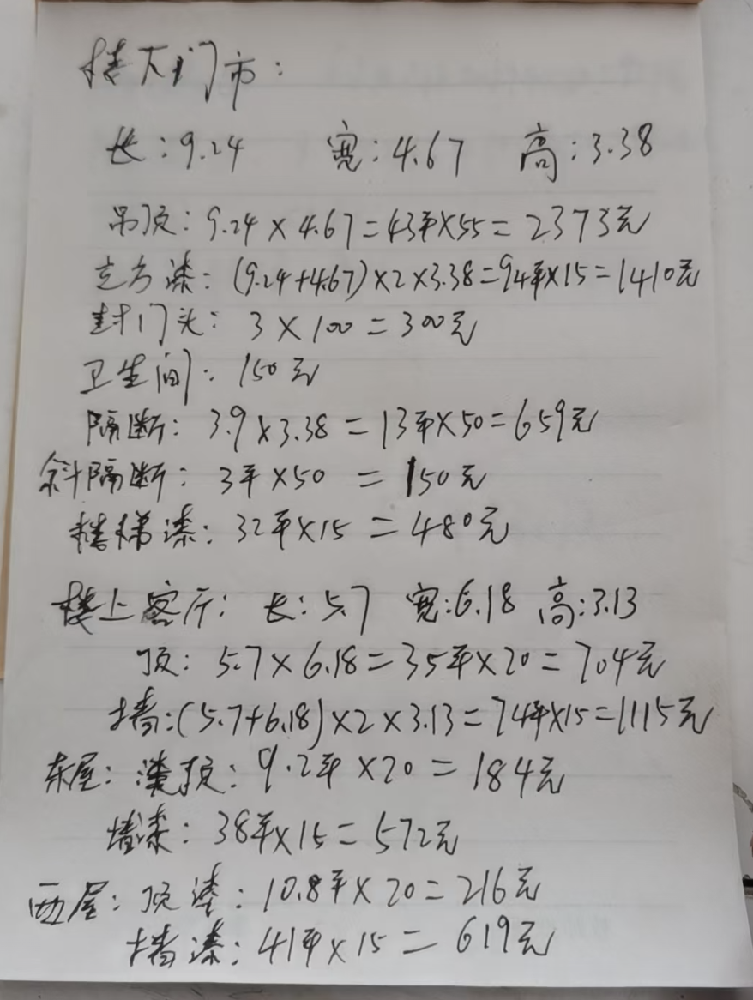
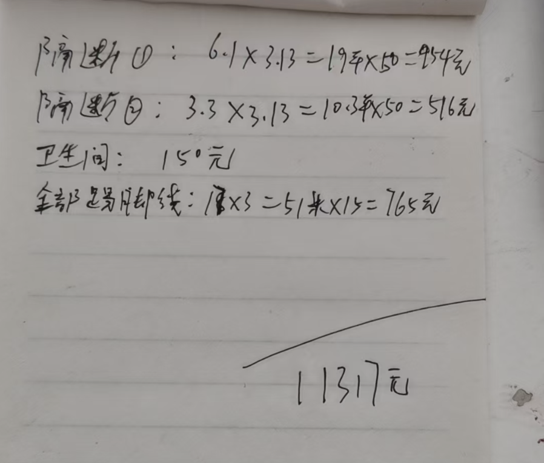

城市图书馆wifi账号密码
000700222853
660107Xue

楼下门市
长
楼大门市
9.24*4.67 = 43.15

5520

电:467 高:3.38长:9.r4品及:94x467=BPx55-2373元克方涨:(9rg+467)xx3.38-94秋15=l41封门头:3X/m二30元卫生问:10列隔断:39k3.38-13年X50=659元斜斗隔断:3平x50二150元糕梯漆:32单x15二48元
楼上家厅:长:5宽:6.18高:33顶:5、7x6、18=35平x20=704元墙:(5.7f618)x2x3.13-744x15=l115元东屋:类报:9i平x2。二184元墙漆:38形x15-572元西屋:顶捧:10.8年x20二216元堵溱: 41币x15-619元

