这节课复听3次才会有感觉
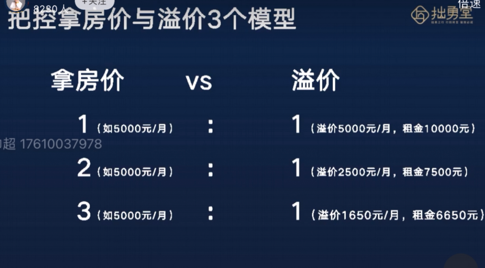

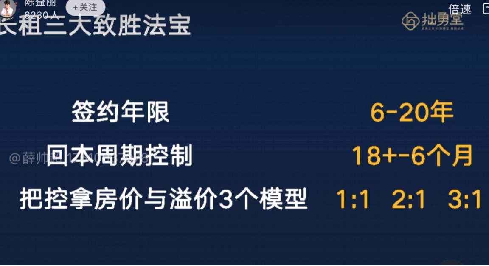

只要三条铁律都做到了，没见过不挣钱的学生

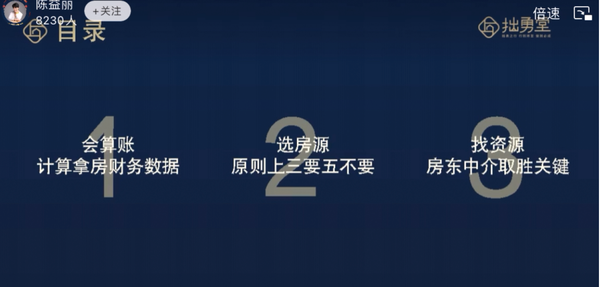
会算账：在拿房之前就要算出来这套房能不能盈利
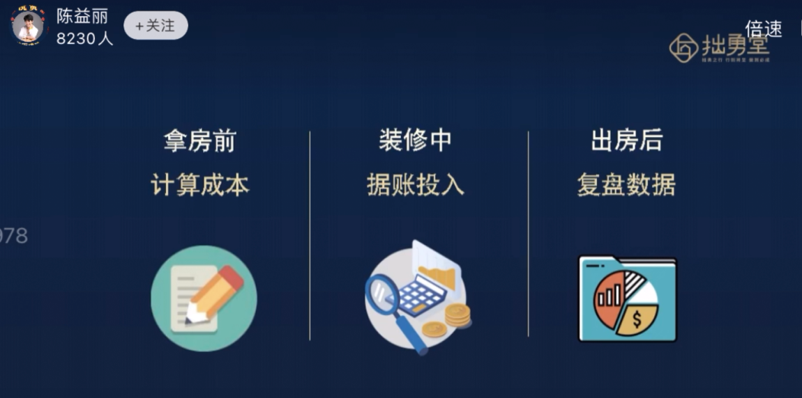

每一次不可能真实正确，但每一次都更接近我们的真实目标
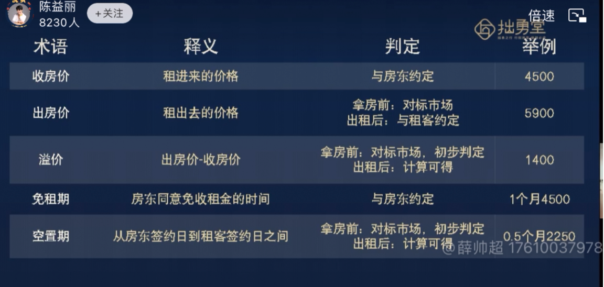

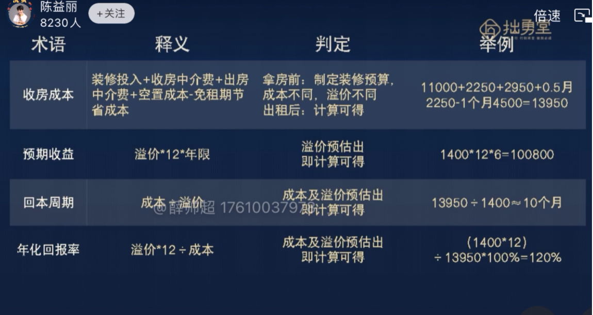

 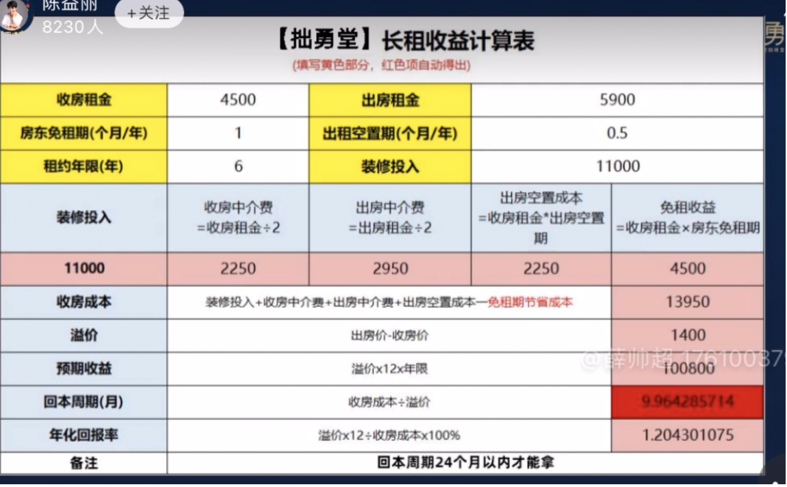

同学说：老师我知道这张表很重要，但我不知道怎么用，我不知道成本多少，我不知道能租多少钱，我不知道中介费要交多少，我不知道如何和中介说第一句话，等等，该怎么办

真实的数字如何通过踩盘，验证得来就是我们接下来要讲的最重要的
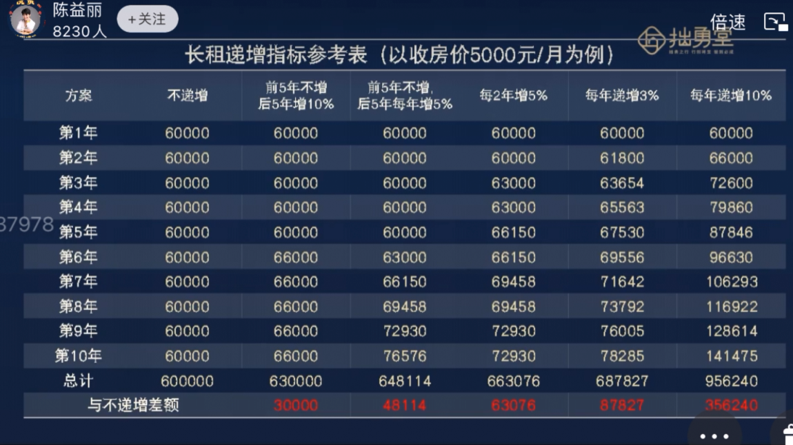

不同递增影响会非常大
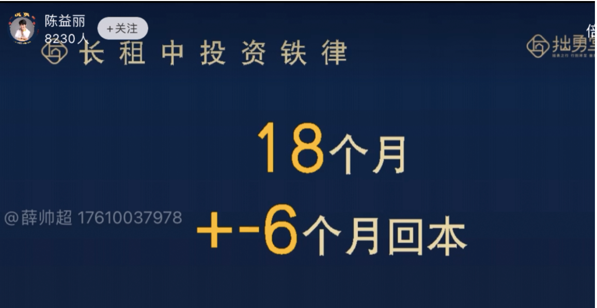

不要讲25个月回本，一定不可以，如果遇到25个月怎么办，回到谈判桌和房东继续协商，把数据微调一下，比如说免租期多给个10天，租金降200啊，期限再多给个5年啊，装修期多给一个月啊
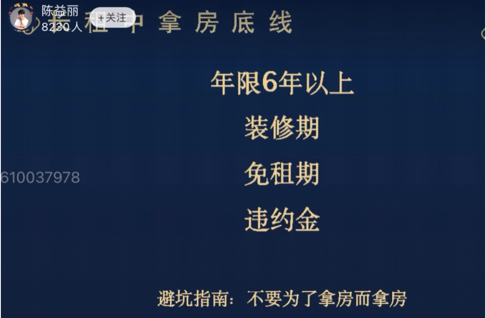

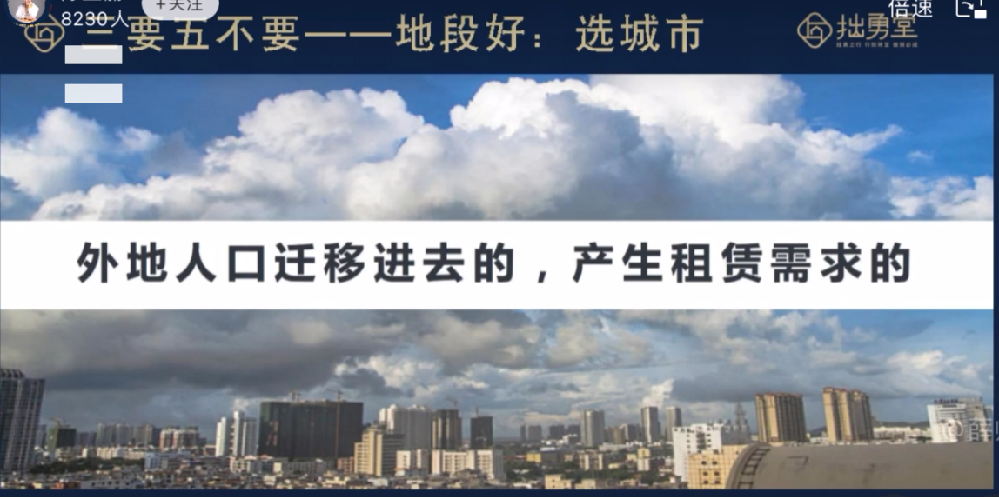

在省会大体都不差的

对于租赁来说不要死磕地段，
为什么说商务中心商业中心，见到来说就是要找人多，能提供很多就业岗位的地方做租赁，才有办法交房租
交通：他在那里工作，那他的通勤距离是多久，比如二线城市的通勤距离 半个小时-45分钟，一线城市 1-2个小时，三线城市15分钟，在这个时间内能到达的地方是他租房子的地方，太远不行

配套好
生活很便利，奶东村就可以，不要那种黑灯瞎火的地方
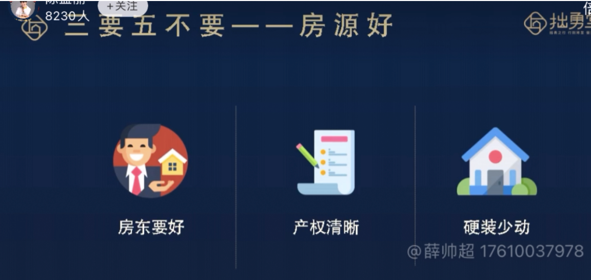

房源好
房东要好，产权清晰，硬装少动
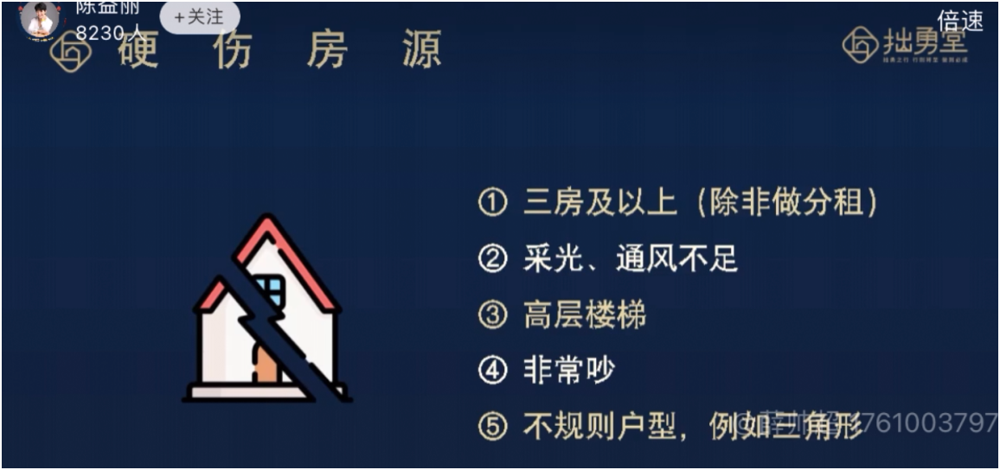

但只要房子价格够便宜，什么房子都能拿，比如5折就可以

总结一下
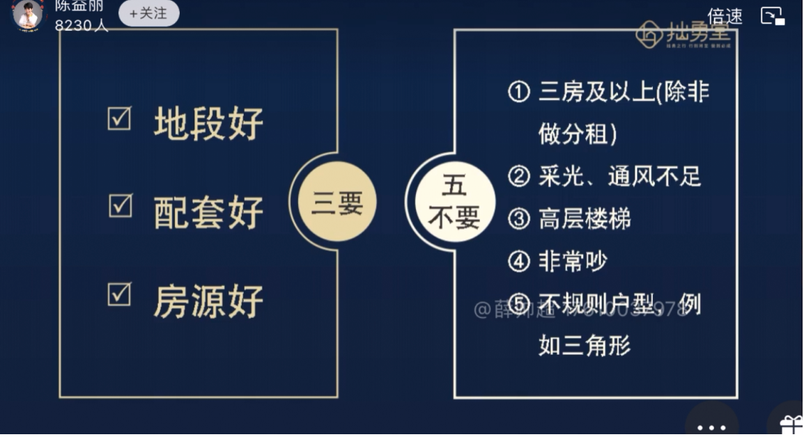

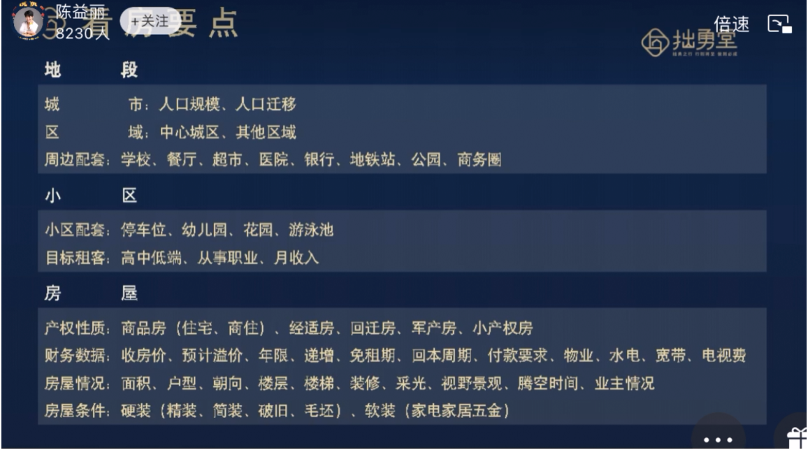

我们只在乎热力图，不在乎地段好不好

10分钟能不能到，八百米

Part3
找资源，房东中介取胜关键

思考：我如何对房东有价值
我对房东有什么价值

