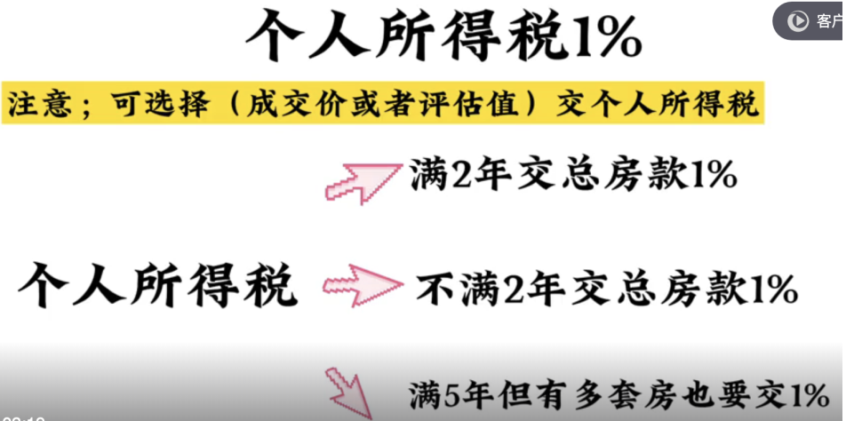

二手房有4个大税
买家交的：契税
卖家交的：增值税及附加税，个人所得税，土地出让金

契税：
首套房：<=90平 交1%，>90平 交1.5%
二套房：<=90平 交1%，>90平 交2%
三套及以上都是3%

1.增值税及附加税 5.3%
如果满2年，免征。不满2年，必须交
注意：交税时，房子的金额可以按照评估值来算，看成交价和评估价哪个低交哪个
比如说：
如果你这个房子下证没有满2年，房子100万
房东本人要交 增值税及附加税 100*5.3% = 5.3 万
但如果房子评估价是90万的话  90*5.3%=4.77万

2.个人所得税 1%

两种情况下免征个人所得税：
1.满五唯一，房产证满了5年，又是夫妻双方和未成年子女在这个城市唯一的住房
2.亏本销售，房子低于购入价卖的

画重点：满五唯一或满两年且这套房是亏本卖的，增值税和个税都能免交

3.土地出让金，
只有房产证上土地是划拨的才交
比如房改房，经济适用房，安置房等
房改房土地出让金收评估价的1%
经济适用房收评估价的3%

