今天要分享的主题是“笋盘去哪了”
对于这个问题，我认为要从四个方面着手
分别是什么是笋盘？怎么辨别真假笋盘？
笋盘产生的原因以及如何淘笋？
......
大家准备好了吗？

一、什么是笋盘？

笋盘是香港人发明的词汇，它是指低于市场价的房子。原意是指必定令人万分满意的楼盘，尤其是指价格方面。一般意义上来讲，笋盘指是二手。一手房因为是开发商定价，所以同一批房源都只有一个价，很难适用笋盘的概念。

但是一手房有笋盘吗？
有的

举个简单的例子，去年12月底，也就是一个月以前，和黄御峰一千多套房源同时开盘，开盘的单价是11000到13000之间。而与此同时，二手的和黄御峰价格是在15000左右，明显低于市场价。这就出现了一手笋盘。
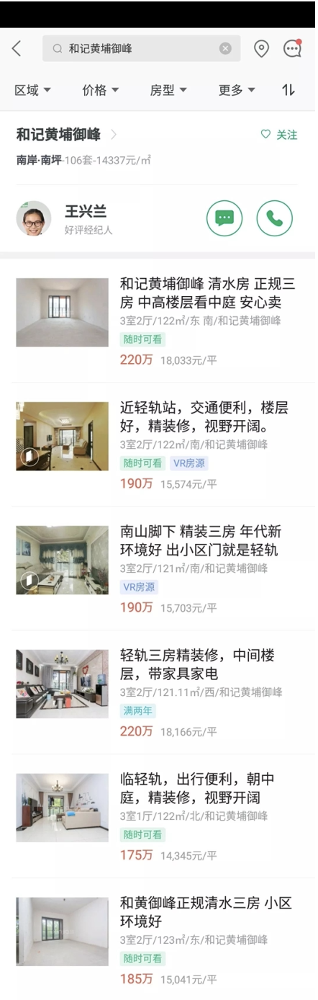

不过一手笋盘当然也有一定的弱点，比如限售时间要更长一点。重庆限售是以产证下来2年计算的，而期房一般是买入1-2年后才下产证，所以实际的时间限售要长一点。

二、如何辨别真笋盘与假笋盘？

经常有人问我这样的问题，这套房子是不是笋盘？比如说，前几天一个典型的例子，在知识星球问我：华宇天宫花城能不能高评，笋不笋？
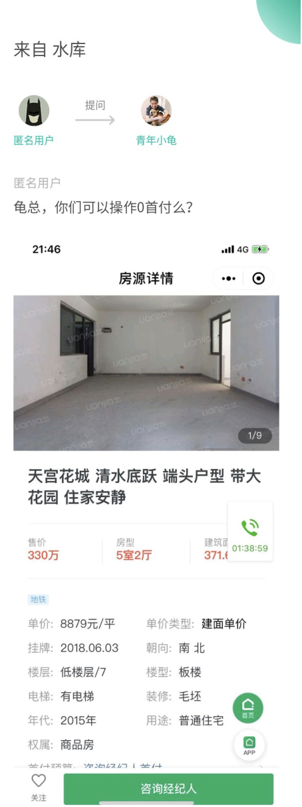

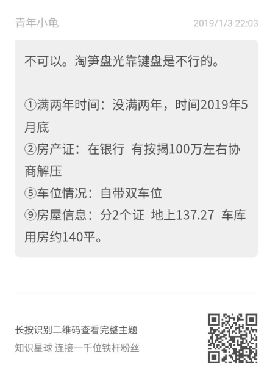
我对华宇天宫花城这个小区极为熟悉，这个小区的一楼洋房是和车库一起连着卖的，一共是2产证，一个住宅、一个非住宅。但是在链家上它只有一个数据是两者加起来的面积，这样平摊算下来单价只有8000多。这样的例子告诉我们网上的房源，有很多是有迷惑性的，很多时候看到标注的价格并不高，以为是笋盘，实际了解后才发现里面大有文章。要记住，笋盘一定比市场价格低，但是单价低不一定真的笋盘。

1）一房一价

每一套房都是独特的，就像是世界上找不到两片相同的叶子一样。同一个楼盘，单价相差20%很正常。附近有加油站、底楼、户型不好、朝马路等都是折损项。不能单看单价，有可能是各种因素导致它的估值本来就低，本来就不值那个价格。

例如保利观澜小区地理位置极好，小区均价都不错，但是小区旁边却有着六个巨大的天然气储气罐。所以该小区靠近天然气的那几套房源自然价格上就会比不靠近的房源便宜10%。这就充分说明了一房一价的特点，因为总有各种因素影响了房源的价格。

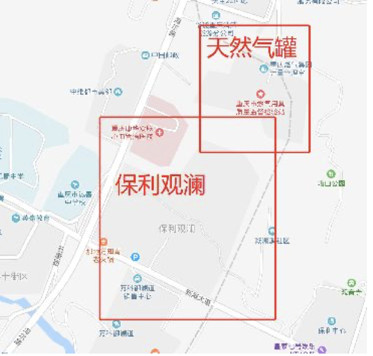

2）影响房屋估值的因素

房屋价值会受众多因素影响，列举几个非常比较重要的因素。比如楼层因素，底楼一二楼的房源，它比高区的房源就应该有折扣。在平原城市，比如上海，底楼的价格比高区的房源便宜20%左右才是市场价。

重庆是一个不区分东南西北的城市，故而朝向因素影响不明显，但是在平原城市朝向折损是非常的明显，比如朝北，它的估值可能有10%以上的差异。还有外部因素，比如说靠不靠近加油站，靠不靠近高压线，有没有天然气罐等等。此外还有景观因素、户型因素、房龄因素、得房率因素、噪音因素、地下室因素等，这里就不一一列举了。
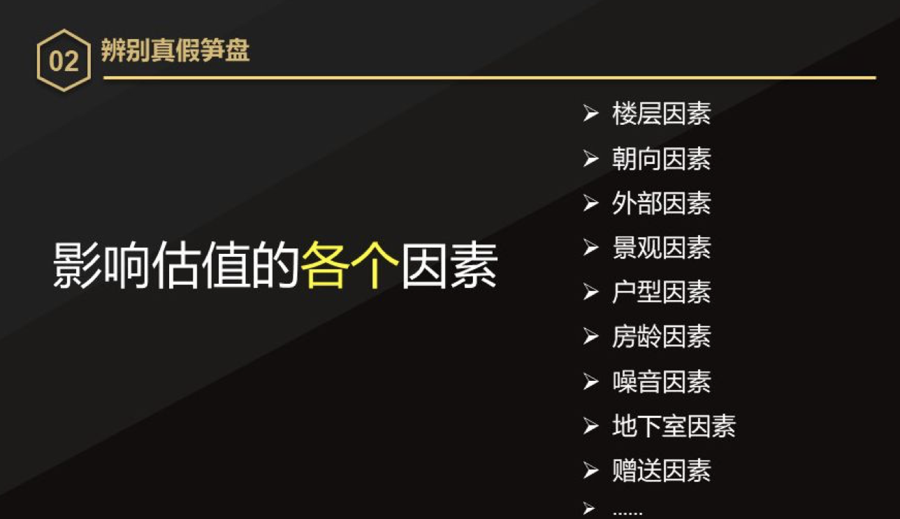

举个简单的例子，比如说户型因素，以一百平为标准，3室2厅的话2卫才是一百分。如果面积相同都是一百平，功能性偏少，这就成了它的扣分点。同比如说一百平只有两个房间，那功能性相同的时候，面积越小越加分，面积越大越扣分。

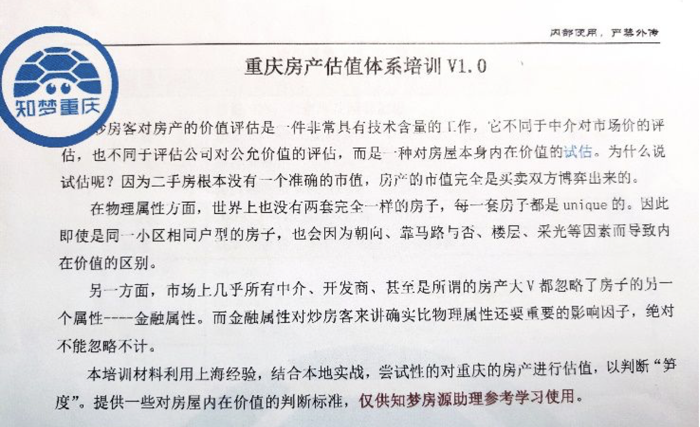

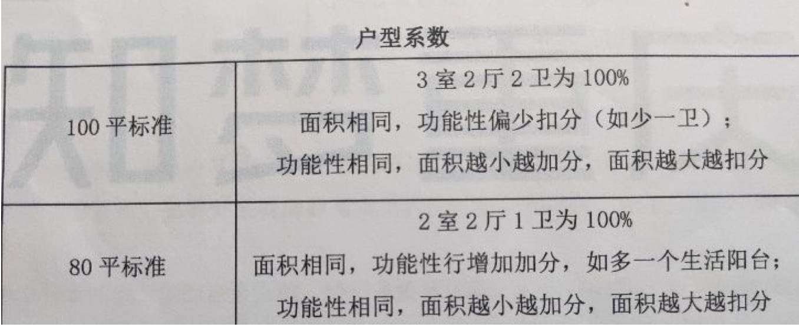

对于以上各类影响因素我们知梦房源经理们依据上万套的踩盘实践，归纳出了属于重庆的自己的估值体系，实现了从感性到理性的跃迁。

3）假笋盘的最重要因素：药单

提到笋盘就不得不再提到另外一个词叫药单。因为市面上出现的很多房子单价的确很低，但是却不是笋盘，而是药单。（看过水库名词大全的朋友马上就明白药单是什么意思，那还没有看过水库名词大全的多军们，可以添加zhimengxx索要水库名词大全哦！）

药单是什么意思呢？所谓的药单是指房屋本身没有问题，物理属性，甚至是非常良好，但是产权有问题的房子。比如说高利贷出来的房源，或者说这个房源有多重抵押、查封，甚至上家是吸毒人员这样的房子，我们都叫做药单。产权有瑕疵的房子，不是笋盘，只是药单。

药单不是笋盘，但药单在解药后却可以变成笋盘。
我举一个欧神的药单例子。

多年以前欧神本人处理过一笔药单，金额不大就100万，但是房子质量都不错，而且市场价可以卖到150万以上。可是这套房子的房产证上竟然有16个业主，原来是屋主过世之后有8个孩子8房子孙，加上一些夫妻和第三代联名。如果这套房子要被卖出，这16个人都必须要签字。16个人只要有一个拒绝签字，这个交易就被锁死了。这时候怎么办？大家可以发挥想象来模拟一下场景，所以一般人看到这样状况啊往往就放弃了。

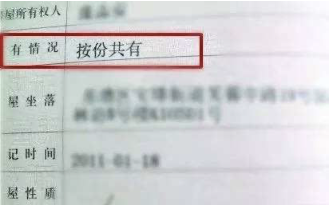

现在我们来正正经经当一次房源经理，都来网上找一找，看看你能不能找到笋。打开链家APP搜索天一新城，找到其二手房专区。然后按照单价从低到高依次排序，越是靠前的房源可能就会是笋盘。我们就以前五套房源为例，已知天一新城的房价在11000左右。
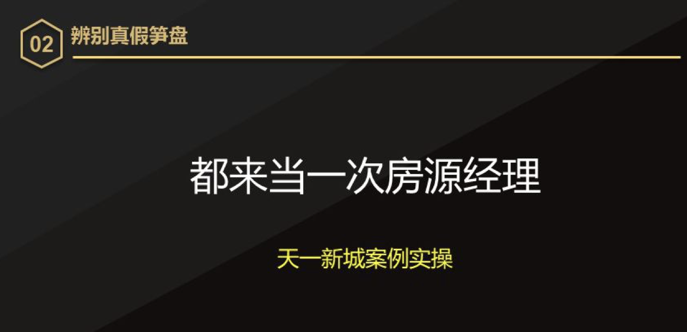

我们能明显的看到第一套单价只要7000多，第二套单价只要9000多，都是略低于平均房价的，现在我们一套一套来分析。第一套200多平，面积空间大，但是第一套是一个地下室。我实地去看过，整个房源都是低于水平面的，所以第一套地下室单价7000并不是笋。第二套面积在天一新城中不算最大，又是高区，单价9000多可能是笋盘。第三套面积太大，又是办公装修，总体来讲不太笋。第四套面积大又是位于底楼也不够笋。第五套整体不错，但是价格并不便宜已经越过了笋盘的标准。

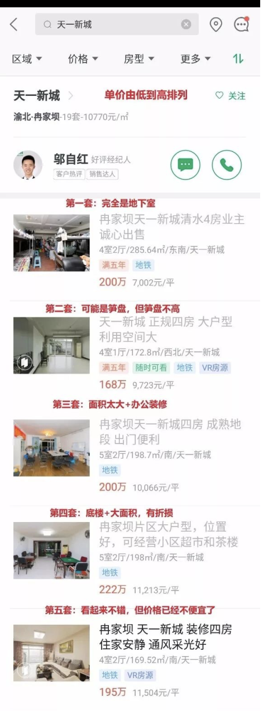

以上分析得知第二套可能是笋盘，这时候就需要实地踩盘了。知梦通过链家后台查询得知，该套房源户型方正，可是地处临街噪音较大，视野也不够开阔。更重要的是它里面有一个维护人写到有继承税（注：中国其实是没有继承税的，应是个人所得税），综上所述第二套房也不够笋。

三、笋盘产生的原因

很多人可能不理解，明明市场价100万的房子为什么会80万卖掉呢？是不是这个业主有什么问题呢？笋盘是真实存在的吗？

这一点对于我们专业的多军人士，或者是买过三套二手房的人都会知道，笋盘真实存在的。

笋盘产生也是有原因的，主要归纳为以下三点。

1）信息不对称

房东不太了解现下的楼市行情，比如说房东可能去了国外、或者是宅男，他不能够及时有效的了解最新楼市行情。

举个简单的例子，长安华都的业主张先生，2016年时出国了，现在回来想卖掉手里这套房子。当然他也知道房价涨了，所以他以2016年价格的150%卖房，他认为这套房子肯定不会亏。长安华都是我比较熟悉的一个小区，知梦第一单的代购便是长安华都，买入时价格是6000多。现在张先生挂牌9000多卖出，他认为这个价格十分OK了。但是他不知道的是涨了两年的房价，现在长安华都的均价已经在12000左右了，他以9000的价格卖就是挂低了。这就是一个信息不对称的典型例子，信息不对称导致的笋盘数量是最多的，但是笋度却普遍不高，毕竟市场价在那里，大部分人卖房前还是会或多或少会了解一下市场行情。

2）上家急卖

上家有各种各样急卖的理由。

比如某人已经有一套房，当前想要置换，需要把这个名额腾出去，这步操作对于限购的城市是特别关键的。又或者房东做生意，他需要卖掉房子之后用房款去填他的窟窿，甚至是离婚析产等等原因。我还遇到过比较奇葩的理由是官员马上就要跑路了，急降价急卖房，而且是七折笋盘。

3）议价能力强 

针对不同的房东，采取不同的谈判技巧，对症下药效果才会更加的显著。一般一套房子能谈3%，甚至5%出来，都是很有可能的。

比如白脸加黑脸策略，一个人觉得这个房子不错，另外一个人则专门挑这个房子的毛病。一个想买一个挑刺，似买非买，把房东的成交预期控制在一定的范围内，掌握谈判的主动权，从而更好地压价。

当然，水库用的最多的还是现金镇气场策略，看过欧神文集的人都知道这段。在谈判到关键时刻，直接从包里拿出20万现金，啪！放在桌上。先用现金稳住气场，然后再装可怜：我们真的很有诚意啊，很喜欢这个房子，都是带现金来的，您就再少一点吧！凡是有同理心的房东再怎么也得给你降点价。

又或者是表演征服，对于中年妇女就用小鲜肉，对于大叔那一定就是美少女上场了，大家都懂的。这个也是我们的房源经理惯用技能，从效果来看是非常好的。

那么，笋盘一般什么时候出现呢？
笋盘产生的速度是非常慢的，而且是随机出现的。在知识星球上我经常遇到这样的问题，这周六我要来重庆，融景城有笋盘吗？我想买曼哈顿，曼哈顿有笋盘吗？这样的问题问得非常多，说明大家对笋盘产生速度并不了解。笋盘它像竹笋一样，你不可能预知它在哪个地方冒出来，也不可能预测它在什么时候冒出来的。因此建议有时间来重庆买房的多军朋友，先踩盘熟悉市场，知道价格体系，然后联系我们进一步确定选筹方案。

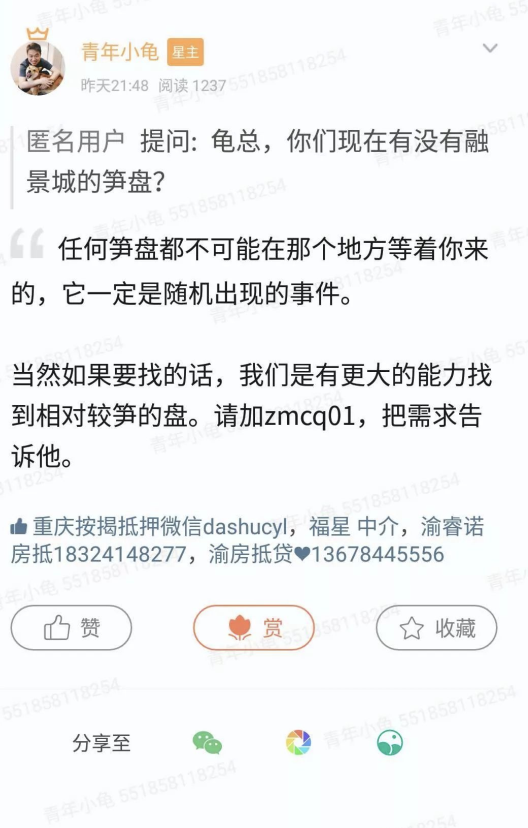

还有那些在二手房网站上上架时间比较长的，比如说超过了一个月，那这套房子一定有问题，你甚至都不用去实地踩盘了，因为那一定不是笋。（是笋早就木有了！！！！）

四、如何淘笋？

如何淘笋？欧神早就给了标准答案——“看房200套，笋盘自然来”。其实这是一个数学问题，就是这本书《概率论与数理统计》里教我们的东西。
翻译成我们都能听懂的话就是，只要你看房200套，就一定有人急卖。200个业主中一定有人不了解市场行情，甚至是200个人中一定有人因为离婚而卖房，所以无差别的人类劳动才是淘笋的王道。划重点操作如下：
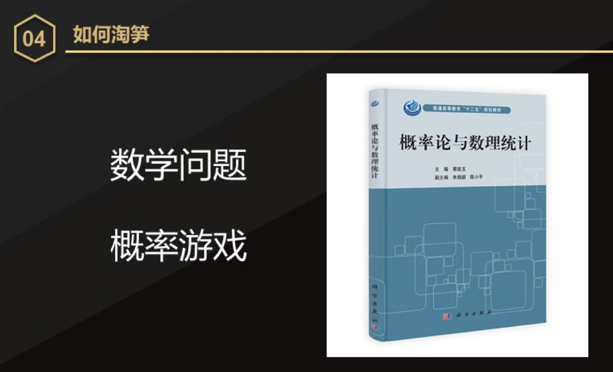

1）大量的看盘

对知梦的房源经理来说，我们会要求他头两个月不能做业务只能去踩盘，不仅要踩，而且还要把看房的数据发出来。这张图是我节选的，某房源经理在9月份的看房图片，大家可以清楚的看到图中编号。

除此以外，不仅仅看盘数量要达标，我还对他们房源有要求。就是你找的房源在不同阶段一定要符合知梦的笋盘标准才计算套数，才能够进行编号。比方说编号80到120之间，我的要求是挂牌价低于评估价10%的才符合标准。

2）大量的御用中介

我们要成为章鱼，把触角深入到各个小区的中介，和他们成为伙伴，不管是红皮的、绿皮的还是黄皮的。有大量的御用中介之后，才可能找到你心目中那个笋盘，别人才可能把笋盘推给你。说明一下，我们所说的御用中介，不是每天给你发十套房子的中介，每天发十套你想都不想就是PASS掉。因为笋盘是一种稀缺资源，它既然一天给你发十套，重复不断的发，那说明它没有对房源进行很好的筛选。这也是帮助我们区别好的中介和与不好的中介的一个方式。
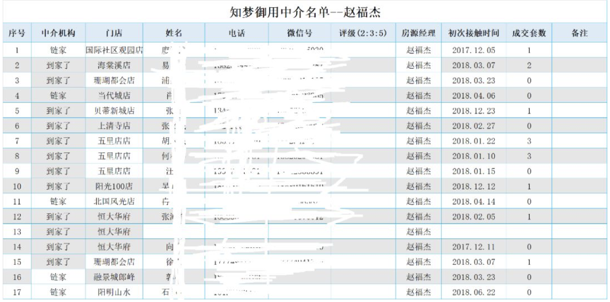

3）黑科技的综合运用（爬虫系统）

我们内部做了自己的爬虫系统，对全网不管是绿皮的红皮的数据都爬，每天自动的筛选意向笋盘，进入我们的笋盘库。重庆2000多个小区，每天不间断的重复爬取。我们又链接了评估公司的数据库，一边是交易单价，一边是评估单价，双管齐下，就可以高效率地筛选出相对比较优质的笋盘。
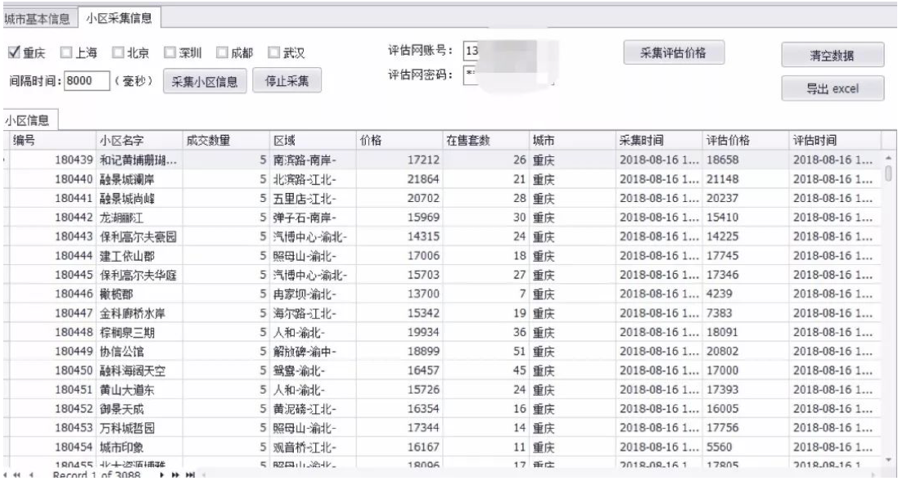

大量的踩盘，大量的御用中介以及黑科技的运用，共同促成了知梦高质量高效率的淘笋代购的服务。在这一点上，我认为选用了我们知梦服务的人是非常有眼光的，毕竟只用花一两万的服务费，得到的却是二十万三十万甚至五十万的套利。

朋友们，看了青年小龟的专业笋盘解析，是否已经知道怎么样辨别真假笋盘以及正确淘笋了呢？记得拿出小本本跟着青年小龟划重点哦！能不能成为下一个中国淘笋出彩人就看你的了！

我总结：看房200套，建立自己的价格体系
