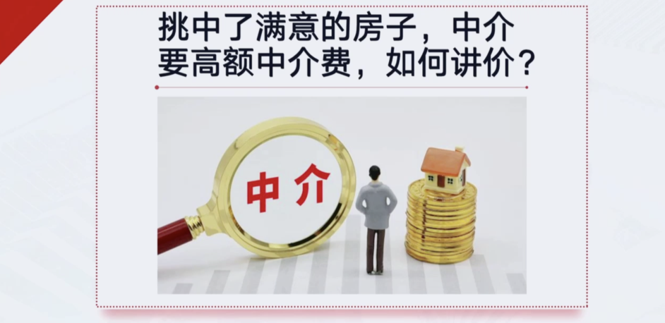
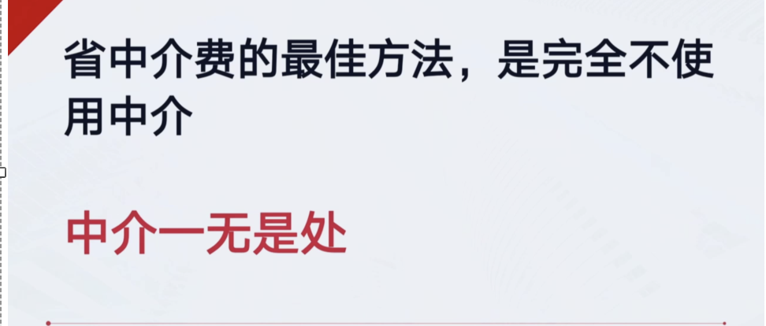
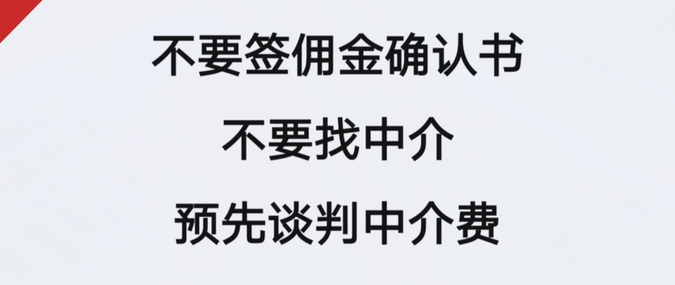
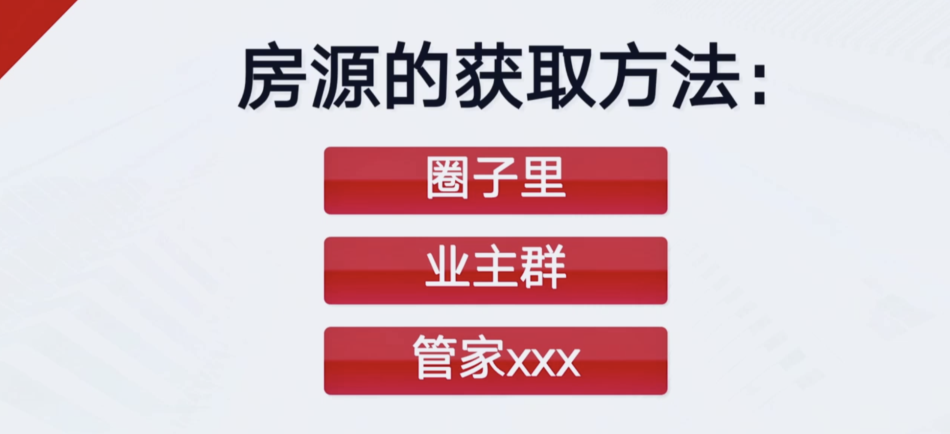
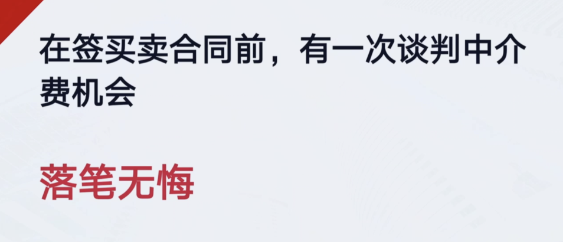
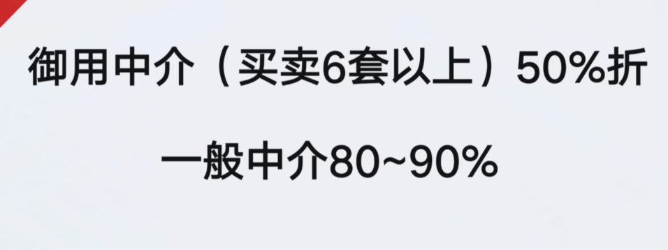
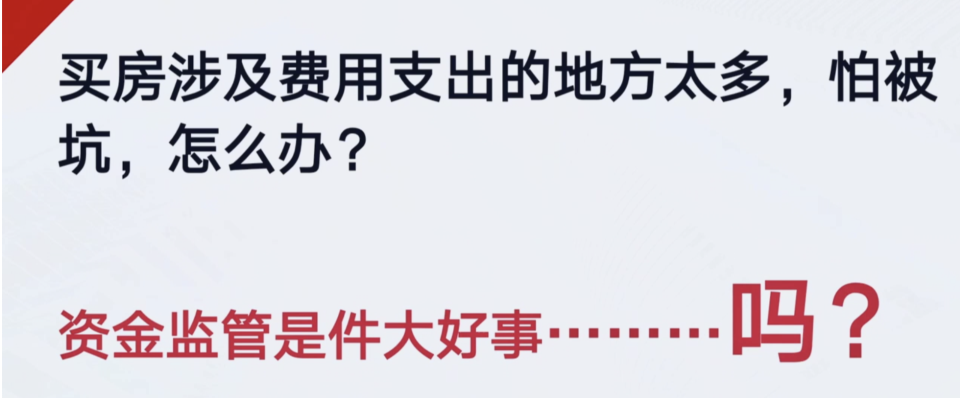
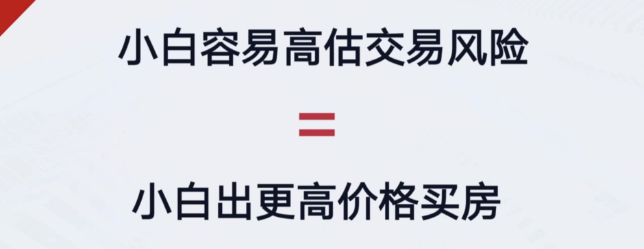
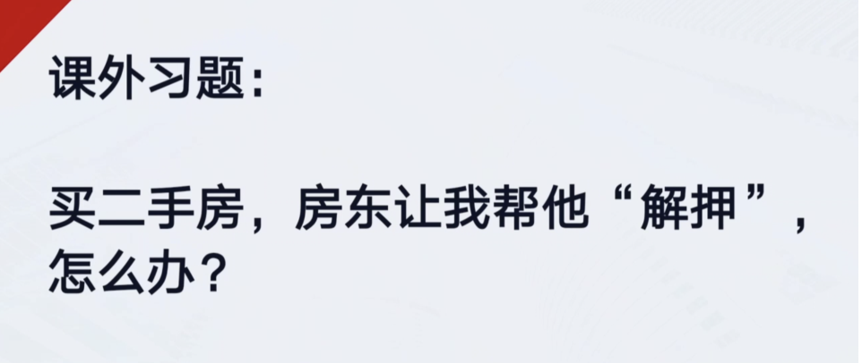
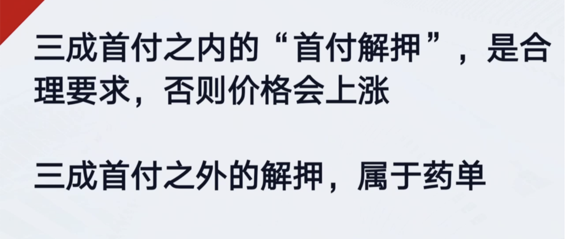

张杰就是没签佣金确认书，所以赢了官司
但如果必须签，要把佣金2.7划掉，或者签别人的名字

老师，不用中介我怎么交易房产呢
交易房产分两部分，
1.房源 2.跑交易中心

交易过户这块是最简单的，没有任何风险
业内有种玩法叫手拉手，就是上家下家已经认识了，手拉手找人帮我走一走流程
以前收五千，现在贵了，一万，不用付20万中介费

中介费打折一般是在签合同的前一秒，

如果你真的非常小心，

欧神极度反对资金监管

不能资金监管，以为他要去还债的

药单流就需要额外折价
