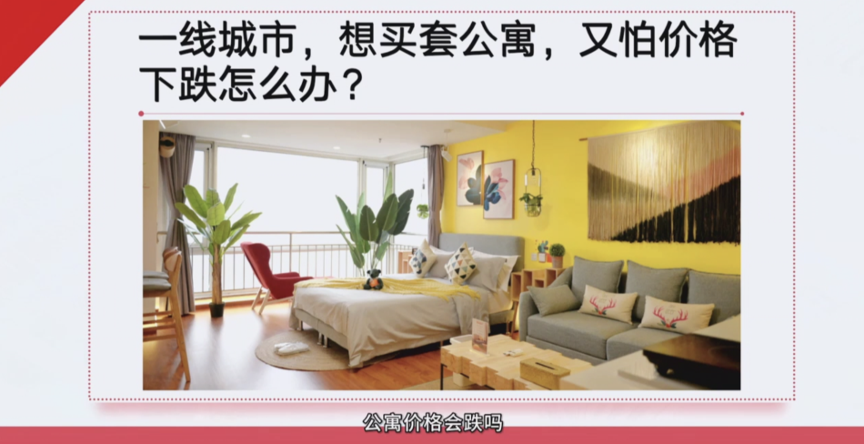
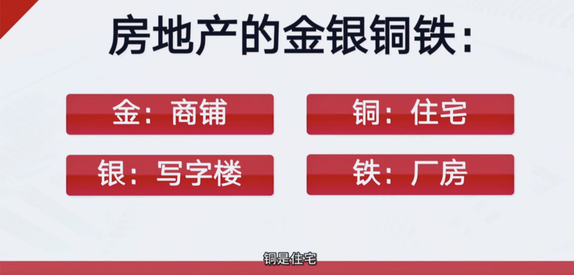
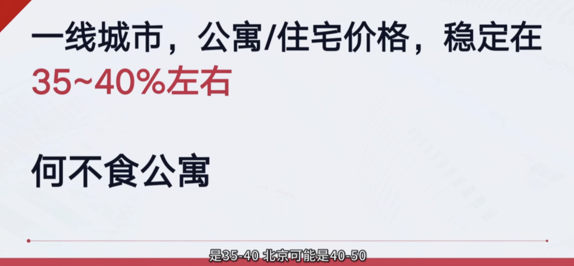

商铺租金是最高的，8-10个点都很正常
但商铺很不稳定

过去30年，买商铺的都贵了，
买写字楼，公寓的都不涨
买住宅的涨了很多

公寓不涨的原因是他有增值税，买卖一次税费很高，基本上没办法买卖，
买卖一次20，30的税

公寓的优势是便宜，只有35-40%的价格，
为什么这几年公寓起来了呢，因为住宅限购，还要交税，住宅在公寓化

有些v是这么说的，
因为商水商电，管理费贵，一个月贵几百块钱

欧神也推了一个公寓，燕郊 佳悦丽庭，住宅一万四五，公寓八千

