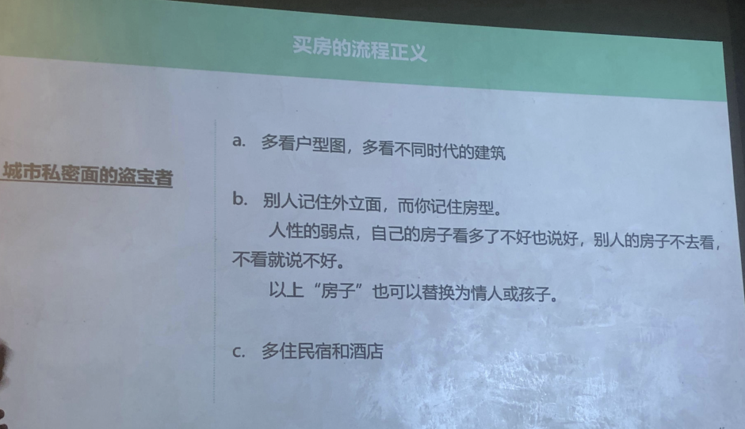
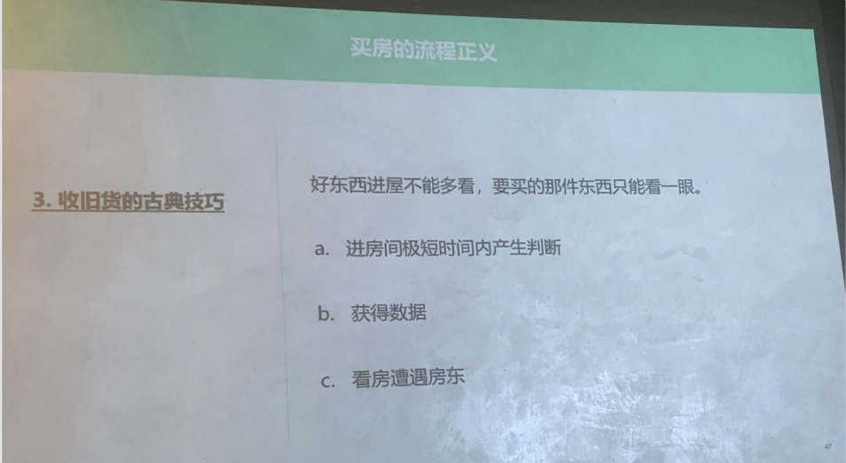
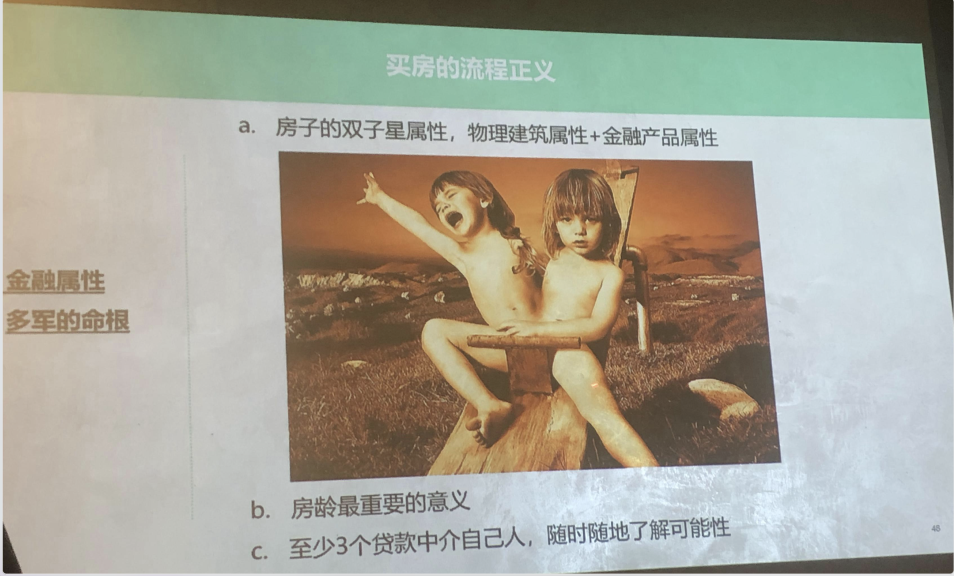
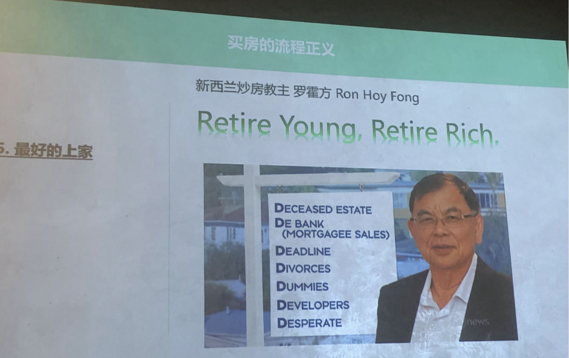
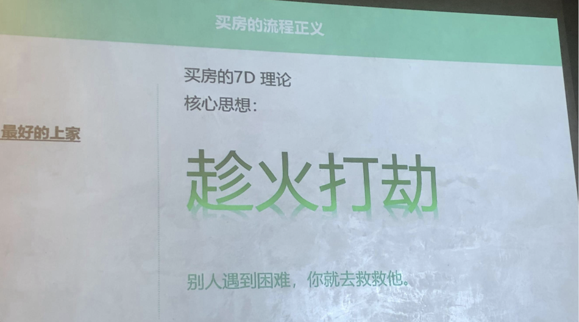
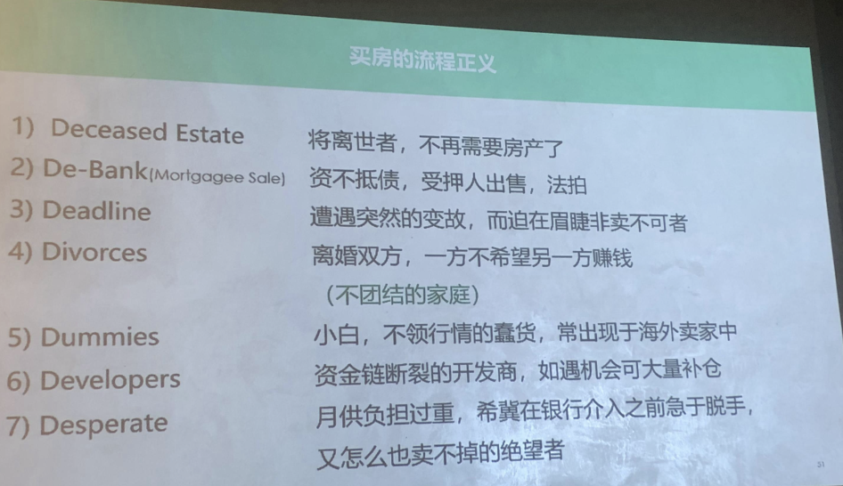
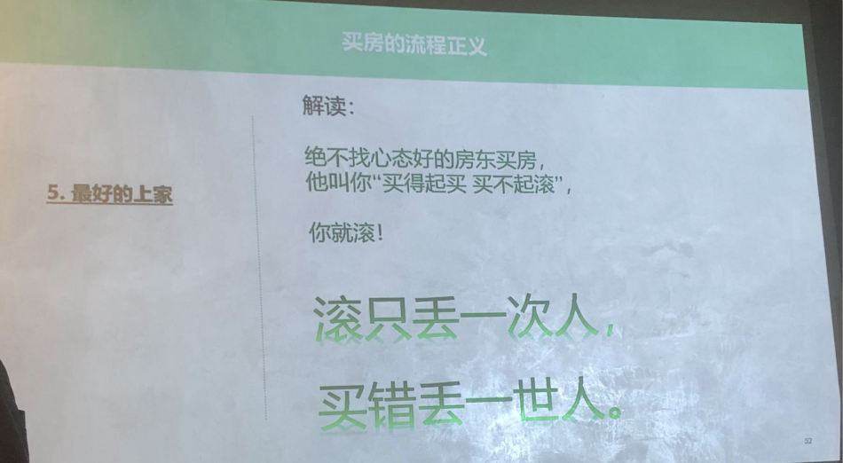
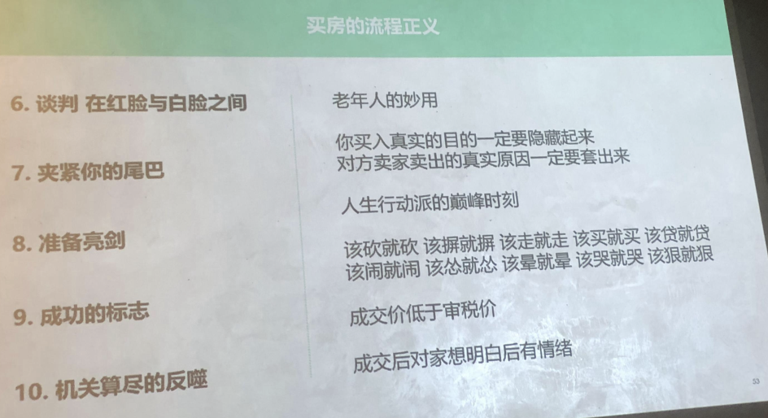

买房线上思维这种思想以前是没有的，以前只有约中介出去看房子，现在我们会发现一个链家的 APP 有时候都可以搜索上面搜索能力会非常强，比如说你可以设定价
格是 200 万，然后你又设定为 5房，说说看当然肯定是全上海搜不到一套，但是如果你 200 万搜到一套三房肯定是很便宜，基本上也是搜不到的，能够用这种限定这种条件的思维去收房子。
这个线下思维就是还是要多出去实打实的看房，培养几个育佣中介，多接触房产证的，就像今天的活动，

城市私密面的盗宝者，多看户型图，多看不同时代的建筑，这个是怎么讲?
就是说因为有很多的房子，我们好像都是很熟悉一个城市里面这栋楼，甚至于你家附近有这栋楼，你每天都看到，有一些人家附近一栋楼他天天看，或者自己小区里面所有的房子的外立面，你天天看那里面是什么样子，但是你真的知道吗? 你真的那么清楚的知道吗? 你家对面窗打开的那一栋楼里面，每一个房间的户型是什么样子?你真的非常知道吗?你每天要问自己这些问题，你不要整天看到的全是外立面，好像建筑你很熟悉里面的样子你全都没有看到过。
我们就是说所谓看房 200 套，有有时候你家附近就可以看 200，你最后对你家里附近的社区的熟悉度是每一栋楼叫出名字里面三个户型，清清楚楚全都有。别人记住外地面，你记住的全是里面的东西，这个城市渐渐就不再真的陌生了，你才真正的走路。人性的弱点，自己的房子看多了不好，也说好别人的房子不去看，不看就说不好。大家都应该明白这个意思是吧? 
有时候别人的房子也就是你自己的房子，你天天住在里面，你觉得也好也好，其实都是缺点都看不到，

然后 c 就是多住民宿和酒店，有一些跑不进去的房子，平常没有机会跑进去的房子，如果他一旦拿到 market，on the market，他拿出来卖，你就可以付钱进去看。
然后多去有钱人家里做客，多去公共建筑，大量走入银行、医院、博物馆、教堂、幼儿园、名人故居，当然我这些都是指都是指一些比较好的建筑，比较比较上档次的建筑，有优秀历史建筑的这种意思在里面。我们随便看一些图，譬如说这种上海外滩的浦发银行，这也是在外滩石膏点。
文革的时候，我们的建筑学家用石膏把它封起来，文革过掉再把它重新揭露出来，没有让 4 人帮砸掉。这是邬达克设计的一个，现在是上海银行也在外开会情景，这也是在外滩晚上的工商银行，就像这种你去看这些图，外滩这些房子好像所有的游客来上海都会去看，每个人觉得晚上开了灯外面很好看，但是有几个人来过外滩以后，其实我前面放出来的这几个这几张图你都可以真的记在自己的脑子里，有吗?没有。很陌生。上海最好看的东西，其实很少人真的刻在自己的脑子里，
所以看房 200 套仅仅是起点，我们要把房替代成所有的建筑好东西要多看，就是要开眼界，人就是要开眼界。

好，讲到一些收旧货的古典技巧，我以前在水库最早的写过一个阿宝的故事，我有一个收旧货的朋友，他一天到晚收旧货，感受就会赚的钱不多。后来我指了条路给他，只要条路给他们，叫他去叫他去搞房子，然后他就开始吵，因为他自己是吃低保，他就去搞使用权的好了。利用自己的一个难民，你的身份搞了很多使用权的房子，然后他作为回报教了我一件收旧货的技巧，他们你就知道经常到别人的那些老头老太太家里面去搜救，或者人家搬家了他去搜旧。
他说到人家家里面去，比如说你今天想好，今天去是要买那张红木桌子，红木桌子有市场价，雕花的程度大概值 1500 块钱，但其实他是看上了他墙上的一幅字画，副置换，他认为能够值 3 万块钱，但是他跑到人家房间里面以后，他不怎么盯着那幅字画看，就是很偶尔去瞟一眼，从头到底都在讲红木红木桌子的世界市场上面有一个固定的价格，往上往下浮动不会很大。
那么最后走的时候，他说阿姨我一样来一套，能不能顺便那幅画我也带走算了，我给你 500 块钱算了，人家哪有说我们不快彻底了，要么 800 块，好他就同意了，800 块他就把那幅画完成了。
其实他这一次的目的不是买那张红木桌子，他的目的就是买墙上那幅画，他从头到尾不认真的看那幅画，他也不跟房，我又不讲讲，房东又不跟老阿姨画画，东好了，画的主人就画东，没有跟画东好好的谈就不画，它只是最后顺便的说我一样走，我把那幅画烧走算了。
老太婆一想也蛮好，反正那幅画我看了多少年我都快吐了，就卖给他，他赚钱就是那幅画赚钱。

所以这是什么意思? 你们如果去看房，房东正好是在房子里面进房间，极短的时间内要产生太多的领导字，就是今天早上这个课看房这课就有用，你进去就是他赚产品脑子要全反映出来，甚至有时候两个人去一个人缠住房东，找比如说你老婆在那里缠住房东，讲一些家长里短，这里菜场在哪里，小孩读书怎么样，这种无关紧要
的话，然后你在那里比如说像我这样的话，像套套掏出该测什么，心里面数据就写下来了，对吧?
获得数据，看房遭遇房东就当着房东的面不要讲任何客气话，只有一种情况下你可以讲客气话，就是这套房子你讨厌的要死，你肯定不会要。
所以看房进来欢天喜地地向做像做人客一样的这种都是不是买你房子的人，挑挑拣拣的再去买一包。所以这个判断一定要快，不要给房东看出来，你喜欢。好，后面也讲的快。

今天我的朋友大家曹经理在这里，他是做贷款，大家有上海做贷款需要可以。好的，他应该是很明白。这个就是说我们讲一个房子，我很喜欢这幅画，就是一个摇滚乐队的叫 man，他们一张专辑的红脸一张专辑叫balance。平衡。
我看到这句话，我觉得我们买房子其实就是这幅画，任何一套房子都有两个属性，一个就是孩子房子就是房子，我们早上教的这些都是物理属性，但它有另外一个属性就是金融属性，属性是很要命的，很要命的防止双重物理建筑属性，金融产品属性，对我们多军来说，金融属性就是命根。
有一些房子他房龄超了，银行很难给到你高杠杆，你就吃亏了，对吧? 所以我们不是说房龄有些房子，还有公元后 300,年，古罗马的斗兽场现在还没有他 600 年的长城，公元 600 年的我们中国的长城到现在也没有，他不是说房龄慧房子一定会，他不是这个道理。
王林主要是银行能不能给到你杠杆，对吧? 所以你们需要说把黄陵这个东西重点是在银行能不能给到老房子有一些就是说挂铜牌的银行也可以贷款贷，另外一些不能贷款，至少要有三个贷款，中介是自己人，你可以随时随地的问他们，各种各样的可能性，可能性很重要，能不能这么摆，能不能那样摆?
因为有些事情有一些途径，有一些技巧，你不知道不知道对吧?所以你需要问贷款中介，

这个是一个新西兰的炒房叫主叫罗霍芳，我不知道你们有没有人，百度上面了解过这个人，这个人在当地声名狼藉，尤其白领，非常讨厌他，白人认为他一个人作为一个华人炒房领袖，一个人把新时代的房价炒高了，把然后他们联合起来抵制他，所有的新闻媒体都把他 PK，但是这个人赚的很满足。
我们来解读一下他的一些理论，他有一个口号叫 encourage，对吧? 很年轻，就能
够退休的时候还很有钱，然后他有一套买房的激励理论，我的想法就是我们因为他讲得非常好，总结得非常好。

我们用结合我们中国的二手房市场来理解一下他这些话，看看我们有没有可能性。买房的基地理论，它的核心思想 4 个字乘火打劫，听上去就不是个善人对吧? 但是财产东西交易这个东西， Market 的事情，对吧? 是这样的。很残忍。我解释这句话，别人遇到困难你就去救救他。有的时候有些老夫妻急着用钱，对吧?他降价，但是降价的那一部分对他来说还没割到肉里，他真的要的是一大笔钱，肯定要去看病，要去移民，要子女念书，其实他只要有这个需求，价格是他同意的，你就去帮帮他对吧?

好，
第一个是 deceased estate 将离世者，我翻译成即将要死的人快死了，不再需要房产。大家前一段听到一个新闻对吧? 一个老头他自己有一个痴呆的儿子在房间里死掉了，然后他后来答应把他的房子以后给门口水果店的老板，水果店的老板帮他养老。
对于这个老头来说，一个孤老儿子也死了，这个世界跟他来说已经白白了，在他基因死亡的那一天对吧? 他就跟这个世界彻底再见了，这世界上一个平方都不再是他的，他不需要再留恋。他倒需要活着的时候，有一个水果店老板像儿子一样的照顾他，对吧?但是他好一点他不需要。所以二手房市场有时候如果有人遇到这种听说房东 80 多岁了，又是丁克，没有小孩，好，你就是秃鹫，它是奄奄一息的脚法对吧? 机会就来了，很现实的在全国所有的二手房市场每天都在发生，只不过是有人知道有人不知道，你知道你就应该下手。
第二第三个资不抵债，受押人出售，我们翻译成中文就是把打开了，一般都是打开了。有没有私人抵押，最后也出售的应该也有，但相对来说可能少一点对吧? 也有有的。他就很懂这种事情，你也没有办法。
第三别的遭遇突然的变故而迫在眉睫，非脉不可者。大家想一想，在你以往看二手房的经历当中，有哪几个房东是处于这种状态?有的时候是要看病，我碰到过我前一阶段碰到过最近的一个案例，是一个老头他孙子吸毒，他要他要把房子卖了去给他孙子。
然后 divorce，离婚双方就是说对方内斗你余文得体，可能在白人的世界当中有时候离婚，双方可能都比较有钱，互相就是打击对方的方法，就是我要把这个房子贱卖，因为我不希望你发财，你也不希望我发财，大家互相一起把房子借卖掉拉快点成就，这种情况在中国人里面比较罕见，中国夫妻离婚未离婚，情感不在了，钱还是钱?
很难说为了我要堵住另外一个人，想让对方小三少拿掉一点，我们房子借卖，因为他自己也损失了。所以这种情况比较少，但是我们遇到很多的事，不团结的家庭，尤其是多子女的大家庭，这种情况非常的常见。
我相信大家在二手房市场上，应该如果你在二手房市场超过 5 年以上，你应该都遇到过我比较离谱的一个例子，是我的朋友买一整栋，他在我介绍他一个楼房里面，最后签合同来了 14 个产权，老夫妻死掉以后整整 6 对夫妻加上一个孙子和一个孙女，是这样。
然后大家都想快点，就是说互相是关系很紧张的，兄弟姊妹是不团结的，那就是谁闹得最凶，小的最缺权的那个人，决定了卖出去的价格是多少，因为他想快点把钱分走。最后交易的那一天，中介把楼下的门都堵起来了，他 14 个人走掉 1个，走掉一个就完蛋了。然后第五党委就是傻逼，对吧? 小白不仅行情的蠢货常出现于海外卖家中，这个也很常见。所以我经常二手房，我经常会多问一句的，房东在国内可以签字，听到房东在国外我心里面就好像一个小钥匙被打开了，机会就来了。
我自己的我有过两套房子，三套房子，在买卖过程跟海外房东是有关的，一套是房东是嫁到美国 27 年，上海有一套是在他妈妈的名下，然后他妈妈过世以后，他就把这套房子卖出来，然后他卖了一段时间，然后来了一个香港的买家，来了一个香学港的买家以后就给他一个价钱。
比如说我打个比方，那个时候差不多 480 万，480 万以后，后来香港人查出来自己给了他 2020 万的定金，然后查出来自己没有买房子，没有买房资格，他怎么样他就把 20 万熬掉了，跑掉以后我就去了，我就直接跟他说 460 万，她一想，然后他一想前面反正 20 万我已经转掉了，他就 460 万答应卖给我，大概，然后中介跟他说房价马上要跌了，一个高峰已经过去了。
然后因为他在海外他也懒得去查到底怎么回事，他就同意。这是一个，还有一次是有一个日本的好多还是一个女的，她已经加入日本国籍很多年了，他后来是骗我自己在日本是做什么中华吊顶，其实我从侧面打听到他在那里做银做，蚂蚁。对。
然后他反正开了一个价格是 1400 万，300 平方的房子，然后我觉得这个价格非常好，我这一分钱没有还，就答应了价格，然后他最后从日本回来，中介就开着车到飞机场去接他，直接接好我们就回中介公司签合同，路上不能让她去任何别的公司问一下价格，因为单价才 51,000，太便宜。
然后 Develops 资金链断裂的开发商，这种如遇机会和大量补偿这种机会大概现在已经不太有了。当年当然首先是不限购，另外当年上海买一手房还送蓝印户口的时代，像卢湾伯爵他们那一代人，这些最早期他们也不能说炒房，最早期就是看准了房子以后会涨的人，都是这种甚至于很多上海以前最早一些商品房的持有者，他们根本就觉得房子是不会涨的，他们那个时候也不觉得这是一个紧俏的什么资产，什么 100 样都不懂。
有时候给小区做工程，有些是给小区做对话的都有。承包商这种这个小区，比如说他们去做什么，最后开发商付不出钱了，父母说钱了丢给你 7 本产证，说这 7 套房子就是付给你的钱，他们就分掉了。他们那一代人这种机会，我们现在不太可能有。
第七 desperate 月供负担过重，希冀在银行介入之前急于脱手，又怎么也卖不掉的绝望主义。在年轻人当中多，这种房东我也遇到过的，我遇到过的一对小夫妻自己去开饭店，他们开了7家饭店，然后遇到了新冠，遇到新冠以后，一下子他们月供笑死人才 13,000 块钱。13,000 那个女的就觉得心里压力大，因为他的饭店一个都在亏，他就觉得快快绝望，然后那个房子他卖掉以后就从7万涨到 12 万，就是这样。

绝不找心态好的房东买房，他叫你买得起买买不起滚你就滚。滚只丢一次人，买错丢一世人，好不好? 所以买房如果你听到上家是水库的，不要问了，你直接走。对。你不要跟他打交道，对吧? 

我们讲的会计谈判在红脸与白脸之间，这个时候有个老年人的妙用，我就稍微念一念。
你们家要是有一个很多的讲话，从头到底没逻辑的，动不动活动就要想的，稍微碰一碰，什么就要哭的就要闹的这种老年人恭喜你，谈判带他去了，谈判带他去，谈判就是有一个无底分子知道吧?
有一个人你自己道貌岸然，西装笔挺，你是还不了价格的，很多丑事你做不出来的，你就是要一个每一句话说出来都是尴尬的，让大家想死的这种老年人带进去，有用的，是吧? 
第二，夹紧你的尾巴，你买入的真实目的一定要隐藏起来，上家和下家碰头，谈判碰头总归要互相知道一下你为什么卖房，你为什么要买我这个房子? 其实大多数的现实情况当中，上家讲的也不是真的，下家讲的也不是真的。
下家说我小孩要读书，我想住在这里很喜欢怎么样? 上家们讲什么，我要出国的我怎么样? 其实上家心里面想的是我要赚点钱，下家心里想的是我要投资，我要投
资，但是这种能讲出来吗? 不能讲出来，中国人很虚伪，要把直接钱的东西有时候要隐逸，那都是这样。
但是卖家卖出的真实原因，你可以通过侧面想方设法去泡泡泡出来，
然后准备亮剑，就是这个时候是人生行动派的巅峰时刻，买房的最后的关键时刻，我随便写了几句，该砍就砍，该饼就饼，该走就不走，该买就买，该带就带，该闹就闹，该走就走，该晕就晕，该堵就堵，该堵就堵。这些事你要做的出来，这个时候是人生的戏剧舞台，你要表演的时候，你这个时候很沉默，我是个内眼内向的人，我是个优雅的人，我是一个好吧，就这样你就完蛋
你该做的事情你就要做出来，一件一件都要做出来，随时随地每个点把你的利益放到最大化，

成功的标志为稍微那一点，就是成交价低于审税价。
我人生你经历过三次就最后去合税，他说你这个合同价你做低的太离谱，我们肯定这个价格你不能按照这个来交税，他给你抬上来，其实我心里知道不是我做低的，我是真的成交价，真的就是成交价，因为我投到笋盘了就是这么简单，所以我多付税的时候我心里是很爽，我心里是很爽，但是这个时候如果你有一个无理取闹的老年人，在税务局面面前该晕就晕，该哭就哭，有时候也有用。
比如说你实际成交价是 320 万，窗口指导价现在是 350 万，要多按照 30 万来交税，你这个时候出现一个老年人，最好还有点残缺，最好还有点知道正是最正确的人在那里哭，对着人家怎么样，有时候就放你一马。
我以前有一个老中介，老中介大概 60 多岁是我见过最不要脸的人，他每次带我的房子去省税的时候，他问税务窗口多少钱，跟别人商量多少价格的时候，他会有-一个动作，他会这样蹲下来跟人家说话，把自己姿态放到即一一个 60 多岁人就蹲下来，手放在你的膝盖上，问你这个价格能过吗?
我心里吓一跳，我说中介费值了，真的就是做得出来，讲讲难听点就差跪下去了.
该蹲就蹲，我还要加一句，该蹲就蹲。这个动作，

然后机关算尽的反思，我不知道你们有多少人被交易完的上家反思过，我的门口就给别人拍过有游戏对吧? 王一浩假离婚骗贷什么的，就游戏就喷在我门上，我还发给欧晨笑看，还有我都经历过的，最后为了一点点为款差点跟我打起来，最后我要显示出我比他还要臭流氓。
我最后一次谈判是我把一个咖啡在他面前，我用我的手砸碎，然后我都是我自己的学，我在那个人脸上，我说你报警了，你来验血，这都是我的血，我没有打你。你叫警察来就是你袭击，因为我初学，这样就跟他闹，这个时候你不要显示出优雅，你把所有的优雅的抛光，有时候你别看这些好像也没争取到多少利益，但是你长期保持这个性格，你持续这样狠上了 8~10 年，你能多赚一套房子，好，下面我们讲改要休息一下，不要休息好半个小时的继续了。继续来。

