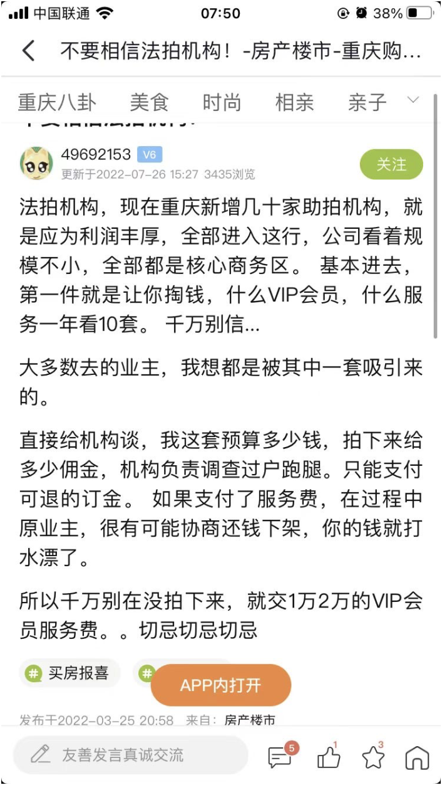

200套房源整理
海拉明发给我两篇文章，我还没整理
重庆房产促销适合法拍房吗，都促销哪些内容

把你中意的法拍房先圈出来，不然见了海拉明想问是否笋都没办法问，要问到推荐的成交上限是多少

### 重庆的法拍公司

1 重庆中正资产公司 地址：重庆观音桥
2 重庆印山法拍 地址：重庆渝北区
3重庆安鑫法拍 地址：重庆渝北区
4重庆家纳达房地产公司 地址：重庆南岸
5重庆守财保企业管理咨询有限公司 地址：重庆市渝北区东湖南路40号
6重庆洲成拍卖 地址：重庆市渝中区长江二路174号
7重庆中正合科技有限公司 地址：重庆市江北区富力海洋国际
8重庆万可投资有限公司 地址：重庆市江北区北滨一路
9重庆润一助拍商务信息咨询有限公司 地址：重庆市江北区观音桥洋河一路
10重庆中渝法拍网络科技有限公司 地址：重庆渝北区
11重庆法拍网络科技有限公司 地址：重庆市渝北区泰山大道东段

一个个打电话问下，几个点

### 法拍中介的套路

2.明明按照你的预算，不太可能成交的房子，他们也会说可以试试，骗你交定金，
很多房子按照你的预算不太可能拍中，但他们也不会告诉你的

### 法拍房安全捡漏需要五步
法拍房做好尽调就能安全捡漏
1.先找法院了解被执行人的情况，社会背景，如果是黄赌毒，或者犯罪，这房子就不要碰了
2.了解房子的基本信息，了解欠税情况，了解过户的税费问题，排查有没有高额税费，
合法租约，居住权，确保房子拍中之后，能够符合过户和交房的相关规定，
3.去银行了解房屋的价值，看出价多少何时， 银行也要评估竞买人的能贷多少钱，确保拍中之后，贷款能放下来
4.去物业了解房子欠费的情况，水电费，物业费等，
5.

