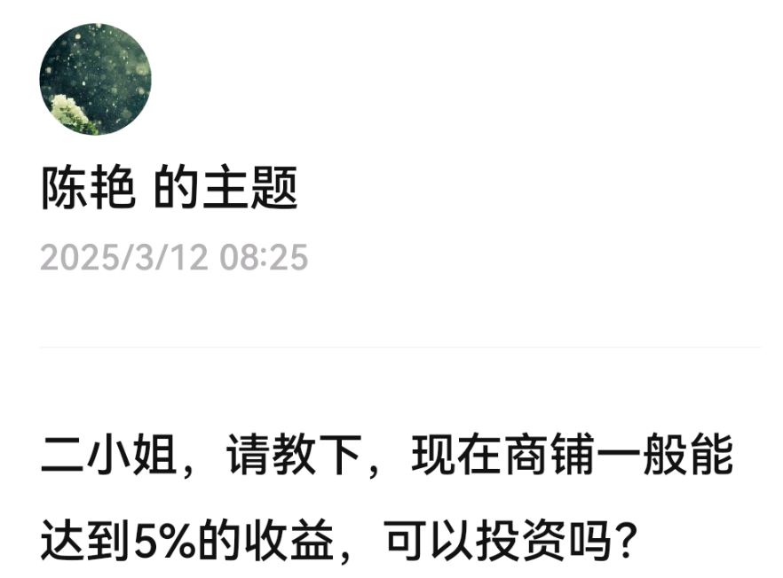
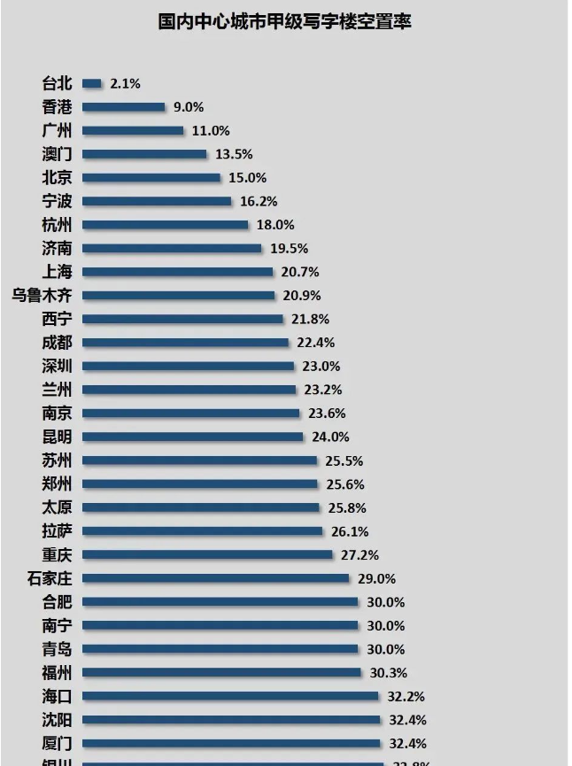
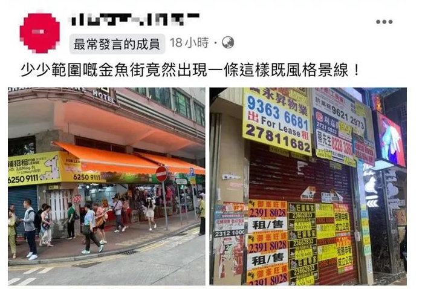
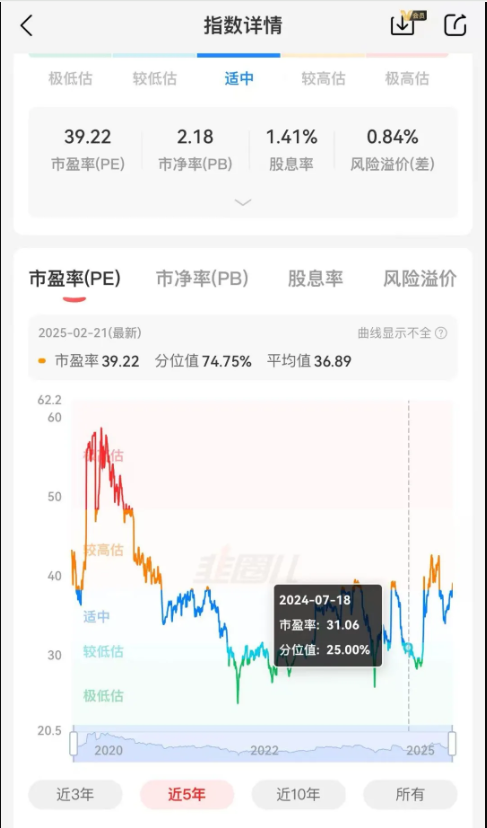

包租婆二小姐大学就很有理财意识毕业去上海后更是如鱼得水在年流入人口超50万的大上海做出租生意20载
历经2008年和2014年两个大熊市从未动摇过“收租”的决心
彼时，虽然房价也暴跌但租金不跌，反涨
我跟你们说哪怕在最风声鹤唳的2008年全球金融危机时，上海的租金都是涨不停的
无视本金的波动是每个包租婆包租公应有的觉悟
只要有稳定的租收我就当本金归零
但是今次，二小姐却动摇了“收租”的决心每一套退房都劈价斩仓毫不犹豫
你们是不晓得，如今的租金跌成什么鬼样子了啊！包租婆包租公都死翘翘啰基础逻辑被摧毁了基础逻辑被摧毁了

通胀年代一路走来的人不晓得通缩的年代，租金也会跌跌不休，是二小姐无知了。
知识星球里有人提问“5%的商铺能不能买”？我正好展开说说“收租派”的生存底线

你们知道谢霆锋在香港有个外号叫“摆花街铺王”吗？
谢霆锋和刘嘉玲一样算艺人里极具投资理财意识的
他19岁就开始学习投资房地产做艺人赚来的钱如果不固定下来很容易来得快，散的也快
谢霆锋觉得“砖头不长脚，不会跑”他赚来的钱就买铺收租
接连投资了香港中环摆花街26号商铺，28号地下连阁楼商铺，以及摆花街壹号广场地下六号至八号店铺等铺位，市值超过4亿港币因此，他也被称为摆花街铺王
香港的现状，大家也都看到了就像一艘触礁的巨轮缓缓沉入海底它的衰落与消失让人遗憾痛心
摆花街的商铺已空置许久最近刚刚租掉一间从20万/月劈价至6万/月
腰斩都不止，膝盖斩了还上了当地媒体新闻
商用物业的“劈价”比普通住宅更凶残因为它的持有成本更高昂更加烫手山芋
（“商用物业”指办公楼、商铺、酒店、公寓这类高税、高物业费、高能源费，高持有成本的产品）
我给大家看一下国内中心城市写字楼的空置率情况

想当包租公包租婆你得分清楚每个月赚来的租金里哪些是“精装修”带来的现金流
比如某些破房子，离了精装修就没人租那么其租金并非砖头产生的，而是每年不停折旧的精装修产生的
你得分清楚每个月赚来的租金里哪些是“物业费能源费”带来的现金流
比如某些大厦、商业街，产业园，离了物业管理就没人要，关了能源费就没人要
那么其租金并非砖头产生的，而是每天不停损耗的物业和能源产生的
你得分清楚每个月赚来的租金里哪些要交中介费，哪些要给免租期，哪些要给空置期
剩下来的净到手租金，才是真正砖头带来的现金流
砖头的折旧是小小的以70年的长周期计
其它的精装修能源费物业费中介费空置期等折旧就大大的了它们不按70年计算，它们按“一天天”计算每一秒钟都在产生支出
比如说一套住宅精装修的投入在8~10万元左右精装修5年折旧旧得厉害了就租不出去了，得翻新这点老房东都晓得
10万的装修折旧摊薄在60个月每个月1500元左右
也就是说，一套房屋的租金里至少有1500元是装修折旧，这个东西五年归零。
只有超过1500元的部分才是砖头和土地真正产生的现金流。
因此，便宜的精装修小房子是不能按照3%的的租售比底线来规划投资门槛的，你得将其拆成毛坯，毛坯房能租到3%才具备投资价值，精装修不算。精装修五年后要破败，房子恶心了就租不出去了，你又要砸5万去修修补补。
那么商用物业呢？商用物业的“物业费能源费”就更离谱
你哪怕空关着不用都得交至少10元以上一平方的物业费能源费（我这还是往少了算，很多甲级写字楼动辄几十元一平方的物业费能源费）
因此，你想买商用物业收租要把你收到的租金，减去付出的物业费能源费成本，再减去中介费空置费，再减去送给租户的免租期，计算自己的净到手金额。
你不要觉得自己能收到5%的租金事实上，很多地方商用物业的租金减去上述成本，几乎已归零
江湖俗称“你只要帮我交物业费电梯费就行”
也就是说，其土地已无法产生任何现金流
收来的租金只是维持物业费管理、能源消耗、中介跑腿、房东空置等成本罢了
你还投资个蛋蛋啊

你们知道为啥国内住宅的租金回报常年低于商用物业的租金回报吗？
因为商用物业收到的5%房租里至少有3%需要纳贡住宅没有那么高的纳贡
高税、高物业费、高能源费，高持有成本，中介费免租期空置期刀刀见血
并且，商用物业的租金波动也比住宅大得多前面说的，谢霆锋的摆花街商铺租金从20万一个月跌至6万一个月
铜锣湾罗素街的一个商铺，2008年被卓悦租下的时候，一个月租金58万港元。
到了2012年，瑞士名表浪琴，又以230万的天价月租抢租该铺
如今这间铺变成了手机配件店，230万的月租如今跌至12.8万，跌幅94%
房租跌了94%哪个大房东还愿意持有收租呢？包租公包租婆都死翘翘啰
因此，香港现在有超过千亿货值的商用物业在寻求出售
写字楼市场最大的新闻就是九龙旺角的金钻玺商厦，业主持有12年，两折卖出，亏损9100多万。
持有12年，两折卖出这就是曾经“一铺养三代”的商用物业
宝贝，包租婆二小姐连住宅都要沽清，不想租了你居然问5%的商铺要不要入货？
你不如去香港扫货那边10%租金回报的铺子现下已经不少了
也许是抄底的时机也说不定哦只要通缩结束，日子就好过了像韩国一样，未来每套房子几千万不是梦

## 小米围猎韭菜 4.2
港股经过了去年下半年开始的一轮暴涨
这几天在回调

二韭菜除了重仓IM之外
还有300万的港股和中概股

因此，对恒生科技也是一直保持关注状态

昨儿刚刚喘息一口气呢
我以为止跌了
小米突然又暴跌6%

咋回事儿啊？
二韭菜打开热搜一看
哦
#小米SU7高速爆燃，3人死亡#

3月29日夜，安徽铜陵
3名司乘人员从湖北自驾小米su7到安徽参加考试，于德上高速枞阳至祁门路段发生事故。

随后，小米官方出来认领并公布了事件详情

我不知道是车的缘故还是人的缘故
车祸的真相，留待警方侦查
不是我能置喙的

今儿单来说说小米的估值

我一直说小米的估值虚高了虚高了

在我看来它的合理股价应该是【22,40】这个区间

上次还因为嘲小米被删帖了

今儿二韭菜头铁

准备为大家再算一遍小米的估值虚高

我们把小米的资产分拆

汽车找汽车的竞品对标

手机找手机的竞品对标

家电找家电的竞品对标

造车，理想、赛力斯都比小米强

2024年销量是小米的3倍

你们不能否认吧？

可人家市值只有2000亿

你按销量给它除以3

小米造车的市值大约在700亿

你说小米后发制人，今年销量会增加不少

好，同意

那就给它除以2

小米造车的市值大约在1000亿

再乐观一点

小米和目前的冠军理想的估值齐头并进

也就是2000亿

这是最乐观的估值了

冠军也就2000亿，你还能咋样？

有的人说小米汽车以后要称霸天下

把中国其它新能源车全干掉

所以应把别的新能源车的市值全部赋予小米

应该是2000+2000+1000+1000……

——呵呵，这种宏大叙事你高兴就好

我是肯定不相信的

好了，拳头产品之一的造车估值大约在700~2000亿左右

那么拳头产品之二手机家电呢？

手机家电这种红海竞争的领域

夕阳行业了，缺乏想象空间

新的故事是讲不出来了

只能严谨按照年利润来给估值了

2024年一年赚240亿利润

按30倍乐观估值计算

给7200亿

按20倍悲观估值计算

给4800亿

PE超过30

等于说小米对标苹果

你觉得可能吗？

小米没有苹果那么深的护城河

以上两项加起来

**小米悲观估值（700+4800=5500亿）**

**约等于股价22元上下**

**小米乐观估值（2000+7200=9200亿）**

**约等于股价40元上下**

也就是说

小米股价低于22块的时候属于“捡便宜”

虽然它股价最低曾经到过8块

但是在【8~22】的区间里

小米都能称之为“便宜货”，能买

小米股价40块左右

属于乐观估值

【22~40】之间的波动都属于正常区间波动

超过40块的以上部分

就是“高估期”

也就是市盈率百分位里的“高估、极度高估”周期

市盈率绿色区间表示“低估、极度低估”，适合建仓买入

蓝色区间表示“适中，正常”，适合持有但不加仓

橙色区间表示“开始高估”，准备逃顶和做波段

红色区间表示“极度高估”，可以逃顶了

**猜顶和猜底是猜不到的，但是通过估值百分位，来了解今天你买入的股票够不够“便宜”？这是可以确定的。**

今天，小米的股价最高到过59元

高达54倍的PE

肯定是虚高了，泡沫了

二小姐从小米超过40元的时候就开始喊虚高

一直喊到它最高到达59元

看起来好像被打脸了

可我不改初心

一直喊，一直喊

今天小米出了车祸爆燃的黑天鹅新闻

股价暴跌至46元

我认为，还不是抄底的机会

股价超过40元的每一分钱里

都是过热的情绪和资金面的反应

而非企业的盈利能力

小米企业真实的盈利能力

只够支撑他【22,40】的股价区间

谁不能正视这个事实，谁就不会做股票

我从不猜明天的涨跌

也不赌黑天鹅事件

没这本事

二小姐从不博弈情绪这个东西

**做投资，第一要务是保住本金而不是赚取利润**

**保住本金，第一要务就是学会看资产的合理估值，不要买贵价货**

多少人为了赚取利润，在高位刀口舔血自鸣得意

可二小姐不是，我只捡便宜货

妾本布衣，躬耕于上海
只图捡点便宜货，了此残生

二小姐的股票建仓成本在2800点左右
二小姐的房子建仓成本在1~1.5万/㎡左右

未来的涨跌我无法预测
但我能确定这个价格市盈率够低，现金流够强

剩下的事情，交给时间

时间会带着我们慢慢向合理估值回归

