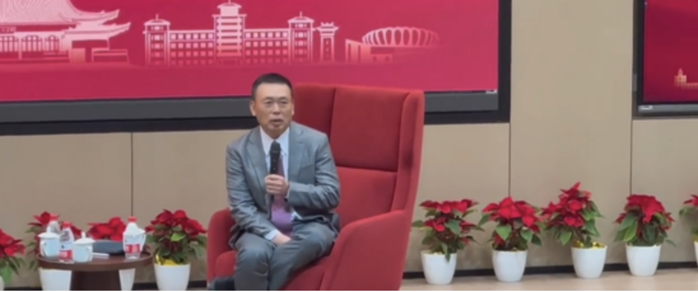

2025年1月5日，著名投资人、企业家段永平重返母校浙江大学，与现场校友师生进行了深入交流。
对话期间，段永平分享了自己对投资的见解，谈及自己与巴菲特共同的价值投资理念，并对拼多多创始人黄峥的投资逻辑进行了深度剖析。段永平还阐述了自己“敢为天下后”的理念，反思了当年对乐视股票的认识。在回顾浙大求是书院的学习生涯时，段永平多次强调人生最重要的原则是“做对的事，把事情做对”。

以下是投资作业本课代表（微信ID：touzizuoyeben）整理的精华内容，分享给大家：

1、谈赚快钱：
并不怕错过一些机会，但最重要的是不要踩雷。想快赚可能正是你缺钱的原因，因为一直想着快速赚钱。知其不可为很重要，还是要踏踏实实做该做的事情。

2、谈创业：
该创业的人根本就不需要你鼓励……我觉得很重要的一点是大家不能为了创业而创业，你是真的有想法，真的有必要，还有就是走投无路的时候，有时候也是创业的一个好办法，因为我们当年就是走投无路。创业并不容易，你不要只看到有些人的成功，成功率非常低。有想法，有条件，就去做。你如果只是为了创业而创业，那就要小心。

3、谈学习：当你对某件事有兴趣的时候，就不会对未来的东西感到恐惧。现在是一个信息爆炸的年代，你不能说所有新东西你都去学，那样也白学。有好多人看起来知识很渊博，你再渊博，也不会比搜索引擎更渊博。

4、谈赛道：好赛道是不会进入低毛利的，低毛利的都是商业模式比较差、产品差异化很小的产品。

5、谈乐视股票：有人跟我说乐视的股票掉到了三十几块，怎么办。我说三十几块已经是好价钱了，因为这个价格在未来可能会变为零，你何必等它涨回五十块呢？但后来我发现他其实是想卖股票给我。那可是乐视原来的第二大股东，真是个坏人。

6、谈创新：创新其实是在弥补需求上的不足，差异化不是简单的不同，而是满足用户需求。创新其实并不一定是最先做的，只是当发现了某个东西，刚好有实力把它做到比别人更好时，可能就厉害了。

7、谈勤奋：有人说过，什么东西最重要，他说勤奋最重要，我说不是，我说做对的事情最重要。
因为我说勤奋最重要，你会变得更勤奋吗？你不会，至少我不会。但是呢，你想着做对的事情，发现错了你赶紧改，这一辈子你累积三十几年，四十几年，每一个决定都是基于十年，二十年以后回过头来看，你会发现你会省好多力气。

8、谈分享：我能做到今天，很多就是对人的支持，我的分享的精神，我觉得很多人用人的时候都是要让别人为自己工作，我是希望他们能够为他们自己工作，而不是为我工作。

9、谈黄峥：我非常喜欢和黄峥交流，因为我觉得他是一个看本质的人，和我一样，我觉得这是比较重要的。你要去做对的事情，要把事情做对，你要想长远。我觉得黄峥就是这样一个人。我觉得黄峥不是一个趋利的人，很多人不理解这一点，我非常理解。他不是为了挣钱，他也不会蒙你。

10、谈预防：做事情要尽量想长远，不要让重要的事情变成紧急的事情，我觉得这很重要。从长远角度解决问题，要提前预防，安全第一。

11、谈信息差：信息差对炒股没有太大影响，除非是有那种希望买了马上卖，赚不该赚的钱的人。对我而言，投资不是零和游戏，而信息差就是零和游戏，用信息差提前赚钱，或许有点不道德。那些很投机的人，很多都过得很惨。

12、谈风投：不能用自己的必需资金去赌一个不需要的钱。我一年赚个10%到25%就挺好的，搞一个500%回报，但可能会亏得一干二净，那我为什么要去做呢？如果我知道它有高回报，我是可以承受的。这取决于你懂不懂，你懂你投的东西，就不应该碰不懂的。另外就是不要使用杠杆。

13、谈全球化：全球化其实都是局部的全球化，但是我觉得这个所谓全球化实际上是个谬论，像一个伪命题。其实你并不需要去追求它，你到了该去的时候，你自然就去了。你根本没有那个实力，也没有那个需求的时候，你走不出去的。

14、谈低调：我低调吗？有几个企业家敢在雪球上说话？我就是个普通人，从不刻意高调或低调，我就是做我该做的事情。

15、谈与巴菲特交流投资苹果：我觉得苹果的生意模式，主要是iPhone，比可口可乐要好。我向巴菲特解释为什么苹果的生意模式好。你说百事可乐只有可口可乐一半的价钱你就选择了它，而你知道安卓和苹果的价格差多少吗？真正的苹果用户根本不在乎这些，至少在美国是这样。在中国也是一样的，真正使用苹果的人就是用苹果的。

16、谈拼多多：人家的用户越来越多，那么多人喜欢用它，你非说它不对，到底是啥意思？做拼多多的时候，是我投了黄峥，但我投他并不是事先知道的。有一天通电话，我问他在干嘛，他说在做这个。我给他提了个条件，说你想让我投多少，你就再投多少。他其实并不是因为缺钱找我，而是为了把我拉进去做投资人。

===========================================================================

以下是投资作业本课代表（微信ID：touzizuoyeben）整理的见面会交流全文实录，分享给大家：

AI在学术和研究中要谨慎使用
男主持人:
我们学生在日常学习方法以及未来人生规划上，可以做出哪些顺应时代变迁的措施，特别是应对AI变化时，我们可以持有哪些因时而变的想法。不知道段学长有没有什么建议？

段永平:时代一直在变，工具也在变，但基本的东西仍然一样。学校主要是学习方法，有了AI只是能让你效率更高。当然，做论文的时候需要小心，不要发生不当行为。我觉得最主要的是，不论你是在学习方法还是创业上，每一个决策不能仅着眼于当下，而应该考虑到五年、十年甚至二十年后的影响。我的回答可能适用于许多问题，我们需要有长远的眼光。

男主持人:感谢段学长的建议，同时也提醒了我们要适当使用AI工具，特别是在学术研究上要谨慎。

段永平:AI工具在学术和研究中确实需要谨慎使用。

### 想赚快钱，可能是没钱的原因，不能为了创业而创业
女主持人:感谢段学长的回答。接下来，我们来看我手中的入场券上的第一个问题，来自我们经济学院的同学。很幸运他成为今天第一个提问的同学。他的提问是，段学长在投资时如何快速判断一家公司是否值得长期投资？

段永平:基本上，我不会快速做出这样的判断。过去十多年，我关注的公司就那几个，这源自我对企业、生意、产品多年的理解。我没见过谁能很快下判断，包括巴菲特和芒格这样的投资高手，他们的节奏也很慢。他们并不怕错过一些机会，但最重要的是不要踩雷。有人可能会说，有钱不需要快赚，但我们缺钱就想快赚。我回应说，这可能正是你缺钱的原因，因为一直想着快速赚钱。其实我也想挣快钱，谁不想挣快钱？但是呢，知其不可为很重要，就是你还是要踏踏实实做该做的事情。

女主持人:好的，学长的意思就是要敢于尝试，并且眼光要放得远一些。

段永平:敢于尝试这个太难了。你怎么个尝试法？就说呢，我不是一个不敢冒风险的人，但是呢，你要拼到你能够承受得起的风险。大家不能够说，哎呀，谁谁谁，你看他赌对了。那你说这个投资我最厉害的，那是二十分钟赚了二十多倍。人家说你干嘛呢？我在赌场呢。一百块钱赚了两千多块钱，我就走了。但是我可以重复这件事吗？我不能。那你说我当年投网易，那也是啊，几个月赚了二十几倍，真是二十几倍啊，而且我是全仓的。那人家说那你真厉害，你再来一次，我说这个不会。你碰上了，那你说苹果我们投也很好啊，那也是好。那你想我是2011年投的苹果，那现在都2025年了，差不多刚好就是十四年了。那你看起来好像很好，那你要对这个生意理解不了，对文化理解不了，对商业模式理解不了，早就跑了，也不可能留到现在。所以快这个东西是比较难的。这个比商业模式还是需要快。

男主持人:好的，那我接着上一个投资的问题，再来问一个。这个问题是由高分子科学与工程学系的同学所提出来的。他想请问段学长，作为一名创业者与投资者，您还会鼓励当代的大学生创业吗？以及为什么？想请问段学长。这是毕业前还是毕业后？我想他的想法可能是，就是大学生作为一个身份，比如说是在毕业前我们在学校里可以有一些创业的一些想法，或者说在毕业后具体去落地，现在其实我们也有很多同学在我们学校中也在进行一些创业的项目。
段永平:我没有说过我要，就不知道还会不会，我也没有鼓励过。我觉得该创业的人根本就不需要你鼓励，你有个很强烈的想法，你就会去做。现在创业的条件比我们当年要好很多了，你还能找到VC、startup，像这种各种各样资金的。我们那个时候都是从零开始的，你也没有什么别的东西可以帮你，只能靠自己。所以现在和那个时候确实是不完全一样，所以现在创业条件要比那个时候好。但是我觉得很重要的一点是大家不能为了创业而创业，你是真的有想法，真的有必要，还有就是走投无路的时候，有时候也是创业的一个好办法，因为我们当年就是走投无路。

### 对某件事有兴趣，就不会对未来感到恐惧
女主持人:好的，谢谢段学长的回答。那我们的下一个问题呢，他是来自传媒与国际文化学院的同学，同时这位同学也是刚才上台给咱们段学长献花的这个学生代表。她提出的问题是，请问段学长，在不断变化的时代背景下，您个人是如何保持学习和适应新知的呢?
段永平:我非要学新东西吗？但是是这样的，我觉得学校主要教的是你的学习能力。当你对某件事有兴趣的时候，就不会对未来的东西感到恐惧。你觉得有兴趣，你就可以去想我该怎么学习，你要会去找书、查资料、去理解。比如说逻辑能力，对吧？我觉得这种学习能力比受教育程度低的人相对要好很多。比方说我妈妈一说，这个iPhone也不肯用，iPad也不肯用，这太难了，她是拒绝学习的。我看过好多人是拒绝学习的。你看我前两天，我还看我一同事，我说你这个字是在手写板写的吧？他说是，我说你为什么不练打字呢？他说一直都没练，他比我小十岁，我说你这个没有道理。好问题，我就花了三天的时间，就学会打字了。因为太不方便了，我们最早的时候是没有这个东西的，我也用过写字板，接在电脑上。其实只要不恐惧，知道自己能学会，其实就没有什么问题。当然，你还是要学你需要的东西。现在是一个信息爆炸的年代，你不能说所有新东西你都去学，那样也白学。有好多人看起来知识很渊博，你再渊博，也不会比搜索引擎更渊博。所以，何苦呢？

### 好赛道不会进入低毛利
男主持人:请问一个好赛道往往会随着竞争的加剧而进入低毛利的时期，在这样低毛利的一个时期下，创业者该如何应对呢？
段永平:首先，好赛道是不会进入低毛利的，低毛利的都是商业模式比较差、产品差异化很小的产品。那作为创业者你还要进去，那就脑子坏了。投资也好，创业也好，其实都是要很认真地去想一个商业模式，但我觉得创业还是有点不一样。创业时，你必须要找的是你自己真的有感觉的东西。我当年做游戏，没有别的原因，就因为我自己爱玩游戏，所以我从来不批评爱玩游戏的学生。我儿子要玩游戏，我让他玩。我只是想办法跟他商量，玩多少时间，他要干什么的时候就挣时间，而不是简单不让他玩，因为我自己就喜欢。我觉得所有的事其实都是游戏。有人喜欢学习，其实也是，它有快乐嘛，游戏也是可以带来快乐的东西，那我们做企业也好，做投资也好，其实都是一种事情。所以游戏是个好的东西。反正创业是这样的，你不能只是想做一个能赚钱、能出人头地的事情，而不知道自己想做什么。你真的不知道最后能做出啥来，因为它没有什么感觉。我做游戏的时候，确实碰到过，像小方游戏机的时候，我知道很多人会像我一样。我想的事情就特简单，我并不需要说服别人去玩游戏，我只是要把我的东西，产品做好就好了。搞一个新东西，要让别人知道这是个啥，那个过程远比你把大家都喜欢的东西做好、质量做好、渠道做好、服务好的难度大特别多。后面做的事情，其实没有那么难。当然了，当你规模达到一定程度，你就必须得往前走。我们早年说，敢为天下后，那时我们很小啊，现在我们也做很多新东西，也没办法，你不做，前面就没人了，那怎么办？

### 错的事情有短期诱惑，一定要马上停下，而不是继续
女主持人:好的，谢谢段学长的回答。虽然我在这方面完全是一个小白，但从段学长的分享中，我学到了很多。我们的下一个问题来自经济学院的同学提出的。他提的其实也是我们刚才听到很多次的一句话。他想问段学长，您的本份哲学中说到做对的事情，那么大学生要如何判断一件事是否是对的呢？
段永平:其实是知道的。就是有些事情你不知道，那你做了将来也会知道，因为你会受到惩罚。但是呢，你发现错了一定要马上停。大部分事情我想大部分是知道的，但很多人做错的事情，为什么很多人说明知是错的，他还要继续做呢？因为错的事情往往有短期的诱惑。比如说抽烟、酗酒等等，你看多少人明知不好还在继续。难道他们不知道这些行为有害吗？当然知道。虽然这样做不伤害别人，但对自己身体不好。还有很多类似的事情，比如舞弊、论文作假，难道他们不知道这是错的吗？他们知道。那么为什么他们还要做呢？难道这些也需要大学来教吗？我还见过以前有些学校，特别是像农村的一些中学小学，竟然写着“老师不许强奸学生”，这种事情怎么能写得出来呢？这些问题总是依赖法律来解决，我觉得这样很难。每个人需要自律，发现错误要立即改正。股票也一样。很多人买了一只错的股票，发现问题后还不马上抛售，而是等着它涨回来。我记得有人跟我说乐视的股票掉到了三十几块，问我怎么办。我说三十几块已经是好价钱了，因为这个价格在未来可能会变为零，你何必等它涨回五十块呢？但后来我发现他其实是想卖股票给我。那可是乐视原来的第二大股东，真是个坏人。

主持人:感谢段学长的回答。从他的回答中可以看出，大学生需要保持清醒的头脑，抵制内心的短期诱惑，坚持做自己认为正确的事情。下一个问题来自段学长的母院的老师，他说您在求学期间与老师的深厚师生情谊令人羡慕和动容。请问您认为一名刚迈入职场的青年教师该如何传承好这份育人精神，实现与学生的双向奔赴？段永平：这个问题有点难。我对现在的学校生活已经不太了解了。但我觉得老师与学生的关系关键在于老师。老师如果真的关心学生，那自然就会和学生关系良好。我现在也不太清楚老师与学生之间有多少接触。我们那时候确实是多一些，学校也少，人也少一些，地方也小。我们就在三分部嘛，后来是大一的学生去的。现在呢？现在都不去了。
女主持人: 现在是法学院。
段永平: 法学院很好。谢谢。那个蚊子很厉害，天也很热。

男主持人:刚才这位老师，他应该是在2016年有在前往硅谷拜访过您，可以把话筒给老师，不知道老师有什么想要跟段学长继续交流的？

现场观众:段学长好，然后非常荣幸今天有机会在浙大第二次见到您。刚才主持人也提到，在2016年的时候，我跟我的两位同学一起去硅谷跟您交流，然后学习。然后现在就是我们三位都已经博士毕业，我是留在浙大继续工作，然后另一位同学是在嘉兴的经济和信息化学工作，还有一位同学是在Apple公司工作。其实在我们，相当于其实是九年过去了，在这个过程中，我觉得您提到的要做对的事情，做感兴趣的事情，并且坚持把这件事情做好，对我们的影响是非常大的，也激励了我们做出我们各自的人生选择。所以在这边的话，我也代表我们这个团队，感谢一下您对我们师弟师妹的指导，谢谢。
女主持人:谢谢老师，刚刚听老师讲的时候都有一些哽咽了，应该是想起了多年之前的事情，非常的感动啊。那我们接下来的这个问题呢，它是不同于前面的这个来自老师和同学们的问题，接下来的问题是来自我们的一位校友，他提出的问题是，这个问题还挺大的，他说，请问段学长，在这个时代中，浙大人的创业机会在哪？作为校友能够为这方面的校友提供哪些支持？
段永平:中美对立吗？我们学校谁建的？大家不要忘了这个事。我们读的这家大学，都是有很多老美的痕迹，北大、清华，大学里面，大家对这个问题不应该忘记。其实呢，人家对我们还挺好的。我看过很多人现在去美国，没有人受太多的打击，挺好的。我相信将来也会好起来，可能眼前有一些短期的冲突啊，包括有选了这么个总统，确实会有一些麻烦。

为了创业而创业，要小心
男主持人:好的，感谢段学长的回答。相信我们这些大人也会继续保持开放交流的心态，继续努力成为全球的领导者人才。那么下一个问题，相信很多同学要拿出小本本来记一下学长的回答了。这个问题来自竺可桢学院的同学，他想问您，如果您今天是二十岁，您要创业，您会选择哪个赛道，以及选择合伙人的标准是什么？
段永平:这个还真不知道。如果我有机会，我还是找份工作，好好享受人生。创业并不容易，你不要只看到有些人的成功，成功率非常低。大部分人忙一辈子其实没什么好的结果。竺可桢学院本身也很厉害，黄峥就从那里出来，我知道他们很厉害，但这不意味着他们成功率会高很多。如果想去创业，那就去吧，现在条件比我们那个时候好很多。

女主持人:好，谢谢段学长的回答。我猜测刚才这位同学应该也是有创业的想法，所以想要直接来提问一下。
段永平:有想法，有条件，就去做。你如果只是为了创业而创业，那就要小心。这就是我的观点。我并不知道大家应该做什么，现在哪知道啊，信息这么爆炸，我整天忙着就是打球，谁还管得着这些事？
女主持人:好的，谢谢段学长。接下来的问题也与创新创业有关，它来自公共管理学院的同学。他的问题是，文科学生创新创业可以走怎样的赛道？其实这也是我的一个问题，因为我来自法学专业，本科期间接触创新创业相关的活动相对比较少。
段永平:简单讲我不知道，因为我不是读文科的，我连语文课都没上过，真没上过。中学我们没有语文课，只有政语课，叫政治语文课。你们太年轻了，不一定听得懂。上大学的时候，语文考了六十多分，我还蛮意外的，因为确实没有底子。不过，我妈妈在图书馆工作时，我经常去图书馆，虽然看的书不高级，但也过得去，你们听起来可能很陌生，你们太年轻了。所以，我搞不清楚，现在创业从哪里搞，真的搞不清楚。

### 累的时候应该睡觉 养成运动的习惯
男主持人:好的，感谢段学长。那下一个问题呢，这个问题比较有意思，是来自医学院的同学。他想请问段学长，平常累的时候会怎么放松？
段永平:累的时候应该睡觉吧，睡得好的话。有时候，也不知道，有好多拉伸、泡个热水澡，物理治疗的东西，大概是这样，没有什么特别的东西，我们都是凡人，都是普通人。我这里没有什么神秘的东西，也没有什么诀窍。
男主持人:其实我们的西区马上也要建成一个由段学长您冠名的段永平文体中心，是一个非常大的文体活动中心。在未来也会有非常多同学能够在这里进行更多的文艺活动和体育活动的锻炼和放松，也欢迎段永平学长多回母校看看。
段永平:我今天去看了那个地方，我觉得挺好的。我觉得同学们在上大学，当然大学以前也要有这个习惯，养成运动的习惯。就是说安全的运动，要学会拉伸，我们以前是不知道的。我现在觉得膝盖都有点小问题，就是以前不够注重这些东西。我觉得现在条件好，而且里面有人教，挺好的。

女主持人:对，我们浙大同学的课余时间的文体活动也是非常丰富的，也非常欢迎段学长到时候回到建好的场馆和同学们一起打打球。
段永平:我还能打点乒乓球呢。
女主持人:接下来这个问题是来自经济学院的同学，他想提问的是，请问段学长觉得浙大有什么样的气质和氛围影响了您的创业投资和生活呢？

段永平:我记得我们单位曾经还有一个人说一定要跟着段永平的脚步，所以要把儿子送到信电系。我说那我下过哪条河摸鱼你没有去过？所以其实是不知道的，这个成长有很多种因素，如果这个因素是成立的，那应该所有人都跟我一样。但你说跟浙大有没有关系？当然是有的，我觉得浙大肯定毫无疑问是个好学校，但是也会有问题。反正我那时候，因为我现在不了解，现在学生和老师都多了好多，觉得在三部的时候学生关系缺少，是吧？

男主持人:包括我们现在信电学院，也就是您的母院，我们信电学子们都有一个特别经典的四个字叫做“勤奋乐观”，我们都会说要真做勤奋乐观的信电人，这也是我们信电学院的一个整体学生培养的特质。
在学习上我们要时刻保持勤奋，不畏惧困难，坚持挖掘更多的难点；在日常生活中，我们要保持乐观和积极向上的态度，这也是我们信电学院学生的特点。那么，下一个问题是关于勤奋和乐观。不知道您对我们信电学院的“勤奋乐观”这几个字有什么看法？段永平：我认为最主要的还是脑子里要有是非观念，想着要做对的事情，发现错误要及时改正。乐观是性格问题，不是每个人都能想乐观就乐观的。有些东西说完了以后，真的会带来什么好处吗？我对此有疑问。

### 创新是在弥补需求上的不足男
主持人:在勤奋乐观之前，更重要的是浙大的求是创新精神。很多人把创新理解为与众不同，我觉得这个要特别小心。
段永平:最主要的是你到底想做什么，你能给用户带来什么价值。做一个以往没人用过的东西，虽然是创新，但没人喜欢，那就惨了。创新其实是在弥补需求上的不足，差异化不是简单的不同，而是满足用户需求。用户包括很多方面，老师满足学生需求也是一种用户，建楼如果建得好看但不好用，就会出问题。
男主持人:顺着您的回答，我想到您之前提到过“敢为天下后”。这个理念在于不能盲目创新，是吧？
段永平:我说过“敢为天下后”，可以举很多例子，比如Google、苹果、微软都是成功的企业。你说还有谁不是？AI刚出来的时候，很多人都跟着做，你说他们创新吗？从ChatGPT开始，但我也搞不清楚，我用过很多，包括ChatGPT、Gemini、perplexity等等，但他们是否创新呢？创新其实并不一定是最先做的，只是当发现了某个东西，刚好有实力把它做到比别人更好时，可能就厉害了。比如Google的搜索，并不是Google最早做的，Yahoo的科技是更早的例子。苹果的iPhone也并不是手机改革中最早的案例，但他们有实力，并且敢为天下后发制人。当然，有些东西，即使你后发，也不一定成功，比如微软的搜索就无法超越Google。所以微软特别热衷于搞ChatGPT，因为他们想从这个角度把社区抢回来。不过这只是我的猜测，我其实没太关心这些，我更多想着好好打打球。
女主持人:好的，谢谢段学长。接下来这个问题其实与刚才段学长提到的“敢为天下后，后中争先”相关。问题来自工程师学院的，她想问您如何看待追热点或者说模仿与创新之间的关系？段学长是否还有补充？
段永平:追热点的定义不太明确，我也不清楚它具体指什么，可能追星或者追风口都算。至于模仿与创新，你如果能做出不魔幻但又很好的东西，那当然好。不过几乎没有一个例子不是从模仿开始的。比如微软有很多产品，很多都是在已有的产品基础上做的；苹果、Google、Amazon也是这样。Facebook算不算，我不好说，尽管它好像在社交媒体领域没有太多前例，但它也是在别人技术基础上建立的。所以我认为这不是个矛盾，我觉得这其中并没有冲突。
男主持人:感谢段学长的回答。下一个问题来自信电学院，由金老师提问，请问段学长记忆中的校园和今天看到的有哪些相同和不同？段学长最近是否回过之江校区或者紫禁港校区，看到哪些变化？
段永平:说实话，我并没有太注意，只是坐车绕了一圈，应该没有太大变化，蚊子依旧还是那些蚊子。

做对的事情最重要，而不是勤奋
女主持人: 是的是的，蚊子还是那些蚊子。那我们接下来的问题是来自材料科学与工程学院的同学，他想提问的是，请问段学长如何培养看待问题的批判性思维？
段永平:这个我搞不清楚，我没有什么批判性思维。我就是想，我本质想，想长远，想本质。你跟我做的一样，你挺好，我干嘛要批判你。但是呢，有些东西我可能看见，我觉得，因为我看很多就像你刚才讲的勤奋乐观，我就瞎说，不知道这背后都是什么，我也没有仔细想。但是确实有人说过，什么东西最重要，他说勤奋最重要，我说不是，我说做对的事情最重要。因为我说勤奋最重要，你会变得更勤奋吗？你不会，至少我不会。但是呢，你想着做对的事情，发现错了你赶紧改，这一辈子你累积三十几年，四十几年，每一个决定都是基于十年，二十年以后回过头来看，你会发现你会省好多力气。我们三十年毕业，四十年毕业，我看那些同学，都是很聪明的人，但是有些人在原地就转了三十年，四十年，那就是可能每个小的决定，他都是基于眼前的利益。勤奋嘛，他们可勤奋，但是不稳定。所以我有时候，我不觉得这是一个批判性的，我觉得我自己会去想这个事，所以养成一个想本质的习惯我觉得挺好，凡事就这么想，时间长了可能就有这种能够想本质的习惯。但是是不是叫批判性的思维我就不知道，批判性我听起来感觉好像恶狠狠的样子。

我能做到今天，很多就是我的分享精神
男主持人:段学长真的是一个特别坚定的人，特别高能量的，坚持做自己想要，坚持自己认为对的事情，一直是段学长的一个理念。那么接下来这个问题来自经济学院的老师，他问您如何成为像您这样一个非常坚定特别高能量的人，能够欣然应对或者预警去承受工作中生活中的挑战和痛苦，不知道段学长您对这一方面有什么见解？
段永平:我是凡人，有痛苦我也一样。我还是个懒人，你看我早早就退休了，退休20多年了，所以我今年63岁，大概40岁我就退休了，显然我就是不愿意面对这样的压力。我已经享受过了，我知道工作的乐趣，然后呢我们有更年轻更能干的人，他们比我干的还好，那何乐而不为呢？但这不是我想教他们的，不是每个人都有那样的运气，正好有那么多好伙伴可以跟你一起合作。当然我也有我的心得，我能做到今天，很多就是对人的支持啊，我的分享的精神啊，我觉得很多人用人的时候都是要让别人为自己工作，我是希望他们能够为他们自己工作，而不是为我工作，所以包括花很多时间去建立这样一个系统。这样我就可以面临小一点的压力，所以我并不是说我要去硬扛。在这里我举个特别简单的例子，我们公司其实没有销售部，我们只是给代理。因为早年我发现，销售部的每个客人都在找你谈价钱，这使我意识到必须解决这个问题。因此，我们公司的定价是对每个人都一样的，没有因为客户大小而给予折扣，那得多累呀，对不对？那时的压力很大，我一天可能吃八顿饭，去沙拉六次，去卡拉OK五六次甚至七八次，真是神经病一样。
但没办法，每个客户都要求谈价钱。那时我们在做很小的生意，但我得考虑到未来十年二十年，再这么忙下去肯定是完蛋了。我们花了大概三年的时间建立了销售系统，这也是一种对抗，压力很大。
男主持人: 感谢段学长的回答。刚才您提到了年轻人要为自己而工作，那么我顺着您的回答继续提问。这个问题是来自数学科学学院的刘炳麒同学。他想问您，年轻人的什么特质会吸引到您，以及您希望与什么样的人成为合伙人？
段永平:说年轻人为自己工作，我的意思不是那个意思。我要让我们的员工为自己工作，我并不是要求他们那样做。这个意思略有差别。作为一个CEO，我需要去支持他们，让他们觉得自己是为自己工作，而不是让他们单纯认为要为自己工作，而把我排除在外。意思不完全一样。当然，实现自我也是应当的。

非常喜欢和黄峥交流，他是一个看本质的人
男主持人:刚才这个问题是想请问您，年轻人的什么特质会吸引到您？
段永平:年轻人的年轻啊，你们的年龄就是我的梦想。
女主持人:要不请同学站起来和段学长交流一下，解释一下你的问题。

现场观众:段学长您好，非常高兴能和您面对面交流这个问题。我想知道的是，比如说您和黄峥之间有很深的友谊，您可能看重黄峥身上的一些特质。请问年轻人的哪些特质会吸引您？段永平：我觉得这些特质其实跟年纪无关，我不喜欢和无法沟通的人打交道。我非常喜欢和黄峥交流，因为我觉得他是一个看本质的人，和我一样，我觉得这是比较重要的。
他当然也算年轻人，说到我，听说我也算。其实又回到我说的，你要去做对的事情，要把事情做对，你要想长远。我觉得黄峥就是这样一个人，所以我们聊天时，我们总是能在同一个频道上，但大部分人不是这样，我和很多人聊天时，感觉很难顺畅交流。所以，我不知道这算不算是回答了这个问题，我觉得我们还是要回到事物的本质。
不能因为怕错就不做事，因为怎样做都会错，但明知是错的事情不该做
女主持人:好的，谢谢段学长，谢谢这位同学。接下来这个问题来自竺可桢学院的同学，他想问段学长，假如您可以让刚刚大学毕业的自己每天坚持做一件事情，您会选择什么？段永平:睡觉。每天坚持是啥意思？经常做，体育锻炼要做。有太多事情要做了，但你必须选一件或者两件事情。这个问题有点难。
女主持人:这位同学想问您关于习惯养成或成功之路的建议。
段永平:运动很重要，不一定每天，但要保持身体健康和大脑清醒。另外，还是要回到我刚刚说的逻辑上，你要想长远，坚持做对的事情，如果出错要赶紧改正。把事情做对是学习的过程，你会犯错误。许多人分不清做错事与做事情出错，这两者心情完全不同。不能因为怕错就不做事，因为怎样做都会错，但明知是错的事情就不该做，这个逻辑明白吗？

提前预防，不要让重要的事情变成紧急的事情
男主持人:好的，感谢段学长的回答。下一个问题来自信息与电子工程学院的同学，他想问您能否分享一下您在求学和创业过程中遇到过哪些挫折？
段永平:求学时，我差点没毕业，老师帮了我很大的忙，不然我可能真的毕不了业，这也算挫折吧。创业时，挫折太多了，每一个产品都有问题。我可以说电话是24小时开机，但我非常不愿意接电话，因为每一个电话可能都是麻烦和问题，太多了。
男主持人:面对这些挫折时，您有没有什么解决的想法或者心得可以和我们分享？
段永平:其实是有的，你做事情要尽量想长远。不要让重要的事情变成紧急的事情，我觉得这很重要。如果一天到晚都在接电话，那就会很麻烦。我现在没有这个问题了，其实很久以前我就基本上不接电话，避免有太多紧急的事情。比如说锻炼身体，你不能等到身体不行了再去看医生。虽然看医生和定期检查都很重要，但关键在于预防。我记得以前在北京做过一个节目，叫“危机时刻”。不知道大家有没有注意过，当时我经常接受采访。他们问我，在危机时刻我会怎么办？我说，如果我正开着车，以200公里的时速前进，前面20米有堵墙，肯定要撞上去了，那该怎么办？实际上没什么办法，死定了。这时他们问我，我该怎么办？我建议，最重要的是不要开那么快，为什么要撞墙呢？开辆好车，比如坦克型，从长远角度解决问题。大家喜欢看危机时刻，临危不惧，但其实也不见得有意义。要提前预防这种情况，安全第一。到那个时候再找办法就晚了，所以要提前做准备。

信息差对炒股没有太大影响
女主持人:请问段学长，在您的视角中，信息差对于投资和选择的影响有多大？
段永平:对我来说，信息差对炒股没有太大影响，除非是有那种希望买了马上卖，赚不该赚的钱的人。当然，也有些人靠信息差赚钱，我不太喜欢这种做法。对我而言，投资不是零和游戏，而信息差就是零和游戏，用信息差提前赚钱，或许有点不道德。量化投资有点这种味道，但你不做别人做，只是生意而已，无可厚非。我认为从长远来看，这些都是小波澜，过分在意会让人很累。生活要生活，看长远，找到好公司就持有。有些人反问，那拿错公司呢，不就更惨？我跟很多人说，价值投资不等于长期投资。价值投资没有其他办法，你投的就是价值，否则投的是什么？所以，看长远，持有好公司，生活会愉快许多。看看巴菲特和芒格，他们都生活得很好，而那些很投机的人，很多都过得很惨。这是真事，真的失败了，或者说生意也失败得很惨，国内也不是没有这样的情况。作为一个有钱人，好端端的为什么要去坐牢呢？你这样想不通。

不能用自己的必需资金去赌不需要的钱
男主持人: 学长，您刚才提到了投资方面的问题，这里也有一个经济学院的同学，他想问您：您是否经历过投资高风险与高回报的关键决策时刻？在高度不确定的市场中，您如何平衡风险与收益？
段永平:承担高风险去坐牢，脑子坏了。确实如此，但是风投不一样，风投不冒自己的风险，而是用你的钱去投资。赚到钱了，有他的一份，所以他当然可以做。他也会判断，比如某个市场未来可能被接受，可以融到更多资金，第一轮投进去，你可以赚第二轮、第三轮和第四轮的钱。风投严格讲是一个现代的产物，我们那个时候没有。投资时，要看商业模式、未来的现金流，确定能挣钱才敢投，这样才能愉快。风投不会像我们那样投资，他们是到处撒网，实际上赚的是整个国家的钱。像孙正义这样的风投，扣掉他前两名赚钱的公司，估计就不赚了。尽管如此，他非常有名，所以这很有意思。你说他赚的钱，与沃伦·巴菲特、查理·芒德比起来，他确实赚了很多。但是很多人做企业，作为早期创始人，当市值很高时，他的性价比确实高，但那是少数成功者。同一年创业的可能有一千万人，大家都看到埃隆·马斯克成功了，也去做电动车，但看看中国一年电动车失败的人数，就是这个道理。
女主持人:有没有什么想要追问的？现场观众:刚才的问题是因为我们考虑到，您提到风投这样的投资者，举个例子，在医药公司中，如果我要研发一个技术，面对高不确定性，比如能否完成或者过临床，这时可能就需要考虑高风险高回报的情况。段永平:这么说我能理解。我作为投资人，在做企业的时候可能会去做这种事情。投资人或者风投做这种事情也是合情合理的。但是，当你有大笔资金时，就比较困难。不能用自己的必需资金去赌一个不需要的钱。我一年赚个10%到25%就挺好的，搞一个500%回报，但可能会亏得一干二净，那我为什么要去做呢？所以我一般不会碰这样的事情。但是，我认为他现在的机制挺好，需要有人去碰这种事情，比如你提到的医药领域，这是一个特别典型的地方。生物药、医药，其实科技也是一样的。有很多新想法，但是无法马上形成成熟的商业模式。像我们这样的投资人，我就不会去投，因为没有那么多时间，我要打球。很多人说，哎呀，你看这个，我说我不关心。等到他好起来了，我再来也可以，我不是个职业投资人。虽然我管的资金可能比绝大多数职业投资人还多，相当于一个中型的对冲基金，可能甚至更多，但我并不会像他们那么忙。我看到很多人，三四百个员工，每天都很忙，我不知道他们在忙什么。我就买了个苹果股票，就这样嘛，或者是英伟达，其实是不是就可以打球了？让他们忙去吧，我看到很多投资人都是自己忙。但我理解你说的这句话，我非常同意，只是我自己一般不批评。现场观众：也就是说，在投资方面，可以理解为是两种不同的风格，但您更喜欢找那种高确定性的。段永平：你所说的是高风险，但不确定有没有高回报。如果我知道它有高回报，我是可以承受的。这取决于你懂不懂，像我买这个，大家也觉得是高风险，我不这么认为，对不对？所以这取决于你有多懂，如果你懂你投的东西，就不应该碰不懂的。另外就是不要使用杠杆，不要用股票去抵押，以为股票要涨，就借很多钱，如果股票在上涨之前跌了一下，你就完了。所以不要碰这种事情。这样我就觉得容易很多，你还可以打球。现场观众：非常感谢段学长。女主持人：好的，谢谢这位同学，谢谢段学长。接下来的问题来自计算机科学与技术学院的同学。他想请问段学长，当下年轻人应该如何应对经济下行周期呢？段永平：其实当下老年人也应该面对这个问题，这跟年轻人有啥关系？没关系，我真不知道该怎么回答这个问题。好自为之的，我们确实面临这个问题，这当然好一点吧，你还是可以找到好工作的，你还可以先读个研，实在不行再读个博。当然，如果你刚好看到有你喜欢的好公司有机会加入，我觉得也是一个很好的选择，因为我看到即使在经济不是那么好的情况下，好公司小日子都过得还不错。比如说腾讯、茅台，像我们公司，其实都挺好。茅台价格下降不等于它公司状况不好，其实好得很。酒其实还是买不到，我们有渠道购买他们的酒，给的量都很小。

全球化像伪命题，不需要去追求男主持人：好的，感谢段市长的回答。那么今天来到现场的还有我们的几位优秀项目代表，有一位校友，他想请问您，中国企业怎么能够真正做到全球化和本土化？段永平：全球化其实都是局部的全球化，但是我觉得这个所谓全球化实际上是个谬论，像一个伪命题。其实你并不需要去追求它，你到了该去的时候，你自然就去了。你根本没有那个实力，也没有那个需求的时候，你走不出去的。我不说别人，就我们公司，我记得早年，我刚到美国的时候，我就觉得，哇，这个超级碗是一个特别好的做广告的地方，我觉得我们要有合适的产品，我一定把那个地方打破。但我们一直没有做到，没有找到一个合适的产品进入美国市场，今天也没有做到。所以黄峥那次问我，你觉得这个广告效果怎么样，我说我看见了，我说你觉得怎么样，他说效果还可以。我说还可以，你先打两场，他说第二天打了四场还是五场，我不记得。所以他一下子抓住了重点，现在我在美国问所有的人，我说你们知道Temu吗，几乎所有的人都说知道，然后我家里工作的很多人都用Temu，阿姨啊，housekeeper啊。虽然上面我要买的东西不多，但有些东西确实有很多人在买，最后还是要靠产品的质量，这些东西，模式还是有点厉害的，但质量是一点一点往前走。

从不刻意高调或低调女主持人：好的，感谢段学长的回答。接下来这个问题同样来自一位校友，我们的方毅校友。他想问段学长，关于企业高调与企业家低调及企业家影响力的对比有什么思考？男主持人：师兄，我大概补充一下。这个问题提前写总是比较挑战，因为您一直不太讲段子，虽然姓段，但一直很低调。段永平：我低调吗？有几个企业家敢在雪球上说话？男主持人：在来之前，昨天很多看雪球的同事告诉我您不低调，但刚才听您的讲话，觉得特别难能可贵的一点是，您讲得很直白和真诚。为什么呢？就是讲直白的真话。平时的话越来越少，所以现在到了公众场合，很多人都难以表达。说保持这种耿直和真诚，是我们今天学到最多的，我也是想讲这个概念。您刚才提到产品广告很亮眼，但在广告和公众场合代言的机会好像不多。这其实也是我们想问的问题。段永平：广告公众场合代言是多吗？我早就退休了。当我当CEO的时候出来很多，现在还能找到一些我当年的视频。
我退休了，不再插手企业事务，我要打球啊。这跟高调低调没有关系，我觉得我很正常，我就是个普通人，从不刻意高调或低调，我就是做我该做的事情。我不在企业一线了，你找我我觉得合适吗？我不想去抢功劳，这不是我的企业了，这是他们的。我只是个打球的人。男主持人：好的，刚刚段学长也提到了您在雪球网上发言。我们注意到您在雪球网上的账号昵称是“大道无形我有形”，不知道段先生为什么取这样的名称呢？段永平：这个里面没有什么特别的故事。大道无形本来就是个说法，我以前在玩《梦幻西游》的时候用的就是“大道”，叫“大道无形”。在雪球上好像有人注册了“大道无形”，我就用了“大道无形，我有形”，开个玩笑，表示大道虽然无形，但我可以有形。有形和无形是两个不一样的概念。

与巴菲特交流投资苹果女主持人：好的，谢谢段学长。接下来的问题来自我们的校友，他想请您分享一下和巴菲特交流之后，你们在价值投资方面的最大共性是什么？以及有没有一些差异化的关于价值投资方面的观点？段永平:我们对投资的观点是一样的，也就是价值投资。如果不投价值，那投的是什么呢？但投机不一样，别人关注的是机会，这样也是可以的。我们对不同生意的了解各不相同。他懂很多生意，我懂的生意他未必懂。我可以举一个简单的例子，巴菲特也买了很多苹果股票。他大概是从2016年开始买的，而我是2011年就买了。2018年时，我专门去跟他聊了一次苹果。他可能听别人说，我有一个博客，他就问有没有英文版的，他想看。我说，我的英文水平你也知道，我怎么可能用英文写博客？而且，我写的内容很多都是从你那里得到灵感的，他就“哦”了一声。他说，如果你想聊苹果，可以来找我聊。他很期待我去聊苹果，于是我安排了一次去芝加哥的行程，顺便路过奥马哈。我给他发了个邮件说我要路过，他说那你就来。到了那里，他在酒店大堂等我。我们有三个人，一起吃饭聊了起来。他真的很厉害，一开始很友好地营造气氛。他讲起小时候喝百事可乐的事。我说，我怎么不知道这事儿，难道你不一直喝可口可乐吗？他说，那时百事可乐的价格只有可口可乐的一半，所以当然喝百事可乐。然后我们开始聊苹果。我说，我觉得苹果的生意模式，主要是iPhone，比可口可乐要好。身为营销出身的人，我很清楚这是大家关注的点，也是我关注的点。我解释为什么苹果的生意模式好。你说百事可乐一半的价钱你就选择了它，而你知道安卓和苹果的价格差多少吗？真正的苹果用户根本不在乎这些，至少在美国是这样。在中国也是一样的，真正使用苹果的人就是用苹果的。事情就这样结束了，那天晚上我们就聊了很多其他的事，没有再聊苹果。到2022年，我参加了他们的股东大会，他邀请我去他们的晚宴，地点在奥马哈的一个植物水族馆。我当时觉得很有意思，想着自己不会搞错，因为有时候感觉不太好。我决定早点去，提前半个小时到，结果顺利找到了。路标都很清楚，进去后有一个大礼堂，摆了大概50张圆桌用于晚餐。我进去时，一张桌子上坐着两个人，巴菲特和芒格。对面走过来一个人，比尔·盖茨，我们四个人坐下。巴菲特介绍我说：“这是Ping，他告诉我，苹果的生意模式比可口可乐好，所以我买了很多苹果。”我想着，那天晚上我们只说了那么一句话，四年了，他就领会到了。我跟很多人讲过，没有多少人能理解，而他当时一下子就明白了。四年后，我和他平时也不见面，他就这样介绍我。当然他买了很多苹果，这跟我没关系，这只是个玩笑。但他持有至今可能跟我是有关系的，不过这我们无法验证。男主持人:好的，感谢段学长的分享。通过您的分享，我们应该多去抓住这个关键点。下一个问题是来自信电学院的同学，他想问您，在成为优秀的投资人、公益者的道路上，浙大对您产生了怎样的影响？段永平:我上了大学，在这里学会了学习的方法，所以还是有影响的，浙大的学风也不错，主要是它不在大城市，玩的地方较少。其实我不知道，现在杭州已经很厉害了，我们两个公司都在杭州设了分公司，这里的人才很多，而且城市至今都是净流入的，许多人才流入进来。
是不是因此更多地方可以玩了，我也不太清楚，但应该也是的。这不是什么坏事，我自己也喜欢打游戏，我们那个时候没有其他可以玩的。当然读书时也没有游戏，我们那时候真没有游戏。男主持人:相信我们杭州发展得越来越好之后，玩的地方更多了，然后我们可以遇到的机会也会更多，我们要多多去探索。女主持人:我们加快速度。段永平:我也没那么急，我只是需要在三点半以前到机场，因为我要在四点钟之前起飞，要飞往新加坡。因为机场方面，如果晚过那个时间，他们不让我降落，所以这有点麻烦。女主持人:那我们也非常感谢段学长，在百忙之中抽出时间回到母校和同学们交流。我们就进入最后一个问题，这是来自经济学院的周老师，他也是我们最新一届的永平杰出教学贡献奖的得主。他的经济法理论与实务也是我们校内最受学生欢迎的通识课程之一。周老师的问题是，想请问段学长，您的下一个人生目标或者说是终极目标是什么？段永平:健康地活长一点。我觉得生活还是要有质量的，如果只是活着，插着管，为了某个理由，我觉得那太重。所以我理解琼瑶，我觉得他那个是有道理的，该给我拔管的时候就拔了。但是你要为这个努力，你要好好运动，好好生活，心情要好，对吧，必要时需要乐观。男主持人:也再次谢谢周老师的发言。那么我们的问答环节由于时间关系就先告一段落了。现场观众: 段学长，这个场合非常特别，可能我是受到您影响最深的人。我是02年信电毕业的，07年和黄峥一起创业。当时创业的过程中，说服我的理由就是我们的项目是段学长您投资的。段永平: 你是Oppo的吗？现场观众:对对对，我在Oppo和您一起抽过两根烟。后面我记得当时您和我分享了对天下获得创业的理念，对我自身后来的创业影响深远。今天我作为创业校友代表出席活动，一直以来我都用“求是”和“本分”这四个字在工作。这种理念和步步高体系一直是一脉相承的，特别是段长您讲的很多关于如何与代理商沟通，如何为员工创造更大利益的方法，都让我非常受益。这些理念其实也确实在中国，我给同学们分享时，是同学们最受欢迎的分享之一，就是分享一个创业理念。在很多圈子里我也做过分享，不知道你们有没有听说过授权这个概念，不过今天我其实并没有获得授权来表达。这种理念无论从精英理念还是我们提供企业性来看，现在做得还不错，小公司有几十亿的规模。我觉得这也没有辜负我的经验和学习的身份。男主持人:再次感谢段学长对信念学院一路的支持，我们看到有同学特地带了一个横幅，感谢段学长对信念的支持。信念学院的老师同学们可以挥挥手，跟段学长打个招呼。再次感谢段学长。男主持人:我们后面还有很多同学想提问。段永平:最后三个。男主持人:那段学长您来选。段永平:要不然你选。你选有随机性，我选就不公平了。男主持人:那最后一排的同学，刚才特别早就一直挥手，特别积极。现场观众:谢谢主持人，谢谢段学长。段学长您好，我是信念学院的小学弟，二三级的硕士生。您在开场时提到这是一个AI的时代，现在AI的发展非常迅速。前段时间OpenAI的创始人赛姆·奥特曼说可能两年之后或更快就能达到AGI。当然，也有一些反对声音，像前段时间诺贝尔物理奖授予AI的亨特曼，他认为可能十年后AI会让人类灭绝。我的问题是您怎么看待这个AI的发展？您觉得AI在这几年会发展得非常迅猛吗？段永平:我的简单说法是不明觉厉。我确实觉得它厉害，但确实不是很懂。以后我要问你们，AI到底会怎么样，学院的人肯定比我们更靠前，看得更清楚。我今天还在问你对NVIDIA怎么看待，它有没有可能被替代等等，我确实不懂。现场观众:段学长，我想您也是一个非常成功的投资人，现在AI相关领域也有很多投资和创业。我之前也跟一些VC交流过，作为硕士生，我考虑过日后出国深造的机会。但在这个时代的机遇不等人，您怎么看待这个问题，是继续追求我的学业，还是选择创业抓住机会而放弃我的学业？段永平:这个不知道，这是取决于你。我认识一个人，也算是球友，在LSI，他在斯坦福读博士的时候，曾经有一个企业的老总跟他聊了两个小时想把他挖走。可是他是台湾人，他觉得我们中国人一定要先完成学业。跟他聊了两个小时的那个人叫Bill Gates，他没有去，他一辈子都在后悔这件事情，我猜，不知道。所以这个完全是你的决定，但是呢，他如果是他去了，那就是另外一个故事，对不对？学业也没完成，对吧？所以你也不知道，这是你要自己去判断什么是对的事情，你要想你的场面。想十年二十年，而不是只看眼前这点利益。你说拿学位也是对的，但是呢，如果Bill Gates这个人跟你聊了两个小时，你都没有被打动，那你确实是愚蠢的，这个毫无疑问。你就完全不知道对方是个什么样的人，脑子就只想着那一点点的小利益，对不对？要拿一个博士学位啊，不然你对不起家里了，家长肯定都是......可是你这件事都已经发生了嘛，那时候微软还不是很厉害。就如果他去了微软，他可能就是微软前十号的员工，那你想他得多厉害，他就是比现在的CEO，比什么李开复这些人都要早了。现场观众:所以人生还是有很多的机遇和运气在。段永平: 反正最终你会成为你本该成为的那个人。现场观众:其实我平时是常住北京，非常荣幸能有这个机会，然后我昨天特地从北京过来，今天下午就要回去，我是特意回来见你，所以我觉得我这个决定非常正确，非常感谢你，谢谢。

投拼多多前，并不知道拼多多
女主持人:好，谢谢这位同学。刚才大家真的太热情了，还有很多问题又塞到了我的手里。这里我最后两个机会，一个机会给到我手上的问题，一个机会给到台下的同学。我先问掉我手上的这个问题啊，这是一位校友，他想请问段学长的是，拼多多和步步高OPPO、vivo都把本分当作企业文化，但是在企业经营上有很大的不同，请问应该如何理解这种差异？段永平:我们公司我很清楚，拼多多的情况我确实不太知道他们具体的东西。因为很多人跟我讲这个，我说人家的用户越来越多，那么多人喜欢用它，你非说它不对，到底是啥意思？我知道，像黄峥最早开始商业的时候，你比如说他做拼好货的时候，他是非常关心农业的这个东西，他就是想把农产品发出去。他真的做了很多事情，包括他现在做的很多基础建设都是跟这个有关的。做拼多多的时候，是我投了他。但我投他并不是事先知道的，有一天通电话，我问他在干嘛，他说在做这个。我说这不就是以前的拼好货吗？他说对，但是现在有一点不一样，做的东西多一点。他希望我能投他们，我就问他能挣钱吗？他说不知道，但用户成长非常快，很多人喜欢用，供应商也很开心，原来不好卖的东西卖出去了。尤其是农产品，他们最早是农产品起步的。你想，农民的橘子卖不动就会烂掉，所有水果都是一样，通过他们的渠道，他们确实做得很好。他让我加入，我问能赚钱吗？他说不知道。我听了成长的速度后说，好吧，我就把它当公益做吧，因为那么快的成长速度表示是在做好事。如果赚钱了，我就把它捐到我的基金里，当公益了。如果我不赚钱，但是帮了那么多人，那也算是做了公益。然后我给他提了个条件，说你想让我投多少，你就再投多少。他其实并不是因为缺钱找我，而是为了把我拉进去做投资人。
当然这个故事大家不要往外说，我不该说，我给忘了这事。这里没有什么，是在早年上市之前的事情，跟上市没有关系。我算回答这个问题了，我觉得他们做的事情，我不是很了解，也不了解细节。实际上他确实厉害，用户量等一直在涨，那些不喜欢的人也没试过，很多人从来没有，就觉得那就是坏，我很难理解这种事情。现场观众:因为我也认识黄峥。段永平:各种各样的标案我也和黄峥他们交流过。我听说了，首先我不好评价，因为不了解具体情况，但是大部分供应商还是认真在那里待着。这是第一。第二，他们的竞争环境可能更恶劣一些。我们的供应商很少，我们非常注重让供应商满意。相比之下，很多供应商会有意见。你告诉我有多少吧，对吧。如果有一万个供应商有意见，那可能有五百万个供应商。所以从这个角度，你可能能够理解，但是具体怎么回事我不知道，所以我没办法回答你这个问题。但是我觉得黄峥不是一个趋利的人，很多人不理解这一点，我非常理解。他不是为了挣钱，他也不会蒙你。前段时间听说狂调的时候，很多人质疑这是不是一个骗局，我说别的我不知道，但这一点我很确定，他不是骗人的。他们说那些东西是真的，但是你喜不喜欢那件事，那是你的问题，这是你的选择，对吧。主持人：好的，由于时间关系，我们来最后一个提问，真的是最后一个了。要不段学长您来选择最后一个提问。段永平:我选那边走廊上那个穿黑衣服的同学。现场观众：段学长好，我是一个大一的软件工程学生，刚入大学，有时候会有些迷茫。大学这几年我究竟要做什么？前几天读到黄峥一篇反思他中学和大学的文章，他说在追求第一和努力做一个好决定上浪费了太多时间，损失了很多逆凡、捣蛋、纯粹享受青春的时光。六十跟万岁是个好哲学，这是我在很多年后才慢慢悟到的。我也听到段学长您说，大学更重要的可能并不只是学习具体知识，而是学习学习的方法。我觉得这对我是一方面，但如果对于我未来的发展来说，如果我想加入一个我喜欢的、可能比较好的公司，他们肯定也会对我提出一些硬性的要求，那么这两者之间是不是需要一个平衡？段永平:大概到大三的时候，我才发现我当初准备考大学的过程很开心、很充实，但上大学后就很迷茫，尤其是我学的专业并不是我未来想从事的。到大三下半个学期，我才意识到，乐趣其实来自于过程。同时，我也在大三时发现，要做对的事情，把事情做对。怎么说呢，迷茫是正常的。那你说与喜欢的公司之间的关系，对方如何要求你？我还没有完全理解，你能再重复一下吗？现场观众:比方说，现在的学生群体，他们是否在综合能力等各个方面有一个比较规范的要求？段永平：这个我还不知道，因为每个公司的要求可能不一样，对吧？你喜欢那个公司，你不是得知道他们喜欢你什么吗？我怎么会知道呢？所以是需要你去了解的。我确实见过很多人去找工作，哎，我喜欢你们公司，我说，那你喜欢啥呀？他说不出来。你说，那不就是想找份工作嘛，对吧？和你喜欢那家公司，你一定有你喜欢的理由的。那你去做什么工作？比方说，你是个软件工程师，对吧？你说你是软件工程师吗？有的是软件工程师。那你该学AI了，AI将来就替代了你。吓唬你，说这玩意。我不知道，我真的是觉得，就是你自己要想，五年十年二十年以后啊，如果你是一个很大的擅长是写代码，那你可能真的需要找点别的事。但是你足够聪明，那你肯定是可以找得到的。我见过好多人改行，改到边儿都找不着的。但是人家一样可以做得很成功啊。你看我们系的，我们班的那个，龚建平是吧？到日本做的，就是跟原来学生一点关系都没有，人家成了世界级的专家，这也是一样的。可以了吗？谢谢。谢谢。男主持人：再次感谢段学长的回答，坚持做对的事情，并且把事情做对。相信在未来，求是学子们也将继续遵循您的本分一词，越行越远，也感谢段学长今天抽出时间与我们见面交流。