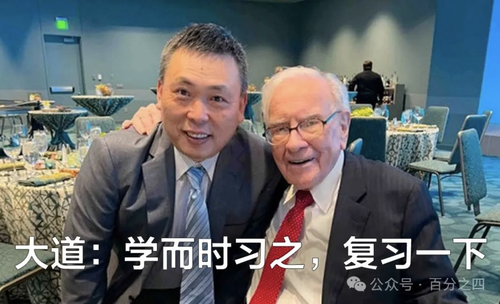

本文摘录自大道博客！（段永平的网名叫“大道”）

1：“You can't make a good deal with a bad person.” 你和一个道德品质败坏的人，无法完成一桩好交易。这意味着在与他人合作时，对方的品德是首要考量因素。一个缺乏诚信和道德准则的人，很可能会为了自身利益而不择手段，从而破坏交易的公平性和稳定性。
（大道批注：所以要避开和不信任的人做伙伴。如果你不信任一家公司就不应该投资这家公司。）

2：“It's easier to stay out of trouble than it is to get out of trouble.” 与其杀死毒龙，不如避开毒龙。在生活和工作中，我们常常会面临各种潜在的麻烦和风险。与其在陷入困境后再费尽心思去解决，不如提前预防，主动避开那些可能导致麻烦的因素。
（大道批注：为什么翻成毒龙？直译是：避开麻烦比解决麻烦要容易。老巴还说过另一个很有趣的句子：如果你已经在坑里那就别再往下挖了。）

3：“The market, like the Lord, helps those who help themselves. But unlike the Lord, the market does not forgive those who know not what they do.” 市场就像上帝，只帮助那些本身就很努力的人。但与上帝不同的是，市场不会宽恕那些不清楚自己在干什么的人。这表明在市场中，个人的努力和主动性至关重要，而盲目跟风或无知的行为往往会导致失败。
（大道批注：上帝只助自助之人，所以不懂的东西不要碰。）

4：“My idea of a group decision is to look in the mirror.” 在我做决策之前，我会掂量一下自己的分量。这意味着在做重要决策时，要依靠自己的判断和思考，而不是盲目跟随他人的意见。
（大道批注：应该是独立思考的意思，就是跟镜子里的自己讨论，而不是从众。）

5：“In looking for someone to hire, you look for three qualities: integrity, intelligence, and energy. But the most important is integrity because if they don't have that, the other two qualities, intelligence and energy, are going to kill you.” 在你雇佣人之前，你必须要确认他是否拥有三项素质：正直诚实，聪明能干，精力充沛。但是最重要的是正直诚实，因为如果他不正直诚实而又具备了聪明能干和精力充沛，你的好日子也就到头了。这强调了在团队中，一个人的品德比其能力和精力更为关键。
（大道批注：就是做对的事情和把事情做对的概念。）

6：“Never ask a barber if you need a haircut.” 千万不要问理发师是否需要理发。这暗示着在获取信息和建议时，要选择合适的对象，避免从自身利益相关者那里得到有偏差的意见。
（大道批注：知道老巴为什么认为拜访公司不一定有用了吧？）

7：“A public-opinion poll is no substitute for thought.” 一个公开的民意测验无法代替思考。说明不能仅仅依赖大众的看法来做决策，而应该经过自己深入的分析和思考。
（大道批注：每天股市都是在做民意测验。）

8：“If you let yourself be undisciplined on the small things, you will probably be undisciplined on the large things as well.” 如果你在小事上无原则，那么在大事上一样没有原则。意味着培养良好的自律习惯要从点滴小事做起。
（大道批注：勿以恶小而为之。）

9：“What we learn from history is that people don't learn from history.” 我在历史中学到的唯一东西就是：大众从未从历史中汲取教训。这提醒我们要以史为鉴，避免重蹈覆辙。
（大道批注：所以投资总是有机会的。）

10：“Rule No. 1: Never lose money. Rule No. 2: Never forget Rule No.1.” 规则一：永远不要亏钱。 规则二：永远不要忘记规则一。强调了在投资中保守本金的重要性。
（大道批注：早期以为这是玩笑或调侃，后来明白其实说的是要做对的事情，或者说是不要做错的事情。）

11：“我和查理之所以取得目前的成就，是因为我们关心的是寻找那些我们可以跨越的一英尺障碍，而不是去想拥有什么能飞越七英尺高的能力。” 这表明成功并非是要追求超乎寻常的能力，而是在自己擅长的领域内稳扎稳打。
（大道批注：这个说的也是能力圈的问题。经常看到人们在讨论本身一头雾水的投资概念，让我常常想起这话。）

12：“在别人恐惧时我贪婪，在别人贪婪时我恐惧。” 这是一种逆向投资的思维方式，要求我们在投资决策中克服人性的弱点。
（大道批注：无）

13：“如果你不愿意拥有一只股票十年，那就不要考虑拥有它十分钟。” 强调了长期投资的重要性。
（大道批注：这是所谓价值投资者决定买股票时要过的第一关。）

14：“拥有一只股票，期待它下个早晨就上涨是十分愚蠢的。” 提醒投资者要有耐心和长远的眼光。
（大道批注：无）

15：“我想我不会投资黄金，因为我看不出将这种金属从南非的地底挖出，再把它放到福克斯堡的金库中有何意义。” 反映了巴菲特对黄金投资的独特看法。
（大道批注：无）

16：“Investing is not a game where the guy with an IQ of 160 beats the guy with an IQ of 130.” 投资并非一个智商为 160 的人就一定能击败智商为 130 的人的游戏。说明投资成功不仅仅取决于智力。
（大道批注：大概智商高的人未必知道自己的能力圈边界在哪里，但智商高的人可能往往容易越出自己的能力圈。）

17：“Value investing can't guarantee us profits, but it gives us the only chance to achieve real success.” 价值投资不能保证我们盈利，但是价值投资给我们提供了走向真正成功的唯一机会。凸显了价值投资的长期价值。
（大道批注：无）

18：“Even if Federal Reserve Chairman Greenspan secretly told me his monetary policy for the next two years, I wouldn't change any of my actions.” 就算美联储主席格林斯潘偷偷告诉我他未来二年的货币政策，我也不会改变我的任何一个作为。体现了独立思考的重要性。
（大道批注：要靠独立思考。）

19：“I'm very rational. Many people are smarter than me and work longer and harder, but I act more rationally. You must be able to control yourself and not let emotions dictate your reason. If you can't control yourself, you're headed for disaster.” 我很理性。很多人比我智商更高，很多人也比我工作时间更长、更努力，但我做事更加理性。你必须能够控制自己，不要让情感左右你的理智。如果你不能控制住你自己，你迟早会大祸临头。
（大道批注：要理性，要做对的事情。）

20：“Different people understand different industries. The most important thing is to know which industries you understand and when your investment decisions are exactly within your circle of competence. I only do what I fully understand.” 不同的人理解不同的行业。最重要的事情是知道你自己理解哪些行业，以及什么时候你的投资决策正好在你自己的能力圈内。我只做我完全明白的事。
（大道批注：知道自己能力圈有多大比能力圈有多大要重要的多。或者说，即使能力圈很大的人，在能力圈外也是会很惨的。）

21：“Many things are profitable to do, but you must stick to doing those within your ability. We have no way to defeat Tyson. I'm a very realistic person. I know what I can do and I like my job. Maybe becoming a professional baseball star is great, but it's not realistic.” 很多事情做起来都会有利可图，但是，你必须坚持只做那些自己能力范围内的事情，我们没有任何办法击倒泰森。我是一个非常现实的人，我知道自己能够做什么，而且我喜欢我的工作。也许成为一个职业棒球大联盟的球星非常不错，但这是不现实的。
（大道批注：还是说要待在能力圈内。待在能力圈内说起来容易，但大多数人做不到。）

22：“For your circle of competence, the most important thing is not the size of the circle, but how you can determine the boundaries of the circle. If you know where the boundaries of your circle are, you will be much richer than those whose circles are five times bigger but don't know where the boundaries are. No situation will induce me to make an investment decision outside the range of my circle of competence.” 对于你的能力圈来说，最重要的不是能力圈的范围大小，而是你如何能够确定能力圈的边界所在。如果你知道了能力圈的边界所在，你将比那些能力圈虽然比你大 5 倍却不知道边界所在的人要富有得多。任何情况都不会驱使我做出在能力圈范围以外的投资决策。
（大道批注：还是能力圈。）

23：“For most investors, what's important is not what they know, but whether they truly understand what they don't know.” 对于大多数投资者而言，重要的不是他到底知道什么，而是他们是否真正明白自己到底不知道什么。
（大道批注：还是能力圈。We don't know what we don't know.）

24：“If we can't find what we need within the range of our confidence, we won't expand the range. We'll just wait.” 如果我们不能在自己有信心的范围内找到需要的，我们不会扩大范围。我们只会等待。
（大道批注：还是能力圈。要耐心等待自己能力圈内出现投资目标，包括在能力圈内积极寻找。）

25：“Investing must be rational. If you don't understand it, don't do it.” 投资必须是理性的。如果你不能理解它，就不要做。
（大道批注：不懂不做，其实还是能力圈。）

26：“Start saving money and investing early. This is the best habit to develop.” 开始存钱并及早投资，这是最值得养成的好习惯。
（大道批注：就是找到好公司然后"buy to keep"。）

27：“From predictions you can learn a lot about predictors, but little about the future.” 从预言中你可以得知许多预言者的信息，但对未来却所获无几。
（大道批注：哈哈，这个说法很妙。）

28：“I have an internal scoreboard. If I do something that others don't like but I feel good about, I'll be happy. If others praise what I've done but I'm not satisfied, I won't be happy.” 我有一个内部得分牌。如果我做了某些其他人不喜欢但我感觉良好的事，我会很高兴。如果其他人称赞我所做过的事，但我自己却不满意，我不会高兴的。
（大道批注：独立思考！如果买了一只股票后到处问别人这只股票怎么样的话，那还是赶紧卖了吧。）

29：“Investing in a market where people believe in market efficiency is like playing bridge with someone who has been told that it doesn't pay to look at the cards.” 在一个人们相信市场有效性的市场里投资，就像与某个被告知看牌没有好处的人在一起打桥牌。如果市场总是有效的，我只会成为一个在大街上手拎马口铁罐的流浪汉。
（大道批注：其实市场确实在很多时候是很有效的。但市场一定会有胡来的时候。）

30：“Current financial courses may only help you do mediocre things.” 目前的金融课程可能只会帮助你做出庸凡之事。
（大道批注：很会投资的人有谁愿意去教投资呢！）

31：“There is no formula that can calculate the intrinsic value of a business. You really have to understand the business.” 没有一个能计算出企业内在价值的公式。你得真的懂这个企业。
（大道批注：哦，老巴也这么说！所以，告诉你有公式可以算出公司价值的人都是蒙人的。）

32：“You don't have to wait for a business to hit rock bottom to buy its stock. The price of the stock you choose should be lower than what you think its value is and the business should be run by honest and capable people. But if you can buy shares of a company for less than what it's currently worth, you have confidence in its management, and you also buy a batch of similar companies' shares, then your profits are just around the corner.” 不必等到企业降至谷底才去购买它的股票。所选企业股票的售价要低于你所认为的它的价值并且企业要由诚实而有能力的人经营。但是，你若能以低于一家企业目前所值的钱买进它的股份，你对它的管理有信心，同时你又买进了一批类似于该企业的股份，那你赚钱就指日可待了。
（大道批注：Right Business + Right People + Right Price, 长期经营！其实就是现金流折现的意思。好公司的未来好，未来现金流折现好，就算眼前价钱高一点点也是合算的。）

33：“Today's investors don't profit from yesterday's growth.” 今天的投资者不是从昨天的增长中获利的。
（大道批注：所以不能根据过去的 pe 或 peg 来投资。）

34：“Berkshire is like the Metropolitan Museum of Art in the business world. We prefer to collect the greatest businesses of contemporary times.” 伯克希尔就像是商业界的大都会美术馆，我们偏爱收集当代最伟大的企业。
（大道批注：伟大企业就像古董，越来越值钱。）

35：“You are dealing with a lot of fools in the market. It's like a huge casino where everyone else is guzzling. If you keep drinking Pepsi, you might win the lottery.” 你是在市场中与许多蠢人打交道，这就像一个巨大的赌场，除你之外每一个人都在狂吞豪饮。如果你一直喝百事可乐，你可能会中奖。
（大道批注：不明白当时他为什么不说和可口可乐？可惜这里不是原文。）

36：In times of poor business, we spread rumors that our candy has the effect of an aphrodisiac, which is very effective. But rumors are lies, while candy is not.
在商业不景气时，我们散布谣言说，我们的糖果有着春药的功效，这样非常有效。但谣言是谎言，而糖果则不然。
（大道批注：我猜一条是说谣言是不可能持久的，但糖果可以，大概意思是好企业不靠谣言类的东西。）

37：Only when the tide recedes will you know who has been swimming naked.
只有在潮水退去时，你才会知道谁一直在裸泳。
（大道批注：无）

38：If you mainly learn knowledge from others, you don't need to have too many new ideas of your own, you just need to apply the best knowledge you have learned.
如果你基本从别人那里学知识，你无需有太多自己的新观点，你只需应用你学到的最好的知识。
（大道批注：无）

39：“Do not invest in a business that even fools can do, because one day fools will do it.”
不要投资一门蠢人都可以做的生意，因为终有一日蠢人都会这样做。
（大道批注：产品要有差异化，不然最后就是惨烈的价格竞争。目前国内在美国上市的那些个光伏企业就是很好的例子。）

40：If you succeed at the beginning, do not seek other ways.如开始就成功，就不要另觅他途。
（大道批注：还是能力圈。）

41：By regularly investing in index funds, even novice investors can achieve returns that exceed those of most professional investment masters!
通过定期投资于指数基金，那些门外汉投资者都可以获得超过多数专业投资大师的业绩！
（大道批注：老巴说的是美国的指数基金。）

42：Wishing to engage in swing trading in the stock market is something gods do, not something humans do. 
想要在股市从事波段操作是神做的事，不是人做的事。
（大道批注：有时是神有时是鬼。）

43：在1919年，可口可乐公司上市，价格40美元左右。一年后，股价降了50％，只有19美元。然后是瓶装问题，糖料涨价等等。一些年后，又发生了大萧条、第二次世界大战、核武器竞赛等等，总是有这样或那样不利的事件。但是，如果你在一开始用40块钱买了一股，然后你把派发的红利继续投资于它，那么现在，当初40美元可口可乐公司的股票，已经变成了500万。这个事实压倒了一切。如果你看对了生意模式，你就会赚很多钱。
（大道批注：无）

44： 一个杰出的企业可以预计到，将来可能会发生什么，但不一定知道何时会发生。重心需要放在“什么”上面，而不是“何时”上。如果对“什么”的判断是正确的，那么对“何时”大可不必过虑。
（大道批注：重要的是“什么”而不是“何时”，那些天天在那里预测时间的人总会有蒙对的时候，但其实他们自己都不相信自己的预测哪次会对。）

45：我们不想以最便宜的价格买最糟糕的家具，我们要的是按合理的价格买最好的家具。同样，拥有一颗钻石的一部分，也要比完全拥有一块莱茵石好得多。
（大道批注：无）

46：利率就像是投资上的地心引力一样，我对总体经济一窍不通。
（大道批注：好多人以为自己看看新闻就能比老巴明白，可笑不？）

47：“As long as I think about the fact that 2.5 billion men will need to shave the next morning, I can fall asleep peacefully every night.”
只要想到隔天早上会有25亿男性需要刮胡子，我每晚都能安然入睡。
（大道批注：老巴谈到对于吉列刮胡刀持股的看法。）

48：所谓拥有特许权的事业，是指那些可以轻易提高价格，且只需额外多投入一些资金，便可增加销售量与市场占有率的企业。
（大道批注：无）

49：有的企业有高耸的护城河，里头还有凶猛的鳄鱼、海盗与鲨鱼守护着，这才是你应该投资的企业。
（大道批注：无）

50：The definition of a great company is as follows: a company that can still maintain its great company status after 25 or 30 years.伟大企业的定义如下：在25年或30年仍然能够保持其伟大企业地位的企业。
（大道批注：这个定义好！）

51：我们的投资仍然是集中于很少几只股票，而且在概念上非常简单：真正伟大的投资理念常常用简单的一句话就能概括。我们喜欢一个具有持续竞争优势并且由一群既能干又全心全意为股东服务的人来管理的企业。当发现具备这些特征的企业而且我们又能以合理的价格购买时，我们几乎不可能出错。
（大道批注：无）

52：The truly great investment philosophy can often be summarized in a simple sentence!真正伟大的投资理念常常用简单的一句话就能概括！
（大道批注：真传一句话，假传万卷书。）

53：不能承受股价下跌50%的人就不应该投资股票。
（大道批注：无）

54： 当人们忘记“2+2=4”这种最基本的常识时，就该是脱手离场的时候了。
（大道批注：有点6000点的味道。）

55：我学会了只与我喜欢，信任和敬佩的人一起开展业务，基本上不与自己不喜欢的人合作。
（大道批注：所谓的财富自由并不是拥有很多钱，而是不为钱做自己不喜欢的事情。）

56：我要我的儿子以小写拼出自己的名字，以使每一个人都认识到，他是那个没钱的巴菲特。想过超级富翁的生活，别指望你老爸。
（大道批注：对子女们说的。）

57：就算是杰西欧文斯的小孩要参加百公尺赛跑，也不能享受从50公尺线起跑的待遇。富人应当给自己的孩子留下足够的财富，以便让他们能干他们想干的事情，但不能让他们有了足够的财富后可以什么都不干。
（大道批注：can do anything but not do nothing. 杰西欧文斯，美国黑人田径明星，短跑运动员，被誉为“黑色闪电”。）

58：若让微软总裁比尔·盖茨去卖热狗，他一样可以成为热狗王。比尔·盖茨是我的好朋友，他可能是世界上最聪明的人，至于那小东西（指计算机）是做什么用的，我一点也不清楚。
（大道批注：同意！）

59：无论谁一旦与我同一个战壕，他就能拿枪指着我的脑袋。
（大道批注：意思是要和彼此信任的人一起工作，就像信任一个战壕的战友一样。老巴很多次提到和喜欢及信任的人一起工作。）

60：有人曾经说过，当寻找受雇的职员时，你要从中寻找三种品质 —— 正直、勤奋、活力。而且，如果他们不拥有第一品质，其余两个将毁灭你。对此你要深思，这一点是千真万确的。如果你雇用了没有第二种品质的某些人，你实际上想要他们既哑又懒。
（大道批注：“如果你雇用了没有第二种品质的某些人，你实际上想要他们既哑又懒。” 这里应该是“如果你雇用了没有第一种品质的某些人，你实际上想要他们既哑又懒。”）

61：在错误的道路上，奔跑也没有用。
（大道批注：做正确的事情、把事情做正确）

62：I would rather have a vague right than a precise wrong.
我宁要模糊的正确，也不要精确的错误。
（大道批注：做正确的事情）