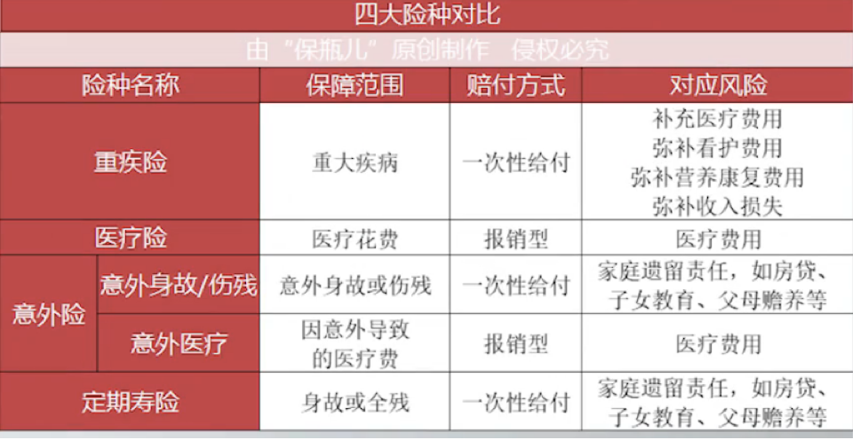
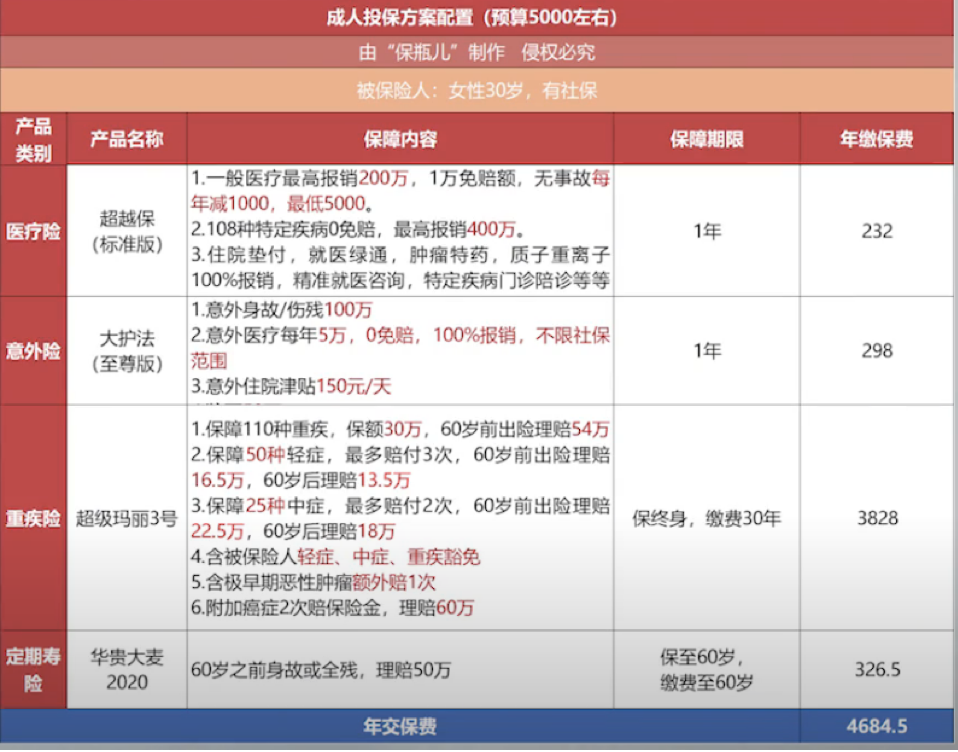
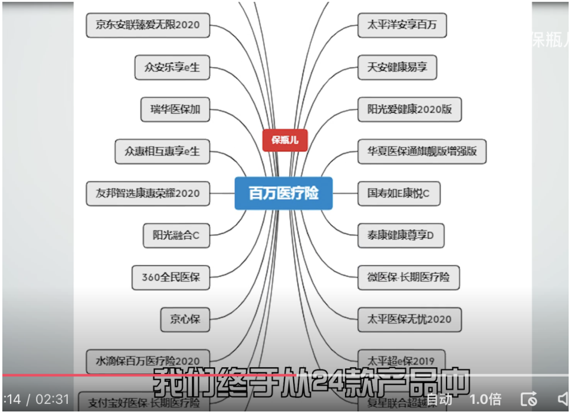
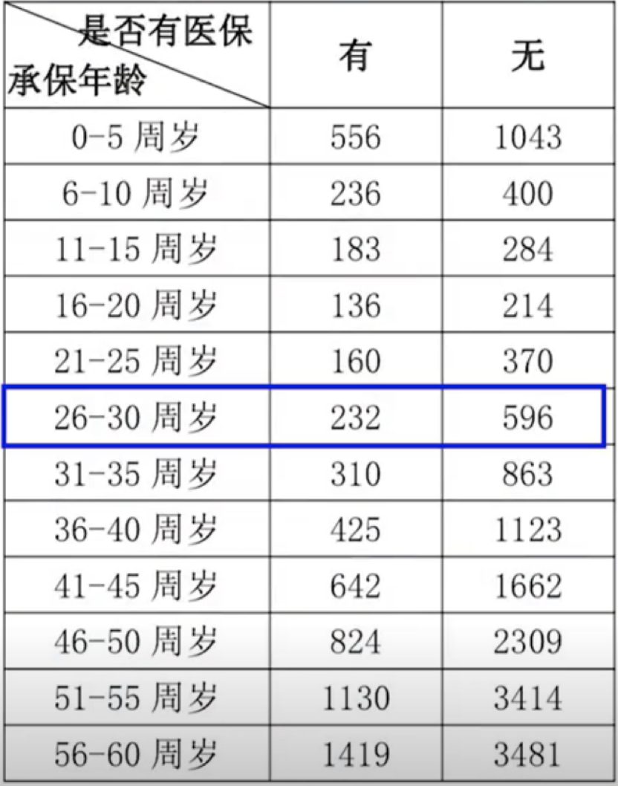

远离三大误区
1.不买社保
社保是最基础的部分，要先把这个买上，尤其是里边的医保和养老
如果不知道怎么买，怎么样，点击主页，收藏下社保合集，讲的特别详细

2.买所谓的返还型保险

3.选择大而全的保险

成年人买保险其实是转移风险，如果你没有面临这类风险，那就没有买保险的必要
首先：生大病和面临意外的风险，重大疾病风险课通过重疾险和医疗险转移
意外风险可通过意外险和医疗险转移
成家立业后，还要有房贷，孩子教育，老人赡养等责任，需要寿险转移身故的风险

那每个险种要怎么挑选
重疾险：最重要的是保额要充足
因为生大病后出了医疗费，至少要3-5年不能工作，保额充足之后再考虑保障期限，单次多次赔付之类的

医疗险：他很简单，也很便宜一年几百块
但百万医疗险的细节很多，1.看保障内容是否全 2.续保条件，不能是第一年买完生病了，第二年就不让买的产品

意外险：有猫腻的是意外医疗，报销比例，免赔额，能不能报自费药都很关键

寿险：注意要买定期寿险，而不是终身寿险，终身寿险是用来财富传承的，定期寿险才是保障

每个险种性价比最高的方案

百万医疗险最高可保险400万医疗费，而且是6年保证续保
百万意外险只要298，除了意外身故和伤残之外，还有50万的猝死责任，而且意外医疗是不限社保用药，没有免赔额100%报销，也就是意外导致的医疗费5万一下的自己不用掏钱

最大头的就是重疾险，这款产品的优势，60岁之前可额外赔付80%，就是你买了30万保额，60岁之前不幸得了癌症，能陪你54万，除此之外还加上了癌症二次赔的责任，因为女性最高发的就是癌症，加上他之后，癌症的新发复发，二次转移都可以再陪一次，
而50万的定期寿险保到60岁，每年只需326

以下三款百万医疗保障最全面
众安的尊享e生
好医保的长期医疗
复兴联合超越保

百万医疗险的价格表

