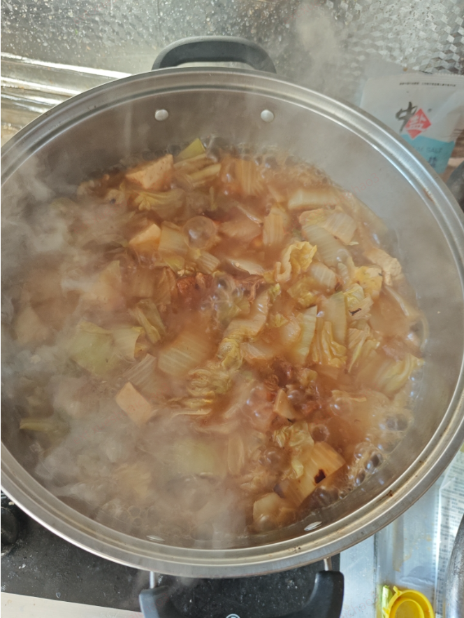

要控制买菜的欲望
买了6个柿子椒，4捆的芹菜，还有两个大白菜，还有一斤多的肉，总以为有点少，还想买个萝卜，幸亏腾达叫住了，不然就更累了，这么多菜做了17包，以后就照这个来做。

### 炒肉
炒肉时不需要将一个个都炸出油，将炸好的都拿出来，那样太干了。
小火炒到有点糊锅了，下边有点粘住了。并且有零星两个焦黄了，就可以了，放生抽，老抽，加开水没过就可以了，小火煮半个小时(加一个桂皮和一个香叶)，这时候肥肉也出油了。

做菜不要太咸，只放生抽就行了，不要再放盐了

炒白菜蓄水时，看着菜还硬，不要把菜全部没过，那样太多了，不要抹过，水面稍微矮一点，等菜熬软了，水也就多了

