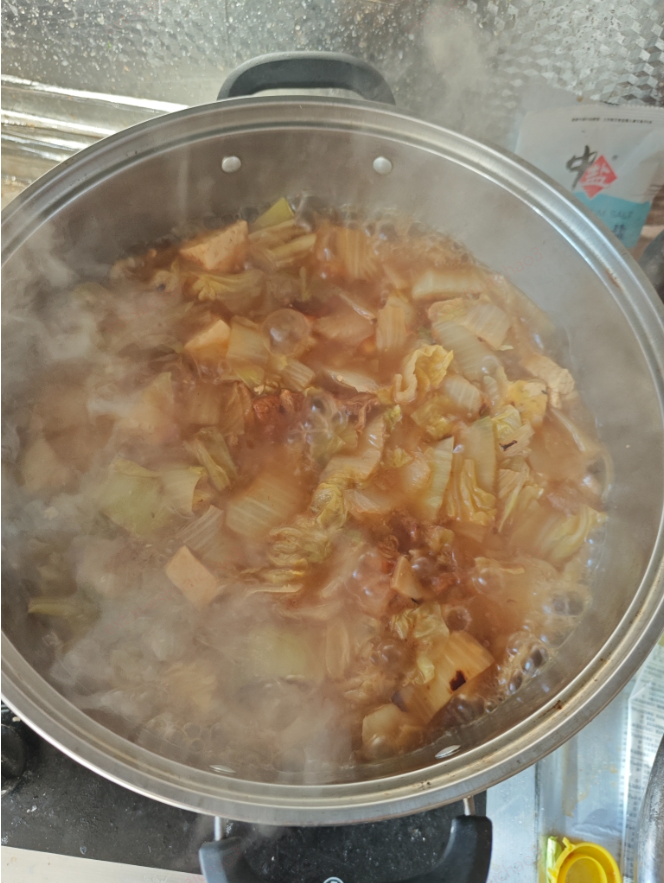

### 要控制买菜的欲望
买了6个柿子椒，4捆的芹菜，还有两个大白菜，还有一斤多的肉，总以为有点少，还想买个萝卜，幸亏腾达叫住了，不然就更累了，这么多菜做了17包，以后就照这个来做。

### 炒肉
炒肉时不需要将一个个都炸出油，将炸好的都拿出来，那样太干了。
小火炒到有点糊锅了，下边有点粘住了。并且有零星两个焦黄了，就可以了，放生抽，老抽，加开水没过就可以了，小火煮半个小时(加一个桂皮和一个香叶)，这时候肥肉也出油了。

### 做菜不要太咸，只放生抽就行了，不要再放盐了

### 炒白菜蓄水时，看着菜还硬，不要把菜全部没过，那样太多了，不要抹过，水面稍微矮一点，等菜熬软了，水也就多了

### 炒芹菜也是，放生抽后也会大量出水，所以一开始用水煮时不要放太多谁，或者说后期弄出来点再放生抽

==========================================
### 柿子椒炒肉
配料：肉片，柿子椒，葱姜
先炒肉，变色后，加入葱姜，然后再放柿子椒，炒到辣椒微微发软之后，加一点生抽和老抽，鸡精和盐，
继续翻炒，酱油炒香之后就可以了，

我的错误：柿子椒过水了，而且过水太狠，下次不要过水，生抽放少了，3顿饭应该放3勺

### 鸡蛋炒馒头
如果没有容器搅拌鸡蛋馒头，就先放鸡蛋紧接着放馒头，搅拌，可以放水，但不要放生抽，因为会糊锅，
调味，放鸡精，盐就行，可以炒熟后放葱花

禁忌：不要放生抽，因为会糊锅
如果有白菜则可以放生抽