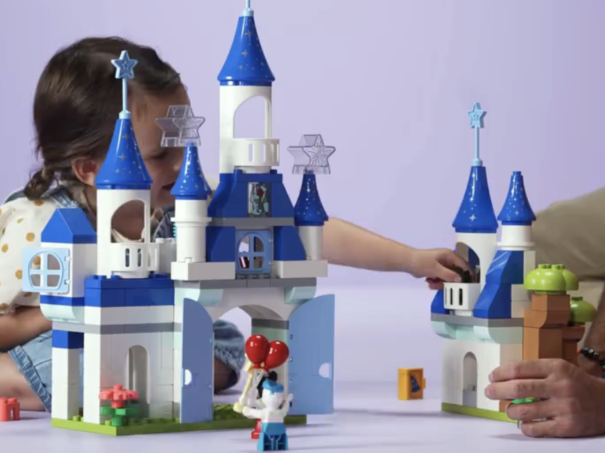
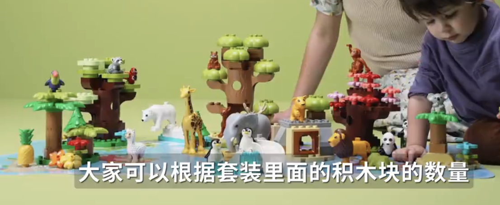
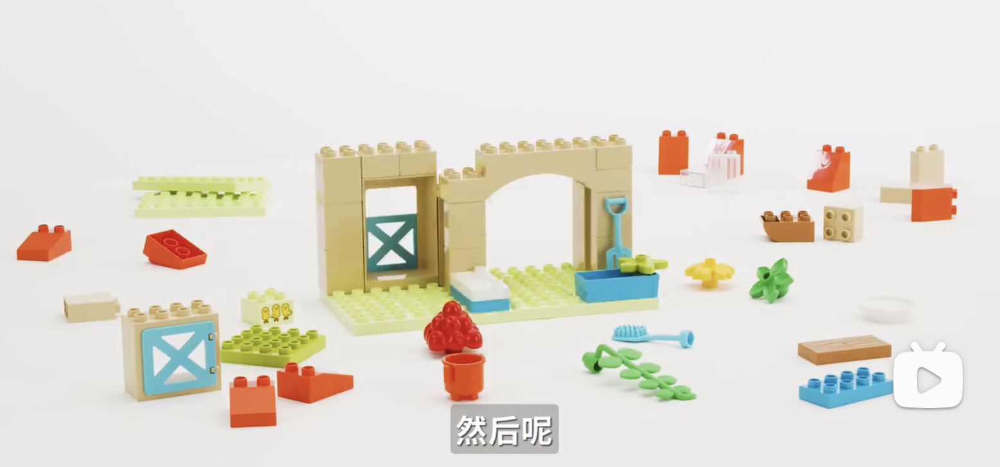
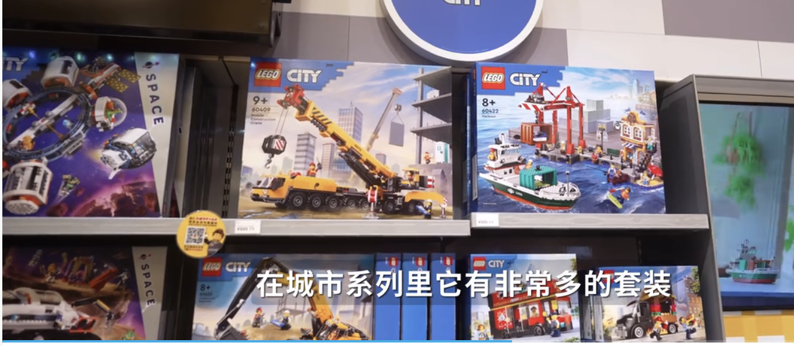

### 乐高怎么买
积木可以分成六大类
- 基础积木：就是最基础的方块
- 特殊积木：轮子，齿轮，树木等
- 迷你人偶
- 主题套装：比如城市主题，哈利波特主题等，这个是现在乐高产品最重要的部分，按照主题出售也是最主要的销售模式，在售的主题有40多个
- 教育&科技：用于教育和编程，属于STEM教具
- 收藏&高端：面向成年人，比如乐高建筑

玩乐高主要有三个年龄段
- 1.5-5岁，只有一个类型的可推荐，就是大颗粒的duplo(得宝)系列，duplo有很多主题，比如三合一的魔法城堡，野生动物系列

- 5-12岁，这个年龄端比较多了，比如城市系列、朋友系列

### 好玩的积木推荐

木块积木：可来赛89 100粒
大颗粒塑料积木： 费乐大颗粒积木

#### 积木条
博主推荐：弥鹿或者kapla都可以，视频里是弥鹿的，博主买了一盒300片的，然后两盒100片的，淘宝弥鹿旗舰店，报“芋头和老爸”的名字有折扣！具体可以问他们客服！
尺寸：11.7*2.3*0.8，1:3:15的比例，要求3个叠起来，和宽度一样高，5个并排一起，和1个一样高
mideer 152，300个

### 优质和劣质积木的区别，是松木和榉木吗，密度是多少，之前买的是松木吗？
是的，只有木

### 不通材质的区别
1、松木、荷木、桦木、榉木、橡胶木。
2、绝大多数中低端积木都是使用松木，松木色淡黄、疖疤多、对大气温度反应快、容易胀大、极难自然风干，加工前故需经人工处理，如烘干、脱脂、漂白、中和，使之不易变形，但是实际松木制积木特别是低端产品还是岩梁比较容易产生结疤判颤、裂纹、变形等现象。
3、荷木材质坚硬，显浅灰粗冲运色，纹理直，木材耐久、耐腐、耐磨，适用于地板、高级家具、室内装饰等，有些中低端木积木会采用这种木材。
4、桦木呈淡褐色至红褐色，结构细腻而柔和光滑，富有弹性，干燥时易开裂翘曲，不耐磨，加工性能好，切面光滑，油漆和胶合性能好，一般应用于中高端积木。
5、榉木重、坚固，抗冲击，纹理清晰，质地均匀，色调柔和流畅。比多数普通硬木都重，在所有的木材硬度排行上，属于中上水平，为中高档积木用材，也应用于高端积木中。
6、橡胶木为优良家具用材，具有比较鲜明的山形木纹，并且触摸表面有着良好的质感，呈浅黄褐色，年轮明显，木质结构粗且均匀，纹理斜，木质较硬，切面光滑，易胶粘，油漆涂装性能好。