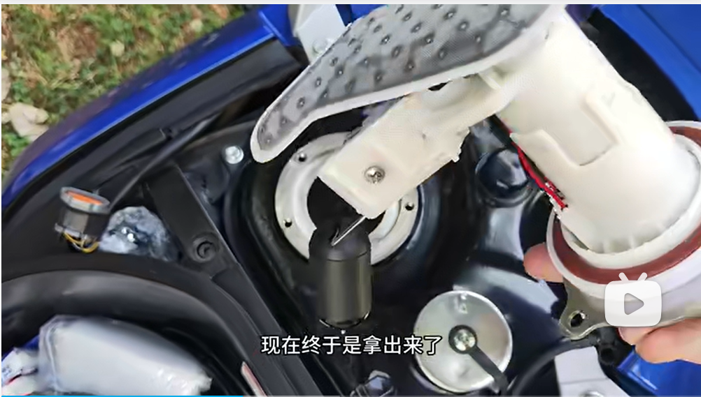

### 上次保养时间
在9000公里时换的机油

### 摩托车打不着火可能的原因有哪些
打不着不要一直打，容易把电打没了
油少
电瓶没电
车太冷
油泵出现故障，油压上不去

### 火花塞是什么

喷油嘴

### 怎么踩打火棍
直接踩就行，别人踩三下就直接着了，不用做别的，也别太用力，再给踩坏了
电瓶亏电，可以踩点火棍，前提是把钥匙开关打开，如果还是打不开，可以轻轻带一点油门

化油器的踏板冬天打不着无非就是气门缝隙过紧，电子风门堵了。前者需要9mm扳手调后者清洗化油器电子风门

### 燃油过滤器

### 节气门是控制空气进入发动机的一道可控阀门，就是常说的油门，
以下情况需要清洗，
1.用电脑读取节气门的开度，如果比新车的开度大很多，需要清洗
2.车辆出现油耗增加，动力变弱的情况
3.节气门出现积碳，
通常情况下，再1.5万公里需要清洗一下

### uy125冬天一键启动打不着火，脚启动得踩三次，才能启动，我想问问是不是通病
铃木uy125在冬天启动困难确实是一个常见的问题，这主要是由于冬天的低温导致的。以下是一些可能的原因和解决方法：1. 汽油温度降低：在低温下，汽油的粘度会增加，流动性会变差，这可能会导致混合气过稀，使得发动机启动困难。为了解决这个问题，可以尝试在启动前将车辆放置在温暖的地方，或者使用发动机罩等物品来保持发动机的温度。2. 润滑油粘度增大：在低温下，润滑油的粘度也会增加，这会增加发动机的启动阻力。为了解决这个问题，可以尝试使用冬季专用的低粘度润滑油。3. 电解液粘度增加：在低温下，电解液的粘度也会增加，这会影响电池的电流流动性，导致启动困难。为了解决这个问题，可以尝试使用预热器来提高电池的温度。4. 电瓶电量不足：如果电瓶的电量不足，也可能会导致启动困难。为了解决这个问题，可以尝试使用充电器为电瓶充电。5. 怠速调整不当：如果怠速调整不当，也可能会导致启动困难。为了解决这个问题，可以尝试调整怠速到正常的范围内。6. 火花塞问题：如果火花塞有问题，也可能会导致启动困难。为了解决这个问题，可以检查并更换火花塞。7. 化油器脏污：如果化油器脏污，也可能会导致启动困难。为了解决这个问题，可以清洗化油器。请注意，以上只是一些可能的原因和解决方法，具体情况还需要根据实际情况进行判断和处理。如果问题无法自行解决，建议及时联系专业的维修人员或铃木经销商进行诊断和修理。

### 日常加油
加油
7.9
36.1元 4.51升 260KM    

每升跑57.6  
5升能跑288公里，
5.2升能跑300公里
理论6升能跑345公里

7.15
35元 4.33升 8.1元/L  250KM
每升跑57.7

8.4
40元 5.02升 7.98元/L  275KM
每升跑54.7
