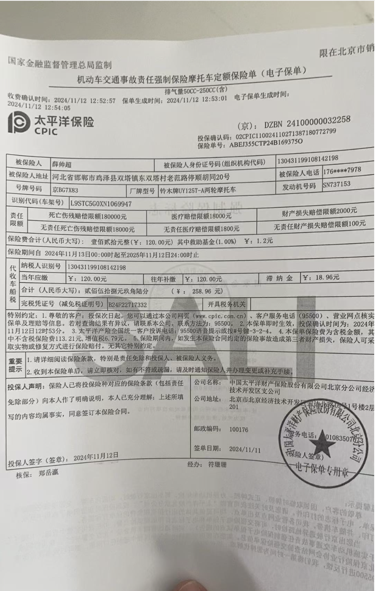

### 交强险有什么用

交强险可以理解为三者险，是保对方的。当发生事故时，用来赔付给对方

### 多少钱
- 摩托车是根据排量定价：
<50cc 80元/年
50cc-250cc 120元/年
>250cc  400元/年

- 车船税：都是60元/年

### 保什么
- 首先是保对方

保多少？分两种情况
1. 如果我们是有责任的一方，最高可赔付12.2万
其中死亡伤残，最高限额11万
医疗费用赔偿，最高限额1万
财产损失，最高限额2千

2.我们是无责任的一方，比如我们是次责，最高可赔付1.21万
其实就是刚才的都除以10，唯独财产损失配100元

### 二手车交易时，交强险是否需要过去
必须要过户

### 如何购买
线下买比较麻烦，推荐网上购买

### 理赔是全部赔吗

### 限制次数吗
不限制次数
保险可以报次数不限制。
只要在保险期以内，赔偿次数是不限制的，在保险期以内，保险始终是有效的。但是所有的车主在投保时都是有投保金额的，且今年的理赔次数及金额会影响续保价格。

### 怎么用
1.拨打122报警，-> 
2.根据现场定责，交警会开具事故责任认定书，-
3.由责任方拨打保险公司电话，并提供资料
4.双方离开
5.一般几个小时内，保险公司会练习你定损，通常是在车辆品牌店内，双方约定好时间地点，由店内提供维修清单及报价，理赔专员和你讨价还价后，最终确定理赔方案
费用一般是自行垫付，然后就可以开始修车了，车辆修好后，保险公司进行理赔

### 摩托车一旦发生交通事故该如何处理
1.照相
如果没有人伤，用照相或视频的形式记录下来，该挪车挪车，别影响他人通行
2.报警，打122定责
3.给保险公司打电话，是谁的责任，就练习自己的保险公司，进行赔付。有人问，如果对方选择私了，是不是就不用报警了，个人建议一定要去报警，出具责任认定书，避免后期扯皮。如果对方选择私了，但你不知道赔偿多少，就打车行电话，把车损，人伤，和误工费的情况汇总一个价钱，和对方协商，

如果不私了，走保险公司，打保险公司电话，对你车进行定损
4.修车理赔

