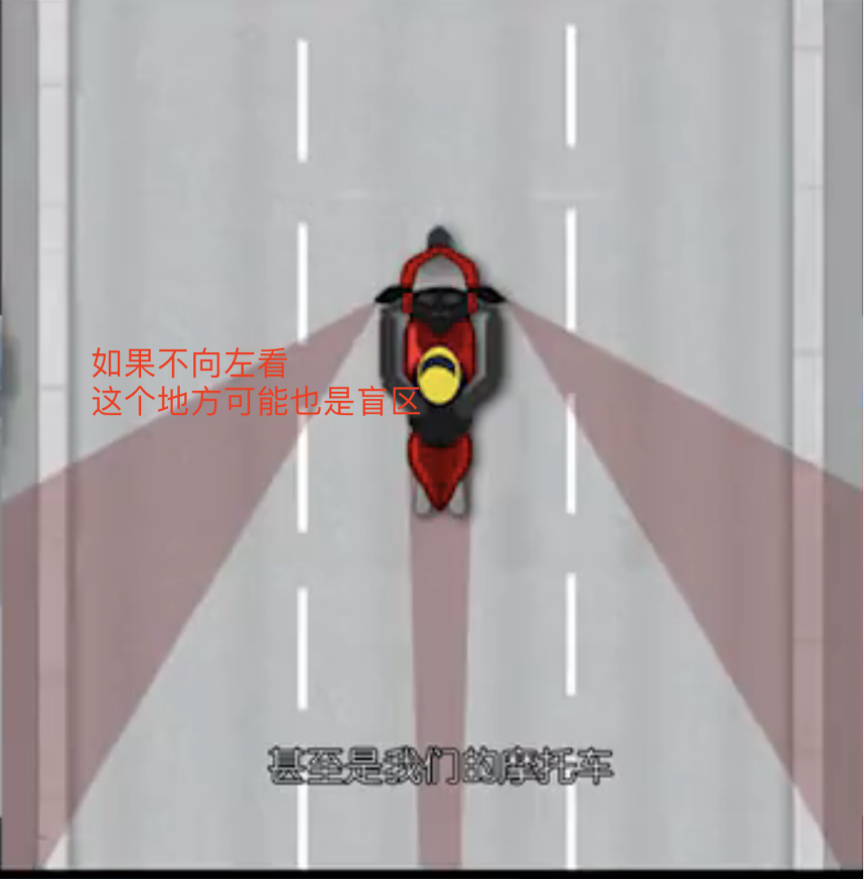

## 十年经验，泣血总结，摩托骑行7大保命守则
### 最重要：要掉头或拐弯的时候，要自己回头看一下，不要迷信后视镜，有时后视镜看不见来车，这个好习惯已经救了我好多次了
自己案例：
- 在燕郊，我在第二车道行驶，向左变道，没考虑到后边有车也可能是后视镜盲区，导致后车不断鸣笛，我加油门跑开了
- 从燕郊回顺义，我在辅路行驶，为了赶绿灯，我着急向左转弯，通过后视镜看到后方没车也可能是后视镜盲区，然后就听到后车紧急鸣笛，我赶紧加油门跑开了，
- 世超一起走车，我在前边走，向左变道因为后视镜盲区，汽车已经很近了，导致后车被迫刹车向左避让
- 从燕郊房子出门上班，在前方右转，此时我前方有个电车电车骑的比较慢，我一个油门直接超过，并从其前方右转，吓的那人直接刹车，并骂了一句

### 管住自己的右手，开车不斗气，斗气不开车
- 不要意气用事，我本来要要燕京航城的十字路口左转，突然旁边的车超了我，把我挤到右边的车道，我一下超过了他，这导致我在道路右侧，必须要等左边的直行车辆走完了才能左转，应该排队通过
- 晚上骑摩托车回家，感觉后边有辆电动车一直对我开远光灯，于是我就等他超过我，在他后边打开远光灯，事后回想很后悔。人家是电动车，又控制不了灯光，所以任何时候都不要赌气开车
- 晚上刚下地铁，骑摩托车回家，后边有辆小汽车，给我闪灯，示意我让一下，我想着你不一定有我快，便不让，并加快了速度，殊不知前边过桥，一下子把自己弹的老高。最终才让路。跟在后边走多好，还能让别人为自己开路

### 离路边违停车辆远点，防止开门杀
### 过路口一定要减速，防止有人冲出来
### 在前方有车辆占道的情况下，不要随意变道

### 保持车距，给别人留出犯错的空间

### 千万千万不要想事情，不要走神，那天我就走神差点撞了
### 不要着急回家，不要慌着过红灯，耽搁不了几分钟

不论是对方慢，还是我慢，都要注意，因为慢才容易突然转向

关于盲区的认识：
如果你方向盘已经向左打了，此时左侧盲区更大，此时如果汽车车位在盲区内，那车头可能距离你也很近了

我上班时，在非机动车道直行，遇到路口，此时一定要注意看右转车辆，不要抢着绕过人家车头，一个不注意就把你撞倒了，任何时候不要给人出其不意的感觉，一定要提前鸣笛，让人家注意到你，再通过

摩托车出事故了
第一次出事故，快到公司时，经过公司的大门口，一辆货车从门口出来，一辆摩托车在货车前边想要右拐，中间刚好有条缝，我看着摩托车不走，想要直接穿过去，快走到时，他突然右拐，我来不及刹车，就撞了上去，车子顺势倒了。看着车子没啥事，就算了，各走各的。

怎么说呢，不但拐弯时要看有没有直行的车，还要看直行时，有没有右转的车。
但这种情况发生在小细节的地方。也就是车速不快的情况下，越是这种情况越要注意，要做防御性驾驶。
1.开车不要着急，不要见缝就钻，等一会儿，如果要钻缝，必须要鸣笛，提醒对方，确认安全后再通过。
2.这种情况，左边那么大的地方你不走。非要从那儿走吗
3.早上出门，看到熟悉的老大爷早上倒三轮车，估计没看后边，把路过的电动车撞倒了，女人坐在地上，车祸就是巧合碰巧凑在一起，你可能很多次倒车都没问题，但这一次刚好有人从哪儿路过，就碰上了。所以要做到不立于危墙之下，防止那些没有安全意识的人将自己碰到。如果我是这女的，要离路边的车子远一点，或者鸣笛提醒对方，在或者停车等待，一定不要着急通过。
4.要注意静止的或速度慢的物体，因为速度越慢越容易突然变向，速度快的不容易变向。同理当自己为静止方时，改变状态时要看下有没有影响到别人。

昨天又出了点意外，到小区门口时，要右拐，速度有点快，然后对吗来了辆车，我一刹车，就顺势倒了，任何一个路口都要小心，不是说你熟悉了，就可以大意
