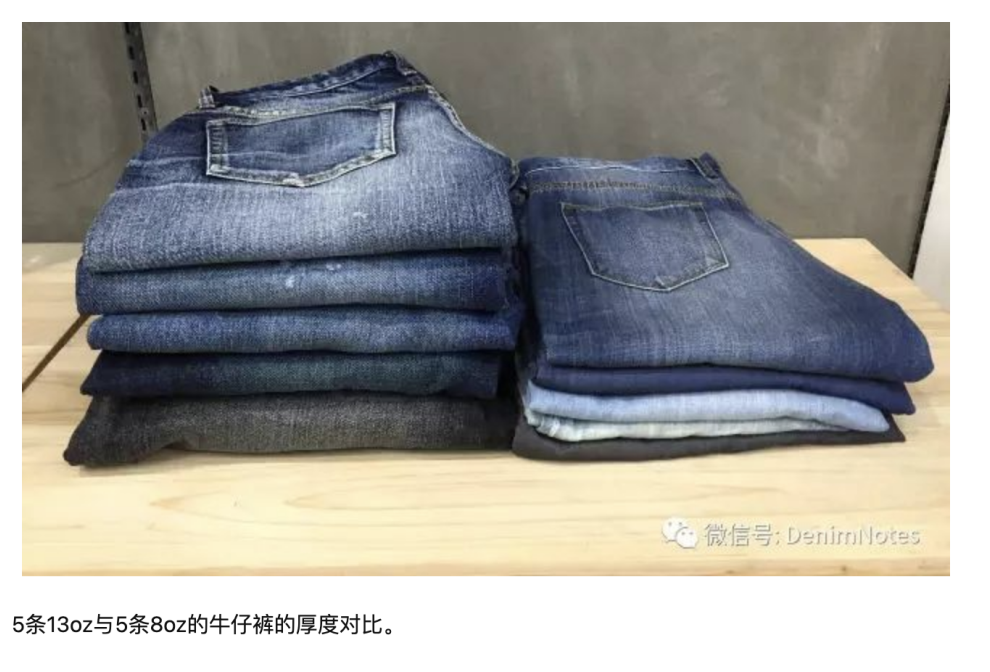

买牛仔裤要有版型

我买了两天真维斯的，但他们太薄了
又买了两条海澜之家的，版型还可以，但不知道为什么还是很薄，即便是夏天也不应该那么薄吧，思来想去还是觉得应该退了，

穿上我从优衣库买的牛仔裤后，感觉这样的厚度才是刚好的，有版型才行，而且买裤子不要太修身的，像海澜之家的衣裤，穿上后，稍微紧紧包裹大腿，这样衬托出大腿就像两根棍了，不要有这样的感觉，要像优衣库一样稍微宽松点的。

16不算重磅，低于13.75oz的都是轻量裤，11oz以下基本就是垃圾了。13.75-14.5oz算是标准，17oz以上才能算重磅，目前最重的据我所知是32oz。
话说回来，个人建议买牛仔裤还是在11.5-13.5oz之间购买，levis一般使用的都是11.5oz-13.5oz的丹宁布。

基本上来说，6oz的可以去看看那些牛仔衬衫。9oz基本上就是夏季款所谓的薄的牛仔裤。正常厚度牛仔裤一般用的是11.5oz-13.5oz，13.5oz是保证舒适度的最高点了（这个具有个人喜欢的因素），基本上14oz往上在初始穿着时已经不舒服了

