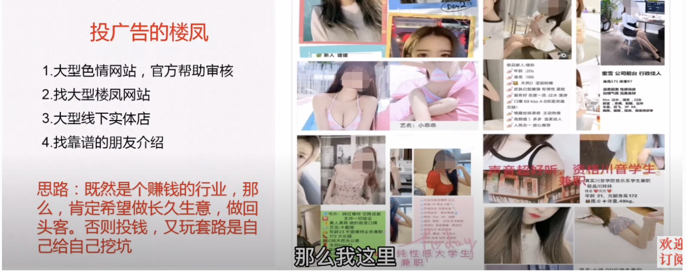
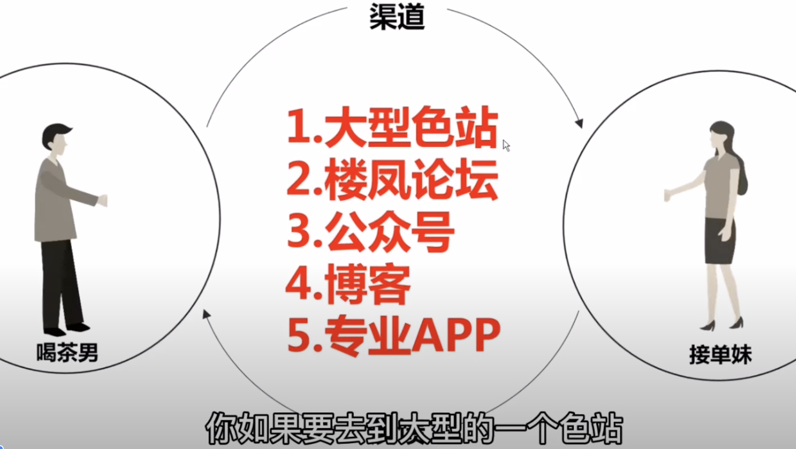
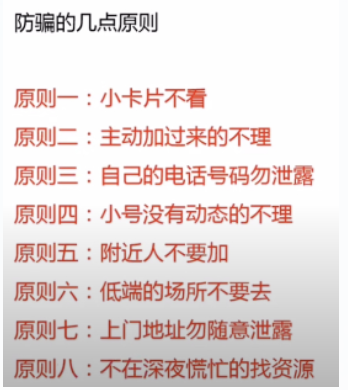
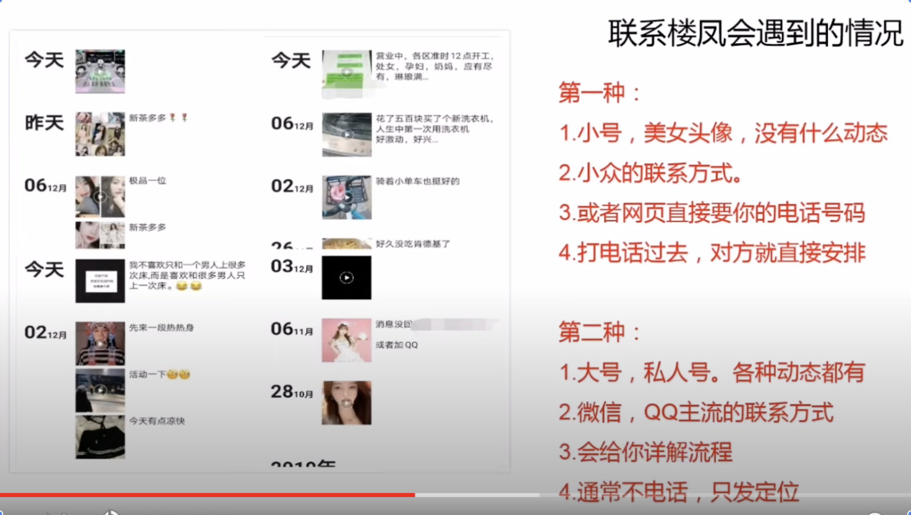
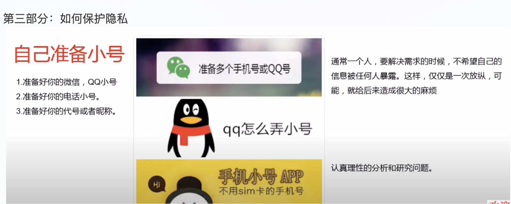
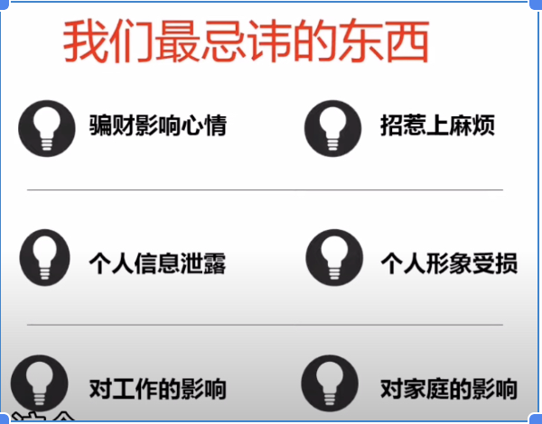
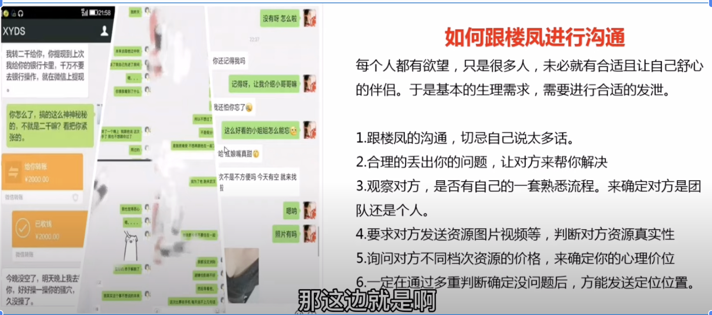
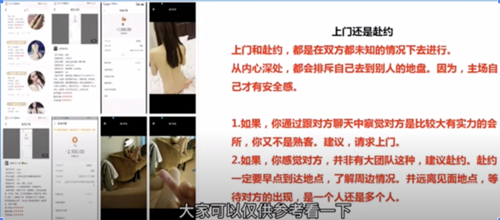
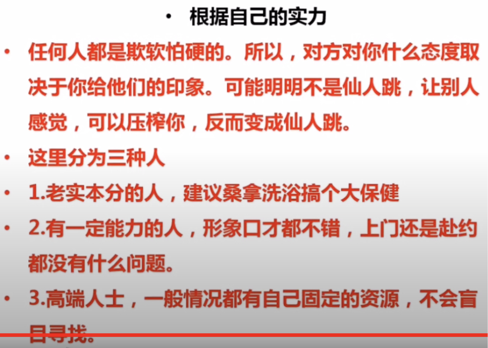

男人如何正确寻找楼凤修车资源福利，安全品茶经验分享，上门楼凤资源服务，还用害怕仙人跳？
第一部分：如何寻找楼凤，新手司机最容易犯错的地方，就是感性战胜理性的时候
投广告的楼凤比较靠谱

象酒店门缝塞小卡片的方式就是不靠谱的

不要直接去搜楼凤，搜索最新的词，比如上课，补课
去搜成本大的推广，成本大骗人的几率小，成本小骗人的几率大

第二部分：楼凤真假的判断

这是我用了很多次的小姐姐的微信，她每天都在更新，她可能很在意这个号，上边有很多客户，如果被封掉，损失会很大。所以你要了解对方行骗的成本达不到，如果成本太小，你被骗的几率就高。

第三部分：如何保护隐私

第四部分： 如何进行沟通

第五部分： 如何选择是上门还是赴约

