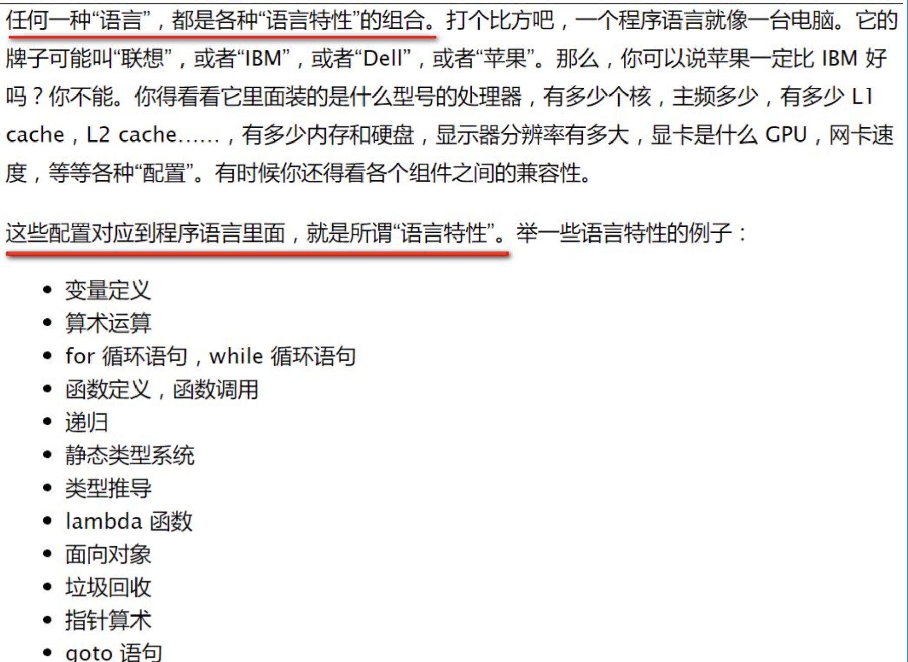
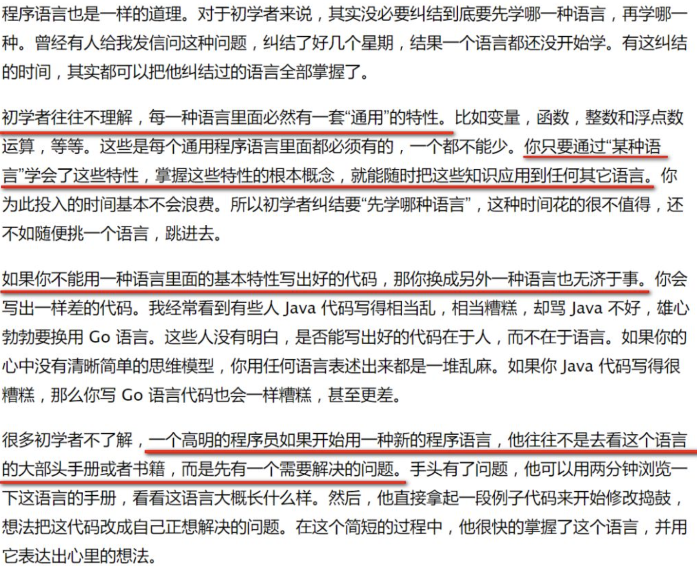
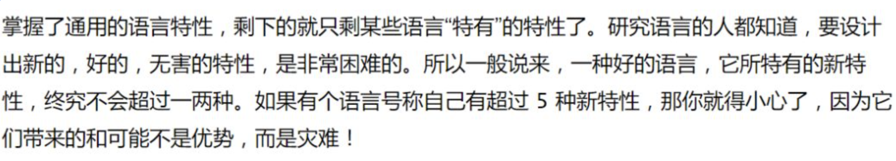

以前看论坛里有些朋友学自由泳换气时遇到这些问题：

“一次自由泳游下来，我觉得泳池里的水位都降低了，消失的部分全到我肚子里了”

“老子游自由泳时喝进去的尿比你这辈子喝的水还多！”

“冬天练自由泳换气，喝进去的水太多，每隔10分钟就要去一次厕所，怎么破?”

我自己的个人经历就是：自从我开始练自由泳换气，每次去游泳馆我再也不用带水了，换气时喝进去的水就足够了。

换气的道理我都懂，但是到了水里我就是做不好。

知乎上有个人说过，当你泡够了足够的时间，喝够了足够的水，自然就学会了。这个感觉需要你自己去领悟，网上的视频，教练的讲解，不能真正教会你。真正学会，只有靠你自己在水里去领悟。

我自己想想还真是这样，今年的12月份，我逐渐就能换上气了，换气时也不再喝水了。

我觉得这就像编程一样，当程序猿到达了一定量的代码量之后，或者是独自解决了一定数量的tricky problem之后，产生由量变到质变的一个转变。

当你在学一门编程语言 / 一种泳姿时，你该学什么？

我这人有个反思的习惯，这是我高中班主任兼数学老师高中三年灌输给我们班的，我很感激他。反思我过去这半年，为什么我虽然有了很牢固的蛙泳基础，自由泳却依然学的这么痛苦？

我反思的结果：

我照着去年学蛙泳的顺序学自由泳，从自由泳打腿开始，当打腿能够轻松前进25米之后，开始学划手，转体，换气，最后是全身配合。没错，无论是网上能找到的教学视频，还是现实游泳馆中的教练，都是这么教的。

我学的是什么？我学的只是自由泳的语法！这道理就像为什么当有的程序猿学一门新的编程语言时，把这么语言的所有语法从头到尾读了一遍，完了扔给他一个需求让他用这门语言实现，但是他还是觉得无从下手？

关于这个问题，中国程序界暗黑四大天王之一的王垠在他的著作里有了精辟的阐述，推荐每位年轻程序猿都去读读他的原文: 如何掌握所有的程序语言

以上是垠神的原文引用，再回到我自由泳的问题：我只学会了自由泳的语法，而没有领会自由泳的 “语言特性(paradigm)” !!

什么是自由泳的语言特性？一千个自由泳泳者可能有一千个, 不，没那么多，至少一百种答案。就我个人来说，结合我从不会换气到学会换气的过程，我认为是：侧身。

按照教科书上的说法，“背部和臀部的肌肉保持适当的紧张度，在游进中保持头部平稳，躯干围绕身体纵轴有节奏的自然转动35゜~45゜” 向下面这张图一样，想必你能清楚地观察到躯干转动35度到45度这一behavior吧?
而我，从一开始对这个转动，侧身的动作就很不适应，一侧身时我就很紧张，害怕水从鼻子里灌进去。在这种肌肉紧张的情况下，再去强行练划手，换气，效果可想而知。**问题的根源就是我游了一年多的蛙泳，身体肌肉已经熟悉了蛙泳那种在游进过程中，身体永远是俯卧在水里的语言特性。**当我从俯卧切换到侧身时，我的大脑会本能地对这种位置的变化产生抗拒，然后传递到我全身。客服

克服这个问题我用的也是最笨的办法： 老老实实泡了两个月。现在我的身体对侧卧已经非常适应了，我经常用侧卧的方式漂浮在水里，轻轻打腿保证身体原地悬浮，然后侧头从水里望向水面，观察水面被其他泳者游过而荡漾起的波纹，以及在水里观摩其他自由泳高手的打腿和划手动作。这时我才发现水里是如此安静，这是我以前游蛙泳无法领略到的。

如果是我来教别人自由泳，在学员打腿过关之后，我不会让他先开始练侧身打腿，而是会让他先从侧身漂浮开始。没错，就是侧身漂浮，什么时候觉得能够全身非常放松漂浮在水里了，什么时候就能开始练侧身打腿。因为我认为侧身转体是自由泳最重要的语言特性。

我们平凡人总是很羡慕C罗和孙杨在金球颁奖典礼上或者冠军领奖台上的风光，
而总是会去忽略他们背后做出的大量常人无法想象的艰苦训练：

————————————————
版权声明：本文为CSDN博主「汪子熙」的原创文章，遵循CC 4.0 BY-SA版权协议，转载请附上原文出处链接及本声明。
原文链接：https://blog.csdn.net/i042416/article/details/79120387

————————————————
版权声明：本文为CSDN博主「汪子熙」的原创文章，遵循CC 4.0 BY-SA版权协议，转载请附上原文出处链接及本声明。
原文链接：https://blog.csdn.net/i042416/article/details/79120387