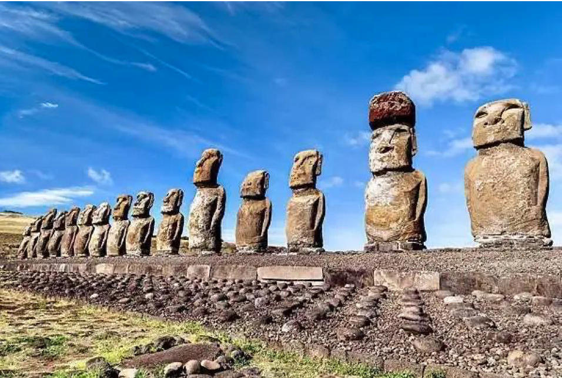
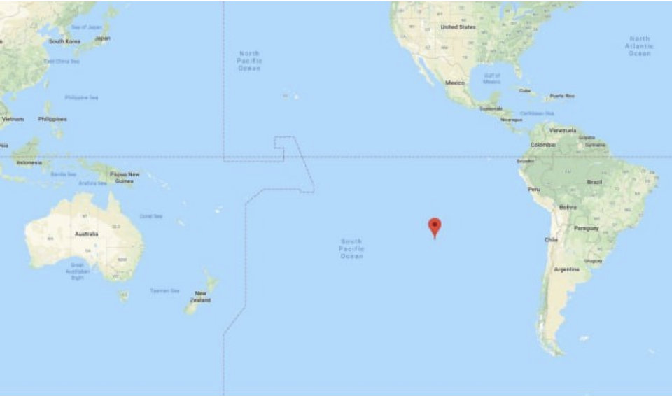
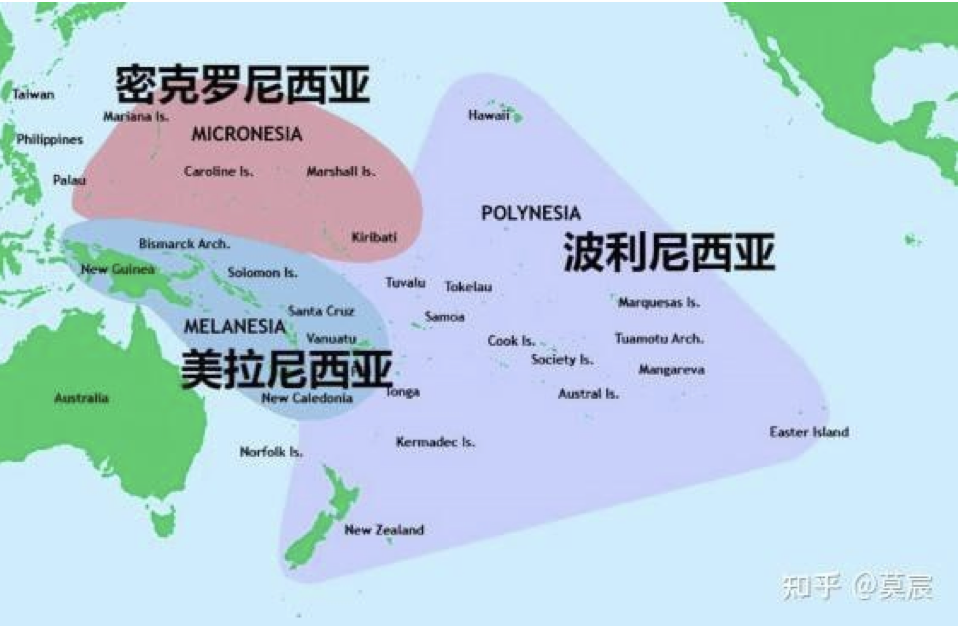
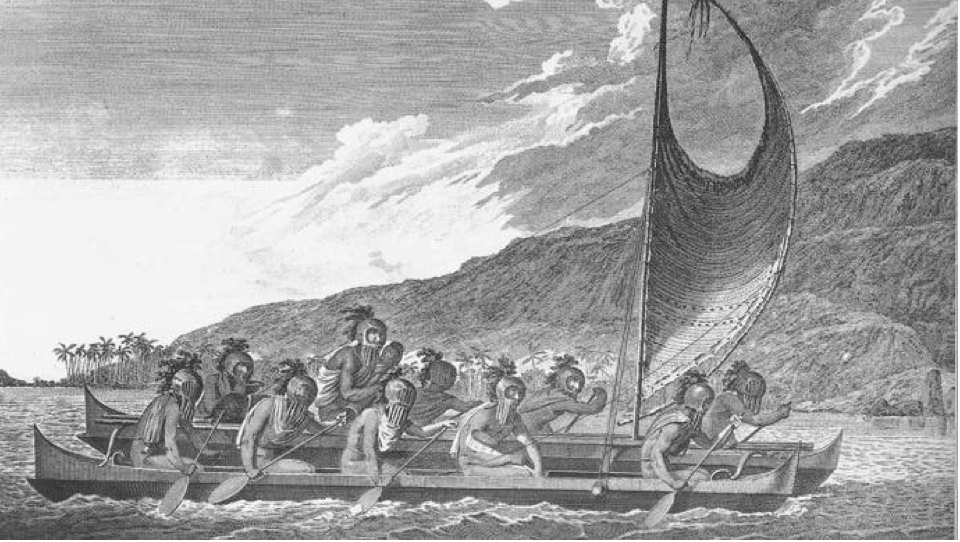
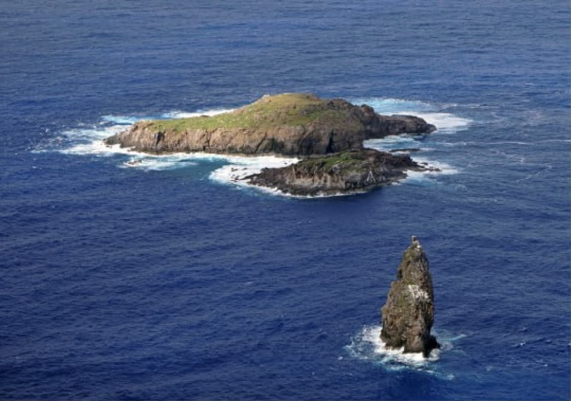
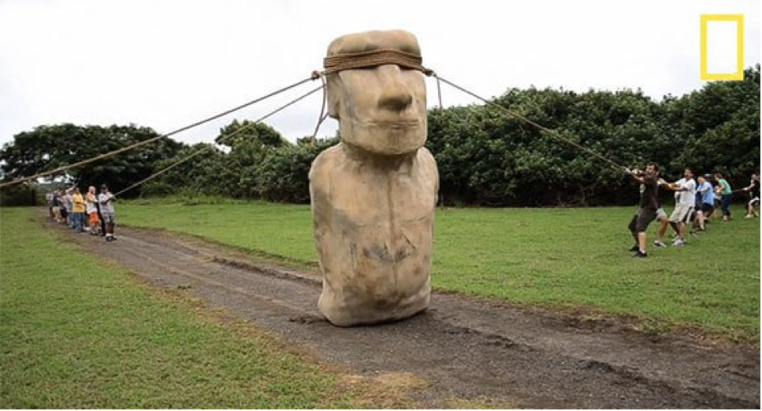

慈母败儿，善人败家，仁政败天下。
是的，我复活了，为了庆祝这值得纪念的一刻，我们来聊聊复活节岛的故事。复活节岛的悲剧昭示了人类面临的最重大的威胁，而对抗这一威胁的不当措施本身又构成了另一个极度残酷的图景。以最坦诚包容的心态审视人类历史中最黑暗血腥的教训，是理解和化解这一威胁的先决条件。

复活节岛，又称拉帕努伊（Rapa Nui），是南太平洋中的一个岛屿，也是世界上最与世隔绝的岛屿。离复活节岛最近的定居点是皮特凯恩群岛（50人），两者距离2,075公里，而南美洲大陆西侧的智利，则与之相隔近3,700公里。复活节岛由三座火山组成，面积仅有163.6平方公里，但在16世纪时却有近20,000人，人口密度为122人/平方公里。
这个人口数据很重要，作为对比，今天的夏威夷人口密度为82人/平方公里，甚至低于当年的复活节岛，而军事重镇关岛，人口密度冠绝太平洋诸岛（东亚和东南亚所属岛屿不纳入评比的情况下），在有大量外来物资和人口持续输入的情况下，密度也才297人/平方公里。再作一个更惊悚的对比，16世纪时中国处于明朝，公元1600年，也就是16世纪最末期，中国处于万历年间，按照《明实录》的统计，当时人口不过6000万左右，而且还处于前后时期的一个高点，换算人口密度大约为6人/平方公里，仅为同时期复活节岛人口密度的1/20！即便是今天这个已经人满为患的中国，人口密度也不过148人/平方公里，仅比500多年前的复活节岛高1/6。在农业技术如此发达的今天，中国尚需大量进口粮食，你猜猜看，当年复活节岛上的人靠吃什么活着？
复活节岛自16世纪以来遭遇了严重的生态崩溃，诸多动植物灭绝，再加上西方殖民者的入侵，人口一度锐减到巅峰期的1%左右，可谓灾难深重、惨不忍睹。关于复活节岛的悲剧成因，有两套主要的叙事：
一是主流叙事。我实在不想大段抄引这些浅薄的文字，建议自行百度补充背景知识，方舟子也曾写过这方面的内容。简而言之就是，复活节岛的居民都是不懂得与自然和谐共存的野蛮人，因为他们的乱采滥伐，导致了棕榈树和多种鸟类的绝种，所以遭到了大自然的报复。我们后人一定要吸取他们的教训，好好保护我们的地球家园，巴拉巴拉……
二是新兴叙事。某些人认为苛责当地居民是不公平的，复活节岛崩溃的主要原因还是赶上了近代小冰期带来的气候模式变迁特别是降水减少。同属太平洋，复活节岛近年的年降水是1150毫米左右，而夏威夷主岛繁华的东部地区年降水超过3000毫米，关岛和大溪地都在2000毫米到2500毫米之间波动。要知道，大洋上的降水可不受当地植被影响。
这两种叙事都是挂一漏万，错得离谱。复活节岛的生态崩溃，本身当然是自然和人为双重因素导致，但所谓的人为，并不是因为他们太野蛮，恰恰相反，是因为他们太文明。复活节岛的文明程度，高到令人叹为观止，从某种意义上来说，超过当时全球任何一个地区、国家和民族，而这种高度发达的文明，就是他们灭亡的主因。
复活节岛有三大文明奇迹，分别是红薯、文字和鸟人，至于闻名世界的摩艾石像群，只不过是无聊之中的消遣罢了。
红薯是人类最高产的农作物，能够以最小的土地养活最大的人口，是近代包括中国在内很多国家人口膨胀的基础动力，复活节岛超高的人口密度，也是红薯的功劳。但红薯为什么可以被称为复活节岛的文明奇迹呢？很简单，因为红薯原产于南美洲，而复活节岛是红薯向亚太地区传播的第一站。
如果你回顾前文的话会发现，复活节岛与南美洲之间的距离是3,700公里，复活节岛的水手们驾驶着双体独木舟跑了一个往返。创造此项世界纪录的时间是13世纪初期，而哥伦布发现美洲新大陆的时间是1492年，两者相差两百多年，更遑论双方的人力物力特别是船舶大小的差距了。
有小白可能会问了，为什么非得说红薯是复活节岛的水手带回去的呢？为什么不可能是南美洲的印第安人送过去的呢？很简单，因为复活节岛的居民，叫做波利尼西亚人。
在古代，波利尼西亚人就是全世界最擅长航海的民族，没有争议，也没有之一。波利尼西亚人进行的是远洋航海，相比之下，东亚、西亚、欧洲的航海都是小儿科。东亚和西亚之间的航线全部都是近岸航行，从来没有深入大洋，而欧洲的罗马和迦太基，不过是在地中海这个澡盆里打转转而已。
虽然今天波利尼西亚人占据了整个东太平洋，但通过考古、基因、语言分析，他们起源于中国台湾。波利尼西亚人先是南下菲律宾和印尼，然后一路向东，直到占领整个太平洋，他们占领太平洋的里程碑就是西太平洋最大的岛屿关岛，发生的时间不晚于公元前2,000年。

这里有必要普及一下关于太平洋岛民分布的知识：他们分为三支，分别是波利尼西亚、密克罗尼西亚、美拉尼西亚，他们全部来自于太平洋西侧。其中密克罗尼西亚是另外两者混血产生，在外形、风俗和语言上都处于两者之间。
从迁徙路径和地理分布可以推测出，来自于台湾的波利尼西亚人虽然很擅长航海，但可能不太擅长打仗，显然他们没有打过来自于几内亚岛的美拉尼西亚人，所以他们丢掉了西太平洋。另一个情况可以作为波利尼西亚人不善战或战败的佐证，美拉尼西亚存在广泛的奴隶制，而且部分地区有食人的习俗，波利尼西亚不存在制度性的奴隶制，而两者混血产生的密克罗尼西亚在居中。这就好像佛教产生于印度，但是由于缺乏武德，最终只能被迫远走他乡。

波利尼西亚人是怎么航海的呢？聪明的他们很早就发现双体船的结构超级稳定抗风浪，所以他们的主要装备是双体独木舟，而且舟上往往装有风帆。而且他们很早就会通过观测星空来定位，他们就是靠着用树枝和草茎编制的“浑天仪”来确保不会在大洋上迷航。至于看风向、看洋流、看飞鸟、看鱼群这些基本功，他们更是不会输于任何种族。
尽管如此，占领太平洋还是花费了漫长的时间。从登陆最西侧的大岛关岛开始（公元前2,000年），到登陆最东侧的大岛复活节岛结束（公元800年），他们花了近3,000年时间来布满整个太平洋。这种大规模迁徙的动机是什么？时过境迁，我很难给出确切的答案，可能是探索的热情，可能是战败的仓皇，也可能是人口膨胀之后的无奈，更可能的是兼而有之。
波利尼西亚人波澜壮阔的航海壮举，在复活节岛——南美航线上到达了巅峰，800年前，单程3,700公里，两条连接在一起的独木舟，中间没有任何停靠补给的地方，这是何等惊心动魄的航程？更加难能可贵的是，在经历千辛万苦、九死一生的航行到达富饶的大陆后，还有一批忠贞的勇士选择了返航！为了部落的嘱托，为了远方的妻儿，他们放弃了广阔天地，带着红薯这种最高产的神物，毅然再度驶向万里海涛！
你能体会这批人的内心吗？我词穷了，没有任何比喻能够表达我此时的心情，何等深沉的热爱和坚贞的信念才能让人做出这样的选择？请不要忘记，他们不是不知天高地厚只有血气之勇的莽夫，他们是全人类最优秀、最睿智、最冷静的水手，他们已经经历一切，或许已经有很多同伴葬身大洋，他们知道所有的风险和后果。这批无名的勇士，不逊于人类历史上的任何英雄，如果有人非得说能够批量孕育出这样卓绝人物的民族是野蛮人，请恕我万万不能苟同。
在若干年前，波利尼西亚人到达美洲还仅仅是一个假说，但幸运的是，最近的考古提供了一些铁证。在智利已经发现了具有典型波利尼西亚人特征的古代遗骨，斯坦福大学的生物学教授彼得·维图塞克（Peter Vitousek）在期刊《历史》上表示，“我们绝对确定”，如果要谈论概率的话，南美洲登陆的可能性在 99.9999%。
波利尼西亚人有一个传说，神住在太阳升起的地方，这或许就是他们不断向东探索的精神动力，只不过，南太平洋复活节岛上的居民，比他们在北太平洋夏威夷的同胞走得要更远了一些。
对那些返航的勇士来说，红薯是天赐的食物来源，因为复活节岛并没有礁盘，也不是洋流交汇处，所以渔业资源并不丰富，他们必须靠种粮食和养鸡才能喂饱所有人。当红薯到达之后，复活节岛的人口不出意外开始持续增长，而这就成为一切灾难的源头，世界上最悲剧的事情莫过于此。
说完红薯，我们来看下一个更明显的文明标志，那就是文字——居住在复活节岛上的波利尼西亚人，居然发明出了一套完整的象形文字系统！这完全是复活节岛居民的独立发明，因为波利尼西亚人占据的其他所有岛屿上，统统都没有任何文字。

复活节岛的象形文字
发明文字有多难？我这么说你就理解了，世界上总共只出现过6套独立原创的文字（其他文字的发明都借鉴了邻居），分别来自于埃及文明、巴比伦/苏美尔文明、印度文明、中华文明、希腊文明（是否原创存疑）、希伯来文明（腓尼基字母，但本质是犹太字母，以前讲过这个问题）。除希伯来文是字母文字并衍生出大量其他字母文字之外，其余5者都是象形文字；除汉字流传下来之外，其余4种象形文字都已经灭绝。复活节岛是第7套，再考虑到他们的微不足道的人口规模和与世隔绝的地理位置，这难道不是一个奇迹？要知道，偌大的黑非洲和整个南北美洲，在被殖民之前都是没有文字书写系统的。
仓颉造字而鬼神哭，根据考古所得的实物，甲骨文的实际创制时期一般认为是商朝早期，彼时，华夏往最小说也已经有了中原之地，往最少说也已经有了几百万人口，造字都是一件不折不扣盛事。而复活节岛呢，区区弹丸之地，人口最多不过2万，他们居然也能造出一套文字来，真是令我肃然起敬甚至顶礼膜拜。他们真的不是野蛮人，他们是曾经站在文明巅峰的人的啊。
遗憾的是，随着人口的灭绝和西方的入侵，他们的文字也失传了。殖民者在摩艾石像附近曾经发现过刻满奇异图案的木板，人称“会说话的木板”，但这些木板后来遭遇“文明者”带来的浩劫。在探险家发现复活节岛之后，欧洲的传教士纷纷来岛上传播上帝的“旨意”。他们下令，将这些木板统统烧掉。只有一个当地居民抢下25块木板，将它们钉成一条渔船，逃到海上。后来这25块木板保存下来，成为世界各地著名博物馆的馆藏。这些幸免于难的“会说话的木板”长2米，两边用鲨鱼牙或坚硬的石头刻上方形图案，像鱼、鸟、草木和船桨等，也有一些几何图形。
当然，这些图形还很简陋，不像一般人心目中的文字，但是你和甲骨文实物对照一下，其实大家也是半斤八两了，人家这个字排列得恐怕还要整齐一点。不管怎么说，称其为文字应当是恰如其分的，这绝不是孤立的绘图记事，而是已经有了一套完整的、系统的文字书写体系。除了亚欧大陆和埃及之外，其他任何地方也从来没有发现如此完备的书写符号。

为了表示对文字和文明的敬意，请允许我说点与主题无关的废话。在当地人的语言里，他们的文字叫做朗戈朗戈（Rongorongo），而他们的岛屿叫做拉帕努伊（RapaNui）。这是一个已经毁灭的微型文明，但他们并不野蛮粗俗，毋宁说，他们的问题恰恰在于过于文明，他们不应被贬损甚至遗忘。
最后一个文明的象征是“鸟人”，完整的说法是“鸟人竞赛”，大概玩法是这样的：每年一次，由各个部落的神棍分别推选一名（德高望重的？）候选人，该候选人再挑选不超过两名（年轻力壮的？）助手，大家会进行一场别开生面的比赛，那就是游泳到附近的一个岩石岛屿上，爬上一座不太高但很陡峭的小山，取下一枚鸟蛋并完整带回主岛的指定位置，第一个返回的人所属部落的候选人会获得“鸟人”的称号。

下方这座尖尖的小岛就是取鸟蛋的地方
是不是很好玩，就像综艺节目一样，但跟综艺节目不一样的是奖品，鸟人竞赛的奖品是——王位！
是的，你没有看错，他们就是这么选择全岛最高领导人的，没有战争，没有谈判，没有比武，也没有选举，只有一场娱乐性极佳的比赛。鸟人会同时兼任全岛的宗教和zz领袖，但任期只有1年，我高度怀疑这个领袖只是仪式性的，但哪怕只是个有名无实的空头王，这种产生方式也够惊世骇俗了。鸟人也会为部落带去现实的利益，他的部落能够获得该小岛上下一年所有鸟蛋的专属权，这就是王族的所有经济特权了。
除了已经散佚的信息外，他们仍然能够确认历史上多达86任鸟人的名字，直到这种独特的鸟人崇拜在1860年被基督教传教士镇压为止。
毫不夸张地说，复活节岛上的波利尼西亚人满足了和平主义者、人道主义者所有的幻想和期待，连王位的产生都是通过这样萌化的方式进行的，完全是一个理想的世外桃源。他们一定是一个充满了爱的族群，闻名遐迩的摩艾石像群也是他们和平主义、人道主义的最佳注脚。

在全岛发现了近千个摩艾石像（包括半成品），每一个都重达几十吨，成品会被运至海边面向陆地站立，而半成品散见于采石场和运输的路途中。成品中最高的石像高10米，最重的石像重86吨，而半成品中有更多的巨无霸，最大的一个达到了21米高，160吨重。
由于复活节岛展现在西方殖民者面前的落后面貌，他们无论如何也不相信这些“野蛮人”可以完成如此惊人的工程，所以在很长时期，一直有一个传说——摩艾石像群是外星人的作品。但这个荒诞的说法终于被推翻了，因为后人发现了当地的采石场并找到了石像运输通道，大量半成品和散落周围的加工工具，确凿无疑地证明，这些石像就是当地岛民的杰作。
然后西方人就开始对岛民的另一轮污名化，他们说，正是因为岛民砍伐大量树木来运送这些巨大的石像，所以导致了岛上森林的毁灭。西方人天然假设岛民是采用古埃及人运送巨石的方式来运送石像的，即用几根巨大的滚木垫在石像下方，这当然意味着可观的砍伐量。但这个说法现在也被证伪了。
根据岛民的口头传说，摩艾石像是从山上“走”到海边的，这当然很匪夷所思，但是复活节岛博物馆馆长（当地土著，或许也是土著中文化水平最高的人）根据这个说法进行了研究，发现这就是事实。他认为，石像的搬运方式并不是借助于滚木，而是借助于绳索，通过绳索的拉动，使石像左右交替向前挪动，只要拉绳索的力量足够稳定，就能使石像在任何崎岖地形上“走动”。
这个假说得到三个强大证据的支持：
首先，可以发现每个石像底部两侧都比躯干狭窄，呈向内平滑收束状。这种形状显然十分不利于石像的稳定站立，而是更便于使其摇晃，而且在底部两侧确实也能找到大量摩擦的痕迹。这说明岛民是有意识地将其加工成便于“走”的形状，为此不惜牺牲一般而言很重要的石像稳定性。
其次，运送石像的道路并不平坦，也并不宽阔，十分不利于使用滚木搬运重物，而且在道路上也看不到任何被滚木碾压的痕迹。如果说痕迹本身可以被时光消磨掉，但道路全程本身也没有发现任何一根滚木，石像本身和大量工具散落沿途，但却没有任何滚木留下，这无疑是非常不合情理的。
最后，人们直接还原出了用绳索搬运石像的场景，在理想的路况下，最少只用三根绳索就可以让石像“走”起来，对此感兴趣的闲人们在不同的地方已经成功让原版或仿制的石像们跑了不少路。这种搬运方式无与伦比的简便性、安全性和地形适应性再次说明，复活节岛的原住民其实是很有智慧的种族。

那么，最后就只剩下一个问题，那就是，他们为什么要建造这些石像？
斯人已逝，没有人能给出绝对准确的答案，很多人猜测这些石像具有某种宗教用途，这是无比正确的废话。问题在于，具体是什么样的宗教用途？还没有其他的用途？
首先能够确认的是，这不是他们所崇拜的神。原因在于，西方殖民者第一次登陆的时候，海边所有的石像都正常耸立着，而多年后再次登陆时，海边所有的石像都已经被推倒了。岛民显然不会忽然发疯推倒自己所崇拜千年的神，尤其是在并没有另立替代者的情况下，更合理的解释是他们推到了敌对部落的石像。石像群本身在体量和造型上的相似性以及排列的并列性也显示，不存在主神副神之分，不存在位阶差异，它们更像是各个部落的先祖。环顾全球，任何因宗教原因而竖立神像者都会极力凸显神像的独一无二、至高无上，绝对不会由几拨不同的人在一个采石场分头制造各自的神像后再摆在一起。
这些石像的建造带有明显的竞争色彩，联系到上文所讲的鸟人竞赛，我们可以大胆假设：在人力更加充裕的时代，他们可能是用比赛造石像的方式来决定王位的归属，只是由于食物和人口的锐减，他们再也负担不起建造石像所需的人力和体力，所以才改为消耗更少的鸟人竞赛。多组人同时开工，最后并列排在一起，就是为了比较谁家的石像更高大，以便公平合理无争议地确定竞争的胜利者。除此之外，你想不出任何更好的假说了。
而这些石像同时还提供了另一个非常重要的社会功能，那就是以工代赈。在这样一个弹丸之地居住2万人是个什么概念？整个社会绝对提供不了如此多的工作岗位。而他们又不像印度人，他们没有奴隶制，不能靠贱民给主人擦屁股来消耗掉过剩的劳动力，他们只好选择跟石头较劲。他们就是靠着生产这些巨大的石像来消耗掉大量无所事事的小伙子的精力，并且顺便给贫困的家庭提供生计。
他们必然具有某种社会保障机制，否则绝对不可能养活如此大量的人口，再次提醒，他们的人口密度是同时期中国的20倍！他们必然十分热爱和平、关照妇孺，否则只要随便来点小小的战乱，他们无论如何也不可能攀升到如此惊人的人口规模！他们简直是人类文明的楷模，所以他们活该灭亡，正如人类文明活该灭亡一样。
复活节岛的灾难具体是如何发生的？细节已经毫不重要。在这种人口密度下，即便他们万分克制自己的物质欲望，过着最简朴最清贫的苦行僧一般的生活，他们也终将耗尽当地的一切自然资源！
这就是马尔萨斯《人口论》揭示的最基本的规律，不可违抗。冰河期的到来和降水的减少只是加速了当地森林灭绝、生态崩溃的过程，但即便一直风调雨顺，他们也早晚会走到这一天。对复活节岛的波利尼西亚原住民，我个人非常欣赏甚至略有崇拜，他们几乎集人类文明一切难能可贵的优秀品质于一身——睿智、勇敢、忠诚、谦卑、善良、慷慨、诚信、公正……
但他们缺乏了人类文明最基本最核心的一个品质，那就是“残忍”，或者更直白地说，他们不会杀仁，这就是他们的死穴。我一直很喜欢刘慈欣的一句话，“失去人性，失去很多；失去兽性，失去一切。”你必须知道，人类文明的基石就是杀戮，对同类的杀戮，是一个文明得以建立和维持的不可或缺的先决条件。狮子比其他动物杀死更多的同类，所以它们是百兽之王；人类比狮子杀死更多的同类，所以人类是万物灵长。
仁慈？何谓仁慈？不杀生？救助弱小？好吧，比如今天你救助了一条流浪狗，狗在营养充分的情况下一年可以生两胎，一年它会产生10个后代；狗的性成熟非常快，两年后就有大概100个后代；等你接受完9年义务教育，如果你不抛弃不放弃，始终好好照顾它和它的后代们的话，你就能获得1,000,000,000条也就是十亿条可爱的狗子了。好吧这个算法不精确，毕竟公狗不产仔，所以10年你只能得到1千万条狗，20年也才区区100万亿条而已。此时你能怎么办？我相信所有人脑海里都只有一个字——杀。如果不愿意屠杀可爱的狗子，就只好自杀了。
狗如此，人何尝又不是如此，只不过较低的天然生育率拉长了这个过程而已。任何一个社会，都必然存在某种控制人口上限的机制：所以会治乱交替，周期性杀灭；所以会贫富不均，控制增长率；所以会灾荒瘟疫，淘汰弱小者。你救得了一时，但救不了一世；救得了一世，救不了子子孙孙生生世世。从哲学上来讲，每拯救一个人，就是在为将来杀灭十个百个乃至千万个人种因果，当下的每一分善都需要未来无数倍的恶来弥补，否则就唯有大家一起完蛋。很危言耸听是不是？那么就让我们脱离理论探讨，回到现实世界中来看一看吧。
复活节岛于1722年首次被荷兰西印度公司的雅可布·罗赫芬发现，当时岛上仅有2000左右的人口，大概为巅峰时期的1/10，全岛几乎不见树木（考古挖掘证实岛上曾经是有大量森林的），仅有少量低矮灌木。据雅可布·罗赫芬记载，全岛只发现三条小舢板，而且这些船还在漏水，只能进行非常近海的航行，波利尼西亚人引以为豪的双体船完全不见踪影。
这次探险浅尝辄止，大约50年后，另一批欧洲人再次登陆复活节岛，发现岛民正处于野蛮血腥的战争当中。当然，这种对于战争的渲染完全可能是西方殖民者洗白自身罪孽的托词，后世学者对此也颇有争议，但记载下来的一个细节让我很难忘却。据说，岛民们具有食人的习俗，被吃的人包括但不限于战俘和罪人，岛上最恶毒的骂人的话与生殖器没有任何关系，而是“令堂的肉粘在我的牙上。”抱歉必须用敬语，否则发不出来，这种话如果是伪造的，那真是需要很强大的想象力了。
再后来，岛民被屠杀和掠卖为奴，并且像美洲大陆一样，受到了天花的袭击，到1877年，全岛人口一度锐减到只有110人，仅有巅峰时期的0.5%，几乎可以称为灭族之难。你当然可以谴责殖民者，但西方殖民者征服和践踏过很多地方，没有其他任何一个地方遭受过这种规模的人口灭绝。毋庸讳言，当地社会在很大程度上已经自行崩溃了，殖民者到来之前他们就减少了9成人口，而且他们不能组织任何稍有效果的抵抗、救援、治疗、谈判或是逃跑。
这是一个曾经如此辉煌和美好的文明啊，唯有如此，才更加令人警醒，任何情绪的渲染都是多余的，请静静地体会这种反差吧。
我们还可以看看今天正在发生的事情，比如巴以冲突，西方国家大多站以色列，发展中国家大多站加沙，而我想说，这两边都不是什么好东西，或者也可以换个角度讲，这两边都有不得已的苦衷。谁对谁错谁文明谁野蛮丝毫都不重要，重要的是这件事情完全无解，并且是人类将来无解死局的缩影。
巴以冲突不是zz理念问题，不是宗教信仰问题，它首先是一个人口问题，不理解沙加人口形势，就不可能理解这种冲突的原动力。
加沙地带，面积365平方公里，人口高达240万，其中一半是儿童，人口密度超过6500人/平方公里。加沙的人口密度高于中国近50倍，高于北京市4倍多，也高于上海、深圳等任何一个中国城市。如果按国家来对比的话，加沙在全球各国人口密度排名第三，仅次于摩纳哥（不是摩洛哥）和新加坡，但摩纳哥和新加坡是发达国家，加沙则一穷二白基本靠援助过活。
人口密度是静态的，但人口出生率或增长率却是动态的，加沙在这两方面同样一枝独秀。由于统计的问题，联合国这方面的数据没有将加沙单列，而是将加沙地带和约旦河西岸合称为巴勒斯坦一并统计。你需要知道的是，加沙比约旦河西岸更能生，无论巴勒斯坦如何，加沙都只会更加极端。如果不计入撒哈拉以南非洲地区的话，巴勒斯坦的人口出生率和人口增长率长期处于全球第一，从来没有丢失过这一宝座，而加沙在巴勒斯坦中又是强中之强。即便计入黑非洲，巴勒斯坦也稳定处于前列，只有尼日尔、乍得、马里、布隆迪、刚果、乌干达等国能偶尔超越之。直观感受一下加沙人口的爆发力吧，2010年160万，2015年185万，2022年底237万，在13年的时间内人口增长了50%，顺便一提，53%的妇女和44%的儿童贫血。
试问，如果你是一个出生在加沙的普通男性，面对当地极端落后的经济和极端绝望的生活，除了参加哈马斯你还能有什么出路？试问，如果你是一个以色列人，毗邻这样一个不断膨胀的怪胎和越来越多悍不畏死的s战分子，你又能如何心平气和地跟他们讲文明？所以我说他们都迫不得已，所以我说这个问题无解。和平从来都不是解决问题的真正方案，按照过去的增长率，如果和平持续到2050年，加沙的人口会达到540万，如果和平持续到2100年，加沙的人口会达到2500万，2150年到1亿2千万，2200年到6亿。
加沙人能不能不支持哈马斯？哈马斯能不能不要袭击以色列？完全不可能，如果那样的话，在巨大的人口资源压力下，人人为吃饱饭而拼命，而怒火又没有出口，加沙必然会陷入分裂和内战，而其造成的伤害只会比以色列的轰炸更严重。不计后果不计伤亡地对外挑衅，看似疯狂，实则是他们最基本的生存之道，因为人命实在是不值钱，甚至已经成为负资产，消耗在sz中已经是性价比最高的消耗方式了。靠着狂热的搏命突袭，至少可以收获其他绿教地区的支持和捐款，总是要胜过在和自己人争夺一个馒头时死去，更何况还有传说中的天堂和美女在等着他们。
出于悲天悯人的天然软弱性，我曾经为加沙问题设想过一个解决方案，那就是以色列出巨款赎买加沙地带，其他多个阿拉伯国家收钱接人，将当地居民分散安置。不管他们被安置到哪里，都不可能比在加沙的生活更加恶劣了。唯一的问题似乎只在于他们的人口太多了，超过了赎买和安置的能力。但我随即就否定了这个幼稚的想法，因为加沙的人口不是一夜之间膨胀起来，当加沙只有几十万人的时候，以色列既然没有这么做，那么当加沙的人口增长率长期高于以色列的经济增长率的时候，以色列就越来越没有能力和意愿做这样的事情。
对于加沙问题而言，暂时的和平只是饮鸩止渴，只能使未来的战争和杀戮来得更加猛烈，而当你面对一个增长率超过代际更替率并远超自身水准的族群时，大屠杀“几乎”是必然的归宿，一切温情脉脉的遮掩都于事无补，特别是当该族群还拒绝种族融合时。
为什么我用了“几乎”这个词，因为这个问题在理论上还是可以文明解决的，而且是全人类的正解，那就是避孕和节育。
避孕是一个伟大的发明，以杀精替代s人，使得人类拥有了从自相残杀的血池地狱中挣脱出来的可能性。在母系氏族之后避孕发明之前的这段时期，我将之称其为人类文明的初级阶段，这个阶段的所谓文明就是完全建立在s人之上，不能s人则组织架构根本不能存在。这还不仅仅是指杀异族人，更重要的是杀本族人，文明程度的高低首先体现在杀灭比例上，然后也体现在s人的借口和方式上。
立下多如牛毛的戒条，触犯者死，这是古代大国的基操，无一例外；发动毫无把握乃至于莫名其妙的浪战（比如十字军东征），动辄伏尸百万，也是面临人口膨胀压力时的妙招；建立严苛的等级制度，让下层贫弱之民冻死、饿死、病死、累死、难产死，也不失为解决问题的迂回手段。压力必须得到发泄，不是对内就是对外，人口必须得到杀灭，不是直接也是间接。相对而言，外战当然优于内战，间接当然优于直接，那些擅长把子民派出去送死的国家和擅长s人不见血的国家，就比其他国家显得更加文明了一些。
避孕发明之后，人类在理论上就已经进入了文明的中级阶段，但进入的脚步是不平衡的，当一些国家已经出现人口衰退的时候，另一些国家由于经济和宗教的原因仍然拒绝避孕，所以保持了高昂的生育率。这就造成了一个巨大的囚徒困境：如果大家同步降低生育率，那当然很好，世界会变得更加和平安宁，环境资源压力也会较小；但如果我降低你却不降低，那你就天然具备了吞并我的趋势，尤其是在你我之间并没有一条国境线的时候，这种吞并的趋势就变得愈发炽烈，所谓子宫战争，就是这种操作。
上一段所讲的矛盾就是人类目前面临的最基本的矛盾，也是西方左派与右派最根本的分歧。
普通右派的价值观是“关门”，大家各过各的，你要打要烂要生要死都在你自己的地盘上搞，我不关心，更不会干涉，所以右派总是反禾多民的，也总是孤立主义的。甚至在国内他们也要关门，各家管各家，谁的孩子谁养，谁的孩子谁教，孩子出社会就是要竞争的，反对大锅饭，所以右派总是反福利的，也普遍反感左派的快乐教育、平权理论、滥性变性。
普通左派的价值观是“开门”，世界是个地球村，全球化不可阻挡，人权和人道高于一切，欢迎各路可怜人来我们国家避难讨生活，同时支持国家大力输出价值观，也就理所当然会欢迎禾多民和倾向干涉他国事务。在内政上呢，左派最喜欢大锅饭，只要投票支持我，我就制定政策把右派的钱分给你，财政算个屁，反正可以不断提高债务上限，钱哪有人权重要，不够就印就好啦，孩子随便生，一律国家养，最好全部教育成左派。
但上述政见都只是表象，其实西方的精英阶层也早就意识到人口问题的严峻性，很多高层人物都公开发表过要减少人口的言论，比如比尔盖茨、施瓦布、贺锦丽等等。那么问题就来了，他们明明说要减少人口，也在切实采取打针等措施打压本国原住民生育率，为什么同时又在大量引进外来人口呢？这里面道道就深了，往最浅了说，新来的人是最好忽悠的最好控制的，是收割选票把握政权的基础资源。往深一点点说，人口问题人口问题，有人口才有问题，如果一群生物根本就可以不算人口，那么还有什么问题呢？如果能用某种低智商的生物来替代甚至消灭掉低端人口，然后再用高科技手段来炮制这些生物，它们就算有一百亿，也根本毫无反抗能力嘛。请注意，他们心中的低端也就是大众心中的中产，而大众心中的低端在他们心中只是人形工具，根本不是人，但却是值得培养和利用的对象，就好像人类利用最弱的狗来猎取更强的野猪、狮、虎、熊一样。这又好像合纵连横，联合最好控制最没有威胁的对手，先行消灭威胁性比较大的对手，所以，人口替代不仅没有被某些精英抵制，反而受到了他们的热烈拥抱甚至积极推动。由于本人身在美国，而这边对言论的控制也相当严厉，所以我不能说太多了，懂的人自然就懂，不懂多说也无益。你当然可以当这是阴谋论，但麻烦你提出一个更加合理的利益动机来解释他们的迷之行为，可千万不要告诉我他们是为了崇高的理想啊。
这个世界的黑暗、无耻和残酷远超99.99%的人的想象力极限，所以无知的确是种莫大的幸福，至少可以死得安详一些。灯塔不仅可以带来光明，也可以带来灯下黑。这就不得不谈到著名但却飘渺的深层zf问题，首先必须肯定的是这个玩意儿的确存在，如果对这点都还存疑，请马上放下我的文章，先回幼稚园补课。但它也像其他的普通的zf一样，并非铁板一块，而是有着差异化的利益和诉求，否则的话它早就一统天下了，别人还忙活个什么劲呢？
深层zf当然比普通人聪明，所以他们早就认识到人口膨胀带来的问题，并且积极地在美国开展jh生育工作。这个说法是不是很新奇？但美国的确有jh生育并且由来已久，他们叫做Birth Controlling Program，只是人家的做法比较温柔，原则上不会强制，而是采取高强度忽悠的方式，公立医院在这方面是有任务有指标的。我老婆最好的一个土人朋友就在生孩子后被他们忽悠地连打了三针长效避孕针，结果各种内分泌不调，一个月有半个月都在来例假，以至于三十多岁就把子宫切了，成功实现了永久避孕。惭愧地坦白，就连我本人也中了招，老二出生后，一群医护人员围着我老婆拼命灌迷魂汤，把他们的针吹嘘得天花乱坠，什么只管三个月绝无副作用之类，于是她就稀里糊涂扎了一针。结果副作用不是一般的大，简直让人痛不欲生，还好她身体底子很好，在拒绝继续打针过后调理了过来，还是顺利地怀上并生下了老三，但这个过程也是够惊险的。
但深层zf很快就发现，这种方式不带劲，因为人是活的，打了一针不爽就不会接着打，很多人都不会接受完整的绝育疗程，他们又不敢直接上一针就断根的猛药。于是他们就开动脑筋，借助天赐良机开展了全民强制打针活动，打两针不过瘾还要继续加强，最终顺利地实现了整个西方生育率的断崖式下跌，而我之前所在的塞班岛，也在针后短短三年内实现了生育率的腰斩。有人可能会问了，西方各国近年来的生育率虽然在下降，但讲“断崖”也太夸张了吧？一点都不夸张，数据都是靠难民撑起来的，就这样还在下跌，真实情况可想而知。可以说，西方各国的生育结构已经永久性地发生了改变，无论是在北美还是在欧陆，白人在可以遇见的将来必将沦为少数。
所以说“仁政败天下”，福利主义当然是不折不扣的仁政了，但过多的福利不仅使国民懒惰愚蠢，而且极大劣化了人口结构。这不是败天下又是什么呢？好在败的是他们的天下。宋朝也是类似的情况，崇文抑武、慎杀宽刑、老幼皆有所养（宋朝有公立的敬老院和孤儿院），可以说是我们古代最文明的一个朝代，所以，宋朝自然只有最狭小的领土，活该遭受最屈辱的历史。bz只会亡国，只要血性不灭，天下就不会亡；仁政的确能延续国祚，但侵蚀的是天下的根基，虽然能推迟乱世，但当乱世真的来临时，就是十倍百倍乃至于永远无法恢复的伤害。宋朝就是放大版的复活节岛，复活节岛就是微缩版的宋朝，精致、文明、温和、慈善，以至于用狭小的领土可以养育大量人民，最终就只能走向彻底毁灭。
天行有常，不为尧存，不为桀亡。宠溺儿女、强充好人（如本人之乐善好施，结果往往斗米养仇）、滥施仁政（如仁君邦之两少一宽，结果西陲板荡）都是要遭报应的，你还得祈求报应早点来，因为报应越晚就越猛烈。
善既是恶，无原则的善意和慈悲，如珠玉杂陈于光天，如美人裸行于暗巷，分分秒秒都在召唤着庸人们铤而走险，你得到的只是一个善的虚名，却为这个世界召唤了大量的肆意妄为、恩将仇报、厚颜无耻的恶行。
恶既是善，有原则的恶意和严苛，如长堤之于洪水，如索套之于犬马，无时无刻不在约束着庸人们的恶念，使其只能规规矩矩好好做人，你或许会得到一时的怨恨，但却使大量朽木顽石成为了有用之材，可谓善莫大焉。
所以“棍棒底下出孝子”，所以“治乱世用重典”，所以“没有霹雳手段不显菩萨心肠”。
讲到这里，可能又有新读者会认为我是马基雅维利主义和社会达尔文主义者，我欣赏他们的一些思路，但我并不赞成他们的结论，因为我有更高级的意识形态，我将其称其为仿生政治学，这才是天道。
人类文明的进化就和生物的进化一样，不仅有竞争和淘汰，也有合作和妥协，在本人之前的进化论者往往只注意到了前者而忽略了后者。生物进化的关键一步就是由单细胞生物聚合成多细胞生物，这是高等生物产生的基石，而人的进一步聚合，也是更高等的文明产生的基石。
在多细胞生物首次成型的阶段，细胞们不得不大幅度降低了自身的分裂速度，不得不减少彼此间的恶意，不得不给暂时无用的细胞、组织和器官也提供少量养分。如果无限增殖不作任何限制，这个多细胞生物就会得癌症；如果不抑制彼此之间的攻击，这个多细胞生物就会死于自身的免疫系统；暂时无用不等于永远无用，如果不滋养它，该器官就会衰竭。
竞争仍然存在，但变得温和了很多，用进废退，常常得到锻炼的器官会更强壮，长期无用的器官会萎缩，但这个过程变得相当漫长。而且对于每一个新生的生物而言，那些“无用”的器官又会再次得到证明自己的机会，直到千万代都无用，才会被彻底淘汰掉。
人类文明的进化也是一个不断聚合的过程，试想一下，成千上万的人如果就像一个人体内的细胞们一样，虽然能力与分工有差异，但却完全同心同德，那是一种怎样的力量？但这种同心同德在目前是不可能发生的，个人的大部分精力事实上都消耗在了与他人的猜忌和斗争当中，这是一种浪费，也是必须突破的桎梏。突破桎梏不是靠爱，而是靠理性指引与规矩约束。
首先，繁殖不受约束的族群必然不能被纳入未来文明，因为他们就是文明的癌症，从这种意义上来讲，我是绝对支持jh生育的，我反对的只是粗暴愚蠢的计划，无论是东方的还是西方的。我的jh生育方式在以前的文章中已经详细讲解过，这里就不再展开了，仅仅强调一个基本点——不能将后代养育成文明人的人不配享有人权。这是防止人类文明癌变的基本规则，每个成年人必须考虑到自身的资源状况，并对子女的成长负责，如果光生不教甚至养都养不起，那他就不应该被当作人来看待，而应该视作野狗一样的存在，此时强制绝育已经是最温柔的处理手段。如果一个族群都不能主动限制自身的生育率，那么显然该族群不能被纳入文明世界，而应该采取动物世界的规则，任其自身自灭甚至杀出一个新天地就是最大的慈悲。其实说穿了，jh生育又有什么不对呢？少生是为了少杀，多生必然多杀，此乃大善啊。
现在世界人口已经很多了，一个国家或者民族被当作文明的一份子的基本标准就是，总和生育率降低到世代更替率以下。以此标准，现在的巴以战争就是野蛮人之间的古典式争斗，根本不值得过多的关注，我等几天会写一篇更深度的文章来分析巴以纷争的逻辑，看过了之后此生就不用再关注这个问题了。你不需要在楚汉相争或是十字军东征中选边站队，就算两条狗在打架，你也没有必要非得支持其中的一条，对于还没学会节制生育的族群而言，s人乃至于大规模s人从来都是最基本的生存手段而已，无需诧异，也无可厚非。
本篇文章杀气很重，但其实我是不提倡以杀戮来实现优胜劣汰的。如果是在古代，各国随便杀来杀去其实也无不可，但现在的技术条件不同了，核生化武器的存在和人工智能武器的崛起，使得战争尤其是大国之间的战争不再是优胜劣汰，而是优劣一起淘汰。因此，人类已经进入到必须深度融合的关键节点，过于惨烈的斗争只会毁灭整个人类的生存空间。
所以，我们就可以得到文明族群的第二个重要标准，那就是不拒斥与其他种群的融合。这里所说的融合，归根结底是文化的融合，但其重要表象和实现途径，却是血缘的融合，即在自愿选择的情况下，允许本族群的人与异族通婚并接纳他们的后代。禁止与异族、异教通婚的群体不应当被视为文明的一份子，因为他们的本质即是极端排外和种族主义的，在他们的理想世界里，其他一切不同族、不同教的人类都不配为人，最终都逃脱不了灭亡的宿命。与这些族群讲和平与人道是没有任何意义的，对他们而言，任何和平都仅仅是喘息壮大的备战时间，任何人道都不过是麻痹敌人的花言巧语罢了。他们从骨子里不需要和平，因为他们只相信末日审判，是的，我说的就是一切没有经过世俗化改造的一神教。对于此类族群，如果地球上尚有生存空间，那么就应该实行严格的隔离制度，直到他们改变，或是灭亡；如果已经没有更多的生存空间，那么最后的结果一定是你死我活。
节制生育和包容异族是人类文明走向更高阶段的两条腿，不满足这两个条件的族群理应被历史遗弃，在其不主动挑衅的情况下，可以允许他们在角落里苟延残喘。不是所有的低等生物都能进化为高等生物，也不是所有族群都有资格搭上文明升级的便车。文明是理性的产物，离不开标准与取舍，从最终效果而言，“爱所有人”和“恨所有人”没有任何区别，“救每一个人”和“杀死所有人”也是殊途同归。如果你觉得这个论断过于难以接受，请再想想复活节岛吧，忠勇的水手征服了万里海涛，睿智的祭司发明了象形文字，他们难道还不够优秀和文明吗？他们唯一缺乏的，就是及时放弃的决断，如果他们放弃应该放弃的多余生命，放弃甜美醉人的和谐氛围，最后的情况何至于此？
西方所谓的左派与右派，本质上不过是两群不同的傻瓜而已，他们所有的意识形态都经不起逻辑的推演和历史的考验。左派像一个饕餮，希望包容世间的一切，不管是毒药还是尖刀都吞进腹中；右派却在玩绝食，顽固地拒绝一切外来营养，连朋友和盟友都不需要。你说他们谁更正确？
其实，数十亿年的进化已经昭示了一切，就连狗都懂得这个基本常识，吃（包容/接纳）一切是要死的，一切都不吃（包容/接纳）也是要死的，只有选择适合食用的东西来吃才能活下去。唉，人不如狗啊！

正文就到此结束了，顺便向老粉丝汇报一下我的个人情况。由于不可说之事和不可抗之力，我消失了一段时间，很多朋友的信息都没有回，非常抱歉，如果愿意的话可以重新给我发信息。在这段时间里，由于外界的阴差阳错和自己的行差踏错，我有幸观赏了一系列人性的至暗面，经历了最无耻的背叛，也见识了最险恶的阴谋。从中国人到美国人，从最高层到最底层，各有各的烂法，但不要脸却是惊人的一致，所以说人性真的都是相通的，无需妄自尊大，也不该妄自菲薄，只须平静面对和合理利用。近两年来，由于环境的特殊性和我热心慷慨的性格缺陷，我无私、谦逊且不求回报地帮助了身边很多人（大部分是跑路的td客，也有少量看似很体面的精英人物），有的可以说是恩同再造，但遗憾的是，感恩者寥寥，绝交者众多，有的甚至搞成了生死大仇，过程真是无比魔幻。升米恩，斗米仇，古人诚不我欺，这些事情都怪不得别人，只能怪自己的愚蠢和天真，对人性既然还存有幻想，就该当交这个学费，或许以后我会写一部《关岛往事》，纪念一下这段匪夷所思的鬼畜经历。痛定思痛，在对人性有了更充分的认识后，我觉得还是要从低华的泥潭中挣脱出来，继续我的写作生涯，不过以后不会再谈论国内的事情了，望诸君理解，而是谈谈风月、骂骂美国、聊聊人性，有心力的时候也会写一些纯哲学和zz理论方面的内容。
人总是要吃饭的，前段时间输得一塌糊涂，所以会员费也还是要收的：初级会员，200元，含公开文章合订本、初级会员群、1个提问机会；中级会员，800元，含公开文章合订本、私密文章合订本、中级会员群、3个提问机会和半小时电话咨询时间（真是吐血甩卖）；高级会员，解答世间万物，先加中级再说吧。

