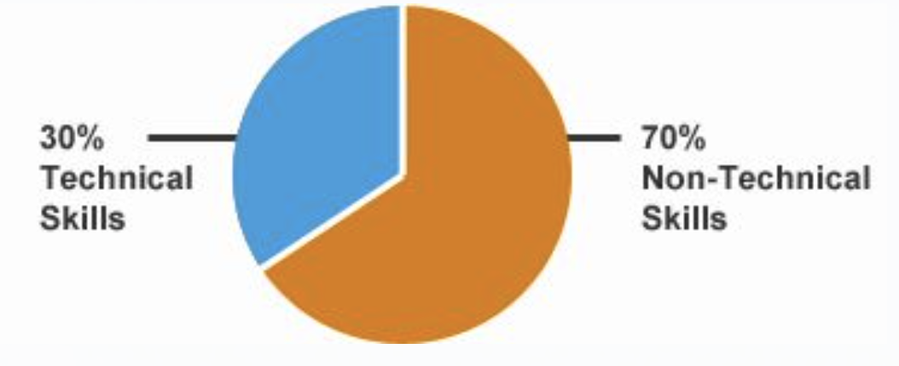

程序员在编程的时候难免会发生这样那样的错误，对此，我们除了从错误中吸取教训，还可以从前辈得到的经验，避开这些错误。
## 一、不提升非技术技能
我们认为非技术技能是项目成功的主要因素。这些非技术技能也可以称之为“软技能”，总体上来说，它已经被公司证明为能够驾驭企业和客户之间的长期商业关系，因此也能决定公司的成长发展路径。一些关键的软技能指标包括：

a.纪律——这是最重要的特征之一，缺乏纪律，最终会让这个开发团队在开发能力上“缺乏自信”。解决这一问题的矫正方法就是每天制定详细的to-do清单：兑现你的承诺、完成你开始做的事情、避免多重任务，因为这些往往会让你的生活产生混乱。
b.顾客的声音——不把客户置于决策的核心地位只会跟你们业务的原始目的相冲突。如果客户不高兴，即使你拥有世界上一流的专业知识和资源也不会起什么作用。保持符合客户期望的解决方案、及时交付才能体现出项目的真正价值。
c.沟通——尤其是当客户和供应商并不在同一地点的时候，明确而及时的沟通是填补服务空白的极好措施。主要集中在这三个方面你就能克服问题——进行主题讨论、清晰表达、干脆简洁。
d.了解需求——在整个开发生命周期过程中，决定成功和失败的之间的一个至关重要的区别将会给人留下深刻的印象。通过最初的头脑风暴法了解问题状态，以及后续的交货程序，这其中都要和客户完美配合。只有这样，客户才会赞赏你的工作，给你好评。
## 二、对编码不理智
古人云：善泅者溺，善骑者堕。但估计绝大多数 的程序员都认为自己的编程技术绝对的牛。而同样真实的是，每一个代码，让不同的程序员去实现的话都会不可避免地发现它所存在的缺陷。所以说，只有通过在一 个项目上的合作，程序员之间必然有的摩擦才能证明谁是最好的。健康的竞争是好事，但它不应该成为一个本来可以成功的项目的负担。

另一个创意阻碍是无法将预定义的模板使用在对你有利的开发项目里。几乎所有的编程语言有一个很好的在线 /内置的代码片段存储库，可以修补代码，防止重新编程。然而，如果因为不理解需求或缺乏接触各种可用库/模板的话，这就意味着程序员最终会无意间将一开始 就创建的代码付之东流。这不仅增加了开发时间，也提高了总体成本。另外一点就是，发布了的代码已经经过了质量检测，所以只有将它用作模板才能发挥它更大的 价值。
## 三、不一定什么都要被理解
如果你是刚调到这个团队来的编程人员，对于手头的工作并不是很熟悉，那该怎么办?肯定是先看一些前任留下来的工作计划，要是他写的详细倒也没什么，如果写的不详细，估计会让你更加的挠头。
因此，推己及人，在需要交代的工作上，最好是把任务写的尽可能的详细。这么做也是非常现实的原因：能够把编程问题解决掉，最好是保证使用解释性的语言和英语发音来表示变量。一些基本的指针可以让你的程序更容易被理解，包括：
a.把所有参数、引用、方法和变量名称尽可能接近英语表达。保持文件名简短但有助于理解的功能。
b.使用++包装文字是一个好办法，能让代码和注释更加清晰。
c.将编写的程序保持在一个连续的流程上，尤其是在使用OOP基础上的语言：C#、C 和 C++。
d.对于不同的代码块使用不同的描述名称。
## 四、不使用经过验证的工具和技术
程序员的好坏从他使用的编程工具和调试工具上就能看出。在异常情况的跟踪上，下面就是程序员经常会出现的常见错误。
对一些可能会对其它代码有影响的常见案例进行捕捉，处理这些比较常见的异常情况(而不是特殊的异常)意味着无意中除除掉了会抑制整个程序的残留部分，因此并不会影响他人的代码。
也许程序员可能带有恶意的意图来捕捉所有的异常情况，但即使是捕捉到了也不实施采取措施，这就是常说的“虚假安全阀”，这种异常处理手段是对整个软件的稳定和安全的一种妥协方式。
## 五、较差的控制版本
在任何涉及多个团队的项目里，当谈到版本控制的时候不去介绍使用最佳实践都是一个十足的罪过。版本控制的目的是确保由一个人执行的编辑或修订不去影响另一个人的工作。
版本控制不仅有助于将由两个或两个以上的程序员的编辑工作合并到一起，还有助于跟踪程序的更改历史。所以说，任何开发团队都应该做一些好的改进措施以确保强大的版本控制，这其中就包括：
为每个解决方案创建一个“逻辑单元”
给解决方案制定描述性的名称
确保你所使用的都是最先进的文件
频繁的向团队分享你所做的各种改变
## 六、拥有最新信息的个人代表不了团队
这是相对有趣的一点，所有的商业产品都想要以自身的敏捷技术和产品文化来给客户留下深刻的印象，但是现 实中很少有厂商会花时间去磨练他们员工在介绍产品特点上的技能。许多公司只是简单地提供了一些基本的培训，并且抱希望与员工在真实的日常项目里学到更多的 技能。所以部门经理和项目的直接领导可以通过以下两个办法来提高员工的业绩：
一旦有新员工加入，就立刻强制安排他参加专业培训，让他知道他的角色是用来干什么的，尽早产生创造力。例如一个测试人与加入之后，就应该向他介绍编程的理念，之后将培训重点放到测试实践上，而不是继续阐述编程的重要性。
现阶段的技术的进化程度比以往任何时候都要快，，所以要记住，定期培训是必不可少的，这是在给团队创造价值。例如一个Web 设计师需要知道响应式设计，提供给设计师大量的用户日常使用的移动设备的不断扩张的样品，希望他们能获得灵感。
七、不恰当的测试
测试作为整个系统开发生命周期(Systems Development Life Cycle，简称SDLC)的重要一个要素，通常不需要开发团队给出太惊人的结果。但是如果在测试环节没有付出恰当的、相应的努力的话，这是说不过去的。 下面的一些方法或许对你的测试团队有用，至少在你们交付产品的时候能够给用户一个好的交代。
单元测试
实物模型
综合测试
八、注意安全漏洞
有的时候在软件开发过程中，就会遇见如下这样的安全漏洞：

A、不同组件之间意想不到的交互作用：a、输入不正确的验证信息;b、SQL资料隐码攻击;c、跨网站指令码;d、命令植入攻击;e、跨站请求伪造(CSRF);
B、难以实施的资源管理，包括：a、不尊重可用内存缓冲区;b、对外控制;c、使用有潜在危险的功能;
九、和客户交流
最初的合同签订后，开发公司通常会忘记每天与客户进行产品上的信息交互，以至于在交货的时候还需要进行升级。两大关键的交流点可以让你和客户保持更好的、更长的关系：
在客户开问之前，开发方应该和客户进行交流沟通。
和客户保持周期性的交流。
十、避免标准实践面临的迫在眉睫的最后期限
通 常情况下项目都会遇到进度延误的现象。然而，这不是说你有理由去偷工减料或者是在开发或测试阶段耍花招，未经测试的模块绝对是一个隐患，会让你的开发团队 名誉受损的。一个更好的方法来管理延迟是提前告知客户并且积极执行延迟计划。只要延期的理由是有效的，客户应该会理解，也会给你额外的时间来解决这个问题。
显然，在项目的最后期限内，急急忙忙完成编程的质量肯定不是特比保险，所以在交付之后开发团队整体上会 花更多的时间和努力来进行跟踪维护，这样的成本也是很巨大的，最好的办法就在一开始就制定完美的执行计划。项目再造所耗费的资源或许是项目本身的成本的好 几倍，任何一个公司宁愿花更多的时间在初始开发上，这样最终的产品一定会符合SDLC标准，并在缺陷和不良问题上有足够的话语权。对于顾客来说，时效性不 能以牺牲质量为代价，永远都不能。