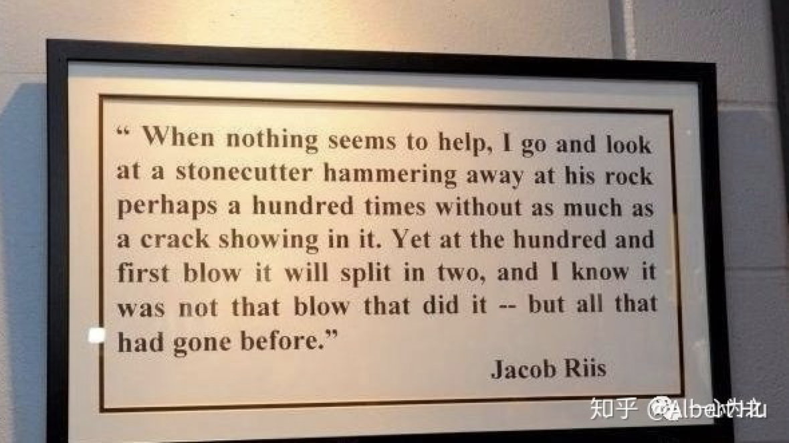

曾经内心如此渴望像匠人一样，有一门可以与外界交流的手艺。我跑去学了烘焙，后来才明白，我们羡慕的不是手艺本身，而是专注做事背后带来的宁静。现在是晚上半小时写字的禅定时刻。外面好像很热闹，其实你还是一个人，现在理解了朱自清的这句话，“热闹是他们的，我什么也没有”。
现在的信息量很大，信息的终端就是接触世界触角，但生活还是需要你活在当下。信息只能协助你判断，学习。你看到的别人的只言片语，并不能得到最终结果，他的经历轨迹和内在思维，所处环境，学不来。你经由你自己的经历才成为你。
如前几年的微博：
没有帮助的：
一个作家极度的追寻生活方式，就是那种活一次的感觉，这没有让我过上那种生活。
看到一个明星得癌症后与病友互相鼓励的历历在目的文字，说要珍惜生命，但也没真正改变我 知道珍惜生命。
一名导演 真真切切的文字，只是他的真。
中国好声音学员的成长故事，也没改变我。
有帮助的：
最早从微博上知道特斯拉汽车，买了特斯拉股票，知道比特币，短暂持有比特币，这种就是学习性。
但凡他人的种种都是他人的，我什么也有。

现在的抖音，能协助你，成为你的工具，可以用他来学习。我的一条抖音视频播放量过1000多万了。
一群人拥在微博上，拥在微信群里，拥在一个活动现场，好像很热闹，但人群终将散去。就如同我们的真实的生活，好像身边围绕着很多人，但真实的只有你自己，所以你自己要用好时间。
信息协助你发现了生活的多种可能性。但生活目标的确定性才是根本，早点定好目标，然后坚持它。时间本身累积能塑造一个人。
想到马刺更衣室那句经典的名言：当一切看起来无可挽回之时，我跑去看石匠重复锤击他面前的岩石一百次，而那块石头连一个裂缝都没有露出。接下来的第一百零一次锤击之时此石一分为二，这不是因为这一次锤击，而是因为你的不懈努力和始终如一。

定好目标 大量的重复，坚持，世上好多事都只差个耐烦地等待而误了自己，马克思不是也说过“要善于忍耐和等待”吗?人，要从小锻炼等待，要耐烦，要乖乖地眼看别人骑车子，舞关刀，打圈圈……我这是真话，你要信，这段话是马克思说的。

以李小龙的一句话结尾：
“I fear not the man who has practiced 10,000 kicks once, but I fear the man who has practiced one kick 10,000 times.” 我不怕遇到练习过10000种腿法的对手，但害怕遇到只将一种腿法练习10000次的强敌。
