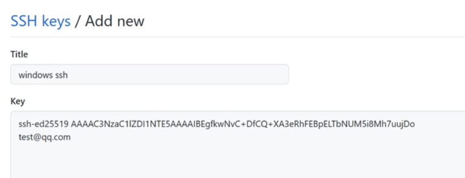

 ## git 配置SSH Key 公钥 私钥

 ### 什么是SSH
- 一种计算机加密登陆的协议，使用非对称密钥实现身份认证（对称密钥是加解密用相同密码，非对称是加解密用不同的密码）
作用:
一般用于远程加密登陆认证，当远程机器拥有公钥，本地持有私钥，登陆就不用输入密码。

 ### 配置SSH

 
1. 检查是否已有密钥:
```javascript
$ ls-al ~/.ssh

// id_rsa.pub
// id_ecdsa.pub
// id_ed25519.pub
```
> 前边的$不用管，之所以命令都喜欢加$是因为下图，bash会自带$


2. 新生成密钥:
```javascript
$ ssh-keygen -t ed25519 -C "your_email@example.com"
$ ssh-keygen -t rsa -C "邮箱"
```
> 后边的邮箱随便填，只是个标识
> ed25519 是密钥的类型


一直回车，生成默认的就行

生成的公钥和私钥还能设置name。

1. 把公钥添加到github中
 执行查看公钥的命令！
 cat ~/.ssh/id_rsa.pub 




 


 
 
 公钥和私钥的原理
1. GIT服务器上存储的是公钥，你本地存储的是私钥，当你push本地代码库到远程代码库，服务器会要求你出示私钥，并且用你出示的私钥和它的公钥配对来完成认证。由于使用的是不对称加密，所以公钥可以公开，只要保管好私钥就可以。路人甲只要没有私钥，所以无法push。这样才能保证开源项目的完整性，