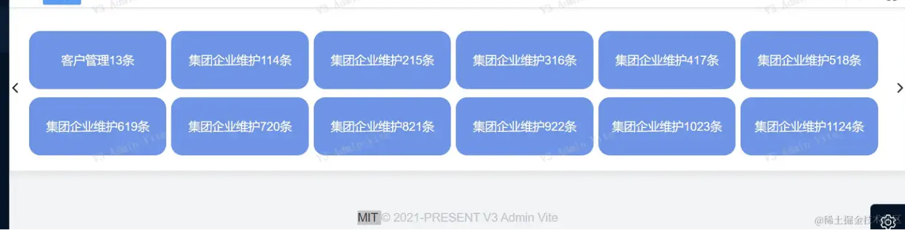

 ## Vue 3 Hooks 封装的技巧

 ### 什么是 Hooks？
在 Vue 3 中，引入了 Composition API，它是一种新的 API 设计范式，为我们提供了更加灵活和可组合的代码组织方式。其中的一个重要概念就是 Hooks。

Hooks 是一种函数，以 use 开头，用于封装可复用的逻辑。它们提供了一种在函数组件中复用状态逻辑的方式，使我们能够更好地组织组件代码，将相关的逻辑聚合在一起，实现更高水平的可维护性。

借用前人的总结：hooks就是集成定义一些可复用的方法，可以随时被引入和调用以实现高内聚低耦合的目标，应该都能算是hook。

 ### 为什么Vue3要用自定义Hooks？
结论：就是为了让Compoosition Api更好用更丰满，让写Vue3更畅快，其实编码体验也是Vue3的优点Composition Api的引入（解决Option Api在代码量大的情况下的强耦合） 让开发者有更好的开发体验。

 ### hooks使用demo
接下来，我将分享一个自己写的比较简单的hooks的案例。先看我实现的一个界面小需求：就是一个横向的数据切片展示，每次展示12条；左右按钮可以切换数据；



文件命名为useLun.ts,记住一定要use开头哦。
```javascript
import { computed, reactive, ref } from "vue";
// cardData里面的数据格式
interface CarDataType {
  title: string
  count: number
}
export default function (){
  // 测试数据，真实的应该从后端接口拿
  const allCardData = [
    { title: "客户管理", count: 1 },
    { title: "集团企业维护1", count: 2 },
    { title: "集团企业维护2", count: 3 },
    { title: "集团企业维护3", count: 4 },
    { title: "集团企业维护4", count: 5 },
    { title: "集团企业维护5", count: 6 },
    { title: "集团企业维护6", count: 7 },
    { title: "集团企业维护7", count: 8 },
    { title: "集团企业维护8", count: 9 },
    { title: "集团企业维护9", count: 10 },
    { title: "集团企业维护10", count: 11 },
    { title: "集团企业维护11", count: 12 },
    { title: "客户管理", count: 13 },
    { title: "集团企业维护1", count: 14 },
    { title: "集团企业维护2", count: 15 },
    { title: "集团企业维护3", count: 16 },
    { title: "集团企业维护4", count: 17 },
    { title: "集团企业维护5", count: 18 },
    { title: "集团企业维护6", count: 19 },
    { title: "集团企业维护7", count: 20 },
    { title: "集团企业维护8", count: 21 },
    { title: "集团企业维护9", count: 22 },
    { title: "集团企业维护10", count: 23 },
    { title: "集团企业维护11", count: 24 },
    { title: "客户管理", count: 25 },
    { title: "集团企业维护1", count: 26 },
    { title: "集团企业维护2", count: 27 },
    { title: "集团企业维护3", count: 28 },
    { title: "集团企业维护4", count: 29 },
    { title: "集团企业维护5", count: 30 },
    { title: "集团企业维护6", count: 31 },
    { title: "集团企业维护7", count: 32 },
    { title: "集团企业维护8", count: 33 },
    { title: "集团企业维护9", count: 34 },
    { title: "集团企业维护10", count: 35 },
    { title: "集团企业维护11", count: 36 },
    { title: "集团企业维护11", count: 37 }
  ]
// 当前卡片数据
  let cardData = ref<CarDataType[]>(allCardData.slice(0, 12))
  let total = ref<number>(Math.floor(allCardData.length / 12))
// 当前页数
  let page = ref<number>(0)
// 点击下一页
  const getRight = () => {
    page.value++
    console.log(page.value)
    console.log(total.value)
    cardData = allCardData.slice(page.value * 12, page.value * 12 + 12)
  }
// 点击上一页面
  const getLeft = () => {
    page.value--
    console.log(page.value)
    cardData = allCardData.slice(page.value * 12, page.value * 12 + 12)
  }
// 是否展示左边箭头
  const isLeftShow = computed(() => {
    return page.value !== 0 // 第一页没有
  })
// 是否展示右边箭头
  const isRightShow = computed(() => {
    return page.value !== total.value // 最后一页没有
  })
  // 一定要返回哦
  return{
    cardData,
    isLeftShow,
    isRightShow,
    getLeft,
    getRight
  }
}
```

在页面中用上面封装命名为useLun.ts的hooks：
```javascript
<template>
  <div>
    <el-card style="position: relative; min-height: 200px">
      <el-icon class="float-left-style" @click="getLeft" v-show="isLeftShow"><ArrowLeftBold /></el-icon>
      <div class="card-container">
        <div v-for="(item, index) in cardData" :key="index" class="card-item">
          <div>{{ item.count }}条</div>
          <div>{{ item.title }}</div>
        </div>
      </div>
      <el-icon class="float-right-style" @click="getRight" v-show="isRightShow"><ArrowRightBold /></el-icon>
    </el-card>
  </div>
</template>

<script lang="ts" setup>
  import useLun from "@/hooks/useLun";
  const {cardData, isLeftShow, isRightShow, getLeft, getRight} = useLun();
</script>

<style>
.time-users {
  font-size: 30px;
}
.contain-hearder {
  font-size: 18px;
  color: skyblue;
  font-style: italic;
}
.contain {
  position: absolute;
  margin: 20% 40%;
}
.card-container {
  width: 100%;
  display: flex;
  flex-wrap: wrap;
}
.card-item {
  width: 16%;
  height: 80px;
  line-height: 80px;
  background-color: cornflowerblue;
  border: white 1px solid;
  border-radius: 16px;
  cursor: pointer;
  margin-top: 10px;
  margin-left: 5px;
  color: white;
  text-align: center;
}
.float-left-style {
  position: absolute;
  left: 0px;
  top: 100px;
}
.float-right-style {
  position: absolute;
  right: 0px;
  top: 100px;
}
</style>
```

结语
在这次的封装过程中，我们展示了如何使用 Vue 3 的 Composition API 来创建 Hooks，总的来说，Hooks 的可玩性是非常高的。你可以根据项目的需求，以及个人的编码风格，发挥出 Hooks 的无限可能，希望你在探索 Hooks 的过程中，能够发现并创造出更多有趣的用法，让你的 Vue 3 项目更加灵活、可维护和具有创造力！