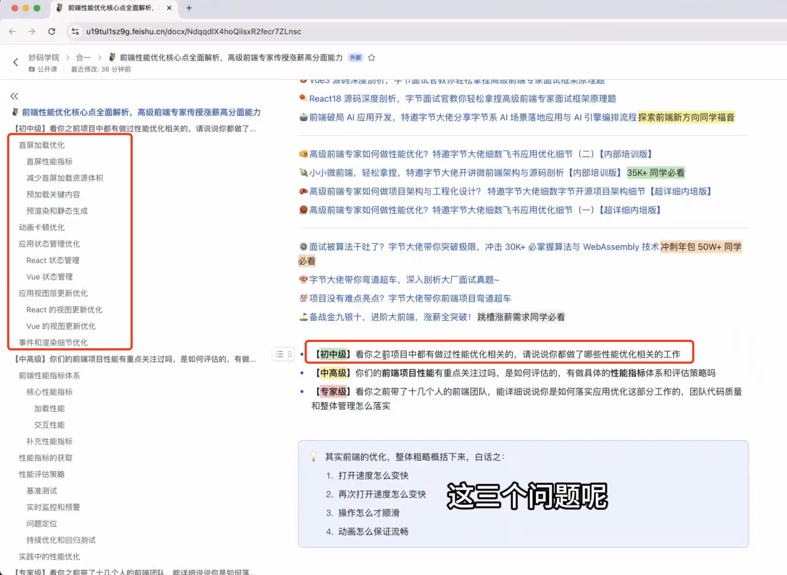
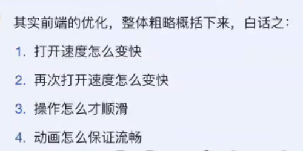
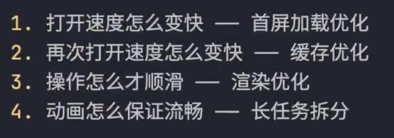
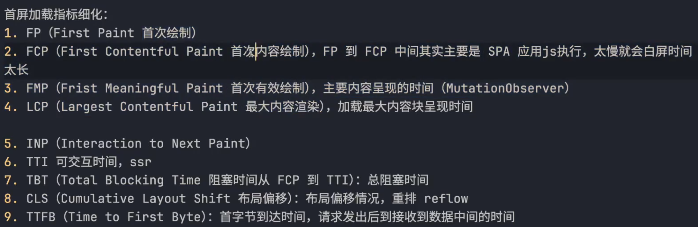

## 看你之前项目中都有做过性能优化相关的，请说说你都做了哪些性能优化相关的工作
主要从以下4点
1. 打开速度怎么变快 - 首屏加载优化
2. 再次打开速度怎么变快 - 缓存优化
3. 操作怎么才顺滑 - 渲染优化
4. 动画怎么保证流畅 - 长任务拆分

## 首屏加载优化面试回答SOP
不要只说从5s变到了3s，如果我是面试官会觉得非常不严谨，
1.先说明问题，没有做首屏优化时存在哪些问题
2.解决了这个问题后，加载的情况好了多少
3.怎么去衡量加载情况好了多少呢

- 首屏优化指标细化

基本都按照资源的体积来处理