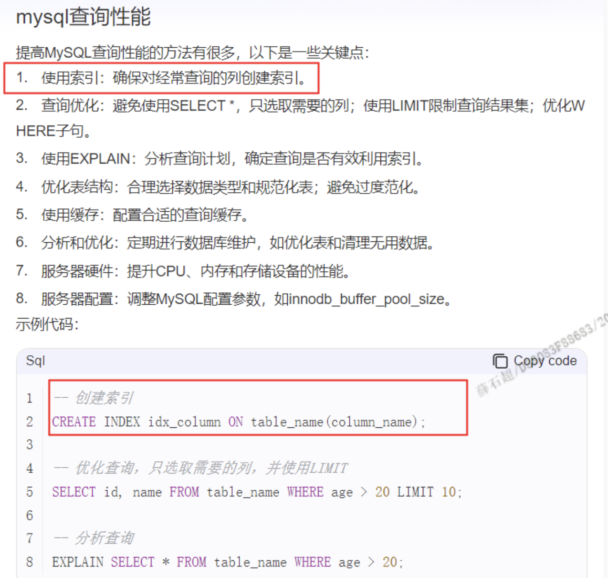

从好未来离职后的面试

### 美团外包

1.笔试题 将数组变为树形结构
已整理，试题id：1730283402378
2.笔试题 事件循环题
已整理，试题id：1730281928932

3.首屏优化到3s内，这个是怎么做的

5.虚拟列表，超出范围内，会销毁掉，这个检测超出不超出是怎么检测的。


### 中信银行外包
1.写了成功提升页面相应速度20%，这个是如何实现的
主要是通过降低首页的体积

2.如何实现首屏优化到3s以内
回答的磕磕绊绊，就说主要是通过降低首页的体积实现的，包括按需加载，将静态图片放到cdn上，开启gzip压缩，降低引用包的体积

3.canvas主要用过哪些方法

4.做过echats图标的优化
滚动加载，分页加载，数据简化

5.eslint代码规范，通常校验代码防范应该从哪些角度考虑
主要是空格数量，加不加分号
js和css相关的规范

6.浏览器内存泄露

7.css的兼容性怎么设置
id: 1741320703237

8.websocket和http有什么区别
id: 1741321318485

9.http和https，http1.0和http2.0有什么区别
id:1741321657000

10.vue的webpack打包优化有了解吗
uglifyjs-webpack-plugin进行js压缩，
analyzer分析包体积
thread-loader 提升编译速度

11.vue中的ssr服务的渲染

12.vue中的全局自定义指令怎么用的

13.keep-alive新增的两个生命周期

14.nexttick

15.vw 和 vh有了解吗

16.qiankun有了解吗
微前端如何嵌套主应用
微前端的生命周期暴露
主子应用通信，和样式隔离


## 中信外包

### 项目中遇到的问题及如何解决的
先自己排查，通过debug，日志打印等方式，或者

性能问题
### v-if v-for为什么不建议一起使用
当v-if和v-for同时使用时，Vue会在每次循环渲染时重新计算v-if指令的值。这会导致额外的性能开销

### for of... , for in 使用
for in 循环的是键， for of 循环的是值

### new vue实例化过程
1.init初始化
2.mount挂载
3.生成虚拟DOM
4.生成真实DOM
最后调用 mounted 钩子


介绍项目从需求到上线的全流程过程
需求评审，评估工期，开始开发，测试，上线

mock数据
### vue响应式原理

面试主要讨论的是vue2相关话题

### 样式优先级
!important>行内样式>ID选择器》类选择器》标签选择器
### vue生命周期以及create和，mounted区别

### promise与async await的区别
id: 1741325321361

面试内容如：
个人介绍，项目介绍，封装组件，项目里使用到的技术实现，代码提交流程及规范
### v~if v-show使用差异性及优先级

### 留意自己简历写的项目上使用的技术
具体实现

### 内存性能优化
‌减少‌全局变量‌：全局变量会一直存在于内存中，直到页面刷新或关闭。尽量使用局部变量，及时释放不再使用的变量。

‌绑定和解绑‌事件监听器‌：在组件销毁时，确保解除所有事件监听器，避免内存泄漏。例如，使用‌Vue或‌React时，可以在组件的destroyed钩子中解除事件监听。

‌监控和分析内存使用‌：使用浏览器的开发者工具或第三方工具（如‌Chrome的Memory面板）监控和分析应用的内存使用情况，及时发现和解决问题。

‌使用‌弱引用‌：弱引用（WeakSet、WeakMap）可以帮助管理DOM元素和函数的内存，避免内存泄漏。当其他对象不再引用某个对象时，‌垃圾回收机制会自动释放该对象所占用的内存。

‌优化‌数据结构‌：选择合适的数据结构可以减少内存使用。例如，使用Map而不是Object存储键值对，可以减少内存占用。

分页加载


### 防抖，截流
已整理
### vuex相关问题， 刷页面后vuex会丢失数据
已整理
### 组件通信
vue通信 id: 1741326457481
已整理
### 数组的方法


### 如果涉及问到是否会java，可以回复能看懂一些，入场后不会参与JAVA开发，因为早期的项目是用类似于JAVA写的，需要能够读懂业务就行
### 有了解相关的数据库，比如mysql查询性能
使用索引，对经常查询的列列创建索引，
优化查询，避免使用select *，选取需要的列，以及使用limit

数据库和java是加分项
### 前后端关于金额字段定义类型
int 或 long：
如果你不需要处理小数点后的数值（即只处理整数金额，比如以分为单位），那么可以使用int或long类型。这种方式的优点是整数运算通常比浮点数运算更快且更精确，缺点是它需要你手动处理货币单位（比如，总是以分为单位存储和计算）。

float 或 double：
对于需要处理小数点后数值的场景，float或double是常见的选择。然而，需要注意的是，浮点数运算可能会引入精度问题，特别是在金融计算中，这可能会导致不可接受的结果。因此，尽管它们易于使用，但在处理货币时通常不是首选。

BigDecimal：
BigDecimal是Java中用于精确小数计算的类，非常适合于金融和商业计算。它提供了对任意精度的十进制数的支持，并且能够执行精确的算术运算。使用BigDecimal可以避免浮点数运算中的精度问题，但相应的，它的性能可能会比基本数据类型稍差，并且使用起来也更复杂一些。

## 天弘基金
1.写一个表单

2.写一个react hooks


## FlexGalaxy.AI面试
### iterator。 
***不知道，知识盲点***

### genetor。
***不知道，知识盲点***

### function 和 箭头函数的区别。

### react中想封装通用逻辑，有几种方式
***不知道，知识盲点***
自定义react hooks，高阶函数

### 做过什么样的高阶组件，可以介绍下
***已经整理过，但没看，而且标题要重新写一下，弄出比较重要的感觉***

### react 提供的hooks都有哪些

### 假设有个网站要实现主题变更，实现办法是什么
***梁涛之前在主播端实现过，你不整理，凡事不求甚解不行***
通过css-vars-ponyfill

### 跨域都有哪些办法

### cors请求和非cors请求，从请求链路上来讲，有没有什么区别

### ts中泛型的作用是什么

### interface怎么排除一个属性
已整理


## 美团到餐面试 一面
1.问了简历中的问题
- 印象比较深的项目介绍下
主播端，基于trtc做直播连麦，屏幕分享，插入视频，因为设计到混流，调混流模板，排查线上问题

- webworker压缩数据说一下

- 通过canvas手动排版
具体用的哪些方法

- websocket重连接

- 学生端的首屏优化

- ppt预加载的方案

- 虚拟列表是组件还是自己实现的，了解原理吗

- 说一下js的异步变成，promise async await

- vue双向绑定的原理，重点介绍下发布订阅者模式是怎么进行的

- 虚拟列表，超出范围内，会销毁掉，这个检测超出不超出是怎么检测的。
也可根据scrolltop算出滚出的举例

- 首屏优化到3s内，怎么做的
已整理，试题id：1730282219548

- 笔试题一：手写Promise.allSettled 方法
已整理，试题id：1730281278640

- 笔试题二：事件循环
已整理，试题id：1730281494330

- 笔试题三：分析this指向
已整理，试题id：1730281564285

- 笔试题四：合并两个有序的数组
已整理，试题id：1730281684597


## 美团到餐面试 二面


## 京东客服系统 一面
- 做项目中有没有碰到一些难点，你自己解决的。
已整理 ID:1730368723174
你说主备机ppt同步，要说清除点，说了半天你自己都弄不清，别人怎么知道，这不是找挂吗

问题，如果主机首次加载ppt比较多，

- vue中提前没赋值，中间用什么能触发双向绑定
 $set

- es6都用到了哪些语法


## 合正面试
- 做音视频都会遇到什么问题，以及怎么解决的
1.卡顿，学生降码率
2.首屏优化的问题
3.学生发言太多，导致卡，用虚拟列表解决

- 怎么实现0.5px线条
先放大后缩小有什么副作用

- react和vue都有什么区别
已整理：1730438241631

- vue2和vue3有什么区别

- 为什么vite打包会快一点

- webpack和vite比较一下

- 都是怎么排查线上的问题
通过arms上报和日志打印，还有复现路径

纯前端的报错也会传到后端吗

在全局加个didcatch这种去捕捉(我也不清楚能不能用)，新版本react捕捉全局错误的方式

- 出个笔试题吧
```
handleClick = () => {
  this.setState(
    (prevState) => ({ count: prevState.count + 1 }),
    () => {}
  );
  console.log(this.state.count);
};

和
handleClick = () => {
  setTimeout(() => {
    this.setState({ count: this.state.count + 1 });
    console.log(this.state.count);
  }, 1000);
};
<p>Count: {this.state.count}</p>

中count显示顺序
```


### 面试准备
跨域；This指向；原型作用域的相关问题；TS实现接口；控制台报错分析；元素定位；
CSS,；右侧自适应，左侧定宽; flex 布局；DOM 和 BOM；函数节流/防抖；冒泡顺序；
cookie的作用；VUE中的用户权限；发布订阅模式；同步和异步的概念；Vue父子组件通信逻辑;  Redux的内容；axios的使用；Axios与ajax的区别；websocket跟ajax区别；了解fetch；
request header；response header；react hooks与class的区别；useMemo；
截流与防抖；Ref与Refs；实现三列布局；div实现水平垂直居中
class生命周期；useEffect的参数介绍以及生命周期；websocket保持连接；


